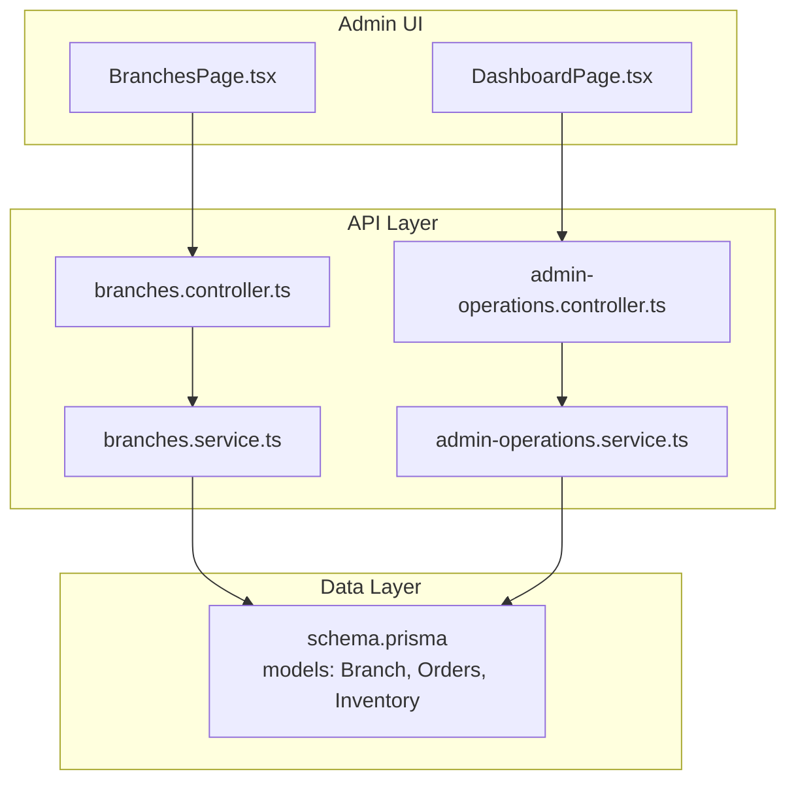
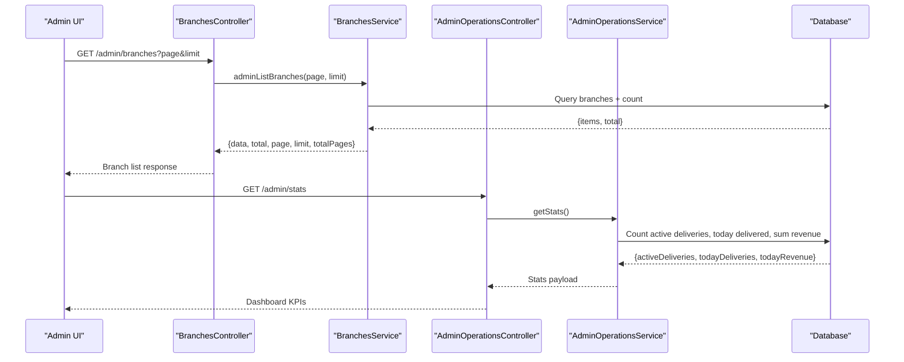
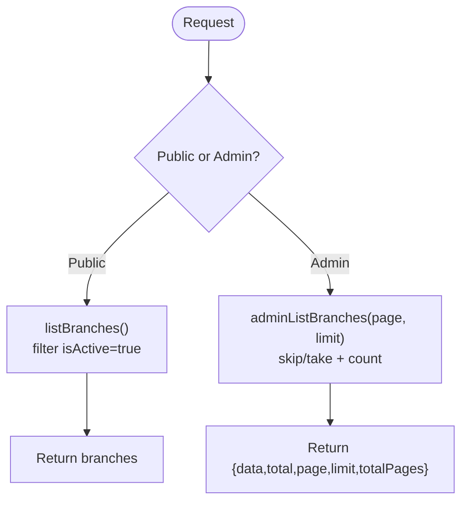
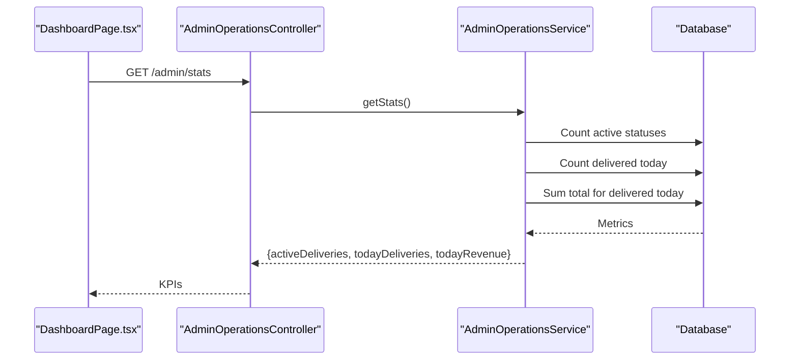
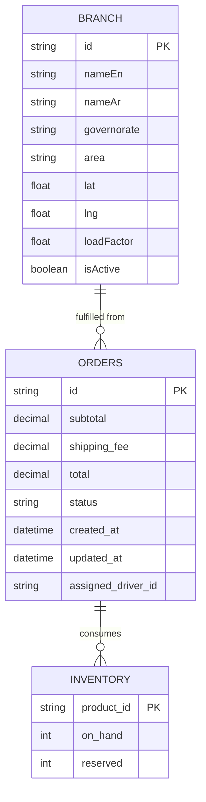
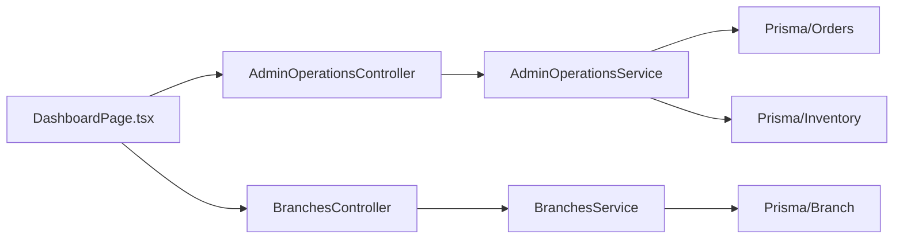

# Branch Analytics & Reporting

<cite>
**Referenced Files in This Document**
- [BranchesPage.tsx](file://apps/admin/src/pages/BranchesPage.tsx)
- [DashboardPage.tsx](file://apps/admin/src/pages/DashboardPage.tsx)
- [branches.controller.ts](file://apps/api/src/modules/branches/branches.controller.ts)
- [branches.service.ts](file://apps/api/src/modules/branches/branches.service.ts)
- [admin-operations.controller.ts](file://apps/api/src/modules/admin/admin-operations.controller.ts)
- [admin-operations.service.ts](file://apps/api/src/modules/admin/admin-operations.service.ts)
- [schema.prisma](file://apps/api/prisma/schema.prisma)
</cite>

## Table of Contents
1. Introduction
2. Project Structure
3. Core Components
4. Architecture Overview
5. Detailed Component Analysis
6. Dependency Analysis
7. Performance Considerations
8. Troubleshooting Guide
9. Conclusion
10. Appendices

## Introduction
This document explains the branch analytics and reporting capabilities available in the system, focusing on how to measure and compare performance across multiple branches. It covers key performance indicators (KPIs) such as order volume, revenue metrics, customer satisfaction proxies, and delivery efficiency rates. It also outlines inventory turnover monitoring, reorder point alerts, sales trend analysis, peak hour identification, capacity planning insights, and guidance for custom report generation and data export to business intelligence tools.

## Project Structure
The analytics and reporting features are implemented across:
- Admin UI pages that fetch and display KPIs and branch lists
- API controllers and services that expose endpoints for listing branches and computing operational stats
- Database schema models that store orders, inventory, and branch information used by analytics queries

**Diagram sources**
- [BranchesPage.tsx:7-10](file://apps/admin/src/pages/BranchesPage.tsx#L7-L10)
- [DashboardPage.tsx:42-52](file://apps/admin/src/pages/DashboardPage.tsx#L42-L52)
- [branches.controller.ts:9-23](file://apps/api/src/modules/branches/branches.controller.ts#L9-L23)
- [branches.service.ts:8-33](file://apps/api/src/modules/branches/branches.service.ts#L8-L33)
- [admin-operations.controller.ts:49-71](file://apps/api/src/modules/admin/admin-operations.controller.ts#L49-L71)
- [admin-operations.service.ts:340-359](file://apps/api/src/modules/admin/admin-operations.service.ts#L340-L359)
- [schema.prisma:556-592](file://apps/api/prisma/schema.prisma#L556-L592)
- [schema.prisma:529-536](file://apps/api/prisma/schema.prisma#L529-L536)
- [schema.prisma:765-784](file://apps/api/prisma/schema.prisma#L765-L784)

**Section sources**
- [BranchesPage.tsx:7-10](file://apps/admin/src/pages/BranchesPage.tsx#L7-L10)
- [DashboardPage.tsx:42-52](file://apps/admin/src/pages/DashboardPage.tsx#L42-L52)
- [branches.controller.ts:9-23](file://apps/api/src/modules/branches/branches.controller.ts#L9-L23)
- [branches.service.ts:8-33](file://apps/api/src/modules/branches/branches.service.ts#L8-L33)
- [admin-operations.controller.ts:49-71](file://apps/api/src/modules/admin/admin-operations.controller.ts#L49-L71)
- [admin-operations.service.ts:340-359](file://apps/api/src/modules/admin/admin-operations.service.ts#L340-L359)
- [schema.prisma:556-592](file://apps/api/prisma/schema.prisma#L556-L592)
- [schema.prisma:529-536](file://apps/api/prisma/schema.prisma#L529-L536)
- [schema.prisma:765-784](file://apps/api/prisma/schema.prisma#L765-L784)

## Core Components
- Branch listing and management:
  - Public list of active branches
  - Paginated admin list with total counts and page metadata
- Operational dashboard KPIs:
  - Active deliveries count
  - Today’s delivered orders
  - Today’s revenue
  - Online drivers count
- Data model foundations:
  - Branch entity with location and load factor
  - Orders with totals, timestamps, and status
  - Inventory with on-hand and reserved quantities

These components provide the foundation for branch-level analytics and reporting.

**Section sources**
- [branches.controller.ts:9-23](file://apps/api/src/modules/branches/branches.controller.ts#L9-L23)
- [branches.service.ts:8-33](file://apps/api/src/modules/branches/branches.service.ts#L8-L33)
- [DashboardPage.tsx:83-116](file://apps/admin/src/pages/DashboardPage.tsx#L83-L116)
- [admin-operations.service.ts:340-359](file://apps/api/src/modules/admin/admin-operations.service.ts#L340-L359)
- [schema.prisma:765-784](file://apps/api/prisma/schema.prisma#L765-L784)
- [schema.prisma:556-592](file://apps/api/prisma/schema.prisma#L556-L592)
- [schema.prisma:529-536](file://apps/api/prisma/schema.prisma#L529-L536)

## Architecture Overview
The analytics flow combines UI requests with backend aggregation over orders and inventory to produce KPIs and branch data.

**Diagram sources**
- [branches.controller.ts:20-23](file://apps/api/src/modules/branches/branches.controller.ts#L20-L23)
- [branches.service.ts:15-33](file://apps/api/src/modules/branches/branches.service.ts#L15-L33)
- [admin-operations.controller.ts:68-71](file://apps/api/src/modules/admin/admin-operations.controller.ts#L68-L71)
- [admin-operations.service.ts:340-359](file://apps/api/src/modules/admin/admin-operations.service.ts#L340-L359)
- [schema.prisma:556-592](file://apps/api/prisma/schema.prisma#L556-L592)

## Detailed Component Analysis

### Branch Listing and Management
- Public endpoint returns only active branches sorted by name.
- Admin endpoint supports pagination and returns metadata for UI paging.
- Single branch retrieval includes associated delivery zones.

**Diagram sources**
- [branches.controller.ts:9-23](file://apps/api/src/modules/branches/branches.controller.ts#L9-L23)
- [branches.service.ts:8-33](file://apps/api/src/modules/branches/branches.service.ts#L8-L33)

**Section sources**
- [branches.controller.ts:9-23](file://apps/api/src/modules/branches/branches.controller.ts#L9-L23)
- [branches.service.ts:8-33](file://apps/api/src/modules/branches/branches.service.ts#L8-L33)

### Operational Dashboard KPIs
- Active deliveries: count of orders in active lifecycle states.
- Today’s deliveries: count of delivered orders updated today.
- Today’s revenue: sum of totals for delivered orders updated today.
- Online drivers: fetched separately via a dedicated endpoint.

**Diagram sources**
- [DashboardPage.tsx:42-52](file://apps/admin/src/pages/DashboardPage.tsx#L42-L52)
- [admin-operations.controller.ts:68-71](file://apps/api/src/modules/admin/admin-operations.controller.ts#L68-L71)
- [admin-operations.service.ts:340-359](file://apps/api/src/modules/admin/admin-operations.service.ts#L340-L359)
- [schema.prisma:556-592](file://apps/api/prisma/schema.prisma#L556-L592)

**Section sources**
- [DashboardPage.tsx:83-116](file://apps/admin/src/pages/DashboardPage.tsx#L83-L116)
- [admin-operations.service.ts:340-359](file://apps/api/src/modules/admin/admin-operations.service.ts#L340-L359)

### Data Model Foundations for Analytics
- Orders: include totals, timestamps, and status fields used for revenue and delivery metrics.
- Inventory: on_hand and reserved fields enable stock level monitoring and turnover calculations.
- Branch: geographic and load-related fields support branch comparison and capacity planning.

**Diagram sources**
- [schema.prisma:765-784](file://apps/api/prisma/schema.prisma#L765-L784)
- [schema.prisma:556-592](file://apps/api/prisma/schema.prisma#L556-L592)
- [schema.prisma:529-536](file://apps/api/prisma/schema.prisma#L529-L536)

**Section sources**
- [schema.prisma:765-784](file://apps/api/prisma/schema.prisma#L765-L784)
- [schema.prisma:556-592](file://apps/api/prisma/schema.prisma#L556-L592)
- [schema.prisma:529-536](file://apps/api/prisma/schema.prisma#L529-L536)

## Dependency Analysis
- The Admin UI depends on:
  - Branches controller/service for branch listings
  - Admin operations controller/service for stats
- Backend services depend on Prisma client to query:
  - Branches table
  - Orders table for KPIs
  - Inventory table for stock metrics

**Diagram sources**
- [DashboardPage.tsx:42-52](file://apps/admin/src/pages/DashboardPage.tsx#L42-L52)
- [branches.controller.ts:9-23](file://apps/api/src/modules/branches/branches.controller.ts#L9-L23)
- [admin-operations.controller.ts:68-71](file://apps/api/src/modules/admin/admin-operations.controller.ts#L68-L71)
- [admin-operations.service.ts:340-359](file://apps/api/src/modules/admin/admin-operations.service.ts#L340-L359)
- [branches.service.ts:8-33](file://apps/api/src/modules/branches/branches.service.ts#L8-L33)

**Section sources**
- [DashboardPage.tsx:42-52](file://apps/admin/src/pages/DashboardPage.tsx#L42-L52)
- [branches.controller.ts:9-23](file://apps/api/src/modules/branches/branches.controller.ts#L9-L23)
- [admin-operations.controller.ts:68-71](file://apps/api/src/modules/admin/admin-operations.controller.ts#L68-L71)
- [admin-operations.service.ts:340-359](file://apps/api/src/modules/admin/admin-operations.service.ts#L340-L359)
- [branches.service.ts:8-33](file://apps/api/src/modules/branches/branches.service.ts#L8-L33)

## Performance Considerations
- Use pagination for large datasets when listing branches or orders to avoid heavy payloads.
- Aggregate server-side (counts and sums) to minimize client processing and network overhead.
- Leverage indexes on frequently filtered columns such as order status and timestamps for faster KPI computation.
- Cache frequently accessed KPIs at the API layer if needed to reduce database load during high-frequency polling.

[No sources needed since this section provides general guidance]

## Troubleshooting Guide
- If branch listing is empty:
  - Verify branches are marked active and exist in the database.
  - Confirm admin pagination parameters are valid.
- If dashboard KPIs show zero:
  - Ensure orders have correct statuses and timestamps.
  - Validate that delivered orders have updated_at within the current day for “today” metrics.
- If revenue appears incorrect:
  - Confirm totals are set for delivered orders and that filtering uses the correct date boundaries.

**Section sources**
- [branches.service.ts:8-33](file://apps/api/src/modules/branches/branches.service.ts#L8-L33)
- [admin-operations.service.ts:340-359](file://apps/api/src/modules/admin/admin-operations.service.ts#L340-L359)
- [schema.prisma:556-592](file://apps/api/prisma/schema.prisma#L556-L592)

## Conclusion
The system provides foundational analytics through branch listing and operational KPIs derived from orders and inventory. These building blocks support branch comparison, inventory monitoring, and capacity planning. Extending these endpoints with additional filters and aggregations enables comprehensive reporting tailored to multi-location performance evaluation.

[No sources needed since this section summarizes without analyzing specific files]

## Appendices

### Key Performance Indicators (KPIs) and How to Compute Them
- Order Volume:
  - Total orders per branch/timeframe using order records grouped by fulfillment source or zone.
- Revenue Metrics:
  - Daily revenue computed as sum of totals for delivered orders within the period.
- Customer Satisfaction Scores:
  - Derive from post-delivery ratings or feedback; integrate with order records to compute average scores per branch.
- Delivery Efficiency Rates:
  - Measure on-time delivery percentage and average delivery duration using order timestamps and driver assignment times.

[No sources needed since this section provides conceptual guidance]

### Branch Comparison Tools
- Compare branches by:
  - Order volume trends over time
  - Revenue per branch
  - Delivery efficiency and on-time rates
  - Stock availability and turnover
- Use branch identifiers and zone associations to segment metrics.

[No sources needed since this section provides conceptual guidance]

### Inventory Turnover and Reorder Alerts
- Inventory Turnover Rate:
  - Calculate as cost of goods sold divided by average inventory value over a period.
- Stock Level Monitoring:
  - Track on_hand vs reserved to identify shortages.
- Reorder Point Alerts:
  - Trigger alerts when on_hand falls below a threshold or when projected demand exceeds available stock.

[No sources needed since this section provides conceptual guidance]

### Sales Trend Analysis, Peak Hours, and Capacity Planning
- Sales Trends:
  - Analyze order creation and delivery timestamps to identify growth patterns.
- Peak Hour Identification:
  - Aggregate orders by hour to detect busy periods for staffing and logistics.
- Capacity Planning:
  - Use branch loadFactor and historical order volumes to plan resources and delivery zones.

[No sources needed since this section provides conceptual guidance]

### Custom Report Generation and Data Export
- Custom Reports:
  - Extend existing endpoints with query parameters for date ranges, branch filters, and metric selections.
- Data Export:
  - Provide CSV/JSON exports from aggregated endpoints for downstream BI integration.
- BI Tool Integration:
  - Connect BI tools to API endpoints or exported datasets to build dashboards and scheduled reports.

[No sources needed since this section provides conceptual guidance]