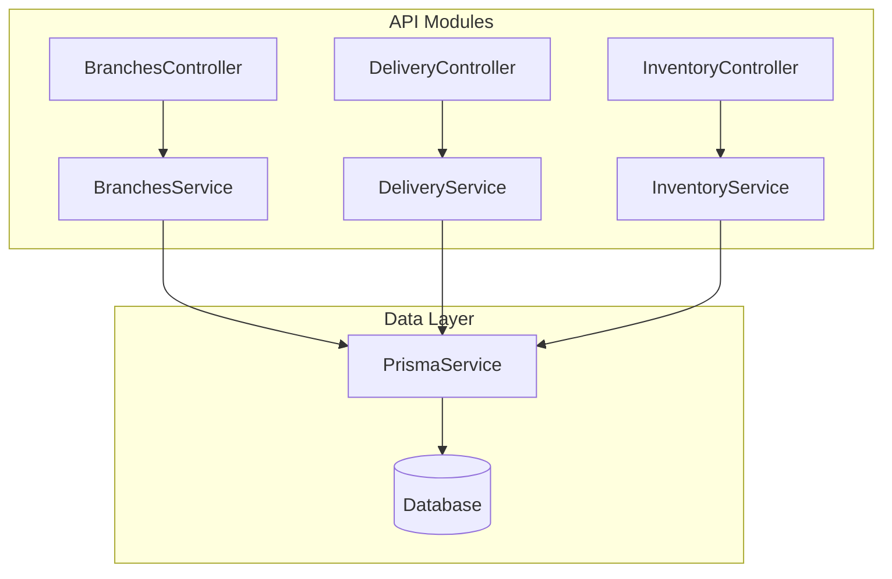
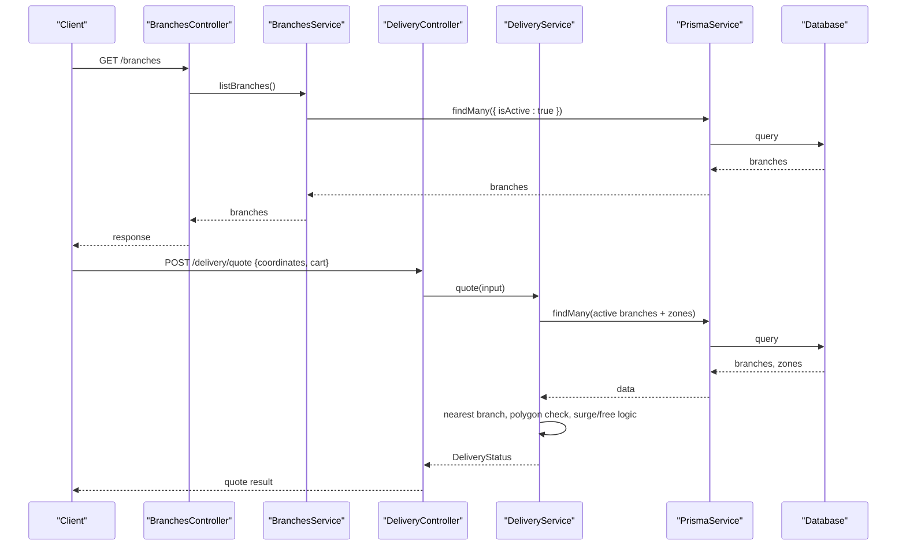
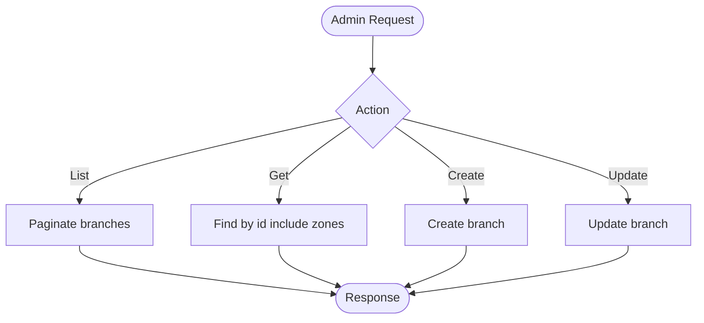
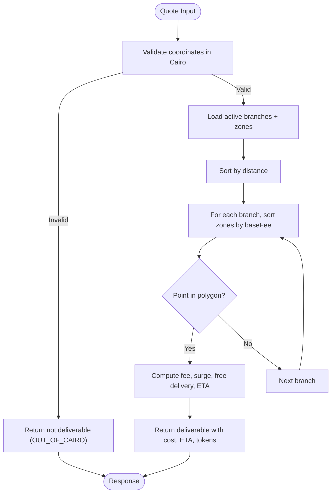
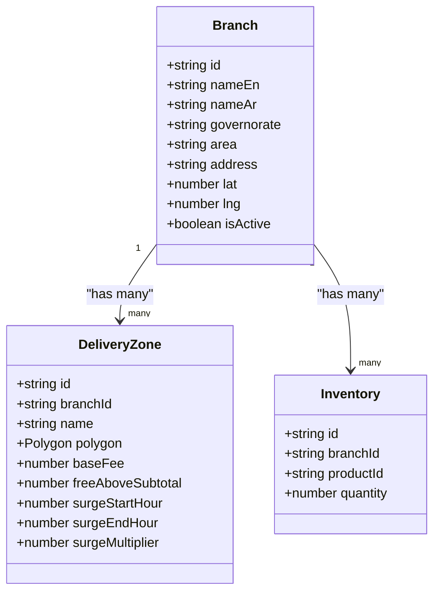
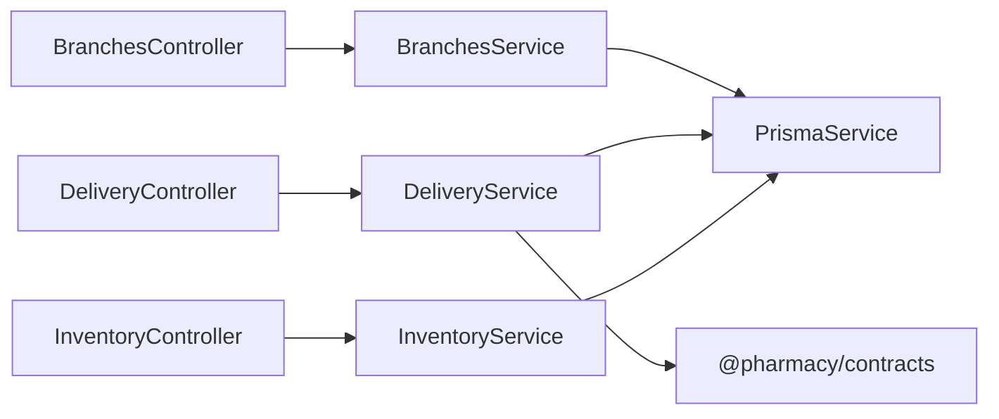

# Branch Management

<cite>
**Referenced Files in This Document**
- [branches.controller.ts](file://apps/api/src/modules/branches/branches.controller.ts)
- [branches.service.ts](file://apps/api/src/modules/branches/branches.service.ts)
- [delivery.controller.ts](file://apps/api/src/modules/delivery/delivery.controller.ts)
- [delivery.service.ts](file://apps/api/src/modules/delivery/delivery.service.ts)
- [inventory.controller.ts](file://apps/api/src/modules/inventory/inventory.controller.ts)
- [inventory.service.ts](file://apps/api/src/modules/inventory/inventory.service.ts)
- [schema.prisma](file://apps/api/prisma/schema.prisma)
- [seed_branches_and_zones.sql](file://database/seed_branches_and_zones.sql)
</cite>

## Table of Contents
1. Introduction
2. Project Structure
3. Core Components
4. Architecture Overview
5. Detailed Component Analysis
6. Dependency Analysis
7. Performance Considerations
8. Troubleshooting Guide
9. Conclusion

## Introduction
This document explains the branch management functionality across the system, focusing on:
- Multi-location support: branch registration, configuration, and operational status management
- Zone-based delivery systems: geographic boundaries, delivery zones, and local inventory allocation
- Branch-specific pricing, product availability, and delivery radius configuration
- Analytics, performance metrics, and operational reporting (as implemented or available via endpoints)
- Branch-to-branch transfers, inventory sharing, and centralized management capabilities

The implementation centers on a NestJS API with Prisma-backed data access, a seed script for branches and delivery zones, and controllers/services that expose REST endpoints for listing, creating, updating branches, and computing delivery quotes based on location and zone rules.

## Project Structure
Branch-related features are organized into dedicated modules:
- Branches module: CRUD operations for branches and administrative listing
- Delivery module: quote computation using branch locations and delivery zones
- Inventory module: admin listing of inventory records (per branch context is implied by schema relationships)
- Database seeding: predefined branches and delivery zones for Cairo

**Diagram sources**
- [branches.controller.ts:5-39](file://apps/api/src/modules/branches/branches.controller.ts#L5-L39)
- [branches.service.ts:4-56](file://apps/api/src/modules/branches/branches.service.ts#L4-L56)
- [delivery.controller.ts:6-15](file://apps/api/src/modules/delivery/delivery.controller.ts#L6-L15)
- [delivery.service.ts:58-239](file://apps/api/src/modules/delivery/delivery.service.ts#L58-L239)
- [inventory.controller.ts:5-14](file://apps/api/src/modules/inventory/inventory.controller.ts#L5-L14)
- [inventory.service.ts:4-26](file://apps/api/src/modules/inventory/inventory.service.ts#L4-L26)

**Section sources**
- [branches.controller.ts:5-39](file://apps/api/src/modules/branches/branches.controller.ts#L5-L39)
- [delivery.controller.ts:6-15](file://apps/api/src/modules/delivery/delivery.controller.ts#L6-L15)
- [inventory.controller.ts:5-14](file://apps/api/src/modules/inventory/inventory.controller.ts#L5-L14)

## Core Components
- Branch registration and configuration:
  - Public list of active branches
  - Admin endpoints to create, update, and list branches with pagination
- Delivery zone and pricing:
  - Quote endpoint computes cost, ETA, and deliverability based on coordinates, branch proximity, and polygon containment
  - Surge pricing windows and free-delivery thresholds per zone
- Inventory visibility:
  - Admin paginated listing of inventory records

Key behaviors:
- Only active branches are considered for delivery quoting
- Nearest branch selection minimizes distance and typically yields lowest fee
- Polygon point-in-polygon checks determine if a customer address falls within a zone
- Surge multipliers apply during configured time windows; free delivery applies above a subtotal threshold

**Section sources**
- [branches.service.ts:8-56](file://apps/api/src/modules/branches/branches.service.ts#L8-L56)
- [delivery.service.ts:62-239](file://apps/api/src/modules/delivery/delivery.service.ts#L62-L239)
- [inventory.service.ts:8-26](file://apps/api/src/modules/inventory/inventory.service.ts#L8-L26)

## Architecture Overview
The branch management architecture integrates branch data, delivery zones, and pricing logic to provide consistent multi-location support and localized delivery experiences.

**Diagram sources**
- [branches.controller.ts:9-12](file://apps/api/src/modules/branches/branches.controller.ts#L9-L12)
- [branches.service.ts:8-13](file://apps/api/src/modules/branches/branches.service.ts#L8-L13)
- [delivery.controller.ts:10-14](file://apps/api/src/modules/delivery/delivery.controller.ts#L10-L14)
- [delivery.service.ts:62-239](file://apps/api/src/modules/delivery/delivery.service.ts#L62-L239)

## Detailed Component Analysis

### Branch Registration, Configuration, and Status
- Public listing returns only active branches sorted by name
- Admin endpoints:
  - List with pagination
  - Get by ID including related zones
  - Create and update branch details
- Operational status is controlled via an active flag used in queries

**Diagram sources**
- [branches.controller.ts:15-39](file://apps/api/src/modules/branches/branches.controller.ts#L15-L39)
- [branches.service.ts:15-56](file://apps/api/src/modules/branches/branches.service.ts#L15-L56)

**Section sources**
- [branches.controller.ts:9-39](file://apps/api/src/modules/branches/branches.controller.ts#L9-L39)
- [branches.service.ts:8-56](file://apps/api/src/modules/branches/branches.service.ts#L8-L56)

### Zone-Based Delivery System
- Coordinates validation restricts service to Greater Cairo bounding box
- Candidate branches are sorted by distance from user
- Zones are evaluated by polygon containment; nearest branch and lowest baseFee zone wins
- Pricing logic:
  - Free delivery when cart subtotal meets threshold
  - Surge multiplier applied during configured time window
- ETA computed using a traffic-aware model with base prep and buffer times

**Diagram sources**
- [delivery.service.ts:39-56](file://apps/api/src/modules/delivery/delivery.service.ts#L39-L56)
- [delivery.service.ts:62-239](file://apps/api/src/modules/delivery/delivery.service.ts#L62-L239)

**Section sources**
- [delivery.controller.ts:10-14](file://apps/api/src/modules/delivery/delivery.controller.ts#L10-L14)
- [delivery.service.ts:62-239](file://apps/api/src/modules/delivery/delivery.service.ts#L62-L239)

### Branch-Specific Pricing, Product Availability, and Delivery Radius
- Pricing:
  - Base fee per zone
  - Surge multiplier during configured hours
  - Free delivery above a subtotal threshold
- Delivery radius:
  - Defined by polygon points per zone
  - Point-in-polygon determines eligibility
- Product availability:
  - Inventory listing is available via admin endpoints; per-branch availability can be derived from inventory records linked to branches through the database schema

**Diagram sources**
- [schema.prisma](file://apps/api/prisma/schema.prisma)

**Section sources**
- [delivery.service.ts:181-231](file://apps/api/src/modules/delivery/delivery.service.ts#L181-L231)
- [inventory.controller.ts:10-13](file://apps/api/src/modules/inventory/inventory.controller.ts#L10-L13)
- [inventory.service.ts:8-26](file://apps/api/src/modules/inventory/inventory.service.ts#L8-L26)
- [schema.prisma](file://apps/api/prisma/schema.prisma)

### Seed Data and Initial Setup
- Predefined branches and delivery zones for Cairo are seeded via SQL
- Each branch has at least one primary zone with base fee, free delivery threshold, and surge settings
- The seed ensures consistent initial state and provides verification queries

**Section sources**
- [seed_branches_and_zones.sql:6-127](file://database/seed_branches_and_zones.sql#L6-L127)

### Analytics, Metrics, and Reporting
- Current endpoints do not expose dedicated analytics endpoints for branches or deliveries
- Operational insights can be derived from:
  - Branch listing and details (including zones)
  - Delivery quote responses (cost, ETA, reason codes)
  - Inventory listings for stock levels
- Future enhancements could add dashboards aggregating these endpoints

[No sources needed since this section provides general guidance]

### Branch-to-Branch Transfers, Inventory Sharing, and Centralized Management
- Centralized management:
  - Admin endpoints allow creation and updates of branches
  - Inventory listing supports oversight of stock across branches
- Transfers and sharing:
  - No explicit transfer endpoints are present in the analyzed code
  - Inventory relationships to branches exist in the schema, enabling future transfer workflows

**Section sources**
- [branches.controller.ts:15-39](file://apps/api/src/modules/branches/branches.controller.ts#L15-L39)
- [inventory.controller.ts:5-14](file://apps/api/src/modules/inventory/inventory.controller.ts#L5-L14)
- [schema.prisma](file://apps/api/prisma/schema.prisma)

## Dependency Analysis
- Controllers depend on services for business logic
- Services depend on PrismaService for data access
- DeliveryService depends on contracts for types and geometry utilities
- Database interactions rely on Prisma-generated clients and migrations

**Diagram sources**
- [branches.controller.ts:1-39](file://apps/api/src/modules/branches/branches.controller.ts#L1-L39)
- [delivery.controller.ts:1-15](file://apps/api/src/modules/delivery/delivery.controller.ts#L1-L15)
- [inventory.controller.ts:1-14](file://apps/api/src/modules/inventory/inventory.controller.ts#L1-L14)
- [delivery.service.ts:1-5](file://apps/api/src/modules/delivery/delivery.service.ts#L1-L5)

**Section sources**
- [branches.controller.ts:1-39](file://apps/api/src/modules/branches/branches.controller.ts#L1-L39)
- [delivery.controller.ts:1-15](file://apps/api/src/modules/delivery/delivery.controller.ts#L1-L15)
- [inventory.controller.ts:1-14](file://apps/api/src/modules/inventory/inventory.controller.ts#L1-L14)
- [delivery.service.ts:1-5](file://apps/api/src/modules/delivery/delivery.service.ts#L1-L5)

## Performance Considerations
- Pagination for admin lists reduces payload size and improves responsiveness
- Nearest branch selection minimizes computational overhead by early exit upon finding a matching zone
- Haversine distance calculation is lightweight and suitable for typical branch counts
- Polygon containment checks are performed per zone; consider indexing or caching strategies if zone count grows significantly
- Surge and free-delivery computations are constant-time operations

[No sources needed since this section provides general guidance]

## Troubleshooting Guide
Common issues and diagnostics:
- Not deliverable due to location outside Greater Cairo:
  - Reason code indicates out-of-range coordinates
- No active branches configured:
  - Ensure branches are created and marked active
- Customer address not within any zone:
  - Verify zone polygons and branch assignments
- Unexpected pricing:
  - Check surge window configuration and free-delivery thresholds
- Inventory discrepancies:
  - Use admin inventory listing to inspect stock levels per branch

Operational tips:
- Use branch detail endpoint to confirm associated zones
- Validate coordinates against Cairo bounding box before calling quote
- Review reason codes in delivery quote responses for quick diagnosis

**Section sources**
- [delivery.service.ts:74-179](file://apps/api/src/modules/delivery/delivery.service.ts#L74-L179)
- [inventory.controller.ts:10-13](file://apps/api/src/modules/inventory/inventory.controller.ts#L10-L13)

## Conclusion
The branch management system provides robust multi-location support with clear separation between branch administration, delivery quoting, and inventory visibility. Delivery logic enforces geographic constraints, applies branch-specific pricing and surge rules, and calculates ETAs using a practical traffic model. While advanced analytics and transfer workflows are not fully implemented in the analyzed code, the existing endpoints and schema lay a solid foundation for extending reporting and inter-branch operations.

[No sources needed since this section summarizes without analyzing specific files]