# Branch Operations

<cite>
**Referenced Files in This Document**
- [branches.controller.ts](file://apps/api/src/modules/branches/branches.controller.ts)
- [branches.service.ts](file://apps/api/src/modules/branches/branches.service.ts)
- [branches.module.ts](file://apps/api/src/modules/branches/branches.module.ts)
- [schema.prisma](file://apps/api/prisma/schema.prisma)
- [seed_branches_and_zones.sql](file://database/seed_branches_and_zones.sql)
- [BranchesPage.tsx](file://apps/admin/src/pages/BranchesPage.tsx)
</cite>

## Table of Contents
1. [Introduction](#introduction)
2. [Project Structure](#project-structure)
3. [Core Components](#core-components)
4. [Architecture Overview](#architecture-overview)
5. [Detailed Component Analysis](#detailed-component-analysis)
6. [Dependency Analysis](#dependency-analysis)
7. [Performance Considerations](#performance-considerations)
8. [Troubleshooting Guide](#troubleshooting-guide)
9. [Conclusion](#conclusion)

## Introduction
This document explains branch operational management across the system, focusing on how branches are created, listed, updated, and managed by administrators. It covers:
- CRUD operations for branches and their configurations
- Listing with pagination and filtering capabilities
- Status management (active/inactive)
- Delivery zone configuration per branch (delivery radius via polygon, base fee, free delivery threshold, surge pricing windows)
- Administrative workflows and controls for branch registration and maintenance

## Project Structure
The branch feature is implemented as a NestJS module with controllers, services, and Prisma-based data access. The admin UI provides a page to fetch and display branches.

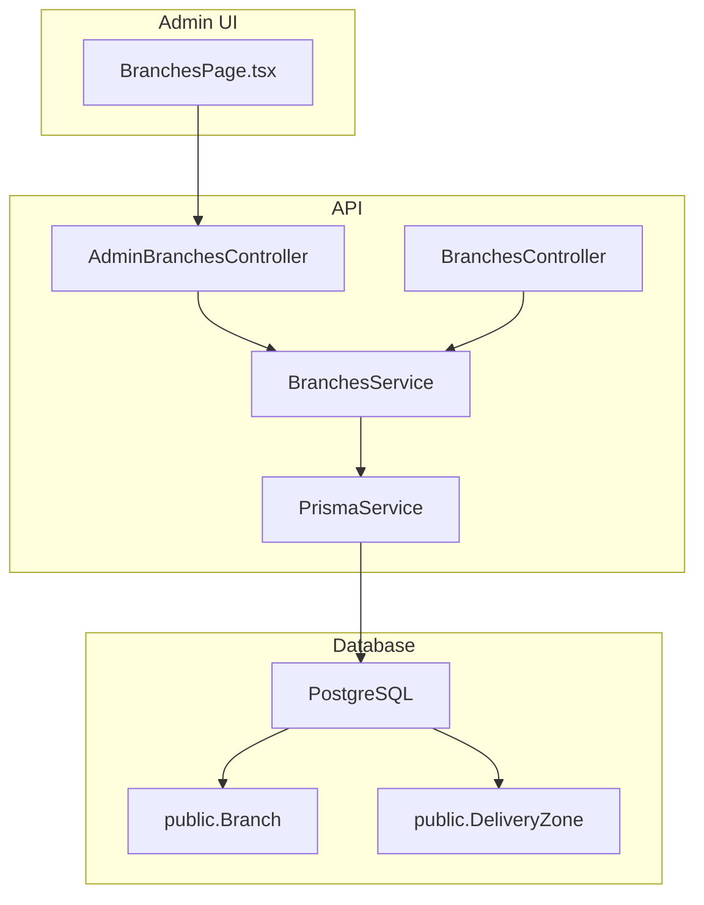

**Diagram sources**
- [branches.controller.ts:5-39](file://apps/api/src/modules/branches/branches.controller.ts#L5-L39)
- [branches.service.ts:5-56](file://apps/api/src/modules/branches/branches.service.ts#L5-L56)
- [schema.prisma:765-803](file://apps/api/prisma/schema.prisma#L765-L803)
- [BranchesPage.tsx:6-10](file://apps/admin/src/pages/BranchesPage.tsx#L6-L10)

**Section sources**
- [branches.controller.ts:1-40](file://apps/api/src/modules/branches/branches.controller.ts#L1-L40)
- [branches.service.ts:1-57](file://apps/api/src/modules/branches/branches.service.ts#L1-L57)
- [branches.module.ts:1-14](file://apps/api/src/modules/branches/branches.module.ts#L1-L14)
- [schema.prisma:765-803](file://apps/api/prisma/schema.prisma#L765-L803)
- [BranchesPage.tsx:1-31](file://apps/admin/src/pages/BranchesPage.tsx#L1-L31)

## Core Components
- Public listing endpoint returns only active branches sorted by name.
- Admin endpoints provide paginated listing, single branch retrieval, creation, and update.
- Data model includes branch identity, location, status, and associated delivery zones.

Key responsibilities:
- BranchesController: exposes REST routes for public and admin operations.
- AdminBranchesController: protected by admin guard; supports pagination via query parameters.
- BranchesService: encapsulates Prisma queries for listing, fetching, creating, and updating branches; includes related zones when retrieving a single branch.

**Section sources**
- [branches.controller.ts:9-38](file://apps/api/src/modules/branches/branches.controller.ts#L9-L38)
- [branches.service.ts:8-55](file://apps/api/src/modules/branches/branches.service.ts#L8-L55)
- [schema.prisma:765-803](file://apps/api/prisma/schema.prisma#L765-L803)

## Architecture Overview
The API follows a layered approach:
- Controllers define HTTP endpoints and parameter binding.
- Service layer performs business logic and data access using Prisma.
- Database schema defines Branch and DeliveryZone entities with relationships.

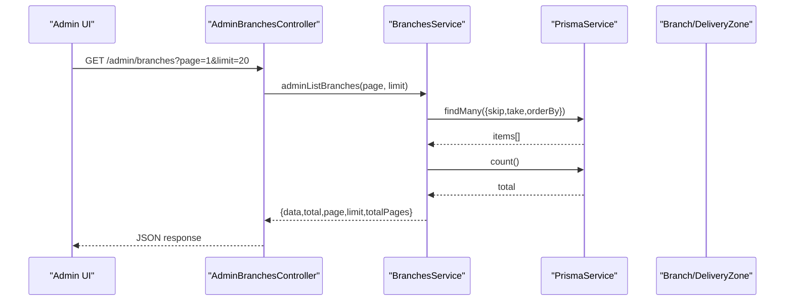

**Diagram sources**
- [branches.controller.ts:20-23](file://apps/api/src/modules/branches/branches.controller.ts#L20-L23)
- [branches.service.ts:15-33](file://apps/api/src/modules/branches/branches.service.ts#L15-L33)
- [schema.prisma:765-803](file://apps/api/prisma/schema.prisma#L765-L803)

## Detailed Component Analysis

### Branch Data Model
- Branch fields include identifiers, bilingual names, geographic attributes (governorate, area, address, lat/lng), optional map embed source, load factor, and isActive flag.
- Each Branch has many DeliveryZone entries defining service areas and pricing rules.

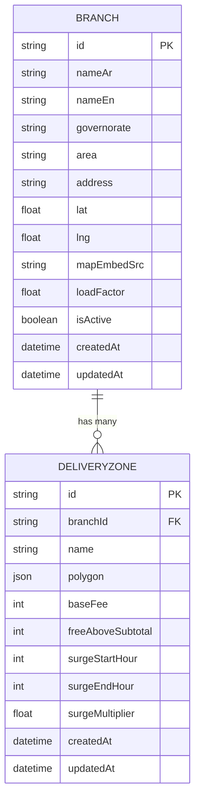

**Diagram sources**
- [schema.prisma:765-803](file://apps/api/prisma/schema.prisma#L765-L803)

**Section sources**
- [schema.prisma:765-803](file://apps/api/prisma/schema.prisma#L765-L803)

### Public Branch Listing
- Endpoint returns only active branches ordered by English name.
- Suitable for storefronts or customer-facing features that should not expose inactive locations.

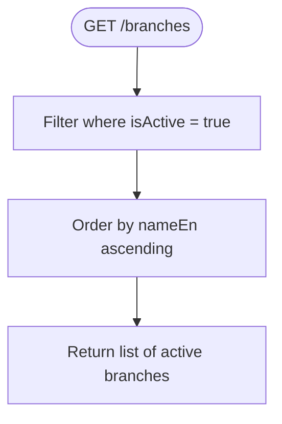

**Diagram sources**
- [branches.controller.ts:9-12](file://apps/api/src/modules/branches/branches.controller.ts#L9-L12)
- [branches.service.ts:8-13](file://apps/api/src/modules/branches/branches.service.ts#L8-L13)

**Section sources**
- [branches.controller.ts:9-12](file://apps/api/src/modules/branches/branches.controller.ts#L9-L12)
- [branches.service.ts:8-13](file://apps/api/src/modules/branches/branches.service.ts#L8-L13)

### Admin Branch Listing with Pagination
- Supports page and limit query parameters.
- Returns paginated results with metadata including total count and computed totalPages.

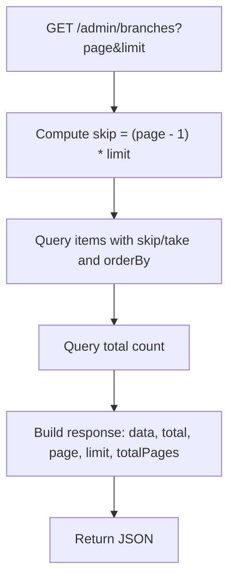

**Diagram sources**
- [branches.controller.ts:20-23](file://apps/api/src/modules/branches/branches.controller.ts#L20-L23)
- [branches.service.ts:15-33](file://apps/api/src/modules/branches/branches.service.ts#L15-L33)

**Section sources**
- [branches.controller.ts:20-23](file://apps/api/src/modules/branches/branches.controller.ts#L20-L23)
- [branches.service.ts:15-33](file://apps/api/src/modules/branches/branches.service.ts#L15-L33)

### Get Single Branch with Zones
- Retrieves a branch by ID and includes its delivery zones for full context.
- Throws a not-found error if the branch does not exist.

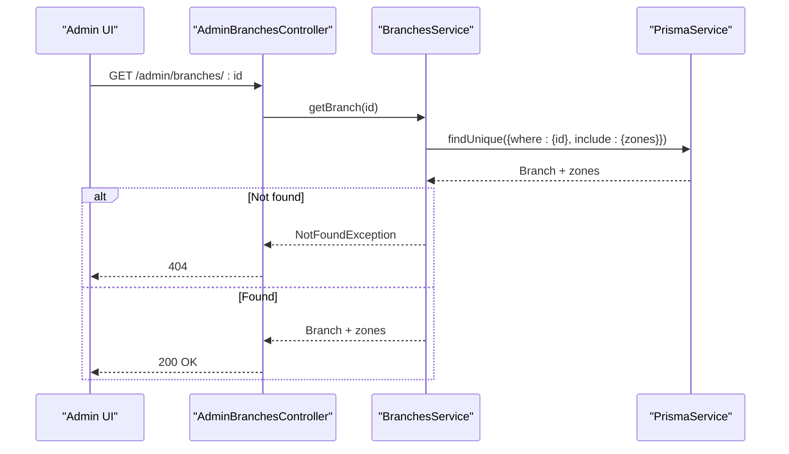

**Diagram sources**
- [branches.controller.ts:25-28](file://apps/api/src/modules/branches/branches.controller.ts#L25-L28)
- [branches.service.ts:35-42](file://apps/api/src/modules/branches/branches.service.ts#L35-L42)

**Section sources**
- [branches.controller.ts:25-28](file://apps/api/src/modules/branches/branches.controller.ts#L25-L28)
- [branches.service.ts:35-42](file://apps/api/src/modules/branches/branches.service.ts#L35-L42)

### Create Branch
- Accepts a request body representing branch fields and persists via Prisma create.
- Use this endpoint to register new branches through administrative tools.

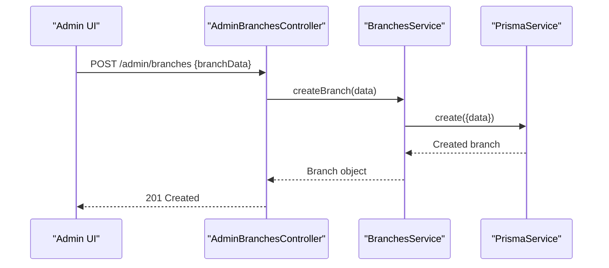

**Diagram sources**
- [branches.controller.ts:30-33](file://apps/api/src/modules/branches/branches.controller.ts#L30-L33)
- [branches.service.ts:44-48](file://apps/api/src/modules/branches/branches.service.ts#L44-L48)

**Section sources**
- [branches.controller.ts:30-33](file://apps/api/src/modules/branches/branches.controller.ts#L30-L33)
- [branches.service.ts:44-48](file://apps/api/src/modules/branches/branches.service.ts#L44-L48)

### Update Branch
- Updates an existing branch identified by ID with provided fields.
- Ideal for modifying branch details, toggling isActive, or adjusting loadFactor.

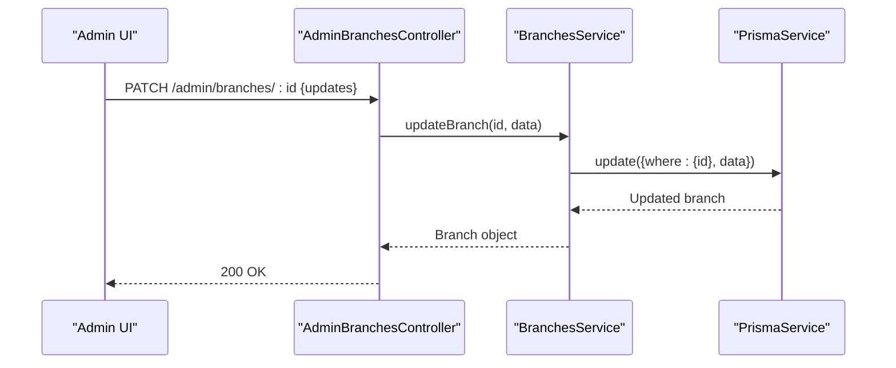

**Diagram sources**
- [branches.controller.ts:35-38](file://apps/api/src/modules/branches/branches.controller.ts#L35-L38)
- [branches.service.ts:50-55](file://apps/api/src/modules/branches/branches.service.ts#L50-L55)

**Section sources**
- [branches.controller.ts:35-38](file://apps/api/src/modules/branches/branches.controller.ts#L35-L38)
- [branches.service.ts:50-55](file://apps/api/src/modules/branches/branches.service.ts#L50-L55)

### Delivery Zone Configuration (Delivery Radius and Pricing)
- Each branch can have multiple delivery zones defined by a polygon geometry.
- Pricing and availability per zone include base fee, free delivery threshold, and surge pricing windows.

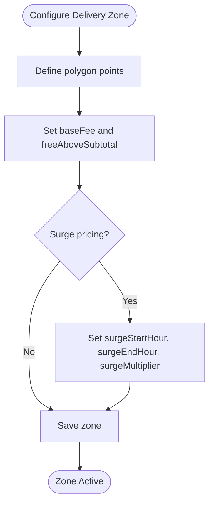

**Diagram sources**
- [schema.prisma:786-803](file://apps/api/prisma/schema.prisma#L786-L803)
- [seed_branches_and_zones.sql:76-115](file://database/seed_branches_and_zones.sql#L76-L115)

**Section sources**
- [schema.prisma:786-803](file://apps/api/prisma/schema.prisma#L786-L803)
- [seed_branches_and_zones.sql:76-115](file://database/seed_branches_and_zones.sql#L76-L115)

### Branch Status Management
- Branches have an isActive flag to control visibility and availability.
- Public listing filters to active branches; admins can toggle status via updates.

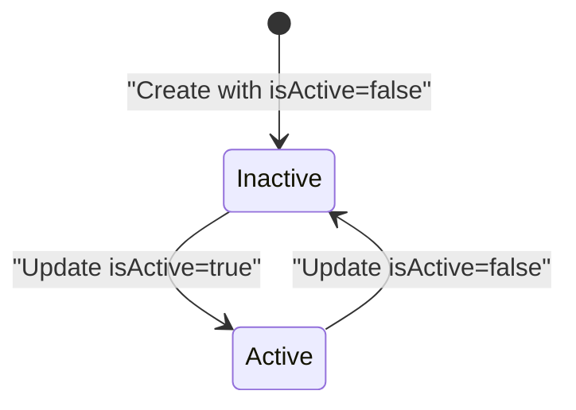

**Diagram sources**
- [schema.prisma:765-784](file://apps/api/prisma/schema.prisma#L765-L784)
- [branches.service.ts:8-13](file://apps/api/src/modules/branches/branches.service.ts#L8-L13)

**Section sources**
- [schema.prisma:765-784](file://apps/api/prisma/schema.prisma#L765-L784)
- [branches.service.ts:8-13](file://apps/api/src/modules/branches/branches.service.ts#L8-L13)

### Administrative Controls and Registration Workflow
- Admin endpoints are guarded to ensure only authorized users can manage branches.
- The admin UI fetches paginated branch data for review and actions.

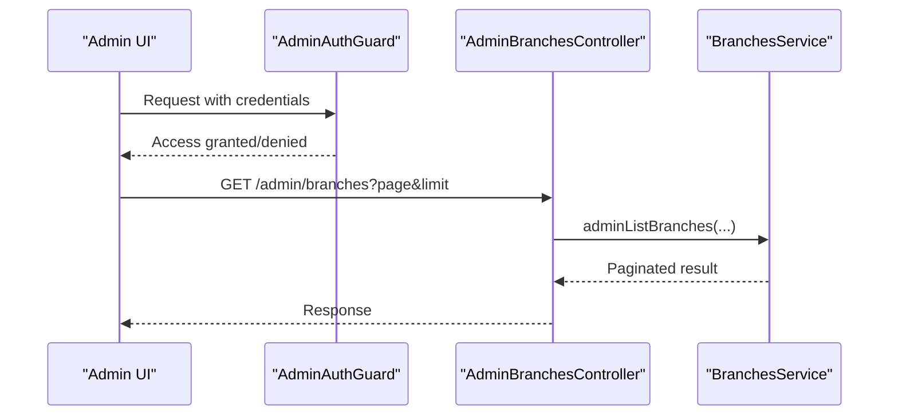

**Diagram sources**
- [branches.controller.ts:15-23](file://apps/api/src/modules/branches/branches.controller.ts#L15-L23)
- [BranchesPage.tsx:6-10](file://apps/admin/src/pages/BranchesPage.tsx#L6-L10)

**Section sources**
- [branches.controller.ts:15-23](file://apps/api/src/modules/branches/branches.controller.ts#L15-L23)
- [BranchesPage.tsx:6-10](file://apps/admin/src/pages/BranchesPage.tsx#L6-L10)

## Dependency Analysis
- BranchesModule imports PrismaModule and AuthModule to enable database access and admin authentication.
- Controllers depend on BranchesService for all branch operations.
- Service depends on PrismaService to interact with Branch and DeliveryZone models.

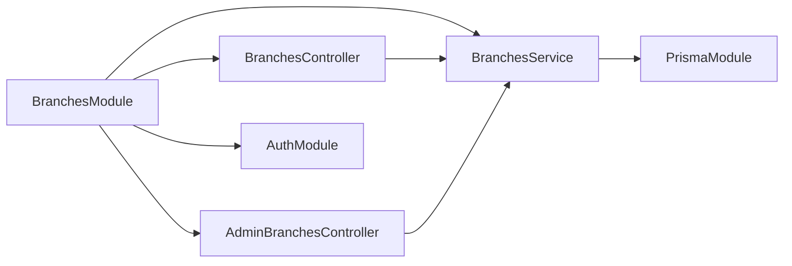

**Diagram sources**
- [branches.module.ts:7-11](file://apps/api/src/modules/branches/branches.module.ts#L7-L11)
- [branches.controller.ts:1-7](file://apps/api/src/modules/branches/branches.controller.ts#L1-L7)
- [branches.service.ts:1-6](file://apps/api/src/modules/branches/branches.service.ts#L1-L6)

**Section sources**
- [branches.module.ts:1-14](file://apps/api/src/modules/branches/branches.module.ts#L1-L14)
- [branches.controller.ts:1-7](file://apps/api/src/modules/branches/branches.controller.ts#L1-L7)
- [branches.service.ts:1-6](file://apps/api/src/modules/branches/branches.service.ts#L1-L6)

## Performance Considerations
- Public listing filters by isActive and orders by nameEn to reduce client-side processing.
- Admin listing uses skip/take pagination to limit payload size and improve responsiveness.
- Including zones in single branch retrieval adds relational data; consider lazy-loading zones if performance becomes critical for large datasets.
- Ensure indexes on frequently filtered fields (e.g., isActive) and ordering columns (nameEn) at the database level if needed.

[No sources needed since this section provides general guidance]

## Troubleshooting Guide
- Not Found errors: When retrieving a branch by ID, a not-found exception is thrown if the branch does not exist. Verify the ID and existence in the database.
- Authentication issues: Admin endpoints require admin authentication; ensure proper credentials and roles are set before making requests.
- Pagination parameters: Ensure page and limit are valid integers; invalid values may cause unexpected behavior.

**Section sources**
- [branches.service.ts:35-42](file://apps/api/src/modules/branches/branches.service.ts#L35-L42)
- [branches.controller.ts:15-23](file://apps/api/src/modules/branches/branches.controller.ts#L15-L23)

## Conclusion
The branch operational management system provides robust CRUD capabilities with secure admin controls, pagination support, and rich delivery zone configuration. Branches can be registered, updated, and toggled between active and inactive states, while delivery zones define service areas and pricing policies. The architecture cleanly separates concerns across controllers, services, and data models, enabling scalable and maintainable operations.

[No sources needed since this section summarizes without analyzing specific files]