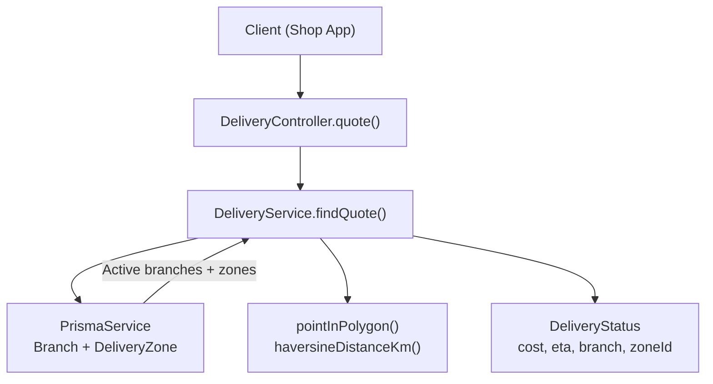
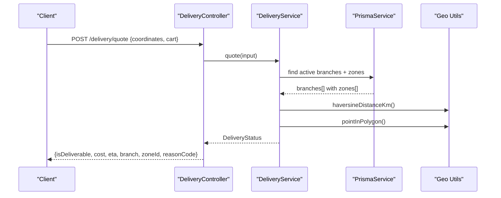
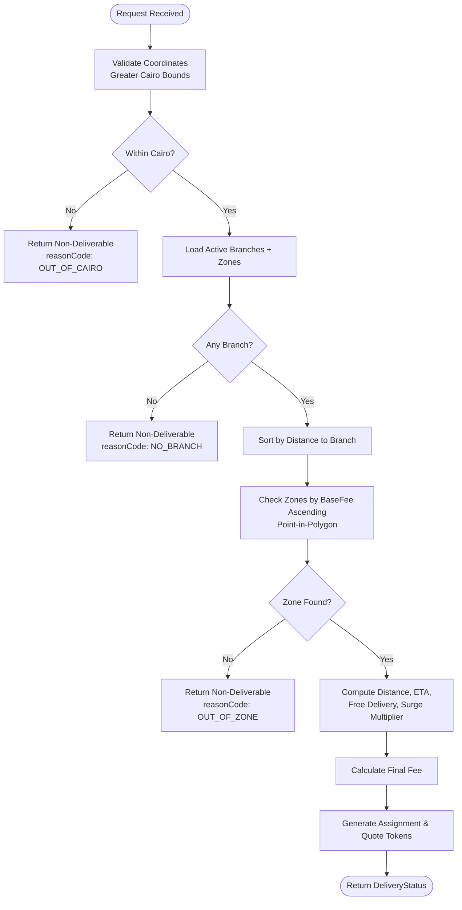
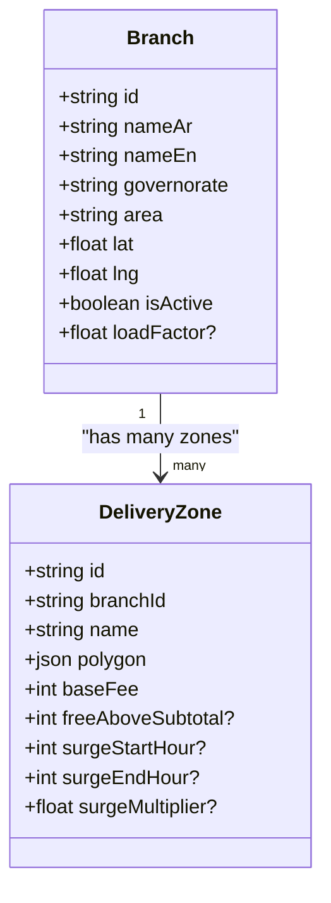
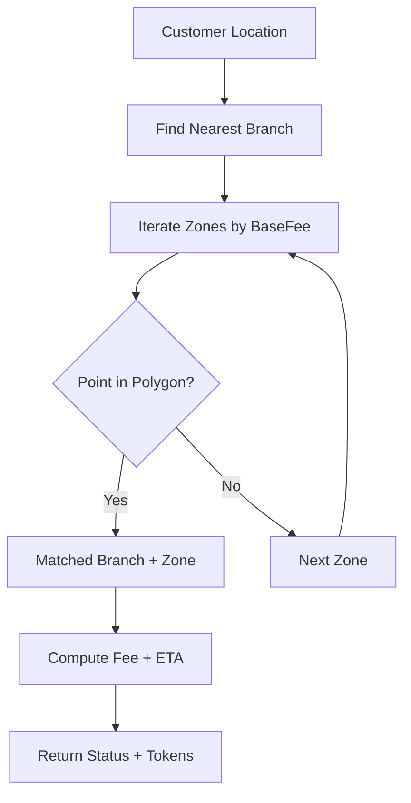
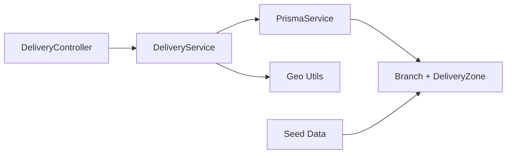

# Zone-Based Delivery System

<cite>
**Referenced Files in This Document**
- [delivery.service.ts](file://apps/api/src/modules/delivery/delivery.service.ts)
- [delivery.controller.ts](file://apps/api/src/modules/delivery/delivery.controller.ts)
- [schema.prisma](file://apps/api/prisma/schema.prisma)
- [seed_branches_and_zones.sql](file://database/seed_branches_and_zones.sql)
- [geofencing.ts](file://apps/shopper-native/src/features/delivery/geofencing.ts)
</cite>

## Table of Contents
1. Introduction
2. Project Structure
3. Core Components
4. Architecture Overview
5. Detailed Component Analysis
6. Dependency Analysis
7. Performance Considerations
8. Troubleshooting Guide
9. Conclusion
10. Appendices

## Introduction
This document explains the zone-based delivery system that determines whether an order can be delivered, which branch fulfills it, and how pricing and estimated delivery times are computed. It covers:
- Geographic boundary definitions using polygon coordinates
- Distance calculations and location validation
- Delivery zone configuration including minimum order values, delivery fees, and surge pricing windows
- Zone-to-branch mapping and order routing logic
- Real-time zone checking during checkout via a quote API
- Dynamic pricing based on zones and cart subtotal
- Analytics and performance monitoring recommendations for delivery optimization

## Project Structure
The delivery system spans backend services, database models, seed data, and mobile geofencing utilities:
- Backend API exposes a delivery quote endpoint that validates location, matches branches/zones, computes fees and ETA, and returns assignment tokens.
- Database schema defines Branch and DeliveryZone entities with relationships and fields required for zone-based pricing and routing.
- Seed script populates Cairo branches and their delivery zones with polygons, base fees, free-delivery thresholds, and surge windows.
- Mobile geofencing utilities provide distance calculations and Cairo bounding checks used by client-side flows.

**Diagram sources**
- [delivery.controller.ts:6-14](file://apps/api/src/modules/delivery/delivery.controller.ts#L6-L14)
- [delivery.service.ts:58-239](file://apps/api/src/modules/delivery/delivery.service.ts#L58-L239)
- [schema.prisma:765-800](file://apps/api/prisma/schema.prisma#L765-L800)

**Section sources**
- [delivery.controller.ts:1-17](file://apps/api/src/modules/delivery/delivery.controller.ts#L1-L17)
- [delivery.service.ts:1-240](file://apps/api/src/modules/delivery/delivery.service.ts#L1-L240)
- [schema.prisma:765-800](file://apps/api/prisma/schema.prisma#L765-L800)
- [seed_branches_and_zones.sql:1-127](file://database/seed_branches_and_zones.sql#L1-L127)
- [geofencing.ts:1-117](file://apps/shopper-native/src/features/delivery/geofencing.ts#L1-L117)

## Core Components
- Delivery Controller: Validates incoming requests and delegates to the service.
- Delivery Service: Implements core logic for location validation, branch and zone matching, fee calculation, ETA estimation, and token generation.
- Data Models: Branch and DeliveryZone define geographic and pricing attributes.
- Seed Data: Predefined branches and zones with polygons and pricing rules.
- Geofencing Utilities: Shared functions for distance and Cairo bounds checks used across clients.

Key responsibilities:
- Validate coordinates against Greater Cairo bounds.
- Retrieve active branches and their zones.
- Match customer location to nearest branch and zone using polygon containment.
- Compute distance, apply free delivery threshold, and surge multiplier.
- Estimate ETA based on distance and branch load factor.
- Return structured status with cost, currency, ETA, branch, zoneId, and tokens.

**Section sources**
- [delivery.controller.ts:6-14](file://apps/api/src/modules/delivery/delivery.controller.ts#L6-L14)
- [delivery.service.ts:58-239](file://apps/api/src/modules/delivery/delivery.service.ts#L58-L239)
- [schema.prisma:765-800](file://apps/api/prisma/schema.prisma#L765-L800)
- [seed_branches_and_zones.sql:72-115](file://database/seed_branches_and_zones.sql#L72-L115)
- [geofencing.ts:33-66](file://apps/shopper-native/src/features/delivery/geofencing.ts#L33-L66)

## Architecture Overview
The system follows a request-driven flow:
- The client calls POST /delivery/quote with coordinates and cart details.
- The controller parses and validates input using a schema.
- The service performs:
  - Cairo bounds check
  - Fetching active branches with zones
  - Sorting candidates by distance
  - Polygon containment checks per zone
  - Fee computation (base fee, free delivery, surge multiplier)
  - ETA calculation
  - Token generation for assignment and quoting
- The response includes deliverability, cost, ETA, matched branch and zone, and reason codes for failures.

**Diagram sources**
- [delivery.controller.ts:6-14](file://apps/api/src/modules/delivery/delivery.controller.ts#L6-L14)
- [delivery.service.ts:62-239](file://apps/api/src/modules/delivery/delivery.service.ts#L62-L239)
- [schema.prisma:765-800](file://apps/api/prisma/schema.prisma#L765-L800)

## Detailed Component Analysis

### Delivery Quote Flow
The quote flow orchestrates validation, matching, and pricing:
- Input validation via schema parsing ensures correct structure.
- Location is validated against Cairo bounds; out-of-range locations return a non-deliverable status with reason code.
- Active branches are fetched with their zones; if none exist, a non-deliverable status is returned.
- Candidates are sorted by distance to ensure nearest branch selection.
- Zones are sorted by base fee to prefer cheaper zones first.
- Polygon containment identifies the correct zone for the customer’s location.
- If no match, a non-deliverable status with reason code is returned.
- When matched, distance is computed, ETA is estimated, and fee is calculated considering free delivery and surge pricing.
- Tokens for assignment and quoting are generated and included in the response.

**Diagram sources**
- [delivery.service.ts:62-239](file://apps/api/src/modules/delivery/delivery.service.ts#L62-L239)

**Section sources**
- [delivery.service.ts:62-239](file://apps/api/src/modules/delivery/delivery.service.ts#L62-L239)

### Geographic Boundary Definitions and Validation
- Cairo Bounding Box: A hard backend governorate lock ensures only Greater Cairo coordinates are considered.
- Polygon Boundaries: Each DeliveryZone stores a JSON polygon defining its service area.
- Point-in-Polygon: Used to determine if a customer’s location falls within a zone.
- Distance Calculation: Haversine formula computes distances between points for branch sorting and ETA estimation.
- Mobile Geofencing: Shared utilities provide consistent distance and bounds checks across clients.

**Diagram sources**
- [schema.prisma:765-800](file://apps/api/prisma/schema.prisma#L765-L800)

**Section sources**
- [delivery.service.ts:39-56](file://apps/api/src/modules/delivery/delivery.service.ts#L39-L56)
- [delivery.service.ts:131-148](file://apps/api/src/modules/delivery/delivery.service.ts#L131-L148)
- [geofencing.ts:18-66](file://apps/shopper-native/src/features/delivery/geofencing.ts#L18-L66)
- [seed_branches_and_zones.sql:72-115](file://database/seed_branches_and_zones.sql#L72-L115)

### Delivery Zone Configuration
Each zone configures:
- Base Fee: Standard delivery charge before adjustments.
- Free Delivery Threshold: If cart subtotal meets or exceeds this value, delivery fee becomes zero.
- Surge Window: Time range where surge multiplier applies (supports midnight wrap).
- Surge Multiplier: Factor applied to base fee during surge periods.

Seed data provides example zones with polygons, base fees, free delivery thresholds, and surge settings.

**Section sources**
- [schema.prisma:786-800](file://apps/api/prisma/schema.prisma#L786-L800)
- [seed_branches_and_zones.sql:72-115](file://database/seed_branches_and_zones.sql#L72-L115)
- [delivery.service.ts:188-200](file://apps/api/src/modules/delivery/delivery.service.ts#L188-L200)

### Zone-to-Branch Mapping and Order Routing
- Branch Selection: Candidates are sorted by distance from the customer to ensure nearest branch fulfillment.
- Zone Matching: For each branch, zones are evaluated in ascending base fee order until a containing polygon is found.
- Routing Outcome: The matched branch and zone determine fulfillment location and pricing; assignment tokens enable subsequent driver assignment workflows.

**Diagram sources**
- [delivery.service.ts:117-148](file://apps/api/src/modules/delivery/delivery.service.ts#L117-L148)
- [delivery.service.ts:181-231](file://apps/api/src/modules/delivery/delivery.service.ts#L181-L231)

**Section sources**
- [delivery.service.ts:117-148](file://apps/api/src/modules/delivery/delivery.service.ts#L117-L148)
- [delivery.service.ts:181-231](file://apps/api/src/modules/delivery/delivery.service.ts#L181-L231)

### Real-Time Zone Checking During Checkout
- The POST /delivery/quote endpoint accepts real-time coordinates and cart subtotal.
- The service validates location, matches zones, and returns immediate feedback on deliverability, cost, and ETA.
- Clients can use this to gate checkout steps, show accurate fees, and inform customers about service availability.

**Section sources**
- [delivery.controller.ts:6-14](file://apps/api/src/modules/delivery/delivery.controller.ts#L6-L14)
- [delivery.service.ts:62-239](file://apps/api/src/modules/delivery/delivery.service.ts#L62-L239)

### Dynamic Pricing Based on Delivery Zones
- Base Fee: Retrieved from the matched zone.
- Free Delivery: Applied when cart subtotal meets or exceeds the zone’s freeAboveSubtotal.
- Surge Pricing: If current time falls within the zone’s surge window, the base fee is multiplied by the surge multiplier.
- Final Fee: Rounded integer value in EGP; zero when free delivery applies.

**Section sources**
- [delivery.service.ts:188-200](file://apps/api/src/modules/delivery/delivery.service.ts#L188-L200)
- [schema.prisma:786-800](file://apps/api/prisma/schema.prisma#L786-L800)

### Estimated Delivery Times (ETA)
- ETA Band: Computed using a traffic model with base prep time, drive speed approximation, and handover buffer.
- Load Factor: Branch-level load factor scales ETA to reflect operational pressure.
- Output: Provides min and max minutes for user-facing estimates.

**Section sources**
- [delivery.service.ts:21-33](file://apps/api/src/modules/delivery/delivery.service.ts#L21-L33)
- [delivery.service.ts:181-186](file://apps/api/src/modules/delivery/delivery.service.ts#L181-L186)

### Zone Analytics and Performance Monitoring
Recommended metrics to track for delivery optimization:
- Deliverability Rate: Percentage of quotes returning isDeliverable true.
- Reason Code Distribution: Frequency of OUT_OF_CAIRO, NO_BRANCH, OUT_OF_ZONE.
- Zone Coverage: Share of orders served by each zone; identify under-served areas.
- Fee Composition: Breakdown of base fee vs. surge vs. free delivery usage.
- ETA Accuracy: Compare quoted ETA bands with actual delivery times.
- Branch Load Impact: Correlate branch loadFactor with ETA and delays.
- Surge Utilization: Measure surge multiplier application frequency and revenue impact.

Implementation suggestions:
- Log quote outcomes (including reason codes and matched zoneId) for analytics pipelines.
- Track timestamps for quote creation and delivery completion to compute ETA variance.
- Aggregate metrics by zone and branch to guide capacity planning and zone reconfiguration.

[No sources needed since this section provides general guidance]

## Dependency Analysis
Core dependencies and relationships:
- DeliveryController depends on DeliveryService for business logic.
- DeliveryService depends on PrismaService to access Branch and DeliveryZone data.
- DeliveryService uses geometric utilities (pointInPolygon, haversineDistanceKm) for spatial operations.
- Schema defines relational integrity between Branch and DeliveryZone.
- Seed data initializes operational zones and pricing parameters.

**Diagram sources**
- [delivery.controller.ts:6-14](file://apps/api/src/modules/delivery/delivery.controller.ts#L6-L14)
- [delivery.service.ts:1-5](file://apps/api/src/modules/delivery/delivery.service.ts#L1-L5)
- [schema.prisma:765-800](file://apps/api/prisma/schema.prisma#L765-L800)
- [seed_branches_and_zones.sql:1-127](file://database/seed_branches_and_zones.sql#L1-L127)

**Section sources**
- [delivery.controller.ts:1-17](file://apps/api/src/modules/delivery/delivery.controller.ts#L1-L17)
- [delivery.service.ts:1-5](file://apps/api/src/modules/delivery/delivery.service.ts#L1-L5)
- [schema.prisma:765-800](file://apps/api/prisma/schema.prisma#L765-L800)
- [seed_branches_and_zones.sql:1-127](file://database/seed_branches_and_zones.sql#L1-L127)

## Performance Considerations
- Indexing: Ensure indexes on Branch.isActive and DeliveryZone.branchId to accelerate queries.
- Query Optimization: Fetch only active branches and include zones to minimize round trips.
- Spatial Operations: Use efficient point-in-polygon checks; consider PostGIS for large-scale deployments.
- Caching: Cache branch and zone lists with short TTLs to reduce database load during peak checkout.
- ETA Tuning: Adjust traffic model constants and load factor scaling based on observed delivery times.
- Surge Windows: Monitor surge application rates to balance revenue and customer experience.

[No sources needed since this section provides general guidance]

## Troubleshooting Guide
Common issues and resolutions:
- Out of Cairo: Customer coordinates outside Greater Cairo bounds; prompt users to update location or restrict service area.
- No Branch: No active branches configured; verify branch activation and seed data.
- Out of Zone: Customer inside Cairo but not within any zone polygon; adjust zone boundaries or add new zones.
- Unexpected Fees: Confirm cart subtotal relative to free delivery threshold and surge window timing.
- ETA Discrepancies: Review branch load factor and traffic model assumptions; calibrate based on real delivery times.

Operational checks:
- Validate schema migrations and seed data execution.
- Inspect reason codes in quote responses to diagnose failures quickly.
- Monitor logs for repeated failures and adjust configurations accordingly.

**Section sources**
- [delivery.service.ts:74-179](file://apps/api/src/modules/delivery/delivery.service.ts#L74-L179)
- [seed_branches_and_zones.sql:72-115](file://database/seed_branches_and_zones.sql#L72-L115)

## Conclusion
The zone-based delivery system provides robust geographic validation, precise zone matching, and dynamic pricing with configurable surge windows. It supports real-time checkout integration through a simple quote API and offers clear diagnostics via structured status responses. With appropriate analytics and performance tuning, the system can scale to optimize delivery coverage, pricing fairness, and operational efficiency.

[No sources needed since this section summarizes without analyzing specific files]

## Appendices

### API Endpoint Summary
- Method: POST
- Path: /delivery/quote
- Request Body: Coordinates and cart subtotal (validated via schema)
- Response: DeliveryStatus including deliverability, cost, currency, ETA, matched branch and zone, reason codes, and tokens

**Section sources**
- [delivery.controller.ts:6-14](file://apps/api/src/modules/delivery/delivery.controller.ts#L6-L14)
- [delivery.service.ts:62-239](file://apps/api/src/modules/delivery/delivery.service.ts#L62-L239)

### Data Model Reference
- Branch: Identifies fulfillment locations with geographic coordinates and operational flags.
- DeliveryZone: Defines service areas via polygons and pricing rules including base fee, free delivery threshold, and surge settings.

**Section sources**
- [schema.prisma:765-800](file://apps/api/prisma/schema.prisma#L765-L800)

### Seed Data Reference
- Initializes five Cairo branches and corresponding delivery zones with polygons, base fees, free delivery thresholds, and surge windows.

**Section sources**
- [seed_branches_and_zones.sql:1-127](file://database/seed_branches_and_zones.sql#L1-L127)

### Geofencing Utilities Reference
- Provides shared functions for distance calculation and Cairo bounds checks used across client applications.

**Section sources**
- [geofencing.ts:18-66](file://apps/shopper-native/src/features/delivery/geofencing.ts#L18-L66)