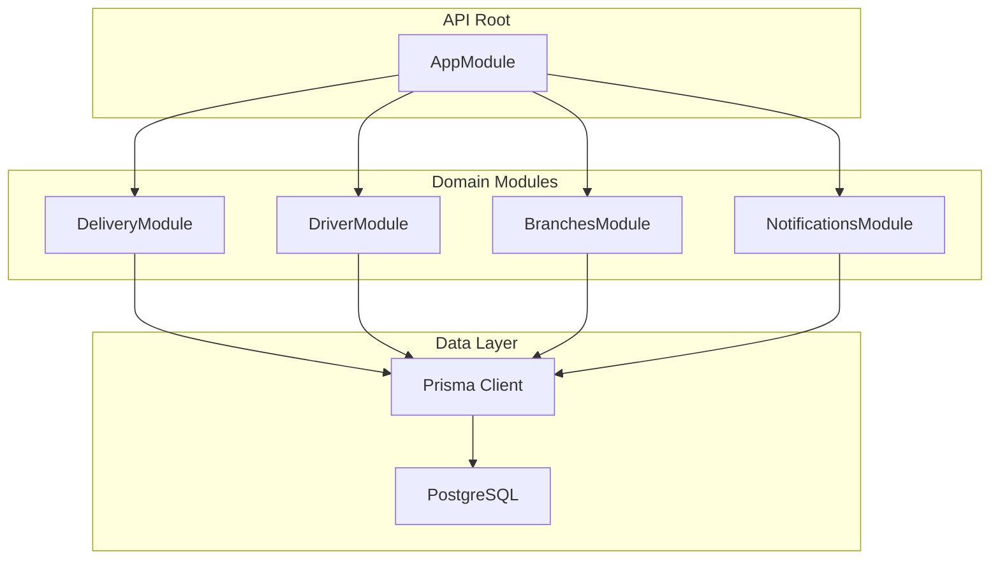
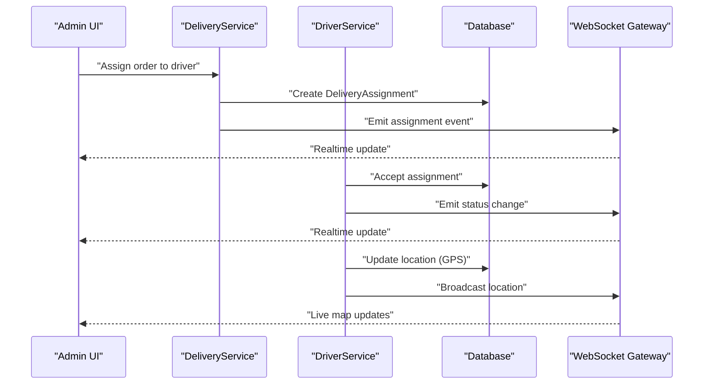
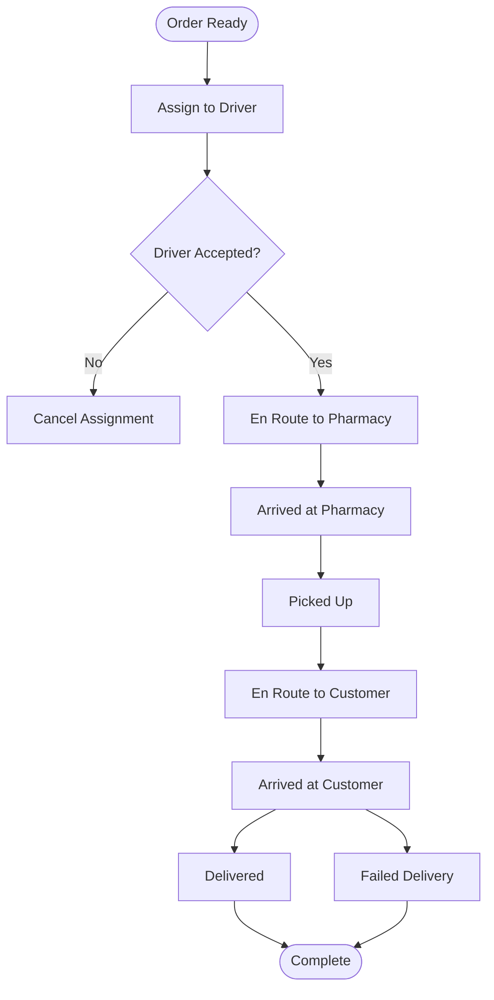
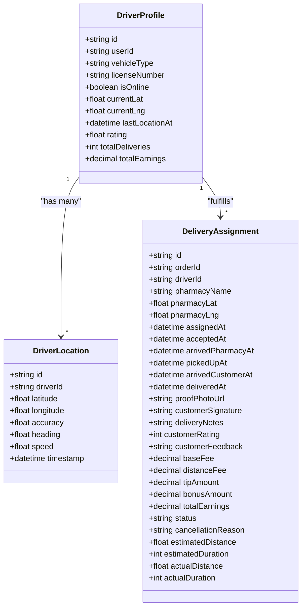
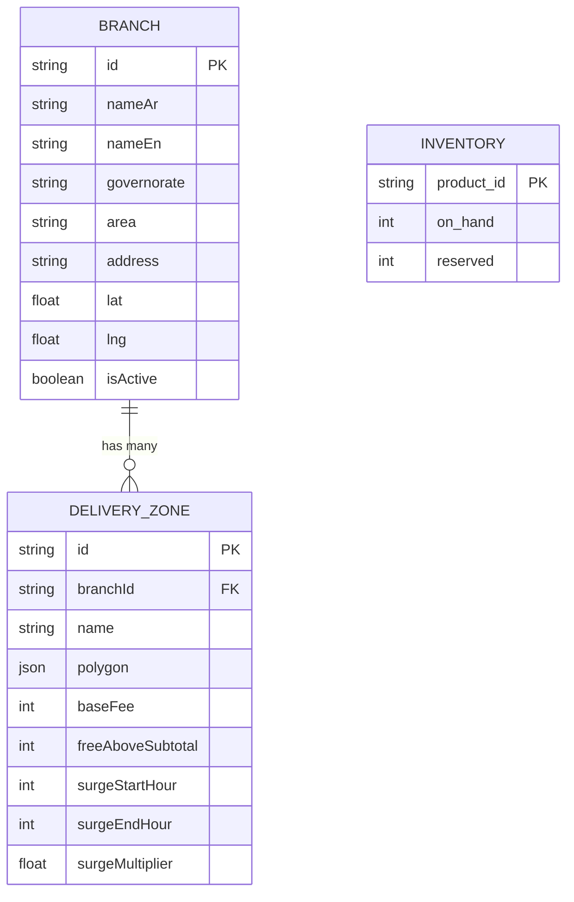
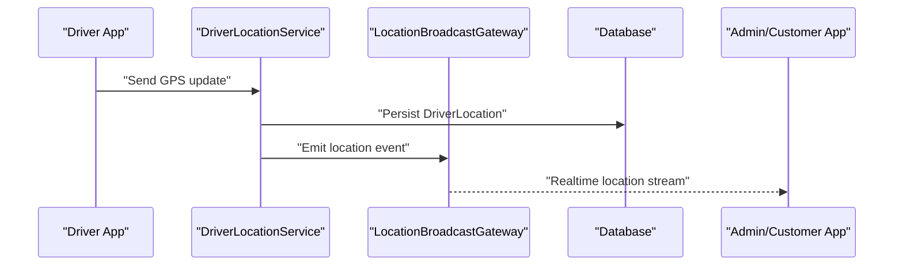
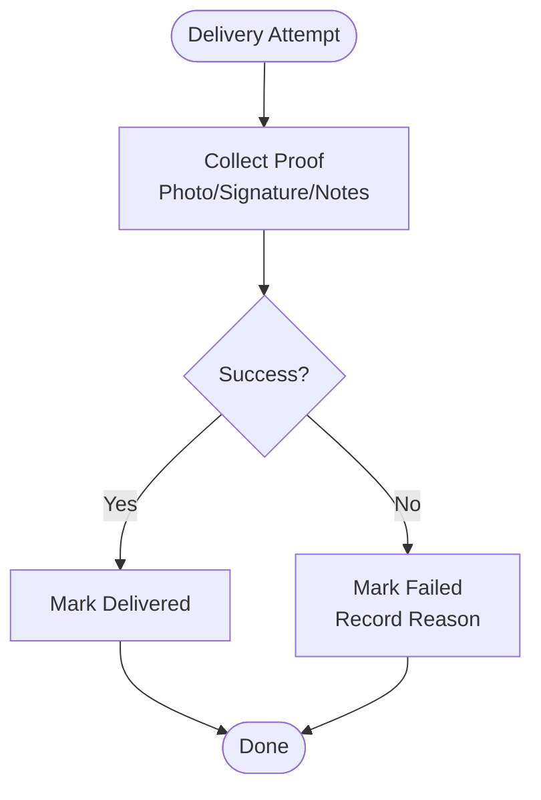
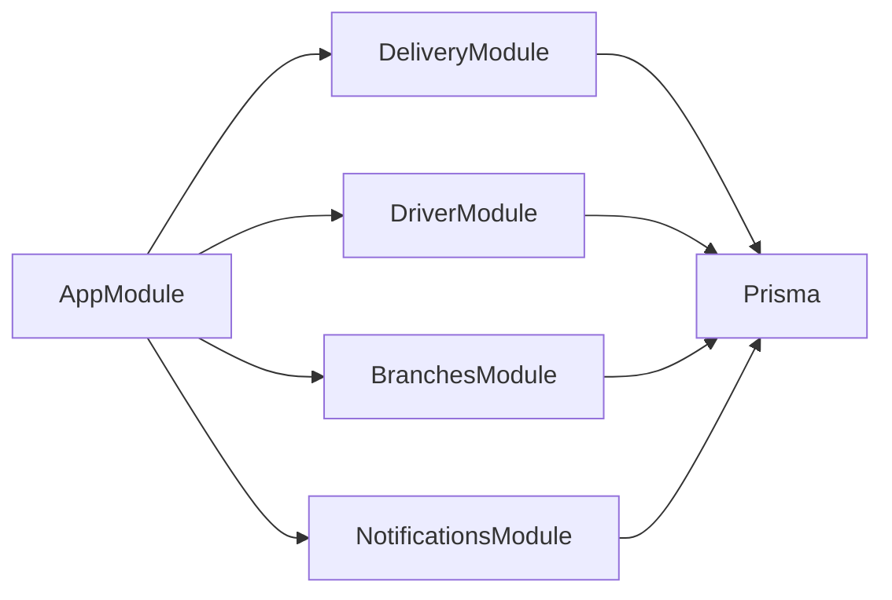

# Delivery & Logistics Management

<cite>
**Referenced Files in This Document**
- [app.module.ts](file://apps/api/src/app.module.ts)
- [schema.prisma](file://apps/api/prisma/schema.prisma)
- [delivery.controller.ts](file://apps/api/src/modules/delivery/delivery.controller.ts)
- [delivery.service.ts](file://apps/api/src/modules/delivery/delivery.service.ts)
- [driver.controller.ts](file://apps/api/src/modules/driver/driver.controller.ts)
- [driver-profile.service.ts](file://apps/api/src/modules/driver/driver-profile.service.ts)
- [driver-orders.service.ts](file://apps/api/src/modules/driver/driver-orders.service.ts)
- [driver-location.service.ts](file://apps/api/src/modules/driver/driver-location.service.ts)
- [location-broadcast.gateway.ts](file://apps/api/src/modules/driver/location-broadcast.gateway.ts)
- [branches.controller.ts](file://apps/api/src/modules/branches/branches.controller.ts)
- [branches.service.ts](file://apps/api/src/modules/branches/branches.service.ts)
</cite>

## Table of Contents
1. Introduction
2. Project Structure
3. Core Components
4. Architecture Overview
5. Detailed Component Analysis
6. Dependency Analysis
7. Performance Considerations
8. Troubleshooting Guide
9. Conclusion

## Introduction
This document describes the delivery and logistics management system implemented across the API, mobile apps, and admin interfaces. It focuses on:
- Delivery module: order assignment, route optimization considerations, and delivery status tracking
- Driver module: driver registration, location tracking, and delivery execution workflows
- Branch management: multi-location support, zone-based delivery, and local inventory linkage
- Real-time updates via WebSocket, GPS tracking integration, and analytics foundations
- Driver-customer communication, delivery proof collection, and exception handling for failed deliveries

The system is built with NestJS modules for delivery, drivers, branches, and notifications, backed by a PostgreSQL database modeled with Prisma.

## Project Structure
At a high level, the backend exposes REST endpoints and WebSocket events through NestJS modules. The core domain models (orders, assignments, drivers, locations, branches, zones) are defined in the Prisma schema. Modules are wired into the application root module.

**Diagram sources**
- [app.module.ts:1-30](file://apps/api/src/app.module.ts#L1-L30)

**Section sources**
- [app.module.ts:1-30](file://apps/api/src/app.module.ts#L1-L30)

## Core Components
- Delivery module: manages order-to-driver assignment, delivery lifecycle, and status transitions.
- Driver module: handles driver profiles, availability, real-time location streaming, and order execution flows.
- Branches module: defines branch locations and delivery zones; supports zone-based pricing and routing logic.
- Data layer: Prisma models define orders, delivery assignments, driver profiles, locations, sessions, earnings, and notification tokens/logs.

Key data entities include:
- Orders with status and optional assigned driver
- DeliveryAssignment capturing pickup/dropoff timestamps, proof, fees, and status
- DriverProfile with vehicle info, documents, online/offline state, and metrics
- DriverLocation for GPS telemetry
- Branch and DeliveryZone for multi-location and zone-based delivery

**Section sources**
- [schema.prisma:556-592](file://apps/api/prisma/schema.prisma#L556-L592)
- [schema.prisma:765-803](file://apps/api/prisma/schema.prisma#L765-L803)
- [schema.prisma:806-855](file://apps/api/prisma/schema.prisma#L806-L855)
- [schema.prisma:857-877](file://apps/api/prisma/schema.prisma#L857-L877)
- [schema.prisma:879-934](file://apps/api/prisma/schema.prisma#L879-L934)
- [schema.prisma:937-983](file://apps/api/prisma/schema.prisma#L937-L983)
- [schema.prisma:985-1036](file://apps/api/prisma/schema.prisma#L985-L1036)

## Architecture Overview
The system integrates REST APIs and WebSocket broadcasting to coordinate delivery operations:
- Admin or automated processes assign orders to drivers via the delivery service.
- Drivers accept/reject assignments and update their status throughout the workflow.
- Driver location updates are streamed via WebSocket to clients and stored for analytics.
- Branches and zones inform delivery feasibility, fees, and routing decisions.

**Diagram sources**
- [delivery.service.ts](file://apps/api/src/modules/delivery/delivery.service.ts)
- [driver.controller.ts](file://apps/api/src/modules/driver/driver.controller.ts)
- [driver-location.service.ts](file://apps/api/src/modules/driver/driver-location.service.ts)
- [location-broadcast.gateway.ts](file://apps/api/src/modules/driver/location-broadcast.gateway.ts)

## Detailed Component Analysis

### Delivery Module: Order Assignment, Status Tracking, and Analytics Foundations
Responsibilities:
- Assign orders to available drivers
- Manage delivery lifecycle states (assigned, accepted, en route, delivered, cancelled, failed)
- Persist delivery proof and notes
- Provide endpoints for status queries and analytics rollups

Key behaviors:
- Create or update DeliveryAssignment with pharmacy details and timestamps
- Transition statuses based on driver actions and confirmations
- Record estimated/actual distance and duration for performance metrics

**Diagram sources**
- [schema.prisma:879-934](file://apps/api/prisma/schema.prisma#L879-L934)
- [delivery.controller.ts](file://apps/api/src/modules/delivery/delivery.controller.ts)
- [delivery.service.ts](file://apps/api/src/modules/delivery/delivery.service.ts)

**Section sources**
- [delivery.controller.ts](file://apps/api/src/modules/delivery/delivery.controller.ts)
- [delivery.service.ts](file://apps/api/src/modules/delivery/delivery.service.ts)
- [schema.prisma:879-934](file://apps/api/prisma/schema.prisma#L879-L934)

### Driver Module: Registration, Location Tracking, and Execution Workflow
Responsibilities:
- Driver profile management (vehicle, documents, approval status)
- Online/offline presence and GPS location streaming
- Acceptance and execution of delivery assignments
- Session and earnings tracking

Key behaviors:
- Register/update driver profile and upload documents
- Toggle online status and broadcast location updates
- Accept/reject assignments and transition through delivery stages
- Log sessions and earnings per delivery

**Diagram sources**
- [schema.prisma:806-855](file://apps/api/prisma/schema.prisma#L806-L855)
- [schema.prisma:857-877](file://apps/api/prisma/schema.prisma#L857-L877)
- [schema.prisma:879-934](file://apps/api/prisma/schema.prisma#L879-L934)

**Section sources**
- [driver.controller.ts](file://apps/api/src/modules/driver/driver.controller.ts)
- [driver-profile.service.ts](file://apps/api/src/modules/driver/driver-profile.service.ts)
- [driver-orders.service.ts](file://apps/api/src/modules/driver/driver-orders.service.ts)
- [driver-location.service.ts](file://apps/api/src/modules/driver/driver-location.service.ts)
- [schema.prisma:806-855](file://apps/api/prisma/schema.prisma#L806-L855)
- [schema.prisma:857-877](file://apps/api/prisma/schema.prisma#L857-L877)
- [schema.prisma:879-934](file://apps/api/prisma/schema.prisma#L879-L934)

### Branch Management: Multi-Location Support, Zone-Based Delivery, Local Inventory
Responsibilities:
- Define multiple branch locations with coordinates and metadata
- Configure delivery zones per branch with polygon boundaries and pricing rules
- Link inventory to products and enable branch-aware fulfillment

Key capabilities:
- Branch model includes name, address, coordinates, and active status
- DeliveryZone stores polygon geometry, base fee, free-above-threshold, and surge pricing windows
- Inventory model tracks product stock levels that can be associated with branch-level logic

**Diagram sources**
- [schema.prisma:765-803](file://apps/api/prisma/schema.prisma#L765-L803)
- [schema.prisma:529-536](file://apps/api/prisma/schema.prisma#L529-L536)

**Section sources**
- [branches.controller.ts](file://apps/api/src/modules/branches/branches.controller.ts)
- [branches.service.ts](file://apps/api/src/modules/branches/branches.service.ts)
- [schema.prisma:765-803](file://apps/api/prisma/schema.prisma#L765-L803)
- [schema.prisma:529-536](file://apps/api/prisma/schema.prisma#L529-L536)

### Real-Time Delivery Updates via WebSocket and GPS Integration
Capabilities:
- Driver location streaming: drivers send GPS coordinates which are persisted and broadcast to subscribers
- WebSocket gateway emits events for assignment acceptance, status changes, and live location updates
- Clients (admin dashboard, customer app) subscribe to receive real-time updates

**Diagram sources**
- [driver-location.service.ts](file://apps/api/src/modules/driver/driver-location.service.ts)
- [location-broadcast.gateway.ts](file://apps/api/src/modules/driver/location-broadcast.gateway.ts)
- [schema.prisma:857-877](file://apps/api/prisma/schema.prisma#L857-L877)

**Section sources**
- [driver-location.service.ts](file://apps/api/src/modules/driver/driver-location.service.ts)
- [location-broadcast.gateway.ts](file://apps/api/src/modules/driver/location-broadcast.gateway.ts)

### Driver-Customer Communication, Delivery Proof, and Exception Handling
Communication:
- Notifications are tracked via NotificationToken and NotificationLog to manage push notifications and delivery updates
- Driver and customer apps can exchange messages or notifications around delivery milestones

Proof collection:
- DeliveryAssignment captures proof photo URL, customer signature, delivery notes, and ratings/feedback

Exception handling:
- DeliveryStatus includes FAILED and CANCELLED states
- Cancellation reasons and failure reasons are recorded for post-mortem analysis and analytics

**Diagram sources**
- [schema.prisma:879-934](file://apps/api/prisma/schema.prisma#L879-L934)
- [schema.prisma:985-1036](file://apps/api/prisma/schema.prisma#L985-L1036)

**Section sources**
- [schema.prisma:879-934](file://apps/api/prisma/schema.prisma#L879-L934)
- [schema.prisma:985-1036](file://apps/api/prisma/schema.prisma#L985-L1036)

## Dependency Analysis
Module dependencies and relationships:
- AppModule imports DeliveryModule, DriverModule, BranchesModule, and NotificationsModule
- Delivery and Driver modules depend on Prisma for persistence
- WebSocket gateway depends on services to emit events after DB writes

**Diagram sources**
- [app.module.ts:1-30](file://apps/api/src/app.module.ts#L1-L30)

**Section sources**
- [app.module.ts:1-30](file://apps/api/src/app.module.ts#L1-L30)

## Performance Considerations
- Indexing: Ensure indexes exist on frequently queried fields such as driverId, orderId, status, and timestamps for efficient lookups and sorting.
- Batching: Batch location updates to reduce write load when drivers move frequently.
- Pagination: Use pagination for listing assignments and locations to avoid large payloads.
- Connection pooling: Tune database connection pool settings for concurrent requests.
- Caching: Cache branch and zone configurations where appropriate to minimize repeated reads.

[No sources needed since this section provides general guidance]

## Troubleshooting Guide
Common issues and resolutions:
- Assignment not visible to driver: Verify assignment creation and WebSocket emission; check driver subscription to relevant channels.
- Location not updating: Confirm driver app sends GPS updates and gateway broadcasts them; inspect logs for errors.
- Failed delivery not recorded: Ensure status transitions set correct status and capture reason; validate database writes.
- Notification delivery failures: Check token validity and platform-specific errors; review notification logs for error messages.

**Section sources**
- [schema.prisma:985-1036](file://apps/api/prisma/schema.prisma#L985-L1036)

## Conclusion
The delivery and logistics system provides a robust foundation for order assignment, driver management, branch and zone configuration, real-time tracking, and analytics-ready data structures. By leveraging WebSocket broadcasting and well-modeled entities, it supports operational visibility, driver productivity, and customer transparency. Future enhancements can focus on advanced route optimization, dynamic pricing engines, and richer analytics dashboards.