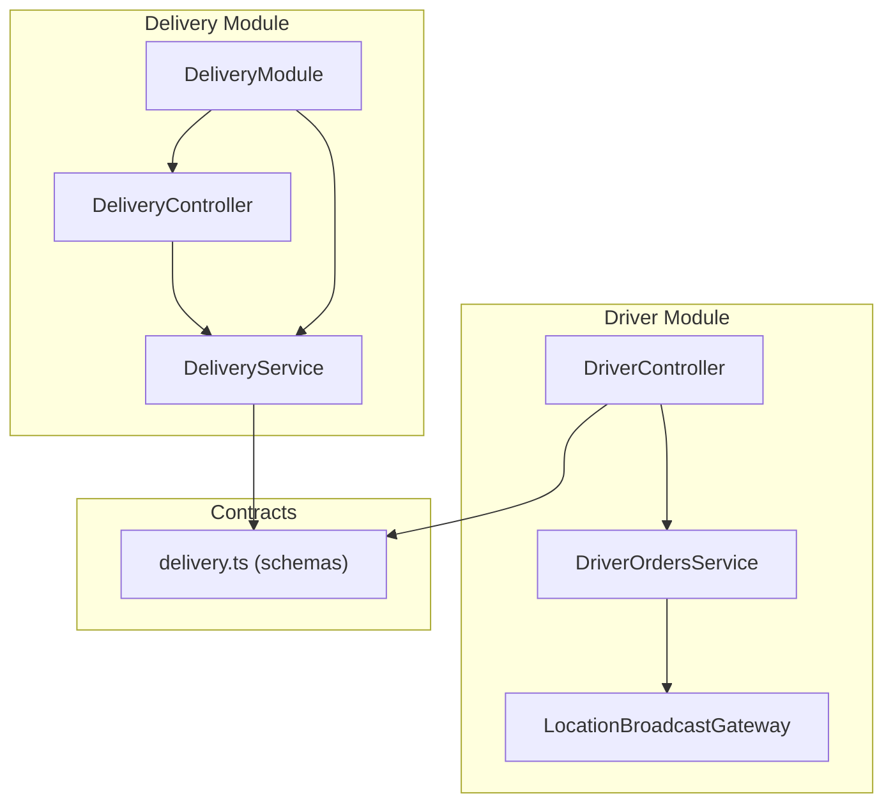
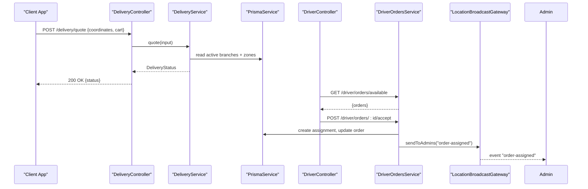
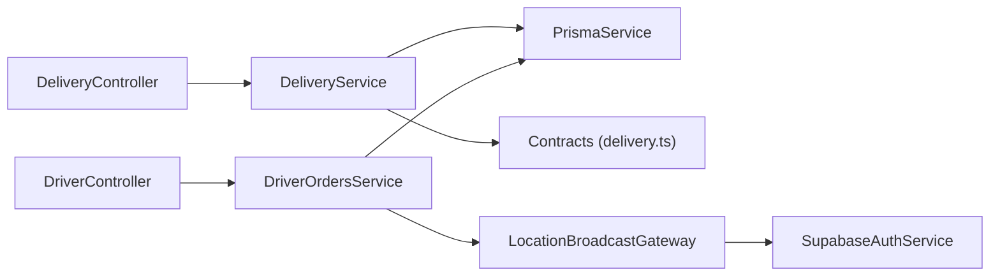

# Delivery Module

<cite>
**Referenced Files in This Document**
- [delivery.controller.ts](file://apps/api/src/modules/delivery/delivery.controller.ts)
- [delivery.service.ts](file://apps/api/src/modules/delivery/delivery.service.ts)
- [delivery.module.ts](file://apps/api/src/modules/delivery/delivery.module.ts)
- [delivery.ts](file://packages/contracts/src/delivery.ts)
- [driver.controller.ts](file://apps/api/src/modules/driver/driver.controller.ts)
- [driver-orders.service.ts](file://apps/api/src/modules/driver/driver-orders.service.ts)
- [location-broadcast.gateway.ts](file://apps/api/src/modules/driver/location-broadcast.gateway.ts)
- [delivery-action.dto.ts](file://apps/api/src/modules/driver/dto/delivery-action.dto.ts)
</cite>

## Table of Contents
1. Introduction
2. Project Structure
3. Core Components
4. Architecture Overview
5. Detailed Component Analysis
6. Dependency Analysis
7. Performance Considerations
8. Troubleshooting Guide
9. Conclusion

## Introduction
This document provides comprehensive documentation for the delivery module and its integration with the driver module. It covers:
- Delivery controller endpoints, including quote calculation and branch/zone matching.
- Delivery service layer logic for scheduling inputs, ETA computation, surge pricing, and free delivery rules.
- Driver-side order assignment and lifecycle management (accept/reject, pickup, delivery, completion).
- WebSocket integration for real-time updates to admin dashboards and clients.
- API request/response schemas, error handling patterns, and integration points with branches and drivers.
- End-to-end workflow examples from order creation to completion.

## Project Structure
The delivery functionality is implemented as a NestJS feature module with a controller, service, and shared contracts. The driver module exposes endpoints for order assignment and lifecycle transitions, and a WebSocket gateway broadcasts real-time updates.

**Diagram sources**
- [delivery.controller.ts:1-17](file://apps/api/src/modules/delivery/delivery.controller.ts#L1-L17)
- [delivery.service.ts:1-240](file://apps/api/src/modules/delivery/delivery.service.ts#L1-L240)
- [delivery.module.ts:1-11](file://apps/api/src/modules/delivery/delivery.module.ts#L1-L11)
- [driver.controller.ts:1-235](file://apps/api/src/modules/driver/driver.controller.ts#L1-L235)
- [driver-orders.service.ts:1-621](file://apps/api/src/modules/driver/driver-orders.service.ts#L1-L621)
- [location-broadcast.gateway.ts:1-214](file://apps/api/src/modules/driver/location-broadcast.gateway.ts#L1-L214)
- [delivery.ts:1-67](file://packages/contracts/src/delivery.ts#L1-L67)

**Section sources**
- [delivery.controller.ts:1-17](file://apps/api/src/modules/delivery/delivery.controller.ts#L1-L17)
- [delivery.service.ts:1-240](file://apps/api/src/modules/delivery/delivery.service.ts#L1-L240)
- [delivery.module.ts:1-11](file://apps/api/src/modules/delivery/delivery.module.ts#L1-L11)
- [driver.controller.ts:1-235](file://apps/api/src/modules/driver/driver.controller.ts#L1-L235)
- [driver-orders.service.ts:1-621](file://apps/api/src/modules/driver/driver-orders.service.ts#L1-L621)
- [location-broadcast.gateway.ts:1-214](file://apps/api/src/modules/driver/location-broadcast.gateway.ts#L1-L214)
- [delivery.ts:1-67](file://packages/contracts/src/delivery.ts#L1-L67)

## Core Components
- DeliveryController: Exposes a POST /delivery/quote endpoint that validates input via Zod schema and delegates to DeliveryService.
- DeliveryService: Computes deliverability by validating coordinates against Cairo bounds, selecting nearest active branch, matching zones via polygon containment, calculating distance, ETA bands, surge multipliers, and free delivery thresholds. Returns a structured DeliveryStatus.
- DriverController: Provides authentication, profile, location tracking, and order lifecycle endpoints for drivers (available orders, accept/reject, pickup, delivery, completion).
- DriverOrdersService: Implements business logic for order assignment, state transitions, geofence checks, earnings calculations, and broadcasting status updates.
- LocationBroadcastGateway: WebSocket gateway for real-time events such as driver locations and delivery status changes.

**Section sources**
- [delivery.controller.ts:1-17](file://apps/api/src/modules/delivery/delivery.controller.ts#L1-L17)
- [delivery.service.ts:1-240](file://apps/api/src/modules/delivery/delivery.service.ts#L1-L240)
- [driver.controller.ts:1-235](file://apps/api/src/modules/driver/driver.controller.ts#L1-L235)
- [driver-orders.service.ts:1-621](file://apps/api/src/modules/driver/driver-orders.service.ts#L1-L621)
- [location-broadcast.gateway.ts:1-214](file://apps/api/src/modules/driver/location-broadcast.gateway.ts#L1-L214)

## Architecture Overview
High-level flow:
- Client calls POST /delivery/quote with coordinates and cart snapshot.
- DeliveryService validates region, selects nearest branch and zone, computes cost/ETA, and returns DeliveryStatus.
- Driver app fetches available orders, accepts one, and transitions through lifecycle states.
- DriverOrdersService enforces constraints, updates database, and emits WebSocket events via LocationBroadcastGateway.
- Admin dashboard subscribes to WebSocket rooms/events to see live updates.

**Diagram sources**
- [delivery.controller.ts:1-17](file://apps/api/src/modules/delivery/delivery.controller.ts#L1-L17)
- [delivery.service.ts:1-240](file://apps/api/src/modules/delivery/delivery.service.ts#L1-L240)
- [driver.controller.ts:1-235](file://apps/api/src/modules/driver/driver.controller.ts#L1-L235)
- [driver-orders.service.ts:1-621](file://apps/api/src/modules/driver/driver-orders.service.ts#L1-L621)
- [location-broadcast.gateway.ts:1-214](file://apps/api/src/modules/driver/location-broadcast.gateway.ts#L1-L214)

## Detailed Component Analysis

### Delivery Controller Endpoints
- POST /delivery/quote
  - Validates request body using DeliveryQuoteRequestSchema.
  - Delegates to DeliveryService.quote() which returns DeliveryStatus.
  - Response includes deliverability flag, cost, currency, ETA band, matched branch info, distance, tokens, zoneId, reasonCode, breakdown, and updatedAt.

Request schema (from contracts):
- coordinates: lat/lng pair
- cart: items array, itemCount, subtotal
- requestedBranchId: optional string

Response schema (from contracts):
- isDeliverable: boolean
- cost: number or null
- currency: "EGP"
- eta: { minMinutes, maxMinutes } or null
- branch: branch object or null
- distanceKm: number or null
- assignmentToken: string or null
- quoteToken: string or null
- zoneId: string or null
- reasonCode: enum ("OK", "NO_COORDINATES", "NO_BRANCH", "OUT_OF_ZONE", "OUT_OF_CAIRO", "UNEXPECTED_ERROR")
- breakdown: { baseFee, surgeMultiplier, freeDeliveryApplied } (optional)
- updatedAt: string

Error handling:
- Validation errors are raised by Zod parsing when input does not match schema.
- Business reasons are returned via reasonCode in DeliveryStatus rather than HTTP errors for non-deliverable cases.

**Section sources**
- [delivery.controller.ts:1-17](file://apps/api/src/modules/delivery/delivery.controller.ts#L1-L17)
- [delivery.ts:1-67](file://packages/contracts/src/delivery.ts#L1-L67)

### Delivery Service Layer
Responsibilities:
- Region gating: Ensures coordinates fall within Greater Cairo bounding box; otherwise returns OUT_OF_CAIRO.
- Branch selection: Retrieves active branches with zones; optionally filters by requestedBranchId; sorts by distance to user.
- Zone matching: Sorts zones by baseFee ascending and uses point-in-polygon check to find the best zone for the user’s coordinates.
- Cost and ETA:
  - Distance computed via Haversine formula.
  - ETA band built using a traffic model with base prep time, drive speed, handover buffer, and load factor.
  - Surge window detection based on current hour vs zone surge hours; applies surge multiplier if within window.
  - Free delivery applied when cart subtotal meets threshold.
- Tokens: Generates assignment and quote tokens for downstream flows.

Complexity considerations:
- Sorting candidates by distance and zones by fee ensures O(n log n) behavior relative to number of branches/zones.
- Point-in-polygon check per zone is linear in number of vertices; overall complexity depends on zone sizes.

Performance characteristics:
- Avoids unnecessary computations by early exits (out-of-region, no branches).
- Uses minimal math operations for distance and ETA.

Integration points:
- Reads branches and zones via PrismaService.
- Uses shared contracts for validation and types.

**Section sources**
- [delivery.service.ts:1-240](file://apps/api/src/modules/delivery/delivery.service.ts#L1-L240)
- [delivery.ts:1-67](file://packages/contracts/src/delivery.ts#L1-L67)

### Driver Order Assignment and Lifecycle Management
Endpoints exposed by DriverController:
- GET /driver/orders/available: Lists ready orders not assigned or previously rejected/cancelled; includes estimated distances and earnings.
- POST /driver/orders/:orderId/accept: Accepts an order, creates delivery assignment, updates order status, and broadcasts assignment to admins.
- POST /driver/orders/:orderId/reject: Rejects a pending assignment and resets order to ready.
- POST /driver/orders/:orderId/en-route-pickup: Marks driver en route to pharmacy.
- POST /driver/orders/:orderId/arrived-pharmacy: Requires geofence proximity to pharmacy; marks arrived.
- POST /driver/orders/:orderId/picked-up: Marks package picked up; may include notes.
- POST /driver/orders/:orderId/en-route-customer: Marks driver en route to customer.
- POST /driver/orders/:orderId/arrived-customer: Requires geofence proximity to customer; marks arrived.
- POST /driver/orders/:orderId/complete: Completes delivery, records proof/signature/rating, updates order to delivered, creates earnings record, increments driver stats.

Business logic highlights:
- Online requirement enforced before actions.
- Active delivery conflict prevention prevents multiple concurrent assignments.
- Geofence checks ensure arrivals occur within a defined radius.
- Transactional updates maintain consistency between assignments and orders.
- Earnings calculated based on base fee plus distance-based component.

WebSocket integration:
- On key lifecycle transitions, DriverOrdersService emits delivery-status-update events to admin room via LocationBroadcastGateway.
- Admin clients subscribe to admin-updates room to receive these events.

**Section sources**
- [driver.controller.ts:1-235](file://apps/api/src/modules/driver/driver.controller.ts#L1-L235)
- [driver-orders.service.ts:1-621](file://apps/api/src/modules/driver/driver-orders.service.ts#L1-L621)
- [location-broadcast.gateway.ts:1-214](file://apps/api/src/modules/driver/location-broadcast.gateway.ts#L1-L214)

### WebSocket Integration for Real-Time Updates
LocationBroadcastGateway:
- Namespace: /driver-locations
- CORS configured for local and production domains.
- Authentication: Validates access token on connection; restricts to admin/manager roles for initial data and admin subscriptions.
- Events:
  - initial-drivers: Sent to newly connected admin clients with all online drivers.
  - driver-location-update: Broadcast when driver location changes.
  - driver-status-change: Broadcast when driver goes online/offline.
  - subscribe-driver-updates: Driver-specific subscription to private room.
  - subscribe-admin-updates: Admin subscription to global admin room.
  - unsubscribe: Leaves all rooms.
- Methods:
  - sendToDriver(driverId, event, data)
  - sendToAdmins(event, data)
  - broadcast(event, data)

Integration with DriverOrdersService:
- Emits delivery-status-update to admin room on transitions like ARRIVED_AT_PHARMACY, ARRIVED_AT_CUSTOMER, DELIVERED.
- Emits order-assigned when a driver accepts an order.

**Section sources**
- [location-broadcast.gateway.ts:1-214](file://apps/api/src/modules/driver/location-broadcast.gateway.ts#L1-L214)
- [driver-orders.service.ts:1-621](file://apps/api/src/modules/driver/driver-orders.service.ts#L1-L621)

### API Request/Response Schemas
Delivery Quote
- Request: DeliveryQuoteRequestSchema
  - coordinates: CoordinatesSchema
  - cart: CartSnapshotSchema
  - requestedBranchId: optional string
- Response: DeliveryStatusSchema
  - isDeliverable: boolean
  - cost: number|null
  - currency: "EGP"
  - eta: { minMinutes, maxMinutes }|null
  - branch: BranchSchema|null
  - distanceKm: number|null
  - assignmentToken: string|null
  - quoteToken: string|null
  - zoneId: string|null
  - reasonCode: enum
  - breakdown: { baseFee, surgeMultiplier, freeDeliveryApplied }|undefined
  - updatedAt: string

Driver Actions DTOs
- AcceptOrderDto: optional currentLat/currentLng
- RejectOrderDto: optional reason
- ArrivedPharmacyDto: required currentLat/currentLng
- PickedUpDto: optional notes
- ArrivedCustomerDto: required currentLat/currentLng
- CompleteDeliveryDto: required proofPhotoUrl; optional customerSignature, deliveryNotes, customerRating (1-5), customerFeedback

**Section sources**
- [delivery.ts:1-67](file://packages/contracts/src/delivery.ts#L1-L67)
- [delivery-action.dto.ts:1-64](file://apps/api/src/modules/driver/dto/delivery-action.dto.ts#L1-L64)

### Error Handling Patterns
- Input validation: Zod throws on invalid payloads for delivery quotes.
- Business validations:
  - Out-of-region: reasonCode "OUT_OF_CAIRO".
  - No active branches: reasonCode "NO_BRANCH".
  - Out-of-zone: reasonCode "OUT_OF_ZONE".
  - Driver must be online: ForbiddenException.
  - Conflict on active delivery: ConflictException.
  - Geofence violations: BadRequestException with distance details.
  - Not found scenarios: NotFoundException for missing orders or assignments.
- Non-critical failures:
  - WebSocket emission failures are caught and ignored to avoid impacting core requests.

**Section sources**
- [delivery.service.ts:1-240](file://apps/api/src/modules/delivery/delivery.service.ts#L1-L240)
- [driver-orders.service.ts:1-621](file://apps/api/src/modules/driver/driver-orders.service.ts#L1-L621)

### Integration with Driver and Branch Modules
- Branch integration:
  - DeliveryService reads active branches and their zones to determine deliverability and pricing.
  - Branch attributes (name, coordinates, area, map embed) are included in response when matched.
- Driver integration:
  - DriverController routes lifecycle actions to DriverOrdersService.
  - DriverOrdersService interacts with Prisma to persist assignments and order statuses.
  - LocationBroadcastGateway enables real-time visibility for admins and drivers.

**Section sources**
- [delivery.service.ts:1-240](file://apps/api/src/modules/delivery/delivery.service.ts#L1-L240)
- [driver.controller.ts:1-235](file://apps/api/src/modules/driver/driver.controller.ts#L1-L235)
- [driver-orders.service.ts:1-621](file://apps/api/src/modules/driver/driver-orders.service.ts#L1-L621)

## Dependency Analysis
Key dependencies and relationships:
- DeliveryController depends on DeliveryService and shared contracts for validation.
- DeliveryService depends on PrismaService for branch/zone data and uses geometry utilities from contracts.
- DriverController depends on DriverOrdersService and DTOs for lifecycle actions.
- DriverOrdersService depends on PrismaService and LocationBroadcastGateway for persistence and real-time updates.
- LocationBroadcastGateway depends on SupabaseAuthService for socket authentication and DriverLocationService for driver presence data.

**Diagram sources**
- [delivery.controller.ts:1-17](file://apps/api/src/modules/delivery/delivery.controller.ts#L1-L17)
- [delivery.service.ts:1-240](file://apps/api/src/modules/delivery/delivery.service.ts#L1-L240)
- [driver.controller.ts:1-235](file://apps/api/src/modules/driver/driver.controller.ts#L1-L235)
- [driver-orders.service.ts:1-621](file://apps/api/src/modules/driver/driver-orders.service.ts#L1-L621)
- [location-broadcast.gateway.ts:1-214](file://apps/api/src/modules/driver/location-broadcast.gateway.ts#L1-L214)
- [delivery.ts:1-67](file://packages/contracts/src/delivery.ts#L1-L67)

**Section sources**
- [delivery.controller.ts:1-17](file://apps/api/src/modules/delivery/delivery.controller.ts#L1-L17)
- [delivery.service.ts:1-240](file://apps/api/src/modules/delivery/delivery.service.ts#L1-L240)
- [driver.controller.ts:1-235](file://apps/api/src/modules/driver/driver.controller.ts#L1-L235)
- [driver-orders.service.ts:1-621](file://apps/api/src/modules/driver/driver-orders.service.ts#L1-L621)
- [location-broadcast.gateway.ts:1-214](file://apps/api/src/modules/driver/location-broadcast.gateway.ts#L1-L214)
- [delivery.ts:1-67](file://packages/contracts/src/delivery.ts#L1-L67)

## Performance Considerations
- Quote computation:
  - Early exit for out-of-region or no branches reduces unnecessary queries.
  - Sorting branches by distance and zones by fee minimizes computational overhead while ensuring optimal matching.
  - Haversine distance and point-in-polygon checks are efficient for typical dataset sizes.
- ETA modeling:
  - Linear ETA band based on distance and load factor avoids complex routing calculations.
- Driver availability and ordering:
  - Available orders sorted by distance to pickup when driver location is known, improving efficiency for drivers.
- WebSocket scaling:
  - Room-based subscriptions limit broadcast scope; consider sharding or scaling Socket.IO instances under high concurrency.

[No sources needed since this section provides general guidance]

## Troubleshooting Guide
Common issues and resolutions:
- Invalid quote request:
  - Ensure coordinates and cart structure conform to DeliveryQuoteRequestSchema.
  - Check Zod validation errors for precise field issues.
- Non-deliverable regions:
  - Verify coordinates are within Greater Cairo bounds; otherwise expect reasonCode "OUT_OF_CAIRO".
- No active branches:
  - Confirm at least one active branch exists; otherwise expect reasonCode "NO_BRANCH".
- Out-of-zone:
  - If user coordinates do not fall within any zone polygon, expect reasonCode "OUT_OF_ZONE".
- Driver actions fail due to online status:
  - Ensure driver has called online status endpoint; otherwise ForbiddenException will be thrown.
- Geofence violations:
  - For arrival endpoints, ensure driver location is within the allowed radius; otherwise BadRequestException with distance details.
- WebSocket connectivity:
  - Validate token and role for admin connections; ensure CORS origins include client domains.
  - Use subscribe-admin-updates to receive delivery-status-update events.

**Section sources**
- [delivery.service.ts:1-240](file://apps/api/src/modules/delivery/delivery.service.ts#L1-L240)
- [driver-orders.service.ts:1-621](file://apps/api/src/modules/driver/driver-orders.service.ts#L1-L621)
- [location-broadcast.gateway.ts:1-214](file://apps/api/src/modules/driver/location-broadcast.gateway.ts#L1-L214)

## Conclusion
The delivery module provides robust quote calculation, branch/zone matching, and ETA estimation, while the driver module manages end-to-end order assignment and lifecycle transitions with strong validation and real-time updates. Together, they form a cohesive system enabling efficient delivery operations, transparent pricing, and live tracking for stakeholders.

[No sources needed since this section summarizes without analyzing specific files]