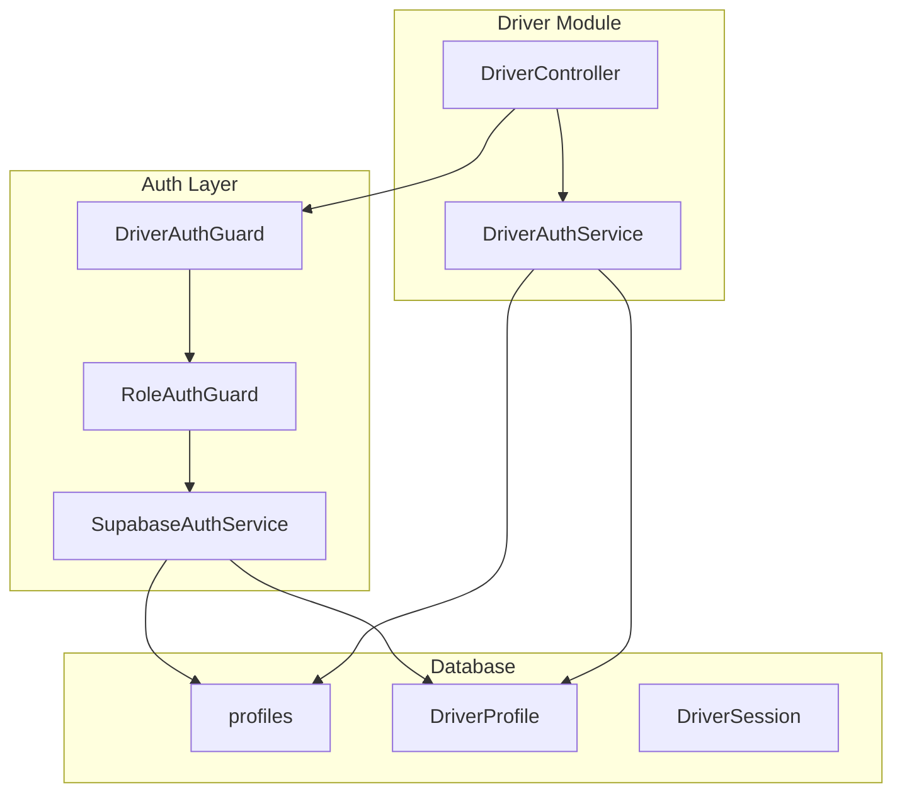
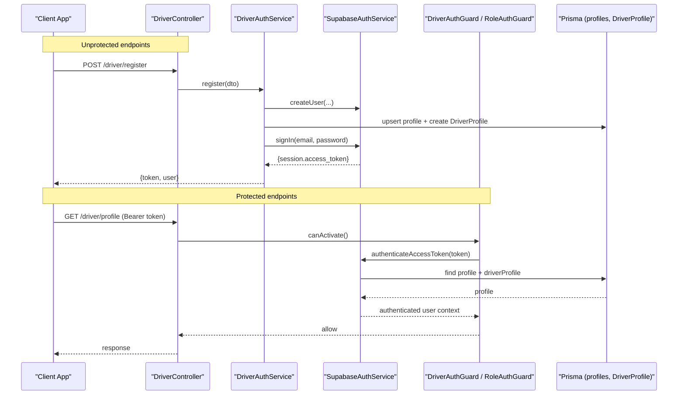
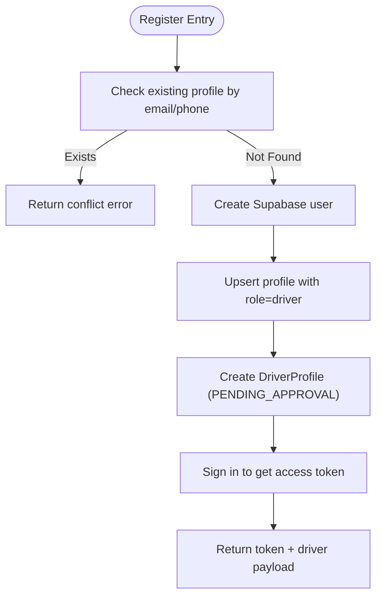
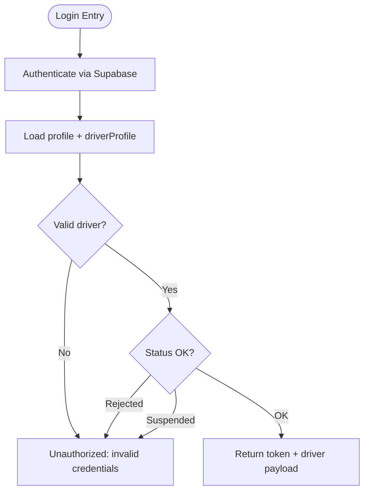
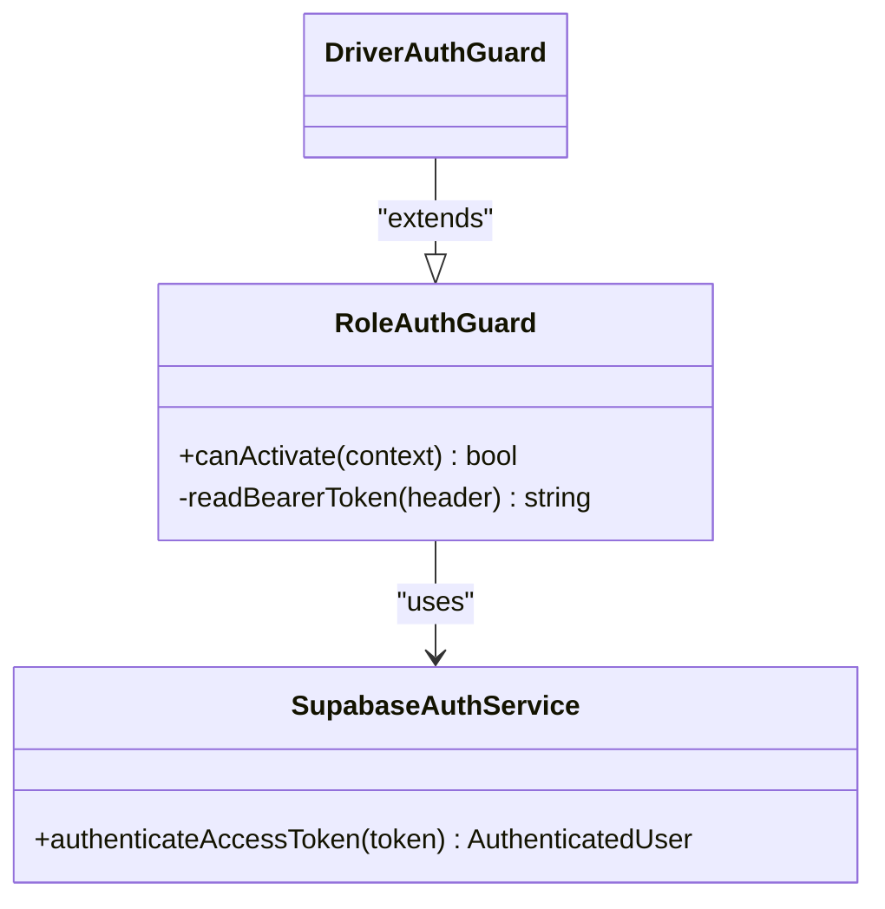
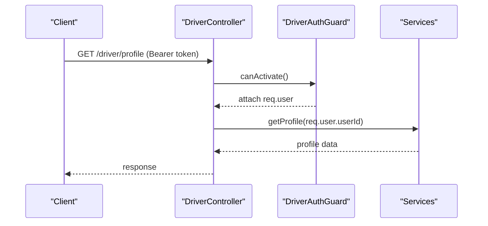
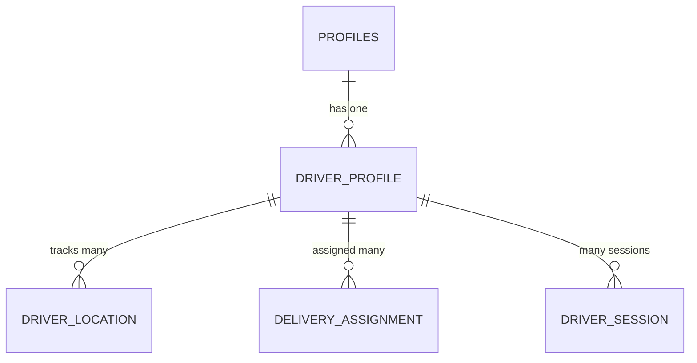
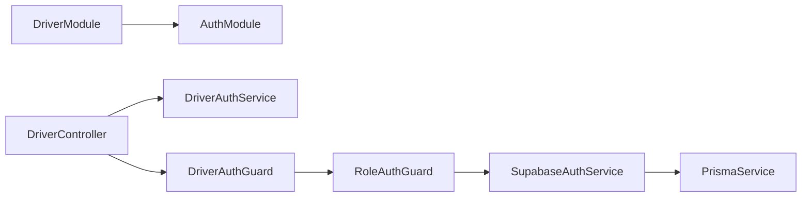

# Driver Authentication & Security

<cite>
**Referenced Files in This Document**
- [driver-auth.guard.ts](file://apps/api/src/auth/driver-auth.guard.ts)
- [role-auth.guard.ts](file://apps/api/src/auth/role-auth.guard.ts)
- [supabase-auth.service.ts](file://apps/api/src/auth/supabase-auth.service.ts)
- [auth.module.ts](file://apps/api/src/auth/auth.module.ts)
- [driver.controller.ts](file://apps/api/src/modules/driver/driver.controller.ts)
- [driver-auth.service.ts](file://apps/api/src/modules/driver/driver-auth.service.ts)
- [driver.module.ts](file://apps/api/src/modules/driver/driver.module.ts)
- [schema.prisma](file://apps/api/prisma/schema.prisma)
</cite>

## Table of Contents
1. Introduction
2. Project Structure
3. Core Components
4. Architecture Overview
5. Detailed Component Analysis
6. Dependency Analysis
7. Performance Considerations
8. Troubleshooting Guide
9. Conclusion

## Introduction
This document explains the driver authentication and security system for the API service. It covers JWT-based authentication via Supabase, driver registration and login flows, token validation and role enforcement using guards, session management concepts, and security best practices. It also provides guidance on middleware usage, error handling, and integration with the broader authentication system.

## Project Structure
The driver authentication system is implemented in the NestJS API under:
- Auth layer: shared authentication services and guards
- Driver module: driver-specific controllers, services, and DTOs
- Database schema: Prisma models for profiles, driver profiles, sessions, locations, and deliveries

**Diagram sources**
- [driver.controller.ts:37-59](file://apps/api/src/modules/driver/driver.controller.ts#L37-L59)
- [driver-auth.service.ts:21-126](file://apps/api/src/modules/driver/driver-auth.service.ts#L21-L126)
- [driver-auth.guard.ts:5-9](file://apps/api/src/auth/driver-auth.guard.ts#L5-L9)
- [role-auth.guard.ts:5-36](file://apps/api/src/auth/role-auth.guard.ts#L5-L36)
- [supabase-auth.service.ts:12-64](file://apps/api/src/auth/supabase-auth.service.ts#L12-L64)
- [schema.prisma:806-954](file://apps/api/prisma/schema.prisma#L806-L954)

**Section sources**
- [driver.controller.ts:37-59](file://apps/api/src/modules/driver/driver.controller.ts#L37-L59)
- [driver.module.ts:12-31](file://apps/api/src/modules/driver/driver.module.ts#L12-L31)
- [auth.module.ts:8-12](file://apps/api/src/auth/auth.module.ts#L8-L12)

## Core Components
- SupabaseAuthService: Handles sign-in, user creation, and access token verification against Supabase Auth; enriches context with profile data from Prisma.
- RoleAuthGuard: Base guard that validates Bearer tokens and enforces a required role (admin or driver).
- DriverAuthGuard: Specialized guard enforcing the driver role by extending RoleAuthGuard.
- DriverController: Exposes driver endpoints for auth (register/login), profile, location, documents, and order lifecycle actions; protected by DriverAuthGuard where appropriate.
- DriverAuthService: Orchestrates driver registration and login, integrates Supabase Auth and Prisma to create profiles and driver records, and returns tokens.

Key responsibilities:
- Registration: Create Supabase user, upsert profile with role driver, create DriverProfile, return token.
- Login: Validate credentials via Supabase, load profile and driver record, enforce approval status, return token.
- Authorization: Guards validate tokens and ensure the user has the driver role before accessing protected routes.

**Section sources**
- [supabase-auth.service.ts:26-64](file://apps/api/src/auth/supabase-auth.service.ts#L26-L64)
- [role-auth.guard.ts:11-36](file://apps/api/src/auth/role-auth.guard.ts#L11-L36)
- [driver-auth.guard.ts:5-9](file://apps/api/src/auth/driver-auth.guard.ts#L5-L9)
- [driver.controller.ts:47-119](file://apps/api/src/modules/driver/driver.controller.ts#L47-L119)
- [driver-auth.service.ts:21-126](file://apps/api/src/modules/driver/driver-auth.service.ts#L21-L126)

## Architecture Overview
The flow uses Supabase’s JWT access tokens. Clients authenticate via driver endpoints, receive an access token, and include it as a Bearer token in subsequent requests. The RoleAuthGuard extracts and verifies the token, loads the user profile and driver profile, and attaches them to the request context. Protected endpoints then rely on this enriched context.

**Diagram sources**
- [driver.controller.ts:47-67](file://apps/api/src/modules/driver/driver.controller.ts#L47-L67)
- [driver-auth.service.ts:21-126](file://apps/api/src/modules/driver/driver-auth.service.ts#L21-L126)
- [supabase-auth.service.ts:26-64](file://apps/api/src/auth/supabase-auth.service.ts#L26-L64)
- [role-auth.guard.ts:11-36](file://apps/api/src/auth/role-auth.guard.ts#L11-L36)

## Detailed Component Analysis

### Driver Registration Flow
- Validates uniqueness of email/phone at the profile level.
- Creates a Supabase user with metadata.
- Upserts a profile with role driver and active status.
- Creates a DriverProfile with PENDING_APPROVAL status.
- Signs in immediately to obtain an access token and returns it along with driver info.

**Diagram sources**
- [driver-auth.service.ts:21-89](file://apps/api/src/modules/driver/driver-auth.service.ts#L21-L89)

**Section sources**
- [driver-auth.service.ts:21-89](file://apps/api/src/modules/driver/driver-auth.service.ts#L21-L89)

### Driver Login Flow
- Accepts email or phone plus password.
- Authenticates via Supabase.
- Loads profile and driver profile from Prisma.
- Enforces that the driver exists and is not rejected or suspended.
- Returns access token and driver payload.

**Diagram sources**
- [driver-auth.service.ts:95-126](file://apps/api/src/modules/driver/driver-auth.service.ts#L95-L126)

**Section sources**
- [driver-auth.service.ts:95-126](file://apps/api/src/modules/driver/driver-auth.service.ts#L95-L126)

### Token Validation and Role Enforcement
- RoleAuthGuard reads the Bearer token from the Authorization header.
- Calls SupabaseAuthService.authenticateAccessToken to validate the token and fetch the user profile.
- Ensures the profile role matches the required role (driver).
- Attaches userId, role, profile, and driverProfile to the request object for downstream handlers.

**Diagram sources**
- [role-auth.guard.ts:5-36](file://apps/api/src/auth/role-auth.guard.ts#L5-L36)
- [driver-auth.guard.ts:5-9](file://apps/api/src/auth/driver-auth.guard.ts#L5-L9)
- [supabase-auth.service.ts:49-64](file://apps/api/src/auth/supabase-auth.service.ts#L49-L64)

**Section sources**
- [role-auth.guard.ts:11-36](file://apps/api/src/auth/role-auth.guard.ts#L11-L36)
- [driver-auth.guard.ts:5-9](file://apps/api/src/auth/driver-auth.guard.ts#L5-L9)
- [supabase-auth.service.ts:49-64](file://apps/api/src/auth/supabase-auth.service.ts#L49-L64)

### Protected Endpoints and Middleware Usage
- All driver-only endpoints are decorated with @UseGuards(DriverAuthGuard) to enforce role checks.
- Examples include profile retrieval, online/offline status updates, location reporting, document uploads, and order lifecycle actions.
- Controllers rely on req.user populated by the guard to identify the current driver and their associated driverProfile.

**Diagram sources**
- [driver.controller.ts:63-119](file://apps/api/src/modules/driver/driver.controller.ts#L63-L119)
- [driver-auth.guard.ts:5-9](file://apps/api/src/auth/driver-auth.guard.ts#L5-L9)
- [role-auth.guard.ts:11-36](file://apps/api/src/auth/role-auth.guard.ts#L11-L36)

**Section sources**
- [driver.controller.ts:63-119](file://apps/api/src/modules/driver/driver.controller.ts#L63-L119)

### Data Models Relevant to Driver Auth and Sessions
- profiles: Stores user identity and role (including driver).
- DriverProfile: Holds vehicle details, documents, status (PENDING_APPROVAL, SUSPENDED, etc.), online state, and metrics.
- DriverSession: Tracks work sessions with start/end times and stats.
- DriverLocation: Real-time GPS tracking per driver.
- DeliveryAssignment: Links drivers to orders and tracks delivery workflow.

**Diagram sources**
- [schema.prisma:806-954](file://apps/api/prisma/schema.prisma#L806-L954)

**Section sources**
- [schema.prisma:806-954](file://apps/api/prisma/schema.prisma#L806-L954)

## Dependency Analysis
- DriverModule imports AuthModule to gain access to guards and SupabaseAuthService.
- DriverController depends on DriverAuthService and other domain services; all protected routes depend on DriverAuthGuard.
- RoleAuthGuard depends on SupabaseAuthService for token validation and profile enrichment.
- SupabaseAuthService depends on PrismaService to resolve profiles and driver profiles.

**Diagram sources**
- [driver.module.ts:12-31](file://apps/api/src/modules/driver/driver.module.ts#L12-L31)
- [auth.module.ts:8-12](file://apps/api/src/auth/auth.module.ts#L8-L12)
- [driver.controller.ts:37-45](file://apps/api/src/modules/driver/driver.controller.ts#L37-L45)
- [driver-auth.guard.ts:5-9](file://apps/api/src/auth/driver-auth.guard.ts#L5-L9)
- [role-auth.guard.ts:5-36](file://apps/api/src/auth/role-auth.guard.ts#L5-L36)
- [supabase-auth.service.ts:12-24](file://apps/api/src/auth/supabase-auth.service.ts#L12-L24)

**Section sources**
- [driver.module.ts:12-31](file://apps/api/src/modules/driver/driver.module.ts#L12-L31)
- [auth.module.ts:8-12](file://apps/api/src/auth/auth.module.ts#L8-L12)

## Performance Considerations
- Token validation occurs per request; ensure Supabase client configuration avoids unnecessary session persistence overhead.
- Profile loading includes driverProfile; consider selective field projection if payloads grow large.
- Location updates can be frequent; batch or throttle as needed in higher layers.
- Use database indexes defined in the schema for efficient queries on driverId, timestamps, and status fields.

[No sources needed since this section provides general guidance]

## Troubleshooting Guide
Common errors and their causes:
- Invalid authorization header format: Missing or malformed Bearer token. Ensure requests include Authorization: Bearer <token>.
- Invalid or expired token: Supabase token verification failed; refresh the token on the client side.
- Profile not found: User exists but no corresponding profile; registration may have failed or been incomplete.
- Insufficient permissions: Token belongs to a non-driver role; use the correct role guard or role.
- Invalid credentials: Wrong email/phone or password during login; verify inputs.
- Driver application rejected or account suspended: Login blocked due to driver profile status; requires admin action.

Where these are handled:
- Header parsing and token extraction in RoleAuthGuard.
- Token verification and profile lookup in SupabaseAuthService.
- Driver status checks in DriverAuthService.

**Section sources**
- [role-auth.guard.ts:30-36](file://apps/api/src/auth/role-auth.guard.ts#L30-L36)
- [supabase-auth.service.ts:49-64](file://apps/api/src/auth/supabase-auth.service.ts#L49-L64)
- [driver-auth.service.ts:107-118](file://apps/api/src/modules/driver/driver-auth.service.ts#L107-L118)

## Conclusion
The driver authentication system leverages Supabase JWTs and NestJS guards to secure driver-only endpoints. Registration creates both a Supabase user and a driver profile, while login validates credentials and enforces driver status. Role-based guards ensure only drivers access protected routes, and the request context carries enriched user and driver information for business logic. For robust security, always validate tokens server-side, enforce roles via guards, manage driver statuses centrally, and follow best practices for token storage and refresh on clients.

[No sources needed since this section summarizes without analyzing specific files]