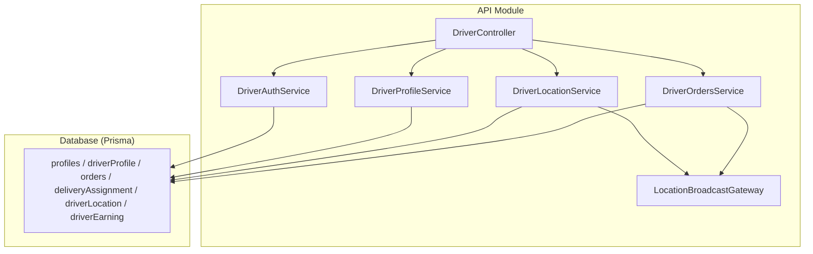
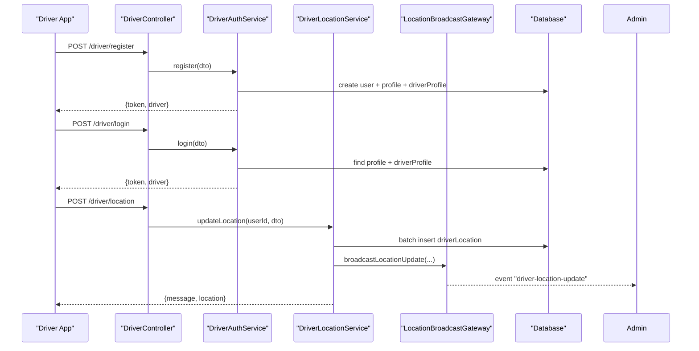
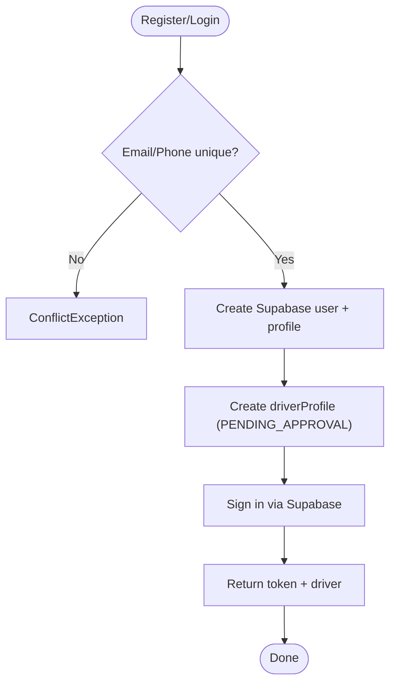
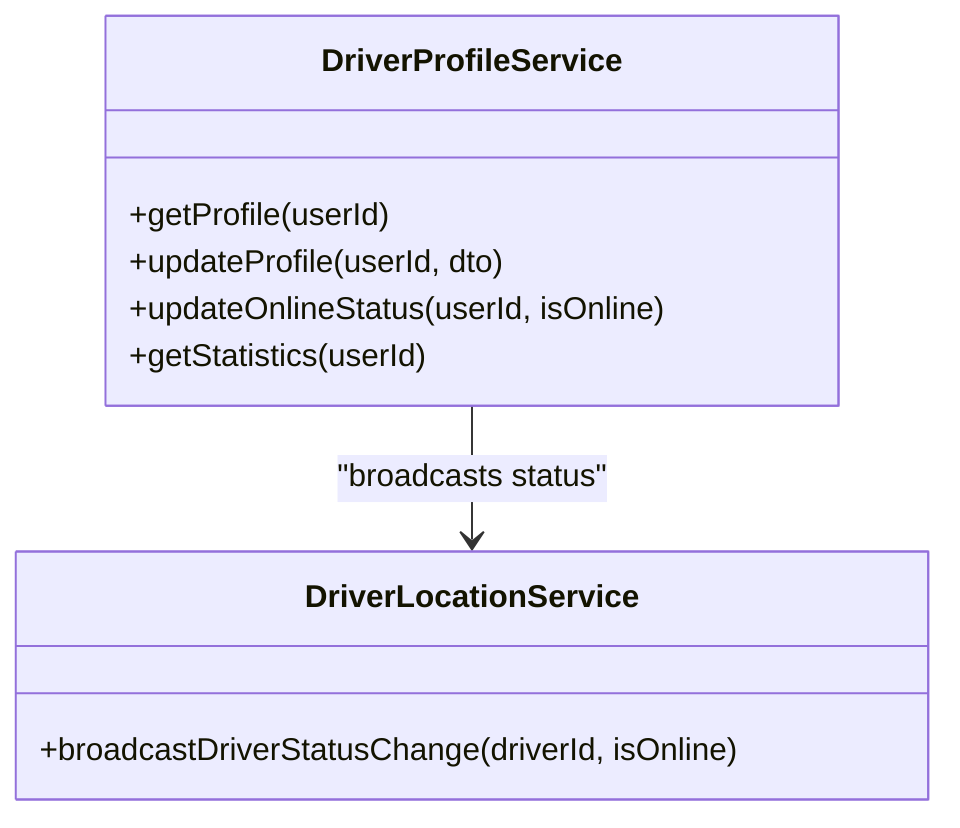
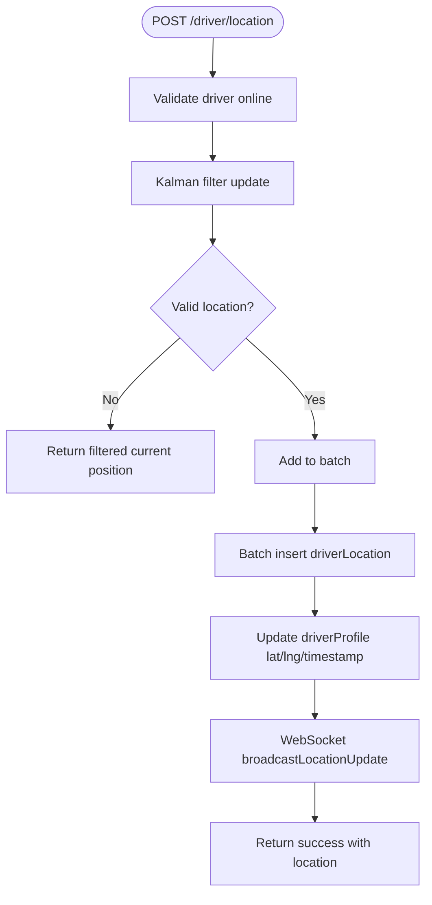
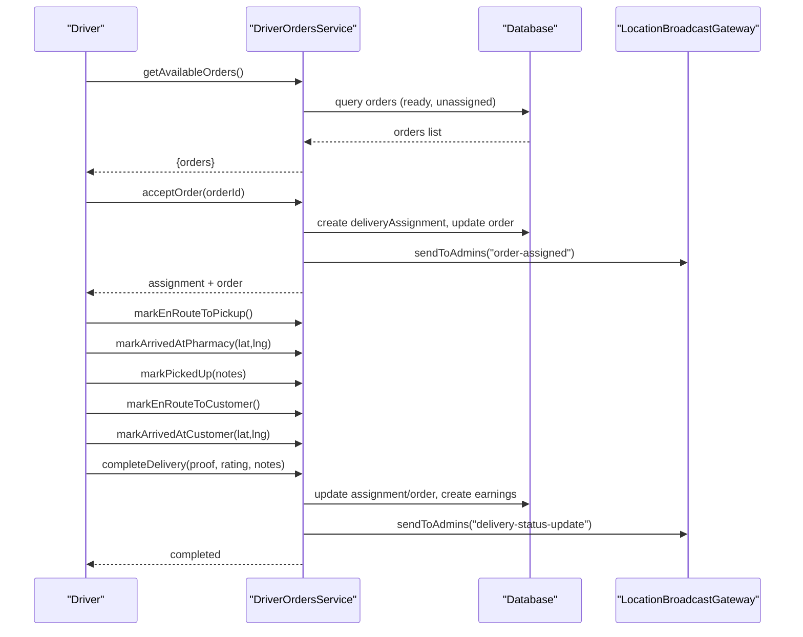
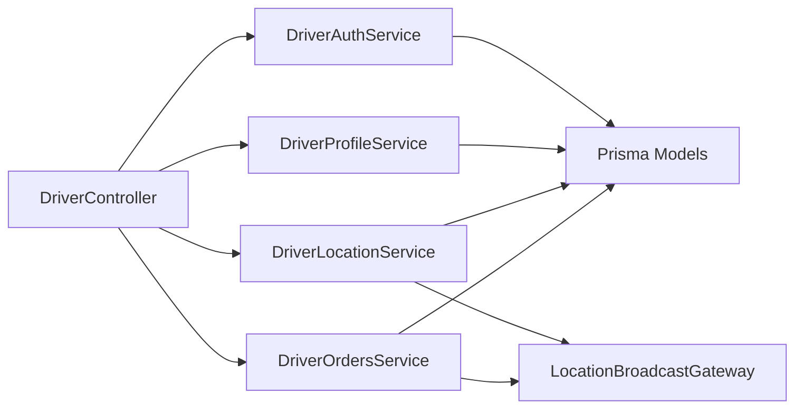

# Driver Management

<cite>
**Referenced Files in This Document**
- [driver.controller.ts](file://apps/api/src/modules/driver/driver.controller.ts)
- [driver-auth.service.ts](file://apps/api/src/modules/driver/driver-auth.service.ts)
- [driver-profile.service.ts](file://apps/api/src/modules/driver/driver-profile.service.ts)
- [driver-location.service.ts](file://apps/api/src/modules/driver/driver-location.service.ts)
- [driver-orders.service.ts](file://apps/api/src/modules/driver/driver-orders.service.ts)
- [location-broadcast.gateway.ts](file://apps/api/src/modules/driver/location-broadcast.gateway.ts)
- [driver-auth.guard.ts](file://apps/api/src/auth/driver-auth.guard.ts)
- [schema.prisma](file://apps/api/prisma/schema.prisma)
</cite>

## Table of Contents
1. Introduction
2. Project Structure
3. Core Components
4. Architecture Overview
5. Detailed Component Analysis
6. Dependency Analysis
7. Performance Considerations
8. Troubleshooting Guide
9. Conclusion

## Introduction
This document explains the driver management system implemented in the API module. It covers driver registration and authentication, GPS location tracking with real-time broadcasting via WebSocket, order assignment and lifecycle management, profile and availability status, performance tracking, delivery proof collection, and exception handling. It also documents the driver authentication guards, location update services, and order synchronization mechanisms between drivers, admins, and clients.

## Project Structure
The driver feature is organized under apps/api/src/modules/driver with a controller exposing REST endpoints, services for auth/profile/location/orders, a WebSocket gateway for real-time updates, and DTOs for request validation. The database schema defines core entities such as profiles, orders, delivery assignments, driver locations, and earnings.

**Diagram sources**
- [driver.controller.ts:37-234](file://apps/api/src/modules/driver/driver.controller.ts#L37-L234)
- [driver-auth.service.ts:11-150](file://apps/api/src/modules/driver/driver-auth.service.ts#L11-L150)
- [driver-profile.service.ts:6-266](file://apps/api/src/modules/driver/driver-profile.service.ts#L6-L266)
- [driver-location.service.ts:7-352](file://apps/api/src/modules/driver/driver-location.service.ts#L7-L352)
- [driver-orders.service.ts:49-621](file://apps/api/src/modules/driver/driver-orders.service.ts#L49-L621)
- [location-broadcast.gateway.ts:27-214](file://apps/api/src/modules/driver/location-broadcast.gateway.ts#L27-L214)
- [schema.prisma:556-763](file://apps/api/prisma/schema.prisma#L556-L763)

**Section sources**
- [driver.controller.ts:37-234](file://apps/api/src/modules/driver/driver.controller.ts#L37-L234)
- [schema.prisma:556-763](file://apps/api/prisma/schema.prisma#L556-L763)

## Core Components
- DriverController: Exposes REST endpoints for auth, profile, status, location, documents, and order workflows. All protected by DriverAuthGuard.
- DriverAuthService: Handles driver registration and login, integrates with Supabase auth, creates/updates profiles and driver profiles, and returns tokens.
- DriverProfileService: Manages driver profile data, online/offline status transitions, session tracking, and statistics aggregation.
- DriverLocationService: Processes GPS updates with Kalman filtering, batches writes to driverLocation, updates current position, and broadcasts via WebSocket.
- DriverOrdersService: Implements available orders listing, acceptance/rejection, geofenced arrival checks, full delivery lifecycle transitions, history, and earnings recording.
- LocationBroadcastGateway: WebSocket server for broadcasting driver locations and status changes; authenticates admin connections and supports rooms for targeted messaging.
- Guards: DriverAuthGuard enforces role-based access for driver endpoints.

**Section sources**
- [driver.controller.ts:37-234](file://apps/api/src/modules/driver/driver.controller.ts#L37-L234)
- [driver-auth.service.ts:11-150](file://apps/api/src/modules/driver/driver-auth.service.ts#L11-L150)
- [driver-profile.service.ts:6-266](file://apps/api/src/modules/driver/driver-profile.service.ts#L6-L266)
- [driver-location.service.ts:7-352](file://apps/api/src/modules/driver/driver-location.service.ts#L7-L352)
- [driver-orders.service.ts:49-621](file://apps/api/src/modules/driver/driver-orders.service.ts#L49-L621)
- [location-broadcast.gateway.ts:27-214](file://apps/api/src/modules/driver/location-broadcast.gateway.ts#L27-L214)
- [driver-auth.guard.ts:1-10](file://apps/api/src/auth/driver-auth.guard.ts#L1-L10)

## Architecture Overview
The system uses a layered architecture:
- Controllers handle HTTP requests and delegate to services.
- Services encapsulate business logic and interact with Prisma for persistence.
- Real-time communication is handled by a WebSocket gateway that emits events to admin dashboards and driver clients.
- Database models include profiles, driver profiles, orders, delivery assignments, driver locations, and driver earnings.

**Diagram sources**
- [driver.controller.ts:47-119](file://apps/api/src/modules/driver/driver.controller.ts#L47-L119)
- [driver-auth.service.ts:21-126](file://apps/api/src/modules/driver/driver-auth.service.ts#L21-L126)
- [driver-location.service.ts:30-127](file://apps/api/src/modules/driver/driver-location.service.ts#L30-L127)
- [location-broadcast.gateway.ts:124-127](file://apps/api/src/modules/driver/location-broadcast.gateway.ts#L124-L127)
- [schema.prisma:556-763](file://apps/api/prisma/schema.prisma#L556-L763)

## Detailed Component Analysis

### Driver Registration and Authentication
- Registration flow:
  - Validates uniqueness of email/phone.
  - Creates Supabase user and profile with role driver.
  - Creates driver profile with status PENDING_APPROVAL.
  - Signs in and returns token and driver info.
- Login flow:
  - Authenticates via Supabase.
  - Loads profile and driver profile.
  - Rejects if status is REJECTED or SUSPENDED.
  - Returns token and driver info.

**Diagram sources**
- [driver-auth.service.ts:21-126](file://apps/api/src/modules/driver/driver-auth.service.ts#L21-L126)

**Section sources**
- [driver-auth.service.ts:21-126](file://apps/api/src/modules/driver/driver-auth.service.ts#L21-L126)

### Driver Profile Management and Availability
- Profile retrieval includes driver profile details and metadata.
- Profile updates allow vehicle/license fields and photos; disallowed when suspended/rejected.
- Online/offline status:
  - Going online sets status ACTIVE and starts a driver session.
  - Going offline ends current session and records online time.
  - Broadcasts status change via WebSocket.

**Diagram sources**
- [driver-profile.service.ts:17-178](file://apps/api/src/modules/driver/driver-profile.service.ts#L17-L178)
- [driver-location.service.ts:223-245](file://apps/api/src/modules/driver/driver-location.service.ts#L223-L245)

**Section sources**
- [driver-profile.service.ts:17-178](file://apps/api/src/modules/driver/driver-profile.service.ts#L17-L178)

### GPS Location Tracking and Real-Time Broadcasting
- Location updates:
  - Requires driver to be online.
  - Applies Kalman filter to smooth coordinates and reject invalid readings.
  - Batches writes to driverLocation for efficiency.
  - Updates driverProfile currentLat/currentLng and lastLocationAt.
  - Broadcasts via WebSocket to all subscribers.
- History and current location endpoints are provided.

**Diagram sources**
- [driver-location.service.ts:30-127](file://apps/api/src/modules/driver/driver-location.service.ts#L30-L127)
- [location-broadcast.gateway.ts:124-127](file://apps/api/src/modules/driver/location-broadcast.gateway.ts#L124-L127)

**Section sources**
- [driver-location.service.ts:30-127](file://apps/api/src/modules/driver/driver-location.service.ts#L30-L127)

### Order Assignment, Acceptance, and Completion Workflow
- Available orders:
  - Lists ready orders not assigned or previously rejected/cancelled.
  - Computes distances and estimated earnings based on pharmacy and customer locations.
- Accept order:
  - Ensures driver has no active delivery.
  - Creates deliveryAssignment and updates order to driver-accepted state.
  - Broadcasts assignment to admins.
- Lifecycle transitions:
  - En route to pickup, arrived at pharmacy, picked up, en route to customer, arrived at customer, delivered.
  - Geofence checks enforce proximity for arrival events.
- Completion:
  - Records proof photo, signature, notes, rating, feedback.
  - Updates order to delivered, creates earnings record, increments counters and rating average.
  - Broadcasts delivery completion.

**Diagram sources**
- [driver-orders.service.ts:79-295](file://apps/api/src/modules/driver/driver-orders.service.ts#L79-L295)
- [driver-orders.service.ts:382-510](file://apps/api/src/modules/driver/driver-orders.service.ts#L382-L510)
- [location-broadcast.gateway.ts:193-195](file://apps/api/src/modules/driver/location-broadcast.gateway.ts#L193-L195)

**Section sources**
- [driver-orders.service.ts:79-295](file://apps/api/src/modules/driver/driver-orders.service.ts#L79-L295)
- [driver-orders.service.ts:382-510](file://apps/api/src/modules/driver/driver-orders.service.ts#L382-L510)

### Driver-Customer Communication and Delivery Proof
- Communication:
  - While not directly exposed in these controllers, the order model includes customer contact fields and notes, enabling app-level messaging flows.
- Delivery proof:
  - Completion endpoint accepts proofPhotoUrl, customerSignature, deliveryNotes, customerRating, and customerFeedback.
  - These are persisted in deliveryAssignment and used for analytics and disputes.

**Section sources**
- [driver-orders.service.ts:435-510](file://apps/api/src/modules/driver/driver-orders.service.ts#L435-L510)
- [schema.prisma:556-592](file://apps/api/prisma/schema.prisma#L556-L592)

### Driver Authentication Guards
- DriverAuthGuard extends RoleAuthGuard to enforce role 'driver' on protected endpoints.
- Applied across driver controller routes for secure access control.

**Section sources**
- [driver.controller.ts:63-119](file://apps/api/src/modules/driver/driver.controller.ts#L63-L119)
- [driver-auth.guard.ts:1-10](file://apps/api/src/auth/driver-auth.guard.ts#L1-L10)

### Location Update Services and Order Synchronization
- Location service:
  - Uses Kalman filtering and batching to optimize writes.
  - Broadcasts real-time updates via WebSocket.
- Order synchronization:
  - Order status transitions are synchronized with deliveryAssignment states.
  - Admins receive real-time notifications for key events (assignment, delivery status updates).

**Section sources**
- [driver-location.service.ts:30-127](file://apps/api/src/modules/driver/driver-location.service.ts#L30-L127)
- [driver-orders.service.ts:558-619](file://apps/api/src/modules/driver/driver-orders.service.ts#L558-L619)
- [location-broadcast.gateway.ts:193-195](file://apps/api/src/modules/driver/location-broadcast.gateway.ts#L193-L195)

## Dependency Analysis
- Controller depends on services for auth, profile, location, and orders.
- Services depend on Prisma for persistence and on each other where necessary (e.g., profile service triggers location service for status broadcasts).
- WebSocket gateway depends on location service to fetch initial online drivers and is invoked by services to emit events.
- Database schema defines relationships among profiles, orders, delivery assignments, driver locations, and earnings.

**Diagram sources**
- [driver.controller.ts:37-234](file://apps/api/src/modules/driver/driver.controller.ts#L37-L234)
- [driver-auth.service.ts:11-150](file://apps/api/src/modules/driver/driver-auth.service.ts#L11-L150)
- [driver-profile.service.ts:6-266](file://apps/api/src/modules/driver/driver-profile.service.ts#L6-L266)
- [driver-location.service.ts:7-352](file://apps/api/src/modules/driver/driver-location.service.ts#L7-L352)
- [driver-orders.service.ts:49-621](file://apps/api/src/modules/driver/driver-orders.service.ts#L49-L621)
- [location-broadcast.gateway.ts:27-214](file://apps/api/src/modules/driver/location-broadcast.gateway.ts#L27-L214)
- [schema.prisma:556-763](file://apps/api/prisma/schema.prisma#L556-L763)

**Section sources**
- [driver.controller.ts:37-234](file://apps/api/src/modules/driver/driver.controller.ts#L37-L234)
- [schema.prisma:556-763](file://apps/api/prisma/schema.prisma#L556-L763)

## Performance Considerations
- Location batching reduces database write overhead; batch size and interval are tuned for throughput.
- Kalman filtering minimizes storage of noisy GPS points and improves accuracy.
- Haversine distance calculations are used for nearest-first sorting and geofencing; consider indexing and caching strategies for large datasets.
- WebSocket broadcasts are lightweight but should be rate-limited on client side to avoid UI thrashing.
- Session tracking captures online time for performance metrics and billing.

[No sources needed since this section provides general guidance]

## Troubleshooting Guide
- Authentication failures:
  - Ensure driver profile exists and is not REJECTED or SUSPENDED during login.
  - Verify token validity for WebSocket connections; non-admin tokens are rejected for admin sockets.
- Location issues:
  - If location is filtered out, the service returns the last valid position; check device GPS accuracy and frequency.
  - Ensure driver is online before sending location updates.
- Order workflow errors:
  - Conflicts may occur if a driver already has an active delivery or if order status changed.
  - Geofence violations will throw errors; verify proximity to pharmacy/customer before marking arrivals.
- WebSocket connectivity:
  - Confirm CORS origins and credentials are configured correctly.
  - Use subscribe-admin-updates for admin dashboards and subscribe-driver-updates for per-driver channels.

**Section sources**
- [driver-auth.service.ts:95-126](file://apps/api/src/modules/driver/driver-auth.service.ts#L95-L126)
- [location-broadcast.gateway.ts:61-93](file://apps/api/src/modules/driver/location-broadcast.gateway.ts#L61-L93)
- [driver-location.service.ts:30-127](file://apps/api/src/modules/driver/driver-location.service.ts#L30-L127)
- [driver-orders.service.ts:187-295](file://apps/api/src/modules/driver/driver-orders.service.ts#L187-L295)
- [driver-orders.service.ts:386-433](file://apps/api/src/modules/driver/driver-orders.service.ts#L386-L433)

## Conclusion
The driver management system provides a robust foundation for driver onboarding, real-time location tracking, and end-to-end delivery workflows. It leverages efficient data processing, strict access controls, and real-time communication to support both drivers and administrators. Future enhancements can include advanced routing algorithms, richer communication features, and expanded analytics for performance optimization.

[No sources needed since this section summarizes without analyzing specific files]