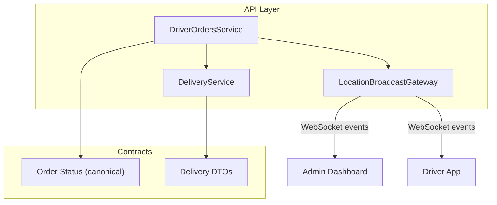
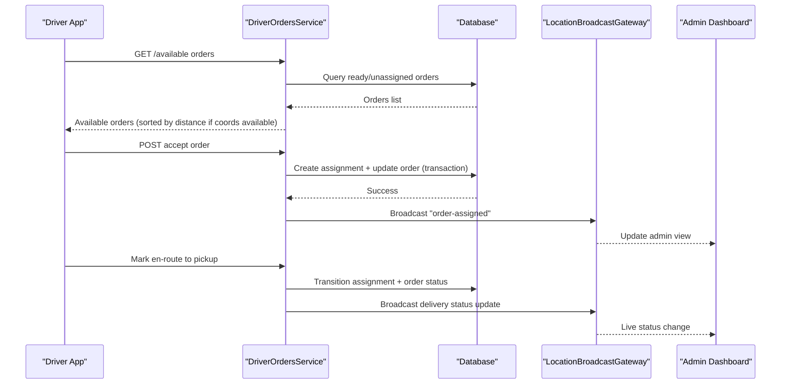
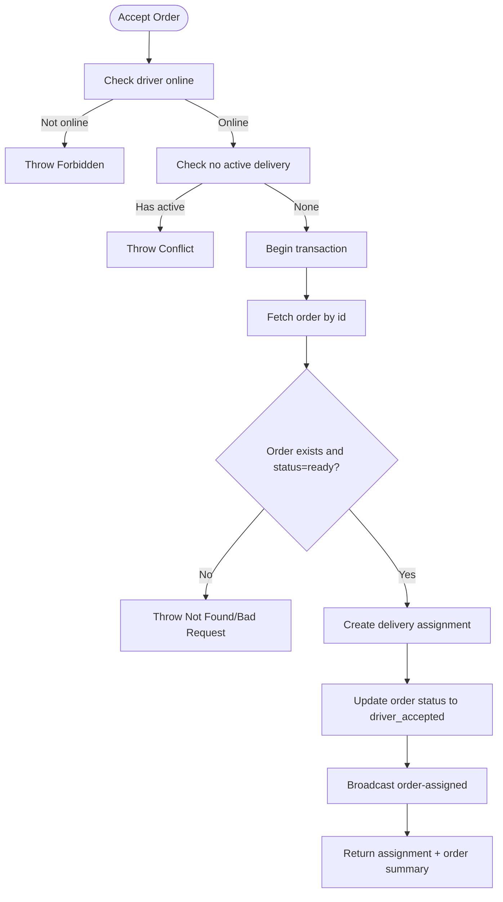
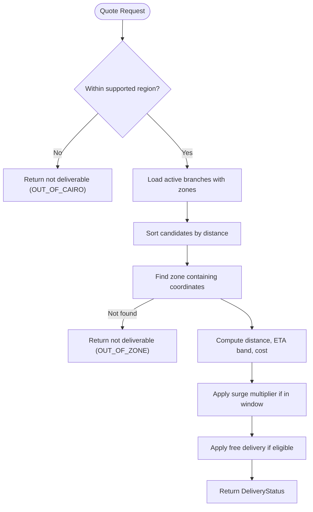
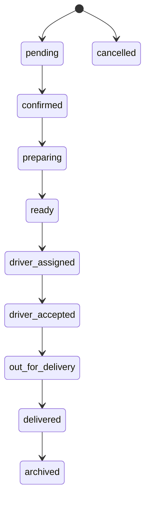
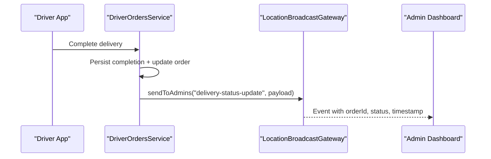
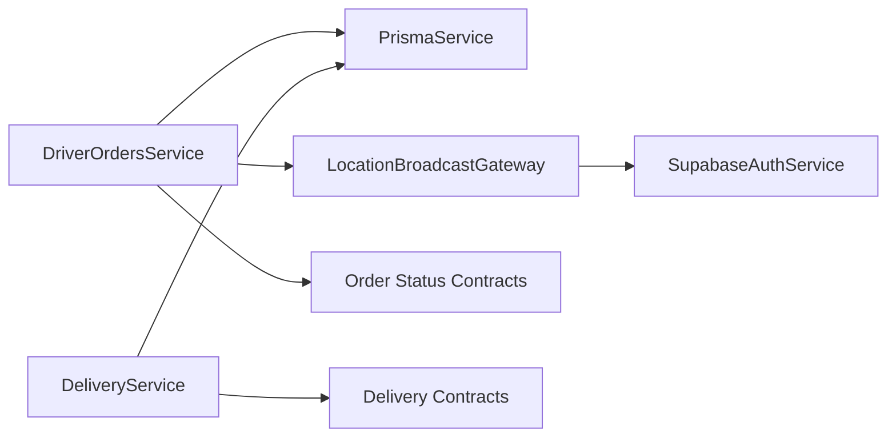

# Driver Order Management

<cite>
**Referenced Files in This Document**
- [driver-orders.service.ts](file://apps/api/src/modules/driver/driver-orders.service.ts)
- [delivery.service.ts](file://apps/api/src/modules/delivery/delivery.service.ts)
- [orderStatus.ts](file://packages/contracts/src/orderStatus.ts)
- [delivery.ts](file://packages/contracts/src/delivery.ts)
- [location-broadcast.gateway.ts](file://apps/api/src/modules/driver/location-broadcast.gateway.ts)
</cite>

## Table of Contents
1. Introduction
2. Project Structure
3. Core Components
4. Architecture Overview
5. Detailed Component Analysis
6. Dependency Analysis
7. Performance Considerations
8. Troubleshooting Guide
9. Conclusion

## Introduction
This document explains the driver order management functionality end-to-end: how orders are discovered, accepted, navigated to pickup and delivery locations, completed with proof collection, and synchronized across driver and customer interfaces. It also covers real-time status updates, conflict resolution, exception handling for failed deliveries and cancellations, communication features, prioritization, route optimization hints, and performance metrics tracking.

## Project Structure
The driver order lifecycle is implemented primarily in the API layer with supporting contracts and real-time broadcasting:
- Driver service orchestrates order availability, acceptance, workflow transitions, completion, and history.
- Delivery service computes quotes, ETAs, zone matching, and surge pricing.
- Contracts define canonical order statuses and request/response schemas used across services.
- WebSocket gateway broadcasts driver locations and delivery status updates to admin dashboards and clients.

**Diagram sources**
- [driver-orders.service.ts:50-621](file://apps/api/src/modules/driver/driver-orders.service.ts#L50-L621)
- [delivery.service.ts:58-239](file://apps/api/src/modules/delivery/delivery.service.ts#L58-L239)
- [orderStatus.ts:59-168](file://packages/contracts/src/orderStatus.ts#L59-L168)
- [delivery.ts:1-67](file://packages/contracts/src/delivery.ts#L1-L67)
- [location-broadcast.gateway.ts:27-214](file://apps/api/src/modules/driver/location-broadcast.gateway.ts#L27-L214)

**Section sources**
- [driver-orders.service.ts:50-621](file://apps/api/src/modules/driver/driver-orders.service.ts#L50-L621)
- [delivery.service.ts:58-239](file://apps/api/src/modules/delivery/delivery.service.ts#L58-L239)
- [orderStatus.ts:59-168](file://packages/contracts/src/orderStatus.ts#L59-L168)
- [delivery.ts:1-67](file://packages/contracts/src/delivery.ts#L1-L67)
- [location-broadcast.gateway.ts:27-214](file://apps/api/src/modules/driver/location-broadcast.gateway.ts#L27-L214)

## Core Components
- DriverOrdersService: Manages available orders, acceptance/rejection, active delivery retrieval, workflow transitions (pickup, en-route, arrival, completion), delivery history, and earnings recording.
- DeliveryService: Computes delivery quotes, ETA bands, branch/zone matching, surge pricing, and deliverability checks.
- LocationBroadcastGateway: Real-time WebSocket gateway for driver location updates and delivery status events to admins and drivers.
- Contracts: Canonical order statuses and transition rules; delivery request/response schemas for validation and data transfer.

Key responsibilities:
- Availability and prioritization: Returns ready orders not assigned or previously rejected/cancelled; sorts by distance when driver coordinates are available.
- Acceptance guardrails: Ensures driver is online and has no active delivery before accepting.
- Geofencing: Validates arrivals at pharmacy and customer within a radius threshold.
- Synchronization: Updates both assignment and order status atomically and broadcasts changes.
- Completion: Records proof, notes, ratings, duration, and updates driver earnings and counters.

**Section sources**
- [driver-orders.service.ts:74-183](file://apps/api/src/modules/driver/driver-orders.service.ts#L74-L183)
- [driver-orders.service.ts:187-322](file://apps/api/src/modules/driver/driver-orders.service.ts#L187-L322)
- [driver-orders.service.ts:326-510](file://apps/api/src/modules/driver/driver-orders.service.ts#L326-L510)
- [delivery.service.ts:62-239](file://apps/api/src/modules/delivery/delivery.service.ts#L62-L239)
- [orderStatus.ts:59-168](file://packages/contracts/src/orderStatus.ts#L59-L168)
- [delivery.ts:1-67](file://packages/contracts/src/delivery.ts#L1-L67)
- [location-broadcast.gateway.ts:120-214](file://apps/api/src/modules/driver/location-broadcast.gateway.ts#L120-L214)

## Architecture Overview
The system uses a layered approach:
- Driver-facing flows go through DriverOrdersService, which validates inputs, enforces state transitions, persists changes, and emits real-time updates via LocationBroadcastGateway.
- Customer-facing quote and ETA logic goes through DeliveryService, which returns structured responses validated by contract schemas.
- Order status normalization and allowed transitions are enforced using canonical definitions from contracts.

**Diagram sources**
- [driver-orders.service.ts:74-183](file://apps/api/src/modules/driver/driver-orders.service.ts#L74-L183)
- [driver-orders.service.ts:187-322](file://apps/api/src/modules/driver/driver-orders.service.ts#L187-L322)
- [driver-orders.service.ts:382-411](file://apps/api/src/modules/driver/driver-orders.service.ts#L382-L411)
- [location-broadcast.gateway.ts:183-195](file://apps/api/src/modules/driver/location-broadcast.gateway.ts#L183-L195)

## Detailed Component Analysis

### DriverOrdersService
Responsibilities:
- Discover and prioritize available orders based on readiness and driver proximity.
- Enforce business rules for acceptance (online, no active delivery).
- Manage full delivery workflow transitions with geofencing and atomic persistence.
- Record completion artifacts (proof, notes, ratings) and compute actual duration.
- Provide delivery history with pagination and metrics.

Key behaviors:
- Distance calculation and ETA estimation for available orders and acceptance.
- Geofence checks for pharmacy and customer arrivals using a fixed radius.
- Atomic transactions for assignment and order status updates.
- Broadcasting delivery status updates to admins.

**Diagram sources**
- [driver-orders.service.ts:187-295](file://apps/api/src/modules/driver/driver-orders.service.ts#L187-L295)

**Section sources**
- [driver-orders.service.ts:74-183](file://apps/api/src/modules/driver/driver-orders.service.ts#L74-L183)
- [driver-orders.service.ts:187-322](file://apps/api/src/modules/driver/driver-orders.service.ts#L187-L322)
- [driver-orders.service.ts:382-510](file://apps/api/src/modules/driver/driver-orders.service.ts#L382-L510)
- [driver-orders.service.ts:514-554](file://apps/api/src/modules/driver/driver-orders.service.ts#L514-L554)

### DeliveryService
Responsibilities:
- Validate coordinates and restrict to supported region.
- Match nearest branch and zone; compute distance, ETA band, and cost including surge and free delivery thresholds.
- Return structured delivery status with tokens and metadata for downstream processes.

Key behaviors:
- Haversine distance computation and ETA banding tuned for city traffic conditions.
- Surge window detection and multiplier application.
- Free delivery eligibility based on cart subtotal and zone policy.

**Diagram sources**
- [delivery.service.ts:62-239](file://apps/api/src/modules/delivery/delivery.service.ts#L62-L239)

**Section sources**
- [delivery.service.ts:62-239](file://apps/api/src/modules/delivery/delivery.service.ts#L62-L239)

### Order Status and Transitions
Canonical statuses and transitions ensure consistent lifecycle enforcement across all surfaces. The driver flow maps assignment states to canonical order statuses during transitions. Terminal states prevent further changes.

**Diagram sources**
- [orderStatus.ts:59-168](file://packages/contracts/src/orderStatus.ts#L59-L168)
- [driver-orders.service.ts:581-610](file://apps/api/src/modules/driver/driver-orders.service.ts#L581-L610)

**Section sources**
- [orderStatus.ts:59-168](file://packages/contracts/src/orderStatus.ts#L59-L168)
- [driver-orders.service.ts:581-610](file://apps/api/src/modules/driver/driver-orders.service.ts#L581-L610)

### Real-Time Synchronization
The WebSocket gateway authenticates admin clients, tracks connections, and broadcasts:
- Driver location updates
- Driver online/offline status changes
- Delivery status updates to admin room
- Per-driver rooms for targeted updates

**Diagram sources**
- [driver-orders.service.ts:435-510](file://apps/api/src/modules/driver/driver-orders.service.ts#L435-L510)
- [location-broadcast.gateway.ts:183-195](file://apps/api/src/modules/driver/location-broadcast.gateway.ts#L183-L195)

**Section sources**
- [location-broadcast.gateway.ts:58-93](file://apps/api/src/modules/driver/location-broadcast.gateway.ts#L58-L93)
- [location-broadcast.gateway.ts:120-214](file://apps/api/src/modules/driver/location-broadcast.gateway.ts#L120-L214)
- [driver-orders.service.ts:613-619](file://apps/api/src/modules/driver/driver-orders.service.ts#L613-L619)

## Dependency Analysis
- DriverOrdersService depends on PrismaService for persistence and LocationBroadcastGateway for real-time updates.
- DeliveryService depends on PrismaService for branch/zone data and uses shared geometry utilities.
- Both services rely on contracts for schema validation and canonical status definitions.
- LocationBroadcastGateway depends on authentication and driver location service for initial data and event routing.

**Diagram sources**
- [driver-orders.service.ts:50-621](file://apps/api/src/modules/driver/driver-orders.service.ts#L50-L621)
- [delivery.service.ts:58-239](file://apps/api/src/modules/delivery/delivery.service.ts#L58-L239)
- [orderStatus.ts:59-168](file://packages/contracts/src/orderStatus.ts#L59-L168)
- [delivery.ts:1-67](file://packages/contracts/src/delivery.ts#L1-L67)
- [location-broadcast.gateway.ts:52-93](file://apps/api/src/modules/driver/location-broadcast.gateway.ts#L52-L93)

**Section sources**
- [driver-orders.service.ts:50-621](file://apps/api/src/modules/driver/driver-orders.service.ts#L50-L621)
- [delivery.service.ts:58-239](file://apps/api/src/modules/delivery/delivery.service.ts#L58-L239)
- [orderStatus.ts:59-168](file://packages/contracts/src/orderStatus.ts#L59-L168)
- [delivery.ts:1-67](file://packages/contracts/src/delivery.ts#L1-L67)
- [location-broadcast.gateway.ts:52-93](file://apps/api/src/modules/driver/location-broadcast.gateway.ts#L52-L93)

## Performance Considerations
- Distance-based prioritization: Available orders are sorted by distance to pickup when driver coordinates are present, improving efficiency for nearby jobs.
- ETA banding: DeliveryService uses a traffic-aware model to estimate min/max minutes, aiding customer expectations and dispatch planning.
- Transactional updates: Assignment and order status changes are wrapped in transactions to reduce contention and ensure consistency.
- Geofencing thresholds: Fixed radius reduces false positives for arrival checks while keeping validation fast.
- Pagination: Delivery history supports page/limit parameters to avoid large payloads.

[No sources needed since this section provides general guidance]

## Troubleshooting Guide
Common issues and resolutions:
- Driver offline: Acceptance and certain actions require the driver to be online; ensure driver profile indicates online status.
- Active delivery conflict: A driver cannot accept another order while an active delivery exists; complete or resolve the current assignment first.
- Order unavailable: If an order is no longer in ready state or already assigned, acceptance will fail; refresh available orders.
- Arrival geofence failure: Arriving at pharmacy or customer requires being within the specified radius; move closer and retry.
- No assignment found: Workflow transitions require the assignment to be in the expected prior state; verify current status before transitioning.
- Real-time updates not received: Ensure admin client authenticated and subscribed to admin updates; check network and CORS settings.

Error signals and handling:
- ForbiddenException for offline drivers.
- ConflictException for duplicate active deliveries or already assigned orders.
- BadRequestException for invalid transitions or geofence violations.
- NotFoundException for missing orders or assignments.
- Non-critical broadcast failures are caught and do not fail requests.

**Section sources**
- [driver-orders.service.ts:68-70](file://apps/api/src/modules/driver/driver-orders.service.ts#L68-L70)
- [driver-orders.service.ts:191-215](file://apps/api/src/modules/driver/driver-orders.service.ts#L191-L215)
- [driver-orders.service.ts:386-433](file://apps/api/src/modules/driver/driver-orders.service.ts#L386-L433)
- [driver-orders.service.ts:558-567](file://apps/api/src/modules/driver/driver-orders.service.ts#L558-L567)
- [location-broadcast.gateway.ts:61-93](file://apps/api/src/modules/driver/location-broadcast.gateway.ts#L61-L93)

## Conclusion
The driver order management system provides a robust, stateful lifecycle from order availability through completion, with strong validation, real-time synchronization, and clear separation of concerns between driver workflows and delivery quoting. Canonical statuses and contracts ensure consistency across components, while geofencing and transactional updates maintain reliability. For advanced needs such as multi-stop routing or dynamic reassignment, consider extending the service with additional algorithms and state guards.

[No sources needed since this section summarizes without analyzing specific files]