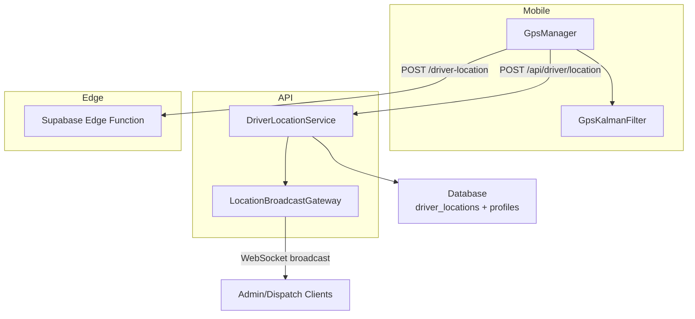
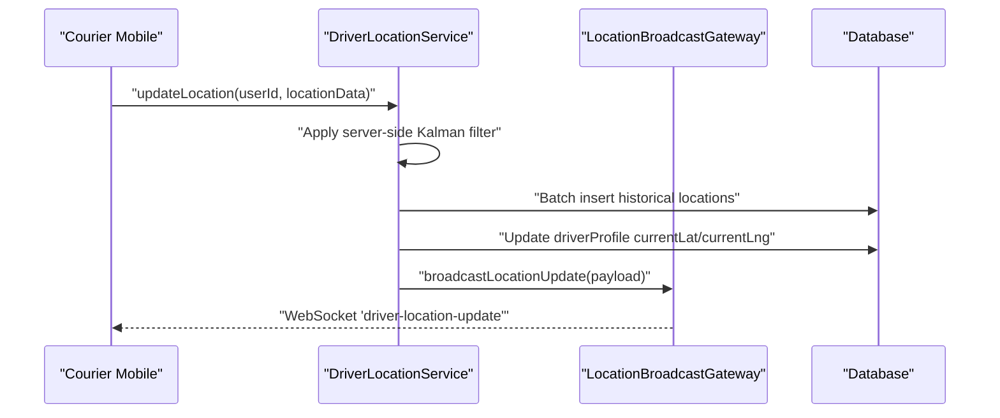
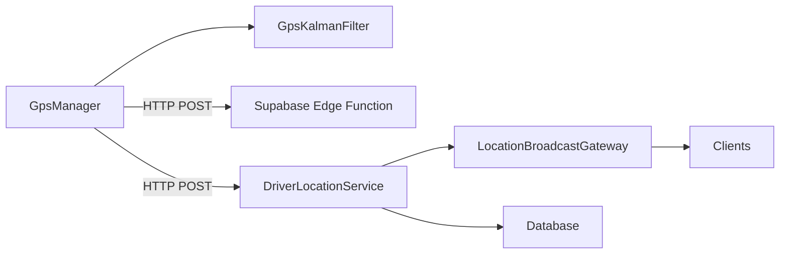

# GPS Location Tracking & Broadcasting

<cite>
**Referenced Files in This Document**
- [driver-location.service.ts](file://apps/api/src/modules/driver/driver-location.service.ts)
- [location-broadcast.gateway.ts](file://apps/api/src/modules/driver/location-broadcast.gateway.ts)
- [KalmanFilter.ts](file://apps/courier-mobile/src/lib/gps/KalmanFilter.ts)
- [GpsManager.ts](file://apps/courier-mobile/src/lib/gps/GpsManager.ts)
- [index.ts](file://supabase/functions/driver-location/index.ts)
</cite>

## Table of Contents
1. Introduction
2. Project Structure
3. Core Components
4. Architecture Overview
5. Detailed Component Analysis
6. Dependency Analysis
7. Performance Considerations
8. Troubleshooting Guide
9. Conclusion

## Introduction
This document explains the real-time GPS location tracking system across mobile, API, and serverless layers. It covers how driver locations are captured on the device, filtered for accuracy and stability, persisted efficiently, and broadcast to clients via WebSocket. It also documents privacy controls, fallback behavior when GPS is unavailable, and performance optimizations for high-frequency updates.

## Project Structure
The tracking pipeline spans three main areas:
- Mobile app (courier): Captures raw GPS, applies Kalman filtering, adapts update frequency based on speed, and posts filtered locations to the backend or edge function.
- API service (NestJS): Validates driver state, applies server-side Kalman filtering, batches writes to the database, and broadcasts live updates to connected clients.
- Supabase Edge Function: Securely validates requests and persists location pings with authorization checks.

**Diagram sources**
- [GpsManager.ts:150-213](file://apps/courier-mobile/src/lib/gps/GpsManager.ts#L150-L213)
- [KalmanFilter.ts:94-149](file://apps/courier-mobile/src/lib/gps/KalmanFilter.ts#L94-L149)
- [driver-location.service.ts:30-127](file://apps/api/src/modules/driver/driver-location.service.ts#L30-L127)
- [location-broadcast.gateway.ts:124-143](file://apps/api/src/modules/driver/location-broadcast.gateway.ts#L124-L143)
- [index.ts:77-235](file://supabase/functions/driver-location/index.ts#L77-L235)

**Section sources**
- [GpsManager.ts:1-245](file://apps/courier-mobile/src/lib/gps/GpsManager.ts#L1-L245)
- [KalmanFilter.ts:1-182](file://apps/courier-mobile/src/lib/gps/KalmanFilter.ts#L1-L182)
- [driver-location.service.ts:1-352](file://apps/api/src/modules/driver/driver-location.service.ts#L1-L352)
- [location-broadcast.gateway.ts:1-214](file://apps/api/src/modules/driver/location-broadcast.gateway.ts#L1-L214)
- [index.ts:1-236](file://supabase/functions/driver-location/index.ts#L1-L236)

## Core Components
- DriverLocationService: Orchestrates location updates, applies server-side Kalman filtering, batches historical writes, updates current position, and triggers WebSocket broadcasts.
- LocationBroadcastGateway: Manages authenticated WebSocket connections, subscribes clients to rooms, and emits driver location/status events.
- GpsManager (mobile): Starts/stops foreground/background location, applies adaptive intervals, and filters readings using a Kalman filter before posting.
- GpsKalmanFilter (mobile): Implements 2D GPS smoothing with accuracy and speed gating, jitter suppression, and haversine distance calculations.
- Supabase Edge Function: Validates JWT, enforces role and assignment checks, sanitizes inputs, and inserts location records securely.

Key responsibilities and interactions:
- Mobile captures raw GPS at high frequency, smooths it, and posts only meaningful updates.
- API validates driver online status, re-filters if needed, batches history, and broadcasts immediately to clients.
- Edge function provides an alternative ingestion path with strict authorization and payload validation.

**Section sources**
- [driver-location.service.ts:30-127](file://apps/api/src/modules/driver/driver-location.service.ts#L30-L127)
- [location-broadcast.gateway.ts:61-93](file://apps/api/src/modules/driver/location-broadcast.gateway.ts#L61-L93)
- [GpsManager.ts:58-80](file://apps/courier-mobile/src/lib/gps/GpsManager.ts#L58-L80)
- [KalmanFilter.ts:94-149](file://apps/courier-mobile/src/lib/gps/KalmanFilter.ts#L94-L149)
- [index.ts:91-235](file://supabase/functions/driver-location/index.ts#L91-L235)

## Architecture Overview
The system uses a layered approach to ensure accuracy, efficiency, and security:
- Device layer: High-frequency sampling with aggressive filtering and adaptive posting intervals.
- API layer: Stateful per-driver filters, batched persistence, and real-time broadcasting.
- Edge layer: Secure, validated ingestion for direct client-to-database writes.

**Diagram sources**
- [driver-location.service.ts:30-127](file://apps/api/src/modules/driver/driver-location.service.ts#L30-L127)
- [location-broadcast.gateway.ts:124-143](file://apps/api/src/modules/driver/location-broadcast.gateway.ts#L124-L143)

## Detailed Component Analysis

### DriverLocationService
Responsibilities:
- Validate driver identity and online status.
- Apply server-side Kalman filtering to improve accuracy and reject impossible jumps.
- Batch historical location writes to reduce database load.
- Update current driver position for real-time queries.
- Broadcast updated positions to subscribed clients.

Processing logic highlights:
- Per-driver Kalman filter instance ensures independent smoothing.
- Batching threshold and interval balance freshness vs. throughput.
- Immediate profile update enables low-latency map rendering.

Error handling:
- Throws not found/forbidden for invalid or offline drivers.
- Logs and continues on batch write errors to avoid blocking updates.

Optimization opportunities:
- Tune batch size and interval based on traffic patterns.
- Consider geo-hashing or spatial indexes for large datasets.

**Section sources**
- [driver-location.service.ts:30-127](file://apps/api/src/modules/driver/driver-location.service.ts#L30-L127)
- [driver-location.service.ts:271-318](file://apps/api/src/modules/driver/driver-location.service.ts#L271-L318)
- [driver-location.service.ts:337-351](file://apps/api/src/modules/driver/driver-location.service.ts#L337-L351)

### LocationBroadcastGateway
Responsibilities:
- Authenticate WebSocket connections using tokens.
- Maintain connection maps and room subscriptions.
- Emit driver location updates and status changes.
- Provide admin-only initial data snapshot on connect.

Flow:
- On connect: validate token, restrict to authorized roles, send initial online drivers.
- On update: broadcast event to all subscribers.
- Rooms: support per-driver and admin channels.

Security:
- Rejects unauthenticated or unauthorized sockets.
- Uses CORS configuration for allowed origins.

**Section sources**
- [location-broadcast.gateway.ts:61-93](file://apps/api/src/modules/driver/location-broadcast.gateway.ts#L61-L93)
- [location-broadcast.gateway.ts:124-143](file://apps/api/src/modules/driver/location-broadcast.gateway.ts#L124-L143)
- [location-broadcast.gateway.ts:148-195](file://apps/api/src/modules/driver/location-broadcast.gateway.ts#L148-L195)

### GpsManager (Mobile)
Responsibilities:
- Request permissions and start/stop foreground and background location services.
- Process raw locations through Kalman filter.
- Adapt posting interval based on speed and movement thresholds.
- Notify UI of filtered locations and accuracy warnings.

Adaptive frequency:
- Stationary: longer intervals to save battery.
- Slow/fast: shorter intervals for responsiveness.
- Movement gating: skip small displacements when stationary.

Fallbacks:
- Gracefully handles permission denials and missing background task registration.
- Emits accuracy warnings for poor GPS conditions.

**Section sources**
- [GpsManager.ts:58-80](file://apps/courier-mobile/src/lib/gps/GpsManager.ts#L58-L80)
- [GpsManager.ts:93-121](file://apps/courier-mobile/src/lib/gps/GpsManager.ts#L93-L121)
- [GpsManager.ts:150-213](file://apps/courier-mobile/src/lib/gps/GpsManager.ts#L150-L213)

### GpsKalmanFilter (Mobile)
Responsibilities:
- Smooth latitude and longitude independently using 1D Kalman filters.
- Enforce accuracy gates and speed limits to discard outliers.
- Suppress jitter by ignoring tiny movements.
- Provide last accepted position for reuse when readings are invalid.

Algorithm flow:
- Accuracy gate: reject if accuracy exceeds threshold.
- Speed gate: compute haversine distance over time; reject if speed is unrealistic.
- Jitter suppression: ignore negligible movement.
- Filter update: apply 1D Kalman filters to lat/lng.

Complexity:
- O(1) per update with constant memory per axis.

**Section sources**
- [KalmanFilter.ts:94-149](file://apps/courier-mobile/src/lib/gps/KalmanFilter.ts#L94-L149)
- [KalmanFilter.ts:165-182](file://apps/courier-mobile/src/lib/gps/KalmanFilter.ts#L165-L182)

### Supabase Edge Function (driver-location)
Responsibilities:
- Accept POST requests from clients with location pings.
- Validate JWT and enforce driver role and assignment checks.
- Sanitize inputs and persist to driver_locations table.

Authorization and validation:
- Requires Authorization header and valid JWT.
- Ensures driver_id matches authenticated user.
- Verifies driver role and accepted delivery assignment.
- Validates coordinates and optional fields; guards against future timestamps.

Performance and reliability:
- Uses service-role client for insertion to bypass RLS overhead after application-level checks.
- Returns structured JSON responses for success and error cases.

**Section sources**
- [index.ts:77-235](file://supabase/functions/driver-location/index.ts#L77-L235)

## Dependency Analysis
Component relationships:
- DriverLocationService depends on PrismaService and LocationBroadcastGateway.
- LocationBroadcastGateway depends on DriverLocationService and SupabaseAuthService.
- GpsManager depends on GpsKalmanFilter and expo-location APIs.
- Supabase Edge Function depends on Supabase clients and environment variables.

**Diagram sources**
- [GpsManager.ts:150-213](file://apps/courier-mobile/src/lib/gps/GpsManager.ts#L150-L213)
- [driver-location.service.ts:30-127](file://apps/api/src/modules/driver/driver-location.service.ts#L30-L127)
- [location-broadcast.gateway.ts:124-143](file://apps/api/src/modules/driver/location-broadcast.gateway.ts#L124-L143)
- [index.ts:77-235](file://supabase/functions/driver-location/index.ts#L77-L235)

**Section sources**
- [driver-location.service.ts:1-352](file://apps/api/src/modules/driver/driver-location.service.ts#L1-L352)
- [location-broadcast.gateway.ts:1-214](file://apps/api/src/modules/driver/location-broadcast.gateway.ts#L1-L214)
- [GpsManager.ts:1-245](file://apps/courier-mobile/src/lib/gps/GpsManager.ts#L1-L245)
- [KalmanFilter.ts:1-182](file://apps/courier-mobile/src/lib/gps/KalmanFilter.ts#L1-L182)
- [index.ts:1-236](file://supabase/functions/driver-location/index.ts#L1-L236)

## Performance Considerations
- Adaptive update frequency: The mobile layer adjusts posting intervals based on speed to balance responsiveness and battery usage.
- Movement gating: Skips small displacements when stationary to reduce network and processing overhead.
- Server-side batching: Historical location writes are batched to minimize database round-trips.
- Real-time profile updates: Current driver position is updated immediately for low-latency map rendering.
- WebSocket broadcasting: Centralized gateway reduces duplication and scales to many clients.

Recommendations:
- Tune batch size and interval based on observed traffic and latency targets.
- Monitor WebSocket connection counts and message rates to scale horizontally if needed.
- Use spatial indexes on location tables for efficient queries.

[No sources needed since this section provides general guidance]

## Troubleshooting Guide
Common issues and mitigations:
- Poor GPS accuracy: Mobile emits warnings; both mobile and server filters may discard low-quality readings.
- Impossible speeds/jumps: Filters reject unrealistic movements; last known position is used as fallback.
- Permission denied: Mobile stops tracking and notifies users; ensure permissions are granted.
- Unauthorized WebSocket access: Gateway rejects connections without valid tokens or roles.
- Edge function failures: Check JWT validity, driver role, and assignment existence; inspect error messages.

Operational tips:
- Inspect logs in API and Edge Function for detailed error context.
- Verify CORS settings for WebSocket connections.
- Periodically clean up old location records to manage storage growth.

**Section sources**
- [GpsManager.ts:150-157](file://apps/courier-mobile/src/lib/gps/GpsManager.ts#L150-L157)
- [KalmanFilter.ts:100-137](file://apps/courier-mobile/src/lib/gps/KalmanFilter.ts#L100-L137)
- [location-broadcast.gateway.ts:61-93](file://apps/api/src/modules/driver/location-broadcast.gateway.ts#L61-L93)
- [index.ts:91-235](file://supabase/functions/driver-location/index.ts#L91-L235)

## Conclusion
The system combines robust device-side filtering, efficient server-side processing, and secure edge ingestion to deliver accurate, timely, and scalable driver location tracking. Kalman filtering improves accuracy and stability, while adaptive intervals and batching optimize battery life and performance. The WebSocket gateway provides real-time visibility for admins and dispatchers, with strong authentication and authorization safeguards throughout the pipeline.

[No sources needed since this section summarizes without analyzing specific files]