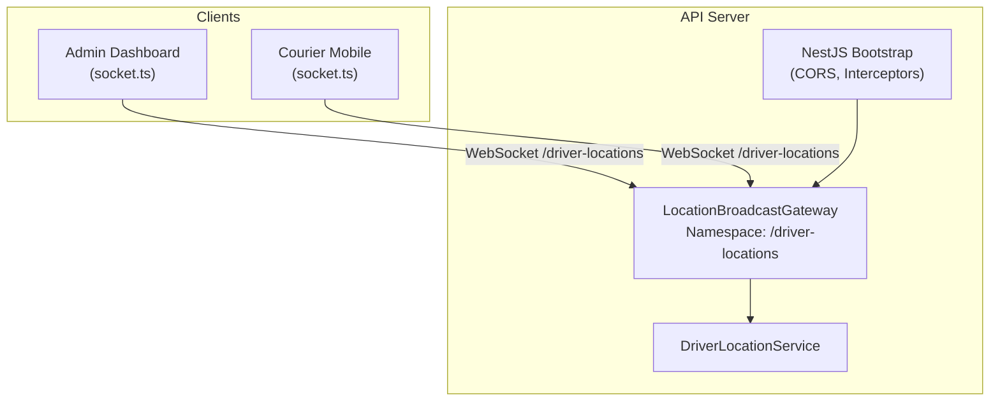
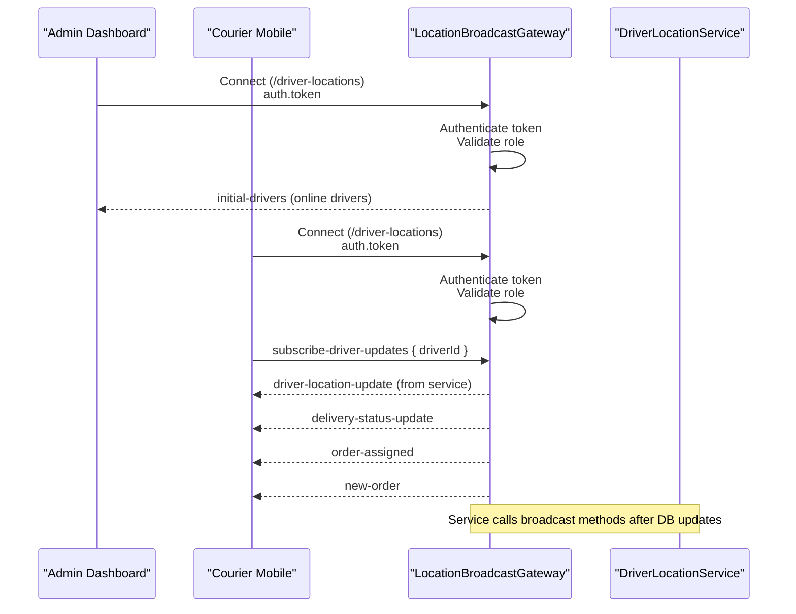
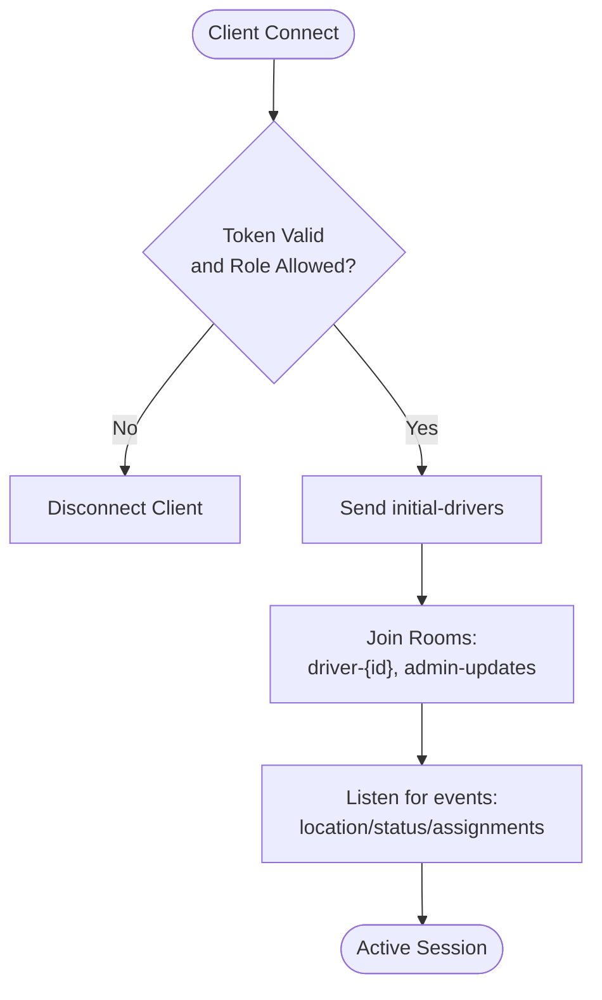
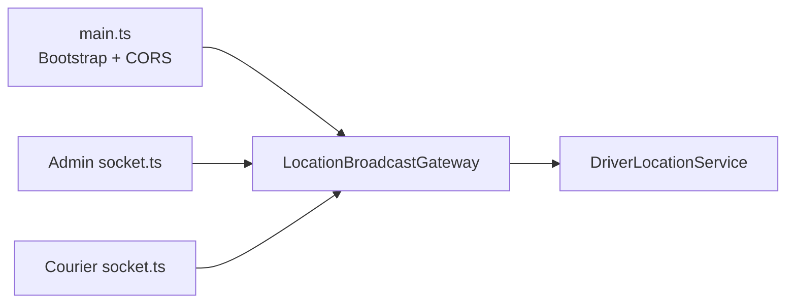

# Real-time Features & WebSockets

<cite>
**Referenced Files in This Document**
- [location-broadcast.gateway.ts](file://apps/api/src/modules/driver/location-broadcast.gateway.ts)
- [driver-location.service.ts](file://apps/api/src/modules/driver/driver-location.service.ts)
- [main.ts](file://apps/api/src/main.ts)
- [socket.ts (Admin)](file://apps/admin/src/lib/socket.ts)
- [socket.ts (Courier Mobile)](file://apps/courier-mobile/src/lib/socket.ts)
</cite>

## Table of Contents
1. [Introduction](#introduction)
2. [Project Structure](#project-structure)
3. [Core Components](#core-components)
4. [Architecture Overview](#architecture-overview)
5. [Detailed Component Analysis](#detailed-component-analysis)
6. [Dependency Analysis](#dependency-analysis)
7. [Performance Considerations](#performance-considerations)
8. [Troubleshooting Guide](#troubleshooting-guide)
9. [Conclusion](#conclusion)
10. [Appendices](#appendices)

## Introduction
This document explains the real-time features and WebSocket implementation across the application, focusing on Socket.io integration for live order tracking, real-time inventory updates, and instant notifications. It covers connection management, room-based broadcasting, event-driven architecture, and the location broadcast gateway used for driver tracking, order status updates, and chat-like messaging patterns. Client-side integration patterns, reconnection handling, and performance optimization strategies are also included, along with scaling considerations and monitoring guidance for high-concurrency scenarios.

## Project Structure
Real-time capabilities span three primary areas:
- API server: NestJS application exposing a Socket.io gateway under a dedicated namespace for driver locations and related events.
- Admin client: A browser-based dashboard that connects to the gateway to receive live driver updates and admin-only broadcasts.
- Courier mobile app: A mobile client that subscribes to delivery-related events such as new orders and status changes.

**Diagram sources**
- [location-broadcast.gateway.ts:27-40](file://apps/api/src/modules/driver/location-broadcast.gateway.ts#L27-L40)
- [main.ts:7-35](file://apps/api/src/main.ts#L7-L35)
- [socket.ts (Admin):10-20](file://apps/admin/src/lib/socket.ts#L10-L20)
- [socket.ts (Courier Mobile):24-36](file://apps/courier-mobile/src/lib/socket.ts#L24-L36)

**Section sources**
- [location-broadcast.gateway.ts:27-40](file://apps/api/src/modules/driver/location-broadcast.gateway.ts#L27-L40)
- [main.ts:7-35](file://apps/api/src/main.ts#L7-L35)
- [socket.ts (Admin):10-20](file://apps/admin/src/lib/socket.ts#L10-L20)
- [socket.ts (Courier Mobile):24-36](file://apps/courier-mobile/src/lib/socket.ts#L24-L36)

## Core Components
- Location Broadcast Gateway: Exposes a Socket.io gateway at /driver-locations, authenticates connections, manages rooms, and emits real-time events for driver locations and status changes.
- Driver Location Service: Provides data about online drivers and integrates with the gateway to broadcast updates.
- Admin Socket Manager: Manages a persistent WebSocket connection for the admin dashboard, handles reconnection, and centralizes event listeners.
- Driver Socket Manager: Manages the courier mobile’s WebSocket connection, listens for order and delivery events, and invalidates relevant queries to keep UI in sync.

Key responsibilities:
- Connection lifecycle: connect, authenticate, subscribe/unsubscribe, disconnect.
- Room-based broadcasting: per-driver rooms and an admin room for targeted or global messages.
- Event-driven updates: driver location updates, driver online/offline status, new orders, and delivery status changes.

**Section sources**
- [location-broadcast.gateway.ts:58-93](file://apps/api/src/modules/driver/location-broadcast.gateway.ts#L58-L93)
- [location-broadcast.gateway.ts:120-143](file://apps/api/src/modules/driver/location-broadcast.gateway.ts#L120-L143)
- [location-broadcast.gateway.ts:148-181](file://apps/api/src/modules/driver/location-broadcast.gateway.ts#L148-L181)
- [socket.ts (Admin):10-57](file://apps/admin/src/lib/socket.ts#L10-L57)
- [socket.ts (Courier Mobile):24-69](file://apps/courier-mobile/src/lib/socket.ts#L24-L69)

## Architecture Overview
The system uses an event-driven architecture centered around a single Socket.io gateway. Clients authenticate via access tokens and join rooms to receive targeted updates. The gateway coordinates with the driver location service to fetch initial state and broadcast subsequent changes.

**Diagram sources**
- [location-broadcast.gateway.ts:58-93](file://apps/api/src/modules/driver/location-broadcast.gateway.ts#L58-L93)
- [location-broadcast.gateway.ts:120-143](file://apps/api/src/modules/driver/location-broadcast.gateway.ts#L120-L143)
- [location-broadcast.gateway.ts:148-181](file://apps/api/src/modules/driver/location-broadcast.gateway.ts#L148-L181)
- [socket.ts (Admin):10-20](file://apps/admin/src/lib/socket.ts#L10-L20)
- [socket.ts (Courier Mobile):24-69](file://apps/courier-mobile/src/lib/socket.ts#L24-L69)

## Detailed Component Analysis

### Location Broadcast Gateway
Responsibilities:
- Enforce CORS and namespace configuration for secure cross-origin WebSocket communication.
- Authenticate clients using access tokens and restrict certain endpoints to specific roles.
- Manage connected clients and maintain mappings between driver IDs and socket IDs.
- Provide room-based subscriptions for drivers and admins.
- Emit real-time events for location updates, status changes, and administrative updates.

Connection flow:
- On connect, extract and validate token; reject unauthenticated or unauthorized clients.
- Send initial driver data to newly connected clients.
- Maintain a map of driver sockets for targeted messaging.

Room management:
- Drivers subscribe to a per-driver room to receive private updates.
- Admins subscribe to a shared admin room for global updates.

Event surface:
- Global broadcasts: driver-location-update, driver-status-change.
- Targeted broadcasts: sendToDriver, sendToAdmins.
- Subscription events: subscribe-driver-updates, subscribe-admin-updates, unsubscribe.

**Diagram sources**
- [location-broadcast.gateway.ts:58-93](file://apps/api/src/modules/driver/location-broadcast.gateway.ts#L58-L93)
- [location-broadcast.gateway.ts:148-181](file://apps/api/src/modules/driver/location-broadcast.gateway.ts#L148-L181)

**Section sources**
- [location-broadcast.gateway.ts:27-40](file://apps/api/src/modules/driver/location-broadcast.gateway.ts#L27-L40)
- [location-broadcast.gateway.ts:58-93](file://apps/api/src/modules/driver/location-broadcast.gateway.ts#L58-L93)
- [location-broadcast.gateway.ts:120-143](file://apps/api/src/modules/driver/location-broadcast.gateway.ts#L120-L143)
- [location-broadcast.gateway.ts:148-181](file://apps/api/src/modules/driver/location-broadcast.gateway.ts#L148-L181)
- [location-broadcast.gateway.ts:186-213](file://apps/api/src/modules/driver/location-broadcast.gateway.ts#L186-L213)

### Driver Location Service Integration
- The gateway delegates to the driver location service to retrieve online drivers and likely triggers broadcasts after successful location updates.
- This separation keeps business logic (data retrieval, persistence) distinct from transport concerns (WebSocket events).

Integration points:
- Initial data population on client connect.
- Triggering broadcasts when driver locations change.

**Section sources**
- [location-broadcast.gateway.ts:58-93](file://apps/api/src/modules/driver/location-broadcast.gateway.ts#L58-L93)
- [driver-location.service.ts](file://apps/api/src/modules/driver/driver-location.service.ts)

### Admin Client Socket Manager
- Establishes a persistent connection to the gateway with reconnection enabled and exponential backoff.
- Centralizes event listeners and supports dynamic subscription/unsubscription.
- Reattaches listeners on reconnect to ensure continuity.

Reconnection strategy:
- Uses built-in Socket.io reconnection with configurable delays and maximum attempts.
- Maintains a registry of listeners to reattach after reconnect.

**Section sources**
- [socket.ts (Admin):10-57](file://apps/admin/src/lib/socket.ts#L10-L57)

### Courier Mobile Socket Manager
- Connects to the gateway and listens for delivery-related events.
- Invalidates cached queries upon receiving new orders or delivery status updates to keep UI consistent.
- Implements robust reconnection handling with timeouts and error logging.

Event handling:
- new-order: refresh available orders.
- delivery-status-update: update active delivery and invalidate delivery details.
- order-assigned: refresh active delivery context.

**Section sources**
- [socket.ts (Courier Mobile):24-69](file://apps/courier-mobile/src/lib/socket.ts#L24-L69)

## Dependency Analysis
The real-time subsystem depends on:
- NestJS bootstrap configuration for CORS and middleware.
- Socket.io gateway for WebSocket transport and room management.
- Driver location service for data operations.
- Client managers for connection lifecycle and event handling.

**Diagram sources**
- [main.ts:7-35](file://apps/api/src/main.ts#L7-L35)
- [location-broadcast.gateway.ts:27-40](file://apps/api/src/modules/driver/location-broadcast.gateway.ts#L27-L40)
- [socket.ts (Admin):10-20](file://apps/admin/src/lib/socket.ts#L10-L20)
- [socket.ts (Courier Mobile):24-36](file://apps/courier-mobile/src/lib/socket.ts#L24-L36)

**Section sources**
- [main.ts:7-35](file://apps/api/src/main.ts#L7-L35)
- [location-broadcast.gateway.ts:27-40](file://apps/api/src/modules/driver/location-broadcast.gateway.ts#L27-L40)
- [socket.ts (Admin):10-20](file://apps/admin/src/lib/socket.ts#L10-L20)
- [socket.ts (Courier Mobile):24-36](file://apps/courier-mobile/src/lib/socket.ts#L24-L36)

## Performance Considerations
- Namespace isolation: Using a dedicated namespace reduces contention and improves routing efficiency.
- Room scoping: Targeted broadcasts via rooms minimize unnecessary message fan-out.
- Reconnection tuning: Configure reconnection delays and max attempts to balance responsiveness and resource usage.
- Payload size: Keep event payloads minimal; include only necessary fields to reduce bandwidth.
- Query invalidation: On the client side, invalidate only affected queries to avoid full re-fetches.
- Backpressure: Throttle high-frequency location updates if needed; consider debouncing on the client before emitting.
- CORS preflight caching: Leverage preflight caching to reduce overhead during frequent cross-origin requests.

[No sources needed since this section provides general guidance]

## Troubleshooting Guide
Common issues and resolutions:
- Authentication failures: Ensure valid access tokens are provided in handshake auth; verify role restrictions.
- CORS errors: Confirm origins match configured allowed origins; check credentials settings.
- Reconnection loops: Adjust reconnectionDelayMax and reconnectionAttempts; handle connect_error events gracefully.
- Missing initial data: Verify that initial-drivers is emitted on connect and that the service returns expected data.
- Room mismatches: Ensure clients join correct rooms (per-driver and admin) and leave rooms on disconnect.

Operational checks:
- Monitor connection stats exposed by the gateway to track total connections, driver connections, and admin connections.
- Log authentication and disconnection events to identify anomalies.

**Section sources**
- [location-broadcast.gateway.ts:58-93](file://apps/api/src/modules/driver/location-broadcast.gateway.ts#L58-L93)
- [location-broadcast.gateway.ts:107-118](file://apps/api/src/modules/driver/location-broadcast.gateway.ts#L107-L118)
- [location-broadcast.gateway.ts:207-213](file://apps/api/src/modules/driver/location-broadcast.gateway.ts#L207-L213)
- [socket.ts (Admin):22-35](file://apps/admin/src/lib/socket.ts#L22-L35)
- [socket.ts (Courier Mobile):38-49](file://apps/courier-mobile/src/lib/socket.ts#L38-L49)

## Conclusion
The real-time layer leverages Socket.io within a NestJS application to deliver low-latency updates for driver tracking, order assignments, and delivery statuses. The gateway enforces authentication, manages rooms, and coordinates with backend services to emit precise, targeted events. Clients implement robust connection management and reconnection strategies to maintain reliable real-time experiences. With careful attention to payload sizes, room scoping, and reconnection tuning, the system can scale to support high concurrency while maintaining responsiveness.

[No sources needed since this section summarizes without analyzing specific files]

## Appendices

### Scaling Considerations for High Concurrency
- Horizontal scaling: Deploy multiple API instances behind a load balancer; use a scalable adapter (e.g., Redis) for cross-process room management if needed.
- Connection limits: Tune server-side limits and monitor memory/CPU usage; consider connection pooling and worker processes.
- Message throughput: Batch or throttle high-frequency updates; prefer delta updates for location streams.
- Monitoring: Track metrics like active connections, event rates, and error rates; integrate observability tools for alerting.

[No sources needed since this section provides general guidance]

### Monitoring Real-time Connections
- Use gateway statistics to observe connection counts and room sizes.
- Instrument client-side logs for connect/disconnect/connect_error events to detect network issues.
- Set up alerts for spikes in disconnections or authentication failures.

**Section sources**
- [location-broadcast.gateway.ts:207-213](file://apps/api/src/modules/driver/location-broadcast.gateway.ts#L207-L213)
- [socket.ts (Admin):22-35](file://apps/admin/src/lib/socket.ts#L22-L35)
- [socket.ts (Courier Mobile):38-49](file://apps/courier-mobile/src/lib/socket.ts#L38-L49)