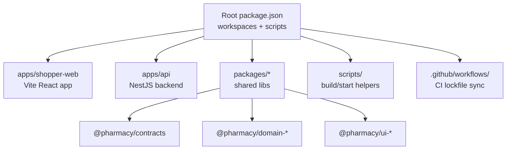
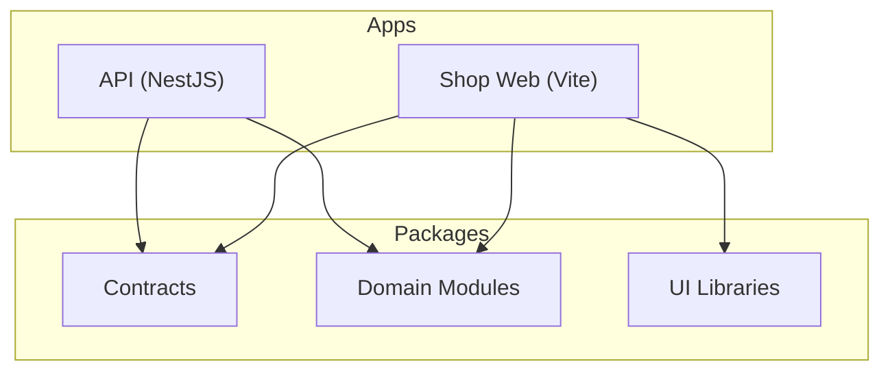
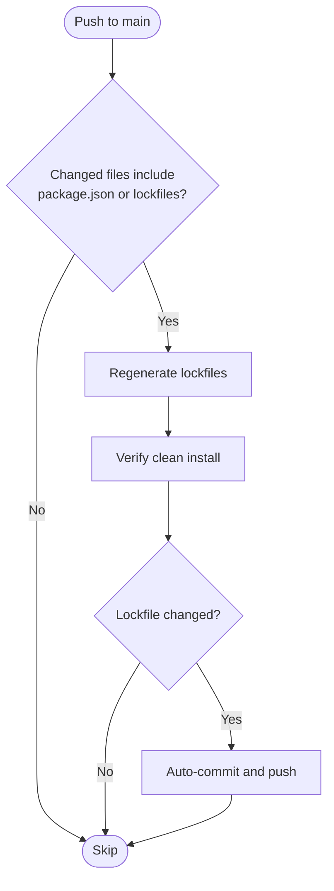

# Contributing Guidelines

<cite>
**Referenced Files in This Document**
- [README.md](file://README.md)
- [package.json](file://package.json)
- [apps/api/package.json](file://apps/api/package.json)
- [apps/shopper-web/package.json](file://apps/shopper-web/package.json)
- [.github/workflows/sync-npm-lockfile.yml](file://.github/workflows/sync-npm-lockfile.yml)
- [.github/workflows/sync-root-lock.yml](file://.github/workflows/sync-root-lock.yml)
- [guidelines/Guidelines.md](file://guidelines/Guidelines.md)
</cite>

## Table of Contents
1. [Introduction](#introduction)
2. [Project Structure](#project-structure)
3. [Core Components](#core-components)
4. [Architecture Overview](#architecture-overview)
5. [Detailed Component Analysis](#detailed-component-analysis)
6. [Dependency Analysis](#dependency-analysis)
7. [Performance Considerations](#performance-considerations)
8. [Troubleshooting Guide](#troubleshooting-guide)
9. [Conclusion](#conclusion)
10. [Appendices](#appendices)

## Introduction
This document provides comprehensive contributing guidelines for the United Pharmacy monorepo. It covers development workflow, branch and commit conventions, pull request procedures, code style and linting standards, testing requirements, code review and quality assurance practices, feature modification guidelines, backward compatibility, release and versioning strategy, deployment procedures, community communication, and setup instructions for contributors.

The repository is an npm workspaces monorepo that includes multiple applications (shopper web, mobile shells, admin dashboard, API server) and shared packages (domain logic, contracts, UI primitives, design tokens). The root scripts orchestrate common tasks such as development, building, type checking, and Railway-based build/start workflows.

## Project Structure
At a high level:
- apps/ contains application-specific code: shopper web, mobile shells, admin dashboard, and the NestJS API.
- packages/ contains shared libraries: domain modules, contracts, types, UI components, and design tokens.
- supabase/ and database/ contain migrations and SQL utilities.
- scripts/ contains automation for builds and data ingestion.
- .github/workflows/ contains CI automation for lockfile synchronization.

**Diagram sources**
- [package.json:9-26](file://package.json#L9-L26)
- [apps/shopper-web/package.json:1-12](file://apps/shopper-web/package.json#L1-L12)
- [apps/api/package.json:1-13](file://apps/api/package.json#L1-L13)

**Section sources**
- [README.md:5-24](file://README.md#L5-L24)
- [package.json:9-26](file://package.json#L9-L26)

## Core Components
Key areas relevant to contributors:
- Monorepo orchestration via root package.json scripts and workspaces.
- Shopper Web app using Vite with TypeScript and Tailwind.
- API server using NestJS with Prisma and Supabase integration.
- Shared contracts and domain packages consumed by apps.
- CI workflows ensuring lockfiles are synchronized on main.

Development commands at the root include dev, build, preview, typecheck, lint, and Railway build/start scripts for API and frontend apps.

**Section sources**
- [package.json:14-26](file://package.json#L14-L26)
- [apps/shopper-web/package.json:6-12](file://apps/shopper-web/package.json#L6-L12)
- [apps/api/package.json:9-13](file://apps/api/package.json#L9-L13)

## Architecture Overview
The monorepo follows a layered architecture:
- Applications depend on shared packages for contracts, domain logic, and UI primitives.
- The API exposes services backed by Prisma and Supabase.
- CI ensures consistent dependency resolution across the workspace.

[No sources needed since this diagram shows conceptual architecture]

## Detailed Component Analysis

### Development Workflow
- Use Node.js within the engine range defined at the root.
- Install dependencies once at the root; workspaces resolve shared packages automatically.
- Run the active web app locally using the root dev script.
- Typecheck the active workspace using the root typecheck script.
- Lint runs typecheck plus a console usage check.

Recommended local workflow:
- Ensure Node.js version matches the engines constraint.
- Install dependencies at the repository root.
- Start the web app or API depending on your focus.
- Run typecheck and lint before committing changes.

**Section sources**
- [package.json:6-8](file://package.json#L6-L8)
- [package.json:14-20](file://package.json#L14-L20)
- [apps/shopper-web/package.json:6-12](file://apps/shopper-web/package.json#L6-L12)
- [apps/api/package.json:6-13](file://apps/api/package.json#L6-L13)

### Branch Naming Conventions
Adopt a clear, descriptive branch naming scheme:
- feature/<short-description>: New features or enhancements.
- fix/<short-description>: Bug fixes.
- refactor/<short-description>: Code restructuring without behavior change.
- chore/<short-description>: Tooling, dependencies, or housekeeping.
- docs/<short-description>: Documentation updates.
- ci/<short-description>: CI/CD pipeline changes.

Keep names lowercase with hyphens and limit length for readability.

[No sources needed since this section provides general guidance]

### Commit Message Standards
Use conventional commits to keep history readable and automatable:
- Types: feat, fix, refactor, chore, docs, ci, test, perf, style, revert.
- Scope: optional area like api, shopper-web, domain-orders, ui-native.
- Subject: concise imperative description.
- Body: optional context and rationale.
- Footer: optional breaking changes or issue references.

Examples:
- feat(shopper-web): add product search filters
- fix(api): handle null driver location
- chore: update root lockfile

[No sources needed since this section provides general guidance]

### Pull Request Procedures
Before opening a PR:
- Ensure typecheck and lint pass locally.
- Keep changes focused and scoped to a single feature or fix.
- Include a clear description of what changed and why.
- Link related issues or plans if applicable.
- Update documentation when user-facing behavior changes.

Review expectations:
- At least one reviewer for non-trivial changes.
- Verify tests and type checks pass.
- Confirm no unintended console logs or debug statements.

[No sources needed since this section provides general guidance]

### Code Style Guidelines
- Prefer TypeScript throughout new code.
- Use functional components and hooks for React apps.
- Organize code by feature where practical.
- Avoid console.log in production code; use structured logging where available.
- Follow existing patterns in each app or package.

Linting and formatting:
- Root lint command runs typecheck and a console usage check.
- Each app may have its own tooling; ensure it passes before pushing.

**Section sources**
- [package.json:19-20](file://package.json#L19-L20)

### Testing Requirements
- Add tests for new business logic and critical paths.
- For the native app, leverage the configured Jest setup.
- For web and API, add unit or integration tests as appropriate.
- Ensure all tests pass before submitting a PR.

**Section sources**
- [apps/shopper-native/jest.config.js](file://apps/shopper-native/jest.config.js)

### Quality Assurance Procedures
- Run typecheck and lint locally.
- Validate builds for affected apps.
- Confirm no regressions in related features.
- Use the provided scripts to simulate CI steps locally.

**Section sources**
- [package.json:14-20](file://package.json#L14-L20)

### Adding New Features
- Create a feature branch following the naming convention.
- Implement changes in the relevant app or package.
- Add tests and update documentation if necessary.
- Ensure typecheck and lint pass.
- Open a PR with a clear description and scope.

[No sources needed since this section provides general guidance]

### Modifying Existing Functionality
- Identify impacted apps and packages.
- Preserve public APIs and contracts; avoid breaking changes unless absolutely necessary.
- If breaking changes are required, plan migration steps and communicate clearly.
- Update tests and documentation accordingly.

[No sources needed since this section provides general guidance]

### Maintaining Backward Compatibility
- Prefer additive changes over destructive ones.
- Deprecate fields gradually with migration notes.
- Keep contract interfaces stable; version breaking changes explicitly.
- Validate downstream consumers before merging.

[No sources needed since this section provides general guidance]

### Release Process and Versioning Strategy
- Coordinate version bumps across dependent packages and apps.
- Tag releases and publish artifacts according to team policy.
- Update changelogs and migration guides for breaking changes.
- Use CI to validate builds and lockfiles before release.

[No sources needed since this section provides general guidance]

### Deployment Procedures
Railway scripts are available to build and start services:
- Build API, shopper web, and shopper native.
- Start API, shopper web, and shopper native.

Ensure environment variables and secrets are configured per environment.

**Section sources**
- [package.json:21-26](file://package.json#L21-L26)

### Community Guidelines and Communication
- Be respectful and collaborative in discussions.
- Use issues for bug reports and feature requests.
- Reference plans and specs when proposing changes.
- Keep PR descriptions informative and actionable.

[No sources needed since this section provides general guidance]

### Setup Instructions for Contributors
- Use Node.js within the engines range specified at the root.
- Install dependencies at the repository root.
- Run the active web app locally using the root dev script.
- Typecheck the active workspace using the root typecheck script.
- For the API, use the NestJS scripts to start development mode.

**Section sources**
- [package.json:6-8](file://package.json#L6-L8)
- [README.md:25-43](file://README.md#L25-L43)
- [apps/api/package.json:9-13](file://apps/api/package.json#L9-L13)

## Dependency Analysis
The monorepo uses npm workspaces to manage shared dependencies and scripts. CI workflows synchronize lockfiles to maintain consistency across environments.

**Diagram sources**
- [.github/workflows/sync-root-lock.yml:3-41](file://.github/workflows/sync-root-lock.yml#L3-L41)
- [.github/workflows/sync-npm-lockfile.yml:3-47](file://.github/workflows/sync-npm-lockfile.yml#L3-L47)

**Section sources**
- [package.json:9-13](file://package.json#L9-L13)
- [.github/workflows/sync-root-lock.yml:3-41](file://.github/workflows/sync-root-lock.yml#L3-L41)
- [.github/workflows/sync-npm-lockfile.yml:3-47](file://.github/workflows/sync-npm-lockfile.yml#L3-L47)

## Performance Considerations
- Prefer lazy loading and code splitting in the web app.
- Minimize unnecessary re-renders in React components.
- Use shared packages to reduce duplication and improve cacheability.
- Monitor bundle sizes and optimize assets.
- Leverage caching strategies in the API and client layers.

[No sources needed since this section provides general guidance]

## Troubleshooting Guide
Common issues and resolutions:
- Lockfile drift: CI will regenerate and commit lockfiles on main.
- Type errors: Run the root typecheck to identify issues early.
- Console logs: The lint step checks for console usage; remove debug statements.
- Build failures: Ensure Node.js version matches the engines constraint.

**Section sources**
- [package.json:19-20](file://package.json#L19-L20)
- [.github/workflows/sync-root-lock.yml:29-41](file://.github/workflows/sync-root-lock.yml#L29-L41)
- [.github/workflows/sync-npm-lockfile.yml:31-47](file://.github/workflows/sync-npm-lockfile.yml#L31-L47)

## Conclusion
Contributors should follow the established workflow, commit standards, and quality gates to maintain consistency across the monorepo. Use the provided scripts and CI pipelines to ensure reliable builds and deployments. Adhere to backward compatibility principles and communicate changes clearly through PRs and issues.

[No sources needed since this section summarizes without analyzing specific files]

## Appendices

### App-Specific Notes
- Shopper Web: Uses Vite, TypeScript, and Tailwind. Scripts include dev, build, preview, and typecheck.
- API Server: Uses NestJS with Prisma and Supabase. Scripts include start:dev, build, and start:prod.
- Mobile Apps: Refer to individual app configurations for development and testing.

**Section sources**
- [apps/shopper-web/package.json:6-12](file://apps/shopper-web/package.json#L6-L12)
- [apps/api/package.json:9-13](file://apps/api/package.json#L9-L13)

### Design and UX Guidelines
- Mobile shell navigation and routing rules are documented in the guidelines file.
- Auth flows and category media usage follow specified conventions.

**Section sources**
- [guidelines/Guidelines.md:63-77](file://guidelines/Guidelines.md#L63-L77)