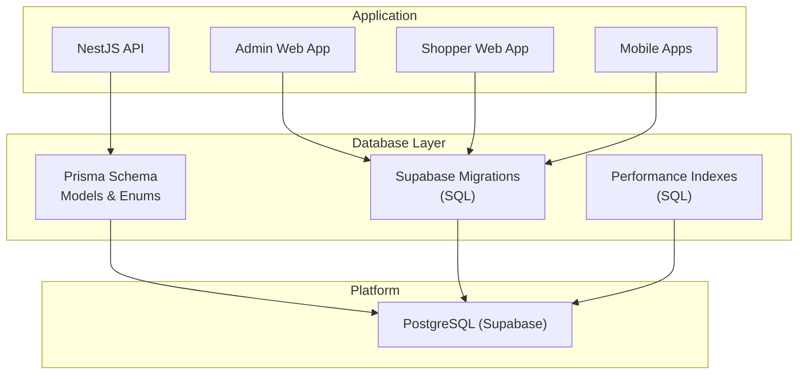
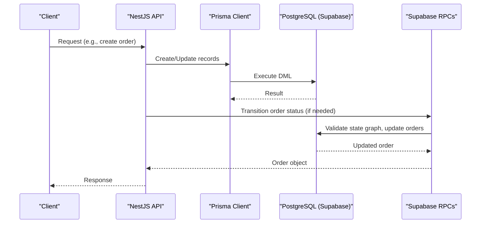
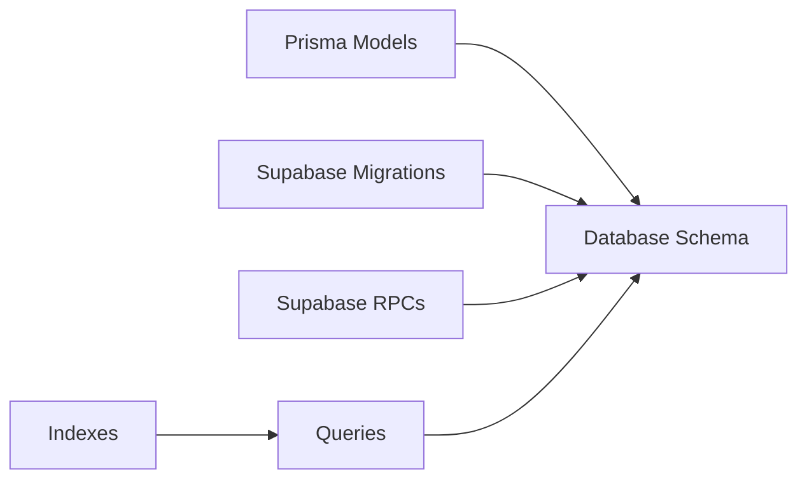

# Database Design

<cite>
**Referenced Files in This Document**
- [schema.prisma](file://apps/api/prisma/schema.prisma)
- [migration.sql (driver tables)](file://apps/api/prisma/migrations/20260726042623_add_driver_tables/migration.sql)
- [canonical order lifecycle](file://supabase/migrations/20260715150000_canonical_order_lifecycle.sql)
- [platform pricing and lifecycle](file://supabase/migrations/20260716100000_platform_canonical_pricing_and_lifecycle.sql)
- [addresses table](file://database/20260530_create_addresses.sql)
- [products search vector](file://database/20260603_products_search_vector.sql)
- [performance indexes](file://database/performance_indexes.sql)
- [supabase indexes](file://database/supabase_indexes.sql)
- [supabase indexes root](file://SUPABASE_INDEXES.sql)
</cite>

## Table of Contents
1. Introduction
2. Project Structure
3. Core Components
4. Architecture Overview
5. Detailed Component Analysis
6. Dependency Analysis
7. Performance Considerations
8. Troubleshooting Guide
9. Conclusion
10. Appendices

## Introduction
This document provides comprehensive database design documentation for the United Pharmacy system. It covers the complete schema, entity relationships, data types, constraints, Prisma ORM configuration, migration strategy, versioning approach, indexing strategy, query patterns, security measures, backup and recovery procedures, scaling considerations, and the roles of PostgreSQL and Supabase within the architecture. It also documents normalization decisions, denormalization strategies for performance, sample queries, stored procedures, and maintenance tasks.

## Project Structure
The database layer spans multiple areas:
- Prisma schema defines application-facing models and enums across schemas (auth and public).
- Supabase migrations evolve the public schema with domain features (orders, promotions, drivers, notifications).
- SQL scripts provide performance indexes, full-text search support, and maintenance utilities.
- The API service integrates Prisma to access PostgreSQL via Supabase-managed instances.



**Diagram sources**
- [schema.prisma:1-11](file://apps/api/prisma/schema.prisma#L1-L11)
- [canonical order lifecycle:1-41](file://supabase/migrations/20260715150000_canonical_order_lifecycle.sql#L1-L41)
- [platform pricing and lifecycle:1-270](file://supabase/migrations/20260716100000_platform_canonical_pricing_and_lifecycle.sql#L1-L270)
- [performance indexes:1-243](file://database/performance_indexes.sql#L1-L243)
- [supabase indexes:1-227](file://database/supabase_indexes.sql#L1-L227)

**Section sources**
- [schema.prisma:1-11](file://apps/api/prisma/schema.prisma#L1-L11)

## Core Components
- Authentication and identity are managed in the auth schema (users, sessions, OAuth, MFA, etc.), while business entities live in the public schema.
- Business domains include orders, products, inventory, profiles, branches/zones, driver operations, and notifications.
- Prisma models map directly to database tables and enforce types, relations, and constraints at the application level.

Key Prisma-defined components:
- Auth schema models: users, sessions, oauth_clients, mfa_factors, identities, refresh_tokens, webauthn_* tables.
- Public schema models: profiles, orders, order_items, products, inventory, favorites, special_orders, integration_events, Branch, DeliveryZone.
- Enums: app_role, order_status, and auth-related enums.

**Section sources**
- [schema.prisma:15-494](file://apps/api/prisma/schema.prisma#L15-L494)
- [schema.prisma:497-800](file://apps/api/prisma/schema.prisma#L497-L800)

## Architecture Overview
The system uses PostgreSQL as the relational store, hosted on Supabase. Supabase manages migrations and provides RLS policies and RPCs. Prisma is used by the NestJS API to interact with the database using typed clients.



**Diagram sources**
- [schema.prisma:6-11](file://apps/api/prisma/schema.prisma#L6-L11)
- [platform pricing and lifecycle:192-270](file://supabase/migrations/20260716100000_platform_canonical_pricing_and_lifecycle.sql#L192-L270)

## Detailed Component Analysis

### Prisma ORM Configuration and Multi-Schema Access
- Provider: PostgreSQL with multi-schema enabled.
- Schemas: auth and public are configured; business logic primarily targets public, while auth handles identity and sessions.
- Environment variables: DATABASE_URL and DIRECT_URL are used for connection and direct client access.

Best practices:
- Use Prisma’s type safety for all queries.
- Keep schema changes in Prisma migrations for API-side models; use Supabase migrations for platform-level changes (RLS, RPCs, functions).

**Section sources**
- [schema.prisma:1-11](file://apps/api/prisma/schema.prisma#L1-L11)

### Entity Relationships and Data Model
Core entities and relationships:
- profiles (public): user profile with role, status, contact info; linked to auth.users via id.
- orders (public): captures order details, customer info, totals, status, timestamps; links to profiles (user_id, assigned_driver_id) and delivery assignments.
- order_items (public): line items referencing orders and product snapshots.
- products (public): catalog entries with multilingual names, category fields, price, stock flags, timestamps.
- inventory (public): per-product stock and reserved quantities.
- favorites (public): user-product preferences.
- Branch and DeliveryZone (public): geographic zones tied to branches with polygon geometry and fee rules.
- Driver-related tables (via migration): DriverProfile, DriverLocation, DeliveryAssignment, DriverSession, DriverEarning.
- NotificationToken and NotificationLog (via migration): push notification tokens and logs.

Constraints and keys:
- Primary keys: UUIDs or auto-increment IDs depending on table.
- Unique constraints: e.g., external_ref on orders, unique phone/email where applicable.
- Foreign keys: orders -> profiles, order_items -> orders, inventory -> products, driver tables -> profiles/orders.

```mermaid
erDiagram
PROFILES {
uuid id PK
string full_name
string phone UK
string email
string username
text address
enum role
string status
timestamptz created_at
timestamptz updated_at
}
ORDERS {
uuid id PK
string external_ref UK
string customer_name
string customer_phone
json customer_address
decimal customer_lat
decimal customer_lng
enum status
uuid assigned_driver_id
string qr_token UK
decimal subtotal
decimal shipping_fee
decimal total
string source
timestamptz last_status_at
timestamptz created_at
timestamptz updated_at
uuid user_id
string note
decimal discount_total
decimal tax_total
string payment_method
string payment_status
string payment_reference
string idempotency_key
string failure_reason
}
ORDER_ITEMS {
bigint id PK
uuid order_id FK
string product_id
decimal quantity
decimal unit_price
decimal line_total
json product_snapshot
timestamptz created_at
}
PRODUCTS {
uuid id PK
string Code
string Barcode
string Name
string Name_Ar
string Name_En
string Category
string Category_Name
string Category_Name_En
decimal Price
boolean is_active
string source
timestamptz created_at
timestamptz updated_at
}
INVENTORY {
uuid product_id PK FK
int on_hand
int reserved
}
FAVORITES {
uuid user_id FK
string product_id
timestamptz created_at
}
BRANCH {
string id PK
string nameAr
string nameEn
string governorate
string area
string address
float lat
float lng
string mapEmbedSrc
float loadFactor
boolean isActive
timestamptz createdAt
timestamptz updatedAt
}
DELIVERY_ZONE {
string id PK
string branchId FK
string name
json polygon
int baseFee
int freeAboveSubtotal
int surgeStartHour
int surgeEndHour
float surgeMultiplier
timestamptz createdAt
timestamptz updatedAt
}
DRIVER_PROFILE {
uuid id PK
uuid userId FK
string vehicleType
string vehiclePlate
string vehicleModel
string vehicleColor
string licenseNumber
timestamptz licenseExpiry
string licensePhotoUrl
string idPhotoUrl
string vehiclePhotoUrl
string insurancePhotoUrl
enum status
boolean isOnline
double currentLat
double currentLng
timestamptz lastLocationAt
double rating
int totalDeliveries
double completionRate
decimal totalEarnings
timestamptz approvedAt
uuid approvedBy
string rejectionReason
timestamptz createdAt
timestamptz updatedAt
}
DELIVERY_ASSIGNMENT {
uuid id PK
uuid orderId FK
uuid driverId FK
string pharmacyName
double pharmacyLat
double pharmacyLng
string pharmacyAddress
timestamptz assignedAt
timestamptz acceptedAt
timestamptz rejectedAt
timestamptz arrivedPharmacyAt
timestamptz pickedUpAt
timestamptz arrivedCustomerAt
timestamptz deliveredAt
timestamptz cancelledAt
string proofPhotoUrl
string customerSignature
string deliveryNotes
int customerRating
string customerFeedback
decimal baseFee
decimal distanceFee
decimal tipAmount
decimal bonusAmount
decimal totalEarnings
enum status
string cancellationReason
double estimatedDistance
int estimatedDuration
double actualDistance
int actualDuration
timestamptz createdAt
timestamptz updatedAt
}
NOTIFICATION_TOKEN {
uuid id PK
uuid userId FK
string token UK
string platform
string deviceId
string deviceName
boolean isActive
timestamptz createdAt
timestamptz lastUsedAt
}
NOTIFICATION_LOG {
uuid id PK
uuid userId
uuid tokenId
string title
string body
json data
string imageUrl
string status
string platform
string errorMessage
timestamptz sentAt
timestamptz deliveredAt
timestamptz clickedAt
}
PROFILES ||--o{ ORDERS : "user_id / assigned_driver_id"
ORDERS ||--o{ ORDER_ITEMS : "order_id"
PRODUCTS ||--|| INVENTORY : "product_id"
PROFILES ||--o{ FAVORITES : "user_id"
BRANCH ||--o{ DELIVERY_ZONE : "branchId"
DRIVER_PROFILE ||--o{ DELIVERY_ASSIGNMENT : "driverId"
ORDERS ||--|| DELIVERY_ASSIGNMENT : "orderId"
PROFILES ||--o{ NOTIFICATION_TOKEN : "userId"
NOTIFICATION_TOKEN ||--o{ NOTIFICATION_LOG : "tokenId"
```

**Diagram sources**
- [schema.prisma:497-800](file://apps/api/prisma/schema.prisma#L497-L800)
- [migration.sql (driver tables):1-244](file://apps/api/prisma/migrations/20260726042623_add_driver_tables/migration.sql#L1-L244)

**Section sources**
- [schema.prisma:497-800](file://apps/api/prisma/schema.prisma#L497-L800)
- [migration.sql (driver tables):1-244](file://apps/api/prisma/migrations/20260726042623_add_driver_tables/migration.sql#L1-L244)

### Migration Strategy and Versioning
- Supabase migrations: timestamped SQL files under supabase/migrations define schema evolution, RLS policies, RPCs, and functions.
- Prisma migrations: under apps/api/prisma/migrations for API-specific model changes (e.g., driver tables).
- Versioning approach:
  - Supabase: file-based migrations with timestamps ensure ordered execution and rollback capability.
  - Prisma: migration history tracked via Prisma’s migration engine; applied through CI/CD pipelines.

Operational notes:
- Prefer additive changes (new columns, tables) over destructive ones.
- Use idempotent constructs (IF NOT EXISTS) where possible.
- Coordinate cross-repo changes between Supabase and Prisma to avoid conflicts.

**Section sources**
- [canonical order lifecycle:1-41](file://supabase/migrations/20260715150000_canonical_order_lifecycle.sql#L1-L41)
- [platform pricing and lifecycle:1-270](file://supabase/migrations/20260716100000_platform_canonical_pricing_and_lifecycle.sql#L1-L270)
- [migration.sql (driver tables):1-244](file://apps/api/prisma/migrations/20260726042623_add_driver_tables/migration.sql#L1-L244)

### Indexing Strategy and Query Patterns
Indexing focuses on high-frequency queries:
- Products: GIN trigram indexes for ilike searches, composite indexes for sorting/filtering, partial indexes for active/in-stock subsets.
- Orders: indexes on status, created_at, driver assignment, QR token lookup.
- Order items: indexes on order_id and product_id for analytics.
- Drivers: location time-series indexes, assignment status indexes, session and earning aggregates.

Performance scripts:
- performance_indexes.sql and supabase_indexes.sql provide optimized index definitions and maintenance functions.
- SUPABASE_INDEXES.sql includes pg_trgm extension setup and trigram indexes for efficient pattern matching.

Query patterns:
- Full-text search using tsvector and @@ operator for relevance ranking.
- Filtered catalogs with in_stock, price ranges, categories, and sort orders leveraging composite indexes.
- Order lifecycle transitions enforced via RPCs to maintain integrity.

**Section sources**
- [performance indexes:1-243](file://database/performance_indexes.sql#L1-L243)
- [supabase indexes:1-227](file://database/supabase_indexes.sql#L1-L227)
- [supabase indexes root:1-109](file://SUPABASE_INDEXES.sql#L1-L109)
- [products search vector:1-44](file://database/20260603_products_search_vector.sql#L1-L44)

### Security Measures
- Row Level Security (RLS):
  - Addresses table enforces user-scoped access via policies.
  - Auth schema tables leverage RLS for secure session and identity management.
- Role-based access:
  - Profiles carry role information; RPCs validate roles before mutations (e.g., admin_transition_order).
- Secure functions:
  - SECURITY DEFINER functions restrict privilege escalation and enforce strict checks.

Best practices:
- Always enable RLS on sensitive tables.
- Use least-privilege roles and grant only necessary permissions.
- Validate inputs in RPCs and enforce state transitions.

**Section sources**
- [addresses table:33-70](file://database/20260530_create_addresses.sql#L33-L70)
- [canonical order lifecycle:16-41](file://supabase/migrations/20260715150000_canonical_order_lifecycle.sql#L16-L41)
- [platform pricing and lifecycle:192-270](file://supabase/migrations/20260716100000_platform_canonical_pricing_and_lifecycle.sql#L192-L270)

### Backup and Recovery Procedures
Recommended approach:
- Use Supabase’s built-in backups and point-in-time recovery (PITR) capabilities.
- Schedule regular logical backups (pg_dump) for critical datasets (orders, products, profiles).
- Test restore procedures periodically to ensure recoverability.
- Maintain migration scripts in version control to reconstruct schema if needed.

Operational tips:
- Back up both schema and data separately.
- Store backups securely with encryption at rest and in transit.
- Document runbooks for disaster recovery scenarios.

[No sources needed since this section provides general guidance]

### Scaling Considerations
- Read-heavy workloads:
  - Leverage read replicas provided by Supabase for scaling reads.
  - Cache frequently accessed data (products, categories) at the application layer.
- Write-heavy workloads:
  - Partition large tables (e.g., DriverLocation) by time to improve query performance.
  - Use asynchronous processing for heavy computations (e.g., analytics, notifications).
- Connection pooling:
  - Configure PgBouncer or equivalent to manage connections efficiently.
- Monitoring:
  - Track slow queries and index usage via views and statistics.
  - Set alerts for lock contention and long-running transactions.

[No sources needed since this section provides general guidance]

### Relationship Between PostgreSQL and Supabase
- PostgreSQL is the underlying relational database engine.
- Supabase provides:
  - Managed hosting and scaling.
  - Migrations tooling and UI.
  - RLS policies and RPCs for secure serverless functions.
  - Realtime subscriptions and authentication integrations.

Architecture roles:
- Supabase orchestrates migrations and exposes APIs/RPCs.
- Prisma interacts with PostgreSQL via generated clients for type-safe queries.
- Applications consume Supabase services and APIs for business logic.

**Section sources**
- [schema.prisma:6-11](file://apps/api/prisma/schema.prisma#L6-L11)
- [canonical order lifecycle:1-41](file://supabase/migrations/20260715150000_canonical_order_lifecycle.sql#L1-L41)

### Data Modeling Decisions and Normalization
Normalization principles:
- Separate concerns into distinct tables (orders vs order_items, products vs inventory).
- Enforce referential integrity via foreign keys.
- Use enums for constrained values (order_status, app_role).

Denormalization strategies for performance:
- Product effective prices view computes discounts dynamically without storing redundant data.
- Search vector column stores precomputed tsvector for fast full-text search.
- Composite indexes optimize common filter/sort combinations.

Trade-offs:
- Denormalized fields increase write overhead but reduce read complexity.
- Views and functions encapsulate complex logic, improving consistency and maintainability.

**Section sources**
- [platform pricing and lifecycle:5-178](file://supabase/migrations/20260716100000_platform_canonical_pricing_and_lifecycle.sql#L5-L178)
- [products search vector:22-44](file://database/20260603_products_search_vector.sql#L22-L44)

### Sample Queries, Stored Procedures, and Maintenance Tasks
Sample queries:
- Search products with filters and pagination using search_effective_products function.
- Retrieve effective product details by ID using get_effective_product function.
- List orders by status and date range using indexed queries.

Stored procedures:
- transition_order and admin_transition_order enforce canonical order lifecycle transitions.
- update_product_stats updates category counts and refreshes statistics.

Maintenance tasks:
- Run ANALYZE on key tables after bulk updates.
- Monitor index usage via index_usage_stats view.
- Clean up old data using cleanup_old_data function when appropriate.

**Section sources**
- [platform pricing and lifecycle:60-178](file://supabase/migrations/20260716100000_platform_canonical_pricing_and_lifecycle.sql#L60-L178)
- [canonical order lifecycle:16-41](file://supabase/migrations/20260715150000_canonical_order_lifecycle.sql#L16-L41)
- [performance indexes:178-215](file://database/performance_indexes.sql#L178-L215)

## Dependency Analysis
Dependencies between components:
- Prisma models depend on database schema defined by migrations.
- Supabase RPCs depend on tables and functions created by migrations.
- Indexes depend on query patterns and workload characteristics.



**Diagram sources**
- [schema.prisma:15-800](file://apps/api/prisma/schema.prisma#L15-L800)
- [canonical order lifecycle:1-41](file://supabase/migrations/20260715150000_canonical_order_lifecycle.sql#L1-L41)
- [performance indexes:1-243](file://database/performance_indexes.sql#L1-L243)

**Section sources**
- [schema.prisma:15-800](file://apps/api/prisma/schema.prisma#L15-L800)

## Performance Considerations
- Use GIN trigram indexes for ilike searches to achieve significant speedups.
- Employ composite indexes for common filter/sort combinations.
- Leverage partial indexes to reduce index size and improve selectivity.
- Monitor query performance using slow_product_queries and index_usage_stats views.
- Apply parallel workers settings for large scans where appropriate.

[No sources needed since this section provides general guidance]

## Troubleshooting Guide
Common issues and resolutions:
- Slow product searches: verify trigram indexes exist and are being used; run ANALYZE to update statistics.
- Order transition errors: check role permissions and valid state transitions via RPCs.
- Missing search_vector column: ensure migration adding the column has been applied.

Diagnostic steps:
- Inspect index usage stats and slow queries.
- Use EXPLAIN ANALYZE on problematic queries.
- Validate RLS policies and function grants.

**Section sources**
- [performance indexes:148-173](file://database/performance_indexes.sql#L148-L173)
- [products search vector:1-44](file://database/20260603_products_search_vector.sql#L1-L44)
- [canonical order lifecycle:16-41](file://supabase/migrations/20260715150000_canonical_order_lifecycle.sql#L16-L41)

## Conclusion
The United Pharmacy database design balances normalization with targeted denormalization for performance. Supabase migrations and Prisma models provide a robust foundation for evolving the schema safely. Indexing strategies and RPCs ensure efficient queries and data integrity. Security is enforced via RLS and role-based access controls. With proper monitoring and maintenance, the system can scale effectively to meet growing demands.

[No sources needed since this section summarizes without analyzing specific files]

## Appendices

### Appendix A: Key Tables Summary
- profiles: user profiles with roles and status.
- orders: order lifecycle with timestamps and totals.
- order_items: line items with product snapshots.
- products: catalog with multilingual names and pricing.
- inventory: stock and reserved quantities.
- Branch/DeliveryZone: geographic zones and fees.
- Driver tables: driver profiles, locations, assignments, sessions, earnings.
- Notifications: tokens and logs for push notifications.

**Section sources**
- [schema.prisma:497-800](file://apps/api/prisma/schema.prisma#L497-L800)
- [migration.sql (driver tables):1-244](file://apps/api/prisma/migrations/20260726042623_add_driver_tables/migration.sql#L1-L244)

### Appendix B: Index Catalog
- Products: trigram indexes for ilike, composite indexes for sorting/filtering, partial indexes for active/in-stock.
- Orders: status/date, driver assignment, QR token.
- Order items: order_id, product_id.
- Drivers: location time-series, assignment status, session/earning aggregates.

**Section sources**
- [performance indexes:1-243](file://database/performance_indexes.sql#L1-L243)
- [supabase indexes:1-227](file://database/supabase_indexes.sql#L1-L227)
- [supabase indexes root:1-109](file://SUPABASE_INDEXES.sql#L1-L109)