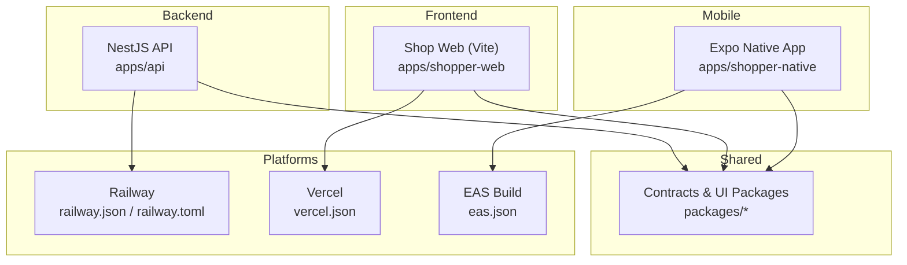
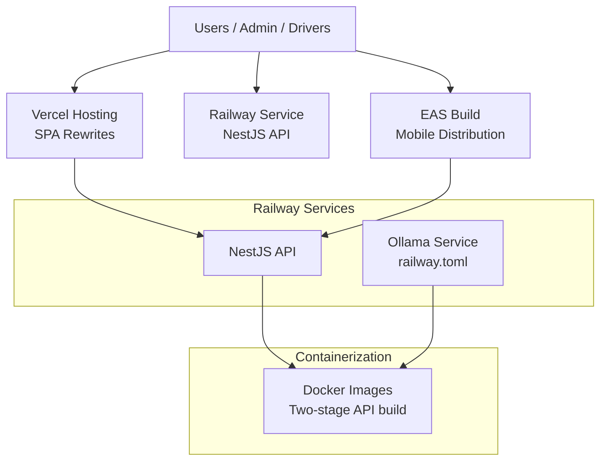
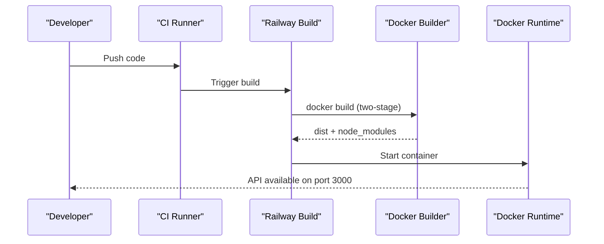
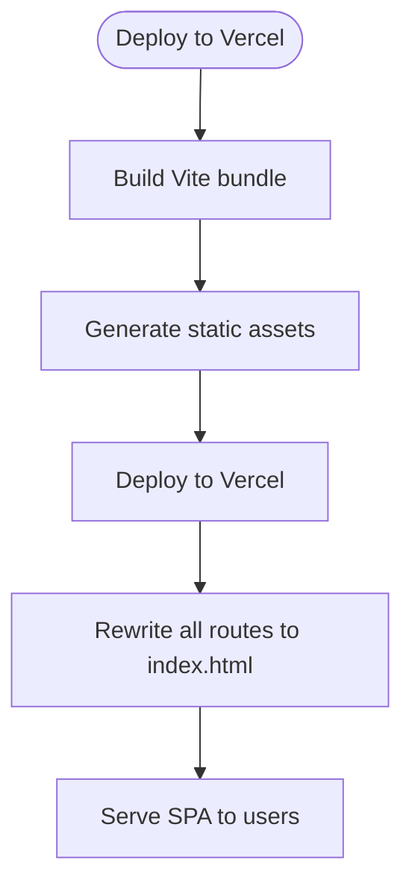
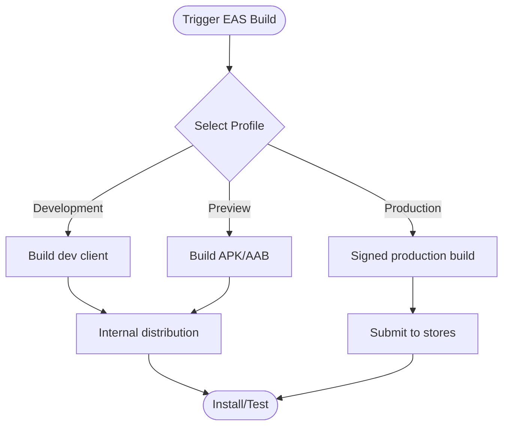
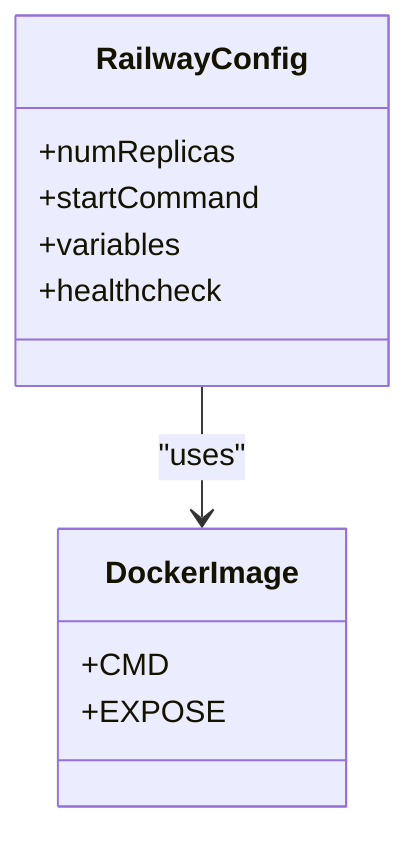
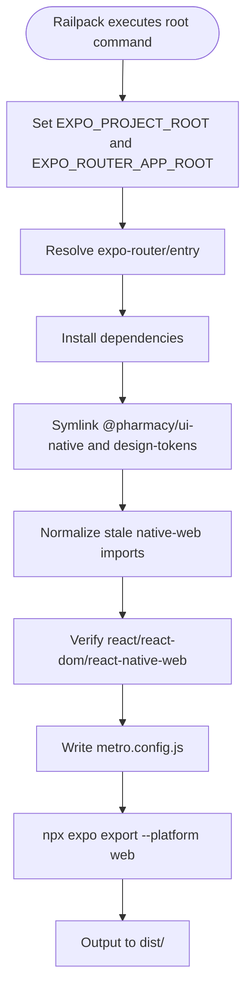
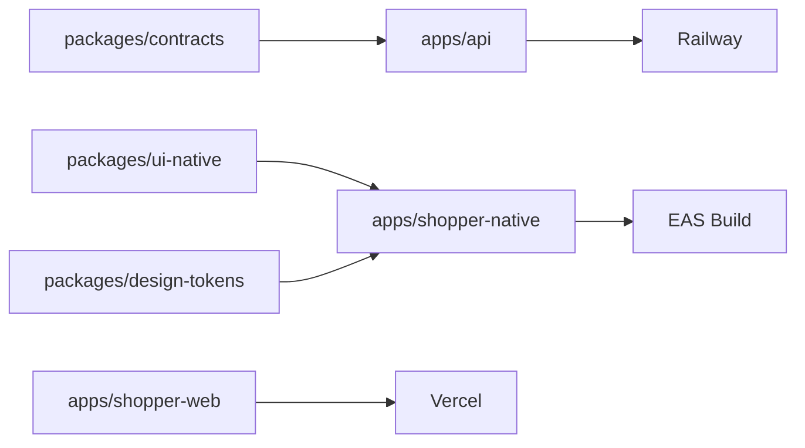

# Deployment & DevOps

<cite>
**Referenced Files in This Document**
- [railway.json](file://railway.json)
- [railway.toml](file://railway.toml)
- [vercel.json](file://vercel.json)
- [eas.json](file://eas.json)
- [Dockerfile (API)](file://apps/api/Dockerfile)
- [nixpacks.toml](file://nixpacks.toml)
- [build-api.sh](file://scripts/railway/build-api.sh)
- [start-api.sh](file://scripts/railway/start-api.sh)
- [build-shopper-web.sh](file://scripts/railway/build-shopper-web.sh)
- [start-shopper-web.sh](file://scripts/railway/start-shopper-web.sh)
- [build-shopper-native.sh](file://scripts/railway/build-shopper-native.sh)
- [start-shopper-native.sh](file://scripts/railway/start-shopper-native.sh)
- [shopper-native railway-build.sh](file://apps/shopper-native/railway-build.sh)
- [app.json](file://app.json)
</cite>

## Table of Contents
1. Introduction
2. Project Structure
3. Core Components
4. Architecture Overview
5. Detailed Component Analysis
6. Dependency Analysis
7. Performance Considerations
8. Troubleshooting Guide
9. Conclusion
10. Appendices

## Introduction
This document provides comprehensive deployment and DevOps guidance for the United Pharmacy system. It covers CI/CD configuration using Railway for backend services and Vercel for frontend hosting, containerization with Docker, environment variable management, secrets handling, multi-environment deployments, rollback procedures, monitoring and logging, performance metrics, alerting, mobile app distribution via EAS Build, scaling and load balancing considerations, disaster recovery, infrastructure as code practices, and environment-specific configurations.

## Project Structure
The repository is a monorepo with multiple apps and shared packages:
- Backend API: NestJS application under apps/api
- Frontend web: Vite-based app under apps/shopper-web
- Mobile apps: Expo-based native apps under apps/shopper-native and others
- Shared packages: packages/* (contracts, ui-native, design-tokens, etc.)
- Deployment scripts: scripts/railway/* for build and start commands
- Platform configs: railway.json, railway.toml, vercel.json, eas.json, nixpacks.toml, app.json

**Diagram sources**
- [railway.json:1-7](file://railway.json#L1-L7)
- [railway.toml:1-19](file://railway.toml#L1-L19)
- [vercel.json:1-9](file://vercel.json#L1-L9)
- [eas.json:1-76](file://eas.json#L1-L76)

**Section sources**
- [railway.json:1-7](file://railway.json#L1-L7)
- [railway.toml:1-19](file://railway.toml#L1-L19)
- [vercel.json:1-9](file://vercel.json#L1-L9)
- [eas.json:1-76](file://eas.json#L1-L76)

## Core Components
- Backend API (NestJS): Containerized with a two-stage Dockerfile; built and run via Railway scripts enforcing Node.js version requirements.
- Shopper Web: Built with Vite and served statically; configured for SPA routing on Vercel.
- Mobile Apps: Built with Expo and distributed via EAS Build with multiple channels and signing options.
- Shared Packages: Referenced by API and mobile/web apps; symlinked or installed during builds to avoid workspace conflicts.
- Platform Configurations:
  - Railway: Dockerfile-based service for Ollama and script-driven builds for API and web assets.
  - Vercel: SPA rewrites for client-side routing.
  - EAS: Build profiles for development, preview, and production with Android/iOS specifics.

**Section sources**
- [Dockerfile (API):1-47](file://apps/api/Dockerfile#L1-L47)
- [build-api.sh:1-32](file://scripts/railway/build-api.sh#L1-L32)
- [start-api.sh:1-13](file://scripts/railway/start-api.sh#L1-L13)
- [build-shopper-web.sh:1-11](file://scripts/railway/build-shopper-web.sh#L1-L11)
- [start-shopper-web.sh:1-5](file://scripts/railway/start-shopper-web.sh#L1-L5)
- [build-shopper-native.sh:1-5](file://scripts/railway/build-shopper-native.sh#L1-L5)
- [start-shopper-native.sh:1-5](file://scripts/railway/start-shopper-native.sh#L1-L5)
- [shopper-native railway-build.sh:1-86](file://apps/shopper-native/railway-build.sh#L1-L86)
- [railway.toml:1-19](file://railway.toml#L1-L19)
- [vercel.json:1-9](file://vercel.json#L1-L9)
- [eas.json:1-76](file://eas.json#L1-L76)

## Architecture Overview
High-level deployment architecture across platforms:

**Diagram sources**
- [vercel.json:1-9](file://vercel.json#L1-L9)
- [railway.toml:1-19](file://railway.toml#L1-L19)
- [Dockerfile (API):1-47](file://apps/api/Dockerfile#L1-L47)

## Detailed Component Analysis

### Backend API (NestJS) on Railway
- Build process:
  - Enforces Node.js version compatibility at build time.
  - Installs contracts package separately to avoid workspace conflicts.
  - Generates Prisma client and compiles NestJS into dist/.
- Runtime:
  - Starts compiled main entry point.
  - Exposes port 3000 inside container.
- Containerization:
  - Two-stage Docker image: builder stage installs dependencies and builds; runtime stage copies only artifacts.

**Diagram sources**
- [Dockerfile (API):1-47](file://apps/api/Dockerfile#L1-L47)
- [build-api.sh:1-32](file://scripts/railway/build-api.sh#L1-L32)
- [start-api.sh:1-13](file://scripts/railway/start-api.sh#L1-L13)

**Section sources**
- [Dockerfile (API):1-47](file://apps/api/Dockerfile#L1-L47)
- [build-api.sh:1-32](file://scripts/railway/build-api.sh#L1-L32)
- [start-api.sh:1-13](file://scripts/railway/start-api.sh#L1-L13)

### Shopper Web on Vercel
- SPA routing configured via rewrites to index.html.
- Build outputs static assets suitable for CDN delivery.

**Diagram sources**
- [vercel.json:1-9](file://vercel.json#L1-L9)
- [build-shopper-web.sh:1-11](file://scripts/railway/build-shopper-web.sh#L1-L11)

**Section sources**
- [vercel.json:1-9](file://vercel.json#L1-L9)
- [build-shopper-web.sh:1-11](file://scripts/railway/build-shopper-web.sh#L1-L11)

### Mobile Apps via EAS Build
- Multiple build profiles:
  - Development: internal distribution with development client.
  - Preview: APK/AAB builds for testing.
  - Production: signed builds with auto-increment and local credentials.
- Submission profile includes Android track and service account key path.

**Diagram sources**
- [eas.json:1-76](file://eas.json#L1-L76)

**Section sources**
- [eas.json:1-76](file://eas.json#L1-L76)

### Ollama Service on Railway
- Configuration sets replicas, health checks, and environment variables for host and model storage.
- Uses a dedicated Dockerfile referenced by Railway config.

**Diagram sources**
- [railway.toml:1-19](file://railway.toml#L1-L19)
- [railway.json:1-7](file://railway.json#L1-L7)

**Section sources**
- [railway.toml:1-19](file://railway.toml#L1-L19)
- [railway.json:1-7](file://railway.json#L1-L7)

### Shopper Native Export on Railway
- Sets Expo project roots and resolves expo-router entry.
- Symlinks shared packages and normalizes imports.
- Verifies React runtime dependencies and exports web bundle to dist/.

**Diagram sources**
- [shopper-native railway-build.sh:1-86](file://apps/shopper-native/railway-build.sh#L1-L86)

**Section sources**
- [shopper-native railway-build.sh:1-86](file://apps/shopper-native/railway-build.sh#L1-L86)

## Dependency Analysis
- Monorepo dependency strategy:
  - API depends on shared contracts; installed separately to avoid workspace conflicts.
  - Mobile app symlinks shared UI and design tokens into its node_modules.
- Platform-specific toolchains:
  - Railway uses Railpack and custom scripts to ensure consistent Node versions and builds.
  - Vercel serves static SPA with rewrites.
  - EAS manages native builds and submissions.

**Diagram sources**
- [build-api.sh:1-32](file://scripts/railway/build-api.sh#L1-L32)
- [shopper-native railway-build.sh:1-86](file://apps/shopper-native/railway-build.sh#L1-L86)
- [vercel.json:1-9](file://vercel.json#L1-L9)
- [eas.json:1-76](file://eas.json#L1-L76)

**Section sources**
- [build-api.sh:1-32](file://scripts/railway/build-api.sh#L1-L32)
- [shopper-native railway-build.sh:1-86](file://apps/shopper-native/railway-build.sh#L1-L86)
- [vercel.json:1-9](file://vercel.json#L1-L9)
- [eas.json:1-76](file://eas.json#L1-L76)

## Performance Considerations
- API:
  - Use two-stage Docker images to minimize runtime footprint.
  - Ensure Prisma client generation occurs before build to avoid runtime overhead.
  - Keep Node.js version aligned with scripts’ requirements to prevent rebuilds.
- Web:
  - Leverage Vercel’s CDN and caching for static assets.
  - Configure rewrites to support client-side routing without server logic.
- Mobile:
  - Use EAS Build caches and prebuilt images where possible.
  - Minimize bundle size by excluding unnecessary plugins and enabling minification in release builds.
- Railway:
  - Adjust replicas and health check thresholds based on traffic patterns.
  - Monitor container startup times and optimize build steps.

[No sources needed since this section provides general guidance]

## Troubleshooting Guide
- Node.js version mismatches:
  - Scripts enforce minimum Node versions; ensure Railway uses the correct runtime (e.g., .nvmrc or NODE_VERSION).
- Build failures due to workspace conflicts:
  - API build installs contracts separately; verify that file references are rewritten correctly.
- Expo Router resolution issues:
  - Ensure EXPO_PROJECT_ROOT and EXPO_ROUTER_APP_ROOT are set before building.
- Missing shared packages:
  - Symlink @pharmacy/ui-native and design-tokens into the mobile app’s node_modules during build.
- Vercel routing errors:
  - Confirm rewrites target index.html for SPA routing.
- EAS submission errors:
  - Validate service account key path and credentials source in eas.json.

**Section sources**
- [build-api.sh:1-32](file://scripts/railway/build-api.sh#L1-L32)
- [start-api.sh:1-13](file://scripts/railway/start-api.sh#L1-L13)
- [shopper-native railway-build.sh:1-86](file://apps/shopper-native/railway-build.sh#L1-L86)
- [vercel.json:1-9](file://vercel.json#L1-L9)
- [eas.json:1-76](file://eas.json#L1-L76)

## Conclusion
The United Pharmacy system employs a robust, multi-platform deployment strategy:
- Backend API containerized and deployed via Railway with strict Node version enforcement and optimized builds.
- Frontend hosted on Vercel with SPA routing configured for seamless user experience.
- Mobile apps built and distributed through EAS Build with tailored profiles for each environment.
- Shared packages are integrated carefully to avoid workspace conflicts and ensure consistent builds across environments.

[No sources needed since this section summarizes without analyzing specific files]

## Appendices

### Environment Variables and Secrets Management
- Railway:
  - Define environment variables in service settings or via TOML variables.
  - Store secrets (e.g., database URLs, API keys) in Railway’s secret manager and reference them in environment variables.
- Vercel:
  - Configure environment variables in project settings; use separate scopes for preview and production.
- EAS:
  - Manage secrets via EAS CLI and project settings; reference in build profiles.
- Docker:
  - Pass secrets at runtime via environment variables; avoid baking secrets into images.

[No sources needed since this section provides general guidance]

### Multi-Environment Deployment Strategy
- Development:
  - Use development client builds for mobile; deploy API locally or on Railway dev instances.
- Staging:
  - Preview builds for mobile; deploy staging API with staging database and secrets.
- Production:
  - Signed production builds for mobile; deploy production API with hardened secrets and monitoring.

[No sources needed since this section provides general guidance]

### Rollback Procedures
- Railway:
  - Re-deploy previous commit or artifact; use service history to revert changes.
- Vercel:
  - Revert to previous deployment from the dashboard or CLI.
- EAS:
  - Re-submit previous build or distribute older APK/AAB internally.

[No sources needed since this section provides general guidance]

### Monitoring, Logging, Metrics, and Alerting
- Railway:
  - Enable logs streaming and set up alerts based on error rates or uptime.
- Vercel:
  - Use analytics and edge logs; integrate third-party monitoring if needed.
- Mobile:
  - Implement crash reporting and telemetry within the app; configure EAS Insights.

[No sources needed since this section provides general guidance]

### Scaling, Load Balancing, and Disaster Recovery
- Scaling:
  - Increase Railway replicas for API; leverage Vercel’s global edge network for frontend.
- Load Balancing:
  - Railway handles request distribution; ensure stateless API design.
- Disaster Recovery:
  - Maintain backups of databases and artifacts; define RTO/RPO targets and test recovery procedures.

[No sources needed since this section provides general guidance]

### Infrastructure as Code and Environment-Specific Configurations
- IaC:
  - Version-control platform configs (railway.json, railway.toml, vercel.json, eas.json).
  - Use scripts to standardize builds and starts across environments.
- Environment-Specific Configs:
  - Separate environment variables per environment; validate required variables at startup.

[No sources needed since this section provides general guidance]