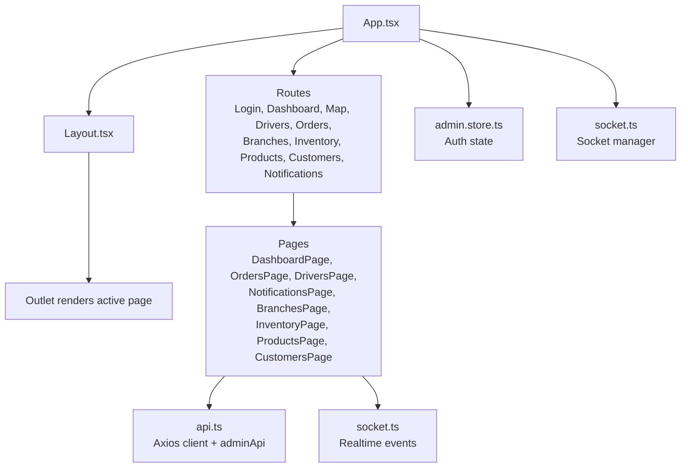
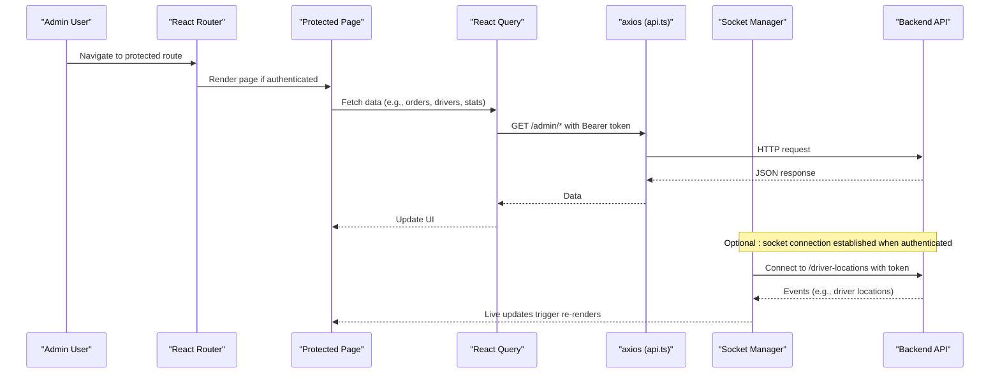
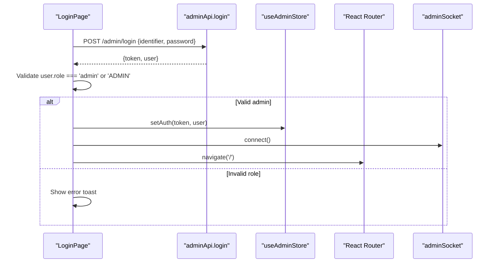
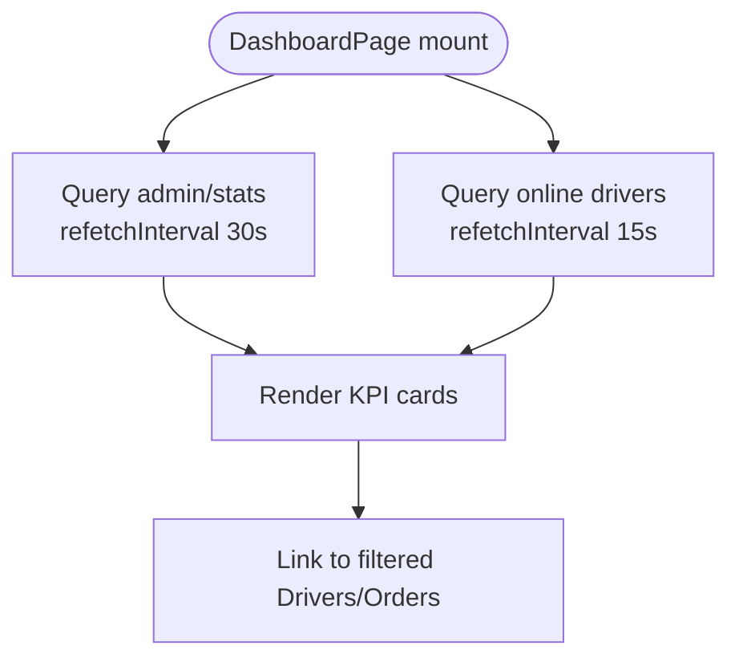
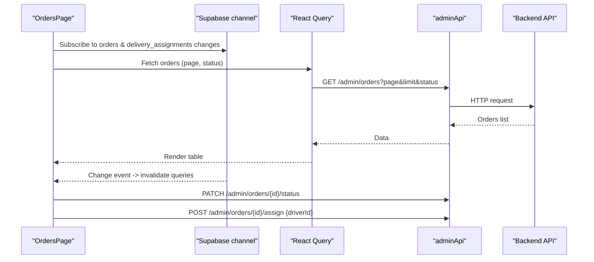
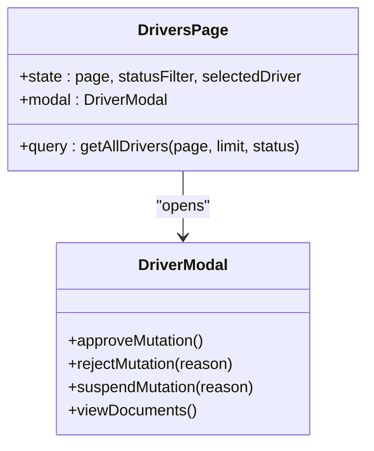
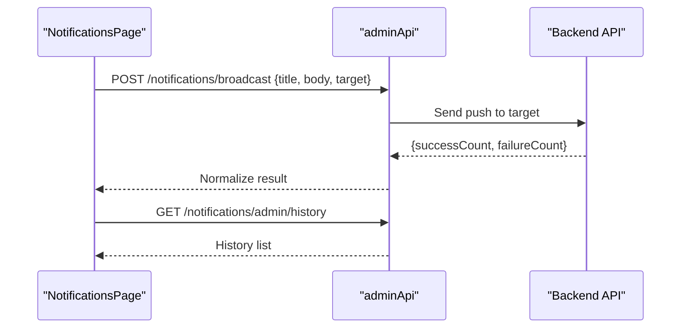
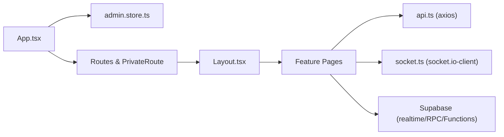

# Admin Dashboard

<cite>
**Referenced Files in This Document**
- [App.tsx](file://apps/admin/src/App.tsx)
- [Layout.tsx](file://apps/admin/src/components/Layout.tsx)
- [admin.store.ts](file://apps/admin/src/stores/admin.store.ts)
- [api.ts](file://apps/admin/src/lib/api.ts)
- [socket.ts](file://apps/admin/src/lib/socket.ts)
- [LoginPage.tsx](file://apps/admin/src/pages/LoginPage.tsx)
- [DashboardPage.tsx](file://apps/admin/src/pages/DashboardPage.tsx)
- [OrdersPage.tsx](file://apps/admin/src/pages/OrdersPage.tsx)
- [DriversPage.tsx](file://apps/admin/src/pages/DriversPage.tsx)
- [NotificationsPage.tsx](file://apps/admin/src/pages/NotificationsPage.tsx)
- [BranchesPage.tsx](file://apps/admin/src/pages/BranchesPage.tsx)
- [InventoryPage.tsx](file://apps/admin/src/pages/InventoryPage.tsx)
- [ProductsPage.tsx](file://apps/admin/src/pages/ProductsPage.tsx)
- [CustomersPage.tsx](file://apps/admin/src/pages/CustomersPage.tsx)
</cite>

## Table of Contents
1. Introduction
2. Project Structure
3. Core Components
4. Architecture Overview
5. Detailed Component Analysis
6. Dependency Analysis
7. Performance Considerations
8. Troubleshooting Guide
9. Conclusion

## Introduction
This document describes the Admin Dashboard built with React and Vite. It covers role-based access control, admin-specific features for pharmacy management, real-time monitoring, user management, product inventory, order processing workflows, analytics reporting, branch management, driver assignment interfaces, notification tools, security considerations, data visualization components, export capabilities, backend API integration, and live operations updates.

## Project Structure
The Admin Dashboard is a single-page application organized by feature pages under src/pages, shared UI and utilities under src/components and src/lib, and global state under src/stores. Routing and authentication gating are handled at the app level, while each page encapsulates its own queries and mutations via React Query. Real-time updates are provided through a Socket.IO client wrapper and Supabase realtime channels where applicable.

**Diagram sources**
- [App.tsx:20-64](file://apps/admin/src/App.tsx#L20-L64)
- [Layout.tsx:15-156](file://apps/admin/src/components/Layout.tsx#L15-L156)
- [admin.store.ts:12-45](file://apps/admin/src/stores/admin.store.ts#L12-L45)
- [socket.ts:6-60](file://apps/admin/src/lib/socket.ts#L6-L60)
- [api.ts:31-89](file://apps/admin/src/lib/api.ts#L31-L89)

**Section sources**
- [App.tsx:1-69](file://apps/admin/src/App.tsx#L1-L69)
- [Layout.tsx:1-156](file://apps/admin/src/components/Layout.tsx#L1-L156)
- [admin.store.ts:1-46](file://apps/admin/src/stores/admin.store.ts#L1-L46)
- [api.ts:1-347](file://apps/admin/src/lib/api.ts#L1-L347)
- [socket.ts:1-61](file://apps/admin/src/lib/socket.ts#L1-L61)

## Core Components
- Authentication and routing guard: PrivateRoute ensures only authenticated admins can access protected routes; login enforces admin role validation.
- Global state: Persisted store holds token, user profile, authentication status, and theme preferences.
- HTTP client: Axios instance attaches Authorization headers automatically and handles 401 by logging out and redirecting to login.
- Realtime layer: Socket.IO manager connects/disconnects based on auth state and provides event subscription helpers.
- Pages: Feature pages use React Query for data fetching, mutation handling, and optimistic UI updates.

**Section sources**
- [App.tsx:20-38](file://apps/admin/src/App.tsx#L20-L38)
- [LoginPage.tsx:16-41](file://apps/admin/src/pages/LoginPage.tsx#L16-L41)
- [admin.store.ts:12-45](file://apps/admin/src/stores/admin.store.ts#L12-L45)
- [api.ts:12-29](file://apps/admin/src/lib/api.ts#L12-L29)
- [socket.ts:10-36](file://apps/admin/src/lib/socket.ts#L10-L36)

## Architecture Overview
The dashboard follows a layered architecture:
- Presentation layer: React pages and layout with Tailwind CSS styling.
- State layer: Zustand store for auth and theme.
- Data layer: React Query for caching and background refetch; Axios for REST calls; Socket.IO for live events; Supabase RPC/functions for marketing features.
- Backend integration: Admin endpoints for drivers, orders, stats, branches, inventory, products, customers; notifications endpoint; direct Supabase calls for marketing campaigns.

**Diagram sources**
- [App.tsx:20-38](file://apps/admin/src/App.tsx#L20-L38)
- [api.ts:12-29](file://apps/admin/src/lib/api.ts#L12-L29)
- [socket.ts:10-36](file://apps/admin/src/lib/socket.ts#L10-L36)
- [OrdersPage.tsx:35-50](file://apps/admin/src/pages/OrdersPage.tsx#L35-L50)

## Detailed Component Analysis

### Authentication and Role-Based Access Control
- Login flow validates credentials and enforces admin role before persisting auth state and connecting realtime socket.
- Protected routes redirect unauthenticated users to login.
- On 401 responses, the client logs out and redirects to login.

**Diagram sources**
- [LoginPage.tsx:16-41](file://apps/admin/src/pages/LoginPage.tsx#L16-L41)
- [api.ts:33-35](file://apps/admin/src/lib/api.ts#L33-L35)
- [admin.store.ts:23-45](file://apps/admin/src/stores/admin.store.ts#L23-L45)
- [socket.ts:10-36](file://apps/admin/src/lib/socket.ts#L10-L36)

**Section sources**
- [LoginPage.tsx:16-41](file://apps/admin/src/pages/LoginPage.tsx#L16-L41)
- [App.tsx:20-38](file://apps/admin/src/App.tsx#L20-L38)
- [api.ts:12-29](file://apps/admin/src/lib/api.ts#L12-L29)

### Dashboard Analytics and Real-Time Monitoring
- Displays KPI cards for online drivers, active deliveries, today’s deliveries, and revenue.
- Polls stats and online drivers with configured intervals.
- Provides quick links to filtered views for drivers and orders.

**Diagram sources**
- [DashboardPage.tsx:41-68](file://apps/admin/src/pages/DashboardPage.tsx#L41-L68)
- [DashboardPage.tsx:83-116](file://apps/admin/src/pages/DashboardPage.tsx#L83-L116)

**Section sources**
- [DashboardPage.tsx:41-116](file://apps/admin/src/pages/DashboardPage.tsx#L41-L116)

### Order Processing Workflow
- Lists orders with pagination and status filters.
- Subscribes to Postgres changes on orders and delivery_assignments to refresh the board in real time.
- Allows updating order status and assigning drivers from an approved pool.

**Diagram sources**
- [OrdersPage.tsx:35-50](file://apps/admin/src/pages/OrdersPage.tsx#L35-L50)
- [OrdersPage.tsx:58-83](file://apps/admin/src/pages/OrdersPage.tsx#L58-L83)
- [OrdersPage.tsx:280-312](file://apps/admin/src/pages/OrdersPage.tsx#L280-L312)
- [api.ts:56-68](file://apps/admin/src/lib/api.ts#L56-L68)

**Section sources**
- [OrdersPage.tsx:28-83](file://apps/admin/src/pages/OrdersPage.tsx#L28-L83)
- [OrdersPage.tsx:280-312](file://apps/admin/src/pages/OrdersPage.tsx#L280-L312)
- [api.ts:56-68](file://apps/admin/src/lib/api.ts#L56-L68)

### Driver Management and Assignment
- Lists drivers with status filters and pagination.
- Modal supports approve/reject/suspend actions with reasons.
- Assignable drivers are fetched for order assignment.

**Diagram sources**
- [DriversPage.tsx:244-389](file://apps/admin/src/pages/DriversPage.tsx#L244-L389)
- [DriversPage.tsx:41-242](file://apps/admin/src/pages/DriversPage.tsx#L41-L242)
- [api.ts:37-54](file://apps/admin/src/lib/api.ts#L37-L54)

**Section sources**
- [DriversPage.tsx:244-389](file://apps/admin/src/pages/DriversPage.tsx#L244-L389)
- [DriversPage.tsx:41-242](file://apps/admin/src/pages/DriversPage.tsx#L41-L242)
- [api.ts:37-54](file://apps/admin/src/lib/api.ts#L37-L54)

### Notifications Management
- Compose and send broadcast notifications to all or online drivers.
- Displays recent broadcast history with timestamps and success counts.

**Diagram sources**
- [NotificationsPage.tsx:30-49](file://apps/admin/src/pages/NotificationsPage.tsx#L30-L49)
- [api.ts:70-88](file://apps/admin/src/lib/api.ts#L70-L88)

**Section sources**
- [NotificationsPage.tsx:17-208](file://apps/admin/src/pages/NotificationsPage.tsx#L17-L208)
- [api.ts:70-88](file://apps/admin/src/lib/api.ts#L70-L88)

### Branch, Inventory, Products, and Customer Management
- Dedicated pages fetch and display lists for branches, inventory, products, and customers using shared API client patterns.
- Placeholder implementations show data previews and loading/error states.

**Section sources**
- [BranchesPage.tsx:6-31](file://apps/admin/src/pages/BranchesPage.tsx#L6-L31)
- [InventoryPage.tsx:6-31](file://apps/admin/src/pages/InventoryPage.tsx#L6-L31)
- [ProductsPage.tsx:6-31](file://apps/admin/src/pages/ProductsPage.tsx#L6-L31)
- [CustomersPage.tsx:6-31](file://apps/admin/src/pages/CustomersPage.tsx#L6-L31)
- [api.ts:330-346](file://apps/admin/src/lib/api.ts#L330-L346)

### Marketing and SMS Campaigns (Supabase Integration)
- Directly interacts with Supabase RPCs and Edge Functions to manage marketing targets, create/cancel/queue campaigns, process batches, and audit logs.
- Enforces batch size constraints and transactional steps for campaign creation.

**Section sources**
- [api.ts:91-328](file://apps/admin/src/lib/api.ts#L91-L328)

## Dependency Analysis
- App-level dependencies:
  - Routing and navigation via React Router.
  - Auth state via Zustand store persisted to storage.
  - Socket.IO client for live driver location updates.
- Page-level dependencies:
  - React Query for data fetching, caching, and invalidation.
  - Shared API client for REST calls with automatic bearer token injection.
  - Supabase client for realtime channels and marketing features.

**Diagram sources**
- [App.tsx:1-69](file://apps/admin/src/App.tsx#L1-L69)
- [Layout.tsx:1-156](file://apps/admin/src/components/Layout.tsx#L1-L156)
- [api.ts:1-347](file://apps/admin/src/lib/api.ts#L1-L347)
- [socket.ts:1-61](file://apps/admin/src/lib/socket.ts#L1-L61)

**Section sources**
- [App.tsx:1-69](file://apps/admin/src/App.tsx#L1-L69)
- [Layout.tsx:1-156](file://apps/admin/src/components/Layout.tsx#L1-L156)
- [api.ts:1-347](file://apps/admin/src/lib/api.ts#L1-L347)
- [socket.ts:1-61](file://apps/admin/src/lib/socket.ts#L1-L61)

## Performance Considerations
- Use React Query refetch intervals judiciously to balance freshness and load (e.g., dashboard stats every 30s, online drivers every 15s).
- Leverage staleTime to reduce unnecessary network requests for relatively static data like assignable drivers.
- Prefer server-side pagination and filtering for large datasets (orders, drivers).
- Avoid heavy computations in render paths; memoize derived values if needed.
- Keep realtime subscriptions scoped to active pages to prevent memory leaks.

[No sources needed since this section provides general guidance]

## Troubleshooting Guide
- Authentication failures:
  - Ensure credentials are correct and user role is admin or ADMIN.
  - On 401 responses, the client clears session and redirects to login.
- Network errors:
  - Check environment variable for API base URL.
  - Verify CORS and token presence in requests.
- Realtime issues:
  - Confirm socket connection only when authenticated.
  - Reconnection is enabled with exponential backoff.
- Data not refreshing:
  - For orders, ensure Supabase channel is subscribed and query invalidation triggers on changes.
  - Verify backend emits changes for orders and delivery_assignments tables.

**Section sources**
- [LoginPage.tsx:16-41](file://apps/admin/src/pages/LoginPage.tsx#L16-L41)
- [api.ts:12-29](file://apps/admin/src/lib/api.ts#L12-L29)
- [socket.ts:10-36](file://apps/admin/src/lib/socket.ts#L10-L36)
- [OrdersPage.tsx:35-50](file://apps/admin/src/pages/OrdersPage.tsx#L35-L50)

## Conclusion
The Admin Dashboard provides a secure, role-gated interface for pharmacy operations with robust real-time monitoring, comprehensive order and driver management, and integrated marketing tools. Its modular architecture separates concerns across routing, state, data fetching, and realtime layers, enabling maintainability and scalability. Future enhancements can include richer analytics visualizations, advanced export functionality, and expanded admin permissions.