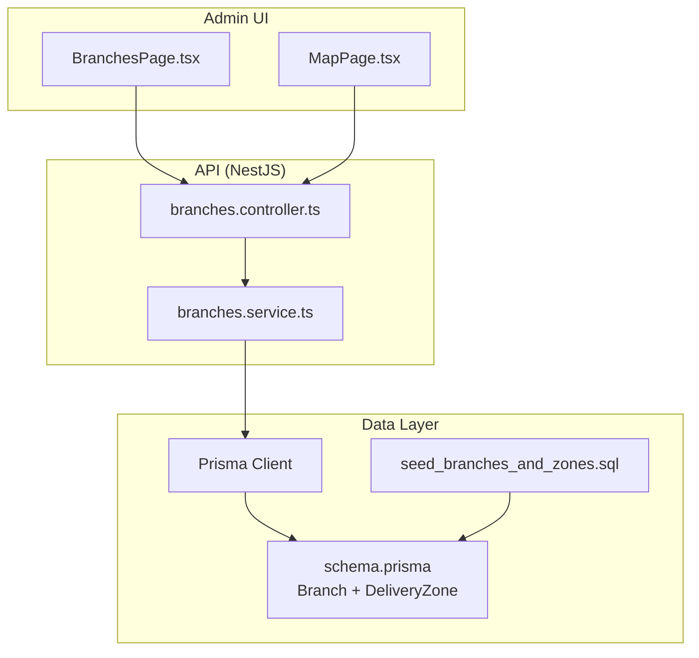
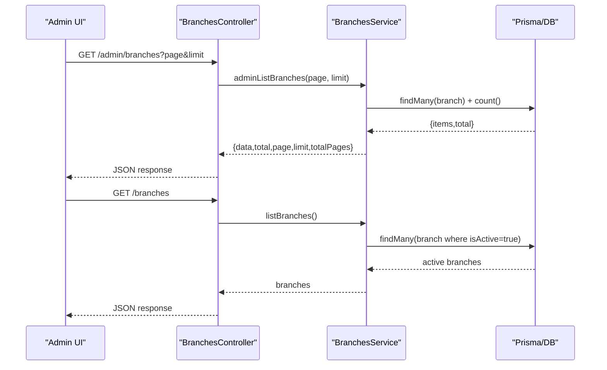
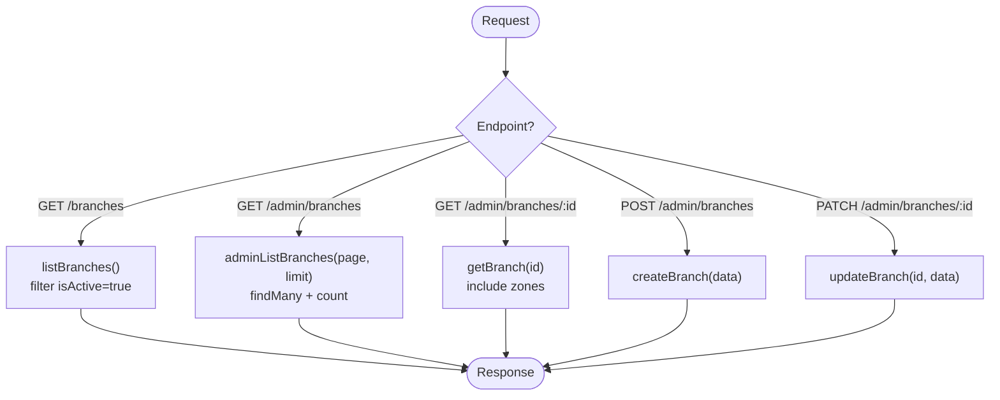
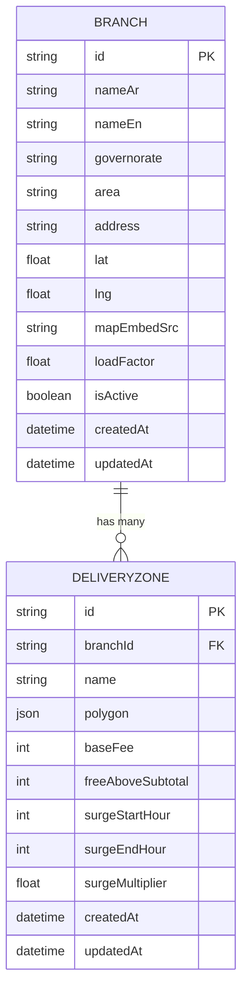
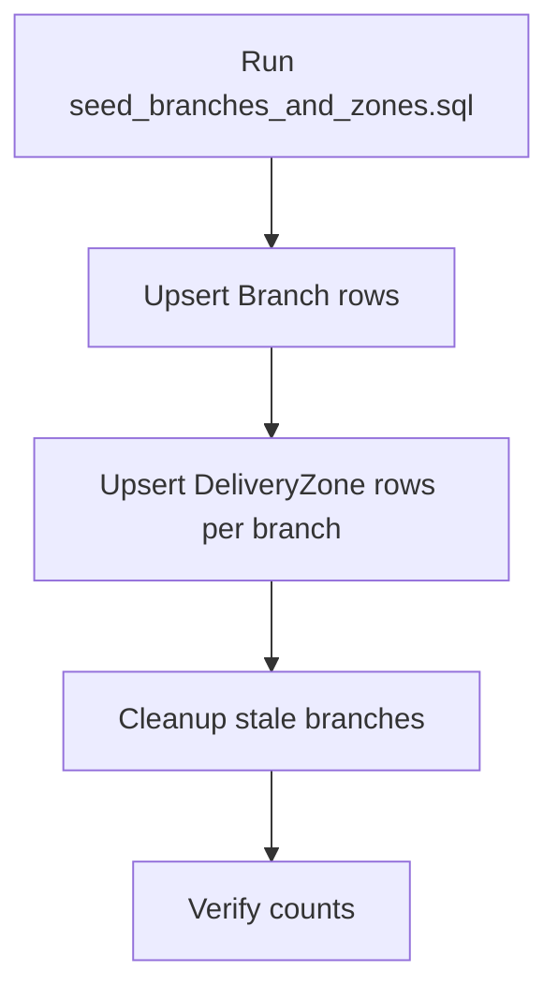
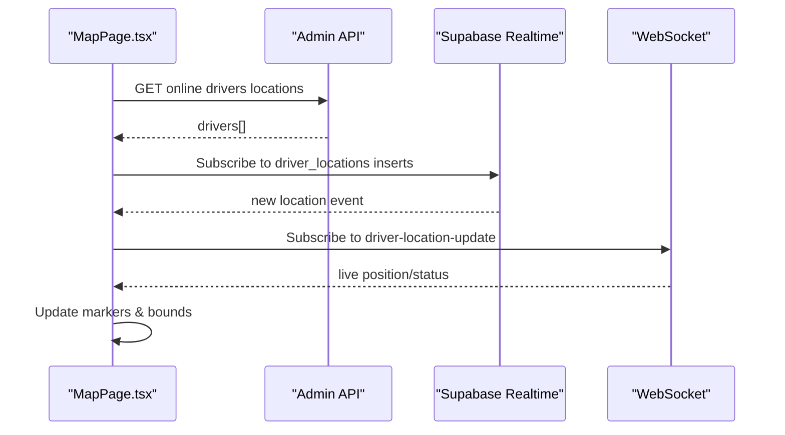
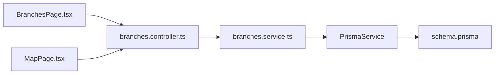

# Branch Management

<cite>
**Referenced Files in This Document**
- [branches.controller.ts](file://apps/api/src/modules/branches/branches.controller.ts)
- [branches.service.ts](file://apps/api/src/modules/branches/branches.service.ts)
- [schema.prisma](file://apps/api/prisma/schema.prisma)
- [seed_branches_and_zones.sql](file://database/seed_branches_and_zones.sql)
- [BranchesPage.tsx](file://apps/admin/src/pages/BranchesPage.tsx)
- [MapPage.tsx](file://apps/admin/src/pages/MapPage.tsx)
</cite>

## Table of Contents
1. Introduction
2. Project Structure
3. Core Components
4. Architecture Overview
5. Detailed Component Analysis
6. Dependency Analysis
7. Performance Considerations
8. Troubleshooting Guide
9. Conclusion

## Introduction
This document explains branch management and location services across the system. It covers branch CRUD operations, geographic mapping integration, service area configuration via delivery zones, and how admin interfaces visualize branches and drivers. It also outlines where distance calculations and delivery zone definitions are modeled, and identifies opportunities for extending geofencing and location-based ordering rules.

## Project Structure
The branch feature spans API controllers/services, a Prisma data model, seed data for initial branches and zones, and admin UI pages for listing and mapping.

**Diagram sources**
- [branches.controller.ts:1-40](file://apps/api/src/modules/branches/branches.controller.ts#L1-L40)
- [branches.service.ts:1-57](file://apps/api/src/modules/branches/branches.service.ts#L1-L57)
- [schema.prisma:765-803](file://apps/api/prisma/schema.prisma#L765-L803)
- [seed_branches_and_zones.sql:1-127](file://database/seed_branches_and_zones.sql#L1-L127)
- [BranchesPage.tsx:1-31](file://apps/admin/src/pages/BranchesPage.tsx#L1-L31)
- [MapPage.tsx:1-262](file://apps/admin/src/pages/MapPage.tsx#L1-L262)

**Section sources**
- [branches.controller.ts:1-40](file://apps/api/src/modules/branches/branches.controller.ts#L1-L40)
- [branches.service.ts:1-57](file://apps/api/src/modules/branches/branches.service.ts#L1-L57)
- [schema.prisma:765-803](file://apps/api/prisma/schema.prisma#L765-L803)
- [seed_branches_and_zones.sql:1-127](file://database/seed_branches_and_zones.sql#L1-L127)
- [BranchesPage.tsx:1-31](file://apps/admin/src/pages/BranchesPage.tsx#L1-L31)
- [MapPage.tsx:1-262](file://apps/admin/src/pages/MapPage.tsx#L1-L262)

## Core Components
- BranchesController exposes public and admin endpoints for listing and managing branches. Admin endpoints are guarded by an admin guard.
- BranchesService implements list, paginated admin list, get-by-id (with related zones), create, and update operations using Prisma.
- Data model defines Branch with coordinates and map embed source, and DeliveryZone linked to a branch with polygon, fees, and surge pricing windows.
- Seed script initializes five Cairo branches and one primary delivery zone per branch with polygons and fee settings.
- Admin BranchesPage fetches and displays branch data via the admin API.
- Admin MapPage renders a Leaflet/OpenStreetMap map and shows real-time driver locations; it demonstrates the mapping stack used for visual management.

**Section sources**
- [branches.controller.ts:1-40](file://apps/api/src/modules/branches/branches.controller.ts#L1-L40)
- [branches.service.ts:1-57](file://apps/api/src/modules/branches/branches.service.ts#L1-L57)
- [schema.prisma:765-803](file://apps/api/prisma/schema.prisma#L765-L803)
- [seed_branches_and_zones.sql:1-127](file://database/seed_branches_and_zones.sql#L1-L127)
- [BranchesPage.tsx:1-31](file://apps/admin/src/pages/BranchesPage.tsx#L1-L31)
- [MapPage.tsx:1-262](file://apps/admin/src/pages/MapPage.tsx#L1-L262)

## Architecture Overview
End-to-end flow for branch management and mapping:

**Diagram sources**
- [branches.controller.ts:9-38](file://apps/api/src/modules/branches/branches.controller.ts#L9-L38)
- [branches.service.ts:8-33](file://apps/api/src/modules/branches/branches.service.ts#L8-L33)

## Detailed Component Analysis

### Branches API (CRUD)
- Public list: returns only active branches sorted by English name.
- Admin list: paginated with total counts and page metadata.
- Get by id: includes related delivery zones; throws not found if missing.
- Create/Update: pass-through to Prisma with provided payload.

**Diagram sources**
- [branches.controller.ts:9-38](file://apps/api/src/modules/branches/branches.controller.ts#L9-L38)
- [branches.service.ts:8-55](file://apps/api/src/modules/branches/branches.service.ts#L8-L55)

**Section sources**
- [branches.controller.ts:9-38](file://apps/api/src/modules/branches/branches.controller.ts#L9-L38)
- [branches.service.ts:8-55](file://apps/api/src/modules/branches/branches.service.ts#L8-L55)

### Data Model: Branch and DeliveryZone
- Branch stores location (lat/lng), address, names, governorate, area, map embed source, load factor, and active flag.
- DeliveryZone is tied to a branch and holds a polygon (JSON), base fee, free delivery threshold, and surge pricing hours/multiplier.

**Diagram sources**
- [schema.prisma:765-803](file://apps/api/prisma/schema.prisma#L765-L803)

**Section sources**
- [schema.prisma:765-803](file://apps/api/prisma/schema.prisma#L765-L803)

### Seed Data: Initial Branches and Zones
- Seeds five branches in Cairo with coordinates and map embed sources.
- Seeds one primary delivery zone per branch with hand-drawn or bounding-box polygons, base fees, free delivery thresholds, and surge windows.

**Diagram sources**
- [seed_branches_and_zones.sql:1-127](file://database/seed_branches_and_zones.sql#L1-L127)

**Section sources**
- [seed_branches_and_zones.sql:1-127](file://database/seed_branches_and_zones.sql#L1-L127)

### Admin UI: Branch Listing
- Fetches paginated branches from the admin endpoint and renders results with loading and error states.

**Section sources**
- [BranchesPage.tsx:1-31](file://apps/admin/src/pages/BranchesPage.tsx#L1-L31)

### Admin UI: Mapping and Real-Time Locations
- Uses Leaflet with OpenStreetMap tiles to render markers and fit bounds around visible entities.
- Demonstrates real-time updates via Supabase realtime and WebSocket events for driver locations and status changes.
- Provides filtering and selection UX for operational visibility.

**Diagram sources**
- [MapPage.tsx:75-141](file://apps/admin/src/pages/MapPage.tsx#L75-L141)
- [MapPage.tsx:147-211](file://apps/admin/src/pages/MapPage.tsx#L147-L211)

**Section sources**
- [MapPage.tsx:1-262](file://apps/admin/src/pages/MapPage.tsx#L1-L262)

## Dependency Analysis
- BranchesController depends on BranchesService and an admin guard for protected routes.
- BranchesService depends on PrismaService and queries the Branch and DeliveryZone models.
- Admin UI depends on API endpoints and uses Leaflet/OpenStreetMap for mapping; MapPage also integrates Supabase realtime and WebSocket for live updates.

**Diagram sources**
- [branches.controller.ts:1-40](file://apps/api/src/modules/branches/branches.controller.ts#L1-L40)
- [branches.service.ts:1-57](file://apps/api/src/modules/branches/branches.service.ts#L1-L57)
- [schema.prisma:765-803](file://apps/api/prisma/schema.prisma#L765-L803)
- [BranchesPage.tsx:1-31](file://apps/admin/src/pages/BranchesPage.tsx#L1-L31)
- [MapPage.tsx:1-262](file://apps/admin/src/pages/MapPage.tsx#L1-L262)

**Section sources**
- [branches.controller.ts:1-40](file://apps/api/src/modules/branches/branches.controller.ts#L1-L40)
- [branches.service.ts:1-57](file://apps/api/src/modules/branches/branches.service.ts#L1-L57)
- [schema.prisma:765-803](file://apps/api/prisma/schema.prisma#L765-L803)
- [BranchesPage.tsx:1-31](file://apps/admin/src/pages/BranchesPage.tsx#L1-L31)
- [MapPage.tsx:1-262](file://apps/admin/src/pages/MapPage.tsx#L1-L262)

## Performance Considerations
- Pagination: Admin list uses skip/take and a separate count query to compute pagination metadata efficiently.
- Filtering: Public list filters by active status to reduce dataset size.
- Mapping: Fit-bounds calculation is performed client-side on filtered driver sets to avoid unnecessary re-renders.
- Realtime: Subscriptions are added once and cleaned up on unmount to prevent memory leaks.

[No sources needed since this section provides general guidance]

## Troubleshooting Guide
- Not Found when fetching a single branch: The service throws a not found exception if the branch does not exist. Ensure the id exists before requesting details.
- Empty admin list: Verify seed data has been run so that branches and zones exist.
- Map shows no markers: Confirm driver locations are being posted and that realtime/WebSocket subscriptions are established; check network and permissions.

**Section sources**
- [branches.service.ts:35-41](file://apps/api/src/modules/branches/branches.service.ts#L35-L41)
- [seed_branches_and_zones.sql:1-127](file://database/seed_branches_and_zones.sql#L1-L127)
- [MapPage.tsx:85-141](file://apps/admin/src/pages/MapPage.tsx#L85-L141)

## Conclusion
The branch management layer provides robust CRUD operations with clear separation between public and admin endpoints, backed by a well-structured data model for branches and delivery zones. The admin UI supports both tabular management and interactive mapping with real-time updates. To extend the system, consider adding:
- Distance calculations and routing integrations for delivery fees and ETAs.
- Geofencing logic to enforce location-based ordering rules and eligibility checks against DeliveryZone polygons.
- Branch-specific operating hours and staff assignment tables to control availability and fulfillment capacity per location.
- Analytics endpoints to report sales, performance, and inventory distribution per branch.

[No sources needed since this section summarizes without analyzing specific files]