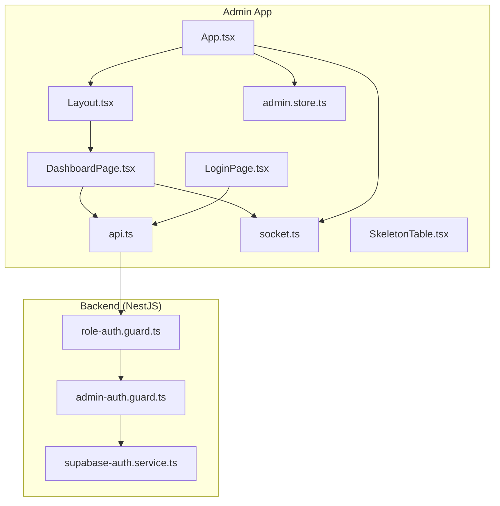
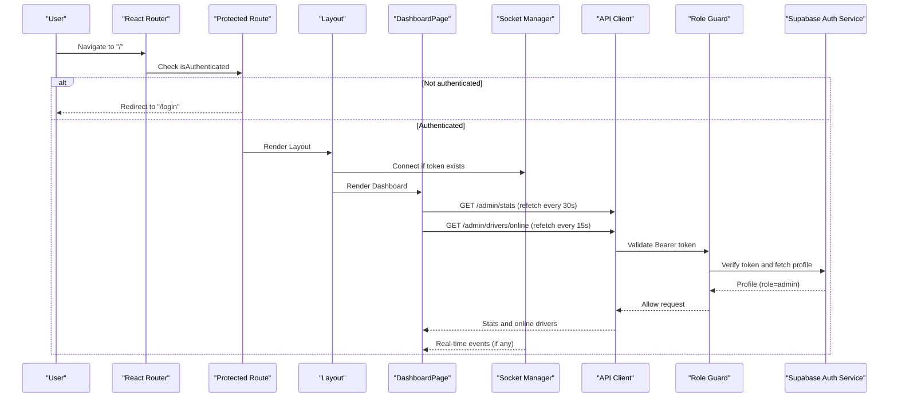
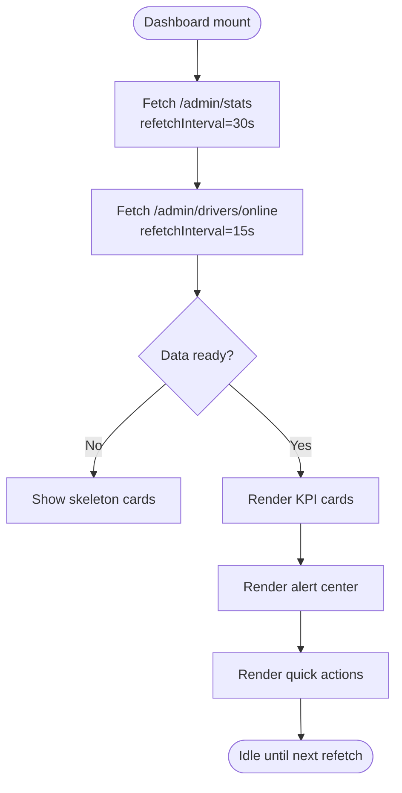
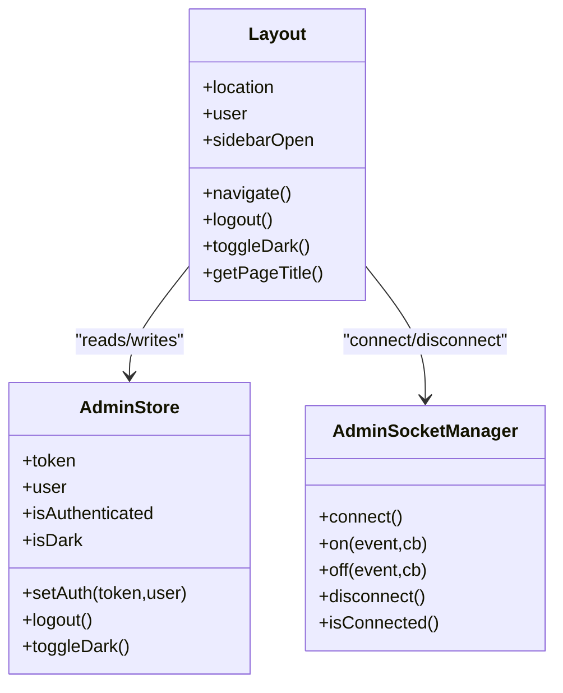
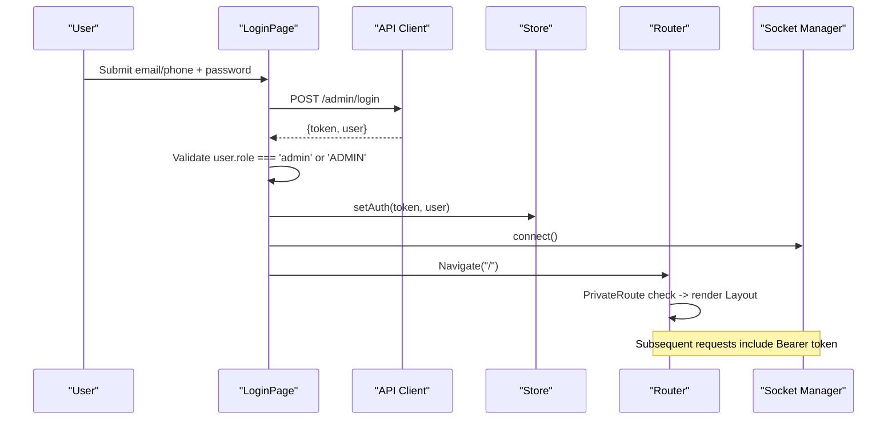
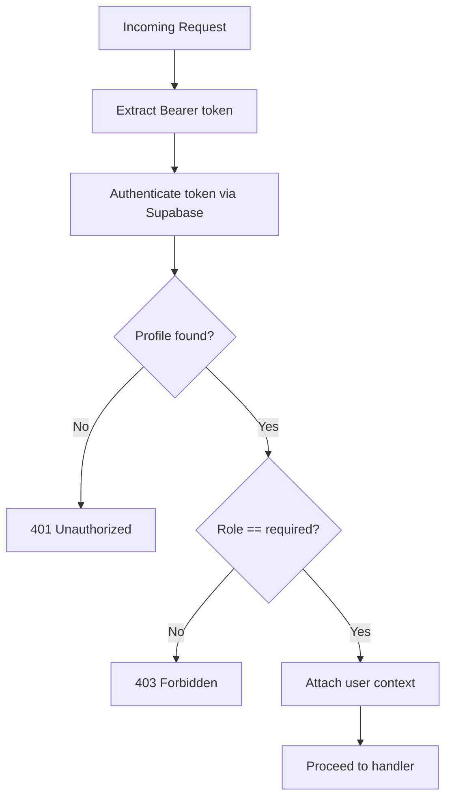
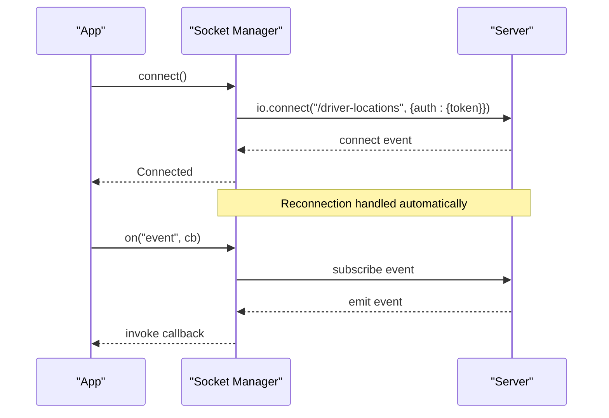
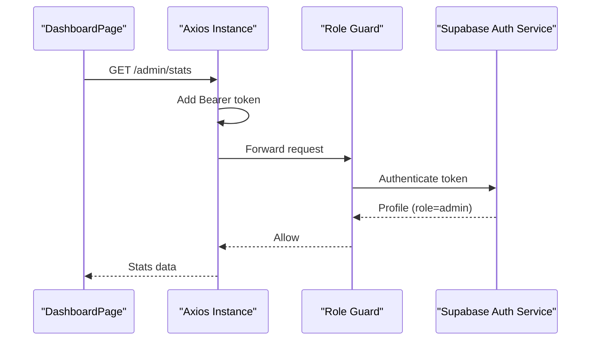
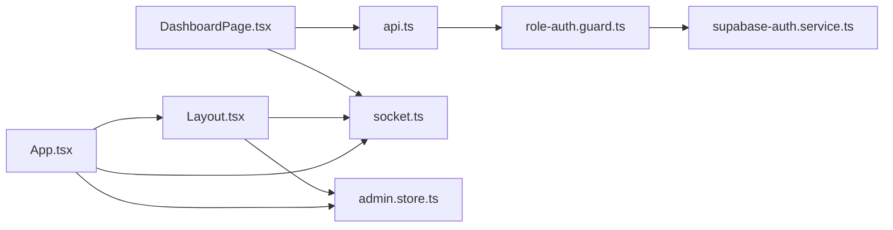

# Dashboard Overview

<cite>
**Referenced Files in This Document**
- [DashboardPage.tsx](file://apps/admin/src/pages/DashboardPage.tsx)
- [Layout.tsx](file://apps/admin/src/components/Layout.tsx)
- [admin.store.ts](file://apps/admin/src/stores/admin.store.ts)
- [socket.ts](file://apps/admin/src/lib/socket.ts)
- [api.ts](file://apps/admin/src/lib/api.ts)
- [LoginPage.tsx](file://apps/admin/src/pages/LoginPage.tsx)
- [App.tsx](file://apps/admin/src/App.tsx)
- [SkeletonTable.tsx](file://apps/admin/src/components/SkeletonTable.tsx)
- [role-auth.guard.ts](file://apps/api/src/auth/role-auth.guard.ts)
- [admin-auth.guard.ts](file://apps/api/src/auth/admin-auth.guard.ts)
- [supabase-auth.service.ts](file://apps/api/src/auth/supabase-auth.service.ts)
</cite>

## Table of Contents
1. Introduction
2. Project Structure
3. Core Components
4. Architecture Overview
5. Detailed Component Analysis
6. Dependency Analysis
7. Performance Considerations
8. Troubleshooting Guide
9. Conclusion

## Introduction
This document explains the Admin Dashboard overview and main layout for the United Pharmacy admin application. It covers role-based access control, navigation structure, real-time monitoring capabilities, key metrics display, recent activity feeds, quick actions, layout component structure, sidebar navigation, responsive design patterns, authentication flow integration, user session management, security considerations, backend API integrations for real-time data updates, and performance optimization strategies.

## Project Structure
The admin dashboard is a React application with:
- A protected root route that renders a Layout containing a sidebar, top bar, and page content via React Router.
- A Dashboard page that displays KPI cards, an alert center, and quick action links to other admin sections.
- A global store for authentication state and theme preferences.
- An HTTP client with interceptors for token injection and 401 handling.
- A Socket.IO manager for real-time driver location events.
- Backend guards enforcing admin-only access on API endpoints.

**Diagram sources**
- [App.tsx:20-63](file://apps/admin/src/App.tsx#L20-L63)
- [Layout.tsx:15-156](file://apps/admin/src/components/Layout.tsx#L15-L156)
- [DashboardPage.tsx:41-139](file://apps/admin/src/pages/DashboardPage.tsx#L41-L139)
- [admin.store.ts:12-45](file://apps/admin/src/stores/admin.store.ts#L12-L45)
- [api.ts:6-89](file://apps/admin/src/lib/api.ts#L6-L89)
- [socket.ts:6-60](file://apps/admin/src/lib/socket.ts#L6-L60)
- [LoginPage.tsx:8-41](file://apps/admin/src/pages/LoginPage.tsx#L8-L41)
- [SkeletonTable.tsx:8-42](file://apps/admin/src/components/SkeletonTable.tsx#L8-L42)
- [role-auth.guard.ts:5-36](file://apps/api/src/auth/role-auth.guard.ts#L5-L36)
- [admin-auth.guard.ts:5-9](file://apps/api/src/auth/admin-auth.guard.ts#L5-L9)
- [supabase-auth.service.ts:11-64](file://apps/api/src/auth/supabase-auth.service.ts#L11-L64)

**Section sources**
- [App.tsx:20-63](file://apps/admin/src/App.tsx#L20-L63)
- [Layout.tsx:15-156](file://apps/admin/src/components/Layout.tsx#L15-L156)
- [DashboardPage.tsx:41-139](file://apps/admin/src/pages/DashboardPage.tsx#L41-L139)
- [admin.store.ts:12-45](file://apps/admin/src/stores/admin.store.ts#L12-L45)
- [api.ts:6-89](file://apps/admin/src/lib/api.ts#L6-L89)
- [socket.ts:6-60](file://apps/admin/src/lib/socket.ts#L6-L60)
- [LoginPage.tsx:8-41](file://apps/admin/src/pages/LoginPage.tsx#L8-L41)
- [SkeletonTable.tsx:8-42](file://apps/admin/src/components/SkeletonTable.tsx#L8-L42)
- [role-auth.guard.ts:5-36](file://apps/api/src/auth/role-auth.guard.ts#L5-L36)
- [admin-auth.guard.ts:5-9](file://apps/api/src/auth/admin-auth.guard.ts#L5-L9)
- [supabase-auth.service.ts:11-64](file://apps/api/src/auth/supabase-auth.service.ts#L11-L64)

## Core Components
- Protected routing and layout orchestration: The app wraps all routes under a private route guard that redirects unauthenticated users to login. The Layout provides a collapsible sidebar, top bar, and page outlet.
- Dashboard page: Displays KPIs (online drivers, active deliveries, today’s deliveries, revenue), an alert center, and quick action links to relevant pages. Data is fetched via React Query with periodic refetch intervals.
- Authentication store: Persists token, user profile, and theme preference; exposes setAuth and logout.
- HTTP client: Axios instance with request/response interceptors to attach Authorization headers and handle 401 by logging out and redirecting.
- Real-time socket: A singleton manager that connects/disconnects based on auth state and supports event subscription/unsubscription.

**Section sources**
- [App.tsx:20-63](file://apps/admin/src/App.tsx#L20-L63)
- [Layout.tsx:15-156](file://apps/admin/src/components/Layout.tsx#L15-L156)
- [DashboardPage.tsx:41-139](file://apps/admin/src/pages/DashboardPage.tsx#L41-L139)
- [admin.store.ts:12-45](file://apps/admin/src/stores/admin.store.ts#L12-L45)
- [api.ts:6-89](file://apps/admin/src/lib/api.ts#L6-L89)
- [socket.ts:6-60](file://apps/admin/src/lib/socket.ts#L6-L60)

## Architecture Overview
The dashboard integrates three primary layers:
- Frontend UI: React components and pages rendered through React Router.
- State and services: Zustand store for auth/theme, axios for REST, and Socket.IO for real-time events.
- Backend security and APIs: NestJS guards enforce admin roles using Supabase tokens and Prisma profiles.

**Diagram sources**
- [App.tsx:20-63](file://apps/admin/src/App.tsx#L20-L63)
- [Layout.tsx:15-156](file://apps/admin/src/components/Layout.tsx#L15-L156)
- [DashboardPage.tsx:41-139](file://apps/admin/src/pages/DashboardPage.tsx#L41-L139)
- [api.ts:6-89](file://apps/admin/src/lib/api.ts#L6-L89)
- [socket.ts:6-60](file://apps/admin/src/lib/socket.ts#L6-L60)
- [role-auth.guard.ts:5-36](file://apps/api/src/auth/role-auth.guard.ts#L5-L36)
- [supabase-auth.service.ts:11-64](file://apps/api/src/auth/supabase-auth.service.ts#L11-L64)

## Detailed Component Analysis

### Dashboard Page
- Key metrics: Online drivers, active deliveries, today’s deliveries, today’s revenue.
- Real-time behavior: Uses React Query with refetch intervals for stats and online drivers.
- Alert center: Shows system status and operational alerts.
- Quick actions: Links to Drivers, Orders, and other admin pages.
- Loading states: Skeleton cards while data loads.

**Diagram sources**
- [DashboardPage.tsx:41-139](file://apps/admin/src/pages/DashboardPage.tsx#L41-L139)
- [SkeletonTable.tsx:8-42](file://apps/admin/src/components/SkeletonTable.tsx#L8-L42)

**Section sources**
- [DashboardPage.tsx:41-139](file://apps/admin/src/pages/DashboardPage.tsx#L41-L139)
- [SkeletonTable.tsx:8-42](file://apps/admin/src/components/SkeletonTable.tsx#L8-L42)

### Layout and Navigation
- Sidebar: Collapsible with navigation items for Dashboard, Live Map, Drivers, Orders, Notifications, Marketing.
- Top bar: Toggle sidebar, page title derived from current route, notification bell, user avatar.
- User info and controls: Display user name and role, dark mode toggle, sign-out button which disconnects sockets and clears auth.
- Responsive design: Tailwind classes manage widths and visibility across screen sizes.

**Diagram sources**
- [Layout.tsx:15-156](file://apps/admin/src/components/Layout.tsx#L15-L156)
- [admin.store.ts:12-45](file://apps/admin/src/stores/admin.store.ts#L12-L45)
- [socket.ts:6-60](file://apps/admin/src/lib/socket.ts#L6-L60)

**Section sources**
- [Layout.tsx:15-156](file://apps/admin/src/components/Layout.tsx#L15-L156)
- [admin.store.ts:12-45](file://apps/admin/src/stores/admin.store.ts#L12-L45)
- [socket.ts:6-60](file://apps/admin/src/lib/socket.ts#L6-L60)

### Authentication Flow and Session Management
- Login: LoginPage validates credentials, checks role is admin, stores token and user in Zustand, connects socket, navigates to dashboard.
- Private routes: App.tsx wraps protected routes with a guard that redirects to login if not authenticated.
- Token persistence: Store persists token, user, and theme across sessions.
- Logout: Clears store and disconnects socket; redirects to login.

**Diagram sources**
- [LoginPage.tsx:8-41](file://apps/admin/src/pages/LoginPage.tsx#L8-L41)
- [api.ts:6-89](file://apps/admin/src/lib/api.ts#L6-L89)
- [admin.store.ts:12-45](file://apps/admin/src/stores/admin.store.ts#L12-L45)
- [App.tsx:20-63](file://apps/admin/src/App.tsx#L20-L63)
- [socket.ts:6-60](file://apps/admin/src/lib/socket.ts#L6-L60)

**Section sources**
- [LoginPage.tsx:8-41](file://apps/admin/src/pages/LoginPage.tsx#L8-L41)
- [App.tsx:20-63](file://apps/admin/src/App.tsx#L20-L63)
- [admin.store.ts:12-45](file://apps/admin/src/stores/admin.store.ts#L12-L45)
- [api.ts:6-89](file://apps/admin/src/lib/api.ts#L6-L89)
- [socket.ts:6-60](file://apps/admin/src/lib/socket.ts#L6-L60)

### Role-Based Access Control (RBAC)
- Backend guards: RoleAuthGuard reads Bearer token, authenticates via SupabaseAuthService, verifies required role, and attaches user context to request.
- Admin guard: Extends RoleAuthGuard to require admin role for protected endpoints.
- Security considerations: Tokens are validated server-side per request; invalid/expired tokens result in unauthorized responses; insufficient permissions result in forbidden responses.

**Diagram sources**
- [role-auth.guard.ts:5-36](file://apps/api/src/auth/role-auth.guard.ts#L5-L36)
- [admin-auth.guard.ts:5-9](file://apps/api/src/auth/admin-auth.guard.ts#L5-L9)
- [supabase-auth.service.ts:11-64](file://apps/api/src/auth/supabase-auth.service.ts#L11-L64)

**Section sources**
- [role-auth.guard.ts:5-36](file://apps/api/src/auth/role-auth.guard.ts#L5-L36)
- [admin-auth.guard.ts:5-9](file://apps/api/src/auth/admin-auth.guard.ts#L5-L9)
- [supabase-auth.service.ts:11-64](file://apps/api/src/auth/supabase-auth.service.ts#L11-L64)

### Real-Time Monitoring Capabilities
- Socket.IO connection: Established when authenticated; reconnection configured with delays and max delay.
- Event management: Centralized listener registry ensures listeners persist across reconnects.
- Integration points: Dashboard can subscribe to events (e.g., driver locations) to update UI without polling.

**Diagram sources**
- [socket.ts:6-60](file://apps/admin/src/lib/socket.ts#L6-L60)
- [App.tsx:28-38](file://apps/admin/src/App.tsx#L28-L38)

**Section sources**
- [socket.ts:6-60](file://apps/admin/src/lib/socket.ts#L6-L60)
- [App.tsx:28-38](file://apps/admin/src/App.tsx#L28-L38)

### Backend API Integrations
- REST endpoints used by dashboard:
  - GET /admin/stats for dashboard statistics.
  - GET /admin/drivers/online for online drivers count and locations.
- Interceptors:
  - Request interceptor adds Authorization header from store.
  - Response interceptor handles 401 by clearing session and redirecting to login.

**Diagram sources**
- [DashboardPage.tsx:41-139](file://apps/admin/src/pages/DashboardPage.tsx#L41-L139)
- [api.ts:6-89](file://apps/admin/src/lib/api.ts#L6-L89)
- [role-auth.guard.ts:5-36](file://apps/api/src/auth/role-auth.guard.ts#L5-L36)
- [supabase-auth.service.ts:11-64](file://apps/api/src/auth/supabase-auth.service.ts#L11-L64)

**Section sources**
- [DashboardPage.tsx:41-139](file://apps/admin/src/pages/DashboardPage.tsx#L41-L139)
- [api.ts:6-89](file://apps/admin/src/lib/api.ts#L6-L89)
- [role-auth.guard.ts:5-36](file://apps/api/src/auth/role-auth.guard.ts#L5-L36)
- [supabase-auth.service.ts:11-64](file://apps/api/src/auth/supabase-auth.service.ts#L11-L64)

## Dependency Analysis
- Component coupling:
  - DashboardPage depends on api.ts for data fetching and uses React Query for caching and refetching.
  - Layout depends on admin.store.ts for user state and theme, and socket.ts for real-time connectivity.
  - App orchestrates routing and global socket lifecycle based on authentication state.
- External dependencies:
  - Axios for HTTP with interceptors.
  - Socket.IO client for real-time events.
  - Zustand with persist middleware for state persistence.
  - React Router for navigation and route protection.

**Diagram sources**
- [DashboardPage.tsx:41-139](file://apps/admin/src/pages/DashboardPage.tsx#L41-L139)
- [Layout.tsx:15-156](file://apps/admin/src/components/Layout.tsx#L15-L156)
- [App.tsx:20-63](file://apps/admin/src/App.tsx#L20-L63)
- [api.ts:6-89](file://apps/admin/src/lib/api.ts#L6-L89)
- [socket.ts:6-60](file://apps/admin/src/lib/socket.ts#L6-L60)
- [role-auth.guard.ts:5-36](file://apps/api/src/auth/role-auth.guard.ts#L5-L36)
- [supabase-auth.service.ts:11-64](file://apps/api/src/auth/supabase-auth.service.ts#L11-L64)

**Section sources**
- [DashboardPage.tsx:41-139](file://apps/admin/src/pages/DashboardPage.tsx#L41-L139)
- [Layout.tsx:15-156](file://apps/admin/src/components/Layout.tsx#L15-L156)
- [App.tsx:20-63](file://apps/admin/src/App.tsx#L20-L63)
- [api.ts:6-89](file://apps/admin/src/lib/api.ts#L6-L89)
- [socket.ts:6-60](file://apps/admin/src/lib/socket.ts#L6-L60)
- [role-auth.guard.ts:5-36](file://apps/api/src/auth/role-auth.guard.ts#L5-L36)
- [supabase-auth.service.ts:11-64](file://apps/api/src/auth/supabase-auth.service.ts#L11-L64)

## Performance Considerations
- Data fetching strategy:
  - Use React Query refetch intervals to balance freshness and network load (stats every 30s, online drivers every 15s).
  - Prefer real-time events via Socket.IO for live updates to reduce polling frequency where applicable.
- UI responsiveness:
  - Skeleton loaders provide perceived performance during initial load.
  - Collapsible sidebar reduces visual clutter on smaller screens.
- Network efficiency:
  - Axios timeout prevents hanging requests.
  - 401 handling avoids unnecessary retries after token expiration.
- Reconnection resilience:
  - Socket.IO reconnection with exponential backoff improves stability under transient network issues.

[No sources needed since this section provides general guidance]

## Troubleshooting Guide
- Authentication failures:
  - If login fails due to invalid credentials, error messages are shown via toast notifications.
  - If role is not admin, access is denied and user remains on login.
- Unauthorized requests:
  - Any 401 response triggers logout and redirect to login via response interceptor.
- Socket connectivity:
  - Ensure token is present before connecting; connection only occurs when authenticated.
  - On logout, socket is disconnected to prevent stale connections.
- UI loading states:
  - If data queries fail or take long, skeleton placeholders maintain layout stability.

**Section sources**
- [LoginPage.tsx:8-41](file://apps/admin/src/pages/LoginPage.tsx#L8-L41)
- [api.ts:6-89](file://apps/admin/src/lib/api.ts#L6-L89)
- [socket.ts:6-60](file://apps/admin/src/lib/socket.ts#L6-L60)
- [SkeletonTable.tsx:8-42](file://apps/admin/src/components/SkeletonTable.tsx#L8-L42)

## Conclusion
The Admin Dashboard provides a secure, role-gated interface for operations oversight with real-time insights into driver availability and business metrics. Its architecture separates concerns across UI, state, networking, and backend security, enabling scalable maintenance and clear extensibility for additional features such as enhanced alerting, richer analytics, and expanded real-time capabilities.

[No sources needed since this section summarizes without analyzing specific files]