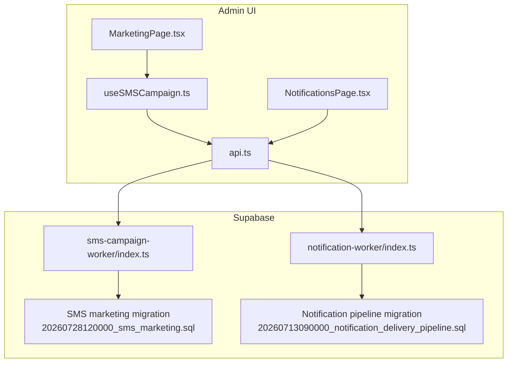
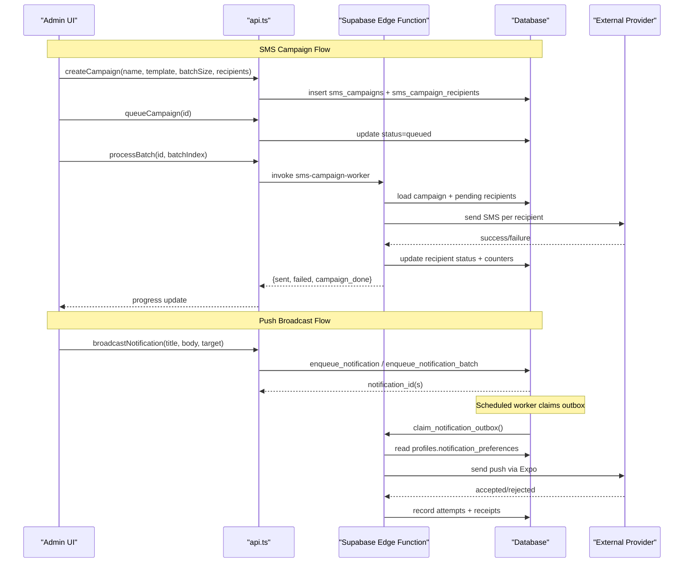
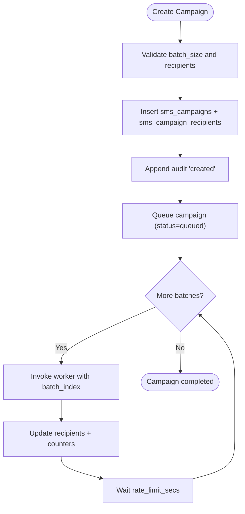
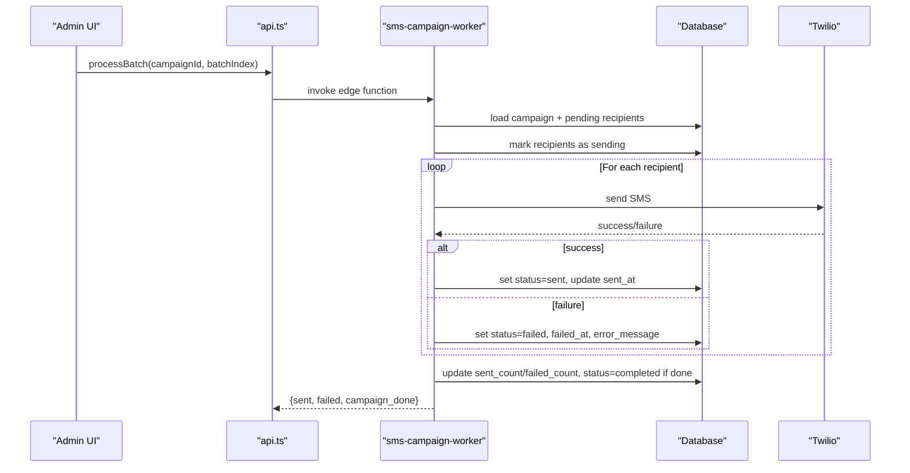
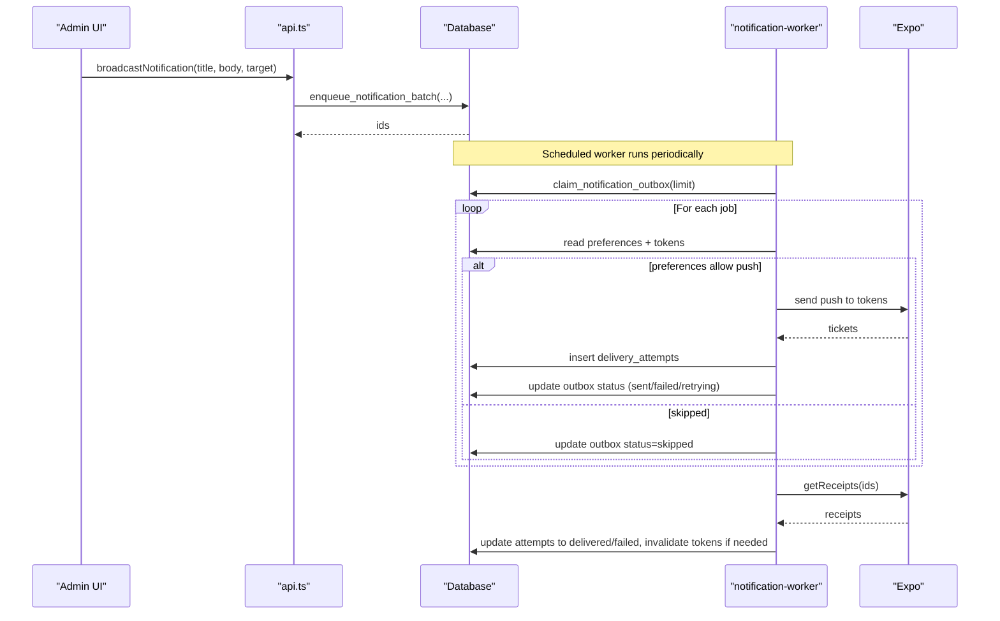
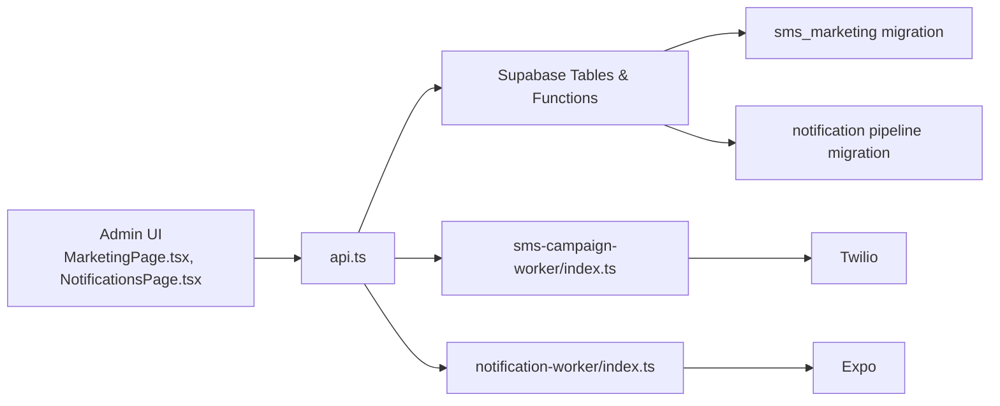

# Marketing & Notifications

<cite>
**Referenced Files in This Document**
- [index.ts](file://supabase/functions/sms-campaign-worker/index.ts)
- [index.ts](file://supabase/functions/notification-worker/index.ts)
- [20260728120000_sms_marketing.sql](file://supabase/migrations/20260728120000_sms_marketing.sql)
- [20260713090000_notification_delivery_pipeline.sql](file://supabase/migrations/20260713090000_notification_delivery_pipeline.sql)
- [MarketingPage.tsx](file://apps/admin/src/pages/MarketingPage.tsx)
- [useSMSCampaign.ts](file://apps/admin/src/hooks/useSMSCampaign.ts)
- [api.ts](file://apps/admin/src/lib/api.ts)
- [NotificationsPage.tsx](file://apps/admin/src/pages/NotificationsPage.tsx)
</cite>

## Table of Contents
1. Introduction
2. Project Structure
3. Core Components
4. Architecture Overview
5. Detailed Component Analysis
6. Dependency Analysis
7. Performance Considerations
8. Troubleshooting Guide
9. Conclusion

## Introduction
This document explains the marketing campaign and notification systems implemented in the repository. It covers SMS campaign creation, recipient targeting, message scheduling, push notification management, broadcast messaging, user preference handling, analytics and audit logging, template constraints, compliance considerations, and integration with external messaging providers. It also clarifies rate limiting and retry strategies used by the workers.

## Project Structure
The system spans three layers:
- Admin UI: interfaces for creating SMS campaigns, selecting recipients, launching batches, viewing progress, and broadcasting push notifications to drivers.
- Supabase Edge Functions: background workers that process SMS batches and deliver push notifications via Expo.
- Database schema and migrations: tables and functions that enforce consent, state machines, idempotency, and delivery tracking.

**Diagram sources**
- [MarketingPage.tsx:1-660](file://apps/admin/src/pages/MarketingPage.tsx#L1-L660)
- [useSMSCampaign.ts:1-193](file://apps/admin/src/hooks/useSMSCampaign.ts#L1-L193)
- [api.ts:1-347](file://apps/admin/src/lib/api.ts#L1-L347)
- [index.ts:1-306](file://supabase/functions/sms-campaign-worker/index.ts#L1-L306)
- [index.ts:1-127](file://supabase/functions/notification-worker/index.ts#L1-L127)
- [20260728120000_sms_marketing.sql:1-259](file://supabase/migrations/20260728120000_sms_marketing.sql#L1-L259)
- [20260713090000_notification_delivery_pipeline.sql:1-94](file://supabase/migrations/20260713090000_notification_delivery_pipeline.sql#L1-L94)

**Section sources**
- [MarketingPage.tsx:1-660](file://apps/admin/src/pages/MarketingPage.tsx#L1-L660)
- [useSMSCampaign.ts:1-193](file://apps/admin/src/hooks/useSMSCampaign.ts#L1-L193)
- [api.ts:1-347](file://apps/admin/src/lib/api.ts#L1-L347)
- [index.ts:1-306](file://supabase/functions/sms-campaign-worker/index.ts#L1-L306)
- [index.ts:1-127](file://supabase/functions/notification-worker/index.ts#L1-L127)
- [20260728120000_sms_marketing.sql:1-259](file://supabase/migrations/20260728120000_sms_marketing.sql#L1-L259)
- [20260713090000_notification_delivery_pipeline.sql:1-94](file://supabase/migrations/20260713090000_notification_delivery_pipeline.sql#L1-L94)

## Core Components
- SMS Campaign Worker: processes one batch per invocation, sends messages via an external provider (Twilio), updates recipient statuses, and records audit events.
- Notification Worker: claims outbox jobs, respects user preferences, delivers push via Expo, tracks delivery attempts and receipts, and retries with exponential backoff.
- Admin UI:
  - SMS Marketing Page: target selection, campaign creation, launch flow with rate-limited batching, progress tracking, and audit log view.
  - Notifications Page: compose and send broadcast notifications to drivers; view recent broadcasts.
- API Layer:
  - Direct Supabase RPCs and Edge Function invocations for marketing operations.
  - HTTP endpoints for driver notifications (broadcast and history).

Key capabilities present in code:
- SMS campaign lifecycle: draft → queued → running → completed/failed/cancelled.
- Recipient targeting: zero-order customers, optional consent-only filter, search and sort.
- Message scheduling: caller-controlled batch cadence using campaign rate_limit_secs.
- Push notifications: outbox-based delivery with idempotency, retry, and receipt tracking.
- User preferences: push channel and category toggles respected by worker.
- Analytics and audit: per-campaign counters and append-only audit logs; delivery attempt records for push.

**Section sources**
- [index.ts:1-306](file://supabase/functions/sms-campaign-worker/index.ts#L1-L306)
- [index.ts:1-127](file://supabase/functions/notification-worker/index.ts#L1-L127)
- [MarketingPage.tsx:1-660](file://apps/admin/src/pages/MarketingPage.tsx#L1-L660)
- [useSMSCampaign.ts:1-193](file://apps/admin/src/hooks/useSMSCampaign.ts#L1-L193)
- [api.ts:1-347](file://apps/admin/src/lib/api.ts#L1-L347)
- [NotificationsPage.tsx:1-208](file://apps/admin/src/pages/NotificationsPage.tsx#L1-L208)
- [20260728120000_sms_marketing.sql:1-259](file://supabase/migrations/20260728120000_sms_marketing.sql#L1-L259)
- [20260713090000_notification_delivery_pipeline.sql:1-94](file://supabase/migrations/20260713090000_notification_delivery_pipeline.sql#L1-L94)

## Architecture Overview
End-to-end flows for SMS and push notifications are shown below.

**Diagram sources**
- [api.ts:147-328](file://apps/admin/src/lib/api.ts#L147-L328)
- [index.ts:140-306](file://supabase/functions/sms-campaign-worker/index.ts#L140-L306)
- [index.ts:37-127](file://supabase/functions/notification-worker/index.ts#L37-L127)
- [20260713090000_notification_delivery_pipeline.sql:50-94](file://supabase/migrations/20260713090000_notification_delivery_pipeline.sql#L50-L94)

## Detailed Component Analysis

### SMS Campaign Creation and Targeting
- Targeting:
  - Uses a database function to return eligible users: role = customer, zero completed orders, optional consent-only filter, search on name/phone, sorting options.
  - Admin UI presents paginated results with filters and selection controls.
- Campaign creation:
  - Validates batch size (100 or 200) and exact recipient count.
  - Creates campaign row and recipient rows (batch_index = 0 for single-batch campaigns).
  - Writes initial audit entry.
- Launch and scheduling:
  - Queue transitions campaign to queued.
  - UI launches batches sequentially, waiting rate_limit_secs between batches.
  - Worker processes exactly one batch per call, marking recipients sending → sent/failed and updating campaign counters.

**Diagram sources**
- [api.ts:170-305](file://apps/admin/src/lib/api.ts#L170-L305)
- [useSMSCampaign.ts:71-119](file://apps/admin/src/hooks/useSMSCampaign.ts#L71-L119)
- [index.ts:183-281](file://supabase/functions/sms-campaign-worker/index.ts#L183-L281)
- [20260728120000_sms_marketing.sql:160-259](file://supabase/migrations/20260728120000_sms_marketing.sql#L160-L259)

**Section sources**
- [20260728120000_sms_marketing.sql:35-138](file://supabase/migrations/20260728120000_sms_marketing.sql#L35-L138)
- [20260728120000_sms_marketing.sql:160-259](file://supabase/migrations/20260728120000_sms_marketing.sql#L160-L259)
- [api.ts:147-305](file://apps/admin/src/lib/api.ts#L147-L305)
- [useSMSCampaign.ts:19-119](file://apps/admin/src/hooks/useSMSCampaign.ts#L19-L119)
- [MarketingPage.tsx:125-233](file://apps/admin/src/pages/MarketingPage.tsx#L125-L233)

### SMS Delivery Worker
- Authentication and authorization:
  - Requires valid Supabase JWT; checks admin/manager role before processing.
- Batch processing:
  - Loads pending recipients for a given batch_index and campaign.
  - Marks recipients as sending, then iterates to send each SMS.
- External provider integration:
  - Sends via Twilio REST API when credentials are configured; otherwise runs in no-op mode for staging.
  - Normalizes phone numbers before sending.
- State updates and auditing:
  - Updates recipient status to sent or failed with timestamps and error messages.
  - Increments campaign counters and marks completed when all processed.
  - Appends audit entries for batch start/completion and final completion.

**Diagram sources**
- [index.ts:140-306](file://supabase/functions/sms-campaign-worker/index.ts#L140-L306)
- [api.ts:295-305](file://apps/admin/src/lib/api.ts#L295-L305)

**Section sources**
- [index.ts:60-136](file://supabase/functions/sms-campaign-worker/index.ts#L60-L136)
- [index.ts:140-306](file://supabase/functions/sms-campaign-worker/index.ts#L140-L306)

### Push Notification Management and Broadcast
- Outbox model:
  - Enqueue functions create notifications and corresponding outbox rows with idempotency keys.
  - Workers claim jobs safely using SKIP LOCKED and lock them briefly while processing.
- Preferences and categories:
  - Worker reads profile notification preferences; skips push if disabled or category opted out.
- Delivery and retries:
  - Sends push via Expo to active device tokens; records delivery attempts with ticket IDs.
  - Polls receipts to mark delivered or failed; invalidates tokens on DeviceNotRegistered.
  - Retries with exponential backoff up to a maximum attempt limit.
- Admin broadcast:
  - UI composes title/body and target (all or online drivers); calls backend endpoint to enqueue.
  - Displays recent broadcasts with counts.

**Diagram sources**
- [20260713090000_notification_delivery_pipeline.sql:50-94](file://supabase/migrations/20260713090000_notification_delivery_pipeline.sql#L50-L94)
- [index.ts:37-127](file://supabase/functions/notification-worker/index.ts#L37-L127)
- [NotificationsPage.tsx:17-49](file://apps/admin/src/pages/NotificationsPage.tsx#L17-L49)
- [api.ts:70-88](file://apps/admin/src/lib/api.ts#L70-L88)

**Section sources**
- [20260713090000_notification_delivery_pipeline.sql:1-94](file://supabase/migrations/20260713090000_notification_delivery_pipeline.sql#L1-L94)
- [index.ts:1-127](file://supabase/functions/notification-worker/index.ts#L1-L127)
- [NotificationsPage.tsx:1-208](file://apps/admin/src/pages/NotificationsPage.tsx#L1-L208)
- [api.ts:70-88](file://apps/admin/src/lib/api.ts#L70-L88)

### Template Management and Constraints
- SMS templates:
  - Stored in sms_campaigns.message_template with length constraints enforced at the database level.
  - UI enforces minimum length and character limits; shows estimated SMS count based on 160-character segments.
- Push templates:
  - Title and body are required and validated client-side; payload supports arbitrary data and action URLs.

**Section sources**
- [20260728120000_sms_marketing.sql:51-74](file://supabase/migrations/20260728120000_sms_marketing.sql#L51-L74)
- [MarketingPage.tsx:176-214](file://apps/admin/src/pages/MarketingPage.tsx#L176-L214)
- [NotificationsPage.tsx:104-133](file://apps/admin/src/pages/NotificationsPage.tsx#L104-L133)

### A/B Testing Capabilities
- The current implementation does not include built-in A/B testing for campaigns or notifications.
- Recommended approach:
  - Create separate campaigns or notifications with different content and target distinct recipient sets.
  - Compare outcomes using campaign counters and delivery attempt records.

[No sources needed since this section provides general guidance]

### Automated Notification Triggers
- The notification outbox supports programmatic enqueueing via database functions, enabling event-driven triggers from other services or database hooks.
- SMS campaigns are triggered manually from the admin UI; future automation could enqueue batches based on events.

**Section sources**
- [20260713090000_notification_delivery_pipeline.sql:50-94](file://supabase/migrations/20260713090000_notification_delivery_pipeline.sql#L50-L94)

### Integration with External Messaging Providers
- SMS:
  - Integrates with Twilio REST API when environment variables are configured; otherwise operates in no-op mode for safe staging usage.
  - Phone number normalization ensures E.164 format before sending.
- Push:
  - Integrates with Expo Push API; handles accepted/rejected responses and receipt polling.

**Section sources**
- [index.ts:75-127](file://supabase/functions/sms-campaign-worker/index.ts#L75-L127)
- [index.ts:27-35](file://supabase/functions/notification-worker/index.ts#L27-L35)

### Rate Limiting and Compliance
- Rate limiting:
  - SMS campaigns use campaign.rate_limit_secs to control pacing between batches; the worker does not sleep—caller enforces cadence.
- Compliance:
  - Profiles include marketing_consent flag; targeting can be restricted to consented users.
  - Audit logs capture key events immutably for traceability.
  - Push notifications respect user preferences and categories; invalid tokens are invalidated automatically.

**Section sources**
- [20260728120000_sms_marketing.sql:35-48](file://supabase/migrations/20260728120000_sms_marketing.sql#L35-L48)
- [20260728120000_sms_marketing.sql:120-138](file://supabase/migrations/20260728120000_sms_marketing.sql#L120-L138)
- [index.ts:21-43](file://supabase/functions/sms-campaign-worker/index.ts#L21-L43)
- [index.ts:47-65](file://supabase/functions/notification-worker/index.ts#L47-L65)

### Campaign Analytics, Open Rates, and Conversion Tracking
- SMS analytics:
  - Per-campaign sent_count and failed_count provide basic delivery metrics.
  - sms_audit_log captures detailed events for debugging and compliance.
- Push analytics:
  - notification_delivery_attempts stores provider responses and receipt status (accepted/delivered/failed).
  - Token invalidation on DeviceNotRegistered helps maintain list hygiene.
- Open rates and conversions:
  - Not explicitly tracked in the provided code. To add:
    - Use action_url payloads to track clicks and attribute to notification_id.
    - Record conversion events tied to notification_id or campaign_id in relevant business tables.

**Section sources**
- [20260728120000_sms_marketing.sql:120-138](file://supabase/migrations/20260728120000_sms_marketing.sql#L120-L138)
- [20260713090000_notification_delivery_pipeline.sql:32-46](file://supabase/migrations/20260713090000_notification_delivery_pipeline.sql#L32-L46)
- [index.ts:102-127](file://supabase/functions/notification-worker/index.ts#L102-L127)

## Dependency Analysis
High-level dependencies between components:

**Diagram sources**
- [MarketingPage.tsx:1-660](file://apps/admin/src/pages/MarketingPage.tsx#L1-L660)
- [NotificationsPage.tsx:1-208](file://apps/admin/src/pages/NotificationsPage.tsx#L1-L208)
- [api.ts:1-347](file://apps/admin/src/lib/api.ts#L1-L347)
- [index.ts:1-306](file://supabase/functions/sms-campaign-worker/index.ts#L1-L306)
- [index.ts:1-127](file://supabase/functions/notification-worker/index.ts#L1-L127)
- [20260728120000_sms_marketing.sql:1-259](file://supabase/migrations/20260728120000_sms_marketing.sql#L1-L259)
- [20260713090000_notification_delivery_pipeline.sql:1-94](file://supabase/migrations/20260713090000_notification_delivery_pipeline.sql#L1-L94)

**Section sources**
- [api.ts:1-347](file://apps/admin/src/lib/api.ts#L1-L347)
- [index.ts:1-306](file://supabase/functions/sms-campaign-worker/index.ts#L1-L306)
- [index.ts:1-127](file://supabase/functions/notification-worker/index.ts#L1-L127)

## Performance Considerations
- SMS batching:
  - Fixed batch sizes (100 or 200) reduce overhead and align with provider limits.
  - Caller-enforced rate limiting prevents provider throttling.
- Push delivery:
  - Outbox claiming uses SKIP LOCKED to avoid contention.
  - Exponential backoff reduces load on retries.
  - Receipt polling batches multiple tickets to minimize provider calls.
- Database:
  - Indexes on campaign status, recipients, and outbox queues optimize queries.
  - Row-level security policies restrict access to sensitive tables.

[No sources needed since this section provides general guidance]

## Troubleshooting Guide
Common issues and where to inspect:
- SMS campaign stuck in queued/running:
  - Verify campaign status and batch_index progression in sms_campaigns and sms_campaign_recipients.
  - Check sms_audit_log for batch_started/batch_completed events.
  - Ensure rate_limit_secs is not excessively large in the UI loop.
- SMS failures:
  - Inspect recipient error_message and failed_at timestamps.
  - Confirm Twilio credentials are set; without them, the worker runs in no-op mode.
- Push notifications not delivered:
  - Check notification_outbox status and last_error.
  - Review notification_delivery_attempts for provider errors and receipt status.
  - Validate user preferences and presence of active device tokens.
- Authorization errors:
  - SMS worker requires admin/manager role; ensure JWT is valid.
  - Notification enqueue functions enforce privileges; verify caller identity.

**Section sources**
- [index.ts:148-180](file://supabase/functions/sms-campaign-worker/index.ts#L148-L180)
- [index.ts:244-281](file://supabase/functions/sms-campaign-worker/index.ts#L244-L281)
- [index.ts:47-99](file://supabase/functions/notification-worker/index.ts#L47-L99)
- [20260713090000_notification_delivery_pipeline.sql:50-77](file://supabase/migrations/20260713090000_notification_delivery_pipeline.sql#L50-L77)

## Conclusion
The system provides robust SMS campaign management and push notification delivery with strong compliance and observability. SMS campaigns support targeted outreach with consent enforcement and immutable audit trails. Push notifications use an outbox pattern with idempotency, retries, and receipt tracking. While open rates and conversions are not yet tracked, the architecture supports extension through action URLs and event recording. Rate limiting and preference handling ensure responsible communication at scale.

[No sources needed since this section summarizes without analyzing specific files]