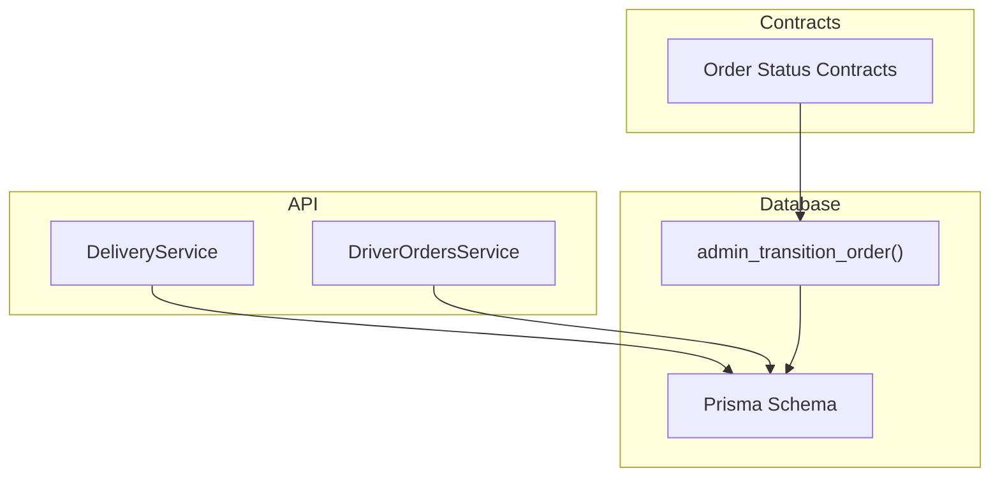
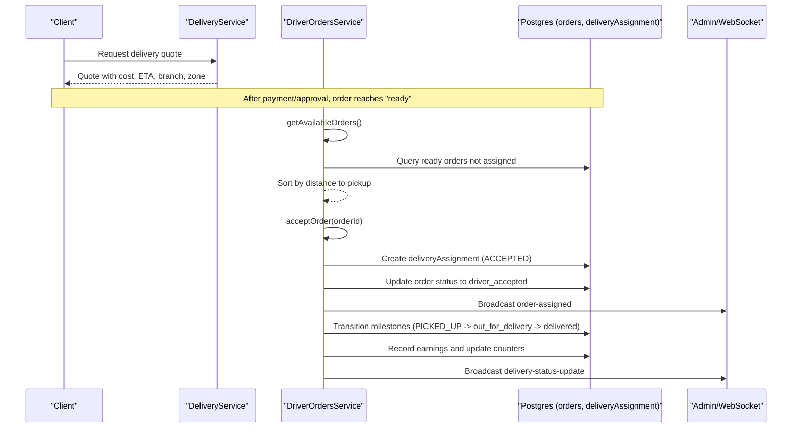
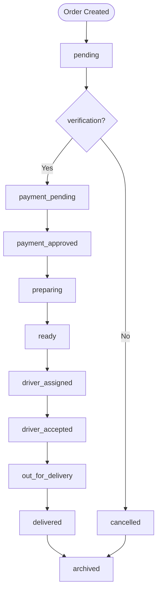
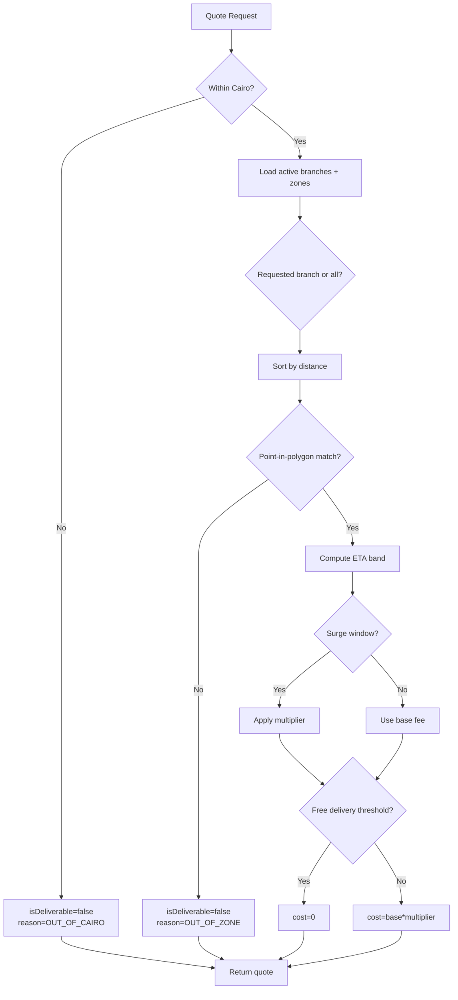
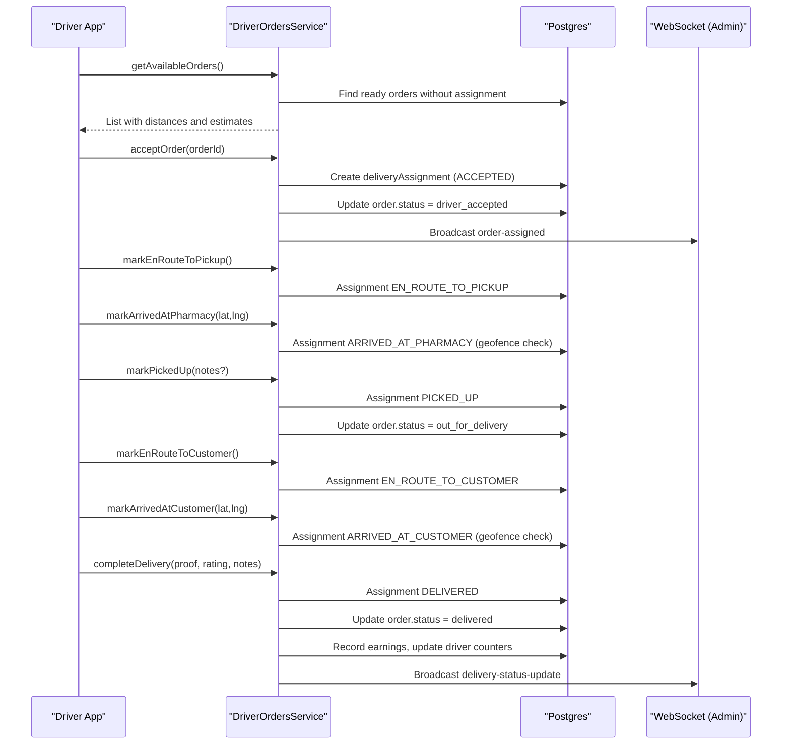
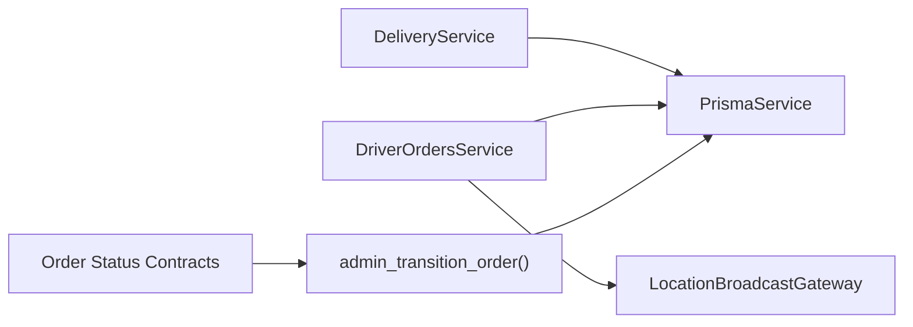

# Order Management

<cite>
**Referenced Files in This Document**
- [delivery.service.ts](file://apps/api/src/modules/delivery/delivery.service.ts)
- [driver-orders.service.ts](file://apps/api/src/modules/driver/driver-orders.service.ts)
- [orderStatus.ts](file://packages/contracts/src/orderStatus.ts)
- [20260715150000_canonical_order_lifecycle.sql](file://supabase/migrations/20260715150000_canonical_order_lifecycle.sql)
- [schema.prisma](file://apps/api/prisma/schema.prisma)
</cite>

## Table of Contents
1. Introduction
2. Project Structure
3. Core Components
4. Architecture Overview
5. Detailed Component Analysis
6. Dependency Analysis
7. Performance Considerations
8. Troubleshooting Guide
9. Conclusion

## Introduction
This document explains the order management system with a focus on the end-to-end order lifecycle, status tracking, fulfillment workflows, and integrations that power delivery operations. It covers how orders are created, modified, cancelled, and completed; how statuses transition through canonical states; how drivers are assigned and tracked; and how notifications and analytics can be derived from the underlying data model. Where applicable, it references the exact source files that implement these behaviors.

## Project Structure
The order management system spans several modules:
- Delivery quoting and zone matching logic resides in the API’s delivery service.
- Driver assignment and delivery workflow transitions are implemented in the driver module services.
- The canonical order lifecycle is defined in shared contracts and enforced by database functions.
- Data persistence and relationships are modeled via Prisma schema and Supabase migrations.

**Diagram sources**
- [delivery.service.ts:58-239](file://apps/api/src/modules/delivery/delivery.service.ts#L58-L239)
- [driver-orders.service.ts:49-621](file://apps/api/src/modules/driver/driver-orders.service.ts#L49-L621)
- [orderStatus.ts:59-168](file://packages/contracts/src/orderStatus.ts#L59-L168)
- [20260715150000_canonical_order_lifecycle.sql:16-41](file://supabase/migrations/20260715150000_canonical_order_lifecycle.sql#L16-L41)
- [schema.prisma:1-200](file://apps/api/prisma/schema.prisma#L1-L200)

**Section sources**
- [delivery.service.ts:58-239](file://apps/api/src/modules/delivery/delivery.service.ts#L58-L239)
- [driver-orders.service.ts:49-621](file://apps/api/src/modules/driver/driver-orders.service.ts#L49-L621)
- [orderStatus.ts:59-168](file://packages/contracts/src/orderStatus.ts#L59-L168)
- [20260715150000_canonical_order_lifecycle.sql:16-41](file://supabase/migrations/20260715150000_canonical_order_lifecycle.sql#L16-L41)
- [schema.prisma:1-200](file://apps/api/prisma/schema.prisma#L1-L200)

## Core Components
- Delivery Service: Computes delivery quotes, matches zones, calculates ETAs, and determines deliverability based on location and branch zones.
- Driver Orders Service: Manages driver-side workflows including available orders, acceptance/rejection, pickup/delivery milestones, completion, and earnings recording.
- Order Status Contracts: Define canonical statuses, labels, normalization, and allowed transitions for orders across the platform.
- Database Lifecycle Function: Enforces role-based transitions and writes audit timestamps to ensure consistent state changes.

Key responsibilities:
- Quoting and ETA calculation for deliveries.
- Driver assignment and milestone-driven fulfillment.
- Canonical status definitions and enforcement.
- Transactional updates to orders and assignments.

**Section sources**
- [delivery.service.ts:58-239](file://apps/api/src/modules/delivery/delivery.service.ts#L58-L239)
- [driver-orders.service.ts:49-621](file://apps/api/src/modules/driver/driver-orders.service.ts#L49-L621)
- [orderStatus.ts:59-168](file://packages/contracts/src/orderStatus.ts#L59-L168)
- [20260715150000_canonical_order_lifecycle.sql:16-41](file://supabase/migrations/20260715150000_canonical_order_lifecycle.sql#L16-L41)

## Architecture Overview
The system enforces a canonical order lifecycle with strict transitions. Drivers interact with orders after they reach “ready,” where assignments are created and milestones are recorded. Delivery quoting ensures customers are served by appropriate branches within supported zones.

**Diagram sources**
- [delivery.service.ts:58-239](file://apps/api/src/modules/delivery/delivery.service.ts#L58-L239)
- [driver-orders.service.ts:79-295](file://apps/api/src/modules/driver/driver-orders.service.ts#L79-L295)
- [driver-orders.service.ts:382-510](file://apps/api/src/modules/driver/driver-orders.service.ts#L382-L510)
- [20260715150000_canonical_order_lifecycle.sql:16-41](file://supabase/migrations/20260715150000_canonical_order_lifecycle.sql#L16-L41)

## Detailed Component Analysis

### Order Lifecycle and Status Transitions
The canonical lifecycle defines a single source of truth for order states and their allowed transitions. A database function enforces transitions with role checks and updates timestamps for auditability.

- Allowed transitions are centrally defined and validated both in contracts and enforced by the database function.
- Terminal states include delivered and cancelled; archived is a final archival step.

**Diagram sources**
- [orderStatus.ts:59-168](file://packages/contracts/src/orderStatus.ts#L59-L168)
- [20260715150000_canonical_order_lifecycle.sql:16-41](file://supabase/migrations/20260715150000_canonical_order_lifecycle.sql#L16-L41)

**Section sources**
- [orderStatus.ts:59-168](file://packages/contracts/src/orderStatus.ts#L59-L168)
- [20260715150000_canonical_order_lifecycle.sql:16-41](file://supabase/migrations/20260715150000_canonical_order_lifecycle.sql#L16-L41)

### Delivery Quoting and Zone Matching
The delivery service computes quotes by:
- Validating coordinates against a geographic boundary.
- Finding active branches and sorting by proximity.
- Matching customer coordinates to branch zones using polygon containment.
- Calculating ETA bands and applying surge pricing or free delivery thresholds.

**Diagram sources**
- [delivery.service.ts:58-239](file://apps/api/src/modules/delivery/delivery.service.ts#L58-L239)

**Section sources**
- [delivery.service.ts:58-239](file://apps/api/src/modules/delivery/delivery.service.ts#L58-L239)

### Driver Assignment and Fulfillment Workflow
Drivers discover available orders, accept them, and progress through milestones. Each milestone updates both the delivery assignment and the canonical order status.

**Diagram sources**
- [driver-orders.service.ts:79-295](file://apps/api/src/modules/driver/driver-orders.service.ts#L79-L295)
- [driver-orders.service.ts:382-510](file://apps/api/src/modules/driver/driver-orders.service.ts#L382-L510)

**Section sources**
- [driver-orders.service.ts:79-295](file://apps/api/src/modules/driver/driver-orders.service.ts#L79-L295)
- [driver-orders.service.ts:382-510](file://apps/api/src/modules/driver/driver-orders.service.ts#L382-L510)

### Order Creation, Modification, Cancellation, and Refunds
- Creation: Orders enter the lifecycle at initial states such as pending or payment_pending depending on payment method.
- Modification: Status transitions are controlled via the canonical transition function and driver milestones.
- Cancellation: Supported from multiple non-terminal states; enforced by transition rules.
- Refunds: Not explicitly implemented in the referenced files; typically handled outside this scope or via external payment systems.

Notes:
- The canonical transition function validates roles and prevents invalid state changes.
- Driver milestones map to canonical order statuses to keep UIs and reports consistent.

**Section sources**
- [20260715150000_canonical_order_lifecycle.sql:16-41](file://supabase/migrations/20260715150000_canonical_order_lifecycle.sql#L16-L41)
- [orderStatus.ts:59-168](file://packages/contracts/src/orderStatus.ts#L59-L168)
- [driver-orders.service.ts:382-510](file://apps/api/src/modules/driver/driver-orders.service.ts#L382-L510)

### Delivery Tracking Integration and Customer Notifications
- Delivery tracking: Milestones are recorded in delivery assignments and reflected in order status updates.
- Notifications: The driver service broadcasts status updates to admins via WebSocket; customer-facing notifications may be integrated elsewhere.

Operational details:
- Geofencing ensures accurate arrival events at pharmacy and customer locations.
- Earnings and performance metrics are updated upon delivery completion.

**Section sources**
- [driver-orders.service.ts:382-510](file://apps/api/src/modules/driver/driver-orders.service.ts#L382-L510)

### Search, Filtering, Bulk Operations, and Export
- Search and filtering: Available orders are filtered by status and assignment state; results can be sorted by distance when driver location is known.
- Bulk operations: Not directly shown in the referenced files; typically implemented via admin endpoints or scripts.
- Export: Not present in the referenced files; would require additional endpoints or jobs.

Recommendations:
- Add bulk status transitions for admin operations.
- Implement export endpoints for orders and assignments with filters.

**Section sources**
- [driver-orders.service.ts:79-183](file://apps/api/src/modules/driver/driver-orders.service.ts#L79-L183)

### Analytics, Revenue Reporting, and Performance Metrics
- Earnings: Recorded per delivery assignment with base, distance, tip, bonus, and total amounts.
- Driver metrics: Total deliveries and cumulative earnings are incremented on completion; ratings can be updated.
- Operational metrics: Actual duration and distance fields support performance analysis.

Data points available:
- Assignment-level earnings and timestamps.
- Driver profile counters for totals and ratings.

**Section sources**
- [driver-orders.service.ts:435-510](file://apps/api/src/modules/driver/driver-orders.service.ts#L435-L510)

### Integration with Payment Systems and Inventory Deduction
- Payment integration: Order creation may set initial statuses like payment_pending; approval transitions move orders into preparation.
- Inventory deduction: Not implemented in the referenced files; typically occurs during preparation/picking stages.

Guidance:
- Ensure inventory adjustments occur atomically with status transitions to prevent overselling.
- Integrate payment confirmation callbacks to advance order status securely.

**Section sources**
- [orderStatus.ts:59-168](file://packages/contracts/src/orderStatus.ts#L59-L168)
- [20260715150000_canonical_order_lifecycle.sql:16-41](file://supabase/migrations/20260715150000_canonical_order_lifecycle.sql#L16-L41)

## Dependency Analysis
The following diagram shows key dependencies between services and data layers:

**Diagram sources**
- [delivery.service.ts:58-239](file://apps/api/src/modules/delivery/delivery.service.ts#L58-L239)
- [driver-orders.service.ts:49-621](file://apps/api/src/modules/driver/driver-orders.service.ts#L49-L621)
- [orderStatus.ts:59-168](file://packages/contracts/src/orderStatus.ts#L59-L168)
- [20260715150000_canonical_order_lifecycle.sql:16-41](file://supabase/migrations/20260715150000_canonical_order_lifecycle.sql#L16-L41)

**Section sources**
- [delivery.service.ts:58-239](file://apps/api/src/modules/delivery/delivery.service.ts#L58-L239)
- [driver-orders.service.ts:49-621](file://apps/api/src/modules/driver/driver-orders.service.ts#L49-L621)
- [orderStatus.ts:59-168](file://packages/contracts/src/orderStatus.ts#L59-L168)
- [20260715150000_canonical_order_lifecycle.sql:16-41](file://supabase/migrations/20260715150000_canonical_order_lifecycle.sql#L16-L41)

## Performance Considerations
- Distance calculations: Haversine formulas are used for ETA and distance estimation; consider indexing spatial data if scaling beyond current ranges.
- Zone matching: Polygon containment checks are performed per candidate; pre-filtering by governorate reduces overhead.
- Transactions: Driver milestones use transactions to ensure consistency between assignments and order statuses.
- Broadcasting: Non-critical WebSocket broadcasts are wrapped to avoid request failures.

Optimization opportunities:
- Cache branch and zone lookups for frequent quote requests.
- Use spatial indexes for faster point-in-polygon queries.
- Batch notifications for high-volume events.

[No sources needed since this section provides general guidance]

## Troubleshooting Guide
Common issues and resolutions:
- Invalid order transition: Occurs when attempting an unsupported state change; consult the canonical transition graph and use the database function for safe transitions.
- Driver must be online: Acceptance and milestone actions require the driver to be marked online.
- Geofence validation errors: Arrival actions enforce proximity to pharmacy or customer; ensure GPS accuracy and retry if necessary.
- Active delivery conflict: Drivers cannot accept another order while an active delivery exists.

Actions:
- Validate roles and permissions before calling transition functions.
- Check driver availability and assignment state before actions.
- Verify coordinates and geofence constraints for arrival events.

**Section sources**
- [20260715150000_canonical_order_lifecycle.sql:16-41](file://supabase/migrations/20260715150000_canonical_order_lifecycle.sql#L16-L41)
- [driver-orders.service.ts:187-295](file://apps/api/src/modules/driver/driver-orders.service.ts#L187-L295)
- [driver-orders.service.ts:382-433](file://apps/api/src/modules/driver/driver-orders.service.ts#L382-L433)

## Conclusion
The order management system enforces a robust, canonical lifecycle with clear status transitions and strong safeguards via database functions. Delivery quoting and zone matching provide accurate ETAs and costs, while driver workflows ensure reliable fulfillment with milestone tracking and earnings recording. Integrations for payments and inventory should align with these transitions to maintain consistency. For scalability, consider spatial indexing, caching, and batched notifications.

[No sources needed since this section summarizes without analyzing specific files]