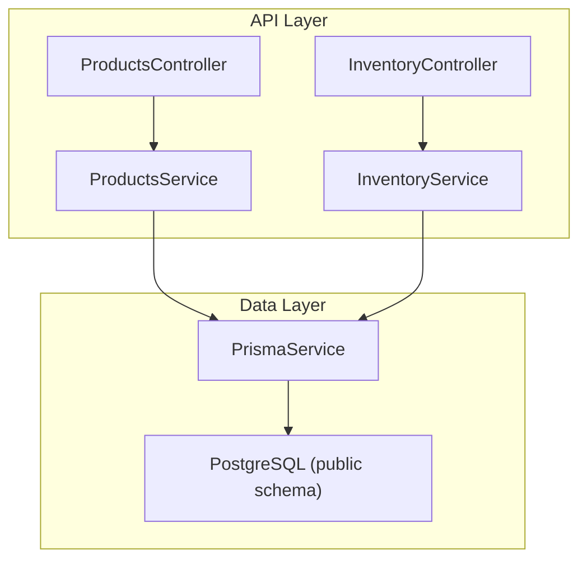
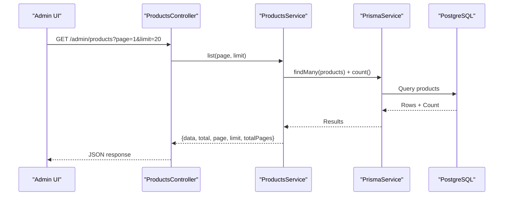
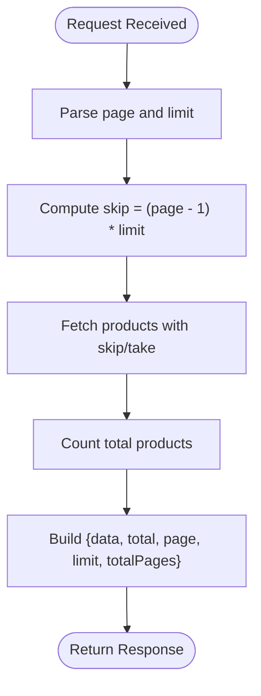
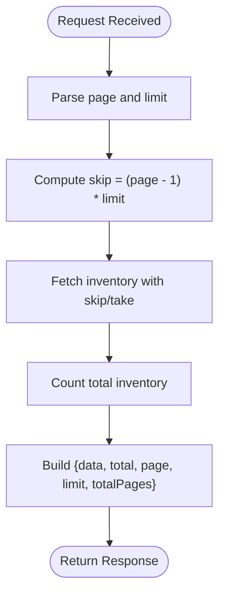
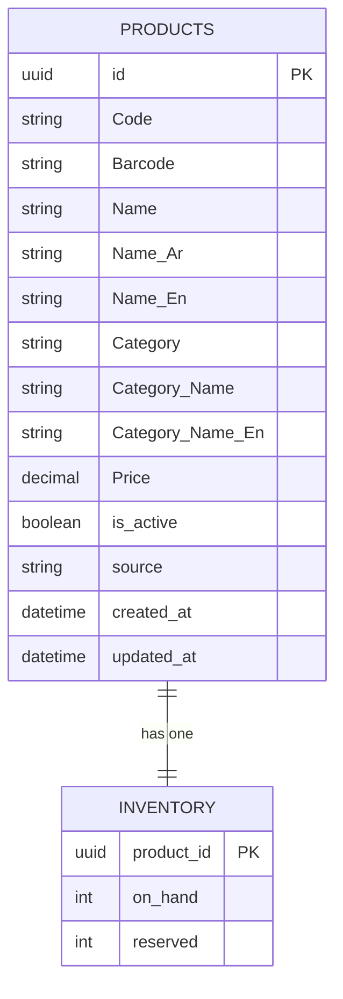
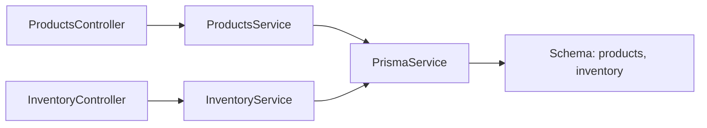

# Product & Inventory Management

<cite>
**Referenced Files in This Document**
- [schema.prisma](file://apps/api/prisma/schema.prisma)
- [products.controller.ts](file://apps/api/src/modules/products/products.controller.ts)
- [products.service.ts](file://apps/api/src/modules/products/products.service.ts)
- [inventory.controller.ts](file://apps/api/src/modules/inventory/inventory.controller.ts)
- [inventory.service.ts](file://apps/api/src/modules/inventory/inventory.service.ts)
</cite>

## Table of Contents
1. [Introduction](#introduction)
2. [Project Structure](#project-structure)
3. [Core Components](#core-components)
4. [Architecture Overview](#architecture-overview)
5. [Detailed Component Analysis](#detailed-component-analysis)
6. [Dependency Analysis](#dependency-analysis)
7. [Performance Considerations](#performance-considerations)
8. [Troubleshooting Guide](#troubleshooting-guide)
9. [Conclusion](#conclusion)
10. [Appendices](#appendices)

## Introduction
This document explains the product catalog and inventory management capabilities implemented in the API layer, focusing on product listing and inventory listing endpoints, their data model, and how they integrate with the database. It also outlines where additional features such as category management, pricing controls, stock monitoring, low-stock alerts, multi-branch synchronization, image management, bulk import/export, search, barcode scanning, supplier management, reorder automation, real-time updates, reservations, and reporting can be extended within this codebase.

## Project Structure
The product and inventory functionality is exposed via NestJS modules under apps/api/src/modules, backed by a Prisma schema that defines the core entities for products and inventory. The admin-facing endpoints are protected by an admin guard and provide paginated listing for both products and inventory records.

**Diagram sources**
- [products.controller.ts:1-15](file://apps/api/src/modules/products/products.controller.ts#L1-L15)
- [products.service.ts:1-27](file://apps/api/src/modules/products/products.service.ts#L1-L27)
- [inventory.controller.ts:1-15](file://apps/api/src/modules/inventory/inventory.controller.ts#L1-L15)
- [inventory.service.ts:1-27](file://apps/api/src/modules/inventory/inventory.service.ts#L1-L27)
- [schema.prisma:595-613](file://apps/api/prisma/schema.prisma#L595-L613)
- [schema.prisma:529-536](file://apps/api/prisma/schema.prisma#L529-L536)

**Section sources**
- [products.controller.ts:1-15](file://apps/api/src/modules/products/products.controller.ts#L1-L15)
- [products.service.ts:1-27](file://apps/api/src/modules/products/products.service.ts#L1-L27)
- [inventory.controller.ts:1-15](file://apps/api/src/modules/inventory/inventory.controller.ts#L1-L15)
- [inventory.service.ts:1-27](file://apps/api/src/modules/inventory/inventory.service.ts#L1-L27)
- [schema.prisma:595-613](file://apps/api/prisma/schema.prisma#L595-L613)
- [schema.prisma:529-536](file://apps/api/prisma/schema.prisma#L529-L536)

## Core Components
- Products module: Provides a paginated list of products through a protected admin endpoint.
- Inventory module: Provides a paginated list of inventory records through a protected admin endpoint.
- Data model: Products and Inventory are modeled in the database schema with a one-to-one relationship between product and inventory.

Key responsibilities:
- ProductsService: Executes pagination queries against the products table and returns metadata (total, page, limit, totalPages).
- InventoryService: Executes pagination queries against the inventory table and returns metadata (total, page, limit, totalPages).
- Controllers: Expose GET endpoints under /admin/products and /admin/inventory with query parameters for page and limit, guarded by AdminAuthGuard.

**Section sources**
- [products.controller.ts:1-15](file://apps/api/src/modules/products/products.controller.ts#L1-L15)
- [products.service.ts:1-27](file://apps/api/src/modules/products/products.service.ts#L1-L27)
- [inventory.controller.ts:1-15](file://apps/api/src/modules/inventory/inventory.controller.ts#L1-L15)
- [inventory.service.ts:1-27](file://apps/api/src/modules/inventory/inventory.service.ts#L1-L27)
- [schema.prisma:595-613](file://apps/api/prisma/schema.prisma#L595-L613)
- [schema.prisma:529-536](file://apps/api/prisma/schema.prisma#L529-L536)

## Architecture Overview
The system follows a layered architecture:
- Controllers receive HTTP requests, validate inputs, and delegate to services.
- Services encapsulate business logic and interact with Prisma to read/write data.
- Prisma maps to PostgreSQL tables defined in the schema.

**Diagram sources**
- [products.controller.ts:1-15](file://apps/api/src/modules/products/products.controller.ts#L1-L15)
- [products.service.ts:1-27](file://apps/api/src/modules/products/products.service.ts#L1-L27)
- [schema.prisma:595-613](file://apps/api/prisma/schema.prisma#L595-L613)

## Detailed Component Analysis

### Product Listing Endpoint
- Endpoint: GET /admin/products
- Authentication: AdminAuthGuard protects the route.
- Parameters: page (default 1), limit (default 20)
- Behavior: Computes skip offset, fetches items and total count concurrently, and returns a standardized paginated envelope.

**Diagram sources**
- [products.controller.ts:1-15](file://apps/api/src/modules/products/products.controller.ts#L1-L15)
- [products.service.ts:1-27](file://apps/api/src/modules/products/products.service.ts#L1-L27)

**Section sources**
- [products.controller.ts:1-15](file://apps/api/src/modules/products/products.controller.ts#L1-L15)
- [products.service.ts:1-27](file://apps/api/src/modules/products/products.service.ts#L1-L27)

### Inventory Listing Endpoint
- Endpoint: GET /admin/inventory
- Authentication: AdminAuthGuard protects the route.
- Parameters: page (default 1), limit (default 20)
- Behavior: Same pattern as product listing; returns paginated inventory data.

**Diagram sources**
- [inventory.controller.ts:1-15](file://apps/api/src/modules/inventory/inventory.controller.ts#L1-L15)
- [inventory.service.ts:1-27](file://apps/api/src/modules/inventory/inventory.service.ts#L1-L27)

**Section sources**
- [inventory.controller.ts:1-15](file://apps/api/src/modules/inventory/inventory.controller.ts#L1-L15)
- [inventory.service.ts:1-27](file://apps/api/src/modules/inventory/inventory.service.ts#L1-L27)

### Data Model: Products and Inventory
- Products entity includes fields for identification, names, category labels, price, status, source, and timestamps.
- Inventory entity tracks per-product on-hand and reserved quantities and relates to a product.

**Diagram sources**
- [schema.prisma:595-613](file://apps/api/prisma/schema.prisma#L595-L613)
- [schema.prisma:529-536](file://apps/api/prisma/schema.prisma#L529-L536)

**Section sources**
- [schema.prisma:595-613](file://apps/api/prisma/schema.prisma#L595-L613)
- [schema.prisma:529-536](file://apps/api/prisma/schema.prisma#L529-L536)

## Dependency Analysis
- Controllers depend on their respective services for business logic.
- Services depend on PrismaService to access the database.
- The Prisma schema defines the relational structure between products and inventory.

**Diagram sources**
- [products.controller.ts:1-15](file://apps/api/src/modules/products/products.controller.ts#L1-L15)
- [products.service.ts:1-27](file://apps/api/src/modules/products/products.service.ts#L1-L27)
- [inventory.controller.ts:1-15](file://apps/api/src/modules/inventory/inventory.controller.ts#L1-L15)
- [inventory.service.ts:1-27](file://apps/api/src/modules/inventory/inventory.service.ts#L1-L27)
- [schema.prisma:595-613](file://apps/api/prisma/schema.prisma#L595-L613)
- [schema.prisma:529-536](file://apps/api/prisma/schema.prisma#L529-L536)

**Section sources**
- [products.controller.ts:1-15](file://apps/api/src/modules/products/products.controller.ts#L1-L15)
- [products.service.ts:1-27](file://apps/api/src/modules/products/products.service.ts#L1-L27)
- [inventory.controller.ts:1-15](file://apps/api/src/modules/inventory/inventory.controller.ts#L1-L15)
- [inventory.service.ts:1-27](file://apps/api/src/modules/inventory/inventory.service.ts#L1-L27)
- [schema.prisma:595-613](file://apps/api/prisma/schema.prisma#L595-L613)
- [schema.prisma:529-536](file://apps/api/prisma/schema.prisma#L529-L536)

## Performance Considerations
- Pagination: Both endpoints use skip/take to limit result sets and compute totalPages from total counts, which helps control payload size and memory usage.
- Concurrent queries: Items and totals are fetched concurrently using Promise.all to reduce latency.
- Indexing: Ensure indexes exist on frequently filtered columns (e.g., product categories, active status) to improve query performance.
- Caching: Consider caching frequent reads at the API or application level if appropriate.

[No sources needed since this section provides general guidance]

## Troubleshooting Guide
- Authentication failures: If requests to /admin/products or /admin/inventory return unauthorized errors, verify that AdminAuthGuard is correctly configured and the caller has admin privileges.
- Pagination issues: Verify page and limit parameters are valid integers; negative or zero values may cause unexpected behavior.
- Empty results: Confirm that the database contains products or inventory records and that filters (if added later) do not exclude all rows.
- Database connectivity: Check environment variables for DATABASE_URL and ensure the PostgreSQL instance is reachable.

**Section sources**
- [products.controller.ts:1-15](file://apps/api/src/modules/products/products.controller.ts#L1-L15)
- [inventory.controller.ts:1-15](file://apps/api/src/modules/inventory/inventory.controller.ts#L1-L15)

## Conclusion
The current implementation exposes secure, paginated listing endpoints for products and inventory, backed by a clear Prisma schema. While only listing is implemented, the modular design makes it straightforward to extend with full CRUD operations, category management, pricing controls, stock monitoring, low-stock alerts, multi-branch synchronization, image management, bulk import/export, search, barcode scanning, supplier management, reorder automation, real-time updates, reservations, and reporting.

[No sources needed since this section summarizes without analyzing specific files]

## Appendices

### Extension Roadmap (Conceptual)
- Category management: Add a categories table and relations to products; implement CRUD endpoints and filtering.
- Pricing controls: Introduce price history, discounts, and effective pricing rules; add validation and audit logs.
- Stock level monitoring: Extend inventory with min/max thresholds; build low-stock alerting and notifications.
- Multi-branch inventory: Add branch-scoped inventory records and reconciliation workflows across locations.
- Image management: Store product images with metadata; serve optimized thumbnails and cache strategies.
- Bulk import/export: Implement CSV/JSON upload and export pipelines with validation and error reporting.
- Search functionality: Add full-text or vector-based search over product names and categories; expose search endpoints.
- Barcode scanning: Use Barcode field for quick lookup and scan-to-add workflows in cashier/mobile apps.
- Supplier management: Create suppliers and purchase orders; link to inventory replenishment.
- Reorder point automation: Trigger purchase suggestions when stock falls below thresholds.
- Real-time updates: Emit events on inventory changes for live dashboards and client-side updates.
- Stock reservation system: Reserve stock during checkout flows; release on cancellation or confirm on payment.
- Reporting: Aggregate sales, stock turnover, and low-stock reports for analytics.

[No sources needed since this section provides conceptual guidance]