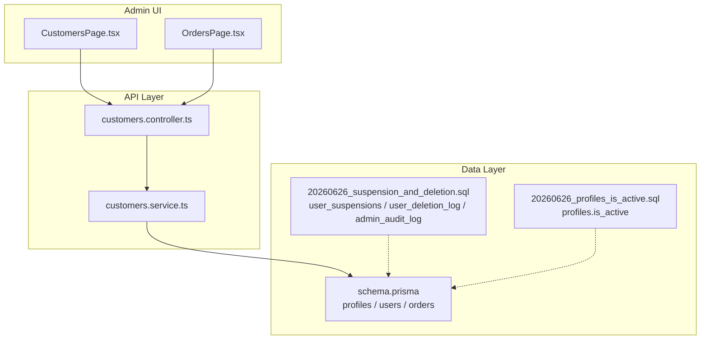
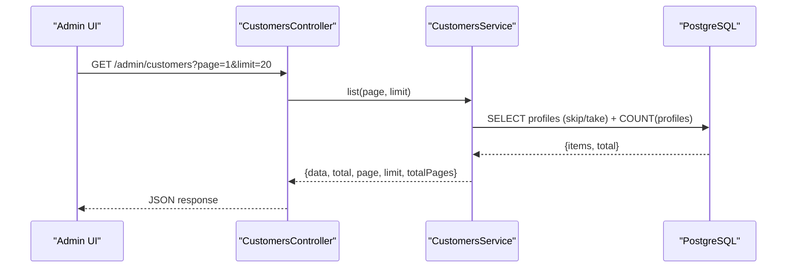
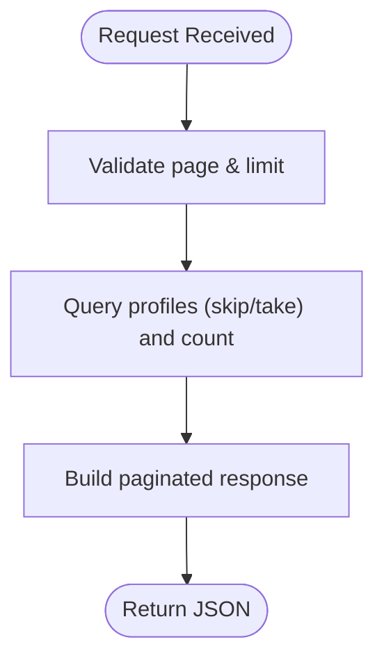
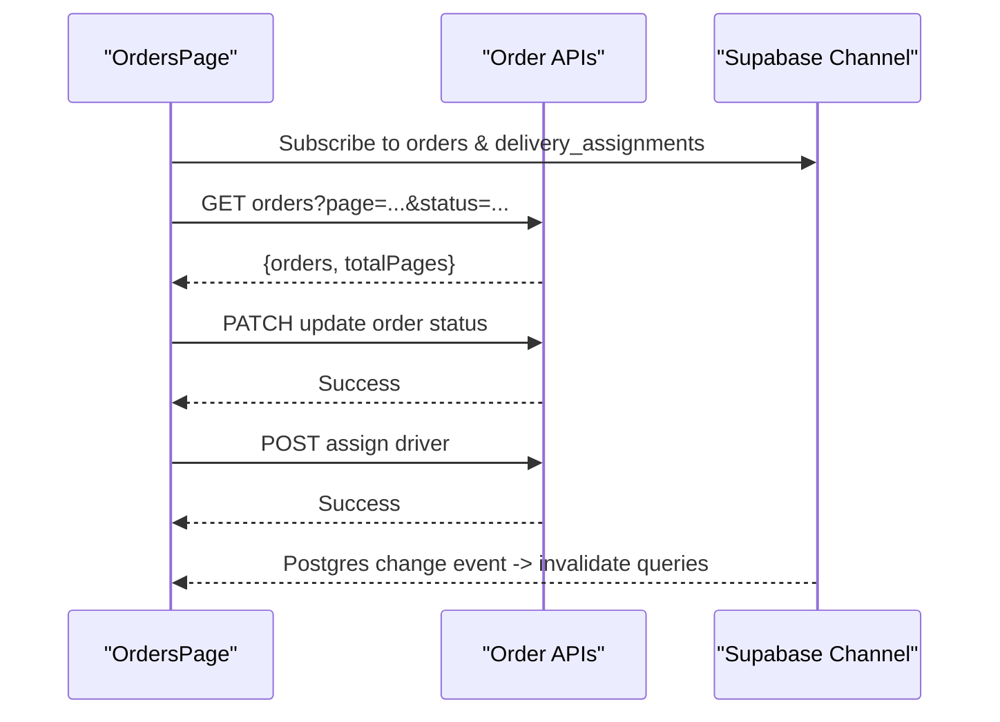
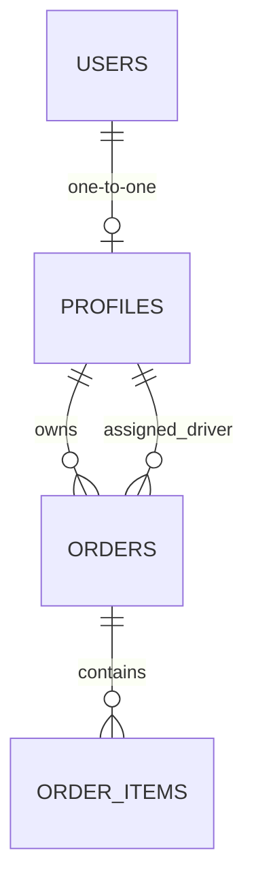
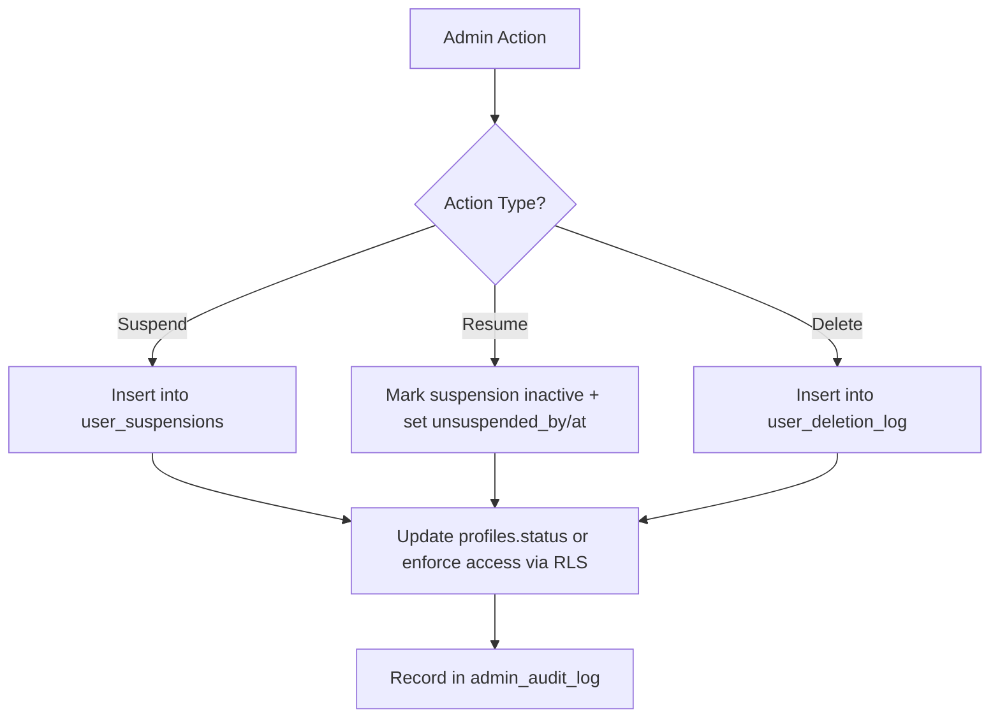
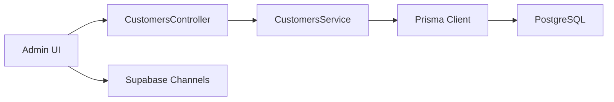

# Customer Management

<cite>
**Referenced Files in This Document**
- [customers.controller.ts](file://apps/api/src/modules/customers/customers.controller.ts)
- [customers.service.ts](file://apps/api/src/modules/customers/customers.service.ts)
- [schema.prisma](file://apps/api/prisma/schema.prisma)
- [CustomersPage.tsx](file://apps/admin/src/pages/CustomersPage.tsx)
- [OrdersPage.tsx](file://apps/admin/src/pages/OrdersPage.tsx)
- [20260626_profiles_is_active.sql](file://database/20260626_profiles_is_active.sql)
- [20260626_suspension_and_deletion.sql](file://database/20260626_suspension_and_deletion.sql)
</cite>

## Table of Contents
1. Introduction
2. Project Structure
3. Core Components
4. Architecture Overview
5. Detailed Component Analysis
6. Dependency Analysis
7. Performance Considerations
8. Troubleshooting Guide
9. Conclusion

## Introduction
This document describes the customer management system with a focus on administrative operations for customers and their orders. It covers:
- Listing and paginating customers via an admin API
- Viewing order history and managing order status and driver assignment from the admin UI
- Data model foundations for profiles, users, and orders
- Account status management including suspension and deletion workflows
- Integration points for notifications and marketing campaigns through Supabase functions and migrations

Where specific implementation details are not present in the codebase, this document clearly marks them as future enhancements.

## Project Structure
The customer management capability spans three layers:
- Admin UI (React pages) that call APIs and display data
- NestJS API module exposing admin endpoints for customer listing
- Database schema and migrations defining profiles, users, orders, and audit/suspension tables

**Diagram sources**
- [CustomersPage.tsx:7-10](file://apps/admin/src/pages/CustomersPage.tsx#L7-L10)
- [OrdersPage.tsx:78-83](file://apps/admin/src/pages/OrdersPage.tsx#L78-L83)
- [customers.controller.ts:5-13](file://apps/api/src/modules/customers/customers.controller.ts#L5-L13)
- [customers.service.ts:8-25](file://apps/api/src/modules/customers/customers.service.ts#L8-L25)
- [schema.prisma:556-635](file://apps/api/prisma/schema.prisma#L556-L635)
- [20260626_suspension_and_deletion.sql:6-55](file://database/20260626_suspension_and_deletion.sql#L6-L55)
- [20260626_profiles_is_active.sql:5-6](file://database/20260626_profiles_is_active.sql#L5-L6)

**Section sources**
- [CustomersPage.tsx:7-10](file://apps/admin/src/pages/CustomersPage.tsx#L7-L10)
- [OrdersPage.tsx:78-83](file://apps/admin/src/pages/OrdersPage.tsx#L78-L83)
- [customers.controller.ts:5-13](file://apps/api/src/modules/customers/customers.controller.ts#L5-L13)
- [customers.service.ts:8-25](file://apps/api/src/modules/customers/customers.service.ts#L8-L25)
- [schema.prisma:556-635](file://apps/api/prisma/schema.prisma#L556-L635)
- [20260626_suspension_and_deletion.sql:6-55](file://database/20260626_suspension_and_deletion.sql#L6-L55)
- [20260626_profiles_is_active.sql:5-6](file://database/20260626_profiles_is_active.sql#L5-L6)

## Core Components
- Admin Customers API
  - Endpoint: GET /admin/customers
  - Behavior: Paginated list of profiles with total count and page metadata
  - Guard: Admin-only access via guard
- Admin Orders UI
  - Features: Status filtering, pagination, real-time updates, order detail modal, status changes, driver assignment
- Data Models
  - profiles: core customer identity fields, role, status, timestamps
  - users: authentication identity linked to profiles
  - orders: order lifecycle, totals, payment state, links to profiles and drivers
- Account Status and Auditability
  - is_active flag on profiles
  - Suspension tracking and deletion logs with RLS policies
  - Admin audit log for privileged actions

**Section sources**
- [customers.controller.ts:5-13](file://apps/api/src/modules/customers/customers.controller.ts#L5-L13)
- [customers.service.ts:8-25](file://apps/api/src/modules/customers/customers.service.ts#L8-L25)
- [OrdersPage.tsx:28-83](file://apps/admin/src/pages/OrdersPage.tsx#L28-L83)
- [schema.prisma:556-635](file://apps/api/prisma/schema.prisma#L556-L635)
- [20260626_profiles_is_active.sql:5-6](file://database/20260626_profiles_is_active.sql#L5-L6)
- [20260626_suspension_and_deletion.sql:6-55](file://database/20260626_suspension_and_deletion.sql#L6-L55)

## Architecture Overview
The admin flow for customer and order management:
- The Admin UI fetches customer lists and order data via REST calls
- The NestJS controller enforces admin authorization and delegates to the service
- The service queries Prisma models backed by PostgreSQL
- Real-time updates are handled via Supabase channels in the Orders UI
- Account status changes and audits are governed by database-level policies and logs

**Diagram sources**
- [customers.controller.ts:5-13](file://apps/api/src/modules/customers/customers.controller.ts#L5-L13)
- [customers.service.ts:8-25](file://apps/api/src/modules/customers/customers.service.ts#L8-L25)
- [schema.prisma:617-635](file://apps/api/prisma/schema.prisma#L617-L635)

## Detailed Component Analysis

### Customer Listing API
- Route: GET /admin/customers
- Query parameters:
  - page: integer (default 1)
  - limit: integer (default 20)
- Response shape:
  - data: array of profile records
  - total: number of profiles
  - page: current page
  - limit: requested page size
  - totalPages: computed ceiling(total / limit)
- Security: Protected by admin guard

**Diagram sources**
- [customers.controller.ts:10-13](file://apps/api/src/modules/customers/customers.controller.ts#L10-L13)
- [customers.service.ts:8-25](file://apps/api/src/modules/customers/customers.service.ts#L8-L25)

**Section sources**
- [customers.controller.ts:5-13](file://apps/api/src/modules/customers/customers.controller.ts#L5-L13)
- [customers.service.ts:8-25](file://apps/api/src/modules/customers/customers.service.ts#L8-L25)

### Admin Customers Page
- Fetches customer list using React Query
- Displays loading skeleton or error state
- Renders a preview of returned data for quick inspection

**Section sources**
- [CustomersPage.tsx:7-10](file://apps/admin/src/pages/CustomersPage.tsx#L7-L10)
- [CustomersPage.tsx:19-27](file://apps/admin/src/pages/CustomersPage.tsx#L19-L27)

### Order History and Management
- Filters by order status and supports pagination
- Real-time invalidation on order and delivery assignment changes
- Order detail modal shows customer info, address, notes, and allows:
  - Updating order status
  - Assigning/unassigning a driver

**Diagram sources**
- [OrdersPage.tsx:35-50](file://apps/admin/src/pages/OrdersPage.tsx#L35-L50)
- [OrdersPage.tsx:78-83](file://apps/admin/src/pages/OrdersPage.tsx#L78-L83)
- [OrdersPage.tsx:58-76](file://apps/admin/src/pages/OrdersPage.tsx#L58-L76)

**Section sources**
- [OrdersPage.tsx:28-83](file://apps/admin/src/pages/OrdersPage.tsx#L28-L83)
- [OrdersPage.tsx:58-76](file://apps/admin/src/pages/OrdersPage.tsx#L58-L76)
- [OrdersPage.tsx:226-327](file://apps/admin/src/pages/OrdersPage.tsx#L226-L327)

### Data Model: Profiles, Users, Orders
- profiles:
  - id, full_name, phone, email, username, address, role, status, created_at, updated_at
  - Relationships: one-to-one with users; one-to-many with orders (as owner or assigned driver)
- users:
  - Authentication identity with email, phone, roles, timestamps, and relationships to sessions, identities, etc.
- orders:
  - id, customer_name, customer_phone, customer_address, status, assigned_driver_id, totals, payment fields, timestamps
  - Relationships: belongs to a user (optional), has many order_items, optional delivery assignment

**Diagram sources**
- [schema.prisma:407-458](file://apps/api/prisma/schema.prisma#L407-L458)
- [schema.prisma:556-592](file://apps/api/prisma/schema.prisma#L556-L592)
- [schema.prisma:617-635](file://apps/api/prisma/schema.prisma#L617-L635)

**Section sources**
- [schema.prisma:407-458](file://apps/api/prisma/schema.prisma#L407-L458)
- [schema.prisma:556-592](file://apps/api/prisma/schema.prisma#L556-L592)
- [schema.prisma:617-635](file://apps/api/prisma/schema.prisma#L617-L635)

### Account Status Management: Suspension and Deletion
- Suspension tracking:
  - user_suspensions table records active/historical suspensions with reason codes, duration type, expiry, and who suspended/resumed
- Deletion logging:
  - user_deletion_log captures permanent deletions with type (admin/self), reasons, and timestamps
- Admin audit log:
  - admin_audit_log records privileged actions with target user and details
- Row Level Security:
  - Policies restrict insert/update/select to admin/manager roles where appropriate
- Profile activation:
  - profiles.is_active column gates staff access and indicates account activation

**Diagram sources**
- [20260626_suspension_and_deletion.sql:6-55](file://database/20260626_suspension_and_deletion.sql#L6-L55)
- [20260626_suspension_and_deletion.sql:57-121](file://database/20260626_suspension_and_deletion.sql#L57-L121)
- [20260626_profiles_is_active.sql:5-6](file://database/20260626_profiles_is_active.sql#L5-L6)

**Section sources**
- [20260626_suspension_and_deletion.sql:6-55](file://database/20260626_suspension_and_deletion.sql#L6-L55)
- [20260626_suspension_and_deletion.sql:57-121](file://database/20260626_suspension_and_deletion.sql#L57-L121)
- [20260626_profiles_is_active.sql:5-6](file://database/20260626_profiles_is_active.sql#L5-L6)

### Search, Filtering, and Advanced Queries
- Current capabilities:
  - Customer listing supports pagination via page and limit
  - Orders UI supports filtering by status and pagination
- Not implemented yet:
  - Full-text search across customer names, emails, phones
  - Multi-field filters (role, status, date ranges)
  - Export/import endpoints for customers and orders
- Recommended next steps:
  - Add query parameters to the customers endpoint for name/email/phone partial match and role/status filters
  - Implement export endpoints returning CSV/Excel
  - Provide import endpoints with validation and batch processing

[No sources needed since this section proposes enhancements beyond current implementation]

### Bulk Operations, Export, and Import
- Not currently implemented in the referenced files
- Suggested design:
  - Bulk suspend/resume: accept arrays of user IDs with action and reason
  - Export: generate CSV from filtered results
  - Import: validate rows, upsert profiles, handle duplicates and errors

[No sources needed since this section proposes enhancements beyond current implementation]

### Communication Tools and Integrations
- Notifications:
  - Supabase functions exist for notification workers and SMS campaign workers
  - Migrations include notification-related schemas and pipelines
- Marketing campaigns:
  - SMS marketing migration exists; integration can be triggered via Supabase functions
- Practical usage:
  - After suspending or resuming accounts, trigger notifications to relevant parties
  - Use campaign workers to send targeted messages based on customer segments

[No sources needed since this section references integrations conceptually without analyzing specific files]

## Dependency Analysis
- Controller depends on service for business logic
- Service depends on Prisma client to query profiles
- Admin UI depends on API endpoints and Supabase channels for real-time updates
- Database policies enforce role-based access for sensitive tables

**Diagram sources**
- [customers.controller.ts:5-13](file://apps/api/src/modules/customers/customers.controller.ts#L5-L13)
- [customers.service.ts:8-25](file://apps/api/src/modules/customers/customers.service.ts#L8-L25)
- [OrdersPage.tsx:35-50](file://apps/admin/src/pages/OrdersPage.tsx#L35-L50)

**Section sources**
- [customers.controller.ts:5-13](file://apps/api/src/modules/customers/customers.controller.ts#L5-L13)
- [customers.service.ts:8-25](file://apps/api/src/modules/customers/customers.service.ts#L8-L25)
- [OrdersPage.tsx:35-50](file://apps/admin/src/pages/OrdersPage.tsx#L35-L50)

## Performance Considerations
- Pagination:
  - Ensure page and limit are bounded to avoid large result sets
- Indexing:
  - Leverage existing indexes on orders and profiles where applicable
- Real-time updates:
  - Use Supabase channels to minimize polling and keep UI responsive
- Query optimization:
  - Select only required fields when extending the customer list endpoint
- Caching:
  - Consider server-side caching for frequently accessed aggregates (e.g., total counts)

[No sources needed since this section provides general guidance]

## Troubleshooting Guide
- 401/403 on customer listing:
  - Verify admin guard configuration and user role
- Empty customer list:
  - Check if profiles exist and are accessible under current RLS policies
- Order status not updating:
  - Confirm API mutation success and that Supabase channel invalidates queries
- Suspension/deletion issues:
  - Validate RLS policies allow admin/manager actions
  - Inspect user_suspensions and user_deletion_log entries
  - Review admin_audit_log for recorded actions

**Section sources**
- [customers.controller.ts:5-6](file://apps/api/src/modules/customers/customers.controller.ts#L5-L6)
- [OrdersPage.tsx:58-76](file://apps/admin/src/pages/OrdersPage.tsx#L58-L76)
- [20260626_suspension_and_deletion.sql:57-121](file://database/20260626_suspension_and_deletion.sql#L57-L121)

## Conclusion
The current customer management system provides:
- Paginated listing of customers via a secure admin API
- Robust order history viewing and management with real-time updates
- Strong data modeling for profiles, users, and orders
- Comprehensive account status management with suspension, deletion logging, and audit trails

Future enhancements should add advanced search/filtering, bulk operations, export/import, and deeper integrations with marketing and loyalty systems to complete the administrative toolkit.