# Driver Management

<cite>
**Referenced Files in This Document**
- [driver.module.ts](file://apps/api/src/modules/driver/driver.module.ts)
- [driver.controller.ts](file://apps/api/src/modules/driver/driver.controller.ts)
- [driver-auth.service.ts](file://apps/api/src/modules/driver/driver-auth.service.ts)
- [driver-profile.service.ts](file://apps/api/src/modules/driver/driver-profile.service.ts)
- [driver-location.service.ts](file://apps/api/src/modules/driver/driver-location.service.ts)
- [driver-orders.service.ts](file://apps/api/src/modules/driver/driver-orders.service.ts)
- [location-broadcast.gateway.ts](file://apps/api/src/modules/driver/location-broadcast.gateway.ts)
- [schema.prisma](file://apps/api/prisma/schema.prisma)
- [migration.sql](file://apps/api/prisma/migrations/20260726042623_add_driver_tables/migration.sql)
- [README.md](file://apps/api/src/modules/driver/README.md)
- [index.ts (Supabase driver-location function)](file://supabase/functions/driver-location/index.ts)
</cite>

## Table of Contents
1. Introduction
2. Project Structure
3. Core Components
4. Architecture Overview
5. Detailed Component Analysis
6. Dependency Analysis
7. Performance Considerations
8. Troubleshooting Guide
9. Conclusion

## Introduction
This document explains the driver management system that powers driver onboarding, profile and credential management, authentication, real-time location tracking, availability status, delivery assignment workflows, performance monitoring, and operational dashboards. It covers how drivers register and get approved, how they go online/offline, how GPS data is captured and broadcast, how orders are assigned and tracked through a delivery lifecycle, and how admin dashboards receive live updates via WebSockets.

## Project Structure
The driver management feature is implemented as a NestJS module with controllers, services, guards, and a WebSocket gateway for real-time broadcasting. Data persistence uses Prisma over PostgreSQL, with additional Supabase Edge Functions for secure GPS ingestion from mobile/web clients.

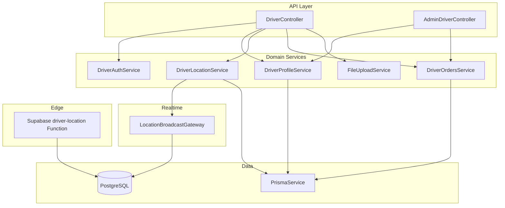

**Diagram sources**
- [driver.module.ts:1-33](file://apps/api/src/modules/driver/driver.module.ts#L1-L33)
- [driver.controller.ts:1-235](file://apps/api/src/modules/driver/driver.controller.ts#L1-L235)
- [driver-auth.service.ts:1-151](file://apps/api/src/modules/driver/driver-auth.service.ts#L1-L151)
- [driver-profile.service.ts:1-266](file://apps/api/src/modules/driver/driver-profile.service.ts#L1-L266)
- [driver-location.service.ts:1-352](file://apps/api/src/modules/driver/driver-location.service.ts#L1-L352)
- [driver-orders.service.ts:1-621](file://apps/api/src/modules/driver/driver-orders.service.ts#L1-L621)
- [location-broadcast.gateway.ts:1-214](file://apps/api/src/modules/driver/location-broadcast.gateway.ts#L1-L214)
- [schema.prisma:765-800](file://apps/api/prisma/schema.prisma#L765-L800)
- [migration.sql:1-244](file://apps/api/prisma/migrations/20260726042623_add_driver_tables/migration.sql#L1-L244)
- [index.ts (Supabase driver-location function):1-236](file://supabase/functions/driver-location/index.ts#L1-L236)

**Section sources**
- [driver.module.ts:1-33](file://apps/api/src/modules/driver/driver.module.ts#L1-L33)
- [driver.controller.ts:1-235](file://apps/api/src/modules/driver/driver.controller.ts#L1-L235)
- [schema.prisma:765-800](file://apps/api/prisma/schema.prisma#L765-L800)
- [migration.sql:1-244](file://apps/api/prisma/migrations/20260726042623_add_driver_tables/migration.sql#L1-L244)

## Core Components
- Authentication and Onboarding: Driver registration, login, role enforcement, and approval gating.
- Profile and Credentials: Vehicle details, license info, photo uploads, and status transitions.
- Location Tracking: GPS capture, Kalman filtering, batched writes, current position caching, and WebSocket broadcasts.
- Order Assignment and Delivery Workflow: Available order listing, acceptance, geofenced arrival checks, state transitions, earnings, and history.
- Realtime Broadcasting: Live driver locations and status changes to admin dashboards.
- Data Model: Driver profiles, sessions, locations, assignments, and earnings tables with indexes and constraints.

**Section sources**
- [driver-auth.service.ts:1-151](file://apps/api/src/modules/driver/driver-auth.service.ts#L1-L151)
- [driver-profile.service.ts:1-266](file://apps/api/src/modules/driver/driver-profile.service.ts#L1-L266)
- [driver-location.service.ts:1-352](file://apps/api/src/modules/driver/driver-location.service.ts#L1-L352)
- [driver-orders.service.ts:1-621](file://apps/api/src/modules/driver/driver-orders.service.ts#L1-L621)
- [location-broadcast.gateway.ts:1-214](file://apps/api/src/modules/driver/location-broadcast.gateway.ts#L1-L214)
- [migration.sql:1-244](file://apps/api/prisma/migrations/20260726042623_add_driver_tables/migration.sql#L1-L244)

## Architecture Overview
The API exposes REST endpoints for driver operations and a WebSocket gateway for realtime updates. Drivers authenticate via JWT, manage their profile and documents, update location, and progress through delivery states. Admins subscribe to a dedicated channel to monitor drivers and deliveries. A Supabase Edge Function provides an alternative, secure path for GPS pings directly into the database with strict authorization checks.

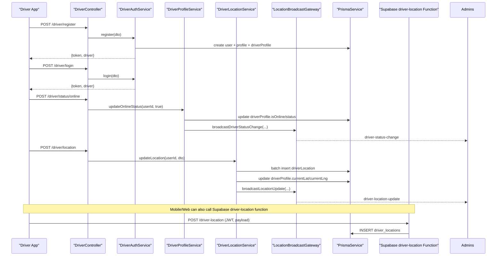

**Diagram sources**
- [driver.controller.ts:47-119](file://apps/api/src/modules/driver/driver.controller.ts#L47-L119)
- [driver-auth.service.ts:21-126](file://apps/api/src/modules/driver/driver-auth.service.ts#L21-L126)
- [driver-profile.service.ts:111-177](file://apps/api/src/modules/driver/driver-profile.service.ts#L111-L177)
- [driver-location.service.ts:30-127](file://apps/api/src/modules/driver/driver-location.service.ts#L30-L127)
- [location-broadcast.gateway.ts:61-93](file://apps/api/src/modules/driver/location-broadcast.gateway.ts#L61-L93)
- [index.ts (Supabase driver-location function):77-235](file://supabase/functions/driver-location/index.ts#L77-L235)

## Detailed Component Analysis

### Authentication and Onboarding
- Registration creates a user, a profile with role driver, and a driver profile set to pending approval. Returns a JWT token.
- Login validates credentials, ensures the driver is not rejected or suspended, and returns a token with profile context.
- Guards enforce driver-only access for protected routes.

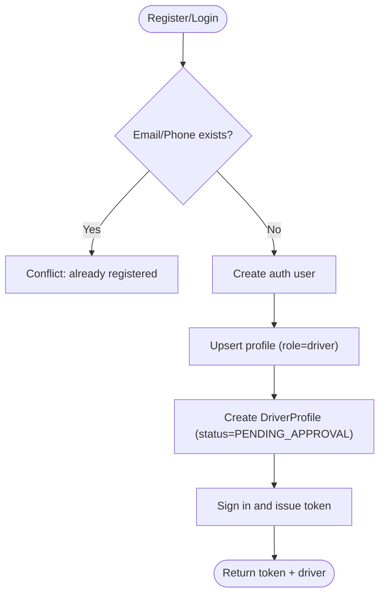

**Diagram sources**
- [driver-auth.service.ts:21-89](file://apps/api/src/modules/driver/driver-auth.service.ts#L21-L89)
- [driver-auth.service.ts:95-126](file://apps/api/src/modules/driver/driver-auth.service.ts#L95-L126)

**Section sources**
- [driver-auth.service.ts:21-126](file://apps/api/src/modules/driver/driver-auth.service.ts#L21-L126)
- [driver.controller.ts:47-59](file://apps/api/src/modules/driver/driver.controller.ts#L47-L59)

### Profile and Credential Management
- Get/update profile: returns full driver profile including vehicle details, photos, status, and metrics.
- Online/offline status: only approved drivers can go online; toggling status updates session tracking and broadcasts changes.
- Document upload: supports license, ID, vehicle, insurance images; updates profile URLs automatically.

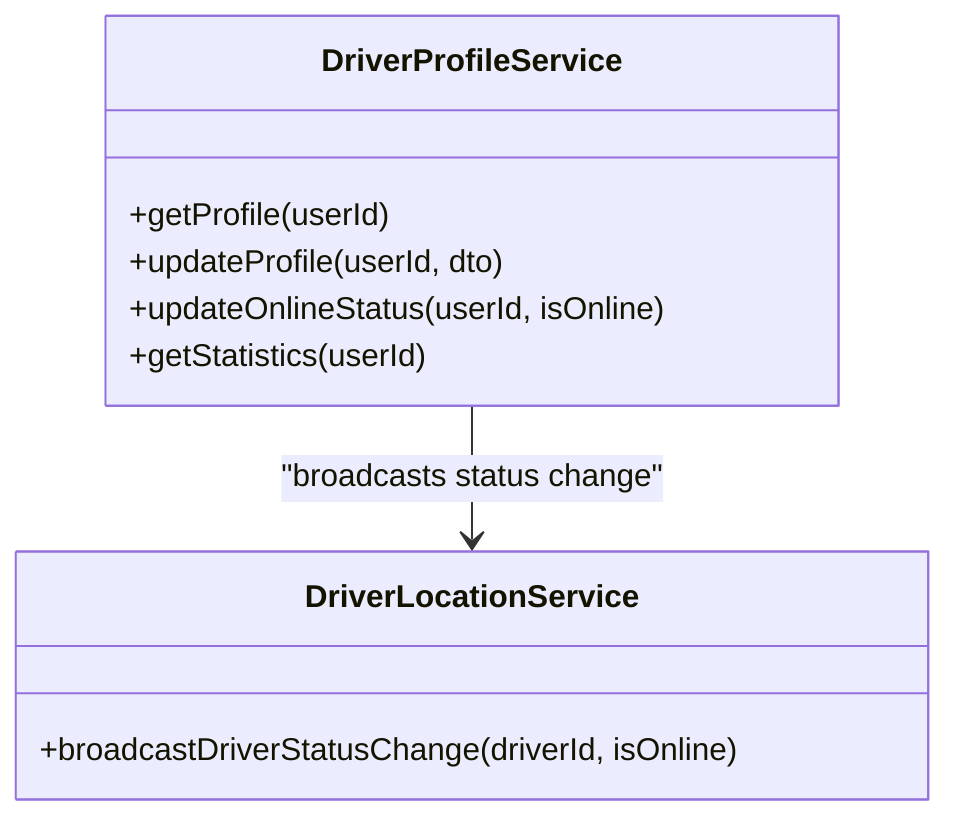

**Diagram sources**
- [driver-profile.service.ts:17-106](file://apps/api/src/modules/driver/driver-profile.service.ts#L17-L106)
- [driver-profile.service.ts:111-177](file://apps/api/src/modules/driver/driver-profile.service.ts#L111-L177)
- [driver-location.service.ts:223-245](file://apps/api/src/modules/driver/driver-location.service.ts#L223-L245)

**Section sources**
- [driver-profile.service.ts:17-106](file://apps/api/src/modules/driver/driver-profile.service.ts#L17-L106)
- [driver-profile.service.ts:111-177](file://apps/api/src/modules/driver/driver-profile.service.ts#L111-L177)
- [driver.controller.ts:63-95](file://apps/api/src/modules/driver/driver.controller.ts#L63-L95)
- [driver.controller.ts:123-149](file://apps/api/src/modules/driver/driver.controller.ts#L123-L149)

### Real-Time Location Tracking
- GPS capture: accepts latitude, longitude, accuracy, heading, speed; applies Kalman filtering to smooth noisy readings.
- Batched persistence: location records are batched and written periodically to reduce DB load.
- Current position cache: driver profile stores latest lat/lng and timestamp for fast reads.
- WebSocket broadcast: all online driver locations and status changes are emitted to admin clients.

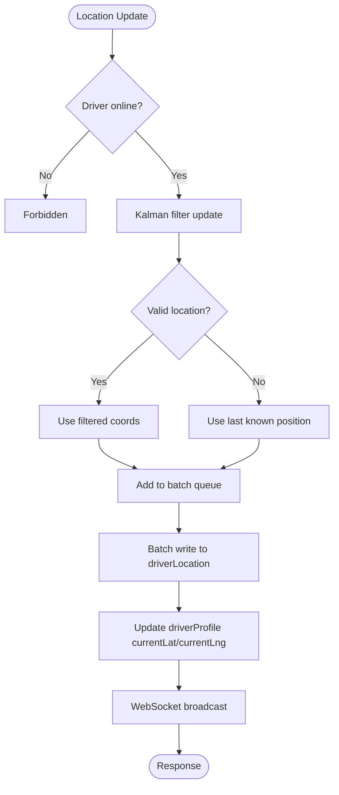

**Diagram sources**
- [driver-location.service.ts:30-127](file://apps/api/src/modules/driver/driver-location.service.ts#L30-L127)
- [driver-location.service.ts:268-318](file://apps/api/src/modules/driver/driver-location.service.ts#L268-L318)
- [location-broadcast.gateway.ts:124-143](file://apps/api/src/modules/driver/location-broadcast.gateway.ts#L124-L143)

**Section sources**
- [driver-location.service.ts:30-127](file://apps/api/src/modules/driver/driver-location.service.ts#L30-L127)
- [driver-location.service.ts:186-221](file://apps/api/src/modules/driver/driver-location.service.ts#L186-L221)
- [driver.controller.ts:97-119](file://apps/api/src/modules/driver/driver.controller.ts#L97-L119)

### Order Assignment and Delivery Workflow
- Available orders: lists ready orders unassigned to any driver; optionally sorts by distance to pickup using Haversine.
- Acceptance: locks order in a transaction, creates a delivery assignment, sets canonical order status, and notifies admins.
- Geofenced arrivals: enforces proximity checks at pharmacy and customer locations before allowing state transitions.
- Completion: finalizes delivery, records proof/signature/notes, computes actual duration, posts earnings, and updates driver counters/rating.

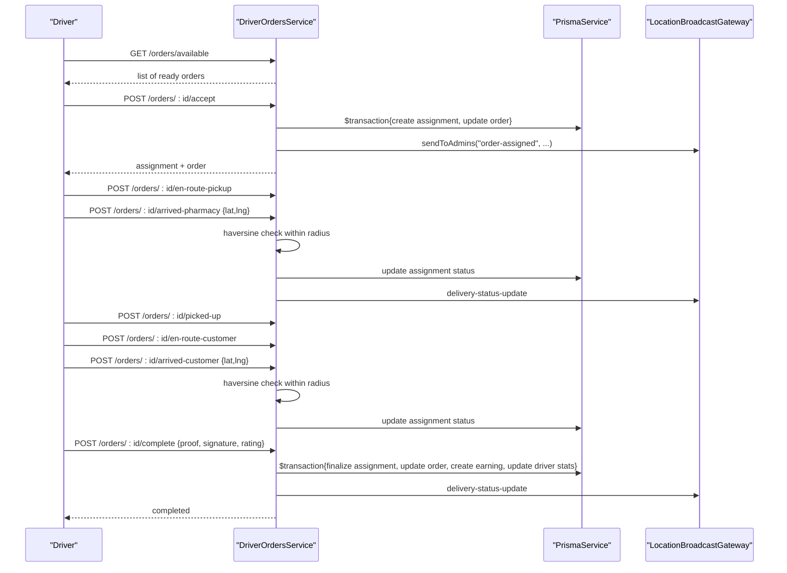

**Diagram sources**
- [driver-orders.service.ts:79-183](file://apps/api/src/modules/driver/driver-orders.service.ts#L79-L183)
- [driver-orders.service.ts:187-295](file://apps/api/src/modules/driver/driver-orders.service.ts#L187-L295)
- [driver-orders.service.ts:382-433](file://apps/api/src/modules/driver/driver-orders.service.ts#L382-L433)
- [driver-orders.service.ts:435-510](file://apps/api/src/modules/driver/driver-orders.service.ts#L435-L510)
- [driver.controller.ts:151-233](file://apps/api/src/modules/driver/driver.controller.ts#L151-L233)

**Section sources**
- [driver-orders.service.ts:79-183](file://apps/api/src/modules/driver/driver-orders.service.ts#L79-L183)
- [driver-orders.service.ts:187-295](file://apps/api/src/modules/driver/driver-orders.service.ts#L187-L295)
- [driver-orders.service.ts:382-433](file://apps/api/src/modules/driver/driver-orders.service.ts#L382-L433)
- [driver-orders.service.ts:435-510](file://apps/api/src/modules/driver/driver-orders.service.ts#L435-L510)
- [driver.controller.ts:151-233](file://apps/api/src/modules/driver/driver.controller.ts#L151-L233)

### Availability Status Management
- Going online: resets Kalman filters, marks driver active, starts session tracking, and broadcasts status change.
- Going offline: ends session, cleans up tracking resources, and broadcasts status change.

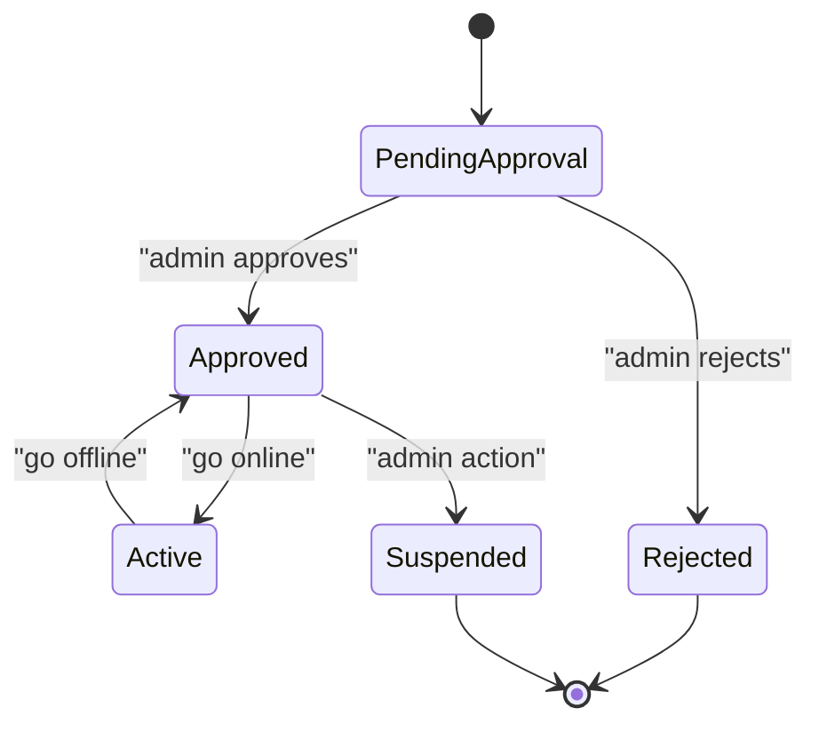

**Diagram sources**
- [driver-profile.service.ts:111-177](file://apps/api/src/modules/driver/driver-profile.service.ts#L111-L177)
- [driver.controller.ts:83-95](file://apps/api/src/modules/driver/driver.controller.ts#L83-L95)
- [README.md:324-339](file://apps/api/src/modules/driver/README.md#L324-L339)

**Section sources**
- [driver-profile.service.ts:111-177](file://apps/api/src/modules/driver/driver-profile.service.ts#L111-L177)
- [driver.controller.ts:83-95](file://apps/api/src/modules/driver/driver.controller.ts#L83-L95)
- [README.md:324-339](file://apps/api/src/modules/driver/README.md#L324-L339)

### Performance Monitoring Dashboards
- Driver statistics: aggregates today/week/month earnings and delivery counts from driver earnings table.
- Admin dashboard: subscribes to WebSocket room to receive initial driver list and live updates for locations and statuses.

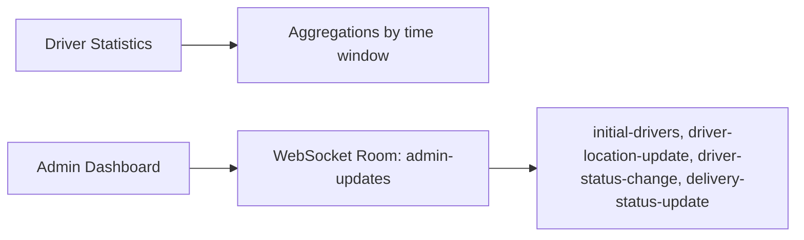

**Diagram sources**
- [driver-profile.service.ts:183-264](file://apps/api/src/modules/driver/driver-profile.service.ts#L183-L264)
- [location-broadcast.gateway.ts:61-93](file://apps/api/src/modules/driver/location-broadcast.gateway.ts#L61-L93)
- [location-broadcast.gateway.ts:163-195](file://apps/api/src/modules/driver/location-broadcast.gateway.ts#L163-L195)

**Section sources**
- [driver-profile.service.ts:183-264](file://apps/api/src/modules/driver/driver-profile.service.ts#L183-L264)
- [location-broadcast.gateway.ts:61-93](file://apps/api/src/modules/driver/location-broadcast.gateway.ts#L61-L93)
- [location-broadcast.gateway.ts:163-195](file://apps/api/src/modules/driver/location-broadcast.gateway.ts#L163-L195)

### Scheduling, Shifts, and Time-Off
- Shifts: tracked via driver sessions that record start/end times and aggregate online minutes per session.
- Time-off requests: not implemented in the analyzed codebase; would require new models and endpoints.

**Section sources**
- [driver-profile.service.ts:135-166](file://apps/api/src/modules/driver/driver-profile.service.ts#L135-L166)
- [migration.sql:94-105](file://apps/api/prisma/migrations/20260726042623_add_driver_tables/migration.sql#L94-L105)

### Security Protocols and Access Control
- JWT-based authentication for all protected endpoints.
- Role checks: driver endpoints require driver role; admin WebSocket connections require admin/manager roles.
- Supabase Edge Function enforces:
  - Valid JWT
  - driver_id matches authenticated user
  - Caller has role = 'driver'
  - Accepted delivery assignment exists for the order
  - Payload validation and clock skew guard

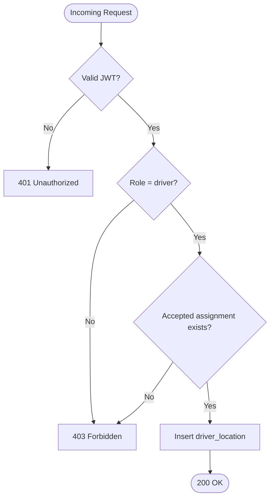

**Diagram sources**
- [index.ts (Supabase driver-location function):91-213](file://supabase/functions/driver-location/index.ts#L91-L213)
- [location-broadcast.gateway.ts:61-93](file://apps/api/src/modules/driver/location-broadcast.gateway.ts#L61-L93)

**Section sources**
- [index.ts (Supabase driver-location function):91-213](file://supabase/functions/driver-location/index.ts#L91-L213)
- [location-broadcast.gateway.ts:61-93](file://apps/api/src/modules/driver/location-broadcast.gateway.ts#L61-L93)

### GPS Integration, Navigation Assistance, and Safety Features
- GPS integration:
  - API endpoint for frequent updates with Kalman smoothing and batched writes.
  - Supabase Edge Function for direct ingestion with strict authorization and validation.
- Navigation assistance:
  - Distance calculations to pickup and customer enable ETA estimates and sorting by proximity.
- Safety features:
  - Geofence checks ensure drivers are physically near pharmacy/customer before marking arrivals.
  - Proof of delivery fields support signatures and photos.

**Section sources**
- [driver-location.service.ts:30-127](file://apps/api/src/modules/driver/driver-location.service.ts#L30-L127)
- [driver-orders.service.ts:382-433](file://apps/api/src/modules/driver/driver-orders.service.ts#L382-L433)
- [driver-orders.service.ts:435-510](file://apps/api/src/modules/driver/driver-orders.service.ts#L435-L510)
- [index.ts (Supabase driver-location function):138-173](file://supabase/functions/driver-location/index.ts#L138-L173)

### Ratings, Feedback, and Performance Evaluation
- Rating updates: upon delivery completion, customer ratings can be recorded and used to compute rolling averages.
- Feedback: delivery notes and customer feedback are stored with completed deliveries.
- Performance metrics: total deliveries, completion rate, earnings, and per-period aggregations available via statistics endpoint.

**Section sources**
- [driver-orders.service.ts:435-510](file://apps/api/src/modules/driver/driver-orders.service.ts#L435-L510)
- [driver-profile.service.ts:183-264](file://apps/api/src/modules/driver/driver-profile.service.ts#L183-L264)

### Data Model Summary
Key entities and relationships relevant to driver management:

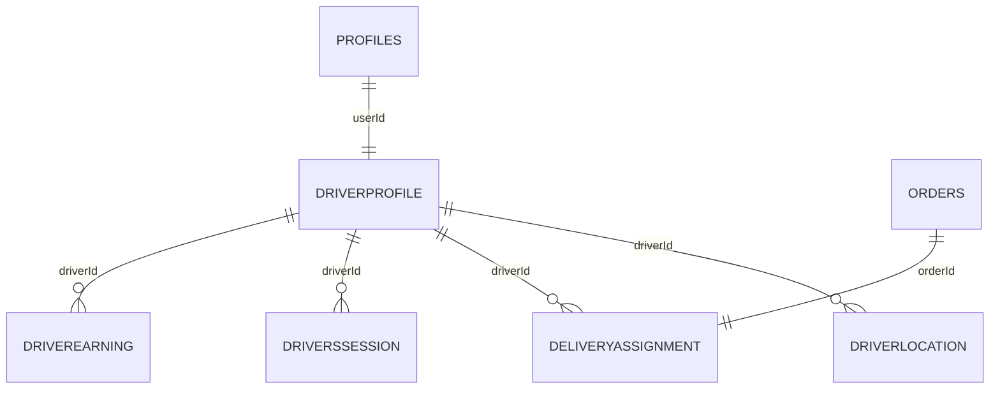

**Diagram sources**
- [migration.sql:8-125](file://apps/api/prisma/migrations/20260726042623_add_driver_tables/migration.sql#L8-L125)
- [schema.prisma:556-592](file://apps/api/prisma/schema.prisma#L556-L592)
- [schema.prisma:617-635](file://apps/api/prisma/schema.prisma#L617-L635)

**Section sources**
- [migration.sql:8-125](file://apps/api/prisma/migrations/20260726042623_add_driver_tables/migration.sql#L8-L125)
- [schema.prisma:556-592](file://apps/api/prisma/schema.prisma#L556-L592)
- [schema.prisma:617-635](file://apps/api/prisma/schema.prisma#L617-L635)

## Dependency Analysis
- Module wiring: DriverModule registers controllers and providers, exporting core services for reuse.
- Service coupling:
  - DriverController depends on AuthService, ProfileService, LocationService, OrdersService, FileUploadService.
  - ProfileService depends on LocationService for broadcasting status changes.
  - LocationService depends on WebSocket gateway for realtime events.
  - OrdersService depends on WebSocket gateway for admin notifications.
- External dependencies:
  - PrismaService for DB access.
  - SupabaseAuthService for JWT handling.
  - Supabase Edge Function for secure GPS ingestion.

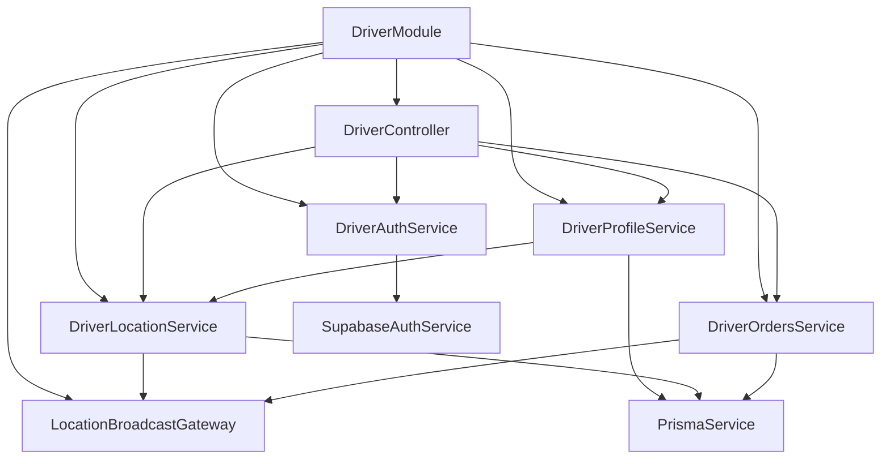

**Diagram sources**
- [driver.module.ts:1-33](file://apps/api/src/modules/driver/driver.module.ts#L1-L33)
- [driver.controller.ts:1-45](file://apps/api/src/modules/driver/driver.controller.ts#L1-L45)
- [driver-profile.service.ts:1-12](file://apps/api/src/modules/driver/driver-profile.service.ts#L1-L12)
- [driver-location.service.ts:1-25](file://apps/api/src/modules/driver/driver-location.service.ts#L1-L25)
- [driver-orders.service.ts:1-17](file://apps/api/src/modules/driver/driver-orders.service.ts#L1-L17)
- [location-broadcast.gateway.ts:1-56](file://apps/api/src/modules/driver/location-broadcast.gateway.ts#L1-L56)

**Section sources**
- [driver.module.ts:1-33](file://apps/api/src/modules/driver/driver.module.ts#L1-L33)
- [driver.controller.ts:1-45](file://apps/api/src/modules/driver/driver.controller.ts#L1-L45)

## Performance Considerations
- Location batching: reduces DB writes by grouping updates and flushing periodically or on thresholds.
- Kalman filtering: improves GPS accuracy and reduces noise without heavy computation.
- Indexes: targeted indexes on driver locations, assignments, and earnings improve query performance.
- WebSocket efficiency: rooms isolate admin vs driver updates to minimize fan-out.

[No sources needed since this section provides general guidance]

## Troubleshooting Guide
Common issues and resolutions:
- Invalid or missing JWT: ensure Authorization header is present and valid; verify token expiration and scope.
- Driver not approved: only APPROVED/ACTIVE drivers can go online; coordinate with admin approval workflow.
- Geofence errors: arrival endpoints require proximity within defined radius; confirm device GPS accuracy and coordinates.
- Duplicate or stale locations: use history endpoints to inspect timestamps; rely on batched writes and cleanup routines.
- WebSocket connection failures: verify CORS settings and token passing; ensure admin role for dashboard connections.

**Section sources**
- [driver-auth.service.ts:95-126](file://apps/api/src/modules/driver/driver-auth.service.ts#L95-L126)
- [driver-profile.service.ts:111-124](file://apps/api/src/modules/driver/driver-profile.service.ts#L111-L124)
- [driver-orders.service.ts:382-433](file://apps/api/src/modules/driver/driver-orders.service.ts#L382-L433)
- [driver-location.service.ts:337-351](file://apps/api/src/modules/driver/driver-location.service.ts#L337-L351)
- [location-broadcast.gateway.ts:61-93](file://apps/api/src/modules/driver/location-broadcast.gateway.ts#L61-L93)

## Conclusion
The driver management system provides a robust foundation for onboarding, authentication, profile and credential management, real-time GPS tracking, availability control, and end-to-end delivery workflows. It integrates secure APIs, efficient data persistence, and realtime broadcasting to support both driver apps and admin dashboards. Future enhancements may include advanced scheduling, shift management, time-off requests, and more sophisticated route optimization and zone-based dispatching.