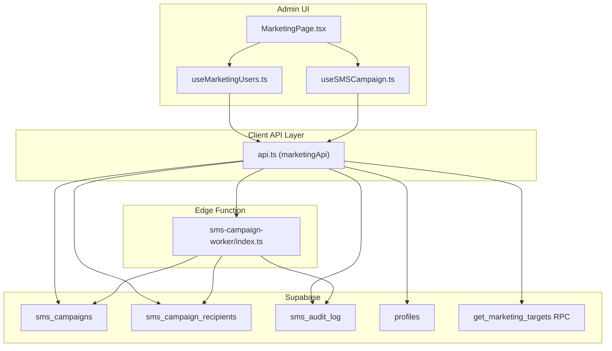
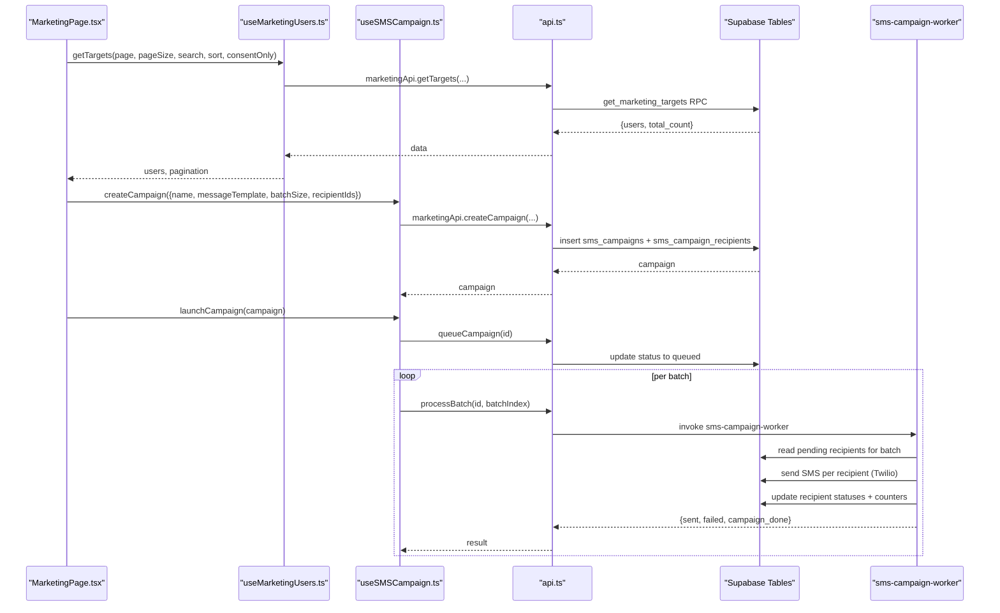
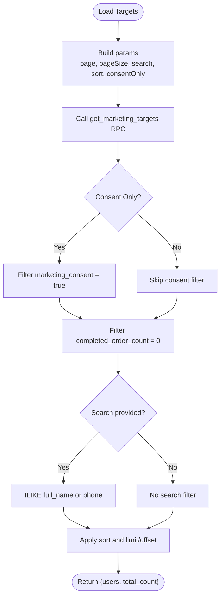
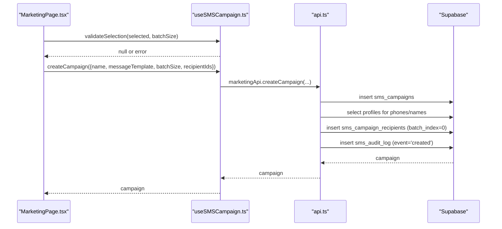
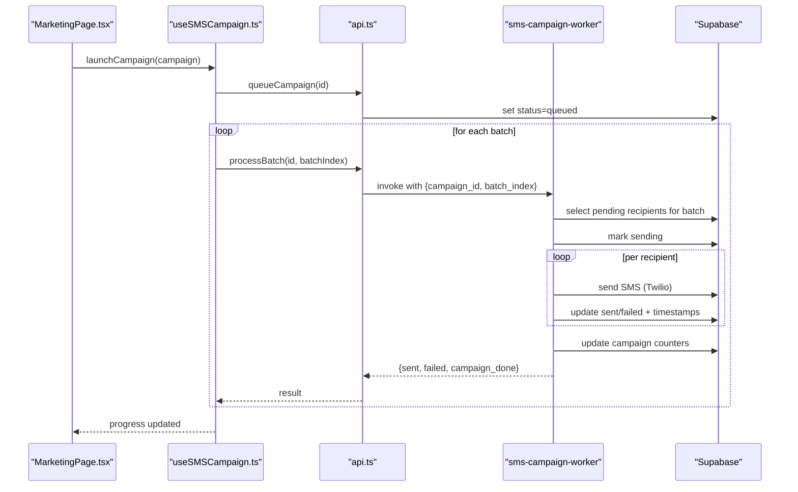
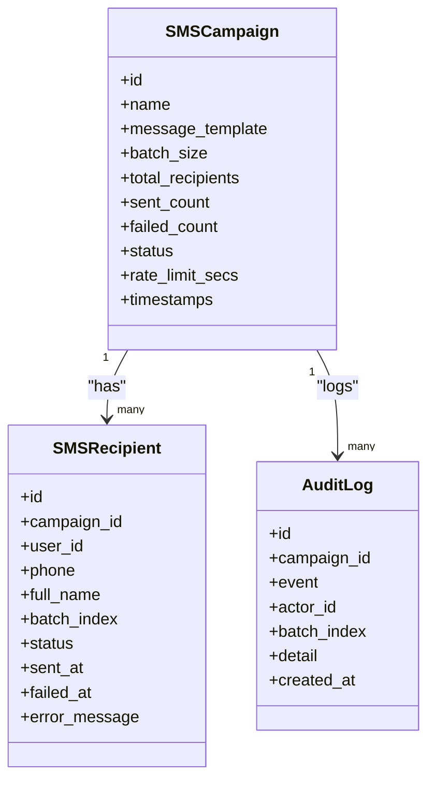
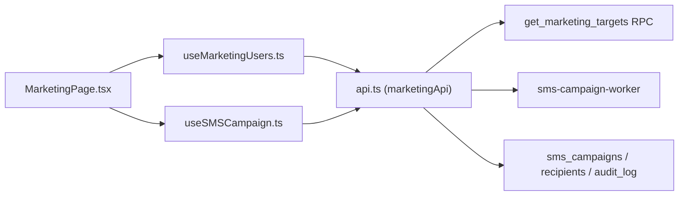

# Marketing Users

<cite>
**Referenced Files in This Document**
- [MarketingPage.tsx](file://apps/admin/src/pages/MarketingPage.tsx)
- [useMarketingUsers.ts](file://apps/admin/src/hooks/useMarketingUsers.ts)
- [useSMSCampaign.ts](file://apps/admin/src/hooks/useSMSCampaign.ts)
- [api.ts](file://apps/admin/src/lib/api.ts)
- [sms-campaign-worker/index.ts](file://supabase/functions/sms-campaign-worker/index.ts)
- [20260728120000_sms_marketing.sql](file://supabase/migrations/20260728120000_sms_marketing.sql)
</cite>

## Table of Contents
1. Introduction
2. Project Structure
3. Core Components
4. Architecture Overview
5. Detailed Component Analysis
6. Dependency Analysis
7. Performance Considerations
8. Troubleshooting Guide
9. Conclusion

## Introduction
This document explains the marketing users management system with a focus on user segmentation, campaign targeting, and audience management for SMS campaigns. It covers how to create, schedule, and track SMS campaigns; how user profiles and consent are managed; and how performance is measured through audit logs and counters. The system targets customers who have registered but have not completed an order, enabling focused re-engagement campaigns.

## Project Structure
The marketing feature spans the admin UI, client-side hooks, a Supabase-based API layer, and a serverless worker that processes batches of recipients.

**Diagram sources**
- [MarketingPage.tsx:1-660](file://apps/admin/src/pages/MarketingPage.tsx#L1-L660)
- [useMarketingUsers.ts:1-72](file://apps/admin/src/hooks/useMarketingUsers.ts#L1-L72)
- [useSMSCampaign.ts:1-193](file://apps/admin/src/hooks/useSMSCampaign.ts#L1-L193)
- [api.ts:91-347](file://apps/admin/src/lib/api.ts#L91-L347)
- [sms-campaign-worker/index.ts:1-306](file://supabase/functions/sms-campaign-worker/index.ts#L1-L306)
- [20260728120000_sms_marketing.sql:35-138](file://supabase/migrations/20260728120000_sms_marketing.sql#L35-L138)
- [20260728120000_sms_marketing.sql:156-259](file://supabase/migrations/20260728120000_sms_marketing.sql#L156-L259)

**Section sources**
- [MarketingPage.tsx:1-660](file://apps/admin/src/pages/MarketingPage.tsx#L1-L660)
- [api.ts:91-347](file://apps/admin/src/lib/api.ts#L91-L347)
- [20260728120000_sms_marketing.sql:35-138](file://supabase/migrations/20260728120000_sms_marketing.sql#L35-L138)

## Core Components
- User Targeting and Segmentation: Paginated, searchable, sortable list of eligible customers with optional consent-only filtering.
- Campaign Creation: Create a campaign with a name, message template, batch size (100 or 200), and selected recipient IDs.
- Campaign Execution: Queue a campaign and process it in batches via a serverless worker with rate limiting between batches.
- Audit and Tracking: Append-only audit log and per-campaign counters for sent and failed messages.

Key capabilities:
- Consent management via a profile flag used by the targeting query.
- Strict batch sizing enforced at both UI and API layers.
- Real-time progress tracking and ability to cancel active campaigns.

**Section sources**
- [useMarketingUsers.ts:1-72](file://apps/admin/src/hooks/useMarketingUsers.ts#L1-L72)
- [useSMSCampaign.ts:1-193](file://apps/admin/src/hooks/useSMSCampaign.ts#L1-L193)
- [api.ts:147-328](file://apps/admin/src/lib/api.ts#L147-L328)
- [20260728120000_sms_marketing.sql:35-138](file://supabase/migrations/20260728120000_sms_marketing.sql#L35-L138)

## Architecture Overview
The flow begins in the Admin UI, which uses hooks to fetch eligible users and manage campaigns. Campaign creation writes to Supabase tables and triggers execution via an Edge Function that processes recipients in batches.

**Diagram sources**
- [MarketingPage.tsx:321-377](file://apps/admin/src/pages/MarketingPage.tsx#L321-L377)
- [useSMSCampaign.ts:71-119](file://apps/admin/src/hooks/useSMSCampaign.ts#L71-L119)
- [api.ts:170-305](file://apps/admin/src/lib/api.ts#L170-L305)
- [sms-campaign-worker/index.ts:140-305](file://supabase/functions/sms-campaign-worker/index.ts#L140-L305)
- [20260728120000_sms_marketing.sql:156-259](file://supabase/migrations/20260728120000_sms_marketing.sql#L156-L259)

## Detailed Component Analysis

### User Targeting and Segmentation
- Eligibility: Customers with zero completed orders are returned by a database function that computes counts dynamically.
- Filtering: Optional consent-only filter ensures only opted-in users are included when enabled.
- Search and Sort: Supports searching by name or phone and sorting by registration date or name.
- Pagination: Page and page size are controlled by the UI hook and capped for safety.

**Diagram sources**
- [useMarketingUsers.ts:19-71](file://apps/admin/src/hooks/useMarketingUsers.ts#L19-L71)
- [api.ts:147-168](file://apps/admin/src/lib/api.ts#L147-L168)
- [20260728120000_sms_marketing.sql:156-259](file://supabase/migrations/20260728120000_sms_marketing.sql#L156-L259)

**Section sources**
- [useMarketingUsers.ts:1-72](file://apps/admin/src/hooks/useMarketingUsers.ts#L1-L72)
- [api.ts:147-168](file://apps/admin/src/lib/api.ts#L147-L168)
- [20260728120000_sms_marketing.sql:156-259](file://supabase/migrations/20260728120000_sms_marketing.sql#L156-L259)

### Campaign Creation and Audience Management
- Validation: Enforces batch size must be exactly 100 or 200 and recipient count must match.
- Recipient Mapping: Creates one recipient row per selected user with phone and name captured at creation time.
- Audit Trail: Logs campaign creation with recipient count and batch size.

**Diagram sources**
- [useSMSCampaign.ts:141-156](file://apps/admin/src/hooks/useSMSCampaign.ts#L141-L156)
- [api.ts:170-254](file://apps/admin/src/lib/api.ts#L170-L254)
- [20260728120000_sms_marketing.sql:51-117](file://supabase/migrations/20260728120000_sms_marketing.sql#L51-L117)

**Section sources**
- [useSMSCampaign.ts:141-156](file://apps/admin/src/hooks/useSMSCampaign.ts#L141-L156)
- [api.ts:170-254](file://apps/admin/src/lib/api.ts#L170-L254)
- [20260728120000_sms_marketing.sql:51-117](file://supabase/migrations/20260728120000_sms_marketing.sql#L51-L117)

### SMS Campaign Execution and Scheduling
- Lifecycle: draft → queued → running → completed | failed | cancelled.
- Batch Processing: The worker reads pending recipients for a given batch index, sends SMS, updates statuses, and increments counters.
- Rate Limiting: The UI waits between batches based on campaign.rate_limit_secs.
- Completion: When all recipients are processed, the campaign is marked completed.

**Diagram sources**
- [useSMSCampaign.ts:71-119](file://apps/admin/src/hooks/useSMSCampaign.ts#L71-L119)
- [api.ts:256-305](file://apps/admin/src/lib/api.ts#L256-L305)
- [sms-campaign-worker/index.ts:183-305](file://supabase/functions/sms-campaign-worker/index.ts#L183-L305)

**Section sources**
- [useSMSCampaign.ts:71-119](file://apps/admin/src/hooks/useSMSCampaign.ts#L71-L119)
- [api.ts:256-305](file://apps/admin/src/lib/api.ts#L256-L305)
- [sms-campaign-worker/index.ts:183-305](file://supabase/functions/sms-campaign-worker/index.ts#L183-L305)

### Audit, Performance Tracking, and Metrics
- Counters: Per-campaign sent_count and failed_count provide high-level metrics.
- Audit Log: Append-only records for created, queued, batch_started, batch_completed, completed, and cancelled events, including batch indices and details.
- Progress: UI shows percentage complete and per-batch progress during processing.

**Diagram sources**
- [api.ts:119-145](file://apps/admin/src/lib/api.ts#L119-L145)
- [20260728120000_sms_marketing.sql:51-138](file://supabase/migrations/20260728120000_sms_marketing.sql#L51-L138)

**Section sources**
- [api.ts:119-145](file://apps/admin/src/lib/api.ts#L119-L145)
- [20260728120000_sms_marketing.sql:51-138](file://supabase/migrations/20260728120000_sms_marketing.sql#L51-L138)

### Consent Management and Privacy Compliance
- Consent Flag: Profiles include a marketing_consent boolean used by the targeting query to restrict eligible users when consent-only is enabled.
- Access Control: Database policies and RPC functions enforce manager-only access for marketing operations.
- Data Protection: Phone numbers are not logged; audit entries reference recipient IDs and structured details without PII.

**Section sources**
- [20260728120000_sms_marketing.sql:35-48](file://supabase/migrations/20260728120000_sms_marketing.sql#L35-L48)
- [20260728120000_sms_marketing.sql:79-138](file://supabase/migrations/20260728120000_sms_marketing.sql#L79-L138)
- [sms-campaign-worker/index.ts:31-43](file://supabase/functions/sms-campaign-worker/index.ts#L31-L43)

### Integration Points
- SMS Provider: Twilio is used when credentials are present; otherwise, the worker runs in no-op mode for safe staging/preview usage.
- Supabase: Direct calls to RPCs and Edge Functions from the client layer bypass the main backend for marketing features.

**Section sources**
- [sms-campaign-worker/index.ts:75-127](file://supabase/functions/sms-campaign-worker/index.ts#L75-L127)
- [api.ts:91-96](file://apps/admin/src/lib/api.ts#L91-L96)

## Dependency Analysis
The marketing module depends on:
- React Query hooks for stateful data fetching and mutations.
- Axios-based API wrapper that injects auth tokens and handles 401 redirects.
- Supabase RPC and Edge Functions for secure, role-gated operations.
- Database schema enforcing constraints and RLS policies.

**Diagram sources**
- [MarketingPage.tsx:321-377](file://apps/admin/src/pages/MarketingPage.tsx#L321-L377)
- [useMarketingUsers.ts:19-71](file://apps/admin/src/hooks/useMarketingUsers.ts#L19-L71)
- [useSMSCampaign.ts:31-119](file://apps/admin/src/hooks/useSMSCampaign.ts#L31-L119)
- [api.ts:147-328](file://apps/admin/src/lib/api.ts#L147-L328)

**Section sources**
- [MarketingPage.tsx:321-377](file://apps/admin/src/pages/MarketingPage.tsx#L321-L377)
- [useSMSCampaign.ts:31-119](file://apps/admin/src/hooks/useSMSCampaign.ts#L31-L119)
- [api.ts:147-328](file://apps/admin/src/lib/api.ts#L147-L328)

## Performance Considerations
- Batch Size Constraints: Enforced at UI and API layers to keep processing predictable and efficient.
- Rate Limiting: UI respects campaign.rate_limit_secs between batches to avoid provider throttling.
- Query Optimization: Targeting uses a single RPC with computed filters and capped page sizes to reduce load.
- No-Op Mode: In environments without SMS provider credentials, the worker avoids external calls while preserving end-to-end flows.

[No sources needed since this section provides general guidance]

## Troubleshooting Guide
Common issues and resolutions:
- Invalid or expired session: The API interceptor logs out and redirects on 401 responses.
- Insufficient privileges: Worker enforces manager roles; ensure the caller has appropriate permissions.
- Missing SMS provider credentials: Worker runs in no-op mode; configure environment variables to enable real sends.
- Campaign not processable: Ensure campaign status is queued or running before invoking the worker.
- No pending recipients: Verify batch_index and recipient statuses; retry logic can reset failed recipients to pending.

**Section sources**
- [api.ts:12-29](file://apps/admin/src/lib/api.ts#L12-L29)
- [sms-campaign-worker/index.ts:148-194](file://supabase/functions/sms-campaign-worker/index.ts#L148-L194)
- [sms-campaign-worker/index.ts:219-221](file://supabase/functions/sms-campaign-worker/index.ts#L219-L221)

## Conclusion
The marketing users management system provides a robust, consent-aware pipeline for segmenting eligible customers, creating targeted SMS campaigns, and executing them in controlled batches with comprehensive auditing. Its design emphasizes security, compliance, and operational clarity through strict validation, role-based access, and append-only logs. For advanced use cases such as A/B testing, conversion tracking, ROI measurement, automated workflows, and integrations with email or social channels, additional modules can extend this foundation using the same patterns of RPCs, Edge Functions, and audit-driven observability.

[No sources needed since this section summarizes without analyzing specific files]