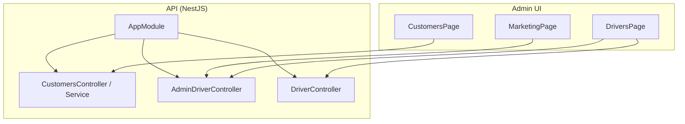
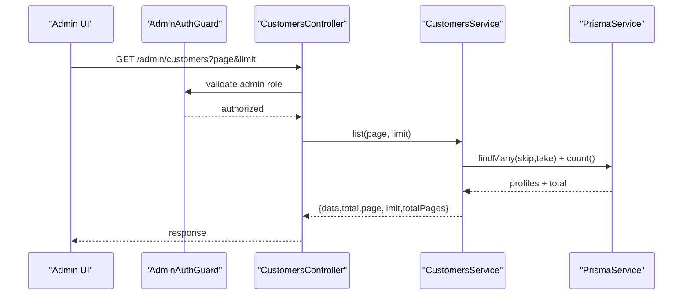
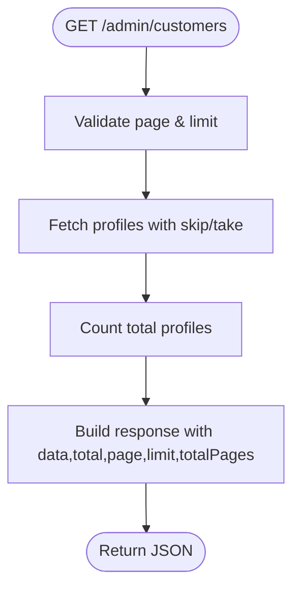
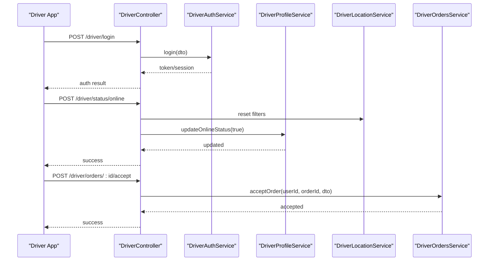
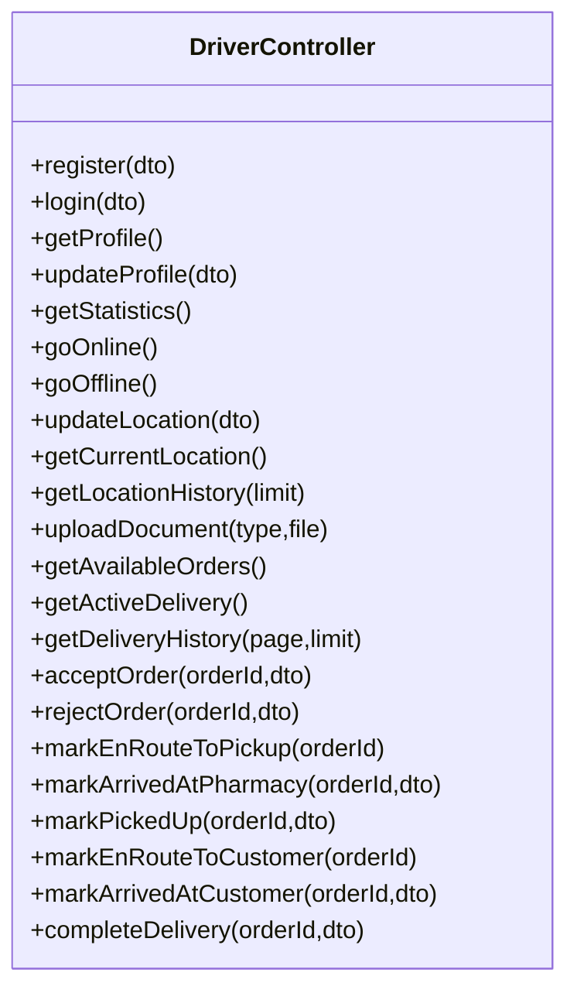
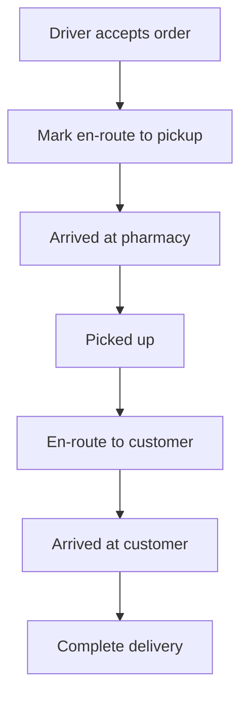
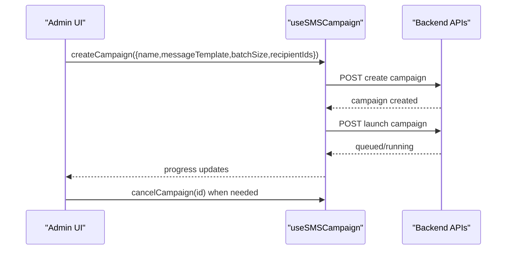
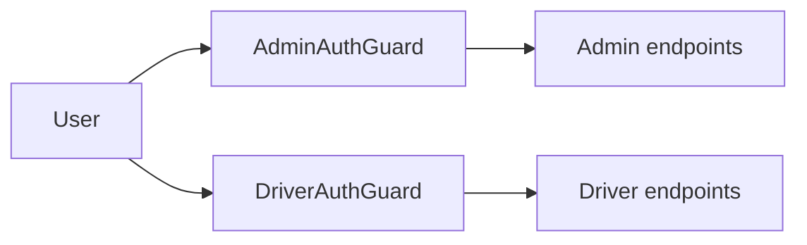
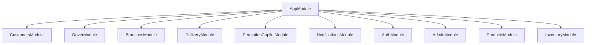

# User Management

<cite>
**Referenced Files in This Document**
- [app.module.ts](file://apps/api/src/app.module.ts)
- [customers.controller.ts](file://apps/api/src/modules/customers/customers.controller.ts)
- [customers.service.ts](file://apps/api/src/modules/customers/customers.service.ts)
- [admin-driver.controller.ts](file://apps/api/src/modules/driver/admin-driver.controller.ts)
- [driver.controller.ts](file://apps/api/src/modules/driver/driver.controller.ts)
- [CustomersPage.tsx](file://apps/admin/src/pages/CustomersPage.tsx)
- [DriversPage.tsx](file://apps/admin/src/pages/DriversPage.tsx)
- [MarketingPage.tsx](file://apps/admin/src/pages/MarketingPage.tsx)
</cite>

## Table of Contents
1. [Introduction](#introduction)
2. [Project Structure](#project-structure)
3. [Core Components](#core-components)
4. [Architecture Overview](#architecture-overview)
5. [Detailed Component Analysis](#detailed-component-analysis)
6. [Dependency Analysis](#dependency-analysis)
7. [Performance Considerations](#performance-considerations)
8. [Troubleshooting Guide](#troubleshooting-guide)
9. [Conclusion](#conclusion)

## Introduction
This document explains the user management system with a focus on:
- Customer administration and profile visibility
- Driver assignment workflows, availability, and performance monitoring
- Marketing users interface for campaign management and segmentation
It also covers role-based access, pagination, search/filtering, and real-time status updates where implemented.

## Project Structure
The system is organized into an API (NestJS) and an Admin UI (React). The API exposes modules for customers, drivers, and marketing-related operations. The Admin UI provides pages to manage customers, drivers, and SMS marketing campaigns.

**Diagram sources**
- [app.module.ts:1-30](file://apps/api/src/app.module.ts#L1-L30)
- [customers.controller.ts:1-15](file://apps/api/src/modules/customers/customers.controller.ts#L1-L15)
- [admin-driver.controller.ts:1-56](file://apps/api/src/modules/driver/admin-driver.controller.ts#L1-L56)
- [driver.controller.ts:1-235](file://apps/api/src/modules/driver/driver.controller.ts#L1-L235)
- [CustomersPage.tsx:1-31](file://apps/admin/src/pages/CustomersPage.tsx#L1-L31)
- [DriversPage.tsx:1-389](file://apps/admin/src/pages/DriversPage.tsx#L1-L389)
- [MarketingPage.tsx:1-660](file://apps/admin/src/pages/MarketingPage.tsx#L1-L660)

**Section sources**
- [app.module.ts:1-30](file://apps/api/src/app.module.ts#L1-L30)

## Core Components
- Customers module: paginated listing of customer profiles via admin endpoints.
- Drivers module: driver lifecycle (register/login), profile management, online/offline status, location tracking, order workflow, and admin oversight (online drivers, location history, cleanup).
- Marketing page: user targeting, batch selection, campaign creation, launch/cancel, progress, and audit log.

Key capabilities present in this codebase:
- Role-based permissions: Admin guard protects customer and driver admin endpoints; driver guard protects driver endpoints.
- Pagination: customers list returns total and totalPages; drivers page implements client-side pagination; marketing targets support per-page sizing and pagination.
- Search and filtering: drivers page supports status filter; marketing page supports search, sort, consent-only filter.
- Real-time status: driver online/offline endpoints update availability; admin can query online drivers and location history.

**Section sources**
- [customers.controller.ts:1-15](file://apps/api/src/modules/customers/customers.controller.ts#L1-L15)
- [customers.service.ts:1-27](file://apps/api/src/modules/customers/customers.service.ts#L1-L27)
- [driver.controller.ts:1-235](file://apps/api/src/modules/driver/driver.controller.ts#L1-L235)
- [admin-driver.controller.ts:1-56](file://apps/api/src/modules/driver/admin-driver.controller.ts#L1-L56)
- [DriversPage.tsx:1-389](file://apps/admin/src/pages/DriversPage.tsx#L1-L389)
- [MarketingPage.tsx:1-660](file://apps/admin/src/pages/MarketingPage.tsx#L1-L660)

## Architecture Overview
The Admin UI calls protected API endpoints guarded by role-based guards. The NestJS application wires modules at startup. Customer listing uses Prisma to fetch profiles with pagination. Driver flows include authentication, profile updates, status toggles, location updates, and order lifecycle transitions. Admin driver endpoints expose online drivers and location history.

**Diagram sources**
- [customers.controller.ts:1-15](file://apps/api/src/modules/customers/customers.controller.ts#L1-L15)
- [customers.service.ts:1-27](file://apps/api/src/modules/customers/customers.service.ts#L1-L27)
- [app.module.ts:1-30](file://apps/api/src/app.module.ts#L1-L30)

## Detailed Component Analysis

### Customer Administration
- Endpoint: GET /admin/customers?page&limit
- Behavior: Returns paginated customer profiles with total count and computed totalPages.
- Permissions: Protected by AdminAuthGuard.
- UI: CustomersPage queries the endpoint and renders results with loading/error states.

**Diagram sources**
- [customers.controller.ts:1-15](file://apps/api/src/modules/customers/customers.controller.ts#L1-L15)
- [customers.service.ts:1-27](file://apps/api/src/modules/customers/customers.service.ts#L1-L27)

**Section sources**
- [customers.controller.ts:1-15](file://apps/api/src/modules/customers/customers.controller.ts#L1-L15)
- [customers.service.ts:1-27](file://apps/api/src/modules/customers/customers.service.ts#L1-L27)
- [CustomersPage.tsx:1-31](file://apps/admin/src/pages/CustomersPage.tsx#L1-L31)

### Driver Management
- Authentication and Profile:
  - POST /driver/register, POST /driver/login
  - GET/PATCH /driver/profile
  - GET /driver/statistics
- Availability and Location:
  - POST /driver/status/online, POST /driver/status/offline
  - POST /driver/location, GET /driver/location/current, GET /driver/location/history?limit
- Order Workflow:
  - GET /driver/orders/available, GET /driver/orders/active, GET /driver/orders/history?page&limit
  - Accept/Reject order and state transitions: en-route pickup, arrived pharmacy, picked up, en-route customer, arrived customer, complete delivery
- Documents:
  - POST /driver/documents/upload/:type with file upload and profile update

**Diagram sources**
- [driver.controller.ts:1-235](file://apps/api/src/modules/driver/driver.controller.ts#L1-L235)

**Diagram sources**
- [driver.controller.ts:1-235](file://apps/api/src/modules/driver/driver.controller.ts#L1-L235)

**Section sources**
- [driver.controller.ts:1-235](file://apps/api/src/modules/driver/driver.controller.ts#L1-L235)

### Driver Assignment Workflows and Performance Monitoring
- Assignment flow:
  - Drivers retrieve available orders and accept or reject them.
  - After acceptance, drivers transition through predefined states (en-route to pickup, arrived at pharmacy, picked up, en-route to customer, arrived at customer, complete).
- Performance monitoring:
  - Driver statistics endpoint provides aggregated metrics.
  - Admin can view online drivers and their locations, and location history for auditing.

**Diagram sources**
- [driver.controller.ts:153-233](file://apps/api/src/modules/driver/driver.controller.ts#L153-L233)

**Section sources**
- [driver.controller.ts:153-233](file://apps/api/src/modules/driver/driver.controller.ts#L153-L233)

### Marketing Users Interface (Campaign Management and Segmentation)
- Targeting:
  - Searchable, sortable, filterable table of eligible users (e.g., consent-only).
  - Per-page size options and pagination controls.
- Batch selection:
  - Hard constraint: exactly 100 or 200 recipients per campaign.
- Campaign lifecycle:
  - Create campaign with name and message template.
  - Launch, cancel active batches, view progress, and audit logs.

**Diagram sources**
- [MarketingPage.tsx:125-233](file://apps/admin/src/pages/MarketingPage.tsx#L125-L233)
- [MarketingPage.tsx:321-377](file://apps/admin/src/pages/MarketingPage.tsx#L321-L377)

**Section sources**
- [MarketingPage.tsx:1-660](file://apps/admin/src/pages/MarketingPage.tsx#L1-L660)

### Role-Based Permissions
- Admin routes:
  - /admin/customers protected by AdminAuthGuard.
  - /admin/drivers/* protected by AdminAuthGuard.
- Driver routes:
  - /driver/* protected by DriverAuthGuard.

**Diagram sources**
- [customers.controller.ts:1-15](file://apps/api/src/modules/customers/customers.controller.ts#L1-L15)
- [admin-driver.controller.ts:1-56](file://apps/api/src/modules/driver/admin-driver.controller.ts#L1-L56)
- [driver.controller.ts:1-235](file://apps/api/src/modules/driver/driver.controller.ts#L1-L235)

**Section sources**
- [customers.controller.ts:1-15](file://apps/api/src/modules/customers/customers.controller.ts#L1-L15)
- [admin-driver.controller.ts:1-56](file://apps/api/src/modules/driver/admin-driver.controller.ts#L1-L56)
- [driver.controller.ts:1-235](file://apps/api/src/modules/driver/driver.controller.ts#L1-L235)

### Bulk Operations and Export Functionality
- Bulk operations:
  - Marketing campaign creation requires selecting exactly 100 or 200 recipients; bulk selection and “Select page” are supported in the UI.
- Export functionality:
  - Not implemented in the referenced files.

**Section sources**
- [MarketingPage.tsx:125-233](file://apps/admin/src/pages/MarketingPage.tsx#L125-L233)
- [MarketingPage.tsx:321-377](file://apps/admin/src/pages/MarketingPage.tsx#L321-L377)

### Search and Filtering Capabilities
- Drivers page:
  - Status filter (All, PENDING_APPROVAL, APPROVED, ACTIVE, SUSPENDED, REJECTED).
- Marketing page:
  - Text search by name or phone.
  - Sort by registration date or name.
  - Consent-only toggle.

**Section sources**
- [DriversPage.tsx:1-389](file://apps/admin/src/pages/DriversPage.tsx#L1-L389)
- [MarketingPage.tsx:405-450](file://apps/admin/src/pages/MarketingPage.tsx#L405-L450)

### Pagination Handling
- Customers:
  - Server-side pagination with page and limit parameters; response includes total and totalPages.
- Drivers:
  - Client-side pagination with page state and navigation controls.
- Marketing:
  - Per-page size selector (50/100/200) and page navigation.

**Section sources**
- [customers.service.ts:1-27](file://apps/api/src/modules/customers/customers.service.ts#L1-L27)
- [DriversPage.tsx:244-389](file://apps/admin/src/pages/DriversPage.tsx#L244-L389)
- [MarketingPage.tsx:523-560](file://apps/admin/src/pages/MarketingPage.tsx#L523-L560)

### Real-Time Status Updates for Active Drivers and Customers
- Drivers:
  - Online/offline endpoints update availability; admin can query online drivers and location history.
- Customers:
  - No real-time status endpoints identified in the referenced files.

**Section sources**
- [admin-driver.controller.ts:14-56](file://apps/api/src/modules/driver/admin-driver.controller.ts#L14-L56)
- [driver.controller.ts:83-119](file://apps/api/src/modules/driver/driver.controller.ts#L83-L119)

## Dependency Analysis
The application composes multiple modules under a single root module. Customer and driver modules are imported and registered alongside other features.

**Diagram sources**
- [app.module.ts:1-30](file://apps/api/src/app.module.ts#L1-L30)

**Section sources**
- [app.module.ts:1-30](file://apps/api/src/app.module.ts#L1-L30)

## Performance Considerations
- Use server-side pagination for large datasets (customers list already does this).
- Limit location history queries with a configurable limit to avoid heavy payloads.
- Avoid unnecessary re-renders in the Admin UI by leveraging query caching and selective invalidation.
- For marketing campaigns, enforce batch sizes to control processing load.

[No sources needed since this section provides general guidance]

## Troubleshooting Guide
- Unauthorized access:
  - Ensure requests to /admin/* include valid admin credentials; endpoints are guarded by AdminAuthGuard.
- Driver not found:
  - Admin location history endpoint validates driver existence and throws a not-found error if missing.
- Validation errors:
  - Driver document uploads require allowed types and a file payload; otherwise, a bad request error is returned.
- Campaign creation constraints:
  - Marketing campaign creation enforces exact batch sizes (100 or 200); ensure selection matches before submitting.

**Section sources**
- [admin-driver.controller.ts:24-40](file://apps/api/src/modules/driver/admin-driver.controller.ts#L24-L40)
- [driver.controller.ts:123-149](file://apps/api/src/modules/driver/driver.controller.ts#L123-L149)
- [MarketingPage.tsx:125-233](file://apps/admin/src/pages/MarketingPage.tsx#L125-L233)

## Conclusion
The user management system provides:
- Secure, role-gated endpoints for customer and driver administration.
- Robust driver lifecycle management including availability, location tracking, and order workflow transitions.
- A marketing interface that enables targeted SMS campaigns with strict batching rules and full auditability.
Pagination, search, and filtering are implemented across relevant pages. Real-time status updates are supported for drivers. Export functionality is not present in the analyzed files.

[No sources needed since this section summarizes without analyzing specific files]