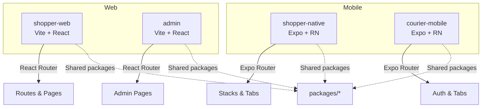
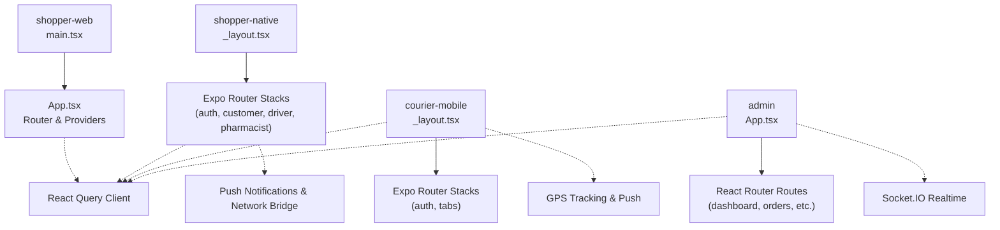
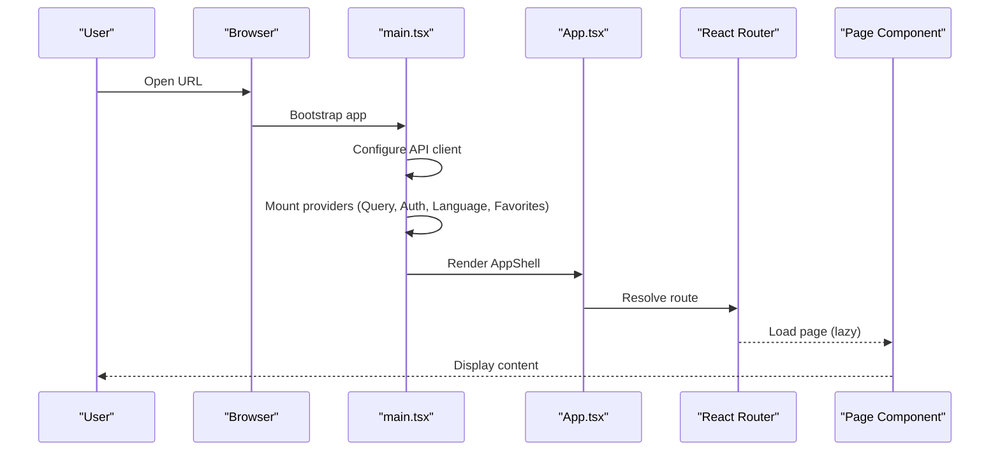
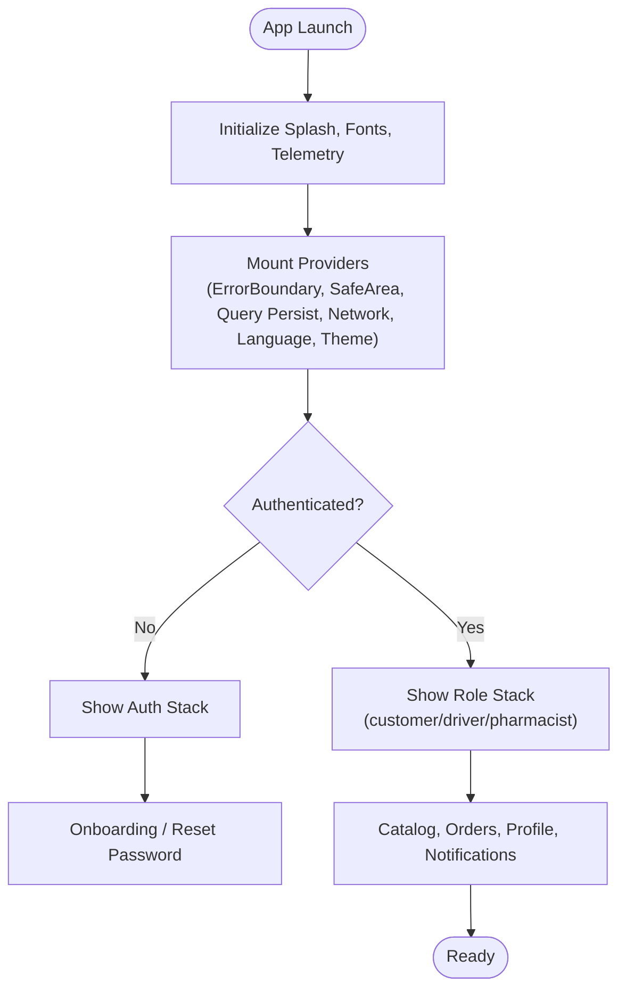
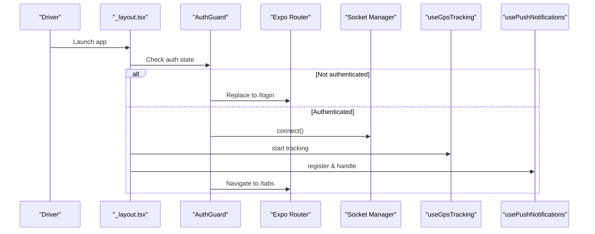
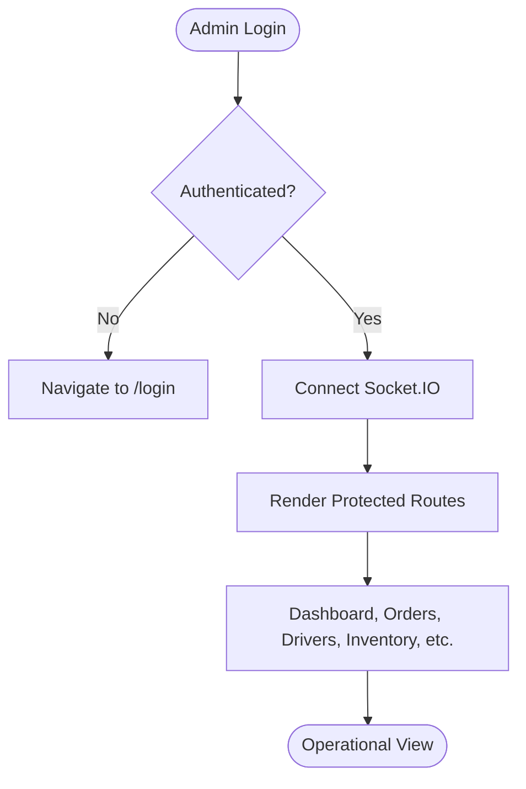
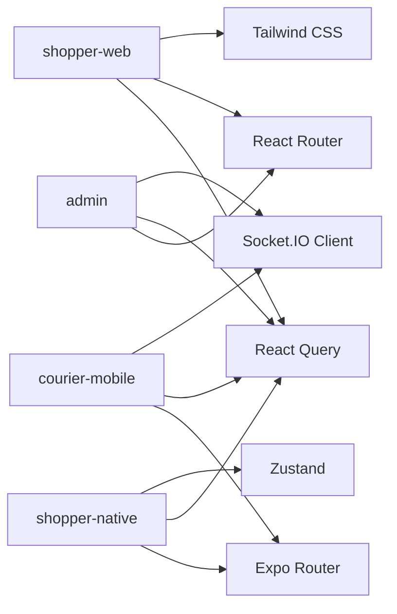

# Frontend Applications

<cite>
**Referenced Files in This Document**
- [apps/shopper-web/package.json](file://apps/shopper-web/package.json)
- [apps/shopper-web/src/main.tsx](file://apps/shopper-web/src/main.tsx)
- [apps/shopper-web/src/app/App.tsx](file://apps/shopper-web/src/app/App.tsx)
- [apps/shopper-native/package.json](file://apps/shopper-native/package.json)
- [apps/shopper-native/app/_layout.tsx](file://apps/shopper-native/app/_layout.tsx)
- [apps/courier-mobile/package.json](file://apps/courier-mobile/package.json)
- [apps/courier-mobile/app/_layout.tsx](file://apps/courier-mobile/app/_layout.tsx)
- [apps/admin/package.json](file://apps/admin/package.json)
- [apps/admin/src/App.tsx](file://apps/admin/src/App.tsx)
</cite>

## Table of Contents
1. Introduction
2. Project Structure
3. Core Components
4. Architecture Overview
5. Detailed Component Analysis
6. Dependency Analysis
7. Performance Considerations
8. Troubleshooting Guide
9. Conclusion

## Introduction
This document provides comprehensive documentation for the frontend applications in the United Pharmacy ecosystem. It covers:
- Shopper web application (React + Vite): component architecture, state management with Zustand and React Query, routing structure, responsive design patterns, performance optimizations, accessibility considerations, and testing strategies.
- Mobile applications built with Expo and React Native: navigation patterns using Expo Router, platform-specific features, offline capabilities via React Query persistence, push notifications, GPS tracking, and cross-platform compatibility.
- Admin dashboard for pharmacy operations: role-based access, real-time updates via Socket.IO, and operational pages.
- Courier mobile app for delivery drivers: authentication guards, live location tracking, push notifications, and tabbed navigation.
- Shared UI components and design system implementation across platforms, including shared packages for UI and domain logic.

## Project Structure
The frontend is organized as a multi-app monorepo under apps/:
- apps/shopper-web: Web storefront and admin portal within the same app, powered by React Router and Vite.
- apps/shopper-native: Cross-platform mobile app for shoppers, pharmacists, and drivers using Expo Router and React Native.
- apps/courier-mobile: Dedicated driver app using Expo Router, React Query, and socket-based live updates.
- apps/admin: Desktop admin dashboard with React Router, Tailwind CSS, and real-time features.

**Diagram sources**
- [apps/shopper-web/src/app/App.tsx:1-196](file://apps/shopper-web/src/app/App.tsx#L1-L196)
- [apps/shopper-native/app/_layout.tsx:1-292](file://apps/shopper-native/app/_layout.tsx#L1-L292)
- [apps/courier-mobile/app/_layout.tsx:1-124](file://apps/courier-mobile/app/_layout.tsx#L1-L124)
- [apps/admin/src/App.tsx:1-69](file://apps/admin/src/App.tsx#L1-L69)

**Section sources**
- [apps/shopper-web/package.json:1-26](file://apps/shopper-web/package.json#L1-L26)
- [apps/shopper-native/package.json:1-104](file://apps/shopper-native/package.json#L1-L104)
- [apps/courier-mobile/package.json:1-66](file://apps/courier-mobile/package.json#L1-L66)
- [apps/admin/package.json:1-43](file://apps/admin/package.json#L1-L43)

## Core Components
- Shopper Web App
  - Entry bootstraps API client configuration, React Query provider, language/auth/favorites contexts, error boundary, and renders the routed application shell.
  - Routing includes public routes, catalog-scoped routes, driver area, and protected admin sections with role-based guards.
  - Uses React Query for data fetching and caching; integrates i18n and environment configuration.

- Shopper Native App
  - Root layout sets up splash screen, fonts, error boundaries, React Query persistence, network bridge, language provider, theme provider, auth provider, notification sync, push registration, and Expo Router stacks for different roles.
  - Provides global toasts, banners, and sheets for UX feedback.

- Courier Mobile App
  - Root layout configures React Query persistence, theme provider, safe area, status bar, and Expo Router stacks for auth and tabs.
  - Includes an authentication guard that redirects unauthenticated users and connects a socket when authenticated.
  - Bootstraps GPS tracking and push notifications.

- Admin Dashboard
  - Centralized routing with private routes protecting admin-only pages.
  - Connects/disconnects a socket based on authentication state.
  - Organizes pages for dashboard, map, drivers, orders, branches, inventory, products, customers, notifications, and marketing.

**Section sources**
- [apps/shopper-web/src/main.tsx:1-60](file://apps/shopper-web/src/main.tsx#L1-L60)
- [apps/shopper-web/src/app/App.tsx:1-196](file://apps/shopper-web/src/app/App.tsx#L1-L196)
- [apps/shopper-native/app/_layout.tsx:1-292](file://apps/shopper-native/app/_layout.tsx#L1-L292)
- [apps/courier-mobile/app/_layout.tsx:1-124](file://apps/courier-mobile/app/_layout.tsx#L1-L124)
- [apps/admin/src/App.tsx:1-69](file://apps/admin/src/App.tsx#L1-L69)

## Architecture Overview
High-level architecture shows how each app initializes providers, manages routing, and interacts with shared services like authentication, notifications, and real-time sockets.

**Diagram sources**
- [apps/shopper-web/src/main.tsx:1-60](file://apps/shopper-web/src/main.tsx#L1-L60)
- [apps/shopper-web/src/app/App.tsx:1-196](file://apps/shopper-web/src/app/App.tsx#L1-L196)
- [apps/shopper-native/app/_layout.tsx:1-292](file://apps/shopper-native/app/_layout.tsx#L1-L292)
- [apps/courier-mobile/app/_layout.tsx:1-124](file://apps/courier-mobile/app/_layout.tsx#L1-L124)
- [apps/admin/src/App.tsx:1-69](file://apps/admin/src/App.tsx#L1-L69)

## Detailed Component Analysis

### Shopper Web Application
- Initialization and Providers
  - Configures API client base URLs, mounts React Query provider, language context, auth context, favorites context, error boundary, and bootstrap overlays.
  - Starts Web Vitals collection early for performance monitoring.

- Routing and Role-Based Access
  - Public routes for login/register/auth callback/suspended states.
  - Catalog-scoped routes for browsing products, categories, offers, cart, checkout, and support pages.
  - Driver route protected by role checks.
  - Admin routes grouped under /admin with nested pages and role-based protection for manager/pharmacist/admin.

- State Management
  - React Query for server state caching and synchronization.
  - Contexts for auth, catalog, cart, search, language, and favorites.
  - Suspense and lazy loading for code splitting and improved initial load.

- Responsive Design and Accessibility
  - Uses Tailwind CSS utilities for responsive layouts.
  - MotionConfig respects user reduced motion preferences.
  - Error boundaries and loading skeletons improve perceived performance and resilience.

**Diagram sources**
- [apps/shopper-web/src/main.tsx:1-60](file://apps/shopper-web/src/main.tsx#L1-L60)
- [apps/shopper-web/src/app/App.tsx:1-196](file://apps/shopper-web/src/app/App.tsx#L1-L196)

**Section sources**
- [apps/shopper-web/src/main.tsx:1-60](file://apps/shopper-web/src/main.tsx#L1-L60)
- [apps/shopper-web/src/app/App.tsx:1-196](file://apps/shopper-web/src/app/App.tsx#L1-L196)
- [apps/shopper-web/package.json:1-26](file://apps/shopper-web/package.json#L1-L26)

### Shopper Native Application
- Bootstrapping and Global Services
  - Prevents auto-hide splash, loads fonts, installs crash enrichment and query telemetry, starts offline queue runner.
  - Wraps app with error boundaries, gesture handler root, safe area provider, React Query persist provider, network bridge, language provider, and theme provider.

- Navigation and Role Segments
  - Uses Expo Router stacks for auth modals, customer/driver/pharmacist groups, and dedicated screens like onboarding and reset password.
  - Provides notification banner and app sheet for global UX.

- Authentication, Notifications, and Offline
  - AuthProvider wraps navigation and protects routes.
  - Notification sync and push registration are initialized conditionally based on user presence.
  - Persisted React Query client ensures offline-first behavior and resumes mutations after hydration.

**Diagram sources**
- [apps/shopper-native/app/_layout.tsx:1-292](file://apps/shopper-native/app/_layout.tsx#L1-L292)
- [apps/shopper-native/package.json:1-104](file://apps/shopper-native/package.json#L1-L104)

**Section sources**
- [apps/shopper-native/app/_layout.tsx:1-292](file://apps/shopper-native/app/_layout.tsx#L1-L292)
- [apps/shopper-native/package.json:1-104](file://apps/shopper-native/package.json#L1-L104)

### Courier Mobile Application
- Bootstrapping and Guards
  - Loads fonts, hides splash safely, mounts error boundary, theme provider, safe area, and React Query persist provider.
  - Authentication guard redirects to login if not authenticated or token missing; otherwise navigates to tabs and connects socket.

- Live Features
  - GPS tracking hook runs continuously for active sessions.
  - Push notifications hook registers and handles incoming events.
  - Tab stack organizes core driver workflows.

**Diagram sources**
- [apps/courier-mobile/app/_layout.tsx:1-124](file://apps/courier-mobile/app/_layout.tsx#L1-L124)
- [apps/courier-mobile/package.json:1-66](file://apps/courier-mobile/package.json#L1-L66)

**Section sources**
- [apps/courier-mobile/app/_layout.tsx:1-124](file://apps/courier-mobile/app/_layout.tsx#L1-L124)
- [apps/courier-mobile/package.json:1-66](file://apps/courier-mobile/package.json#L1-L66)

### Admin Dashboard
- Routing and Protection
  - Defines private routes wrapping Layout and redirecting unauthenticated users to login.
  - Organizes pages for dashboard, map, drivers, orders, branches, inventory, products, customers, notifications, and marketing.

- Real-Time Updates
  - Connects/disconnects socket based on authentication state to provide live updates for operations.

**Diagram sources**
- [apps/admin/src/App.tsx:1-69](file://apps/admin/src/App.tsx#L1-L69)
- [apps/admin/package.json:1-43](file://apps/admin/package.json#L1-L43)

**Section sources**
- [apps/admin/src/App.tsx:1-69](file://apps/admin/src/App.tsx#L1-L69)
- [apps/admin/package.json:1-43](file://apps/admin/package.json#L1-L43)

## Dependency Analysis
- Shopper Web
  - Dependencies include React, React DOM, React Router, React Query, Tailwind CSS, and various libraries for virtualization, charts, and barcode scanning.
  - Dev dependencies include Vite, TypeScript, and Tailwind tooling.

- Shopper Native
  - Dependencies include Expo SDK, React Native, Expo Router, React Query with persistence, Zustand, i18next, maps, camera, location, notifications, and UI primitives.
  - Testing tools include Jest and React Native Testing Library.

- Courier Mobile
  - Dependencies include Expo SDK, React Native, Expo Router, React Query with persistence, Zustand, socket.io-client, maps, location, notifications, and UI primitives.

- Admin
  - Dependencies include React, React Router, React Query, Tailwind CSS, Leaflet/React Leaflet for maps, Recharts, Socket.IO client, Zod, and Zustand.

**Diagram sources**
- [apps/shopper-web/package.json:1-26](file://apps/shopper-web/package.json#L1-L26)
- [apps/shopper-native/package.json:1-104](file://apps/shopper-native/package.json#L1-L104)
- [apps/courier-mobile/package.json:1-66](file://apps/courier-mobile/package.json#L1-L66)
- [apps/admin/package.json:1-43](file://apps/admin/package.json#L1-L43)

**Section sources**
- [apps/shopper-web/package.json:1-26](file://apps/shopper-web/package.json#L1-L26)
- [apps/shopper-native/package.json:1-104](file://apps/shopper-native/package.json#L1-L104)
- [apps/courier-mobile/package.json:1-66](file://apps/courier-mobile/package.json#L1-L66)
- [apps/admin/package.json:1-43](file://apps/admin/package.json#L1-L43)

## Performance Considerations
- Code Splitting and Lazy Loading
  - Shopper web uses lazy imports for heavy modules and Suspense fallbacks to reduce initial bundle size and improve time-to-interactive.

- Data Fetching and Caching
  - React Query is used across all apps for efficient caching, background refetching, and optimistic updates.
  - Persisted React Query clients in native apps ensure offline-first behavior and resume mutations after restart.

- Rendering Optimization
  - Virtualization libraries (e.g., react-virtuoso) in the web app optimize long lists.
  - FlashList in the native app improves list performance.

- Real-Time Efficiency
  - Socket connections are managed per session (e.g., courier and admin apps connect only when authenticated).

- Observability
  - Web Vitals collection in the shopper web app tracks performance metrics.
  - Crash enrichment and query telemetry in the native app aid debugging and monitoring.

[No sources needed since this section provides general guidance]

## Troubleshooting Guide
- Common Issues and Mitigations
  - Duplicate roots during HMR: The web app guards against multiple createRoot calls to avoid race conditions.
  - Splash screen not hiding: Safety timeouts ensure splash hides even if async tasks fail.
  - Authentication redirects: Both native apps use guards to enforce login flows and protect routes.
  - Socket connectivity: Ensure socket connection is established post-authentication in apps that rely on real-time updates.
  - Offline behavior: Persisted React Query clients help maintain functionality offline; verify persister configuration and mutation resumption.

- Debugging Tips
  - Use devtools for React Query to inspect cache and queries.
  - Enable logging in development for global error handlers and telemetry.
  - Validate environment variables for API bases and feature flags.

**Section sources**
- [apps/shopper-web/src/main.tsx:1-60](file://apps/shopper-web/src/main.tsx#L1-L60)
- [apps/shopper-native/app/_layout.tsx:1-292](file://apps/shopper-native/app/_layout.tsx#L1-L292)
- [apps/courier-mobile/app/_layout.tsx:1-124](file://apps/courier-mobile/app/_layout.tsx#L1-L124)
- [apps/admin/src/App.tsx:1-69](file://apps/admin/src/App.tsx#L1-L69)

## Conclusion
The United Pharmacy frontend ecosystem delivers a cohesive, scalable set of applications:
- Shopper web provides a robust, accessible storefront and integrated admin portal with strong data caching and performance optimizations.
- Shopper native offers a cross-platform experience with offline-first capabilities, rich notifications, and role-based navigation.
- Courier mobile focuses on driver workflows with live location tracking, push notifications, and secure routing.
- Admin dashboard centralizes pharmacy operations with real-time updates and role-based access.

Shared packages enable consistent UI and domain logic across platforms, while standardized state management and networking patterns ensure maintainability and performance.

[No sources needed since this section summarizes without analyzing specific files]