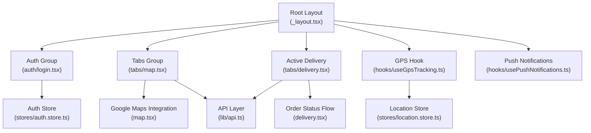
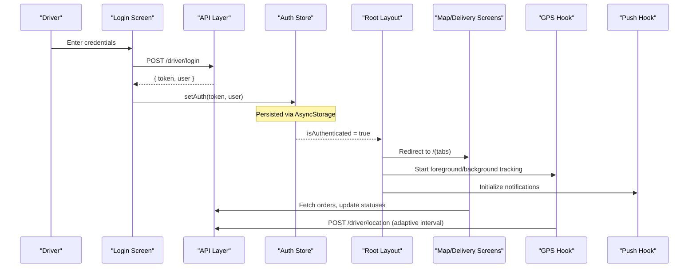
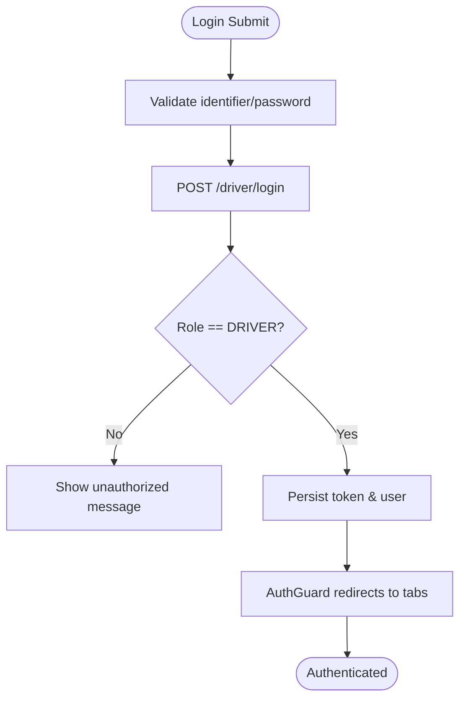
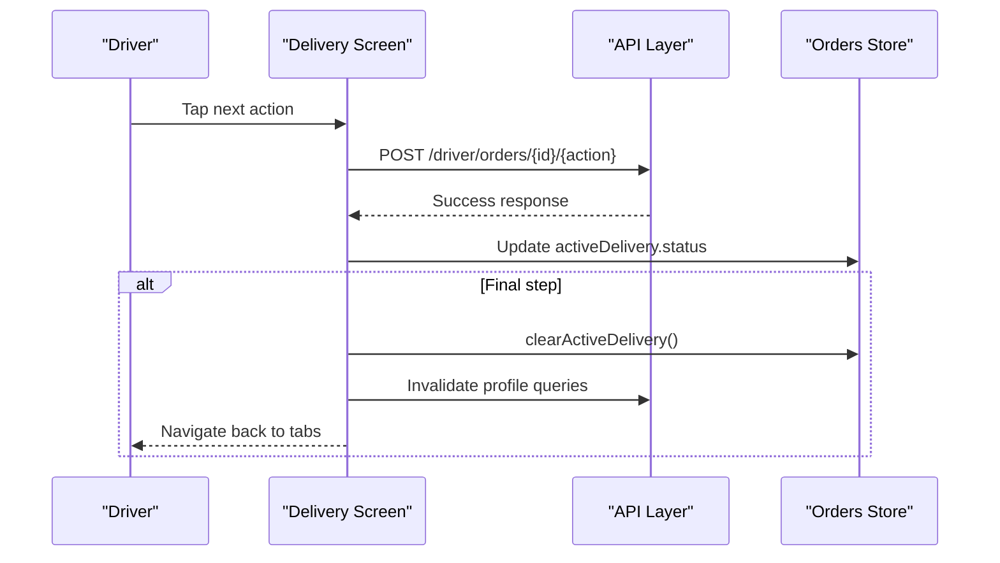
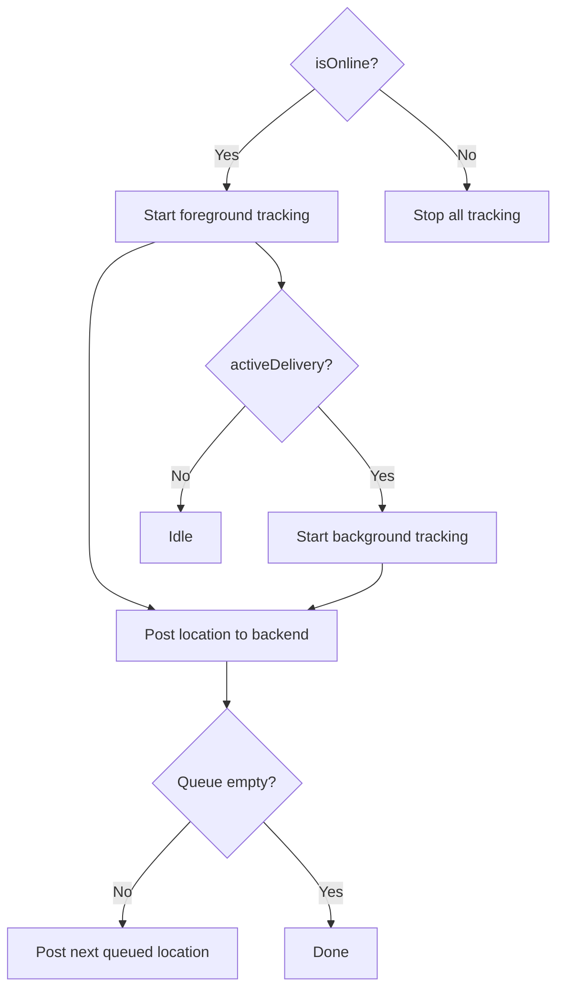
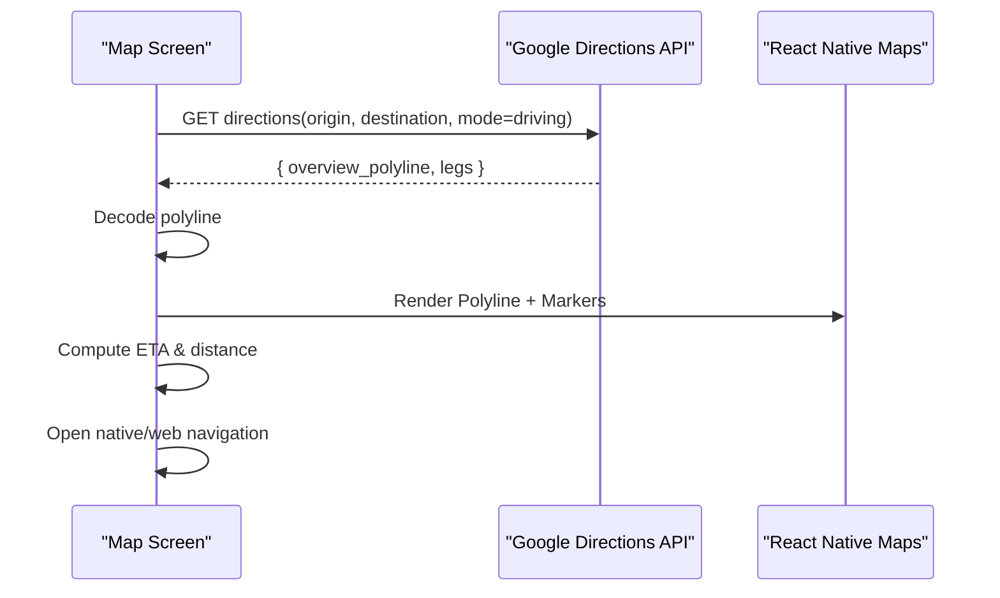
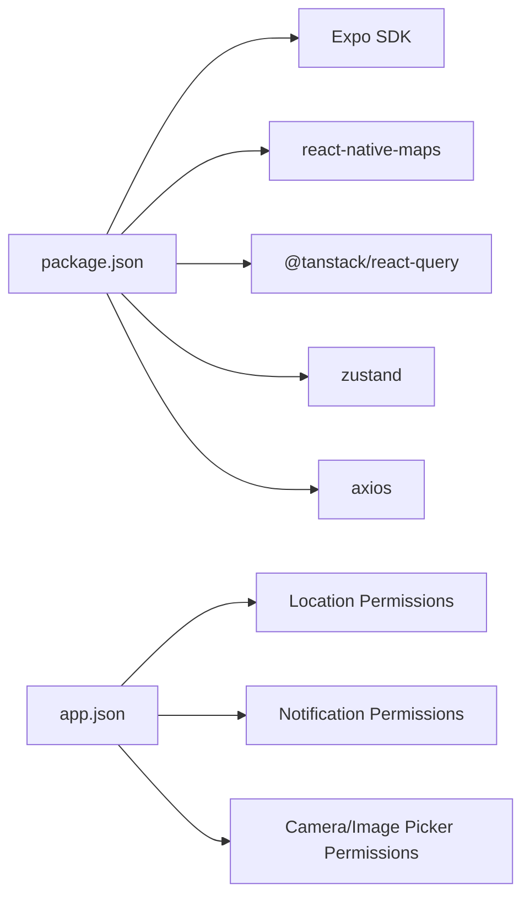

# Courier Mobile App

<cite>
**Referenced Files in This Document**
- [package.json](file://apps/courier-mobile/package.json)
- [app.json](file://apps/courier-mobile/app.json)
- [_layout.tsx](file://apps/courier-mobile/app/_layout.tsx)
- [login.tsx](file://apps/courier-mobile/app/(auth)/login.tsx)
- [delivery.tsx](file://apps/courier-mobile/app/(tabs)/delivery.tsx)
- [map.tsx](file://apps/courier-mobile/app/(tabs)/map.tsx)
- [useGpsTracking.ts](file://apps/courier-mobile/src/hooks/useGpsTracking.ts)
- [api.ts](file://apps/courier-mobile/src/lib/api.ts)
- [auth.store.ts](file://apps/courier-mobile/src/stores/auth.store.ts)
- [location.store.ts](file://apps/courier-mobile/src/stores/location.store.ts)
</cite>

## Table of Contents
1. [Introduction](#introduction)
2. [Project Structure](#project-structure)
3. [Core Components](#core-components)
4. [Architecture Overview](#architecture-overview)
5. [Detailed Component Analysis](#detailed-component-analysis)
6. [Dependency Analysis](#dependency-analysis)
7. [Performance Considerations](#performance-considerations)
8. [Troubleshooting Guide](#troubleshooting-guide)
9. [Conclusion](#conclusion)

## Introduction
This document describes the courier mobile application built for delivery drivers using Expo and React Native. It explains the driver workflow from authentication to order assignment, GPS tracking with real-time location updates, route optimization via Google Maps, and delivery confirmation flows. It also covers navigation patterns, platform-specific integrations (location services, push notifications, camera), state management, API interactions, and performance optimizations for background tracking, battery efficiency, and connectivity handling.

## Project Structure
The app uses Expo Router for file-based routing with two primary groups:
- Authentication screens under (auth)
- Driver tabs under (tabs) including a map view and an active delivery screen

Key runtime setup occurs in the root layout, which initializes fonts, error boundaries, theme providers, query persistence, auth guards, GPS bootstrap, and push notification bootstrap. Platform permissions and capabilities are declared in the Expo config.

**Diagram sources**
- [_layout.tsx:68-123](file://apps/courier-mobile/app/_layout.tsx#L68-L123)
- [login.tsx:30-64](file://apps/courier-mobile/app/(auth)/login.tsx#L30-L64)
- [map.tsx:222-388](file://apps/courier-mobile/app/(tabs)/map.tsx#L222-L388)
- [delivery.tsx:35-168](file://apps/courier-mobile/app/(tabs)/delivery.tsx#L35-L168)
- [useGpsTracking.ts:19-109](file://apps/courier-mobile/src/hooks/useGpsTracking.ts#L19-L109)
- [api.ts:75-160](file://apps/courier-mobile/src/lib/api.ts#L75-L160)
- [auth.store.ts:34-91](file://apps/courier-mobile/src/stores/auth.store.ts#L34-L91)
- [location.store.ts:1-44](file://apps/courier-mobile/src/stores/location.store.ts#L1-L44)

**Section sources**
- [_layout.tsx:1-123](file://apps/courier-mobile/app/_layout.tsx#L1-L123)
- [app.json:1-122](file://apps/courier-mobile/app.json#L1-L122)
- [package.json:1-66](file://apps/courier-mobile/package.json#L1-L66)

## Core Components
- Root layout orchestrates bootstrapping: font loading, splash screen safety, error boundary, theme provider, persisted React Query client, auth guard, GPS hook, push notifications, and global network banner.
- Authentication flow validates credentials, enforces role checks, persists tokens and user profile, and redirects to protected tabs.
- Map screen renders driver position, destination markers, route polyline, ETA chip, accuracy indicator, and opens native or web navigation.
- Active delivery screen drives step-by-step delivery lifecycle with status transitions and map visualization.
- GPS hook manages foreground/background tracking, posts filtered locations to backend, and updates local store.
- API layer provides typed helpers, JWT injection, 401 handling, and driver endpoints for orders, location, documents, and notifications.
- Stores manage auth state and location state with simple actions.

**Section sources**
- [_layout.tsx:68-123](file://apps/courier-mobile/app/_layout.tsx#L68-L123)
- [login.tsx:30-64](file://apps/courier-mobile/app/(auth)/login.tsx#L30-L64)
- [map.tsx:222-511](file://apps/courier-mobile/app/(tabs)/map.tsx#L222-L511)
- [delivery.tsx:35-168](file://apps/courier-mobile/app/(tabs)/delivery.tsx#L35-L168)
- [useGpsTracking.ts:19-109](file://apps/courier-mobile/src/hooks/useGpsTracking.ts#L19-L109)
- [api.ts:18-160](file://apps/courier-mobile/src/lib/api.ts#L18-L160)
- [auth.store.ts:34-91](file://apps/courier-mobile/src/stores/auth.store.ts#L34-L91)
- [location.store.ts:1-44](file://apps/courier-mobile/src/stores/location.store.ts#L1-L44)

## Architecture Overview
The app follows a layered architecture:
- UI layer: Expo Router screens for auth and tabs (map, delivery).
- State layer: Zustand stores for auth and location; React Query for data fetching/persistence.
- Services: API client with interceptors; socket manager for real-time events; GPS manager for location tracking.
- Platform integrations: expo-location for GPS, expo-notifications for push, expo-camera/image-picker for proof capture, react-native-maps for mapping.

**Diagram sources**
- [login.tsx:44-64](file://apps/courier-mobile/app/(auth)/login.tsx#L44-L64)
- [_layout.tsx:42-66](file://apps/courier-mobile/app/_layout.tsx#L42-L66)
- [_layout.tsx:68-123](file://apps/courier-mobile/app/_layout.tsx#L68-L123)
- [useGpsTracking.ts:76-109](file://apps/courier-mobile/src/hooks/useGpsTracking.ts#L76-L109)
- [api.ts:75-160](file://apps/courier-mobile/src/lib/api.ts#L75-L160)

## Detailed Component Analysis

### Authentication System
- Login screen validates input with Zod, calls driver login API, enforces DRIVER role, and persists token/user via auth store.
- Root layout guards routes: unauthenticated users are redirected to login; authenticated users connect sockets and proceed to tabs.
- API interceptor attaches Authorization header and logs out on 401 responses.

**Diagram sources**
- [login.tsx:23-64](file://apps/courier-mobile/app/(auth)/login.tsx#L23-L64)
- [_layout.tsx:42-66](file://apps/courier-mobile/app/_layout.tsx#L42-L66)
- [api.ts:24-43](file://apps/courier-mobile/src/lib/api.ts#L24-L43)

**Section sources**
- [login.tsx:30-64](file://apps/courier-mobile/app/(auth)/login.tsx#L30-L64)
- [_layout.tsx:42-66](file://apps/courier-mobile/app/_layout.tsx#L42-L66)
- [api.ts:24-43](file://apps/courier-mobile/src/lib/api.ts#L24-L43)
- [auth.store.ts:34-91](file://apps/courier-mobile/src/stores/auth.store.ts#L34-L91)

### Order Management Interface
- Active delivery screen displays current order details, ETA, earnings, and a single action button that advances through predefined statuses.
- Status transitions call dedicated API endpoints to move the order through the lifecycle: accepted → en-route to pickup → arrived at pharmacy → picked up → en-route to customer → arrived at customer → delivered.
- On completion, it clears active delivery, invalidates profile queries, and navigates back to the main tab.

**Diagram sources**
- [delivery.tsx:26-33](file://apps/courier-mobile/app/(tabs)/delivery.tsx#L26-L33)
- [delivery.tsx:52-70](file://apps/courier-mobile/app/(tabs)/delivery.tsx#L52-L70)
- [api.ts:111-132](file://apps/courier-mobile/src/lib/api.ts#L111-L132)

**Section sources**
- [delivery.tsx:35-168](file://apps/courier-mobile/app/(tabs)/delivery.tsx#L35-L168)
- [api.ts:111-132](file://apps/courier-mobile/src/lib/api.ts#L111-L132)

### GPS Tracking and Real-Time Location Updates
- The GPS hook starts foreground tracking when the driver is online and background tracking during an active delivery.
- Incoming locations are posted to the backend with an adaptive interval managed by the GPS manager; stale callbacks are avoided via refs.
- Local location store receives filtered coordinates, heading, speed, accuracy, and altitude, enabling accurate map rendering and ETA calculations.

**Diagram sources**
- [useGpsTracking.ts:76-109](file://apps/courier-mobile/src/hooks/useGpsTracking.ts#L76-L109)
- [useGpsTracking.ts:29-54](file://apps/courier-mobile/src/hooks/useGpsTracking.ts#L29-L54)
- [location.store.ts:32-44](file://apps/courier-mobile/src/stores/location.store.ts#L32-L44)

**Section sources**
- [useGpsTracking.ts:19-109](file://apps/courier-mobile/src/hooks/useGpsTracking.ts#L19-L109)
- [location.store.ts:1-44](file://apps/courier-mobile/src/stores/location.store.ts#L1-L44)

### Route Optimization and Navigation
- The map screen fetches directions from Google Maps Directions API, decodes polylines, and draws routes on the map.
- It computes ETA and distance, shows an accuracy indicator, and supports re-centering on the driver.
- Navigation opens native Google Maps when available, otherwise falls back to web URLs.

**Diagram sources**
- [map.tsx:23-91](file://apps/courier-mobile/app/(tabs)/map.tsx#L23-L91)
- [map.tsx:237-317](file://apps/courier-mobile/app/(tabs)/map.tsx#L237-L317)
- [map.tsx:333-369](file://apps/courier-mobile/app/(tabs)/map.tsx#L333-L369)

**Section sources**
- [map.tsx:222-511](file://apps/courier-mobile/app/(tabs)/map.tsx#L222-L511)

### Communication Features
- Push notifications are initialized in the root layout when a user is present; registration endpoint exists in the API layer.
- Socket connection is established upon authentication for real-time updates (e.g., new orders, status changes).
- Camera and image picker are configured for capturing delivery proof photos and uploading them via the API.

**Section sources**
- [_layout.tsx:29-40](file://apps/courier-mobile/app/_layout.tsx#L29-L40)
- [_layout.tsx:60-66](file://apps/courier-mobile/app/_layout.tsx#L60-L66)
- [api.ts:157-160](file://apps/courier-mobile/src/lib/api.ts#L157-L160)
- [app.json:55-105](file://apps/courier-mobile/app.json#L55-L105)

## Dependency Analysis
The app’s dependencies include Expo SDK modules for location, notifications, camera, and maps; React Query for data management; Zustand for state; and Axios for HTTP requests. Platform permissions are declared in the Expo config for Android and iOS.

**Diagram sources**
- [package.json:13-58](file://apps/courier-mobile/package.json#L13-L58)
- [app.json:30-49](file://apps/courier-mobile/app.json#L30-L49)
- [app.json:16-28](file://apps/courier-mobile/app.json#L16-L28)

**Section sources**
- [package.json:13-58](file://apps/courier-mobile/package.json#L13-L58)
- [app.json:16-49](file://apps/courier-mobile/app.json#L16-L49)

## Performance Considerations
- Background location tracking: Enabled via Expo plugin settings; started only during active deliveries to conserve battery.
- Adaptive posting: Locations are posted with an adaptive interval managed by the GPS manager; queueing prevents concurrent writes.
- Network resilience: Axios timeout and 401 handling ensure graceful logout; offline banner informs users of connectivity issues.
- Route caching: Route fetches are throttled based on driver movement threshold to reduce API calls.
- UI efficiency: Minimal re-renders via stable refs and localized state updates; animations use Reanimated for smooth UX.

[No sources needed since this section provides general guidance]

## Troubleshooting Guide
- Authentication failures: Check role enforcement and token persistence; verify API base URL configuration.
- GPS not updating: Ensure permissions granted; confirm foreground/background tracking states; check device location services.
- Route not displayed: Validate destination coordinates; verify Google Maps API key; check network connectivity.
- Push notifications not received: Confirm token registration; verify platform permissions; check server-side delivery.

**Section sources**
- [_layout.tsx:42-66](file://apps/courier-mobile/app/_layout.tsx#L42-L66)
- [useGpsTracking.ts:76-109](file://apps/courier-mobile/src/hooks/useGpsTracking.ts#L76-L109)
- [map.tsx:237-317](file://apps/courier-mobile/app/(tabs)/map.tsx#L237-L317)
- [api.ts:24-43](file://apps/courier-mobile/src/lib/api.ts#L24-L43)

## Conclusion
The courier mobile app provides a robust driver workflow with secure authentication, efficient GPS tracking, optimized routing, and streamlined delivery confirmation. Its architecture leverages Expo, React Native, and modern libraries to deliver a responsive, reliable experience across platforms while maintaining battery efficiency and network resilience.

[No sources needed since this section summarizes without analyzing specific files]