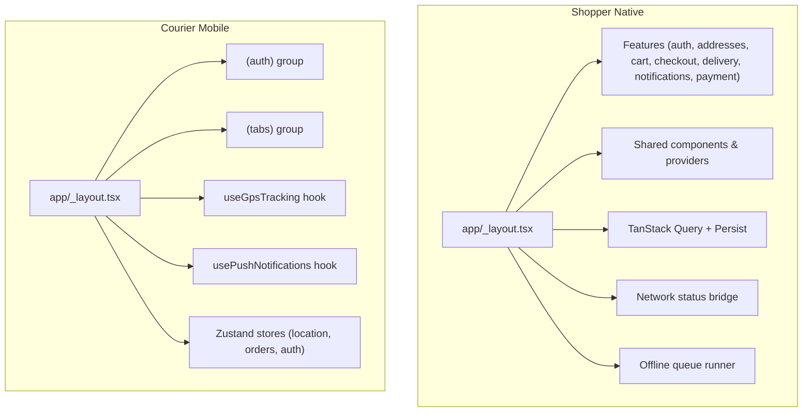
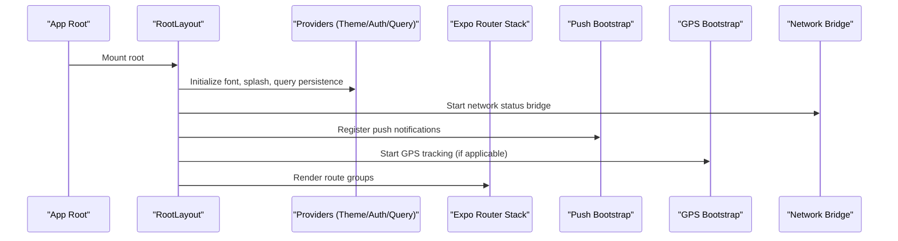
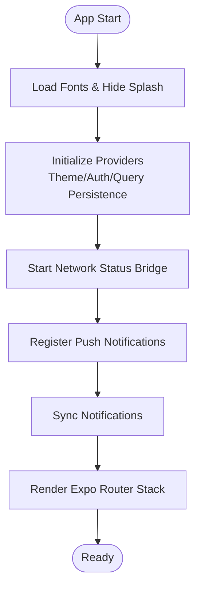
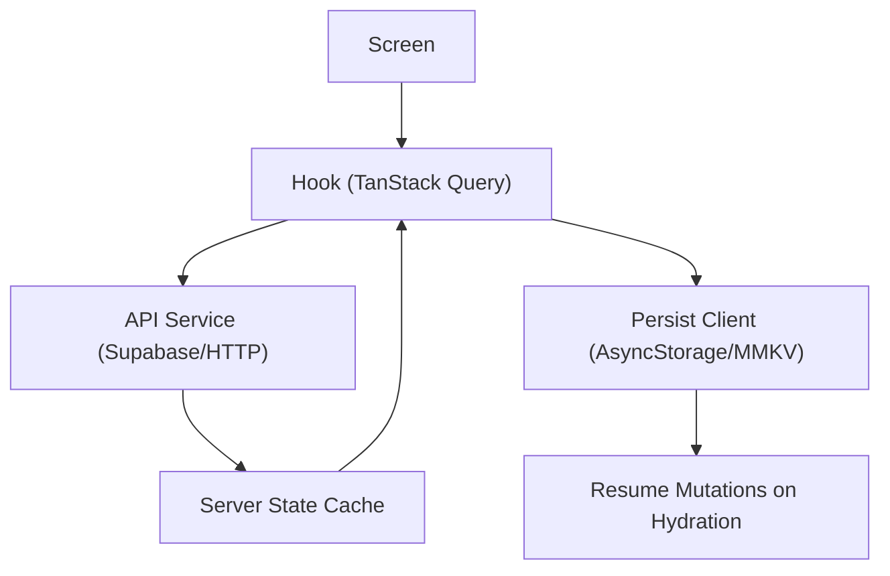
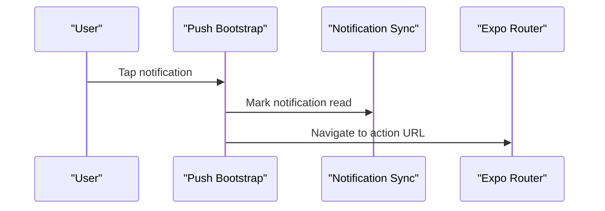
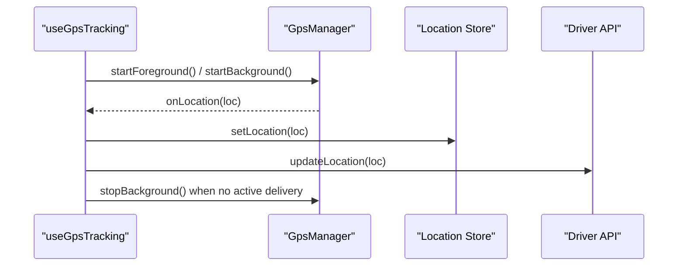
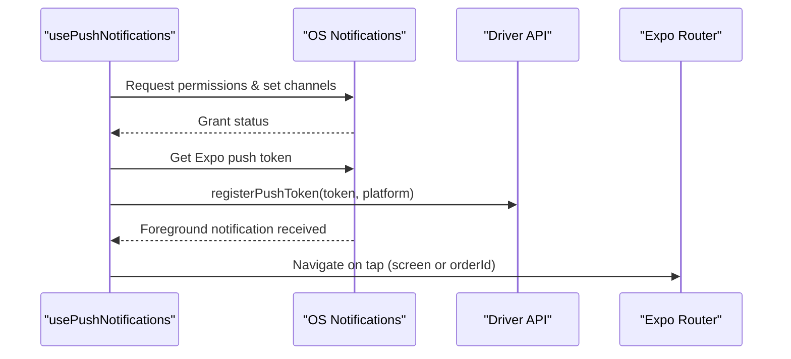
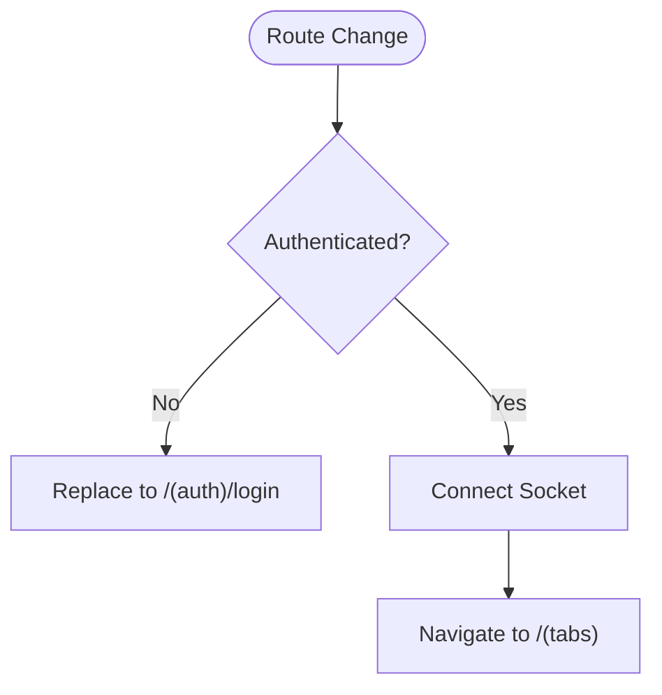
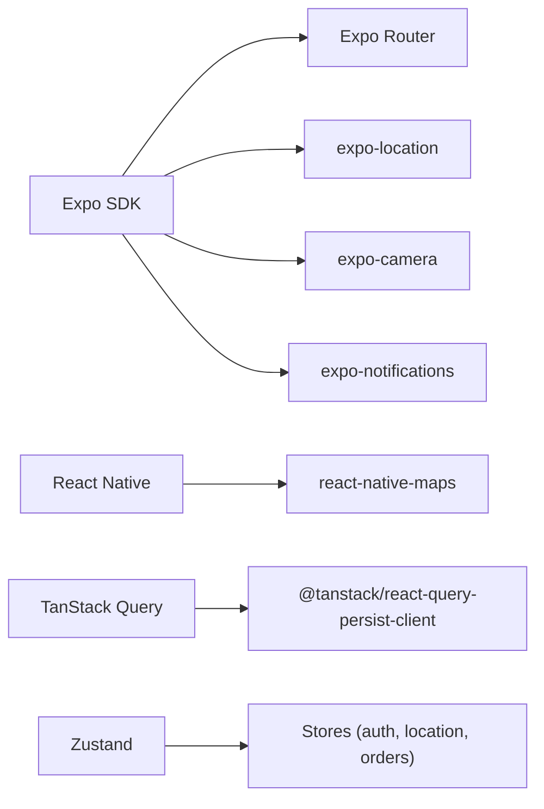

# Mobile Applications

<cite>
**Referenced Files in This Document**
- [shopper-native/package.json](file://apps/shopper-native/package.json)
- [shopper-native/app.json](file://apps/shopper-native/app.json)
- [shopper-native/ARCHITECTURE.md](file://apps/shopper-native/ARCHITECTURE.md)
- [shopper-native/app/_layout.tsx](file://apps/shopper-native/app/_layout.tsx)
- [courier-mobile/package.json](file://apps/courier-mobile/package.json)
- [courier-mobile/app.json](file://apps/courier-mobile/app.json)
- [courier-mobile/app/_layout.tsx](file://apps/courier-mobile/app/_layout.tsx)
- [courier-mobile/src/hooks/useGpsTracking.ts](file://apps/courier-mobile/src/hooks/useGpsTracking.ts)
- [courier-mobile/src/hooks/usePushNotifications.ts](file://apps/courier-mobile/src/hooks/usePushNotifications.ts)
- [courier-mobile/src/stores/location.store.ts](file://apps/courier-mobile/src/stores/location.store.ts)
</cite>

## Table of Contents
1. Introduction
2. Project Structure
3. Core Components
4. Architecture Overview
5. Detailed Component Analysis
6. Dependency Analysis
7. Performance Considerations
8. Troubleshooting Guide
9. Conclusion

## Introduction
This document provides comprehensive documentation for the mobile applications built with Expo and React Native, focusing on:
- Shopper native app architecture using Expo Router, platform-specific configurations, offline capabilities via TanStack Query persistence (with MMKV-backed storage), push notifications integration, camera and geolocation services, background processing, and battery optimization techniques.
- Courier mobile app for delivery drivers including GPS tracking, real-time location updates, order management, driver workflow optimization, push notifications, and platform-specific permissions for background location and foreground services.

The goal is to make both apps understandable for developers and stakeholders, with clear diagrams and actionable guidance.

## Project Structure
Both apps follow a feature-driven structure with Expo Router file-based routing and shared UI/design tokens from a common package. The shopper app organizes features under src/features with vertical slices for auth, addresses, cart, checkout, delivery, notifications, payment, and more. The courier app uses a simpler layout with app groups for authentication and tabs, plus hooks and stores for GPS and notifications.

**Diagram sources**
- [shopper-native/app/_layout.tsx:1-292](file://apps/shopper-native/app/_layout.tsx#L1-L292)
- [courier-mobile/app/_layout.tsx:1-124](file://apps/courier-mobile/app/_layout.tsx#L1-L124)

**Section sources**
- [shopper-native/ARCHITECTURE.md:1-178](file://apps/shopper-native/ARCHITECTURE.md#L1-L178)
- [shopper-native/app/_layout.tsx:1-292](file://apps/shopper-native/app/_layout.tsx#L1-L292)
- [courier-mobile/app/_layout.tsx:1-124](file://apps/courier-mobile/app/_layout.tsx#L1-L124)

## Core Components
- Navigation: Both apps use Expo Router with typed routes and grouped layouts. The shopper app defines multiple route groups (customer, driver, pharmacist, auth) and global providers; the courier app uses (auth) and (tabs) groups with an auth guard that redirects based on authentication state.
- State Management: Zustand stores manage local state (e.g., location, orders, auth). TanStack Query manages server state with persistence for offline support.
- Offline Support: TanStack Query persist client configured with AsyncStorage or MMKV-backed persister ensures data availability offline and resumes mutations after hydration.
- Push Notifications: Integrated via expo-notifications with permission handling, token registration, channel setup (Android), and tap navigation.
- GPS Tracking: Courier app tracks driver location in foreground and background during active deliveries, posting filtered locations to backend APIs.
- Camera and Media: Both apps integrate expo-camera and expo-image-picker for prescription scanning and proof-of-delivery photos.
- Platform-Specific Configurations: Permissions and build properties are defined in app.json for iOS and Android, including location, camera, background location, and notification channels.

**Section sources**
- [shopper-native/package.json:1-104](file://apps/shopper-native/package.json#L1-L104)
- [courier-mobile/package.json:1-66](file://apps/courier-mobile/package.json#L1-L66)
- [shopper-native/app.json:1-113](file://apps/shopper-native/app.json#L1-L113)
- [courier-mobile/app.json:1-122](file://apps/courier-mobile/app.json#L1-L122)

## Architecture Overview
The shopper app bootstraps providers (theme, auth, query persistence), initializes network status, language, crash enrichment, and offline queue runner. It sets up push notifications and notification sync, then renders the Expo Router stack with various route groups.

The courier app bootstraps fonts, splash screen, theme, query persistence, and status bar. It includes an auth guard that connects sockets when authenticated, starts GPS tracking, registers push notifications, and renders the router stack with (auth) and (tabs) groups.

**Diagram sources**
- [shopper-native/app/_layout.tsx:1-292](file://apps/shopper-native/app/_layout.tsx#L1-L292)
- [courier-mobile/app/_layout.tsx:1-124](file://apps/courier-mobile/app/_layout.tsx#L1-L124)

## Detailed Component Analysis

### Shopper Native: Navigation and Bootstrapping
- Root layout configures error boundaries, gesture handler, safe area, theme provider, auth provider, and query persistence.
- Notification sync and push registration run conditionally based on user presence.
- Route groups include customer, driver, pharmacist, and auth flows with modal presentation for auth screens.
- Global banners and sheets provide feedback and actions.

**Diagram sources**
- [shopper-native/app/_layout.tsx:1-292](file://apps/shopper-native/app/_layout.tsx#L1-L292)

**Section sources**
- [shopper-native/app/_layout.tsx:1-292](file://apps/shopper-native/app/_layout.tsx#L1-L292)

### Shopper Native: Offline Capabilities and Storage
- Uses TanStack Query with a persist client to cache server state and resume mutations after app restarts.
- Integrates MMKV via react-native-mmkv for fast, reliable local storage where appropriate.
- Features adhere to API layering rules: screens compose hooks, hooks wrap TanStack Query, and API services handle raw calls.

**Diagram sources**
- [shopper-native/package.json:1-104](file://apps/shopper-native/package.json#L1-L104)
- [shopper-native/ARCHITECTURE.md:109-124](file://apps/shopper-native/ARCHITECTURE.md#L109-L124)

**Section sources**
- [shopper-native/package.json:1-104](file://apps/shopper-native/package.json#L1-L104)
- [shopper-native/ARCHITECTURE.md:109-124](file://apps/shopper-native/ARCHITECTURE.md#L109-L124)

### Shopper Native: Push Notifications Integration
- Push bootstrap registers notifications, handles taps, and marks notifications read when tapped.
- Notification sync keeps the in-app notification center updated.

**Diagram sources**
- [shopper-native/app/_layout.tsx:109-151](file://apps/shopper-native/app/_layout.tsx#L109-L151)

**Section sources**
- [shopper-native/app/_layout.tsx:109-151](file://apps/shopper-native/app/_layout.tsx#L109-L151)

### Courier Mobile: GPS Tracking Workflow
- useGpsTracking coordinates foreground/background tracking based on driver online status and active delivery.
- GpsManager posts filtered locations to backend and updates the location store.
- AppState listener resumes foreground tracking when the app becomes active.

**Diagram sources**
- [courier-mobile/src/hooks/useGpsTracking.ts:1-110](file://apps/courier-mobile/src/hooks/useGpsTracking.ts#L1-L110)
- [courier-mobile/src/stores/location.store.ts:1-44](file://apps/courier-mobile/src/stores/location.store.ts#L1-L44)

**Section sources**
- [courier-mobile/src/hooks/useGpsTracking.ts:1-110](file://apps/courier-mobile/src/hooks/useGpsTracking.ts#L1-L110)
- [courier-mobile/src/stores/location.store.ts:1-44](file://apps/courier-mobile/src/stores/location.store.ts#L1-L44)

### Courier Mobile: Push Notifications
- usePushNotifications requests permissions, sets Android channels, retrieves token, registers it with the backend, and handles foreground notifications and taps.
- Taps navigate to specific screens or delivery tab based on payload.

**Diagram sources**
- [courier-mobile/src/hooks/usePushNotifications.ts:1-120](file://apps/courier-mobile/src/hooks/usePushNotifications.ts#L1-L120)

**Section sources**
- [courier-mobile/src/hooks/usePushNotifications.ts:1-120](file://apps/courier-mobile/src/hooks/usePushNotifications.ts#L1-L120)

### Courier Mobile: Authentication Guard and Routing
- AuthGuard checks segments and redirects to login if not authenticated; otherwise navigates to tabs and connects socket.
- Ensures secure access to protected routes and establishes real-time connections upon successful login.

**Diagram sources**
- [courier-mobile/app/_layout.tsx:42-66](file://apps/courier-mobile/app/_layout.tsx#L42-L66)

**Section sources**
- [courier-mobile/app/_layout.tsx:42-66](file://apps/courier-mobile/app/_layout.tsx#L42-L66)

### Shared Mobile Components and Cross-Platform Strategies
- Design tokens and UI primitives are shared via @pharmacy/ui-native and @pharmacy/design-tokens, ensuring consistent look and feel across apps.
- Platform-specific behaviors are handled through conditional logic and app.json configurations for permissions and plugins.
- Camera and image picker integrations enable prescription scanning and proof-of-delivery workflows.

**Section sources**
- [shopper-native/package.json:1-104](file://apps/shopper-native/package.json#L1-L104)
- [courier-mobile/package.json:1-66](file://apps/courier-mobile/package.json#L1-L66)
- [shopper-native/app.json:45-98](file://apps/shopper-native/app.json#L45-L98)
- [courier-mobile/app.json:55-105](file://apps/courier-mobile/app.json#L55-L105)

### Platform-Specific Optimizations (iOS and Android)
- iOS: Info.plist usage descriptions for location and camera; supports tablet; Hermes JS engine enabled in courier app.
- Android: Explicit permissions for camera, fine/coarse location, background location, foreground service, notifications, audio recording; plugin configurations for location and camera; notification channels and colors.

**Section sources**
- [shopper-native/app.json:16-38](file://apps/shopper-native/app.json#L16-L38)
- [courier-mobile/app.json:16-49](file://apps/courier-mobile/app.json#L16-L49)

### Mobile-Specific Features
- Camera Integration: Used for prescription text recognition and delivery proof photos; configured with explicit permissions and privacy statements.
- Geolocation Services: Fine and coarse location permissions; background location for active deliveries; foreground service for continuous tracking.
- Background Processing: Foreground and background location tracking managed by GpsManager; AppState listeners resume tracking when app returns to foreground.
- Battery Optimization: Adaptive intervals for location posting; filtering locations before upload; minimizing unnecessary wake-ups by stopping background tracking when not needed.

**Section sources**
- [courier-mobile/src/hooks/useGpsTracking.ts:1-110](file://apps/courier-mobile/src/hooks/useGpsTracking.ts#L1-L110)
- [courier-mobile/app.json:73-81](file://apps/courier-mobile/app.json#L73-L81)
- [shopper-native/app.json:70-88](file://apps/shopper-native/app.json#L70-L88)

## Dependency Analysis
Key dependencies for both apps include Expo ecosystem packages, React Native core, TanStack Query for server state, Zustand for local state, and platform-specific integrations like camera, location, and notifications.

**Diagram sources**
- [shopper-native/package.json:17-79](file://apps/shopper-native/package.json#L17-L79)
- [courier-mobile/package.json:13-58](file://apps/courier-mobile/package.json#L13-L58)

**Section sources**
- [shopper-native/package.json:17-79](file://apps/shopper-native/package.json#L17-L79)
- [courier-mobile/package.json:13-58](file://apps/courier-mobile/package.json#L13-L58)

## Performance Considerations
- Use TanStack Query caching and optimistic updates to reduce network calls and improve perceived performance.
- Persist queries to local storage for offline resilience and faster cold starts.
- Minimize re-renders by subscribing to Zustand selectors rather than entire stores.
- Apply adaptive location posting intervals and filter noisy GPS data to conserve battery and bandwidth.
- Avoid heavy work on the main thread; leverage background tasks and efficient libraries.

[No sources needed since this section provides general guidance]

## Troubleshooting Guide
- Push Notifications: Ensure device permissions are granted; verify token registration; check Android notification channels and iOS entitlements.
- GPS Tracking: Confirm background location permissions; validate foreground service configuration; ensure AppState listeners resume tracking correctly.
- Offline Mode: Verify query persistence configuration; confirm mutation resumption after hydration; inspect network status bridge behavior.
- Camera and Media: Validate permission prompts and privacy statements; test image picker flows for different platforms.

**Section sources**
- [courier-mobile/src/hooks/usePushNotifications.ts:26-84](file://apps/courier-mobile/src/hooks/usePushNotifications.ts#L26-L84)
- [courier-mobile/src/hooks/useGpsTracking.ts:80-108](file://apps/courier-mobile/src/hooks/useGpsTracking.ts#L80-L108)
- [shopper-native/app/_layout.tsx:121-151](file://apps/shopper-native/app/_layout.tsx#L121-L151)

## Conclusion
The shopper and courier mobile apps are built with a robust, modular architecture leveraging Expo Router, TanStack Query, Zustand, and platform-specific integrations. The shopper app emphasizes feature-driven organization, offline resilience, and rich user experiences with push notifications and media capture. The courier app focuses on reliable GPS tracking, real-time updates, and driver workflow efficiency with strong background processing and battery-conscious design. Together, they provide a cohesive mobile experience across iOS and Android with clear separation of concerns and scalable patterns.

[No sources needed since this section summarizes without analyzing specific files]