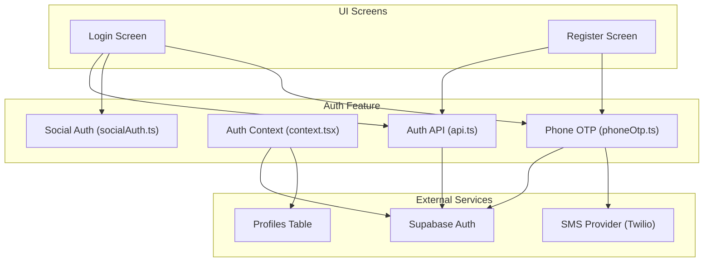
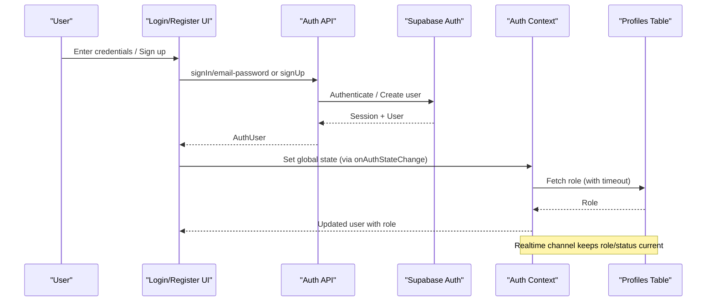
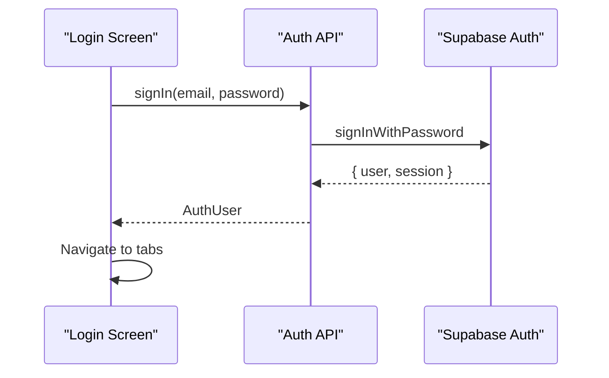
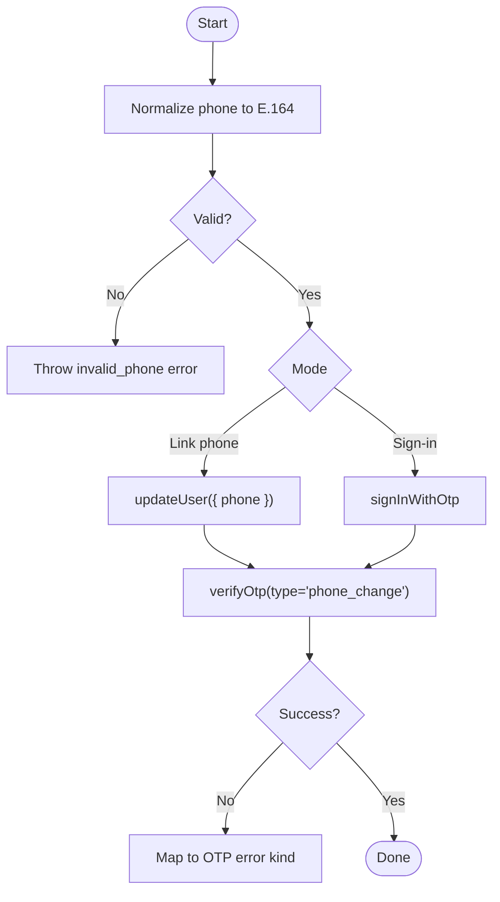
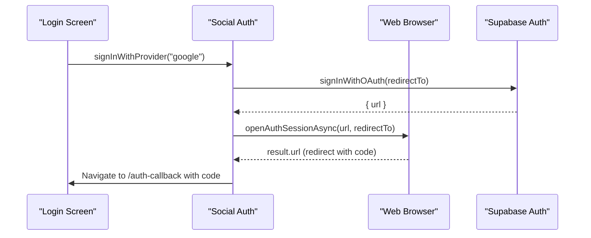
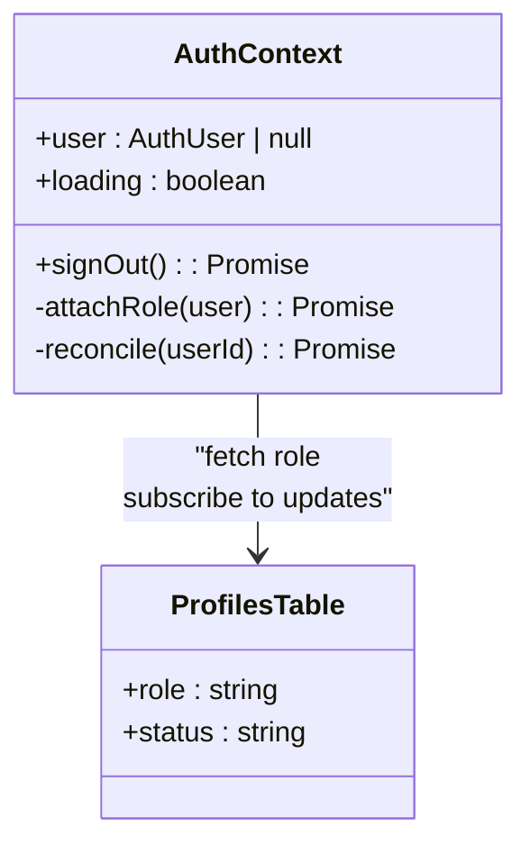
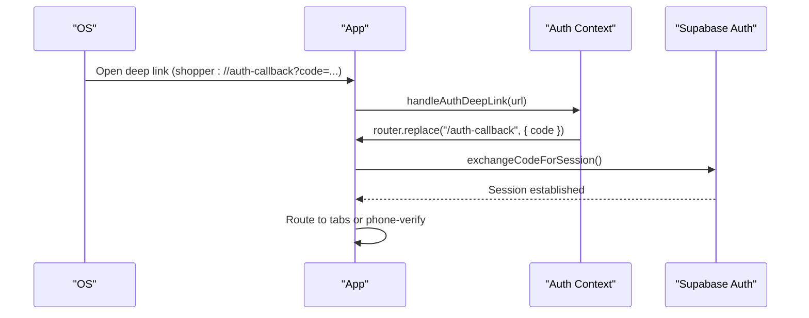
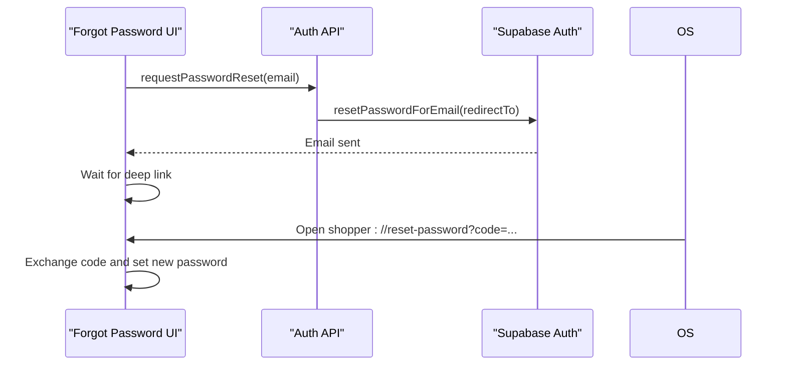
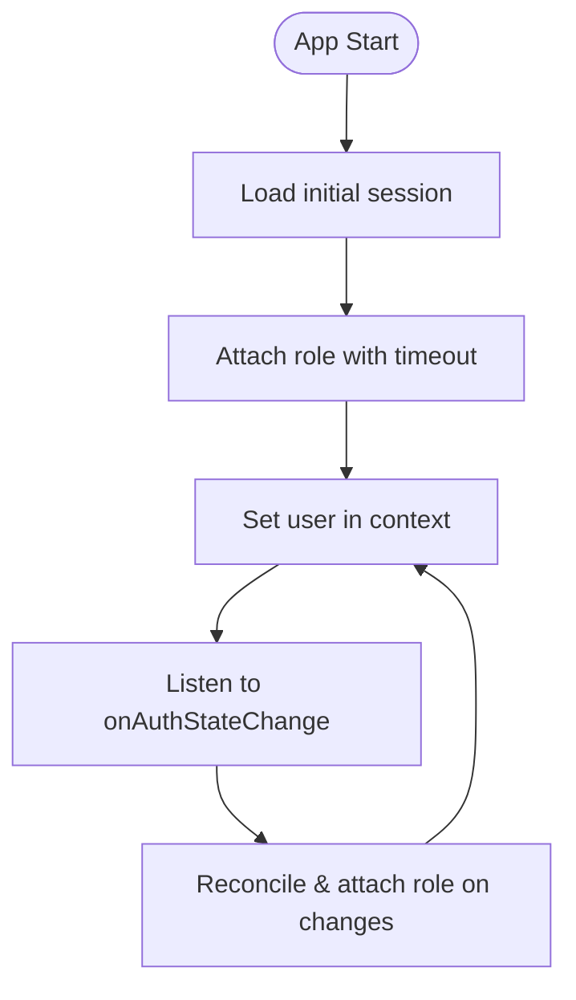
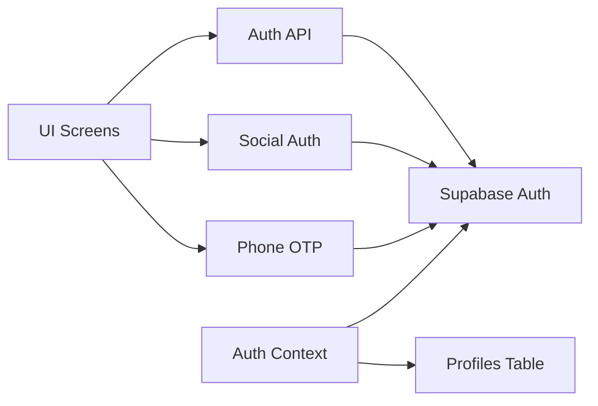

# Authentication Module

<cite>
**Referenced Files in This Document**
- [login.tsx](file://apps/shopper-native/app/(auth)/login.tsx)
- [register.tsx](file://apps/shopper-native/app/(auth)/register.tsx)
- [api.ts](file://apps/shopper-native/src/features/auth/api.ts)
- [context.tsx](file://apps/shopper-native/src/features/auth/context.tsx)
- [phoneOtp.ts](file://apps/shopper-native/src/features/auth/phoneOtp.ts)
- [socialAuth.ts](file://apps/shopper-native/src/features/auth/socialAuth.ts)
- [index.ts](file://apps/shopper-native/src/features/auth/index.ts)
</cite>

## Table of Contents
1. Introduction
2. Project Structure
3. Core Components
4. Architecture Overview
5. Detailed Component Analysis
6. Dependency Analysis
7. Performance Considerations
8. Troubleshooting Guide
9. Conclusion

## Introduction
This document explains the authentication module for the shopper native app. It covers email/password sign-in and sign-up, phone OTP verification, social authentication via Supabase Auth, role-based access control (customer, pharmacist, driver), session management, deep link handling, error handling strategies, mobile security considerations, and offline behavior patterns. It also provides examples of how to use hooks and API integrations and describes user state management patterns used across the app.

## Project Structure
The authentication feature is implemented under apps/shopper-native/src/features/auth with UI screens under apps/shopper-native/app/(auth). The key pieces are:
- UI screens: login and register flows that call auth APIs and handle errors
- Auth API layer: wrappers around Supabase Auth for sign-in, sign-up, password reset, profile updates, and session retrieval
- Context provider: manages global auth state, deep links, role resolution, real-time role/status changes, and cleanup on sign-out
- Phone OTP: normalization, sending, and verifying OTPs for both linking a phone and phone-only sign-in
- Social Auth: OAuth flows for Google/Apple/Facebook via Supabase with deep link handling

**Diagram sources**
- [login.tsx:113-131](file://apps/shopper-native/app/(auth)/login.tsx#L113-L131)
- [register.tsx:89-107](file://apps/shopper-native/app/(auth)/register.tsx#L89-L107)
- [api.ts:40-86](file://apps/shopper-native/src/features/auth/api.ts#L40-L86)
- [context.tsx:178-194](file://apps/shopper-native/src/features/auth/context.tsx#L178-L194)
- [phoneOtp.ts:132-149](file://apps/shopper-native/src/features/auth/phoneOtp.ts#L132-L149)
- [socialAuth.ts:42-88](file://apps/shopper-native/src/features/auth/socialAuth.ts#L42-L88)

**Section sources**
- [login.tsx:1-250](file://apps/shopper-native/app/(auth)/login.tsx#L1-L250)
- [register.tsx:1-209](file://apps/shopper-native/app/(auth)/register.tsx#L1-L209)
- [api.ts:1-166](file://apps/shopper-native/src/features/auth/api.ts#L1-L166)
- [context.tsx:1-348](file://apps/shopper-native/src/features/auth/context.tsx#L1-L348)
- [phoneOtp.ts:1-179](file://apps/shopper-native/src/features/auth/phoneOtp.ts#L1-L179)
- [socialAuth.ts:1-89](file://apps/shopper-native/src/features/auth/socialAuth.ts#L1-L89)
- [index.ts:1-25](file://apps/shopper-native/src/features/auth/index.ts#L1-L25)

## Core Components
- Auth API: Provides signIn, signUp, signOut, requestPasswordReset, updatePassword, updateProfile, getSession. Integrates with Supabase Auth and persists metadata and profile fields.
- Auth Context: Manages global user state, loading state, sign-out, deep link handling for email confirmation and password reset, role resolution from profiles table, real-time role/status updates, and data wipe on account change.
- Phone OTP: Normalizes Egyptian phone numbers, sends OTP via Supabase (signInWithOtp or updateUser), verifies OTP, and exposes toggles for enabling/disabling phone verification.
- Social Auth: Initiates OAuth flows with Supabase, opens an in-app browser, handles redirect back to the app, and routes to the auth-callback screen for session exchange.

Key responsibilities:
- Session lifecycle: initial session load, onAuthStateChange handling, deep link exchange, sign-out cleanup
- Role-based access: fetches role from profiles table with timeout fallback; listens to real-time updates to reflect role/status changes live
- Error mapping: surfaces user-friendly messages and categorizes OTP errors for UI feedback

**Section sources**
- [api.ts:40-166](file://apps/shopper-native/src/features/auth/api.ts#L40-L166)
- [context.tsx:126-348](file://apps/shopper-native/src/features/auth/context.tsx#L126-L348)
- [phoneOtp.ts:25-179](file://apps/shopper-native/src/features/auth/phoneOtp.ts#L25-L179)
- [socialAuth.ts:21-89](file://apps/shopper-native/src/features/auth/socialAuth.ts#L21-L89)

## Architecture Overview
The authentication architecture centers on Supabase Auth with local context-driven state and real-time role synchronization.

**Diagram sources**
- [login.tsx:113-131](file://apps/shopper-native/app/(auth)/login.tsx#L113-L131)
- [register.tsx:89-107](file://apps/shopper-native/app/(auth)/register.tsx#L89-L107)
- [api.ts:40-86](file://apps/shopper-native/src/features/auth/api.ts#L40-L86)
- [context.tsx:178-194](file://apps/shopper-native/src/features/auth/context.tsx#L178-L194)
- [context.tsx:258-313](file://apps/shopper-native/src/features/auth/context.tsx#L258-L313)

## Detailed Component Analysis

### Email/Password Authentication Flow
- Login screen validates inputs, calls signIn, navigates to customer tabs on success, and maps errors using getAuthError.
- Register screen validates inputs, calls signUp, and navigates to customer tabs when a session is created.

**Diagram sources**
- [login.tsx:113-131](file://apps/shopper-native/app/(auth)/login.tsx#L113-L131)
- [api.ts:40-49](file://apps/shopper-native/src/features/auth/api.ts#L40-L49)

**Section sources**
- [login.tsx:113-131](file://apps/shopper-native/app/(auth)/login.tsx#L113-L131)
- [register.tsx:89-107](file://apps/shopper-native/app/(auth)/register.tsx#L89-L107)
- [api.ts:40-86](file://apps/shopper-native/src/features/auth/api.ts#L40-L86)

### Phone OTP Verification
- Supports two flows:
  - Linking a phone to an existing session (updateUser then verify type "phone_change")
  - Phone-only sign-in (signInWithOtp then verify type "sms")
- Normalizes Egyptian phone numbers to E.164 before calling Supabase.
- Exposes constants to enable/disable phone verification globally and cooldown/TTL values for UX.

**Diagram sources**
- [phoneOtp.ts:71-96](file://apps/shopper-native/src/features/auth/phoneOtp.ts#L71-L96)
- [phoneOtp.ts:132-149](file://apps/shopper-native/src/features/auth/phoneOtp.ts#L132-L149)
- [phoneOtp.ts:157-178](file://apps/shopper-native/src/features/auth/phoneOtp.ts#L157-L178)

**Section sources**
- [phoneOtp.ts:1-179](file://apps/shopper-native/src/features/auth/phoneOtp.ts#L1-L179)

### Social Authentication Integration (Supabase Auth)
- Initiates OAuth with Supabase using skipBrowserRedirect to control flow.
- Opens in-app browser, handles platform-specific redirect behavior, and routes to auth-callback for session exchange.
- Deep link handling ensures PKCE code is processed consistently across platforms.

**Diagram sources**
- [socialAuth.ts:42-88](file://apps/shopper-native/src/features/auth/socialAuth.ts#L42-L88)
- [login.tsx:204-207](file://apps/shopper-native/app/(auth)/login.tsx#L204-L207)

**Section sources**
- [socialAuth.ts:1-89](file://apps/shopper-native/src/features/auth/socialAuth.ts#L1-L89)
- [login.tsx:204-207](file://apps/shopper-native/app/(auth)/login.tsx#L204-L207)

### Role-Based Access Control (Customer, Pharmacist, Driver)
- Roles are resolved from public.profiles after authentication.
- attachRole uses a bounded timeout to avoid blocking sign-in; defaults to customer if query fails or times out.
- Real-time channel subscribes to profile updates to reflect role/status changes without requiring app restart.

**Diagram sources**
- [context.tsx:178-194](file://apps/shopper-native/src/features/auth/context.tsx#L178-L194)
- [context.tsx:258-313](file://apps/shopper-native/src/features/auth/context.tsx#L258-L313)

**Section sources**
- [context.tsx:178-194](file://apps/shopper-native/src/features/auth/context.tsx#L178-L194)
- [context.tsx:258-313](file://apps/shopper-native/src/features/auth/context.tsx#L258-L313)

### Session Management and Deep Links
- Handles PKCE redirects (auth-callback?code=...) and legacy hash fragment sessions.
- On app start, reads initial URL and listens for subsequent URLs to process auth callbacks.
- Ensures consistent post-auth routing by delegating to the auth-callback screen for session exchange.

**Diagram sources**
- [context.tsx:31-104](file://apps/shopper-native/src/features/auth/context.tsx#L31-L104)
- [context.tsx:230-235](file://apps/shopper-native/src/features/auth/context.tsx#L230-L235)

**Section sources**
- [context.tsx:31-104](file://apps/shopper-native/src/features/auth/context.tsx#L31-L104)
- [context.tsx:230-235](file://apps/shopper-native/src/features/auth/context.tsx#L230-L235)

### Password Reset Flow
- Sends password reset email with a redirect to the app’s reset-password route.
- Deep link handler routes to reset-password with code parameter for updating the password.

**Diagram sources**
- [api.ts:92-115](file://apps/shopper-native/src/features/auth/api.ts#L92-L115)
- [context.tsx:37-52](file://apps/shopper-native/src/features/auth/context.tsx#L37-L52)

**Section sources**
- [api.ts:92-115](file://apps/shopper-native/src/features/auth/api.ts#L92-L115)
- [context.tsx:37-52](file://apps/shopper-native/src/features/auth/context.tsx#L37-L52)

### User State Management Patterns
- Global state via AuthProvider exposes user, loading, and signOut.
- Reconciles last seen userId to wipe account-scoped data on account switches.
- Tracks analytics and crash reporter identity based on authenticated user.

**Diagram sources**
- [context.tsx:196-228](file://apps/shopper-native/src/features/auth/context.tsx#L196-L228)
- [context.tsx:141-149](file://apps/shopper-native/src/features/auth/context.tsx#L141-L149)

**Section sources**
- [context.tsx:141-149](file://apps/shopper-native/src/features/auth/context.tsx#L141-L149)
- [context.tsx:196-228](file://apps/shopper-native/src/features/auth/context.tsx#L196-L228)

## Dependency Analysis
- UI screens depend on Auth API functions and social auth helpers.
- Auth API depends on Supabase client and returns typed user objects.
- Auth Context depends on Supabase client for session, role queries, and realtime subscriptions.
- Phone OTP depends on Supabase Auth and optional SMS provider configuration.
- Social Auth depends on Supabase Auth and Expo Web Browser for OAuth flows.

**Diagram sources**
- [login.tsx:113-131](file://apps/shopper-native/app/(auth)/login.tsx#L113-L131)
- [api.ts:1-166](file://apps/shopper-native/src/features/auth/api.ts#L1-L166)
- [context.tsx:178-194](file://apps/shopper-native/src/features/auth/context.tsx#L178-L194)
- [phoneOtp.ts:132-149](file://apps/shopper-native/src/features/auth/phoneOtp.ts#L132-L149)
- [socialAuth.ts:42-88](file://apps/shopper-native/src/features/auth/socialAuth.ts#L42-L88)

**Section sources**
- [index.ts:1-25](file://apps/shopper-native/src/features/auth/index.ts#L1-L25)

## Performance Considerations
- Role fetching is bounded with a timeout to prevent blocking sign-in; default to customer if it fails or times out.
- Realtime channel subscription includes retry logic for CHANNEL_ERROR and TIMED_OUT states to maintain resilience.
- Data wipe on account change prevents stale data leaks between users on shared devices.
- Avoid unnecessary re-renders by centralizing auth state in context and minimizing direct store mutations.

[No sources needed since this section provides general guidance]

## Troubleshooting Guide
Common issues and resolutions:
- Deep link not processing: Ensure Supabase dashboard redirect URLs include both production and development schemes; verify app handles both PKCE and legacy hash fragments.
- Role remains unknown: Check profiles table availability and realtime channel status; review timeout behavior and retries.
- Phone OTP failures: Validate phone number normalization; check rate limits and expiration; map error kinds to UI messages.
- Social auth cancellation: Confirm provider setup in Supabase and correct redirect URIs; handle Android vs iOS redirect differences.

**Section sources**
- [context.tsx:31-104](file://apps/shopper-native/src/features/auth/context.tsx#L31-L104)
- [context.tsx:258-313](file://apps/shopper-native/src/features/auth/context.tsx#L258-L313)
- [phoneOtp.ts:113-126](file://apps/shopper-native/src/features/auth/phoneOtp.ts#L113-L126)
- [socialAuth.ts:42-88](file://apps/shopper-native/src/features/auth/socialAuth.ts#L42-L88)

## Conclusion
The authentication module integrates Supabase Auth with a robust local context that manages sessions, roles, and real-time updates. It supports email/password, phone OTP, and social authentication, with careful attention to mobile security, deep link handling, and performance. Role-based access control is enforced through profile lookups and live updates, while error handling and data hygiene ensure a reliable user experience across device and network conditions.

[No sources needed since this section summarizes without analyzing specific files]