# Checkout Module

<cite>
**Referenced Files in This Document**
- [useCheckoutFlow.ts](file://apps/shopper-native/src/features/checkout/hooks/useCheckoutFlow.ts)
- [api.ts](file://apps/shopper-native/src/features/checkout/api.ts)
- [pricing.ts](file://apps/shopper-native/src/features/checkout/pricing.ts)
- [couponApi.ts](file://apps/shopper-native/src/features/checkout/couponApi.ts)
- [useApplyCoupon.ts](file://apps/shopper-native/src/features/checkout/hooks/useApplyCoupon.ts)
- [schema.ts](file://apps/shopper-native/src/features/checkout/schema.ts)
- [types.ts](file://apps/shopper-native/src/features/checkout/types.ts)
- [resilience.ts](file://apps/shopper-native/src/features/checkout/resilience.ts)
- [errors.ts](file://apps/shopper-native/src/features/checkout/errors.ts)
- [payload.ts](file://apps/shopper-native/src/features/checkout/payload.ts)
- [constants.ts](file://apps/shopper-native/src/features/checkout/constants.ts)
</cite>

## Table of Contents
1. Introduction
2. Project Structure
3. Core Components
4. Architecture Overview
5. Detailed Component Analysis
6. Dependency Analysis
7. Performance Considerations
8. Troubleshooting Guide
9. Conclusion

## Introduction
This document describes the checkout module end-to-end: from cart review to order confirmation. It covers payment method selection, address management integration, coupon application, pricing calculations, order validation, and payment processing integration. It also explains the checkout state machine, form validation, error handling, retry mechanisms, success/failure flows, and provides examples of hooks and API integrations used by the native shopper app.

## Project Structure
The checkout feature is implemented primarily under the native shopper app’s features directory. Key responsibilities are split across focused modules:
- Orchestration and UI state: useCheckoutFlow hook
- Pricing engine: pricing.ts
- Coupon validation: couponApi.ts and useApplyCoupon hook
- Form schema and validation: schema.ts
- Payload building and idempotency: payload.ts
- Payment methods catalogue and labels: constants.ts
- API client for order creation: api.ts
- Resilience (retry, deduplication, draft persistence): resilience.ts
- Error taxonomy and formatting: errors.ts
- Domain types shared across components: types.ts

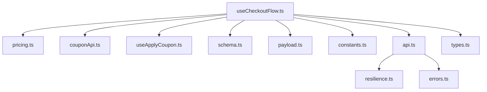

**Diagram sources**
- [useCheckoutFlow.ts:1-800](file://apps/shopper-native/src/features/checkout/hooks/useCheckoutFlow.ts#L1-L800)
- [pricing.ts:1-83](file://apps/shopper-native/src/features/checkout/pricing.ts#L1-L83)
- [couponApi.ts:1-113](file://apps/shopper-native/src/features/checkout/couponApi.ts#L1-L113)
- [useApplyCoupon.ts:1-174](file://apps/shopper-native/src/features/checkout/hooks/useApplyCoupon.ts#L1-L174)
- [schema.ts:1-73](file://apps/shopper-native/src/features/checkout/schema.ts#L1-L73)
- [payload.ts:1-153](file://apps/shopper-native/src/features/checkout/payload.ts#L1-L153)
- [constants.ts:1-61](file://apps/shopper-native/src/features/checkout/constants.ts#L1-L61)
- [api.ts:1-261](file://apps/shopper-native/src/features/checkout/api.ts#L1-L261)
- [resilience.ts:1-191](file://apps/shopper-native/src/features/checkout/resilience.ts#L1-L191)
- [errors.ts:1-50](file://apps/shopper-native/src/features/checkout/errors.ts#L1-L50)
- [types.ts:1-164](file://apps/shopper-native/src/features/checkout/types.ts#L1-L164)

**Section sources**
- [useCheckoutFlow.ts:1-800](file://apps/shopper-native/src/features/checkout/hooks/useCheckoutFlow.ts#L1-L800)
- [api.ts:1-261](file://apps/shopper-native/src/features/checkout/api.ts#L1-L261)
- [pricing.ts:1-83](file://apps/shopper-native/src/features/checkout/pricing.ts#L1-L83)
- [couponApi.ts:1-113](file://apps/shopper-native/src/features/checkout/couponApi.ts#L1-L113)
- [useApplyCoupon.ts:1-174](file://apps/shopper-native/src/features/checkout/hooks/useApplyCoupon.ts#L1-L174)
- [schema.ts:1-73](file://apps/shopper-native/src/features/checkout/schema.ts#L1-L73)
- [payload.ts:1-153](file://apps/shopper-native/src/features/checkout/payload.ts#L1-L153)
- [constants.ts:1-61](file://apps/shopper-native/src/features/checkout/constants.ts#L1-L61)
- [resilience.ts:1-191](file://apps/shopper-native/src/features/checkout/resilience.ts#L1-L191)
- [errors.ts:1-50](file://apps/shopper-native/src/features/checkout/errors.ts#L1-L50)
- [types.ts:1-164](file://apps/shopper-native/src/features/checkout/types.ts#L1-L164)

## Core Components
- Checkout orchestration hook: manages step transitions, form validation, address autofill, delivery quote integration, coupon application, manual payment receipt upload, OTP verification, order submission, and success flow.
- Pricing engine: computes subtotal, discount (server coupon or legacy promo), tax, shipping, and total; integrates with server-validated coupons.
- Coupon system: validates codes via an Edge Function, maps reasons to user-friendly messages, and feeds discount amounts into pricing.
- Payload builder: constructs typed commands including customer info, address snapshot, payment details, expected pricing, and cart lines; generates idempotency keys.
- API client: calls the create-order Edge Function with profile preflight, timeouts, error mapping, and retry/deduplication wrappers.
- Resilience layer: exponential backoff retry, in-flight request deduplication, and draft persistence for recovery after crashes.
- Validation schema: Zod-based rules mirroring backend expectations for name, phone, city, street, building, floor, apartment, note, and promo code.
- Types and constants: shared domain contracts and payment method configuration.

**Section sources**
- [useCheckoutFlow.ts:1-800](file://apps/shopper-native/src/features/checkout/hooks/useCheckoutFlow.ts#L1-L800)
- [pricing.ts:1-83](file://apps/shopper-native/src/features/checkout/pricing.ts#L1-L83)
- [couponApi.ts:1-113](file://apps/shopper-native/src/features/checkout/couponApi.ts#L1-L113)
- [useApplyCoupon.ts:1-174](file://apps/shopper-native/src/features/checkout/hooks/useApplyCoupon.ts#L1-L174)
- [payload.ts:1-153](file://apps/shopper-native/src/features/checkout/payload.ts#L1-L153)
- [api.ts:1-261](file://apps/shopper-native/src/features/checkout/api.ts#L1-L261)
- [resilience.ts:1-191](file://apps/shopper-native/src/features/checkout/resilience.ts#L1-L191)
- [schema.ts:1-73](file://apps/shopper-native/src/features/checkout/schema.ts#L1-L73)
- [types.ts:1-164](file://apps/shopper-native/src/features/checkout/types.ts#L1-L164)
- [constants.ts:1-61](file://apps/shopper-native/src/features/checkout/constants.ts#L1-L61)

## Architecture Overview
The checkout flow orchestrates multiple subsystems to validate inputs, compute pricing, apply coupons, handle payments, and submit orders reliably.

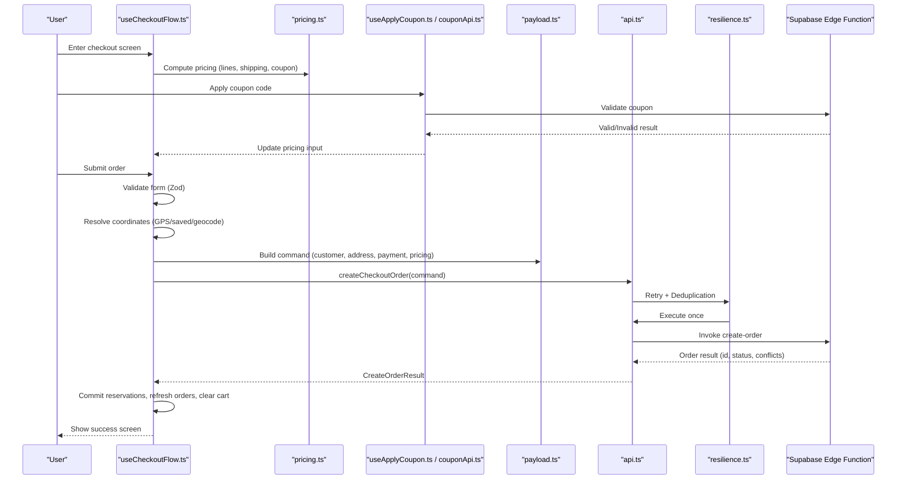

**Diagram sources**
- [useCheckoutFlow.ts:1-800](file://apps/shopper-native/src/features/checkout/hooks/useCheckoutFlow.ts#L1-L800)
- [pricing.ts:1-83](file://apps/shopper-native/src/features/checkout/pricing.ts#L1-L83)
- [useApplyCoupon.ts:1-174](file://apps/shopper-native/src/features/checkout/hooks/useApplyCoupon.ts#L1-L174)
- [couponApi.ts:1-113](file://apps/shopper-native/src/features/checkout/couponApi.ts#L1-L113)
- [payload.ts:1-153](file://apps/shopper-native/src/features/checkout/payload.ts#L1-L153)
- [api.ts:1-261](file://apps/shopper-native/src/features/checkout/api.ts#L1-L261)
- [resilience.ts:1-191](file://apps/shopper-native/src/features/checkout/resilience.ts#L1-L191)

## Detailed Component Analysis

### Checkout Flow Orchestrator (useCheckoutFlow)
Responsibilities:
- Step state machine: details → review → success
- Form lifecycle with React Hook Form and Zod validation
- Autofill from account profile and saved addresses
- Delivery quote integration and coordinate resolution (GPS, saved address, geocoding fallback)
- Manual wallet payment receipt pick/upload and transfer number capture
- Optional phone OTP verification before submission
- Draft persistence and recovery
- Idempotent submission with duplicate guard
- Analytics tracking and haptic feedback
- Post-submit cleanup: commit reservations, refresh orders, clear cart/reset state

Key behaviors:
- Duplicate submission prevention using a synchronous ref guard plus server-side idempotency key
- Three-tier coordinate resolution ensures best-effort location accuracy without blocking order placement
- For manual wallets, uploads proof image and patches order if needed based on returned status
- On success, clears local state and navigates to confirmation

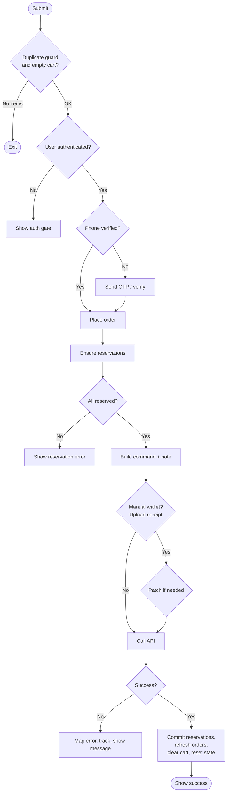

**Diagram sources**
- [useCheckoutFlow.ts:1-800](file://apps/shopper-native/src/features/checkout/hooks/useCheckoutFlow.ts#L1-L800)

**Section sources**
- [useCheckoutFlow.ts:1-800](file://apps/shopper-native/src/features/checkout/hooks/useCheckoutFlow.ts#L1-L800)

### Pricing Engine
Rules:
- Normalize line quantities and unit prices; compute line totals
- Sum item count and subtotal
- Discount precedence: server-validated coupon amount > legacy promo code (e.g., UNITED10)
- Tax computed on discounted subtotal
- Shipping added from delivery quote
- All money rounded to two decimals

Inputs:
- Cart lines, optional promo code, shipping fee, tax rate, and server coupon amount

Outputs:
- Structured pricing object consumed by payload builder and analytics

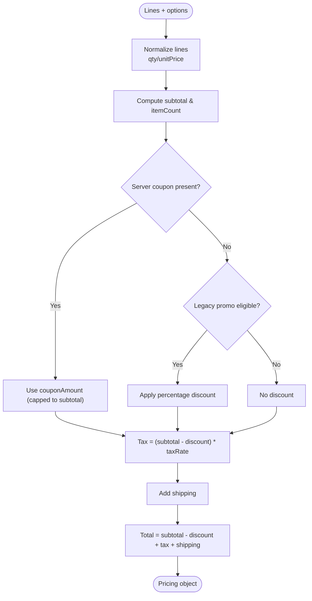

**Diagram sources**
- [pricing.ts:1-83](file://apps/shopper-native/src/features/checkout/pricing.ts#L1-L83)

**Section sources**
- [pricing.ts:1-83](file://apps/shopper-native/src/features/checkout/pricing.ts#L1-L83)

### Coupon Application
Workflow:
- User enters code and taps Apply
- Hook debounces double-taps and calls validate-coupon Edge Function
- Server returns valid/invalid with reason and discount details
- Valid results update pricing via couponAmount; invalid results display localized messages
- Results are cached locally to avoid revalidation on every render

Integration points:
- useApplyCoupon composes validation and UI state
- pricing.ts consumes couponAmount when computing totals
- Analytics track applied/failed coupons

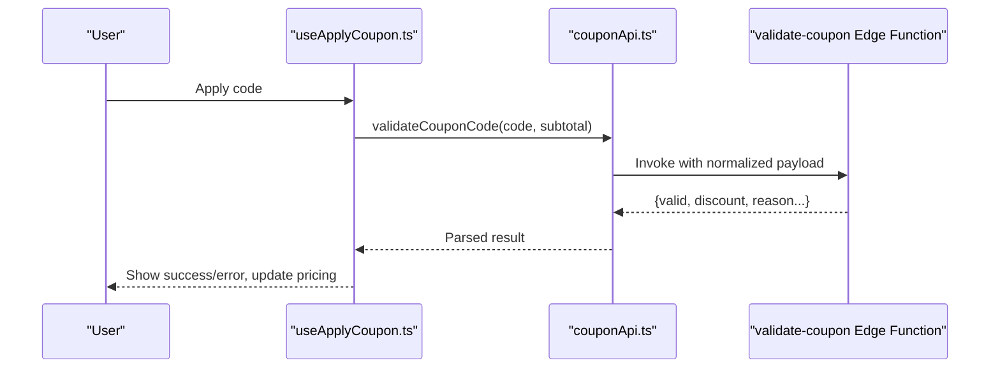

**Diagram sources**
- [useApplyCoupon.ts:1-174](file://apps/shopper-native/src/features/checkout/hooks/useApplyCoupon.ts#L1-L174)
- [couponApi.ts:1-113](file://apps/shopper-native/src/features/checkout/couponApi.ts#L1-L113)

**Section sources**
- [useApplyCoupon.ts:1-174](file://apps/shopper-native/src/features/checkout/hooks/useApplyCoupon.ts#L1-L174)
- [couponApi.ts:1-113](file://apps/shopper-native/src/features/checkout/couponApi.ts#L1-L113)

### Address Management Integration
- Autofill from saved default address when enabled
- Coordinate resolution prioritizes GPS, then saved address coordinates, then geocodes typed address as a best-effort fallback
- Address snapshot built for server includes formatted string, city, street line, optional region/subregion, building/floor/apartment, and lat/lng

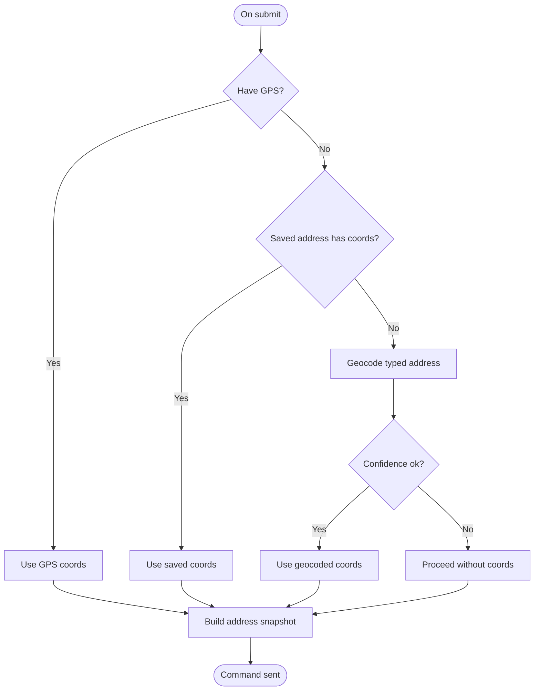

**Diagram sources**
- [useCheckoutFlow.ts:1-800](file://apps/shopper-native/src/features/checkout/hooks/useCheckoutFlow.ts#L1-L800)
- [payload.ts:1-153](file://apps/shopper-native/src/features/checkout/payload.ts#L1-L153)

**Section sources**
- [useCheckoutFlow.ts:1-800](file://apps/shopper-native/src/features/checkout/hooks/useCheckoutFlow.ts#L1-L800)
- [payload.ts:1-153](file://apps/shopper-native/src/features/checkout/payload.ts#L1-L153)

### Payment Method Selection and Processing
Supported methods include COD, InstaPay, Vodafone Cash, online, and bank transfers. Labels and icons are centralized for consistent UI.

Processing specifics:
- Manual wallet methods require transfer number and receipt upload
- Receipt upload handles permissions and errors with mapped messages
- After order creation, if manual wallet and status indicates pending verification, patch order with transfer number and proof URL

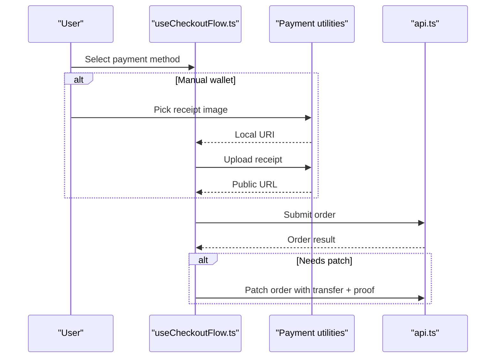

**Diagram sources**
- [useCheckoutFlow.ts:1-800](file://apps/shopper-native/src/features/checkout/hooks/useCheckoutFlow.ts#L1-L800)
- [constants.ts:1-61](file://apps/shopper-native/src/features/checkout/constants.ts#L1-L61)

**Section sources**
- [useCheckoutFlow.ts:1-800](file://apps/shopper-native/src/features/checkout/hooks/useCheckoutFlow.ts#L1-L800)
- [constants.ts:1-61](file://apps/shopper-native/src/features/checkout/constants.ts#L1-L61)

### Order Submission API and Resilience
- Ensures profile row exists before invoking create-order
- Enforces timeout on function invocation
- Maps HTTP/relay/fetch errors to typed CheckoutRequestError with retry flags
- Wraps calls with retry (exponential backoff + jitter) and in-flight deduplication keyed by idempotency key
- Returns structured result including order metadata and conflicts

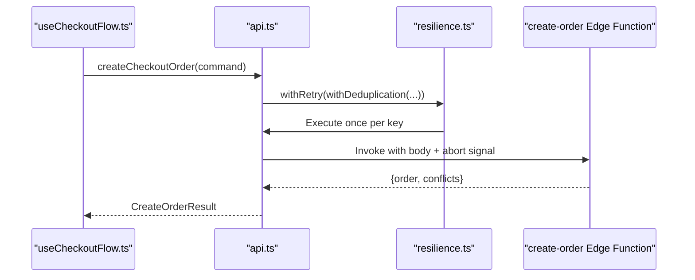

**Diagram sources**
- [api.ts:1-261](file://apps/shopper-native/src/features/checkout/api.ts#L1-L261)
- [resilience.ts:1-191](file://apps/shopper-native/src/features/checkout/resilience.ts#L1-L191)

**Section sources**
- [api.ts:1-261](file://apps/shopper-native/src/features/checkout/api.ts#L1-L261)
- [resilience.ts:1-191](file://apps/shopper-native/src/features/checkout/resilience.ts#L1-L191)

### Form Validation Schema
- Uses Zod to mirror backend validation expectations
- Validates full name length, Egyptian mobile phone format, city selection, street/building/floor/apartment constraints, and optional fields
- Integrates with React Hook Form for controlled inputs and live validation

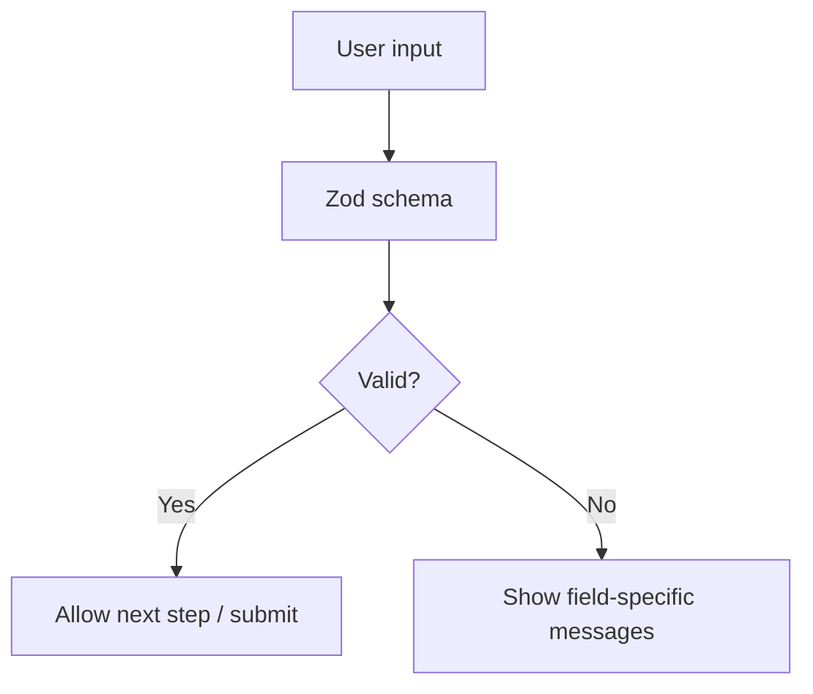

**Diagram sources**
- [schema.ts:1-73](file://apps/shopper-native/src/features/checkout/schema.ts#L1-L73)

**Section sources**
- [schema.ts:1-73](file://apps/shopper-native/src/features/checkout/schema.ts#L1-L73)

### State Machine
Steps:
- Details: collect and validate shipping/contact info, select payment method, apply coupon
- Review: confirm pricing, address, and payment details
- Success: show confirmation, clear cart, reset state

Transitions:
- Details → Review: triggered by successful form validation
- Review → Success: triggered by successful order placement and post-processing
- Failure paths: remain on current step with user-facing error messages

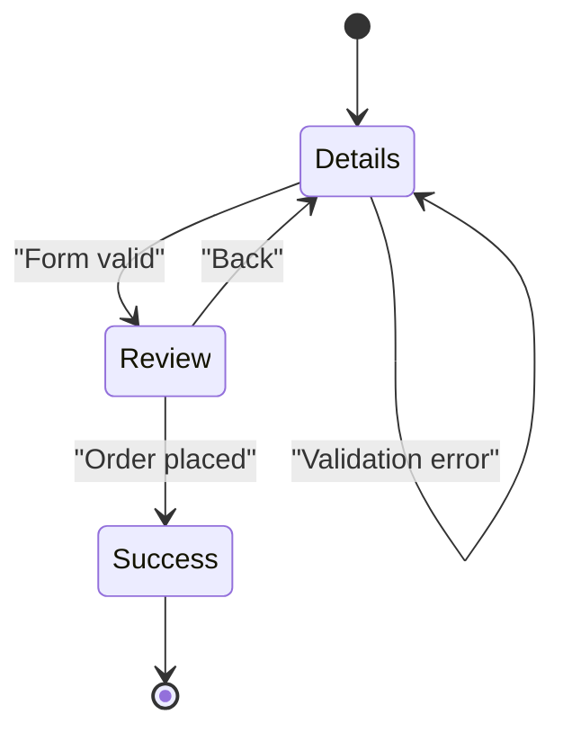

**Diagram sources**
- [useCheckoutFlow.ts:1-800](file://apps/shopper-native/src/features/checkout/hooks/useCheckoutFlow.ts#L1-L800)

**Section sources**
- [useCheckoutFlow.ts:1-800](file://apps/shopper-native/src/features/checkout/hooks/useCheckoutFlow.ts#L1-L800)

## Dependency Analysis
- useCheckoutFlow depends on:
  - Pricing engine for totals and discount computation
  - Coupon hook/API for server-side validation
  - Payload builder for command construction
  - API client for order creation
  - Resilience utilities for retries and deduplication
  - Schema for validation
  - Constants for payment labels and configs
  - Types for shared contracts
- api.ts depends on resilience and errors for robust network behavior
- couponApi.ts depends on resilience for retry logic
- payload.ts depends on types for structure

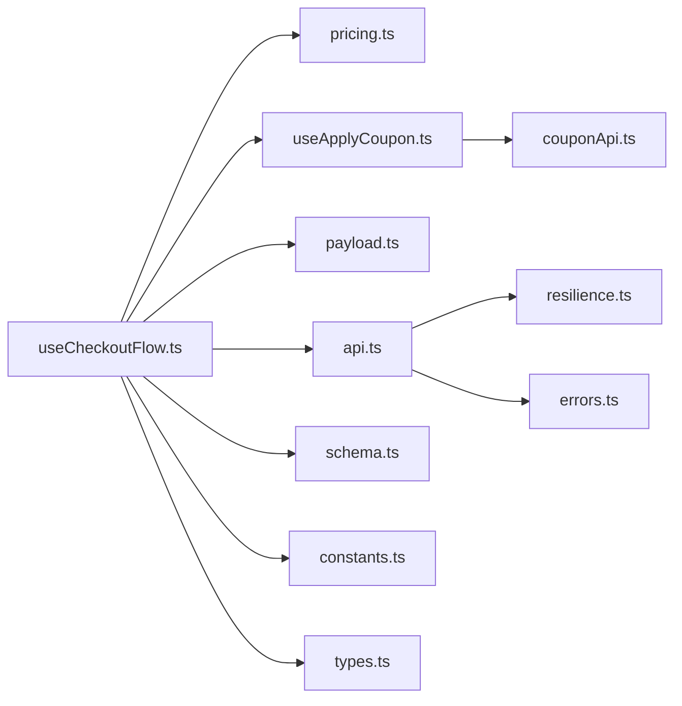

**Diagram sources**
- [useCheckoutFlow.ts:1-800](file://apps/shopper-native/src/features/checkout/hooks/useCheckoutFlow.ts#L1-L800)
- [pricing.ts:1-83](file://apps/shopper-native/src/features/checkout/pricing.ts#L1-L83)
- [useApplyCoupon.ts:1-174](file://apps/shopper-native/src/features/checkout/hooks/useApplyCoupon.ts#L1-L174)
- [couponApi.ts:1-113](file://apps/shopper-native/src/features/checkout/couponApi.ts#L1-L113)
- [payload.ts:1-153](file://apps/shopper-native/src/features/checkout/payload.ts#L1-L153)
- [api.ts:1-261](file://apps/shopper-native/src/features/checkout/api.ts#L1-L261)
- [resilience.ts:1-191](file://apps/shopper-native/src/features/checkout/resilience.ts#L1-L191)
- [errors.ts:1-50](file://apps/shopper-native/src/features/checkout/errors.ts#L1-L50)
- [schema.ts:1-73](file://apps/shopper-native/src/features/checkout/schema.ts#L1-L73)
- [constants.ts:1-61](file://apps/shopper-native/src/features/checkout/constants.ts#L1-L61)
- [types.ts:1-164](file://apps/shopper-native/src/features/checkout/types.ts#L1-L164)

**Section sources**
- [useCheckoutFlow.ts:1-800](file://apps/shopper-native/src/features/checkout/hooks/useCheckoutFlow.ts#L1-L800)
- [api.ts:1-261](file://apps/shopper-native/src/features/checkout/api.ts#L1-L261)
- [resilience.ts:1-191](file://apps/shopper-native/src/features/checkout/resilience.ts#L1-L191)

## Performance Considerations
- Memoized pricing and cart lines reduce unnecessary recalculations
- Granular store selectors minimize re-renders
- In-flight deduplication prevents duplicate network requests
- Exponential backoff with jitter reduces load during transient failures
- Best-effort geocoding avoids blocking order placement
- Draft persistence enables quick recovery without losing progress

[No sources needed since this section provides general guidance]

## Troubleshooting Guide
Common issues and resolutions:
- Network/timeout errors: handled by retry wrapper; map to user-friendly messages; consider connectivity checks
- Authentication errors: session expired prompts guide users to re-login
- Reservation conflicts: surface out-of-stock or price change messages; prompt cart refresh
- Coupon validation failures: display localized reasons such as not found, expired, limit reached, first order only, or minimum order not met
- Manual wallet receipt upload failures: map permission/read/upload errors to specific messages; allow retry
- Duplicate submissions: prevented by synchronous guard and server idempotency key

Relevant error mapping and formatting utilities:
- CheckoutRequestError categorization and retry flags
- formatCheckoutError for consistent messaging

**Section sources**
- [errors.ts:1-50](file://apps/shopper-native/src/features/checkout/errors.ts#L1-L50)
- [api.ts:1-261](file://apps/shopper-native/src/features/checkout/api.ts#L1-L261)
- [useApplyCoupon.ts:1-174](file://apps/shopper-native/src/features/checkout/hooks/useApplyCoupon.ts#L1-L174)

## Conclusion
The checkout module provides a robust, resilient, and user-friendly flow from cart review to order confirmation. It integrates pricing, coupons, address management, and payment processing with strong error handling and retry mechanisms. The modular design separates concerns across hooks, services, and utilities, enabling maintainability and extensibility for future payment providers and features.

[No sources needed since this section summarizes without analyzing specific files]