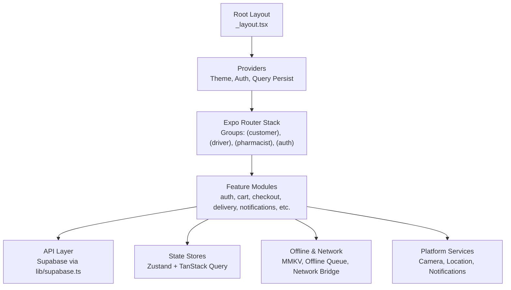
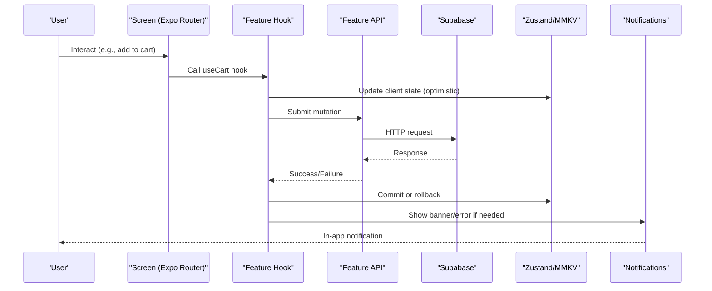
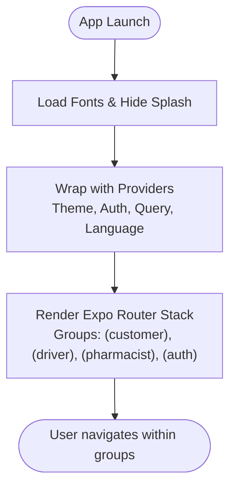
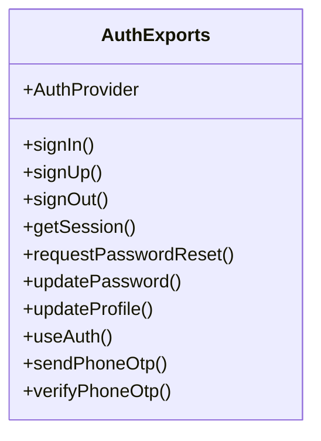
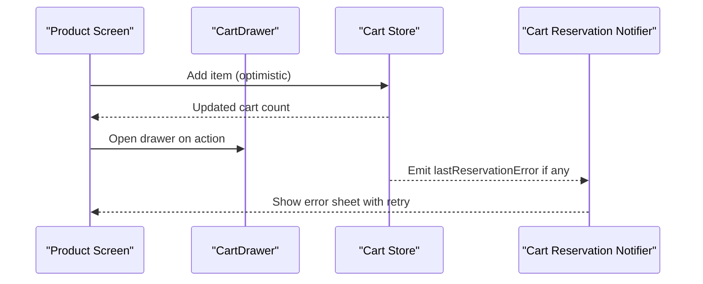
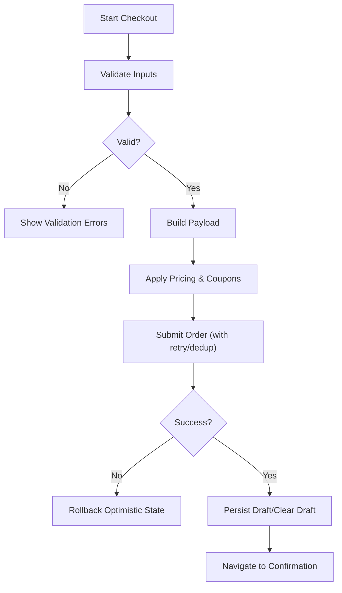
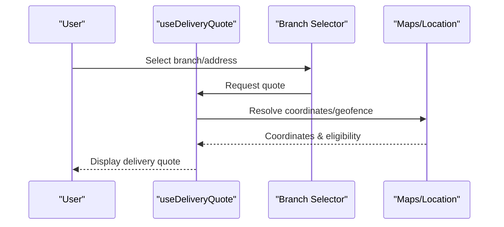
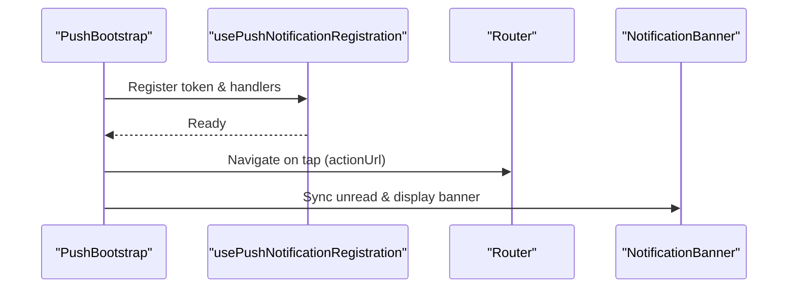
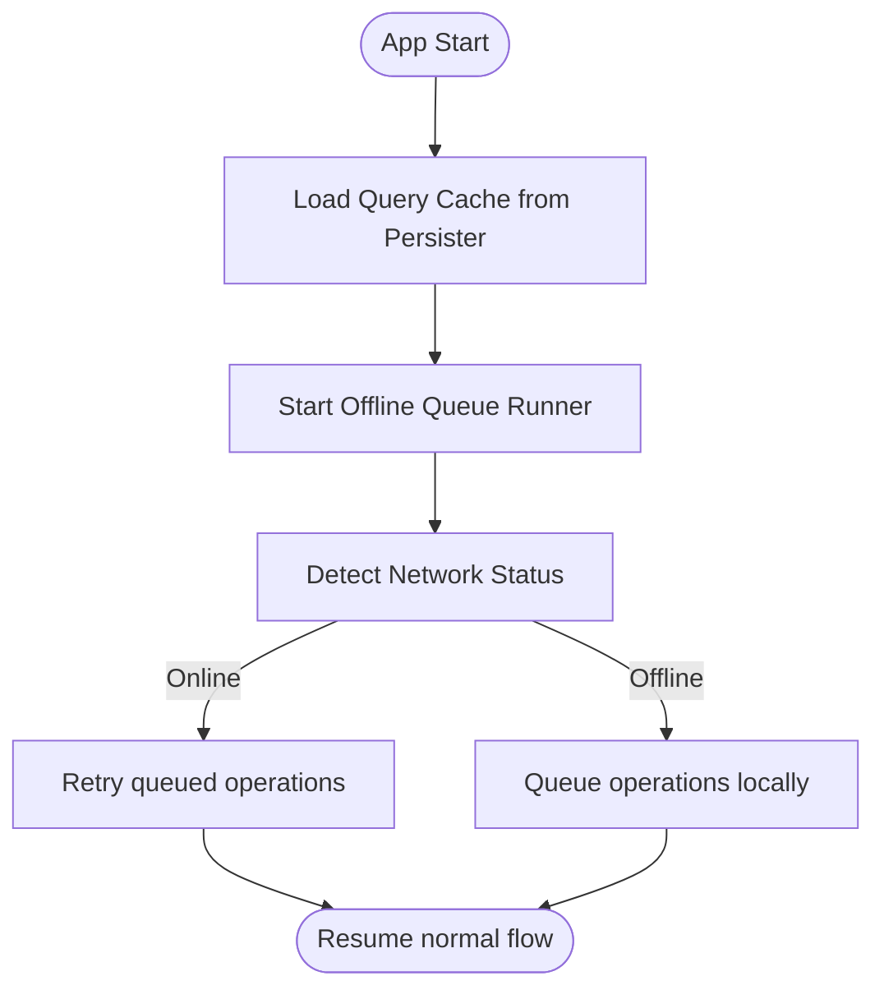
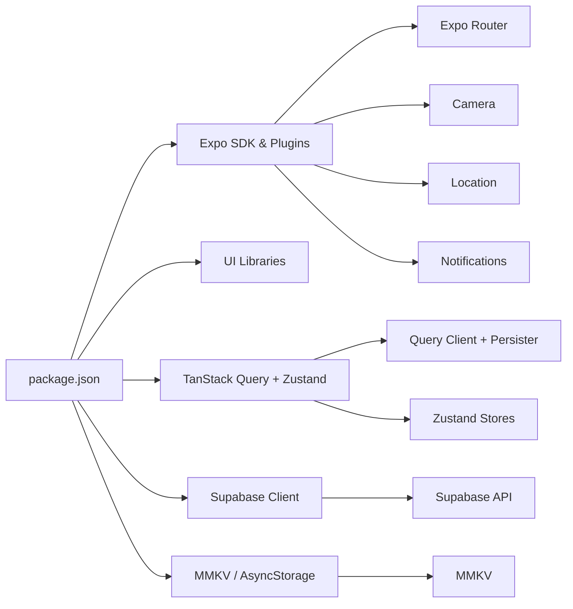

# Shopper Native App

<cite>
**Referenced Files in This Document**
- [package.json](file://apps/shopper-native/package.json)
- [app.json](file://apps/shopper-native/app.json)
- [_layout.tsx](file://apps/shopper-native/app/_layout.tsx)
- [ARCHITECTURE.md](file://apps/shopper-native/ARCHITECTURE.md)
- [auth/index.ts](file://apps/shopper-native/src/features/auth/index.ts)
- [cart/index.ts](file://apps/shopper-native/src/features/cart/index.ts)
- [checkout/index.ts](file://apps/shopper-native/src/features/checkout/index.ts)
- [delivery/useDeliveryQuote.ts](file://apps/shopper-native/src/features/delivery/useDeliveryQuote.ts)
- [mmkv.ts](file://apps/shopper-native/src/lib/mmkv.ts)
- [queryClient.ts](file://apps/shopper-native/src/lib/queryClient.ts)
- [queryPersister.ts](file://apps/shopper-native/src/lib/queryPersister.ts)
- [networkStatus.ts](file://apps/shopper-native/src/lib/networkStatus.ts)
- [offlineQueueRunner.ts](file://apps/shopper-native/src/lib/offlineQueueRunner.ts)
- [supabase.ts](file://apps/shopper-native/src/lib/supabase.ts)
</cite>

## Table of Contents
1. [Introduction](#introduction)
2. [Project Structure](#project-structure)
3. [Core Components](#core-components)
4. [Architecture Overview](#architecture-overview)
5. [Detailed Component Analysis](#detailed-component-analysis)
6. [Dependency Analysis](#dependency-analysis)
7. [Performance Considerations](#performance-considerations)
8. [Troubleshooting Guide](#troubleshooting-guide)
9. [Conclusion](#conclusion)
10. [Appendices](#appendices)

## Introduction
This document provides comprehensive documentation for the shopper native mobile application built with Expo and React Native. It explains the Expo Router navigation structure, feature-based organization (auth, cart, checkout, delivery, prescriptions, products, notifications), platform-specific implementations for iOS and Android, offline capabilities using MMKV storage, push notifications integration, real-time features via WebSocket connections, component hierarchy, state management patterns, API client integration, cross-platform compatibility strategies, and mobile-specific features such as camera integration for prescription scanning, geolocation services for delivery tracking, background processing, and battery optimization techniques.

## Project Structure
The app follows a feature-driven architecture with file-based routing through Expo Router. The root layout composes providers, bootstraps network status, language, authentication, notifications, and defines route groups for customer, driver, pharmacist, and auth flows. Features are organized under src/features with a consistent shape: index barrel, types, store, api, hooks, components, and data when applicable. Shared utilities live under src/lib and shared components under src/shared/components. Platform configuration is centralized in app.json and package.json.

**Diagram sources**
- [_layout.tsx:179-224](file://apps/shopper-native/app/_layout.tsx#L179-L224)
- [ARCHITECTURE.md:9-35](file://apps/shopper-native/ARCHITECTURE.md#L9-L35)

**Section sources**
- [_layout.tsx:1-292](file://apps/shopper-native/app/_layout.tsx#L1-L292)
- [ARCHITECTURE.md:1-178](file://apps/shopper-native/ARCHITECTURE.md#L1-L178)
- [package.json:1-104](file://apps/shopper-native/package.json#L1-L104)
- [app.json:1-113](file://apps/shopper-native/app.json#L1-L113)

## Core Components
- Root layout and providers: Initializes fonts, splash screen, error boundaries, theme provider, auth provider, query persistence, network bridge, language provider, notification sync, push registration, and route stack.
- Feature modules: Each feature exposes a public barrel for imports, encapsulating UI, hooks, stores, and API calls. Examples include auth, cart, checkout, delivery, and notifications.
- API layer: Centralized Supabase client usage with typed requests and error mapping.
- State management: TanStack Query for server state; Zustand for client state with persistence via MMKV or AsyncStorage.
- Offline and networking: Network status bridging, offline queue runner, and request retry/deduplication helpers.

**Section sources**
- [_layout.tsx:109-224](file://apps/shopper-native/app/_layout.tsx#L109-L224)
- [auth/index.ts:1-25](file://apps/shopper-native/src/features/auth/index.ts#L1-L25)
- [cart/index.ts:1-2](file://apps/shopper-native/src/features/cart/index.ts#L1-L2)
- [checkout/index.ts:1-24](file://apps/shopper-native/src/features/checkout/index.ts#L1-L24)
- [ARCHITECTURE.md:109-123](file://apps/shopper-native/ARCHITECTURE.md#L109-L123)

## Architecture Overview
The application uses a layered architecture:
- Presentation: Expo Router screens grouped by role (customer, driver, pharmacist) and auth flows.
- Feature layer: Vertical slices owning domain logic, UI, and local state.
- Service layer: API clients to Supabase, with resilience patterns (retry, deduplication).
- Data layer: TanStack Query cache with persistence; MMKV-backed stores for fast client state.
- Cross-cutting: Notifications (push and in-app), network status, i18n, observability, crash enrichment.

**Diagram sources**
- [_layout.tsx:109-175](file://apps/shopper-native/app/_layout.tsx#L109-L175)
- [checkout/index.ts:1-24](file://apps/shopper-native/src/features/checkout/index.ts#L1-L24)
- [queryClient.ts:1-200](file://apps/shopper-native/src/lib/queryClient.ts#L1-L200)
- [queryPersister.ts:1-200](file://apps/shopper-native/src/lib/queryPersister.ts#L1-L200)

## Detailed Component Analysis

### Navigation and Route Groups
- Root layout configures a single Stack with multiple route groups: (customer), (driver), (pharmacist), and (auth). Screens are registered via file-based routes under app/.
- Global providers wrap the entire app: ThemeProvider, AuthProvider, PersistQueryClientProvider, LanguageProvider, ErrorBoundary, NetworkBridge, NotificationSync, PushBootstrap, CartReservationNotifier.
- Splash and font loading occur at startup; errors are captured at root and splash overlay levels.

**Diagram sources**
- [_layout.tsx:230-292](file://apps/shopper-native/app/_layout.tsx#L230-L292)
- [_layout.tsx:179-224](file://apps/shopper-native/app/_layout.tsx#L179-L224)

**Section sources**
- [_layout.tsx:1-292](file://apps/shopper-native/app/_layout.tsx#L1-L292)

### Authentication Feature
- Public surface exports sign-in/sign-up/session management, password reset/profile updates, phone OTP flow, social auth buttons, and context/provider.
- Role-aware flows are supported via route groups and guards implemented in screens/layouts.

**Diagram sources**
- [auth/index.ts:1-25](file://apps/shopper-native/src/features/auth/index.ts#L1-L25)

**Section sources**
- [auth/index.ts:1-25](file://apps/shopper-native/src/features/auth/index.ts#L1-L25)

### Cart Feature
- Exposes CartDrawer component and ref type for controlling the drawer from screens.
- Integrates with global cart store for item management and reservation error handling surfaced in the root layout.

**Diagram sources**
- [cart/index.ts:1-2](file://apps/shopper-native/src/features/cart/index.ts#L1-L2)
- [_layout.tsx:155-175](file://apps/shopper-native/app/_layout.tsx#L155-L175)

**Section sources**
- [cart/index.ts:1-2](file://apps/shopper-native/src/features/cart/index.ts#L1-L2)
- [_layout.tsx:155-175](file://apps/shopper-native/app/_layout.tsx#L155-L175)

### Checkout Feature
- Provides pricing engine, validation, payload building, error mapping, schema definitions, manual payment support, and resilience helpers (retry, deduplication, draft persistence).
- Encourages optimistic mutations with rollback on failure and structured error handling.

**Diagram sources**
- [checkout/index.ts:1-24](file://apps/shopper-native/src/features/checkout/index.ts#L1-L24)

**Section sources**
- [checkout/index.ts:1-24](file://apps/shopper-native/src/features/checkout/index.ts#L1-L24)

### Delivery Feature
- Includes branch selection, geofencing, location store, and quote calculation via hooks.
- Uses geolocation services and maps for delivery address resolution and driver assistance.

**Diagram sources**
- [delivery/useDeliveryQuote.ts:1-200](file://apps/shopper-native/src/features/delivery/useDeliveryQuote.ts#L1-L200)

**Section sources**
- [delivery/useDeliveryQuote.ts:1-200](file://apps/shopper-native/src/features/delivery/useDeliveryQuote.ts#L1-L200)

### Notifications and Real-time
- Push notifications are registered and handled at app start, marking notifications read and navigating based on action URLs.
- In-app notifications are synchronized and displayed via a banner component.
- Real-time features integrate with WebSocket connections where applicable (e.g., order tracking, driver location updates).

**Diagram sources**
- [_layout.tsx:121-151](file://apps/shopper-native/app/_layout.tsx#L121-L151)
- [_layout.tsx:109-117](file://apps/shopper-native/app/_layout.tsx#L109-L117)

**Section sources**
- [_layout.tsx:109-151](file://apps/shopper-native/app/_layout.tsx#L109-L151)

### Offline Capabilities and Storage
- MMKV is used for fast key-value storage, often backing Zustand stores or caching small payloads.
- TanStack Query persists its cache across sessions using a persister configured in queryPersister.ts.
- An offline queue runner batches and retries failed operations when connectivity is restored.

**Diagram sources**
- [queryPersister.ts:1-200](file://apps/shopper-native/src/lib/queryPersister.ts#L1-L200)
- [offlineQueueRunner.ts:1-200](file://apps/shopper-native/src/lib/offlineQueueRunner.ts#L1-L200)
- [networkStatus.ts:1-200](file://apps/shopper-native/src/lib/networkStatus.ts#L1-L200)
- [mmkv.ts:1-200](file://apps/shopper-native/src/lib/mmkv.ts#L1-L200)

**Section sources**
- [queryPersister.ts:1-200](file://apps/shopper-native/src/lib/queryPersister.ts#L1-L200)
- [offlineQueueRunner.ts:1-200](file://apps/shopper-native/src/lib/offlineQueueRunner.ts#L1-L200)
- [networkStatus.ts:1-200](file://apps/shopper-native/src/lib/networkStatus.ts#L1-L200)
- [mmkv.ts:1-200](file://apps/shopper-native/src/lib/mmkv.ts#L1-L200)

### Platform-Specific Implementations
- iOS: Info.plist includes location permission description; supports tablet orientation; new architecture enabled.
- Android: Permissions declared for camera, audio, and fine/coarse location; Google services integration for push notifications; Kotlin version and build optimizations configured.
- Web: Web entry point initialization and bundler settings; web-only assets and behaviors isolated via .web.ts files.

**Section sources**
- [app.json:16-39](file://apps/shopper-native/app.json#L16-L39)
- [app.json:45-98](file://apps/shopper-native/app.json#L45-L98)
- [app.json:40-44](file://apps/shopper-native/app.json#L40-L44)

### Mobile-Specific Features
- Camera Integration: Used for prescription scanning and receipt uploads; permissions configured via plugins.
- Geolocation Services: Enables precise delivery addresses and driver navigation; permissions and descriptions set in app.json.
- Background Processing: Offline queue runner ensures background retries; push notifications handle taps and mark items read.
- Battery Optimization: Minimize unnecessary polling; leverage event-driven updates via push and real-time channels; use efficient lists and image prefetching.

**Section sources**
- [app.json:70-88](file://apps/shopper-native/app.json#L70-L88)
- [package.json:37-50](file://apps/shopper-native/package.json#L37-L50)

## Dependency Analysis
Key dependencies and their roles:
- Expo ecosystem: Router, Camera, Location, Notifications, Splash, Video, System UI, Updates.
- UI and UX: Gesture Handler, Reanimated, Safe Area Context, Flash List, SVG, WebView.
- State and Data: TanStack Query with persist client, Zustand, Zod for validation.
- Networking: Supabase JS client; custom request wrappers and network status bridge.
- Storage: MMKV for fast storage; AsyncStorage fallback where needed.

**Diagram sources**
- [package.json:17-79](file://apps/shopper-native/package.json#L17-L79)
- [queryClient.ts:1-200](file://apps/shopper-native/src/lib/queryClient.ts#L1-L200)
- [queryPersister.ts:1-200](file://apps/shopper-native/src/lib/queryPersister.ts#L1-L200)
- [mmkv.ts:1-200](file://apps/shopper-native/src/lib/mmkv.ts#L1-L200)
- [supabase.ts:1-200](file://apps/shopper-native/src/lib/supabase.ts#L1-L200)

**Section sources**
- [package.json:17-79](file://apps/shopper-native/package.json#L17-L79)

## Performance Considerations
- Use Flash List for large product/order lists to improve scroll performance.
- Prefer selector-based subscriptions in Zustand to minimize re-renders.
- Leverage TanStack Query caching and persistence to reduce network calls.
- Defer heavy work off the main thread using worklets where appropriate.
- Optimize images with expo-image and prefetch critical assets.
- Keep animations minimal and use Reanimated for smooth transitions.
- Enable ProGuard/minify in release builds and ensure new architecture is enabled for performance gains.

[No sources needed since this section provides general guidance]

## Troubleshooting Guide
- Global error handling: Root-level ErrorBoundary captures crashes; splash overlay has its own boundary to avoid blocking recovery UI.
- Network issues: NetworkBridge monitors connectivity; offline queue runner retries failed operations; banners inform users of connectivity changes.
- Push notifications: Registration and tap handling are centralized; ensure tokens are sent to backend and actions navigate correctly.
- Storage keys: Namespaced under STORAGE_KEYS to avoid collisions; verify MMKV keys when debugging state persistence.
- Dev-only diagnostics: Use __DEV__ guards for console logs; avoid production logging.

**Section sources**
- [_layout.tsx:81-105](file://apps/shopper-native/app/_layout.tsx#L81-L105)
- [_layout.tsx:256-284](file://apps/shopper-native/app/_layout.tsx#L256-L284)
- [offlineQueueRunner.ts:1-200](file://apps/shopper-native/src/lib/offlineQueueRunner.ts#L1-L200)
- [networkStatus.ts:1-200](file://apps/shopper-native/src/lib/networkStatus.ts#L1-L200)

## Conclusion
The shopper native app is structured around a robust feature-based architecture with clear separation of concerns, strong state management via TanStack Query and Zustand, and resilient networking with offline support. Expo Router provides intuitive navigation with role-based route groups. Platform-specific configurations enable camera, location, and push notifications essential for pharmacy delivery workflows. Adhering to the documented conventions ensures maintainability, scalability, and a high-quality user experience across iOS and Android.

[No sources needed since this section summarizes without analyzing specific files]

## Appendices

### API Client Integration
- Supabase client is centralized in lib/supabase.ts and consumed by feature APIs.
- Requests are wrapped with error mapping and retry strategies where necessary.
- Observability and telemetry are attached to the query client for insights.

**Section sources**
- [supabase.ts:1-200](file://apps/shopper-native/src/lib/supabase.ts#L1-L200)
- [_layout.tsx:85-89](file://apps/shopper-native/app/_layout.tsx#L85-L89)

### Cross-Platform Compatibility Strategies
- File-based routing abstracts platform differences; web-specific initializations are isolated.
- Platform checks guard native-only code paths.
- Consistent theming via ThemeProvider ensures uniform UI across platforms.

**Section sources**
- [_layout.tsx:1-20](file://apps/shopper-native/app/_layout.tsx#L1-L20)
- [_layout.tsx:189-195](file://apps/shopper-native/app/_layout.tsx#L189-L195)