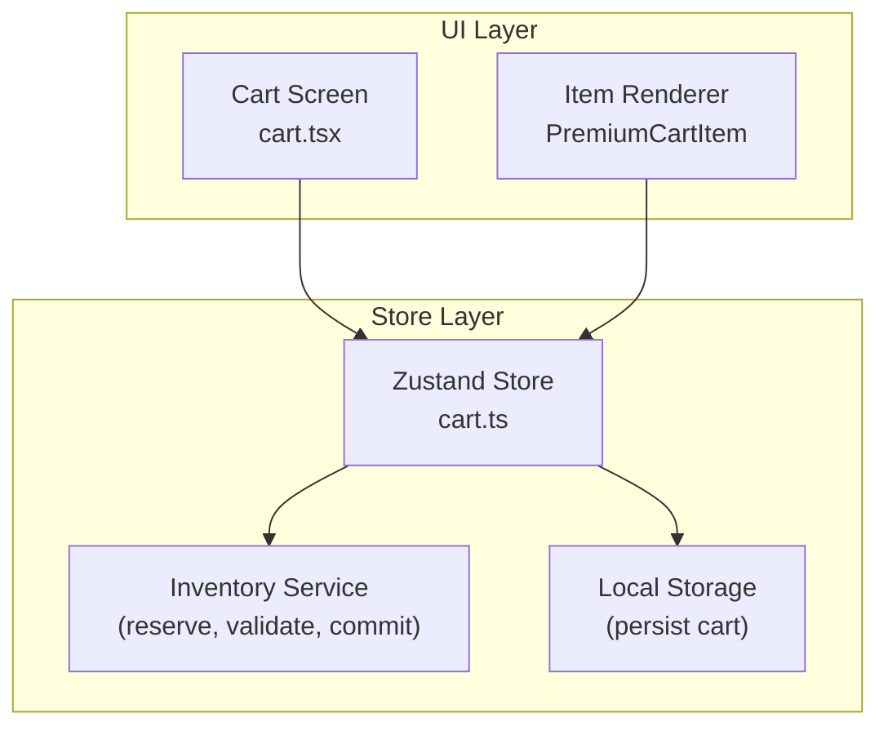
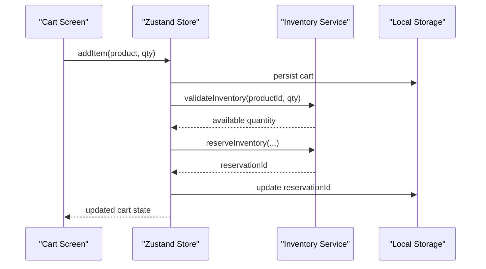
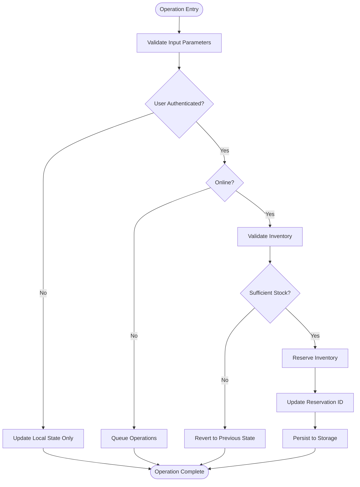
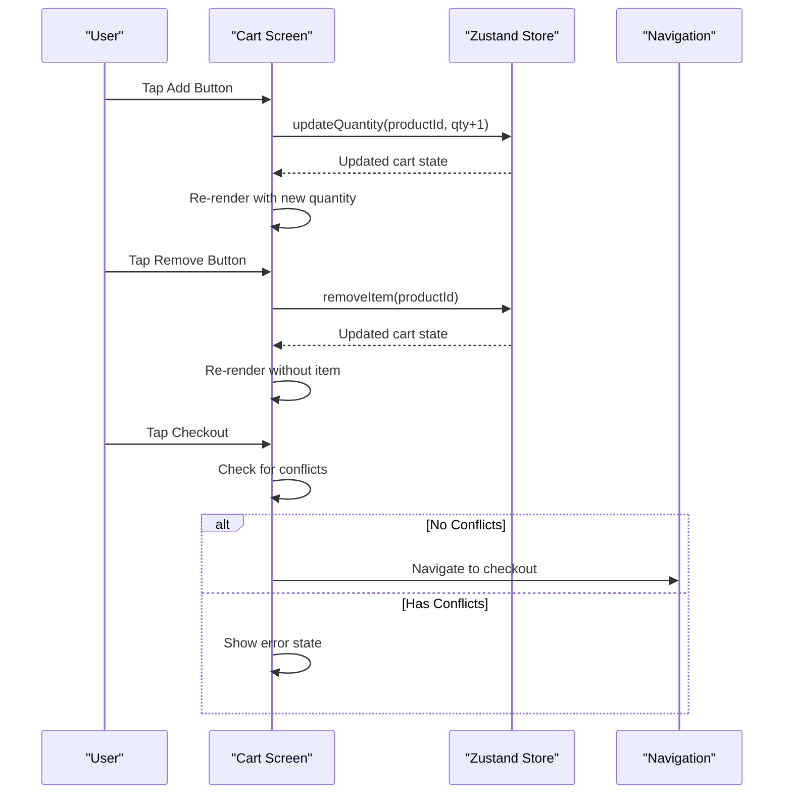
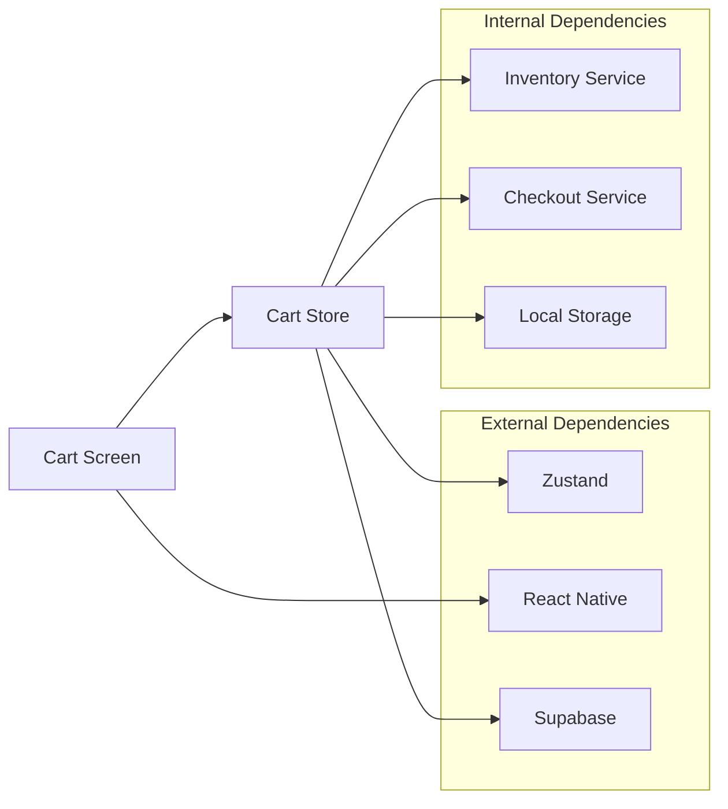

# Shopping Cart Module

<cite>
**Referenced Files in This Document**
- [cart.ts](file://apps\shopper-native\src\stores\cart.ts)
- [cart.tsx](file://apps\shopper-native\app\(customer)\(tabs)\cart.tsx)
- [index.ts](file://packages\domain-cart\src\index.ts)
</cite>

## Table of Contents
1. [Introduction](#introduction)
2. [Project Structure](#project-structure)
3. [Core Components](#core-components)
4. [Architecture Overview](#architecture-overview)
5. [Detailed Component Analysis](#detailed-component-analysis)
6. [Dependency Analysis](#dependency-analysis)
7. [Performance Considerations](#performance-considerations)
8. [Troubleshooting Guide](#troubleshooting-guide)
9. [Conclusion](#conclusion)
10. [Appendices](#appendices)

## Introduction
This document provides comprehensive documentation for the shopping cart module, focusing on:
- Cart state management with Zustand
- Item operations (add, remove, update quantities)
- Cart persistence using local storage
- Real-time inventory validation and reservations
- Checkout integration and pricing calculations
- UI rendering of cart items and checkout flow
- Offline behavior and synchronization strategies

The implementation is centered around a Zustand store that manages cart state, integrates with inventory services to reserve stock, and persists data locally. The UI renders cart items, handles user interactions, and navigates to checkout when ready.

## Project Structure
The shopping cart module spans two primary areas:
- Store layer: Zustand-based state management with business logic for cart operations, inventory integration, and persistence
- UI layer: React Native screen that renders cart items, handles user interactions, and integrates with navigation

**Diagram sources**
- [cart.ts:24-49](file://apps\shopper-native\src\stores\cart.ts#L24-L49)
- [cart.tsx:16-20](file://apps\shopper-native\app\(customer)\(tabs)\cart.tsx#L16-L20)

**Section sources**
- [cart.ts:24-49](file://apps\shopper-native\src\stores\cart.ts#L24-L49)
- [cart.tsx:16-20](file://apps\shopper-native\app\(customer)\(tabs)\cart.tsx#L16-L20)

## Core Components
- Zustand store for cart state and mutations
- Cart screen component for rendering and user interactions
- Inventory integration for real-time validation and reservations
- Local storage for persistence across sessions

Key responsibilities:
- Manage cart items, quantities, and metadata
- Enforce inventory constraints and handle reservation lifecycle
- Compute pricing and prepare checkout lines
- Persist cart state locally and sync with server when authenticated

**Section sources**
- [cart.ts:51-105](file://apps\shopper-native\src\stores\cart.ts#L51-L105)
- [cart.tsx:112-206](file://apps\shopper-native\app\(customer)\(tabs)\cart.tsx#L112-L206)

## Architecture Overview
The cart architecture follows a layered approach:
- UI interacts with Zustand store via hooks
- Store performs business logic including inventory validation and reservations
- Data is persisted locally and optionally synced with server
- Pricing engine computes totals and discounts

**Diagram sources**
- [cart.ts:198-367](file://apps\shopper-native\src\stores\cart.ts#L198-L367)

## Detailed Component Analysis

### Zustand Store Implementation
The store manages cart state with comprehensive functionality:

#### State Structure
- Items array with product details and quantities
- Reservation tracking for inventory management
- Pricing and promotion state
- User context and hydration status

#### Key Operations
- **addItem**: Adds products with inventory validation and reservation
- **removeItem**: Removes items and releases reservations
- **updateQty**: Updates quantities with real-time inventory checks
- **ensureReservations**: Pre-checkout inventory validation
- **commitReservations**: Post-order inventory commitment

**Diagram sources**
- [cart.ts:198-367](file://apps\shopper-native\src\stores\cart.ts#L198-L367)
- [cart.ts:395-549](file://apps\shopper-native\src\stores\cart.ts#L395-L549)

**Section sources**
- [cart.ts:51-105](file://apps\shopper-native\src\stores\cart.ts#L51-L105)
- [cart.ts:198-367](file://apps\shopper-native\src\stores\cart.ts#L198-L367)
- [cart.ts:395-549](file://apps\shopper-native\src\stores\cart.ts#L395-L549)

### Cart Screen Component
The cart screen provides the user interface for managing shopping carts:

#### Features
- Empty state handling with navigation to products
- Item list with quantity controls and removal
- Delivery progress indicator
- Checkout integration with conflict resolution
- RTL support and accessibility features

#### User Interactions
- Increment/decrement item quantities
- Remove individual items or clear entire cart
- Navigate to product details
- Proceed to checkout when ready

**Diagram sources**
- [cart.tsx:25-110](file://apps\shopper-native\app\(customer)\(tabs)\cart.tsx#L25-L110)
- [cart.tsx:112-206](file://apps\shopper-native\app\(customer)\(tabs)\cart.tsx#L112-L206)

**Section sources**
- [cart.tsx:25-110](file://apps\shopper-native\app\(customer)\(tabs)\cart.tsx#L25-L110)
- [cart.tsx:112-206](file://apps\shopper-native\app\(customer)\(tabs)\cart.tsx#L112-L206)

### Inventory Integration
Real-time inventory management ensures stock availability:

#### Validation Process
- Pre-validation before adding items to prevent overselling
- Real-time stock checking during quantity updates
- Automatic clamping to available quantities
- Error handling for out-of-stock scenarios

#### Reservation Lifecycle
- Temporary reservations during browsing session
- Idempotent reservation creation to prevent duplicates
- Automatic release on item removal or quantity changes
- Commitment to permanent stock deduction on order placement

**Section sources**
- [cart.ts:111-127](file://apps\shopper-native\src\stores\cart.ts#L111-L127)
- [cart.ts:563-619](file://apps\shopper-native\src\stores\cart.ts#L563-L619)

### Persistence and Synchronization
Cart data persistence ensures continuity across app sessions:

#### Local Storage Strategy
- Automatic persistence on every cart mutation
- Merge strategy for anonymous vs authenticated users
- Fallback to local cache on server errors
- Background synchronization when online

#### Server Synchronization
- Fire-and-forget updates for authenticated users
- Conflict resolution between local and server state
- Graceful degradation when offline
- Idempotent operations to prevent data corruption

**Section sources**
- [cart.ts:165-196](file://apps\shopper-native\src\stores\cart.ts#L165-L196)
- [cart.ts:231-234](file://apps\shopper-native\src\stores\cart.ts#L231-L234)

## Dependency Analysis
The cart module has well-defined dependencies:

**Diagram sources**
- [cart.ts:24-49](file://apps\shopper-native\src\stores\cart.ts#L24-L49)
- [cart.tsx:16-20](file://apps\shopper-native\app\(customer)\(tabs)\cart.tsx#L16-L20)

**Section sources**
- [cart.ts:24-49](file://apps\shopper-native\src\stores\cart.ts#L24-L49)
- [cart.tsx:16-20](file://apps\shopper-native\app\(customer)\(tabs)\cart.tsx#L16-L20)

## Performance Considerations
- **Optimistic Updates**: Cart mutations update UI immediately while syncing in background
- **Batched Operations**: Multiple cart changes are batched to minimize re-renders
- **Selective Rendering**: Only affected components re-render on state changes
- **Memory Management**: Proper cleanup of subscriptions and event listeners
- **Network Optimization**: Debounced API calls and connection pooling

## Troubleshooting Guide
Common issues and their solutions:

### Inventory Conflicts
- **Symptoms**: Items removed from cart unexpectedly, quantity adjustments blocked
- **Causes**: Stock depletion during browsing session
- **Resolution**: Refresh cart state, implement retry logic for reservations

### Synchronization Issues
- **Symptoms**: Cart state differs between devices, missing items after login
- **Causes**: Network connectivity problems, race conditions
- **Resolution**: Implement conflict resolution, add manual sync option

### Performance Problems
- **Symptoms**: Slow cart updates, memory leaks
- **Causes**: Excessive re-renders, unoptimized selectors
- **Resolution**: Use memoization, optimize selectors, implement virtual scrolling

**Section sources**
- [cart.ts:136-155](file://apps\shopper-native\src\stores\cart.ts#L136-L155)
- [cart.ts:317-365](file://apps\shopper-native\src\stores\cart.ts#L317-L365)

## Conclusion
The shopping cart module provides a robust, scalable solution for e-commerce applications with:
- Comprehensive state management using Zustand
- Real-time inventory validation and reservation system
- Seamless offline support with local persistence
- Clean separation of concerns between UI and business logic
- Extensible architecture supporting future enhancements

The implementation demonstrates best practices in mobile application development, including proper error handling, performance optimization, and user experience considerations.

## Appendices

### API Reference
Key store methods and their parameters:

| Method | Parameters | Description | Returns |
|--------|------------|-------------|---------|
| `addItem` | `product`, `qty` | Add product to cart with inventory validation | void |
| `removeItem` | `productId` | Remove item and release reservation | void |
| `updateQty` | `productId`, `qty` | Update quantity with stock validation | void |
| `ensureReservations` | none | Pre-checkout inventory validation | Promise\<ReservationError[]\> |
| `commitReservations` | `orderId` | Commit reservations to permanent stock | Promise\<{committed, failed}\> |

### Configuration Options
- **Storage Keys**: Customizable storage identifiers
- **Timeout Settings**: Reservation expiration times
- **Retry Policies**: Network failure handling
- **Analytics Integration**: Event tracking configuration

**Section sources**
- [cart.ts:51-105](file://apps\shopper-native\src\stores\cart.ts#L51-L105)
- [index.ts:1-2](file://packages\domain-cart\src\index.ts#L1-L2)