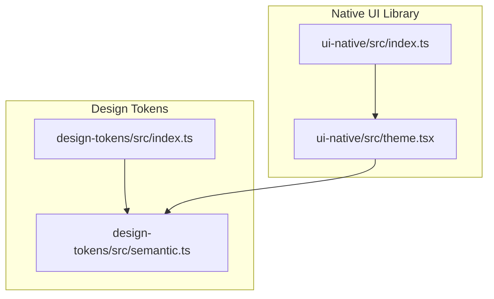
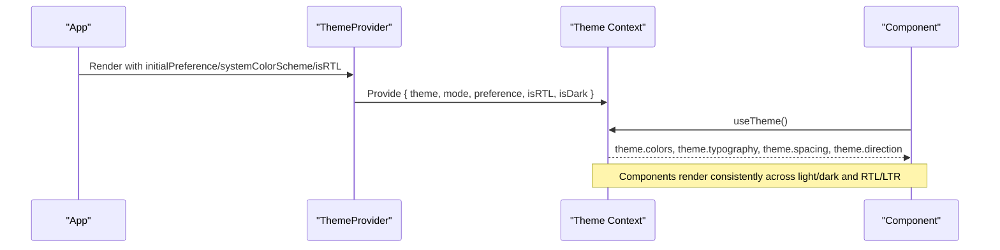
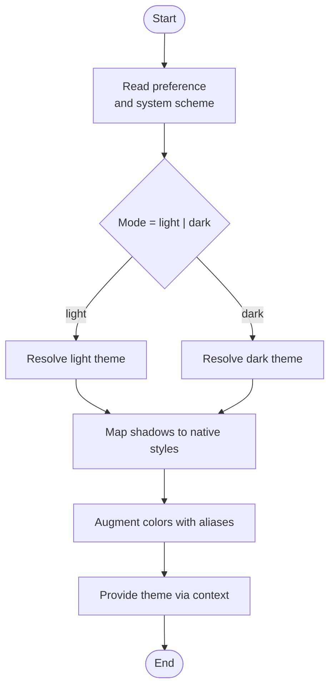
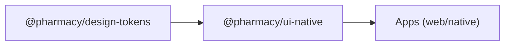

# Shared UI Components

<cite>
**Referenced Files in This Document**
- [index.ts](file://packages/design-tokens/src/index.ts)
- [semantic.ts](file://packages/design-tokens/src/semantic.ts)
- [theme.tsx](file://packages/ui-native/src/theme.tsx)
- [index.ts](file://packages/ui-native/src/index.ts)
- [package.json](file://packages/ui-native/package.json)
- [package.json](file://packages/design-tokens/package.json)
</cite>

## Table of Contents
1. Introduction
2. Project Structure
3. Core Components
4. Architecture Overview
5. Detailed Component Analysis
6. Dependency Analysis
7. Performance Considerations
8. Troubleshooting Guide
9. Conclusion
10. Appendices

## Introduction
This document describes the shared UI component libraries that power all frontend applications in the repository. It focuses on the design system implementation, including color tokens, typography scales, spacing systems, and theming. It also documents reusable components (buttons, inputs, modals, cards, layout), composition patterns, accessibility standards, responsive design principles, usage examples, styling guidelines, testing strategies, and versioning for shared dependencies. The goal is to ensure consistency across web and mobile platforms while enabling safe customization and predictable behavior.

## Project Structure
The shared UI layer is organized into two primary packages:
- Design tokens: a platform-neutral source of truth for colors, typography, spacing, radii, shadows, motion, and layout constraints.
- Native UI library: React Native components and theme provider that consume design tokens and adapt them to platform specifics (shadows, direction, and additional color aliases).

**Diagram sources**
- [index.ts:1-20](file://packages/design-tokens/src/index.ts#L1-L20)
- [semantic.ts:1-369](file://packages/design-tokens/src/semantic.ts#L1-L369)
- [theme.tsx:1-128](file://packages/ui-native/src/theme.tsx#L1-L128)
- [index.ts:1-9](file://packages/ui-native/src/index.ts#L1-L9)

**Section sources**
- [index.ts:1-20](file://packages/design-tokens/src/index.ts#L1-L20)
- [semantic.ts:1-369](file://packages/design-tokens/src/semantic.ts#L1-L369)
- [theme.tsx:1-128](file://packages/ui-native/src/theme.tsx#L1-L128)
- [index.ts:1-9](file://packages/ui-native/src/index.ts#L1-L9)

## Core Components
This section outlines the foundational building blocks exposed by the native UI library and how they are themed using design tokens.

- Theme Provider and Hook
  - Provides a resolved theme with light/dark modes, RTL support, and platform-specific shadow styles.
  - Exposes helpers to toggle theme preference and read current mode and direction.
  - Maps semantic tokens to native style values and augments colors with convenience aliases.

- Primitives
  - Low-level interactive and presentational elements (e.g., buttons, inputs, text, icons) built on top of tokens.
  - Compose consistent sizing, spacing, colors, and typography.

- Layout
  - Structural components for pages and sections (e.g., containers, grids, stacks) that respect spacing and max content width tokens.

- Overlays
  - Modal-like surfaces (dialogs, drawers, bottom sheets) that use elevated surfaces, overlays, and focus management.

- Customer UI
  - Domain-specific surface grouping for customer-facing flows, composed from primitives and layout.

Usage guidance:
- Wrap your app with the ThemeProvider to supply theme context.
- Consume theme via the provided hook to access colors, typography, spacing, and direction.
- Build screens using layout and overlay components; compose interactions with primitives.

**Section sources**
- [theme.tsx:1-128](file://packages/ui-native/src/theme.tsx#L1-L128)
- [index.ts:1-9](file://packages/ui-native/src/index.ts#L1-L9)

## Architecture Overview
The architecture separates concerns between platform-neutral tokens and platform-specific rendering:

- Design tokens define semantic meaning (brand, canvas, text, status, delivery, chart, pharmacy, border) and non-color tokens (typography, spacing, radii, shadows, motion, layout).
- The native theme adapts tokens to React Native, computing platform-specific shadows and adding direction and convenience color aliases.
- Components consume the theme via context, ensuring consistent appearance and behavior across the app.

**Diagram sources**
- [theme.tsx:1-128](file://packages/ui-native/src/theme.tsx#L1-L128)

**Section sources**
- [semantic.ts:1-369](file://packages/design-tokens/src/semantic.ts#L1-L369)
- [theme.tsx:1-128](file://packages/ui-native/src/theme.tsx#L1-L128)

## Detailed Component Analysis

### Theme System
- Theme resolution
  - Resolves light or dark theme based on preference or system setting.
  - Computes isDark and direction (RTL/LTR) and exposes both to consumers.
- Shadow mapping
  - Converts token-based elevation descriptors into platform-specific ViewStyle objects.
- Color augmentation
  - Adds background, surface, line, ink, inkSoft, inkFaint aliases derived from kit palettes and theme mode.

**Diagram sources**
- [theme.tsx:1-128](file://packages/ui-native/src/theme.tsx#L1-L128)
- [semantic.ts:327-369](file://packages/design-tokens/src/semantic.ts#L327-L369)

**Section sources**
- [theme.tsx:1-128](file://packages/ui-native/src/theme.tsx#L1-L128)
- [semantic.ts:1-369](file://packages/design-tokens/src/semantic.ts#L1-L369)

### Primitives (Buttons, Inputs, etc.)
- Composition pattern
  - Each primitive composes tokens for size, spacing, typography, and color.
  - Variants derive from semantic tokens (e.g., brand.primary vs status.error).
- Accessibility
  - Ensure sufficient contrast using semantic text and status colors.
  - Support keyboard navigation and screen reader labels where applicable.
- Customization
  - Override via props (variant, size, disabled) and theme-aware styles.

[No sources needed since this section provides general guidance]

### Layout Components
- Spacing and alignment
  - Use the 4-point spacing scale for consistent rhythm.
- Responsive constraints
  - Respect maxContentWidth tokens for phone/tablet breakpoints.
- Directionality
  - Honor RTL/LTR via theme direction to flip margins/paddings automatically.

[No sources needed since this section provides general guidance]

### Overlays (Modals, Drawers)
- Elevation and backdrop
  - Use elevated surfaces and overlay colors from tokens for depth and focus isolation.
- Focus management
  - Trap focus within overlay and restore on close.
- Safe areas
  - Respect safe area insets on mobile platforms.

[No sources needed since this section provides general guidance]

### Customer UI Surface
- Purpose
  - Groups domain-specific screens and flows for customers using primitives and layout.
- Theming
  - Inherits theme context and applies consistent branding and status semantics.

[No sources needed since this section provides general guidance]

## Dependency Analysis
- Package exports
  - ui-native re-exports theme, kit, primitives, layout, overlays, and a CustomerUI namespace.
  - ui-native depends on @pharmacy/design-tokens for semantic tokens.
- Versioning
  - Both packages declare versions and types, enabling stable consumption across apps.

**Diagram sources**
- [package.json:1-38](file://packages/ui-native/package.json#L1-L38)
- [package.json:1-20](file://packages/design-tokens/package.json#L1-L20)
- [index.ts:1-9](file://packages/ui-native/src/index.ts#L1-L9)

**Section sources**
- [package.json:1-38](file://packages/ui-native/package.json#L1-L38)
- [package.json:1-20](file://packages/design-tokens/package.json#L1-L20)
- [index.ts:1-9](file://packages/ui-native/src/index.ts#L1-L9)

## Performance Considerations
- Minimize re-renders
  - Memoize theme value and avoid unnecessary updates when preference or RTL state changes.
- Token-driven styles
  - Prefer tokens over inline computed styles to reduce runtime calculations.
- Platform-specific branches
  - Keep platform logic (e.g., shadow mapping) isolated to theme computation.

[No sources needed since this section provides general guidance]

## Troubleshooting Guide
Common issues and resolutions:
- Incorrect theme mode
  - Verify initialPreference and systemColorScheme passed to ThemeProvider.
- Missing RTL support
  - Ensure isRTL is set correctly at the root and propagated through the theme context.
- Shadow not visible
  - Confirm platform-specific shadow mapping is applied and elevation values are appropriate.
- Contrast problems
  - Use semantic text and status tokens to maintain accessible contrast ratios.

**Section sources**
- [theme.tsx:1-128](file://packages/ui-native/src/theme.tsx#L1-L128)

## Conclusion
The shared UI system centers on a robust, platform-neutral design token layer and a React Native theme provider that adapts tokens to native specifics. Components built on these foundations deliver consistent, accessible, and responsive experiences across web and mobile. By following the composition patterns, accessibility guidelines, and responsive principles outlined here, teams can maintain visual and behavioral consistency while enabling safe customization.

## Appendices

### Design Tokens Reference
- Colors
  - Semantic categories: brand, canvas, text, status, delivery, chart, pharmacy, border.
  - Light and dark variants are available; default resolves to light.
- Typography
  - Font family, sizes, weights, line heights, letter spacings.
- Spacing
  - 4-point scale for consistent rhythm.
- Radii
  - Standardized corner radius tokens.
- Shadows
  - Elevation levels mapped to platform-specific styles.
- Motion
  - Durations and easing curves for consistent animations.
- Layout
  - Max content widths and touch target sizes.

**Section sources**
- [semantic.ts:1-369](file://packages/design-tokens/src/semantic.ts#L1-L369)

### Usage Examples

- Wrapping the app with ThemeProvider
  - Provide initialPreference, systemColorScheme, and isRTL at the root.
- Consuming theme in components
  - Access theme colors, typography, spacing, and direction via the theme hook.
- Building a button
  - Choose variant based on semantic tokens (brand, status) and apply size and spacing tokens.
- Creating a modal
  - Use overlay surface, elevated shadow, and backdrop color from tokens; manage focus and safe areas.

[No sources needed since this section provides general guidance]

### Accessibility Standards Compliance
- Contrast
  - Use semantic text and status tokens to meet contrast requirements.
- Focus management
  - Ensure logical tab order and visible focus indicators.
- Screen readers
  - Provide meaningful labels and roles for interactive components.
- Touch targets
  - Adhere to minimum touch target sizes defined in layout tokens.

[No sources needed since this section provides general guidance]

### Responsive Design Principles
- Breakpoints
  - Use maxContentWidth tokens to constrain content on tablet and larger screens.
- Fluid spacing
  - Apply spacing scale proportionally across breakpoints.
- Directionality
  - Honor RTL/LTR via theme direction for mirrored layouts.

[No sources needed since this section provides general guidance]

### Testing Strategies
- Unit tests
  - Verify component props, events, and rendered output under different themes and directions.
- Visual regression
  - Snapshot key components across light/dark modes and RTL/LTR.
- Accessibility audits
  - Run automated checks for contrast, labels, and focus management.
- Theme integration
  - Test that theme changes propagate correctly to all components.

[No sources needed since this section provides general guidance]

### Versioning Approach
- Packages
  - Maintain explicit versions for design-tokens and ui-native to ensure stable consumption.
- Semver
  - Follow semantic versioning for breaking changes, new features, and patches.
- Peer dependencies
  - Declare peer dependencies for UI frameworks and native modules to align versions across apps.

**Section sources**
- [package.json:1-38](file://packages/ui-native/package.json#L1-L38)
- [package.json:1-20](file://packages/design-tokens/package.json#L1-L20)