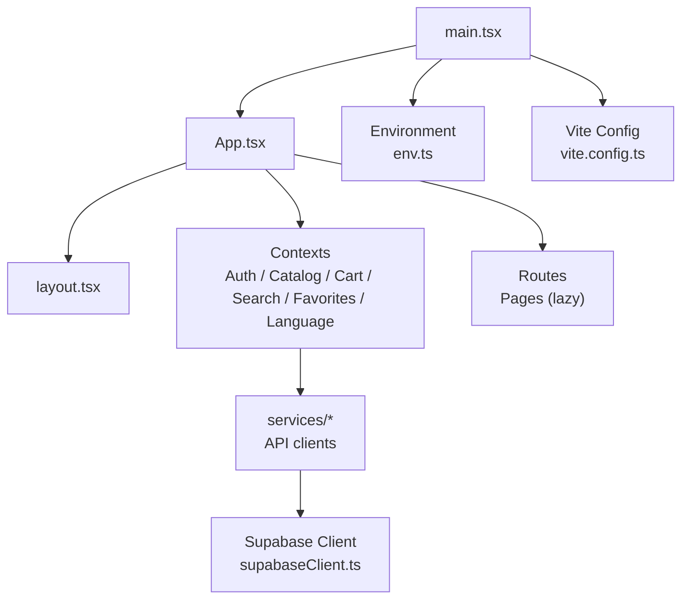
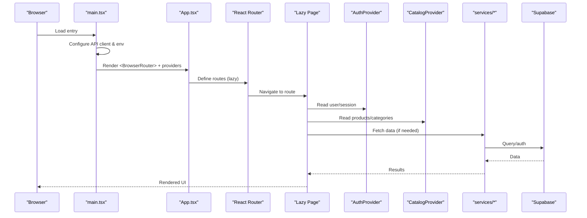
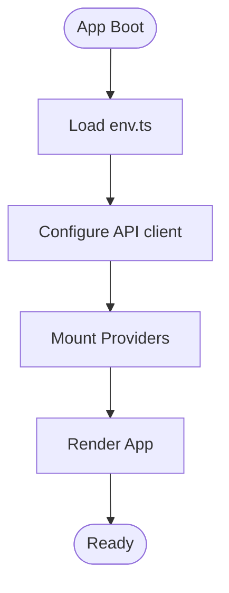
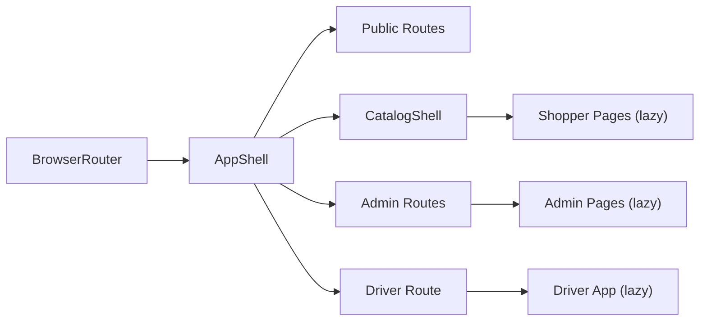
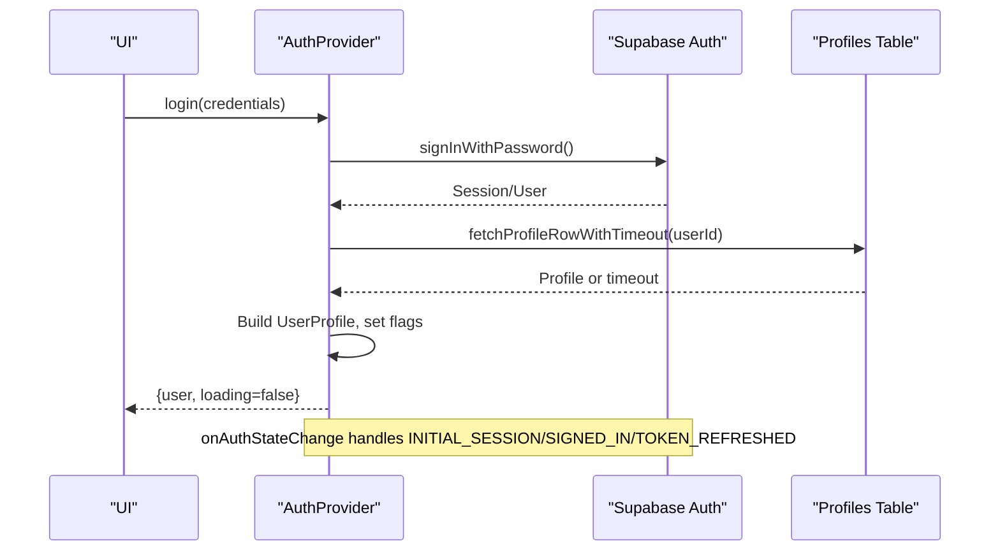
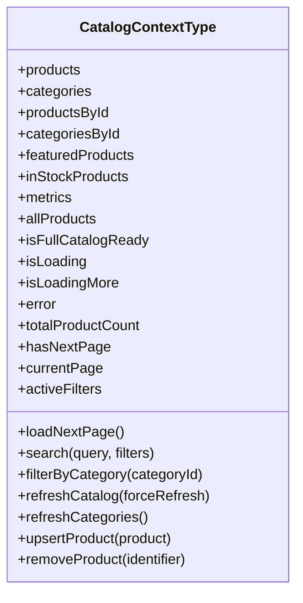
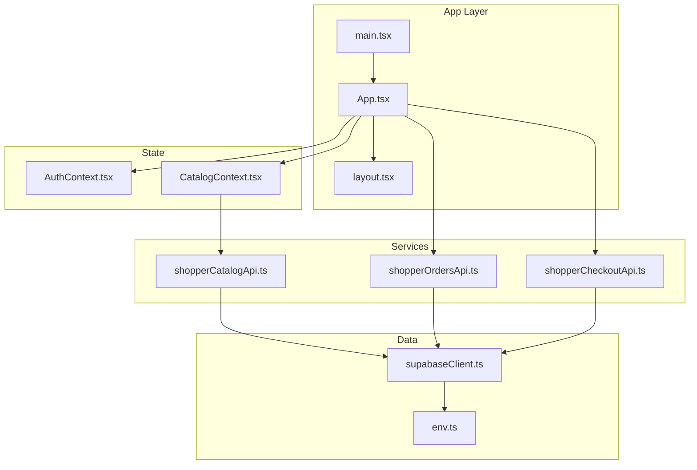

# Application Architecture

<cite>
**Referenced Files in This Document**
- [package.json](file://apps/shopper-web/package.json)
- [vite.config.ts](file://apps/shopper-web/vite.config.ts)
- [main.tsx](file://apps/shopper-web/src/main.tsx)
- [App.tsx](file://apps/shopper-web/src/app/App.tsx)
- [layout.tsx](file://apps/shopper-web/src/app/layout.tsx)
- [AuthContext.tsx](file://apps/shopper-web/src/contexts/AuthContext.tsx)
- [CatalogContext.tsx](file://apps/shopper-web/src/contexts/CatalogContext.tsx)
- [supabaseClient.ts](file://apps/shopper-web/src/lib/supabaseClient.ts)
- [env.ts](file://apps/shopper-web/src/app/env.ts)
</cite>

## Table of Contents
1. [Introduction](#introduction)
2. [Project Structure](#project-structure)
3. [Core Components](#core-components)
4. [Architecture Overview](#architecture-overview)
5. [Detailed Component Analysis](#detailed-component-analysis)
6. [Dependency Analysis](#dependency-analysis)
7. [Performance Considerations](#performance-considerations)
8. [Troubleshooting Guide](#troubleshooting-guide)
9. [Conclusion](#conclusion)

## Introduction
This document explains the Shopper Web Application architecture with a focus on:
- React 18.x component hierarchy and bootstrap process
- Vite build configuration and bundle optimization
- Feature-based modular structure under app/, shared components, and business logic in services/
- Routing via React Router and context providers for global state
- Integration with Supabase for authentication and data
- Performance strategies including code splitting, lazy loading, and chunking
- Responsive design using Tailwind CSS and mobile-first patterns

## Project Structure
The Shopper Web application is organized to separate concerns while keeping feature boundaries clear:
- Entry and bootstrap: main.tsx initializes React, providers, and environment setup
- App shell and routing: App.tsx defines routes, lazy-loaded pages, and role-based protection
- Layout and UI shell: layout.tsx provides header/footer, SEO metadata, scroll management, and responsive chrome
- Contexts: AuthContext.tsx (auth), CatalogContext.tsx (catalog state), plus other contexts for cart, search, favorites, language
- Services: Business logic and API integrations are encapsulated per domain (e.g., shopper catalog, orders, checkout)
- Build and tooling: vite.config.ts configures plugins, aliases, chunking, and optimizations; package.json lists dependencies and scripts

**Diagram sources**
- [main.tsx:1-60](file://apps/shopper-web/src/main.tsx#L1-L60)
- [App.tsx:1-196](file://apps/shopper-web/src/app/App.tsx#L1-L196)
- [layout.tsx:1-800](file://apps/shopper-web/src/app/layout.tsx#L1-L800)
- [AuthContext.tsx:1-738](file://apps/shopper-web/src/contexts/AuthContext.tsx#L1-L738)
- [CatalogContext.tsx:1-505](file://apps/shopper-web/src/contexts/CatalogContext.tsx#L1-L505)
- [supabaseClient.ts:1-40](file://apps/shopper-web/src/lib/supabaseClient.ts#L1-L40)
- [env.ts:1-92](file://apps/shopper-web/src/app/env.ts#L1-L92)
- [vite.config.ts:1-204](file://apps/shopper-web/vite.config.ts#L1-L204)

**Section sources**
- [package.json:1-26](file://apps/shopper-web/package.json#L1-L26)
- [vite.config.ts:1-204](file://apps/shopper-web/vite.config.ts#L1-L204)
- [main.tsx:1-60](file://apps/shopper-web/src/main.tsx#L1-L60)

## Core Components
- Bootstrap and Providers: main.tsx sets up React StrictMode, ErrorBoundary, QueryClientProvider, LanguageProvider, AuthProvider, FavoritesProvider, and renders App. It also initializes location tracking and performance metrics.
- Routing and Lazy Loading: App.tsx uses React Router’s BrowserRouter and lazy() to split route-level code into separate chunks. Routes are grouped by feature (shopper, admin, driver) and protected by roles.
- Layout Shell: layout.tsx manages SEO metadata, scroll behavior, header/footer, overlays, and responsive navigation. It also integrates internationalization and site-wide utilities.
- Global State:
  - AuthContext.tsx handles authentication lifecycle, session persistence, profile resolution, role checks, and realtime updates for role/status changes.
  - CatalogContext.tsx manages product catalog state, pagination, search/filtering, and full-catalog background loading for admin features.

**Section sources**
- [main.tsx:1-60](file://apps/shopper-web/src/main.tsx#L1-L60)
- [App.tsx:1-196](file://apps/shopper-web/src/app/App.tsx#L1-L196)
- [layout.tsx:1-800](file://apps/shopper-web/src/app/layout.tsx#L1-L800)
- [AuthContext.tsx:1-738](file://apps/shopper-web/src/contexts/AuthContext.tsx#L1-L738)
- [CatalogContext.tsx:1-505](file://apps/shopper-web/src/contexts/CatalogContext.tsx#L1-L505)

## Architecture Overview
The application follows a layered architecture:
- Presentation layer: React components and layouts
- State layer: Contexts for auth, catalog, cart, search, favorites, language
- Service layer: Domain-specific API clients in services/
- Data layer: Supabase client and environment configuration

**Diagram sources**
- [main.tsx:1-60](file://apps/shopper-web/src/main.tsx#L1-L60)
- [App.tsx:1-196](file://apps/shopper-web/src/app/App.tsx#L1-L196)
- [AuthContext.tsx:1-738](file://apps/shopper-web/src/contexts/AuthContext.tsx#L1-L738)
- [CatalogContext.tsx:1-505](file://apps/shopper-web/src/contexts/CatalogContext.tsx#L1-L505)
- [supabaseClient.ts:1-40](file://apps/shopper-web/src/lib/supabaseClient.ts#L1-L40)

## Detailed Component Analysis

### Bootstrap and Provider Chain
- main.tsx configures the API client base URLs from environment variables, starts Web Vitals collection, creates a single ReactDOM root to avoid duplicate roots during HMR, and mounts providers in order: QueryClientProvider, LanguageProvider, AuthProvider, FavoritesProvider, then App.
- Environment values are centralized in env.ts and consumed by the API client and Supabase client.

**Diagram sources**
- [main.tsx:1-60](file://apps/shopper-web/src/main.tsx#L1-L60)
- [env.ts:1-92](file://apps/shopper-web/src/app/env.ts#L1-L92)

**Section sources**
- [main.tsx:1-60](file://apps/shopper-web/src/main.tsx#L1-L60)
- [env.ts:1-92](file://apps/shopper-web/src/app/env.ts#L1-L92)

### Routing and Code Splitting
- App.tsx wraps the app in BrowserRouter and MotionConfig, then defines routes with lazy() for each page or feature area.
- Route groups:
  - Public routes: login, register, auth callback, suspended pages, order tracking
  - Catalog shell: routes requiring catalog state (products, categories, offers, cart, checkout, etc.)
  - Admin routes: protected by role guards (admin, manager, pharmacist)
  - Driver route: protected by driver role
- Each route is wrapped with Suspense fallback for smooth loading states.

**Diagram sources**
- [App.tsx:1-196](file://apps/shopper-web/src/app/App.tsx#L1-L196)

**Section sources**
- [App.tsx:1-196](file://apps/shopper-web/src/app/App.tsx#L1-L196)

### Authentication Flow
- AuthContext.tsx subscribes to Supabase auth events, resolves user profiles with timeouts to avoid blocking, and maintains role/status derived flags.
- It supports password login, Google OAuth, sign-out, and background retry when profile fetch times out.
- Realtime subscription listens for profile updates to enforce role changes or forced sign-out on suspension/inactivation.

**Diagram sources**
- [AuthContext.tsx:1-738](file://apps/shopper-web/src/contexts/AuthContext.tsx#L1-L738)

**Section sources**
- [AuthContext.tsx:1-738](file://apps/shopper-web/src/contexts/AuthContext.tsx#L1-L738)

### Catalog State Management
- CatalogContext.tsx implements a two-tier strategy:
  - Fast first paint: loads only the first page of products and cached categories
  - Full catalog: optional background load for admin features via explicit refresh
- Provides server-side pagination, search, filtering, and optimistic mutations for product updates/removals.
- Categories are sourced from live DB counts to keep web and mobile consistent.

**Diagram sources**
- [CatalogContext.tsx:1-505](file://apps/shopper-web/src/contexts/CatalogContext.tsx#L1-L505)

**Section sources**
- [CatalogContext.tsx:1-505](file://apps/shopper-web/src/contexts/CatalogContext.tsx#L1-L505)

### Layout and Responsive Design
- layout.tsx provides:
  - SEO metadata updates per route (title, description, Open Graph, JSON-LD)
  - Scroll restoration and transition handling
  - Header/footer, overlays, and mobile bottom navigation
  - Internationalization (lang/dir sync) and accessibility helpers
- Uses Tailwind CSS utility classes for responsive, mobile-first design.

**Section sources**
- [layout.tsx:1-800](file://apps/shopper-web/src/app/layout.tsx#L1-L800)

## Dependency Analysis
- External libraries:
  - React 18.x and React Router for UI and routing
  - TanStack Query for data fetching/caching
  - Supabase for auth and database access
  - Tailwind CSS for styling
  - Optional libraries grouped via manualChunks (motion, charts, forms, maps, etc.)
- Internal modules:
  - @pharmacy/* packages aliased in vite.config.ts for contracts, types, domain modules, and UI libraries
  - services/* encapsulate domain APIs (catalog, orders, checkout, logistics, promotions, etc.)

**Diagram sources**
- [main.tsx:1-60](file://apps/shopper-web/src/main.tsx#L1-L60)
- [App.tsx:1-196](file://apps/shopper-web/src/app/App.tsx#L1-L196)
- [layout.tsx:1-800](file://apps/shopper-web/src/app/layout.tsx#L1-L800)
- [AuthContext.tsx:1-738](file://apps/shopper-web/src/contexts/AuthContext.tsx#L1-L738)
- [CatalogContext.tsx:1-505](file://apps/shopper-web/src/contexts/CatalogContext.tsx#L1-L505)
- [supabaseClient.ts:1-40](file://apps/shopper-web/src/lib/supabaseClient.ts#L1-L40)
- [env.ts:1-92](file://apps/shopper-web/src/app/env.ts#L1-L92)

**Section sources**
- [vite.config.ts:1-204](file://apps/shopper-web/vite.config.ts#L1-L204)
- [package.json:1-26](file://apps/shopper-web/package.json#L1-L26)

## Performance Considerations
- Code splitting and lazy loading:
  - All routes use lazy() to defer non-critical code until navigation
  - Suspense fallbacks provide consistent loading UX
- Bundle optimization:
  - manualChunks groups common libraries (react-core, router, motion, mui, ui-libs, icons, charts, utils, data, state, forms, pdf/excel/qr/maps)
  - chunkSizeWarningLimit set to warn at 600 KB; initial shell targets ≤ 250 KB gzipped
  - optimizeDeps includes critical packages for faster dev startup
- Catalog performance:
  - First paint uses only the first page of products and cached categories
  - Full catalog loaded explicitly for admin features; Products page uses server pagination
- Runtime performance:
  - startTransition used for non-urgent state updates
  - Emergency timers prevent indefinite loading on slow networks or cold-starts
  - Web Vitals collected early for monitoring

**Section sources**
- [vite.config.ts:81-199](file://apps/shopper-web/vite.config.ts#L81-L199)
- [App.tsx:1-196](file://apps/shopper-web/src/app/App.tsx#L1-L196)
- [CatalogContext.tsx:1-505](file://apps/shopper-web/src/contexts/CatalogContext.tsx#L1-L505)
- [main.tsx:29-31](file://apps/shopper-web/src/main.tsx#L29-L31)

## Troubleshooting Guide
- Authentication issues:
  - If profile fetch times out, AuthContext falls back gracefully and retries in background; emergency timer ensures loading clears within a bounded time
  - Role/status changes are detected via realtime; suspension/inactivation triggers forced sign-out and redirect
- Catalog loading problems:
  - If first-page fetch hangs, an emergency timer forces isLoading false after a threshold; errors surface inline on pages
  - Use refreshCatalog() only when necessary (admin features) to avoid large payloads
- Configuration errors:
  - Ensure VITE_SUPABASE_URL and VITE_SUPABASE_ANON_KEY are both set; otherwise Supabase client will be unavailable
  - Validate shipping matrix JSON and delivery windows via env validation helpers

**Section sources**
- [AuthContext.tsx:193-213](file://apps/shopper-web/src/contexts/AuthContext.tsx#L193-L213)
- [AuthContext.tsx:313-389](file://apps/shopper-web/src/contexts/AuthContext.tsx#L313-L389)
- [AuthContext.tsx:424-521](file://apps/shopper-web/src/contexts/AuthContext.tsx#L424-L521)
- [CatalogContext.tsx:186-222](file://apps/shopper-web/src/contexts/CatalogContext.tsx#L186-L222)
- [supabaseClient.ts:12-35](file://apps/shopper-web/src/lib/supabaseClient.ts#L12-L35)
- [env.ts:49-91](file://apps/shopper-web/src/app/env.ts#L49-L91)

## Conclusion
The Shopper Web Application is structured around a clear separation of concerns:
- A robust bootstrap process that wires providers and environment
- Feature-based routing with aggressive code splitting for fast initial load
- Centralized state via contexts for auth and catalog, with careful performance controls
- Modular services encapsulating business logic and external integrations
- Comprehensive build-time optimizations through Vite’s chunking and plugin ecosystem
- Responsive, accessible UI powered by Tailwind CSS and thoughtful layout management

This architecture balances developer ergonomics, runtime performance, and maintainability across a complex multi-feature application.