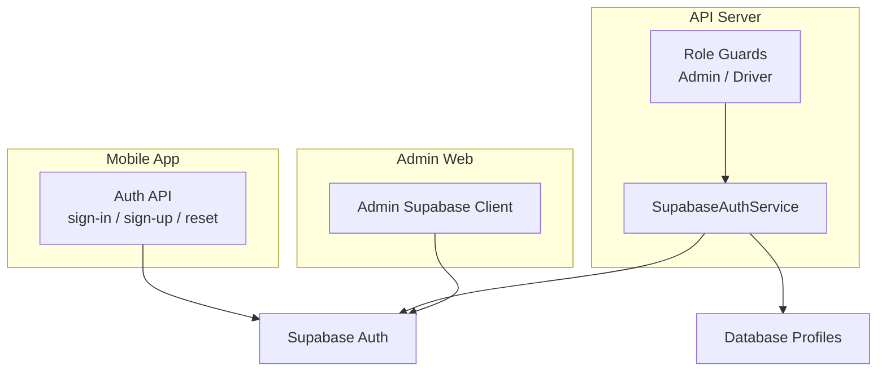
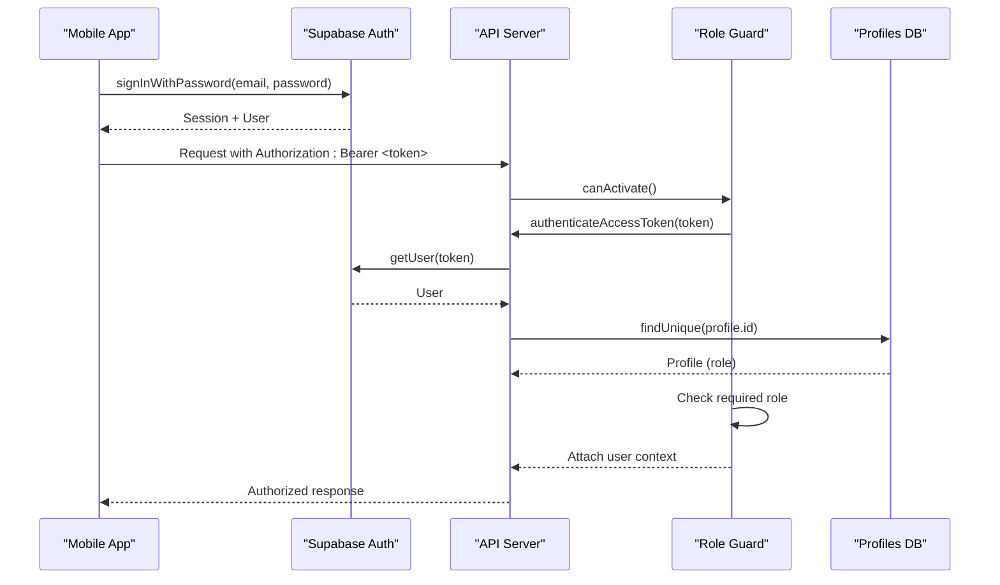
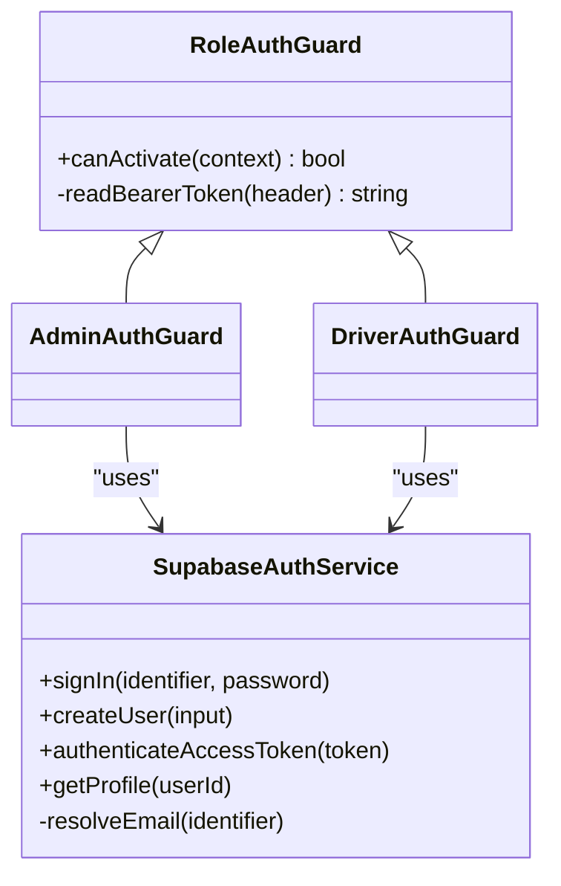
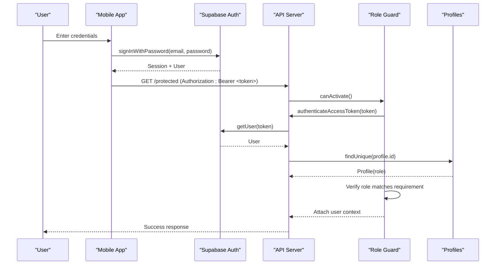
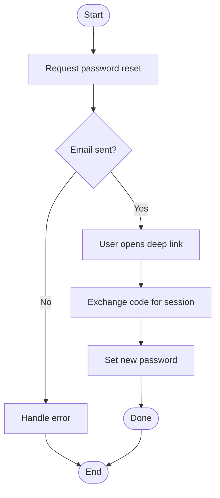

# Authentication System

<cite>
**Referenced Files in This Document**
- [supabase-auth.service.ts](file://apps/api/src/auth/supabase-auth.service.ts)
- [role-auth.guard.ts](file://apps/api/src/auth/role-auth.guard.ts)
- [admin-auth.guard.ts](file://apps/api/src/auth/admin-auth.guard.ts)
- [driver-auth.guard.ts](file://apps/api/src/auth/driver-auth.guard.ts)
- [api.ts (shopper-native auth)](file://apps/shopper-native/src/features/auth/api.ts)
- [role.ts (shopper-native roles)](file://apps/shopper-native/src/features/auth/role.ts)
- [supabase.ts (admin client)](file://apps/admin/src/lib/supabase.ts)
</cite>

## Table of Contents
1. Introduction
2. Project Structure
3. Core Components
4. Architecture Overview
5. Detailed Component Analysis
6. Dependency Analysis
7. Performance Considerations
8. Troubleshooting Guide
9. Conclusion

## Introduction
This document explains the authentication system across the multi-app project, focusing on:
- Supabase Auth integration for login, registration, password reset, and session management
- JWT token handling and validation on the API server
- Role-based access control (RBAC) for customer, pharmacist, driver, and admin
- Protected routes via guards and error handling strategies
- Custom hooks patterns and third-party provider considerations
- Security best practices, token refresh behavior, and logout procedures

## Project Structure
Authentication spans three main areas:
- API server (NestJS): validates tokens, resolves user profiles, enforces roles
- Mobile app (Shopper Native): performs sign-in/sign-up/password reset, manages sessions, handles deep links
- Admin web app: uses a dedicated Supabase client that injects the current admin Bearer token per request

**Diagram sources**
- [supabase-auth.service.ts:12-64](file://apps/api/src/auth/supabase-auth.service.ts#L12-L64)
- [role-auth.guard.ts:11-36](file://apps/api/src/auth/role-auth.guard.ts#L11-L36)
- [api.ts (shopper-native auth):40-165](file://apps/shopper-native/src/features/auth/api.ts#L40-L165)
- [supabase.ts (admin client):38-46](file://apps/admin/src/lib/supabase.ts#L38-L46)

**Section sources**
- [supabase-auth.service.ts:12-64](file://apps/api/src/auth/supabase-auth.service.ts#L12-L64)
- [role-auth.guard.ts:11-36](file://apps/api/src/auth/role-auth.guard.ts#L11-L36)
- [api.ts (shopper-native auth):40-165](file://apps/shopper-native/src/features/auth/api.ts#L40-L165)
- [supabase.ts (admin client):38-46](file://apps/admin/src/lib/supabase.ts#L38-L46)

## Core Components
- SupabaseAuthService: signs in users, creates users via admin API, validates access tokens, resolves email from phone, loads profile with role
- Role-based guards: validate Bearer token, enforce required role, attach user context to requests
- Mobile auth API: sign-in, sign-up, sign-out, password reset flow, profile updates, session retrieval
- Admin Supabase client: per-request injection of admin JWT for direct Supabase calls

Key responsibilities:
- Token validation and user resolution on the server
- RBAC enforcement at route level
- Secure session flows on mobile with deep link handling
- Consistent role model across apps

**Section sources**
- [supabase-auth.service.ts:26-64](file://apps/api/src/auth/supabase-auth.service.ts#L26-L64)
- [role-auth.guard.ts:11-36](file://apps/api/src/auth/role-auth.guard.ts#L11-L36)
- [api.ts (shopper-native auth):40-165](file://apps/shopper-native/src/features/auth/api.ts#L40-L165)
- [supabase.ts (admin client):38-46](file://apps/admin/src/lib/supabase.ts#L38-L46)

## Architecture Overview
The authentication architecture combines Supabase Auth for identity, JWT for authorization, and role checks enforced by NestJS guards. The mobile app manages user sessions and deep-link callbacks, while the API validates tokens and maps them to application roles stored in profiles.

**Diagram sources**
- [api.ts (shopper-native auth):40-48](file://apps/shopper-native/src/features/auth/api.ts#L40-L48)
- [supabase-auth.service.ts:49-64](file://apps/api/src/auth/supabase-auth.service.ts#L49-L64)
- [role-auth.guard.ts:11-36](file://apps/api/src/auth/role-auth.guard.ts#L11-L36)

## Detailed Component Analysis

### SupabaseAuthService
Responsibilities:
- Sign-in with email or phone (resolves email if phone provided)
- Create users via Supabase admin API with metadata
- Validate access tokens and fetch full profile including role and related data
- Provide profile lookup utility

Security notes:
- Uses service-role key for privileged operations
- Disables auto-refresh and persistence to avoid unintended side effects in server context

Error handling:
- Throws UnauthorizedException for invalid credentials or expired tokens
- Throws errors when user creation fails

Complexity:
- Token validation is O(1) network call to Supabase
- Profile lookup is O(1) database query by id

Optimization opportunities:
- Cache short-lived user+profile lookups where appropriate
- Batch profile reads if multiple endpoints need same user info

**Section sources**
- [supabase-auth.service.ts:12-80](file://apps/api/src/auth/supabase-auth.service.ts#L12-L80)

### Role-Based Access Control (RBAC)
Implementation:
- Base guard reads Bearer token, validates it, and attaches user context
- Specialized guards enforce specific roles (admin, driver)
- Missing or malformed Authorization header results in unauthorized responses

Roles supported:
- admin, manager, pharmacist, driver, customer (mobile defines canonical set)

Access decisions:
- If profile.role does not match required role, forbidden exception is thrown

Best practices:
- Always use guards for protected routes
- Keep role checks centralized; avoid ad-hoc checks in controllers

**Section sources**
- [role-auth.guard.ts:11-36](file://apps/api/src/auth/role-auth.guard.ts#L11-L36)
- [admin-auth.guard.ts:5-9](file://apps/api/src/auth/admin-auth.guard.ts#L5-L9)
- [driver-auth.guard.ts:5-9](file://apps/api/src/auth/driver-auth.guard.ts#L5-L9)
- [role.ts (shopper-native roles):7-20](file://apps/shopper-native/src/features/auth/role.ts#L7-L20)

### Mobile Authentication Flow (Shopper Native)
Capabilities:
- Sign-in with email/password
- Sign-up with email/password and optional phone; returns whether an active session exists
- Password reset via email with deep link support
- Update password for recovery session or authenticated user
- Update profile (name, phone) in both user_metadata and profiles table
- Retrieve current session

Deep links:
- Email confirmation redirect URL configured for app scheme
- Reset password redirect URL handled by app routing

Session management:
- Uses Supabase client session lifecycle
- Provides helper to get current session

**Section sources**
- [api.ts (shopper-native auth):40-165](file://apps/shopper-native/src/features/auth/api.ts#L40-L165)

### Admin Supabase Client
Purpose:
- Direct Supabase access from admin app for RPCs and edge functions
- Injects current admin JWT per request via Authorization header

Behavior:
- Creates client with anon key but overrides headers with admin token
- Disables session persistence and auto-refresh to avoid mixing sessions

Usage pattern:
- Call per request to ensure fresh token from store

**Section sources**
- [supabase.ts (admin client):1-46](file://apps/admin/src/lib/supabase.ts#L1-L46)

### Class Diagram: API Auth Components

**Diagram sources**
- [supabase-auth.service.ts:12-80](file://apps/api/src/auth/supabase-auth.service.ts#L12-L80)
- [role-auth.guard.ts:11-36](file://apps/api/src/auth/role-auth.guard.ts#L11-L36)
- [admin-auth.guard.ts:5-9](file://apps/api/src/auth/admin-auth.guard.ts#L5-L9)
- [driver-auth.guard.ts:5-9](file://apps/api/src/auth/driver-auth.guard.ts#L5-L9)

### Sequence Diagram: Login and Protected Route

**Diagram sources**
- [api.ts (shopper-native auth):40-48](file://apps/shopper-native/src/features/auth/api.ts#L40-L48)
- [supabase-auth.service.ts:49-64](file://apps/api/src/auth/supabase-auth.service.ts#L49-L64)
- [role-auth.guard.ts:11-36](file://apps/api/src/auth/role-auth.guard.ts#L11-L36)

### Flowchart: Password Reset Flow

**Diagram sources**
- [api.ts (shopper-native auth):92-115](file://apps/shopper-native/src/features/auth/api.ts#L92-L115)

## Dependency Analysis
- API server depends on Supabase Auth for token validation and user retrieval
- Guards depend on SupabaseAuthService for token verification and profile loading
- Mobile app depends on Supabase Auth SDK for session management and deep link handling
- Admin app depends on a custom Supabase client that injects admin JWT per request

Coupling:
- Tight coupling between guards and SupabaseAuthService for consistent auth logic
- Loose coupling between mobile app and API via standard Bearer token pattern

Potential circular dependencies:
- None observed; modules are layered appropriately

External integrations:
- Supabase Auth and Database (profiles)
- Deep linking for email confirmation and password reset

**Section sources**
- [supabase-auth.service.ts:12-80](file://apps/api/src/auth/supabase-auth.service.ts#L12-L80)
- [role-auth.guard.ts:11-36](file://apps/api/src/auth/role-auth.guard.ts#L11-L36)
- [api.ts (shopper-native auth):40-165](file://apps/shopper-native/src/features/auth/api.ts#L40-L165)
- [supabase.ts (admin client):38-46](file://apps/admin/src/lib/supabase.ts#L38-L46)

## Performance Considerations
- Token validation involves a network call to Supabase; consider caching validated user contexts within request scope
- Profile lookup is a single row query; ensure indexes on profile id
- Avoid redundant profile reads by reusing resolved user context in handlers
- Disable auto-refresh and persistence in server-side clients to reduce overhead

[No sources needed since this section provides general guidance]

## Troubleshooting Guide
Common issues and resolutions:
- Invalid credentials: Ensure correct email/password; verify phone-to-email resolution path
- Expired or invalid token: Re-authenticate or refresh session on mobile
- Insufficient permissions: Confirm user profile role matches required role for endpoint
- Malformed Authorization header: Ensure format is "Bearer <token>"
- Deep link failures: Configure redirect URLs in Supabase dashboard for app schemes

Operational tips:
- Log token validation errors with minimal sensitive data
- Use guards consistently to centralize error handling
- Validate environment variables for Supabase URL and keys

**Section sources**
- [supabase-auth.service.ts:26-64](file://apps/api/src/auth/supabase-auth.service.ts#L26-L64)
- [role-auth.guard.ts:30-36](file://apps/api/src/auth/role-auth.guard.ts#L30-L36)
- [api.ts (shopper-native auth):92-115](file://apps/shopper-native/src/features/auth/api.ts#L92-L115)

## Conclusion
The authentication system leverages Supabase Auth for identity, JWT for authorization, and NestJS guards for RBAC. The mobile app manages sessions and deep links, while the API validates tokens and enforces roles based on profiles. The admin app uses a specialized client to inject admin JWT for privileged operations. Following the documented flows and best practices ensures secure, scalable authentication across all applications.

[No sources needed since this section summarizes without analyzing specific files]