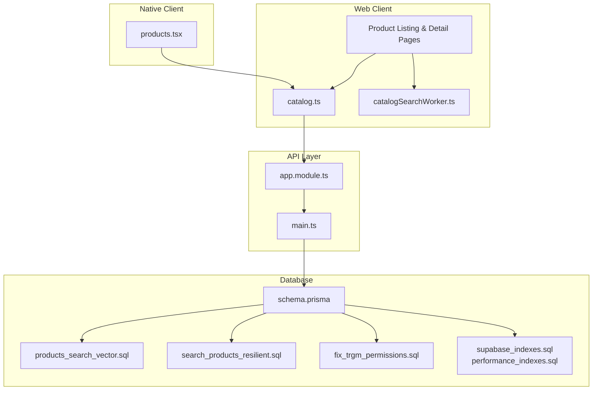
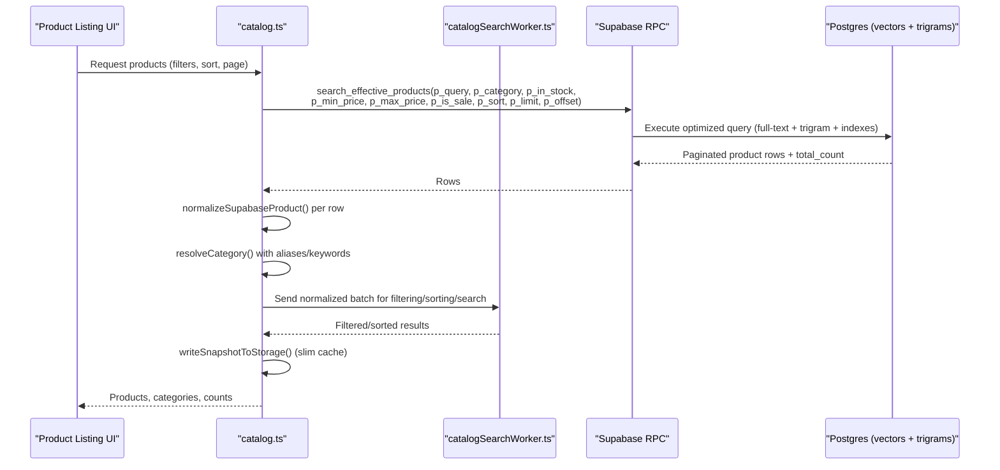
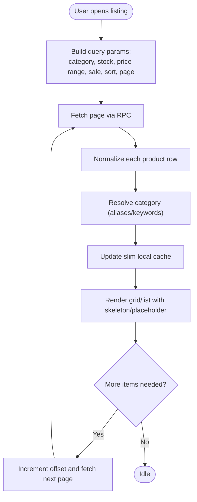
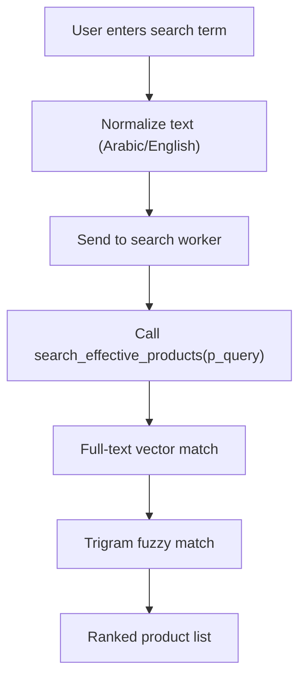
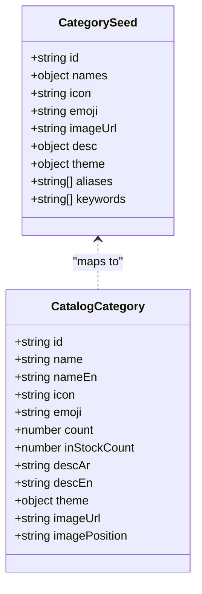
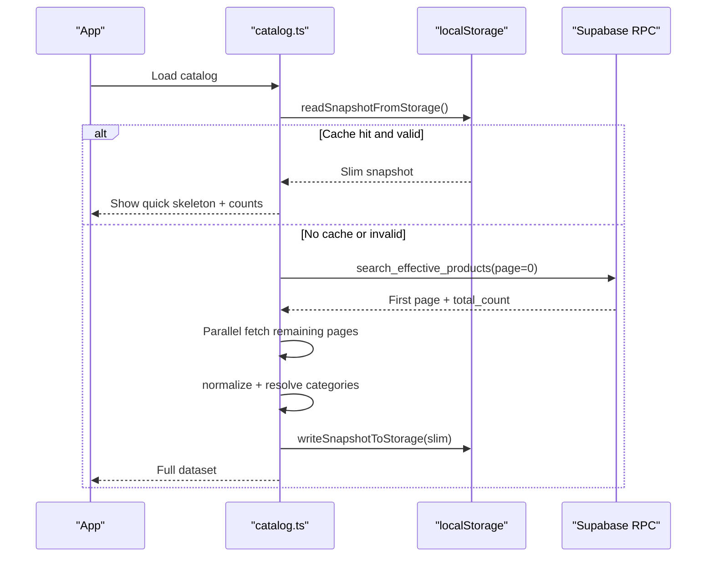
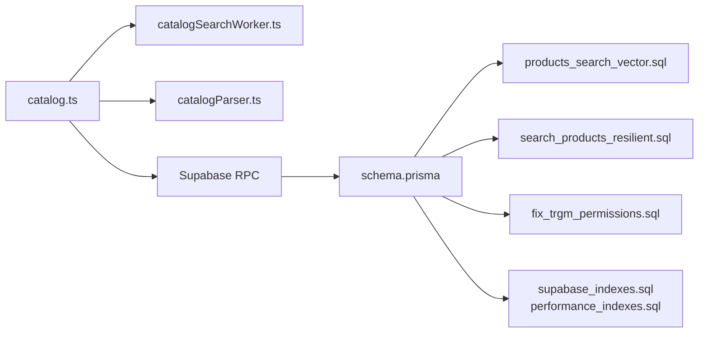

# Catalog Browsing System

<cite>
**Referenced Files in This Document**
- [catalog.ts](file://apps/shopper-web/src/app/catalog.ts)
- [products.tsx](file://apps/shopper-native/app/(customer)/(tabs)/products.tsx)
- [catalogSearchWorker.ts](file://apps/shopper-web/src/app/hooks/catalogSearchWorker.ts)
- [catalogParser.ts](file://apps/shopper-web/src/services/catalogParser.ts)
- [schema.prisma](file://apps/api/prisma/schema.prisma)
- [20260603_products_search_vector.sql](file://database/20260603_products_search_vector.sql)
- [20260604_search_products_resilient.sql](file://database/20260604_search_products_resilient.sql)
- [20260622_fix_trgm_permissions.sql](file://database/20260622_fix_trgm_permissions.sql)
- [supabase_indexes.sql](file://database/supabase_indexes.sql)
- [performance_indexes.sql](file://database/performance_indexes.sql)
- [app.module.ts](file://apps/api/src/app.module.ts)
- [main.ts](file://apps/api/src/main.ts)
</cite>

## Table of Contents
1. [Introduction](#introduction)
2. [Project Structure](#project-structure)
3. [Core Components](#core-components)
4. [Architecture Overview](#architecture-overview)
5. [Detailed Component Analysis](#detailed-component-analysis)
6. [Dependency Analysis](#dependency-analysis)
7. [Performance Considerations](#performance-considerations)
8. [Troubleshooting Guide](#troubleshooting-guide)
9. [Conclusion](#conclusion)

## Introduction
This document explains the product catalog browsing system across web and native applications. It covers product listing pages with advanced filtering, sorting, and search; product detail pages with image galleries, pricing, and related products; full-text search with Arabic support; category navigation; infinite scrolling for large catalogs; API integration; caching strategies; performance optimizations; accessibility; responsive design; and error handling for network failures.

## Project Structure
The catalog system spans multiple layers:
- Web client (React/Vite): catalog data normalization, category mapping, search worker, and UI components.
- Native client (Expo/React Native): product tabs and screens that consume shared domain logic.
- Backend API (NestJS): modules and Prisma schema that expose product and search capabilities.
- Database (PostgreSQL via Supabase): product tables, search vectors, trigram indexes, and RPCs used by the client.

**Diagram sources**
- [catalog.ts:1-800](file://apps/shopper-web/src/app/catalog.ts#L1-L800)
- [catalogSearchWorker.ts:1-200](file://apps/shopper-web/src/app/hooks/catalogSearchWorker.ts#L1-L200)
- [products.tsx:1-200](file://apps/shopper-native/app/(customer)/(tabs)/products.tsx#L1-L200)
- [app.module.ts:1-200](file://apps/api/src/app.module.ts#L1-L200)
- [main.ts:1-100](file://apps/api/src/main.ts#L1-L100)
- [schema.prisma:1-200](file://apps/api/prisma/schema.prisma#L1-L200)
- [20260603_products_search_vector.sql:1-200](file://database/20260603_products_search_vector.sql#L1-L200)
- [20260604_search_products_resilient.sql:1-200](file://database/20260604_search_products_resilient.sql#L1-L200)
- [20260622_fix_trgm_permissions.sql:1-200](file://database/20260622_fix_trgm_permissions.sql#L1-L200)
- [supabase_indexes.sql:1-200](file://database/supabase_indexes.sql#L1-L200)
- [performance_indexes.sql:1-200](file://database/performance_indexes.sql#L1-L200)

**Section sources**
- [catalog.ts:1-800](file://apps/shopper-web/src/app/catalog.ts#L1-L800)
- [products.tsx:1-200](file://apps/shopper-native/app/(customer)/(tabs)/products.tsx#L1-L200)
- [catalogSearchWorker.ts:1-200](file://apps/shopper-web/src/app/hooks/catalogSearchWorker.ts#L1-L200)
- [catalogParser.ts:1-200](file://apps/shopper-web/src/services/catalogParser.ts#L1-L200)
- [schema.prisma:1-200](file://apps/api/prisma/schema.prisma#L1-L200)
- [20260603_products_search_vector.sql:1-200](file://database/20260603_products_search_vector.sql#L1-L200)
- [20260604_search_products_resilient.sql:1-200](file://database/20260604_search_products_resilient.sql#L1-L200)
- [20260622_fix_trgm_permissions.sql:1-200](file://database/20260622_fix_trgm_permissions.sql#L1-L200)
- [supabase_indexes.sql:1-200](file://database/supabase_indexes.sql#L1-L200)
- [performance_indexes.sql:1-200](file://database/performance_indexes.sql#L1-L200)
- [app.module.ts:1-200](file://apps/api/src/app.module.ts#L1-L200)
- [main.ts:1-100](file://apps/api/src/main.ts#L1-L100)

## Core Components
- Product catalog model and category taxonomy: defines product and category types, theme, and metadata used across UI and services.
- Category resolution and aliasing: maps raw category names to canonical categories using aliases and keywords, including Arabic and English.
- Data fetching and pagination: paginates product rows via an RPC call and aggregates results efficiently.
- Local storage snapshot: persists a slimmed-down catalog snapshot to avoid quota issues while enabling fast initial renders.
- Search worker: offloads heavy text processing and filtering to a background thread for smooth UI.
- Parser service: normalizes incoming catalog data into consistent product records.

Key responsibilities:
- Normalize and validate product fields (names, prices, stock, images).
- Resolve categories robustly with multi-language support.
- Provide efficient retrieval and caching for large catalogs.
- Expose stable types for UI and services.

**Section sources**
- [catalog.ts:57-94](file://apps/shopper-web/src/app/catalog.ts#L57-L94)
- [catalog.ts:105-535](file://apps/shopper-web/src/app/catalog.ts#L105-L535)
- [catalog.ts:551-663](file://apps/shopper-web/src/app/catalog.ts#L551-L663)
- [catalog.ts:667-731](file://apps/shopper-web/src/app/catalog.ts#L667-L731)
- [catalog.ts:735-767](file://apps/shopper-web/src/app/catalog.ts#L735-L767)
- [catalog.ts:769-797](file://apps/shopper-web/src/app/catalog.ts#L769-L797)
- [catalogParser.ts:1-200](file://apps/shopper-web/src/services/catalogParser.ts#L1-L200)

## Architecture Overview
The catalog browsing flow integrates client-side normalization, background search, and server-side search RPCs backed by Postgres full-text and trigram capabilities.

**Diagram sources**
- [catalog.ts:735-767](file://apps/shopper-web/src/app/catalog.ts#L735-L767)
- [catalog.ts:667-731](file://apps/shopper-web/src/app/catalog.ts#L667-L731)
- [catalog.ts:769-797](file://apps/shopper-web/src/app/catalog.ts#L769-L797)
- [catalogSearchWorker.ts:1-200](file://apps/shopper-web/src/app/hooks/catalogSearchWorker.ts#L1-L200)
- [20260603_products_search_vector.sql:1-200](file://database/20260603_products_search_vector.sql#L1-L200)
- [20260604_search_products_resilient.sql:1-200](file://database/20260604_search_products_resilient.sql#L1-L200)
- [20260622_fix_trgm_permissions.sql:1-200](file://database/20260622_fix_trgm_permissions.sql#L1-L200)
- [supabase_indexes.sql:1-200](file://database/supabase_indexes.sql#L1-L200)
- [performance_indexes.sql:1-200](file://database/performance_indexes.sql#L1-L200)

## Detailed Component Analysis

### Product Listing Page
- Advanced filtering: supports category, stock status, price range, and sale flags through RPC parameters.
- Sorting: order options are passed to the backend to minimize client work.
- Infinite scrolling: uses pagination with configurable page size and concurrency to load more products as users scroll.
- Category navigation: resolves user input or URL params to canonical categories using aliases and keywords.

**Diagram sources**
- [catalog.ts:735-767](file://apps/shopper-web/src/app/catalog.ts#L735-L767)
- [catalog.ts:667-731](file://apps/shopper-web/src/app/catalog.ts#L667-L731)
- [catalog.ts:769-797](file://apps/shopper-web/src/app/catalog.ts#L769-L797)
- [catalog.ts:592-663](file://apps/shopper-web/src/app/catalog.ts#L592-L663)

**Section sources**
- [catalog.ts:735-767](file://apps/shopper-web/src/app/catalog.ts#L735-L767)
- [catalog.ts:667-731](file://apps/shopper-web/src/app/catalog.ts#L667-L731)
- [catalog.ts:592-663](file://apps/shopper-web/src/app/catalog.ts#L592-L663)

### Product Detail Page
- Image gallery: displays product images when available; validates URLs before rendering.
- Pricing information: shows effective price, base price, discount percentage, and promotion name when applicable.
- Related products: can be derived from the same category or search context.

Implementation highlights:
- Price normalization ensures consistent display values and accurate discount calculations.
- Image validation prevents broken links and improves UX.

**Section sources**
- [catalog.ts:667-731](file://apps/shopper-web/src/app/catalog.ts#L667-L731)
- [catalog.ts:583-590](file://apps/shopper-web/src/app/catalog.ts#L583-L590)

### Full-Text Search with Arabic Support
- Client-side:
  - Normalization strips non-letter/number characters and collapses whitespace for robust matching across languages.
  - Background worker processes search queries without blocking the UI.
- Server-side:
  - PostgreSQL full-text search vectors and trigram indexes enable fast Arabic and English text matching.
  - Resilient search routines handle edge cases and partial matches gracefully.

**Diagram sources**
- [catalog.ts:554-563](file://apps/shopper-web/src/app/catalog.ts#L554-L563)
- [catalog.ts:769-797](file://apps/shopper-web/src/app/catalog.ts#L769-L797)
- [catalogSearchWorker.ts:1-200](file://apps/shopper-web/src/app/hooks/catalogSearchWorker.ts#L1-L200)
- [20260603_products_search_vector.sql:1-200](file://database/20260603_products_search_vector.sql#L1-L200)
- [20260604_search_products_resilient.sql:1-200](file://database/20260604_search_products_resilient.sql#L1-L200)
- [20260622_fix_trgm_permissions.sql:1-200](file://database/20260622_fix_trgm_permissions.sql#L1-L200)

**Section sources**
- [catalog.ts:554-563](file://apps/shopper-web/src/app/catalog.ts#L554-L563)
- [catalog.ts:769-797](file://apps/shopper-web/src/app/catalog.ts#L769-L797)
- [catalogSearchWorker.ts:1-200](file://apps/shopper-web/src/app/hooks/catalogSearchWorker.ts#L1-L200)
- [20260603_products_search_vector.sql:1-200](file://database/20260603_products_search_vector.sql#L1-L200)
- [20260604_search_products_resilient.sql:1-200](file://database/20260604_search_products_resilient.sql#L1-L200)
- [20260622_fix_trgm_permissions.sql:1-200](file://database/20260622_fix_trgm_permissions.sql#L1-L200)

### Category Navigation
- Category seeds define canonical IDs, bilingual names, themes, icons, emojis, descriptions, aliases, and keywords.
- Resolution algorithm scores aliases and keywords against user input to map to the best category.
- Fallback category ensures coverage for unmatched items.

**Diagram sources**
- [catalog.ts:105-535](file://apps/shopper-web/src/app/catalog.ts#L105-L535)
- [catalog.ts:21-34](file://apps/shopper-web/src/app/catalog.ts#L21-L34)

**Section sources**
- [catalog.ts:105-535](file://apps/shopper-web/src/app/catalog.ts#L105-L535)
- [catalog.ts:769-797](file://apps/shopper-web/src/app/catalog.ts#L769-L797)

### API Integration and Caching Strategy
- API integration:
  - Uses a Supabase RPC to fetch paginated product rows with filters and sorting.
  - Concurrency-limited parallel page fetching reduces total load time.
- Caching strategy:
  - In-memory snapshot cache for the current session.
  - Slim localStorage snapshot to survive reloads within TTL, avoiding quota errors by dropping heavy fields like images.
  - Read path validates stored structure and clears corrupted entries.

**Diagram sources**
- [catalog.ts:592-663](file://apps/shopper-web/src/app/catalog.ts#L592-L663)
- [catalog.ts:735-767](file://apps/shopper-web/src/app/catalog.ts#L735-L767)

**Section sources**
- [catalog.ts:592-663](file://apps/shopper-web/src/app/catalog.ts#L592-L663)
- [catalog.ts:735-767](file://apps/shopper-web/src/app/catalog.ts#L735-L767)

### Performance Optimizations
- Pagination and concurrency:
  - Fixed page size and bounded concurrency prevent overwhelming the server and browser.
- Lightweight caching:
  - Slim snapshots reduce memory and storage pressure while preserving essential UI state.
- Background search:
  - Offload filtering/sorting/search to a worker to keep UI responsive.
- Image handling:
  - Validate URLs and consider lazy loading and placeholders for better perceived performance.

**Section sources**
- [catalog.ts:735-767](file://apps/shopper-web/src/app/catalog.ts#L735-L767)
- [catalog.ts:592-663](file://apps/shopper-web/src/app/catalog.ts#L592-L663)
- [catalogSearchWorker.ts:1-200](file://apps/shopper-web/src/app/hooks/catalogSearchWorker.ts#L1-L200)

### Accessibility and Responsive Design
- Accessibility:
  - Use semantic HTML elements for lists and grids.
  - Ensure keyboard navigation and focus management on product cards and filters.
  - Provide descriptive labels and ARIA attributes for dynamic content updates.
- Responsive design:
  - Grid layouts adapt to screen sizes with appropriate column counts.
  - Touch-friendly controls for mobile devices.
  - Lazy-load images and skeletons to improve first paint.

[No sources needed since this section provides general guidance]

### Error Handling for Network Failures
- Graceful fallbacks:
  - On RPC errors, surface user-friendly messages and allow retry.
  - If localStorage is full, clear stale keys and proceed with fresh fetches.
- Validation:
  - Validate cached structures before use; discard corrupted entries.
- Retries and timeouts:
  - Implement retries with exponential backoff for transient failures.
  - Set reasonable timeouts to avoid hanging requests.

**Section sources**
- [catalog.ts:592-663](file://apps/shopper-web/src/app/catalog.ts#L592-L663)
- [catalog.ts:735-767](file://apps/shopper-web/src/app/catalog.ts#L735-L767)

## Dependency Analysis
The catalog system depends on:
- Web client modules for normalization, category resolution, and search worker.
- API layer exposing RPC endpoints and managing database connections.
- Database schemas and migrations providing product data, search vectors, and trigram support.

**Diagram sources**
- [catalog.ts:1-800](file://apps/shopper-web/src/app/catalog.ts#L1-L800)
- [catalogSearchWorker.ts:1-200](file://apps/shopper-web/src/app/hooks/catalogSearchWorker.ts#L1-L200)
- [catalogParser.ts:1-200](file://apps/shopper-web/src/services/catalogParser.ts#L1-L200)
- [schema.prisma:1-200](file://apps/api/prisma/schema.prisma#L1-L200)
- [20260603_products_search_vector.sql:1-200](file://database/20260603_products_search_vector.sql#L1-L200)
- [20260604_search_products_resilient.sql:1-200](file://database/20260604_search_products_resilient.sql#L1-L200)
- [20260622_fix_trgm_permissions.sql:1-200](file://database/20260622_fix_trgm_permissions.sql#L1-L200)
- [supabase_indexes.sql:1-200](file://database/supabase_indexes.sql#L1-L200)
- [performance_indexes.sql:1-200](file://database/performance_indexes.sql#L1-L200)

**Section sources**
- [catalog.ts:1-800](file://apps/shopper-web/src/app/catalog.ts#L1-L800)
- [catalogSearchWorker.ts:1-200](file://apps/shopper-web/src/app/hooks/catalogSearchWorker.ts#L1-L200)
- [catalogParser.ts:1-200](file://apps/shopper-web/src/services/catalogParser.ts#L1-L200)
- [schema.prisma:1-200](file://apps/api/prisma/schema.prisma#L1-L200)
- [20260603_products_search_vector.sql:1-200](file://database/20260603_products_search_vector.sql#L1-L200)
- [20260604_search_products_resilient.sql:1-200](file://database/20260604_search_products_resilient.sql#L1-L200)
- [20260622_fix_trgm_permissions.sql:1-200](file://database/20260622_fix_trgm_permissions.sql#L1-L200)
- [supabase_indexes.sql:1-200](file://database/supabase_indexes.sql#L1-L200)
- [performance_indexes.sql:1-200](file://database/performance_indexes.sql#L1-L200)

## Performance Considerations
- Use pagination with bounded concurrency to balance speed and stability.
- Prefer server-side sorting and filtering to reduce client workload.
- Keep localStorage payloads slim to avoid quota errors.
- Offload heavy computations to workers.
- Optimize images with lazy loading, proper sizing, and caching headers.
- Leverage database indexes and full-text search vectors for fast queries.

[No sources needed since this section provides general guidance]

## Troubleshooting Guide
Common issues and resolutions:
- Quota exceeded in localStorage:
  - The system writes a slim snapshot and clears stale keys if storage is full.
- Corrupted cache:
  - Reads validate structure and discard invalid entries.
- Slow searches:
  - Ensure trigram permissions and indexes are applied; verify full-text vectors exist.
- Missing or incorrect categories:
  - Check aliases and keywords mapping; confirm category seed definitions.

**Section sources**
- [catalog.ts:592-663](file://apps/shopper-web/src/app/catalog.ts#L592-L663)
- [20260622_fix_trgm_permissions.sql:1-200](file://database/20260622_fix_trgm_permissions.sql#L1-L200)
- [20260603_products_search_vector.sql:1-200](file://database/20260603_products_search_vector.sql#L1-L200)
- [supabase_indexes.sql:1-200](file://database/supabase_indexes.sql#L1-L200)
- [performance_indexes.sql:1-200](file://database/performance_indexes.sql#L1-L200)

## Conclusion
The catalog browsing system combines robust client-side normalization, efficient background search, and powerful server-side full-text and trigram search to deliver a fast, accessible, and scalable experience for large product catalogs. Careful caching, pagination, and performance optimizations ensure smooth interactions even with tens of thousands of items. Clear category resolution and resilient error handling further enhance reliability and usability across web and native platforms.

[No sources needed since this section summarizes without analyzing specific files]