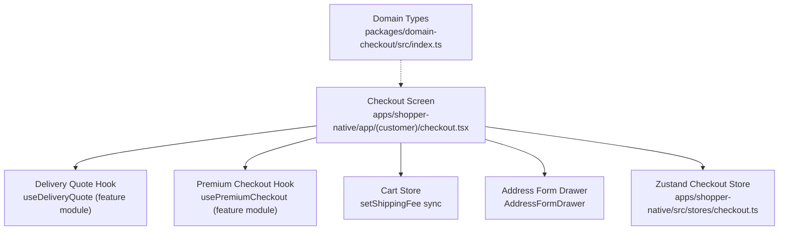
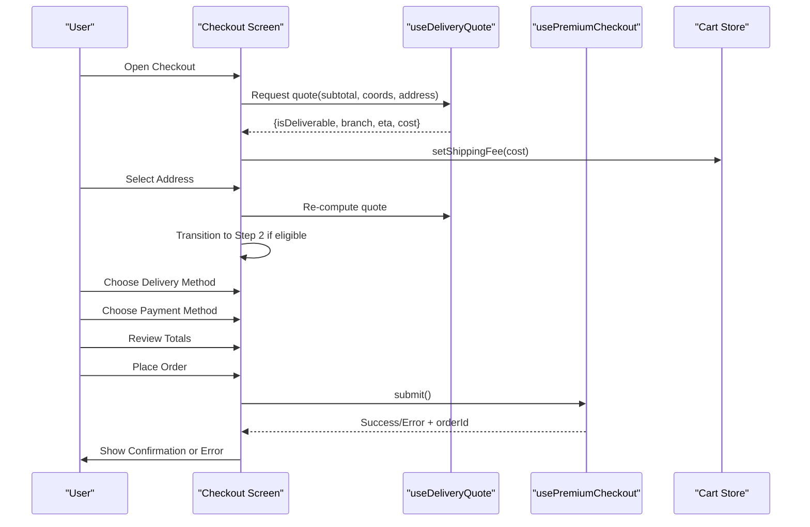
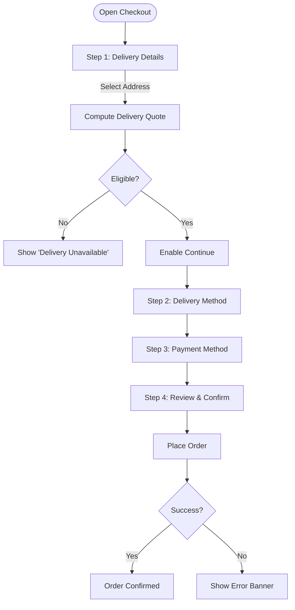
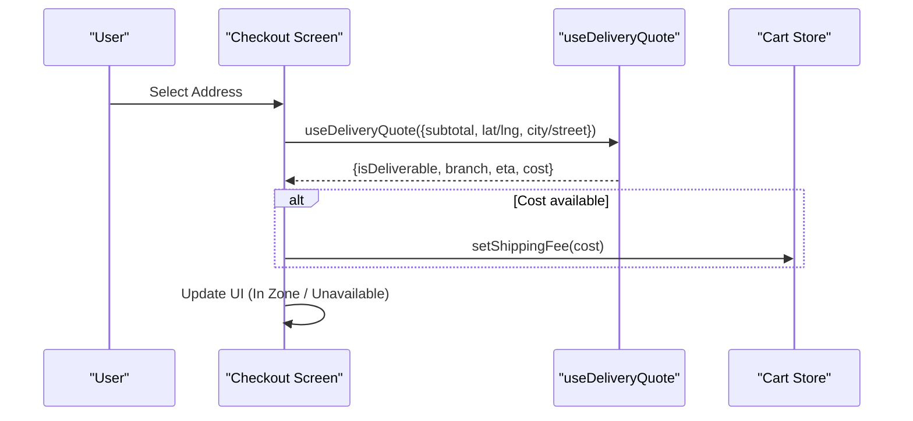
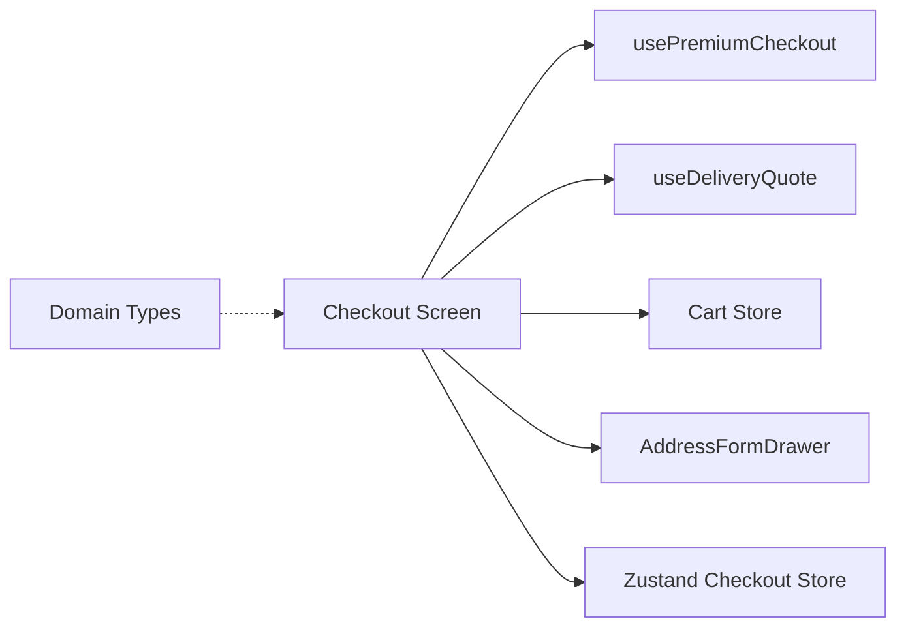

# Checkout Process

<cite>
**Referenced Files in This Document**
- [checkout.tsx](file://apps/shopper-native/app/(customer)/checkout.tsx)
- [checkout store (checkout.ts)](file://apps/shopper-native/src/stores/checkout.ts)
- [domain-checkout index.ts](file://packages/domain-checkout/src/index.ts)
</cite>

## Table of Contents
1. [Introduction](#introduction)
2. [Project Structure](#project-structure)
3. [Core Components](#core-components)
4. [Architecture Overview](#architecture-overview)
5. [Detailed Component Analysis](#detailed-component-analysis)
6. [Dependency Analysis](#dependency-analysis)
7. [Performance Considerations](#performance-considerations)
8. [Troubleshooting Guide](#troubleshooting-guide)
9. [Conclusion](#conclusion)

## Introduction
This document explains the multi-step checkout process implemented in the shopper-native application. It covers address selection, delivery method and quote calculation, payment method processing, order review, and confirmation. It also describes form validation, error handling, user feedback, and how the UI integrates with delivery quoting and branch assignment. Where applicable, it outlines security considerations for payment processing and post-purchase UX enhancements.

## Project Structure
The checkout flow is primarily implemented in a single screen component that orchestrates state via a custom hook and a Zustand store. The domain package defines a minimal type for workflow steps used across features.

**Diagram sources**
- [checkout.tsx:171-520](file://apps/shopper-native/app/(customer)/checkout.tsx#L171-L520)
- [checkout store (checkout.ts):1-32](file://apps/shopper-native/src/stores/checkout.ts#L1-L32)
- [domain-checkout index.ts:1-2](file://packages/domain-checkout/src/index.ts#L1-L2)

**Section sources**
- [checkout.tsx:171-520](file://apps/shopper-native/app/(customer)/checkout.tsx#L171-L520)
- [checkout store (checkout.ts):1-32](file://apps/shopper-native/src/stores/checkout.ts#L1-L32)
- [domain-checkout index.ts:1-2](file://packages/domain-checkout/src/index.ts#L1-L2)

## Core Components
- Checkout Screen: Multi-step accordion UI with step transitions, address selection, delivery method, payment method, and order review. It renders success and auth-required states and manages local UI state (active step, modals, drawers).
- Delivery Quote Integration: Computes deliverability, assigned branch, ETA, distance, and cost based on selected address and cart subtotal; automatically syncs shipping fee to the cart totals.
- Premium Checkout Hook: Provides status, addresses, selected address, payment method, submit action, pricing, error message, and placed order ID.
- Address Management: Allows adding/editing addresses via a drawer and selecting among saved addresses.
- Payment Method State: Maintains current payment method and clears related inputs when switching methods.

Key responsibilities and interactions are detailed in the next sections.

**Section sources**
- [checkout.tsx:171-520](file://apps/shopper-native/app/(customer)/checkout.tsx#L171-L520)
- [checkout store (checkout.ts):1-32](file://apps/shopper-native/src/stores/checkout.ts#L1-L32)

## Architecture Overview
The checkout screen composes several hooks and stores to drive a guided, step-by-step experience:

- Step 1: Delivery Details
  - Select or add an address.
  - Compute delivery eligibility, assigned branch, ETA, distance, and cost using the delivery quote hook.
  - Auto-sync shipping fee into cart totals.
  - Show “In Zone” or “Unavailable” feedback.

- Step 2: Delivery Method
  - Present standard delivery option with ETA and cost.

- Step 3: Payment Method
  - Choose Cash on Delivery or Card (via Stripe).

- Step 4: Review & Place Order
  - Display subtotal, delivery fee, discount, and final total.
  - Submit order via premium checkout hook.

**Diagram sources**
- [checkout.tsx:198-217](file://apps/shopper-native/app/(customer)/checkout.tsx#L198-L217)
- [checkout.tsx:386-403](file://apps/shopper-native/app/(customer)/checkout.tsx#L386-L403)
- [checkout.tsx:423-451](file://apps/shopper-native/app/(customer)/checkout.tsx#L423-L451)
- [checkout.tsx:453-505](file://apps/shopper-native/app/(customer)/checkout.tsx#L453-L505)

## Detailed Component Analysis

### Checkout Screen (Multi-Step Flow)
- Steps and transitions:
  - Step 1: Delivery Details — address selection, zone detection, branch assignment, ETA/cost display, and Continue gating until eligible.
  - Step 2: Delivery Method — shows standard delivery with ETA and cost.
  - Step 3: Payment Method — supports Cash on Delivery and Card (Stripe).
  - Step 4: Review & Confirm — displays pricing summary and triggers order submission.
- User feedback:
  - In-zone vs. out-of-zone messaging with icons and colors.
  - Location details modal showing customer address, GPS verification status, assigned branch info, hours, and distance.
  - Sticky footer with error banner and Place Order button with loading state.
- Special states:
  - AUTH_REQUIRED: Shows authentication gate modal.
  - SUCCESS: Displays order confirmation with order number, total paid, delivery address, and actions to track order or continue shopping.

**Diagram sources**
- [checkout.tsx:297-394](file://apps/shopper-native/app/(customer)/checkout.tsx#L297-L394)
- [checkout.tsx:396-421](file://apps/shopper-native/app/(customer)/checkout.tsx#L396-L421)
- [checkout.tsx:423-451](file://apps/shopper-native/app/(customer)/checkout.tsx#L423-L451)
- [checkout.tsx:453-505](file://apps/shopper-native/app/(customer)/checkout.tsx#L453-L505)

**Section sources**
- [checkout.tsx:171-520](file://apps/shopper-native/app/(customer)/checkout.tsx#L171-L520)

### Address Selection and Geocoding Integration
- Address list and selection:
  - Renders saved addresses with radio-style selection and updates the selected address ID.
  - Adds new address via a drawer component.
- Geocoding and zone detection:
  - Uses coordinates from the selected address to compute delivery eligibility, assigned branch, ETA, and cost.
  - Displays whether GPS coordinates are verified or approximate.
- Automatic shipping fee sync:
  - When quote cost changes, the shipping fee is synced into the cart totals so the review page reflects accurate numbers.

**Diagram sources**
- [checkout.tsx:198-217](file://apps/shopper-native/app/(customer)/checkout.tsx#L198-L217)
- [checkout.tsx:306-394](file://apps/shopper-native/app/(customer)/checkout.tsx#L306-L394)

**Section sources**
- [checkout.tsx:198-217](file://apps/shopper-native/app/(customer)/checkout.tsx#L198-L217)
- [checkout.tsx:306-394](file://apps/shopper-native/app/(customer)/checkout.tsx#L306-L394)

### Delivery Method and ETA/Cost
- Presents a single standard delivery option with ETA range and cost derived from the quote.
- Continuation to payment step is always enabled after this step.

**Section sources**
- [checkout.tsx:396-421](file://apps/shopper-native/app/(customer)/checkout.tsx#L396-L421)

### Payment Method Processing
- Supports:
  - Cash on Delivery (COD)
  - Credit/Debit Card via Stripe
- Behavior:
  - Toggling payment method provides haptic feedback and visual selection.
  - The Zustand checkout store resets transfer number and receipt URI when payment method changes to avoid stale data.

Security considerations:
- For card payments, sensitive payment data is handled by the Stripe integration referenced in the UI text; ensure PCI compliance by not storing raw card details locally.

**Section sources**
- [checkout.tsx:423-451](file://apps/shopper-native/app/(customer)/checkout.tsx#L423-L451)
- [checkout store (checkout.ts):17-31](file://apps/shopper-native/src/stores/checkout.ts#L17-L31)

### Order Review and Submission
- Review displays:
  - Subtotal, delivery fee, discount (if any), and final total.
- Submission:
  - Place Order triggers the submit action from the premium checkout hook.
  - On success, navigates to a confirmation view with order number and total paid.
  - On error, shows an inline error banner in the sticky footer.

Post-purchase UX:
- Actions to track the order or continue shopping are provided on the confirmation screen.

**Section sources**
- [checkout.tsx:453-505](file://apps/shopper-native/app/(customer)/checkout.tsx#L453-L505)
- [checkout.tsx:228-276](file://apps/shopper-native/app/(customer)/checkout.tsx#L228-L276)

### Form Validation and Error Handling
- Validation gates:
  - Continue from Step 1 requires a selected address and delivery eligibility.
  - Place Order is disabled when delivery is unavailable.
- Error handling:
  - Inline error banner appears during submission failures.
  - Authentication requirement redirects to an auth gate modal.
- User feedback:
  - Haptic feedback on selections and actions.
  - Animated transitions for accordions and modals.
  - Clear status indicators for zone eligibility and delivery availability.

**Section sources**
- [checkout.tsx:219-226](file://apps/shopper-native/app/(customer)/checkout.tsx#L219-L226)
- [checkout.tsx:386-394](file://apps/shopper-native/app/(customer)/checkout.tsx#L386-L394)
- [checkout.tsx:486-505](file://apps/shopper-native/app/(customer)/checkout.tsx#L486-L505)

### Security Measures for Payment Processing
- Card payments:
  - UI indicates secure payment via Stripe; ensure no raw card data is stored in app state or logs.
- Data hygiene:
  - Resetting transfer number and receipt URI on payment method change prevents cross-contamination between payment flows.
- Auth gating:
  - Requires authentication before proceeding; otherwise shows an auth gate modal.

**Section sources**
- [checkout.tsx:423-451](file://apps/shopper-native/app/(customer)/checkout.tsx#L423-L451)
- [checkout store (checkout.ts):23-31](file://apps/shopper-native/src/stores/checkout.ts#L23-L31)
- [checkout.tsx:219-226](file://apps/shopper-native/app/(customer)/checkout.tsx#L219-L226)

## Dependency Analysis
- The checkout screen depends on:
  - usePremiumCheckout hook for core state and submission logic.
  - useDeliveryQuote hook for address-to-branch routing, ETA, and cost.
  - Cart store to keep shipping fees synchronized.
  - AddressFormDrawer for address management.
  - Zustand checkout store for payment-related transient state.
- Domain types define workflow steps used elsewhere in the codebase.

**Diagram sources**
- [checkout.tsx:171-520](file://apps/shopper-native/app/(customer)/checkout.tsx#L171-L520)
- [checkout store (checkout.ts):1-32](file://apps/shopper-native/src/stores/checkout.ts#L1-L32)
- [domain-checkout index.ts:1-2](file://packages/domain-checkout/src/index.ts#L1-L2)

**Section sources**
- [checkout.tsx:171-520](file://apps/shopper-native/app/(customer)/checkout.tsx#L171-L520)
- [checkout store (checkout.ts):1-32](file://apps/shopper-native/src/stores/checkout.ts#L1-L32)
- [domain-checkout index.ts:1-2](file://packages/domain-checkout/src/index.ts#L1-L2)

## Performance Considerations
- Minimize re-renders by keeping step state local and relying on hooks for remote data.
- Debounce or throttle quote recomputation if needed when addresses or cart items change frequently.
- Use lazy loading for heavy components like maps or location details modal only when opened.
- Keep animations lightweight; prefer built-in transitions and avoid excessive layout thrashing.

[No sources needed since this section provides general guidance]

## Troubleshooting Guide
Common issues and resolutions:
- Delivery unavailable:
  - Ensure the selected address has valid coordinates and is within the service zone.
  - Check the warning message for out-of-service details.
- Shipping fee mismatch:
  - Verify that the quote cost is being synced to the cart store.
- Payment errors:
  - For card payments, confirm Stripe integration is configured and network connectivity is stable.
  - Ensure payment method state is reset when switching methods.
- Authentication required:
  - If the session expires, the auth gate modal will appear; re-authenticate to proceed.

**Section sources**
- [checkout.tsx:370-384](file://apps/shopper-native/app/(customer)/checkout.tsx#L370-L384)
- [checkout.tsx:219-226](file://apps/shopper-native/app/(customer)/checkout.tsx#L219-L226)
- [checkout.tsx:486-505](file://apps/shopper-native/app/(customer)/checkout.tsx#L486-L505)

## Conclusion
The checkout implementation provides a clear, guided flow from address selection through payment and order confirmation. It leverages delivery quoting for intelligent branch assignment, ETA, and cost calculation, while maintaining robust user feedback and error handling. Payment options include COD and card payments via Stripe, with safeguards to prevent stale data and enforce authentication. Post-purchase UX includes order tracking and continued shopping paths. Future enhancements may include additional payment gateways, tax computation, and expanded shipping options.

[No sources needed since this section summarizes without analyzing specific files]