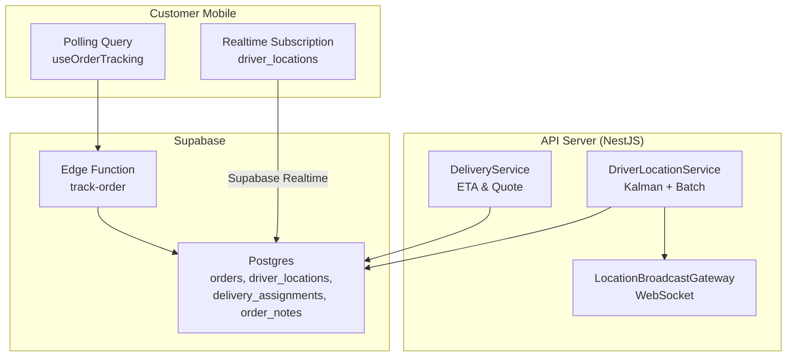
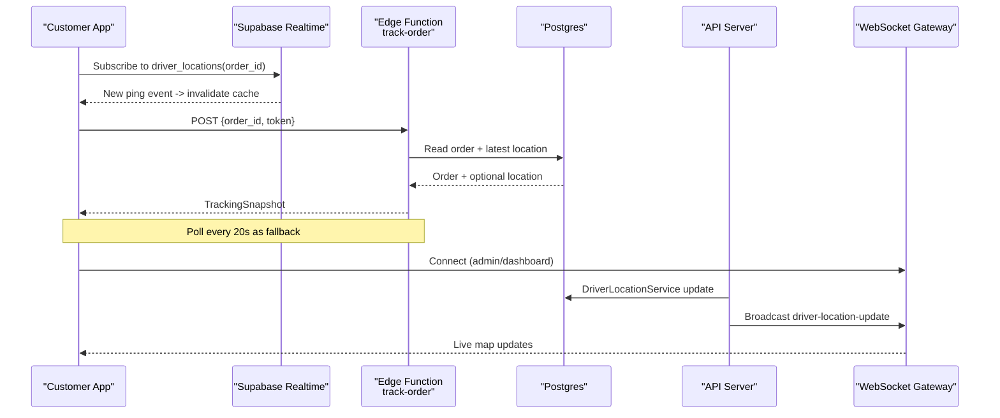
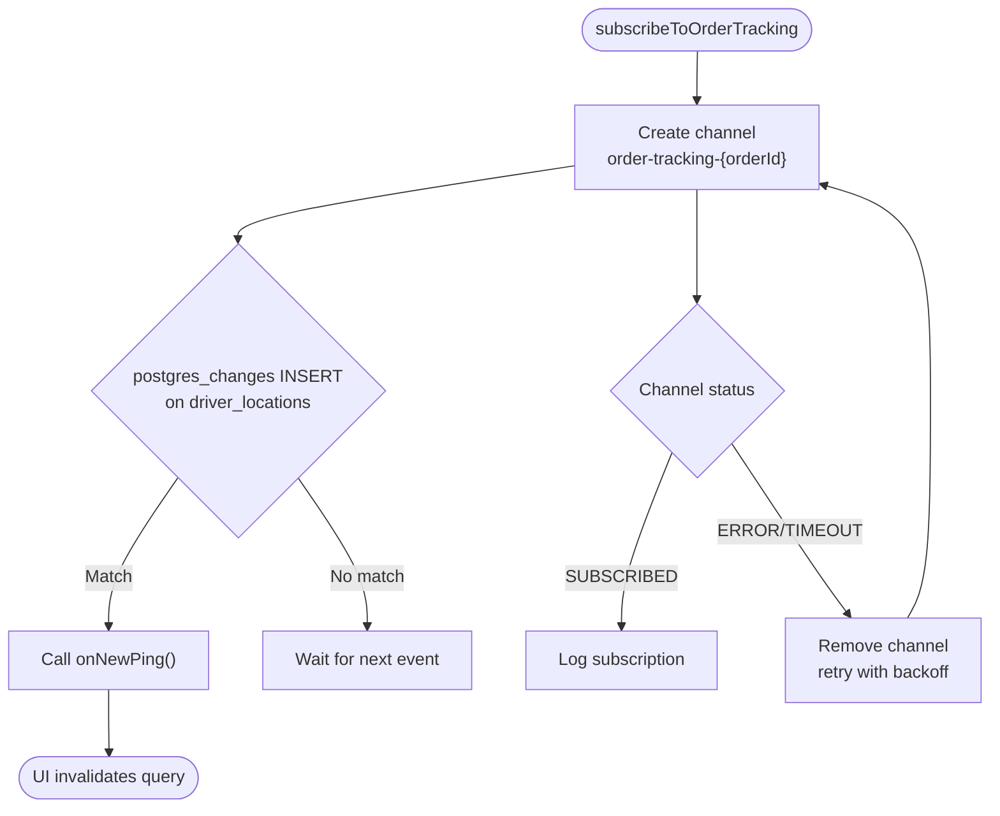
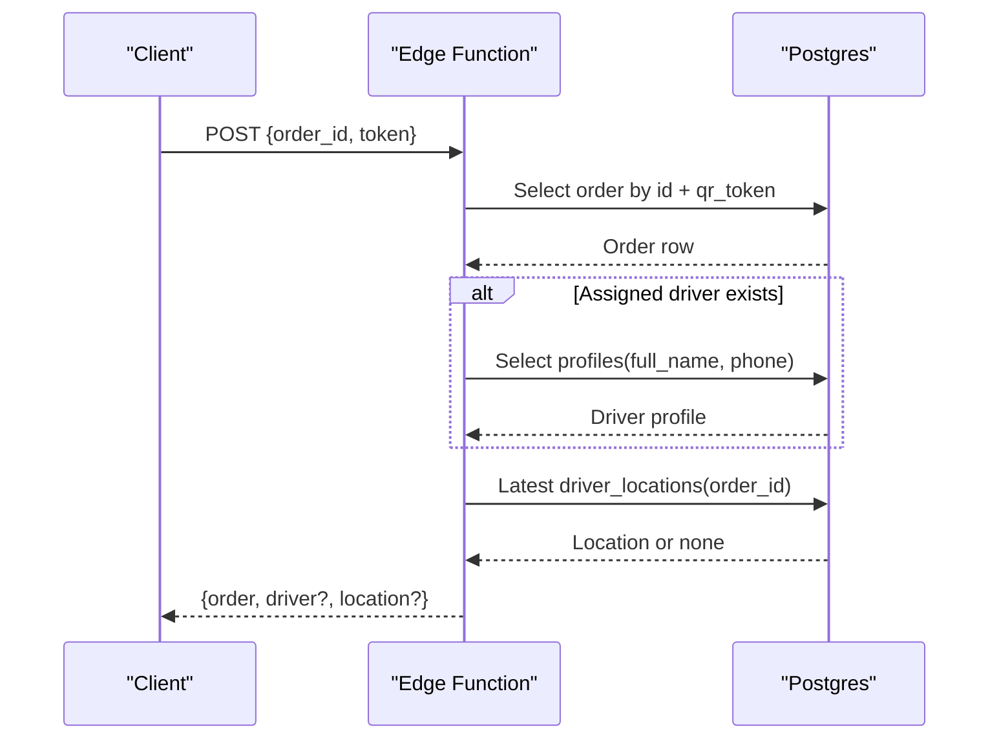
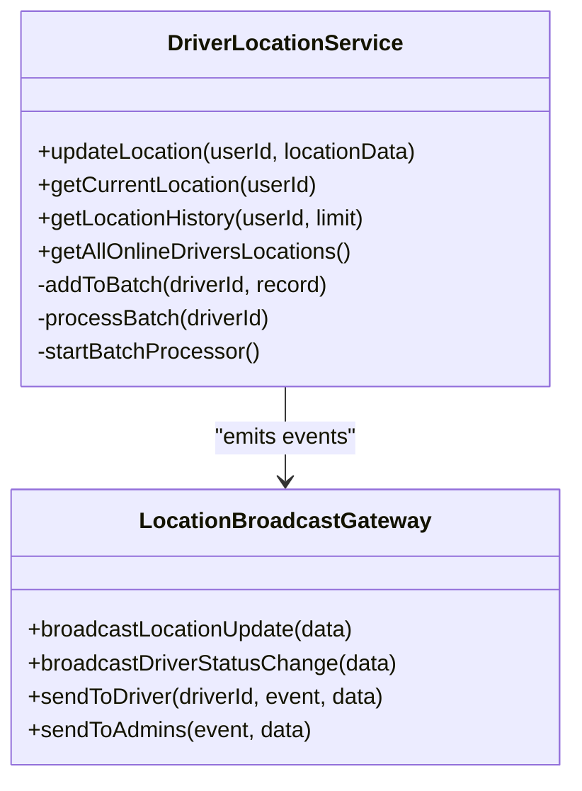
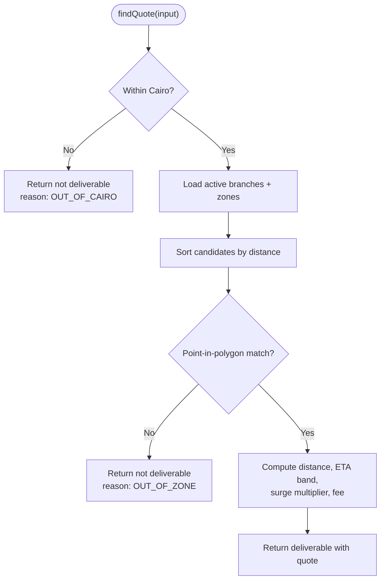
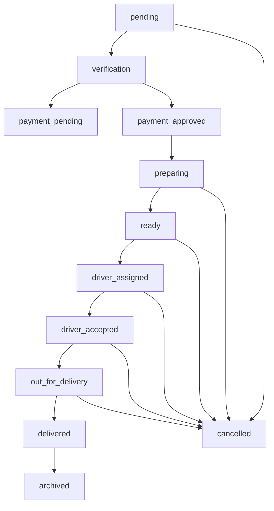
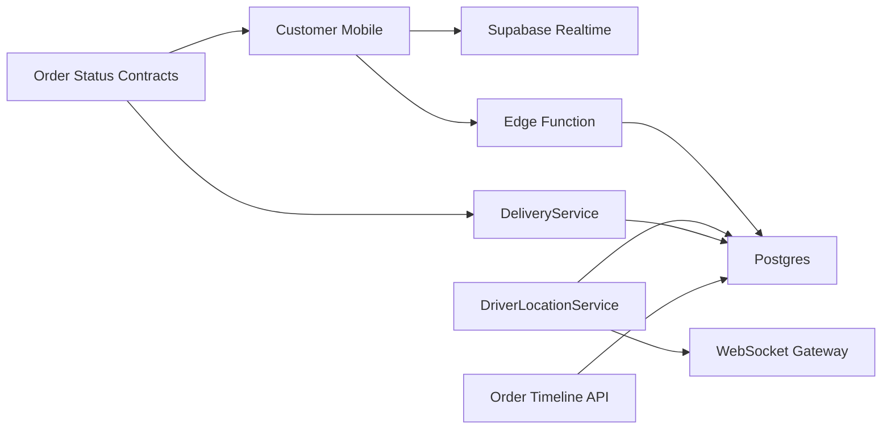

# Order Tracking System

<cite>
**Referenced Files in This Document**
- [realtime.ts](file://apps/shopper-native/src/features/orders/realtime.ts)
- [useOrderTracking.ts](file://apps/shopper-native/src/features/orders/hooks/useOrderTracking.ts)
- [track-order/index.ts](file://supabase/functions/track-order/index.ts)
- [delivery.service.ts](file://apps/api/src/modules/delivery/delivery.service.ts)
- [location-broadcast.gateway.ts](file://apps/api/src/modules/driver/location-broadcast.gateway.ts)
- [driver-location.service.ts](file://apps/api/src/modules/driver/driver-location.service.ts)
- [orderStatus.ts](file://packages/contracts/src/orderStatus.ts)
- [orderTimelineApi.ts](file://apps/shopper-web/src/services/orderTimelineApi.ts)
</cite>

## Table of Contents
1. Introduction
2. Project Structure
3. Core Components
4. Architecture Overview
5. Detailed Component Analysis
6. Dependency Analysis
7. Performance Considerations
8. Troubleshooting Guide
9. Conclusion

## Introduction
This document explains the end-to-end order tracking system across customer-facing and operational surfaces. It covers:
- Order history page with filtering, sorting, and status visualization
- Real-time order tracking with live updates, delivery progress indicators, and estimated arrival times
- Logistics integration for shipment tracking, driver assignment notifications, and delivery status updates
- Order timeline view from placement to delivery, including customer notifications and support ticket integration
- Real-time communication via WebSockets and Supabase Realtime, offline support for order history, and performance optimizations for tracking data

## Project Structure
The order tracking system spans multiple apps and services:
- Customer mobile app subscribes to Supabase Realtime events and polls a tracking snapshot endpoint
- API server provides delivery quoting, ETA computation, and WebSocket broadcasting for driver locations
- Supabase Edge Function exposes a secure, token-authenticated tracking snapshot endpoint
- Shared contracts define canonical order statuses and transitions used across all clients and admin tools
- Web client reads an order timeline via a read-only RPC and supports adding notes for support workflows

**Diagram sources**
- [realtime.ts:54-102](file://apps/shopper-native/src/features/orders/realtime.ts#L54-L102)
- [useOrderTracking.ts:28-41](file://apps/shopper-native/src/features/orders/hooks/useOrderTracking.ts#L28-L41)
- [track-order/index.ts:93-218](file://supabase/functions/track-order/index.ts#L93-L218)
- [delivery.service.ts:59-239](file://apps/api/src/modules/delivery/delivery.service.ts#L59-L239)
- [location-broadcast.gateway.ts:27-46](file://apps/api/src/modules/driver/location-broadcast.gateway.ts#L27-L46)
- [driver-location.service.ts:30-127](file://apps/api/src/modules/driver/driver-location.service.ts#L30-L127)

**Section sources**
- [realtime.ts:54-102](file://apps/shopper-native/src/features/orders/realtime.ts#L54-L102)
- [useOrderTracking.ts:28-41](file://apps/shopper-native/src/features/orders/hooks/useOrderTracking.ts#L28-L41)
- [track-order/index.ts:93-218](file://supabase/functions/track-order/index.ts#L93-L218)
- [delivery.service.ts:59-239](file://apps/api/src/modules/delivery/delivery.service.ts#L59-L239)
- [location-broadcast.gateway.ts:27-46](file://apps/api/src/modules/driver/location-broadcast.gateway.ts#L27-L46)
- [driver-location.service.ts:30-127](file://apps/api/src/modules/driver/driver-location.service.ts#L30-L127)

## Core Components
- Realtime subscription for live location pings per order using Supabase Realtime channels
- Polling-based tracking snapshot via a secure Edge Function with stale-location handling
- Delivery service computing ETA bands, surge pricing, and zone matching
- Driver location service with GPS filtering, batching, and WebSocket broadcast
- Canonical order status model with allowed transitions and labels
- Order timeline aggregation and note-taking for support workflows

**Section sources**
- [realtime.ts:54-102](file://apps/shopper-native/src/features/orders/realtime.ts#L54-L102)
- [useOrderTracking.ts:28-41](file://apps/shopper-native/src/features/orders/hooks/useOrderTracking.ts#L28-L41)
- [track-order/index.ts:93-218](file://supabase/functions/track-order/index.ts#L93-L218)
- [delivery.service.ts:21-33](file://apps/api/src/modules/delivery/delivery.service.ts#L21-L33)
- [driver-location.service.ts:30-127](file://apps/api/src/modules/driver/driver-location.service.ts#L30-L127)
- [orderStatus.ts:59-168](file://packages/contracts/src/orderStatus.ts#L59-L168)
- [orderTimelineApi.ts:39-63](file://apps/shopper-web/src/services/orderTimelineApi.ts#L39-L63)

## Architecture Overview
The tracking flow combines real-time and polling mechanisms:
- Customers subscribe to Supabase Realtime INSERT events on driver_locations filtered by order_id to refresh UI instantly
- A background poll fetches a compact TrackingSnapshot from the track-order Edge Function, which enforces token-based access and stale-location policy
- Driver devices send location updates to the API; the DriverLocationService filters and batches writes, then broadcasts via WebSocket to connected clients
- The DeliveryService computes ETAs and delivery feasibility based on zones, distance, and surge windows
- Order status is normalized and validated against a canonical lifecycle to ensure consistent UI and workflow

**Diagram sources**
- [realtime.ts:54-102](file://apps/shopper-native/src/features/orders/realtime.ts#L54-L102)
- [useOrderTracking.ts:28-41](file://apps/shopper-native/src/features/orders/hooks/useOrderTracking.ts#L28-L41)
- [track-order/index.ts:93-218](file://supabase/functions/track-order/index.ts#L93-L218)
- [driver-location.service.ts:30-127](file://apps/api/src/modules/driver/driver-location.service.ts#L30-L127)
- [location-broadcast.gateway.ts:124-143](file://apps/api/src/modules/driver/location-broadcast.gateway.ts#L124-L143)

## Detailed Component Analysis

### Realtime Order Tracking (Supabase Realtime)
- Subscribes to INSERT events on driver_locations filtered by order_id
- Exponential backoff retry on channel errors/timeouts
- Returns a stable handle with unsubscribe to avoid leaks
- RLS ensures only the rightful customer receives events

**Diagram sources**
- [realtime.ts:54-102](file://apps/shopper-native/src/features/orders/realtime.ts#L54-L102)

**Section sources**
- [realtime.ts:54-102](file://apps/shopper-native/src/features/orders/realtime.ts#L54-L102)

### Tracking Snapshot Endpoint (Edge Function)
- Token-authenticated endpoint using orders.qr_token
- Reads minimal order fields and resolves driver info safely
- Enforces stale-location policy (returns null if last ping older than threshold)
- Returns a compact TrackingSnapshot for efficient UI rendering

**Diagram sources**
- [track-order/index.ts:93-218](file://supabase/functions/track-order/index.ts#L93-L218)

**Section sources**
- [track-order/index.ts:93-218](file://supabase/functions/track-order/index.ts#L93-L218)

### Driver Location Service and WebSocket Broadcast
- Applies Kalman filter to smooth noisy GPS readings
- Batches location inserts to reduce DB load
- Updates current driver position immediately and broadcasts via WebSocket
- Provides admin endpoints to list online drivers and their locations

**Diagram sources**
- [driver-location.service.ts:30-127](file://apps/api/src/modules/driver/driver-location.service.ts#L30-L127)
- [location-broadcast.gateway.ts:124-143](file://apps/api/src/modules/driver/location-broadcast.gateway.ts#L124-L143)

**Section sources**
- [driver-location.service.ts:30-127](file://apps/api/src/modules/driver/driver-location.service.ts#L30-L127)
- [location-broadcast.gateway.ts:124-143](file://apps/api/src/modules/driver/location-broadcast.gateway.ts#L124-L143)

### Delivery Quoting and ETA Computation
- Validates coordinates within Greater Cairo bounds
- Matches nearest branch and zone using polygon containment
- Computes ETA band based on distance and load factor
- Applies free delivery thresholds and surge multipliers

**Diagram sources**
- [delivery.service.ts:21-33](file://apps/api/src/modules/delivery/delivery.service.ts#L21-L33)
- [delivery.service.ts:59-239](file://apps/api/src/modules/delivery/delivery.service.ts#L59-L239)

**Section sources**
- [delivery.service.ts:59-239](file://apps/api/src/modules/delivery/delivery.service.ts#L59-L239)

### Order Status Model and Timeline
- Canonical statuses unify legacy spellings and enforce allowed transitions
- Labels provide localized display strings for UI
- Order timeline aggregates events from multiple tables via a read-only RPC
- Support notes can be added to orders for collaboration and audit trails

**Diagram sources**
- [orderStatus.ts:140-155](file://packages/contracts/src/orderStatus.ts#L140-L155)

**Section sources**
- [orderStatus.ts:59-168](file://packages/contracts/src/orderStatus.ts#L59-L168)
- [orderTimelineApi.ts:39-63](file://apps/shopper-web/src/services/orderTimelineApi.ts#L39-L63)

### Order History Page: Filtering, Sorting, Status Visualization
- Use canonical status labels to render consistent badges and timelines
- Filter by status using the normalized set; sort by created_at or status progression
- Visualize progress using the canonical lifecycle diagram above
- Integrate support notes from the timeline to show context alongside history rows

[No sources needed since this section describes UI behavior conceptually]

### Real-Time Communication: WebSockets and Offline Support
- WebSockets: Admin and dispatch dashboards connect to the gateway to receive driver location and status changes in real time
- Supabase Realtime: Customer screens subscribe to driver_locations INSERT events per order for instant UI updates
- Offline support: The native hook uses TanStack Query with caching and periodic polling; when realtime drops, the poll keeps the UI fresh
- Stale location policy: If no recent ping, the tracking snapshot returns null location so the UI can show “live tracking unavailable”

**Section sources**
- [location-broadcast.gateway.ts:27-46](file://apps/api/src/modules/driver/location-broadcast.gateway.ts#L27-L46)
- [realtime.ts:54-102](file://apps/shopper-native/src/features/orders/realtime.ts#L54-L102)
- [useOrderTracking.ts:28-41](file://apps/shopper-native/src/features/orders/hooks/useOrderTracking.ts#L28-L41)
- [track-order/index.ts:173-203](file://supabase/functions/track-order/index.ts#L173-L203)

## Dependency Analysis
Key dependencies and coupling:
- Customer mobile depends on Supabase Realtime and the track-order Edge Function
- API’s DriverLocationService depends on Prisma and the WebSocket gateway
- DeliveryService depends on Prisma and geometry utilities for zone matching
- Order status model is shared across apps to ensure consistent state machines
- Timeline API depends on Supabase RPC and order_notes table

**Diagram sources**
- [realtime.ts:54-102](file://apps/shopper-native/src/features/orders/realtime.ts#L54-L102)
- [track-order/index.ts:93-218](file://supabase/functions/track-order/index.ts#L93-L218)
- [driver-location.service.ts:30-127](file://apps/api/src/modules/driver/driver-location.service.ts#L30-L127)
- [delivery.service.ts:59-239](file://apps/api/src/modules/delivery/delivery.service.ts#L59-L239)
- [orderStatus.ts:59-168](file://packages/contracts/src/orderStatus.ts#L59-L168)
- [orderTimelineApi.ts:39-63](file://apps/shopper-web/src/services/orderTimelineApi.ts#L39-L63)

**Section sources**
- [realtime.ts:54-102](file://apps/shopper-native/src/features/orders/realtime.ts#L54-L102)
- [track-order/index.ts:93-218](file://supabase/functions/track-order/index.ts#L93-L218)
- [driver-location.service.ts:30-127](file://apps/api/src/modules/driver/driver-location.service.ts#L30-L127)
- [delivery.service.ts:59-239](file://apps/api/src/modules/delivery/delivery.service.ts#L59-L239)
- [orderStatus.ts:59-168](file://packages/contracts/src/orderStatus.ts#L59-L168)
- [orderTimelineApi.ts:39-63](file://apps/shopper-web/src/services/orderTimelineApi.ts#L39-L63)

## Performance Considerations
- Realtime vs polling: Use Supabase Realtime for immediate UI updates; keep 20-second polling as a resilient fallback
- Stale location policy: Suppress outdated pings to avoid misleading markers
- Batching and filtering: DriverLocationService batches inserts and applies Kalman filtering to reduce noise and DB pressure
- Efficient queries: Edge function selects minimal fields and leverages indexes for latest location per order
- Cache tuning: TanStack Query settings balance freshness with network usage

[No sources needed since this section provides general guidance]

## Troubleshooting Guide
Common issues and resolutions:
- Realtime channel errors/timeouts: The subscription retries with exponential backoff and removes stale channels before reconnecting
- No location shown: Check if the latest ping exceeds the stale threshold; the UI should indicate “location temporarily unavailable”
- Driver cannot update location: Ensure driver profile is marked online; otherwise updates are rejected
- WebSocket connection rejected: Verify authentication token and role; non-admin connections are disconnected for the admin namespace
- Timeline not loading: Confirm RPC permissions and that order_notes have been inserted successfully

**Section sources**
- [realtime.ts:76-97](file://apps/shopper-native/src/features/orders/realtime.ts#L76-L97)
- [track-order/index.ts:173-203](file://supabase/functions/track-order/index.ts#L173-L203)
- [driver-location.service.ts:41-44](file://apps/api/src/modules/driver/driver-location.service.ts#L41-L44)
- [location-broadcast.gateway.ts:61-81](file://apps/api/src/modules/driver/location-broadcast.gateway.ts#L61-L81)
- [orderTimelineApi.ts:39-63](file://apps/shopper-web/src/services/orderTimelineApi.ts#L39-L63)

## Conclusion
The order tracking system combines robust real-time capabilities with reliable fallbacks to deliver accurate, timely visibility into order fulfillment. Canonical status modeling ensures consistency across platforms, while performance-oriented design choices (batching, filtering, caching, and selective queries) keep the experience responsive under load. Together, these components enable clear status visualization, precise ETA estimates, and seamless logistics coordination between customers, drivers, and operations teams.