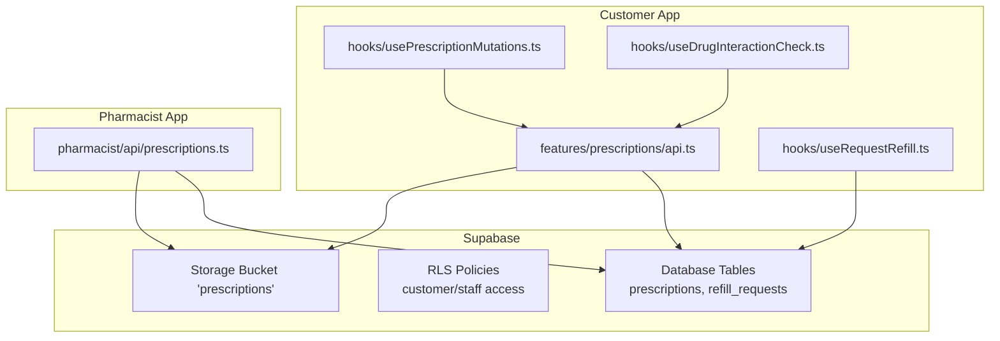
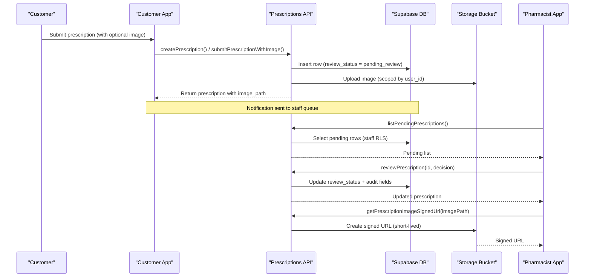
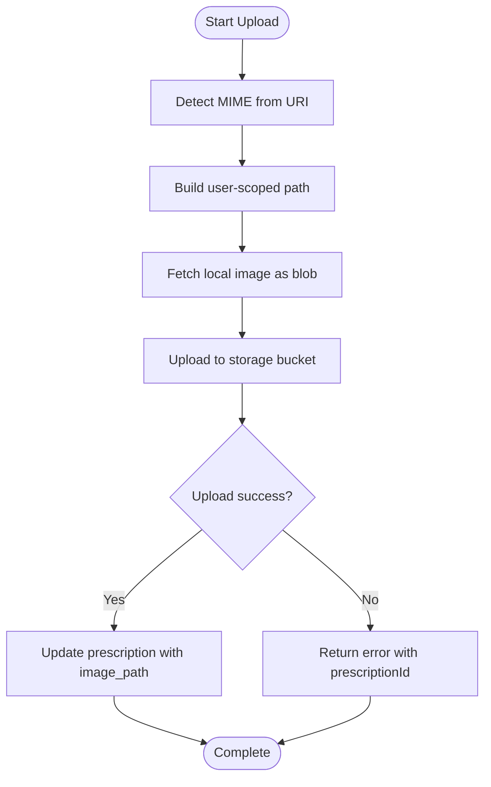
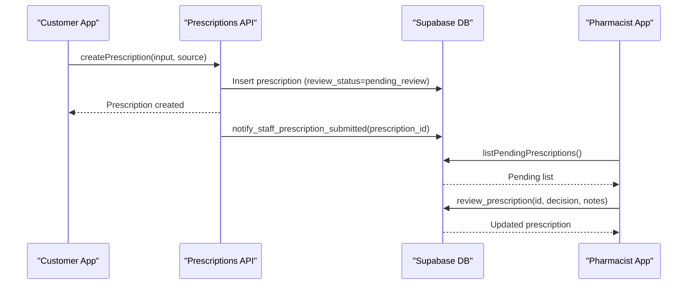
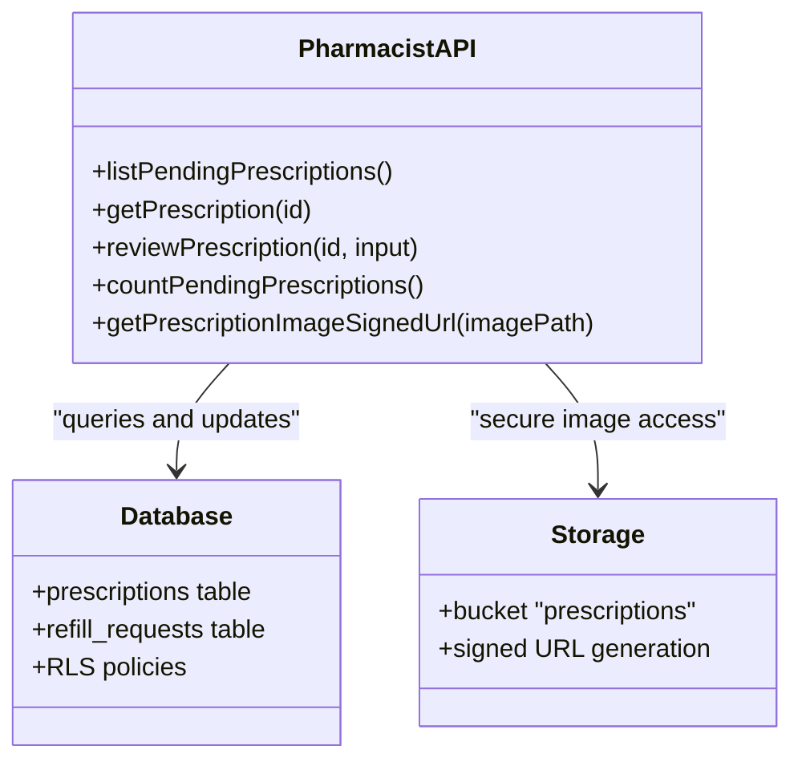
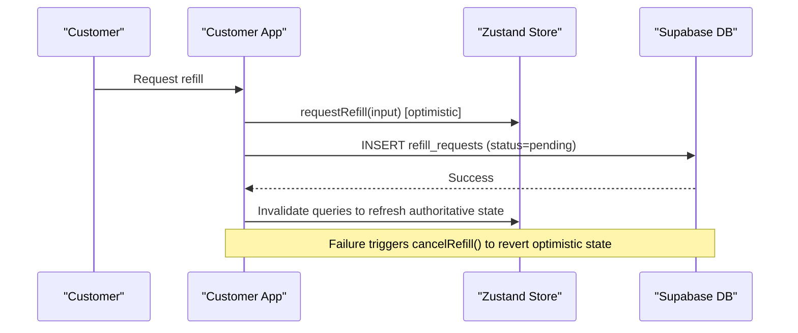
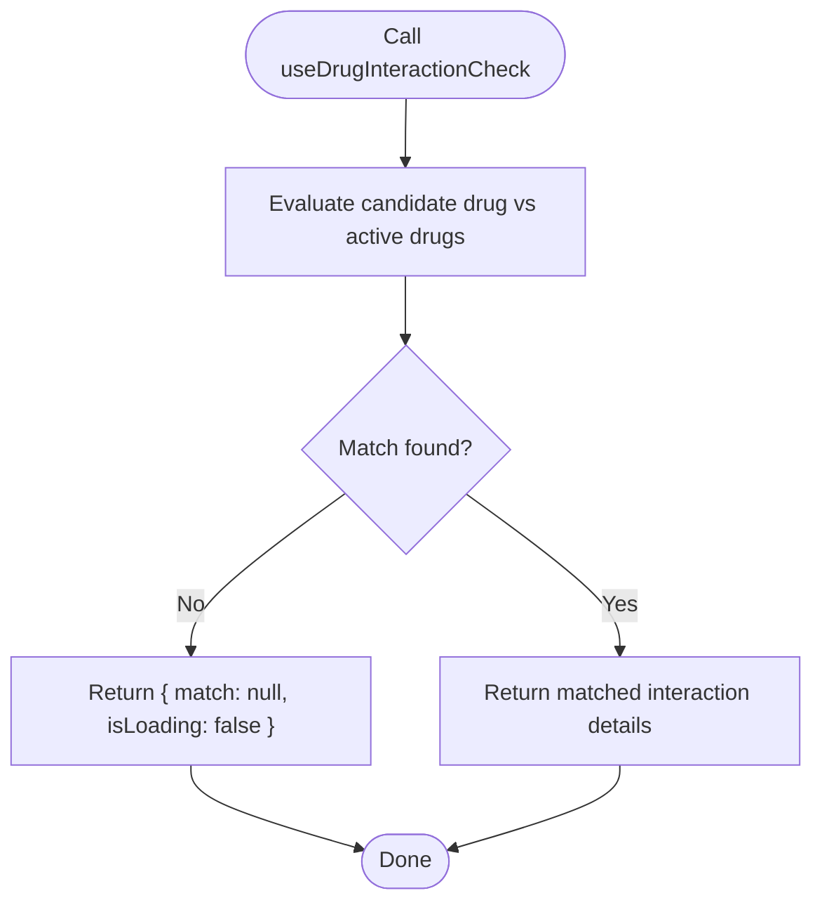
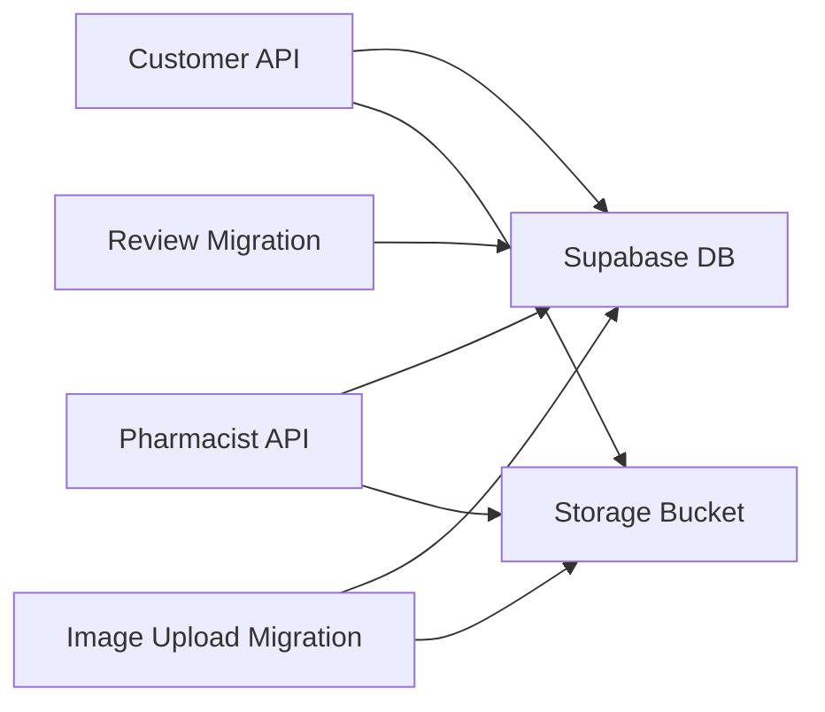

# Prescription Management

<cite>
**Referenced Files in This Document**
- [api.ts](file://apps/shopper-native/src/features/prescriptions/api.ts)
- [prescriptions.ts](file://apps/shopper-native/src/features/pharmacist/api/prescriptions.ts)
- [usePrescriptionMutations.ts](file://apps/shopper-native/src/features/prescriptions/hooks/usePrescriptionMutations.ts)
- [useRequestRefill.ts](file://apps/shopper-native/src/features/prescriptions/hooks/useRequestRefill.ts)
- [useDrugInteractionCheck.ts](file://apps/shopper-native/src/features/prescriptions/hooks/useDrugInteractionCheck.ts)
- [20260705120000_prescriptions_admin_review.sql](file://supabase/migrations/20260705120000_prescriptions_admin_review.sql)
- [20260817100000_prescription_image_upload.sql](file://supabase/migrations/20260817100000_prescription_image_upload.sql)
</cite>

## Table of Contents
1. [Introduction](#introduction)
2. [Project Structure](#project-structure)
3. [Core Components](#core-components)
4. [Architecture Overview](#architecture-overview)
5. [Detailed Component Analysis](#detailed-component-analysis)
6. [Dependency Analysis](#dependency-analysis)
7. [Performance Considerations](#performance-considerations)
8. [Troubleshooting Guide](#troubleshooting-guide)
9. [Conclusion](#conclusion)
10. [Appendices](#appendices)

## Introduction
This document explains the prescription management system implemented in the repository, focusing on:
- Prescription upload with file handling and validation
- Submission workflow, status tracking, and pharmacist review
- Refill requests and history view
- Medication interaction warnings (current stub)
- Integration points with Supabase storage and database
- Compliance considerations for pharmaceutical data handling

The system is built around a customer-facing mobile feature that creates and manages prescriptions and a staff-facing pharmacist module to review and approve/reject submissions. Data persistence and access control are enforced via Supabase tables, Row Level Security policies, and storage bucket policies.

## Project Structure
The prescription functionality spans several modules:
- Customer-side API and hooks for creating, updating, deleting prescriptions, and requesting refills
- Pharmacist-side API for reviewing pending prescriptions
- Database migrations adding review workflows, audit fields, and secure image storage
- Storage policies ensuring only authorized users can access their own documents and staff can review them

**Diagram sources**
- [api.ts:1-193](file://apps/shopper-native/src/features/prescriptions/api.ts#L1-L193)
- [prescriptions.ts:1-175](file://apps/shopper-native/src/features/pharmacist/api/prescriptions.ts#L1-L175)
- [usePrescriptionMutations.ts:1-57](file://apps/shopper-native/src/features/prescriptions/hooks/usePrescriptionMutations.ts#L1-L57)
- [useRequestRefill.ts:1-76](file://apps/shopper-native/src/features/prescriptions/hooks/useRequestRefill.ts#L1-L76)
- [useDrugInteractionCheck.ts:1-37](file://apps/shopper-native/src/features/prescriptions/hooks/useDrugInteractionCheck.ts#L1-L37)
- [20260705120000_prescriptions_admin_review.sql:1-96](file://supabase/migrations/20260705120000_prescriptions_admin_review.sql#L1-L96)
- [20260817100000_prescription_image_upload.sql:1-78](file://supabase/migrations/20260817100000_prescription_image_upload.sql#L1-L78)

**Section sources**
- [api.ts:1-193](file://apps/shopper-native/src/features/prescriptions/api.ts#L1-L193)
- [prescriptions.ts:1-175](file://apps/shopper-native/src/features/pharmacist/api/prescriptions.ts#L1-L175)
- [20260705120000_prescriptions_admin_review.sql:1-96](file://supabase/migrations/20260705120000_prescriptions_admin_review.sql#L1-L96)
- [20260817100000_prescription_image_upload.sql:1-78](file://supabase/migrations/20260817100000_prescription_image_upload.sql#L1-L78)

## Core Components
- Prescription submission and lifecycle:
  - Create, update, delete prescriptions for the authenticated user
  - Enforce review_status workflow (pending_review -> approved/rejected)
  - Track submission_source (manual or whatsapp placeholder)
- Image upload pipeline:
  - Upload images to a private storage bucket scoped by user_id
  - Link uploaded image path back to the prescription record
- Pharmacist review:
  - List pending prescriptions
  - Approve or reject with audit fields (reviewed_by, reviewed_at, admin_notes, rejection_reason)
  - Generate short-lived signed URLs for viewing prescription images
- Refill requests:
  - Place refill requests against existing prescriptions
  - Optimistic UI updates with rollback on failure
- Interaction checks:
  - Hook stub ready for future integration with drug interaction logic

**Section sources**
- [api.ts:14-193](file://apps/shopper-native/src/features/prescriptions/api.ts#L14-L193)
- [prescriptions.ts:80-175](file://apps/shopper-native/src/features/pharmacist/api/prescriptions.ts#L80-L175)
- [useRequestRefill.ts:1-76](file://apps/shopper-native/src/features/prescriptions/hooks/useRequestRefill.ts#L1-L76)
- [useDrugInteractionCheck.ts:1-37](file://apps/shopper-native/src/features/prescriptions/hooks/useDrugInteractionCheck.ts#L1-L37)
- [20260705120000_prescriptions_admin_review.sql:18-96](file://supabase/migrations/20260705120000_prescriptions_admin_review.sql#L18-L96)
- [20260817100000_prescription_image_upload.sql:9-78](file://supabase/migrations/20260817100000_prescription_image_upload.sql#L9-L78)

## Architecture Overview
The system follows a clear separation between customer and pharmacist flows, with strong security boundaries enforced at the database and storage layers.

**Diagram sources**
- [api.ts:75-182](file://apps/shopper-native/src/features/prescriptions/api.ts#L75-L182)
- [prescriptions.ts:83-175](file://apps/shopper-native/src/features/pharmacist/api/prescriptions.ts#L83-L175)
- [20260705120000_prescriptions_admin_review.sql:61-96](file://supabase/migrations/20260705120000_prescriptions_admin_review.sql#L61-L96)
- [20260817100000_prescription_image_upload.sql:23-78](file://supabase/migrations/20260817100000_prescription_image_upload.sql#L23-L78)

## Detailed Component Analysis

### Prescription Upload and File Handling
- Image detection and MIME mapping:
  - Determines MIME type from file extension and maps to appropriate storage content type
  - Derives file extension from MIME for consistent storage paths
- Secure upload:
  - Uploads to a private bucket under a user-scoped folder structure
  - Uses upsert to allow retries without duplication
- Record linkage:
  - Creates a prescription record first to obtain an ID
  - Links the stored image path back to the prescription
  - Ensures errors during upload do not roll back the prescription creation; allows retry/cleanup strategies

**Diagram sources**
- [api.ts:23-66](file://apps/shopper-native/src/features/prescriptions/api.ts#L23-L66)
- [api.ts:158-182](file://apps/shopper-native/src/features/prescriptions/api.ts#L158-L182)
- [20260817100000_prescription_image_upload.sql:23-78](file://supabase/migrations/20260817100000_prescription_image_upload.sql#L23-L78)

**Section sources**
- [api.ts:23-66](file://apps/shopper-native/src/features/prescriptions/api.ts#L23-L66)
- [api.ts:158-182](file://apps/shopper-native/src/features/prescriptions/api.ts#L158-L182)
- [20260817100000_prescription_image_upload.sql:9-78](file://supabase/migrations/20260817100000_prescription_image_upload.sql#L9-L78)

### Prescription Submission Workflow and Status Tracking
- New submissions enter the review queue:
  - review_status set to pending_review
  - submission_source recorded (manual or whatsapp placeholder)
- Notifications:
  - A notification RPC is invoked to alert staff about new submissions
- History and state:
  - Status transitions managed by pharmacist review actions
  - Audit fields capture who reviewed and when

**Diagram sources**
- [api.ts:75-109](file://apps/shopper-native/src/features/prescriptions/api.ts#L75-L109)
- [prescriptions.ts:83-148](file://apps/shopper-native/src/features/pharmacist/api/prescriptions.ts#L83-L148)
- [20260705120000_prescriptions_admin_review.sql:18-42](file://supabase/migrations/20260705120000_prescriptions_admin_review.sql#L18-L42)

**Section sources**
- [api.ts:75-109](file://apps/shopper-native/src/features/prescriptions/api.ts#L75-L109)
- [prescriptions.ts:83-148](file://apps/shopper-native/src/features/pharmacist/api/prescriptions.ts#L83-L148)
- [20260705120000_prescriptions_admin_review.sql:18-42](file://supabase/migrations/20260705120000_prescriptions_admin_review.sql#L18-L42)

### Pharmacist Review Process
- Review queue:
  - Lists prescriptions with review_status = pending_review, ordered by oldest first
- Single detail view:
  - Retrieves full prescription details including joined profile info
- Decision workflow:
  - Approve or reject using a server-side RPC
  - Records audit fields: reviewed_by, reviewed_at, admin_notes, rejection_reason
- Secure image viewing:
  - Generates short-lived signed URLs for prescription images

**Diagram sources**
- [prescriptions.ts:83-175](file://apps/shopper-native/src/features/pharmacist/api/prescriptions.ts#L83-L175)
- [20260705120000_prescriptions_admin_review.sql:57-96](file://supabase/migrations/20260705120000_prescriptions_admin_review.sql#L57-L96)
- [20260817100000_prescription_image_upload.sql:23-78](file://supabase/migrations/20260817100000_prescription_image_upload.sql#L23-L78)

**Section sources**
- [prescriptions.ts:83-175](file://apps/shopper-native/src/features/pharmacist/api/prescriptions.ts#L83-L175)
- [20260705120000_prescriptions_admin_review.sql:57-96](file://supabase/migrations/20260705120000_prescriptions_admin_review.sql#L57-L96)
- [20260817100000_prescription_image_upload.sql:23-78](file://supabase/migrations/20260817100000_prescription_image_upload.sql#L23-L78)

### Refill Requests and History View
- Placement:
  - Optimistically writes a refill request into the store and posts to the database
  - On failure, rolls back the optimistic entry and surfaces the error
- History:
  - Refill requests are tied to prescriptions and can be viewed in the prescription history context
  - Staff visibility and updates are governed by RLS policies

**Diagram sources**
- [useRequestRefill.ts:40-65](file://apps/shopper-native/src/features/prescriptions/hooks/useRequestRefill.ts#L40-L65)
- [20260705120000_prescriptions_admin_review.sql:43-56](file://supabase/migrations/20260705120000_prescriptions_admin_review.sql#L43-L56)

**Section sources**
- [useRequestRefill.ts:1-76](file://apps/shopper-native/src/features/prescriptions/hooks/useRequestRefill.ts#L1-L76)
- [20260705120000_prescriptions_admin_review.sql:43-56](file://supabase/migrations/20260705120000_prescriptions_admin_review.sql#L43-L56)

### Medication Interaction Warnings
- Current implementation:
  - Hook stub returns no interactions and no loading state
  - Designed to integrate with a future interaction service or query
- Usage:
  - Screens can call the hook and conditionally render warnings based on match result

**Diagram sources**
- [useDrugInteractionCheck.ts:30-36](file://apps/shopper-native/src/features/prescriptions/hooks/useDrugInteractionCheck.ts#L30-L36)

**Section sources**
- [useDrugInteractionCheck.ts:1-37](file://apps/shopper-native/src/features/prescriptions/hooks/useDrugInteractionCheck.ts#L1-L37)

### Special Orders Interface for Non-Stock Items
- Scope in this repository:
  - No dedicated special orders module or supplier coordination endpoints were found
- Recommended approach:
  - Extend the prescription workflow to support non-stock items by adding fields for supplier details and delivery scheduling
  - Use the same review and compliance mechanisms to ensure proper approval and documentation

[No sources needed since this section provides general guidance]

## Dependency Analysis
- Customer API depends on:
  - Supabase client for database operations
  - Storage bucket for image uploads
  - Hooks for mutation orchestration and UI state management
- Pharmacist API depends on:
  - Supabase client for querying and updating prescription records
  - Storage bucket for generating signed URLs
- Migrations enforce:
  - Review workflow columns and indexes
  - RLS policies for both database tables and storage objects

**Diagram sources**
- [api.ts:1-193](file://apps/shopper-native/src/features/prescriptions/api.ts#L1-L193)
- [prescriptions.ts:1-175](file://apps/shopper-native/src/features/pharmacist/api/prescriptions.ts#L1-L175)
- [20260705120000_prescriptions_admin_review.sql:1-96](file://supabase/migrations/20260705120000_prescriptions_admin_review.sql#L1-L96)
- [20260817100000_prescription_image_upload.sql:1-78](file://supabase/migrations/20260817100000_prescription_image_upload.sql#L1-L78)

**Section sources**
- [api.ts:1-193](file://apps/shopper-native/src/features/prescriptions/api.ts#L1-L193)
- [prescriptions.ts:1-175](file://apps/shopper-native/src/features/pharmacist/api/prescriptions.ts#L1-L175)
- [20260705120000_prescriptions_admin_review.sql:1-96](file://supabase/migrations/20260705120000_prescriptions_admin_review.sql#L1-L96)
- [20260817100000_prescription_image_upload.sql:1-78](file://supabase/migrations/20260817100000_prescription_image_upload.sql#L1-L78)

## Performance Considerations
- Minimize network calls:
  - Batch operations where possible and leverage React Query invalidation to refresh only necessary data
- Efficient queries:
  - Use indexed columns (e.g., review_status, added_at) for filtering and ordering
- Storage efficiency:
  - Ensure images are appropriately sized before upload to reduce bandwidth and storage costs
- Signed URLs:
  - Short-lived URLs reduce exposure risk and avoid long-term public links

[No sources needed since this section provides general guidance]

## Troubleshooting Guide
- Image upload failures:
  - Errors include prescriptionId and originalError for diagnostics
  - Retry strategy: re-upload the image and update the prescription record
- Staff notification issues:
  - Non-critical; logs warn if notification RPC fails but prescription remains created
- Review access denied:
  - Verify user role (admin, manager, pharmacist) and RLS policies
- Refill request rollback:
  - On failure, the optimistic entry is cancelled; check store state and network logs

**Section sources**
- [api.ts:167-182](file://apps/shopper-native/src/features/prescriptions/api.ts#L167-L182)
- [api.ts:101-108](file://apps/shopper-native/src/features/prescriptions/api.ts#L101-L108)
- [prescriptions.ts:135-148](file://apps/shopper-native/src/features/pharmacist/api/prescriptions.ts#L135-L148)
- [useRequestRefill.ts:54-57](file://apps/shopper-native/src/features/prescriptions/hooks/useRequestRefill.ts#L54-L57)

## Conclusion
The prescription management system provides a robust, secure workflow for customers to submit prescriptions and for pharmacists to review and approve them. It includes:
- Secure image upload with user-scoped storage and staff access controls
- Clear status tracking and audit trails for compliance
- Refill request handling with optimistic UI updates
- A foundation for medication interaction checks and future enhancements

For special orders and supplier coordination, extend the existing prescription model and review processes to incorporate non-stock item management while maintaining compliance and traceability.

[No sources needed since this section summarizes without analyzing specific files]

## Appendices
- Compliance requirements:
  - Enforce RLS for both database and storage to protect sensitive health information
  - Maintain audit fields (reviewed_by, reviewed_at) for accountability
  - Use short-lived signed URLs for secure document access
- Future integrations:
  - Implement drug interaction checks with a dedicated service or dataset
  - Add special orders features with supplier and delivery scheduling fields

[No sources needed since this section provides general guidance]