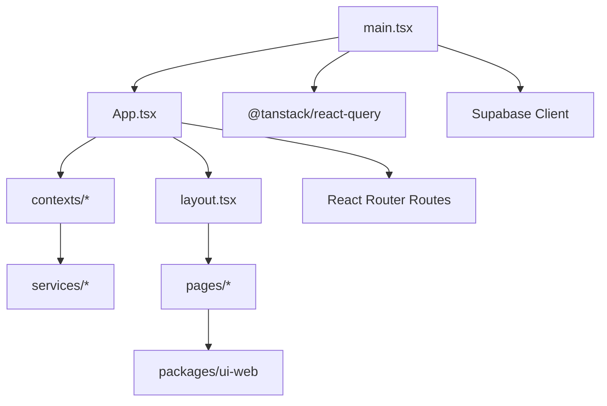
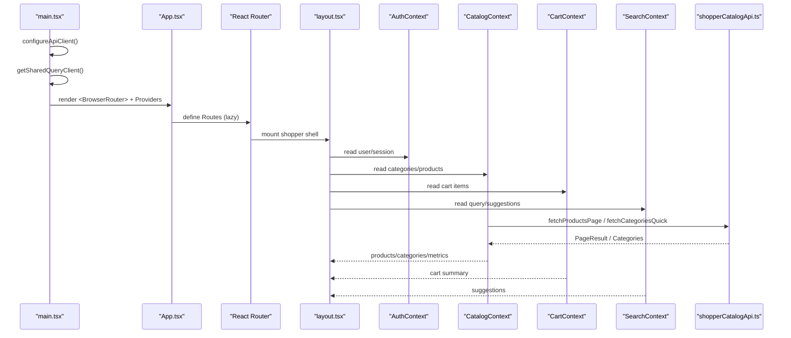
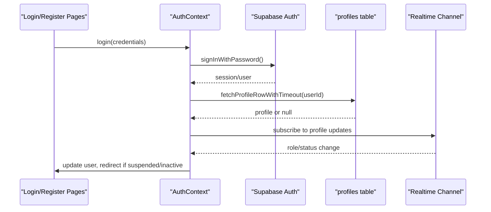
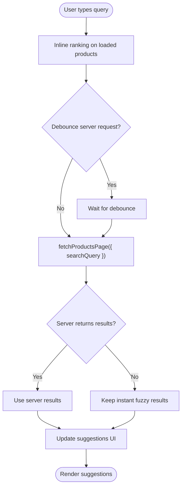
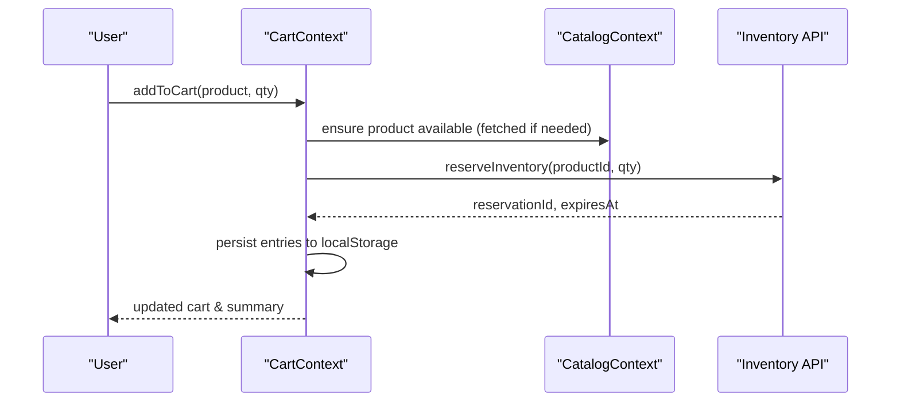
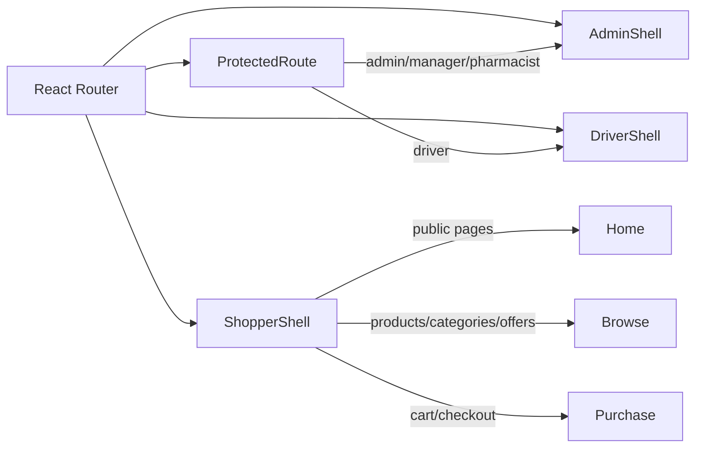
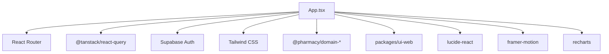

# Shopper Web Application

<cite>
**Referenced Files in This Document**
- [main.tsx](file://apps/shopper-web/src/main.tsx)
- [App.tsx](file://apps/shopper-web/src/app/App.tsx)
- [layout.tsx](file://apps/shopper-web/src/app/layout.tsx)
- [vite.config.ts](file://apps/shopper-web/vite.config.ts)
- [AuthContext.tsx](file://apps/shopper-web/src/contexts/AuthContext.tsx)
- [CartContext.tsx](file://apps/shopper-web/src/contexts/CartContext.tsx)
- [CatalogContext.tsx](file://apps/shopper-web/src/contexts/CatalogContext.tsx)
- [SearchContext.tsx](file://apps/shopper-web/src/contexts/SearchContext.tsx)
- [shopperCatalogApi.ts](file://apps/shopper-web/src/services/shopperCatalogApi.ts)
</cite>

## Table of Contents
1. Introduction
2. Project Structure
3. Core Components
4. Architecture Overview
5. Detailed Component Analysis
6. Dependency Analysis
7. Performance Considerations
8. Troubleshooting Guide
9. Conclusion

## Introduction
This document describes the Shopper Web Application built with React 18.x and Vite. It explains the feature-based component architecture, shared UI usage from packages/ui-web, state management via Zustand and React Query, routing with React Router, authentication with Supabase Auth, responsive design with Tailwind CSS, catalog browsing with advanced search, shopping cart and checkout flows, order tracking, prescription management features, performance optimizations (code splitting, lazy loading, caching), accessibility and internationalization support, and testing strategies across screen sizes and browsers.

## Project Structure
The application is organized around a clear separation of concerns:
- App shell and routing are defined in the app layer, with lazy-loaded routes for fast initial load.
- Feature contexts encapsulate domain state such as authentication, catalog, cart, and search.
- Services provide data access to backend APIs and Supabase.
- Shared UI components come from the ui-web package and are consumed throughout pages.
- Build-time configuration handles code splitting, chunking, and asset handling.

**Diagram sources**
- [main.tsx:1-60](file://apps/shopper-web/src/main.tsx#L1-L60)
- [App.tsx:1-196](file://apps/shopper-web/src/app/App.tsx#L1-L196)
- [layout.tsx:1-800](file://apps/shopper-web/src/app/layout.tsx#L1-L800)

**Section sources**
- [main.tsx:1-60](file://apps/shopper-web/src/main.tsx#L1-L60)
- [App.tsx:1-196](file://apps/shopper-web/src/app/App.tsx#L1-L196)
- [layout.tsx:1-800](file://apps/shopper-web/src/app/layout.tsx#L1-L800)

## Core Components
- Authentication: Centralized auth context manages sessions, roles, status, and live role/status updates via Supabase realtime.
- Catalog: Provides paginated products, categories, full-catalog snapshot, search/filter, and metrics; optimized for large catalogs.
- Cart: Local-first cart with persistence, inventory reservations, and pricing summary; integrates with catalog and auth.
- Search: Debounced input, URL sync, instant inline ranking on loaded products, and server-side suggestions via Supabase.
- Routing: React Router with lazy-loaded routes, protected routes, admin/driver shells, and a shopper shell with layout.
- Layout: Responsive header/footer, SEO metadata, scroll restoration, language direction, and mobile/desktop navigation.

**Section sources**
- [AuthContext.tsx:1-738](file://apps/shopper-web/src/contexts/AuthContext.tsx#L1-L738)
- [CatalogContext.tsx:1-505](file://apps/shopper-web/src/contexts/CatalogContext.tsx#L1-L505)
- [CartContext.tsx:1-560](file://apps/shopper-web/src/contexts/CartContext.tsx#L1-L560)
- [SearchContext.tsx:1-422](file://apps/shopper-web/src/contexts/SearchContext.tsx#L1-L422)
- [App.tsx:1-196](file://apps/shopper-web/src/app/App.tsx#L1-L196)
- [layout.tsx:1-800](file://apps/shopper-web/src/app/layout.tsx#L1-L800)

## Architecture Overview
High-level flow from bootstrap to rendered routes:
- Bootstrap initializes API client, QueryClient, providers (language, auth, favorites), and location services.
- App defines route tree with lazy-loaded pages and protected/admin/driver shells.
- Layout renders SEO, navigation, and responsive chrome.
- Contexts manage cross-cutting state and side effects.
- Services fetch data from Supabase and cache results efficiently.

**Diagram sources**
- [main.tsx:1-60](file://apps/shopper-web/src/main.tsx#L1-L60)
- [App.tsx:1-196](file://apps/shopper-web/src/app/App.tsx#L1-L196)
- [layout.tsx:1-800](file://apps/shopper-web/src/app/layout.tsx#L1-L800)
- [CatalogContext.tsx:1-505](file://apps/shopper-web/src/contexts/CatalogContext.tsx#L1-L505)
- [CartContext.tsx:1-560](file://apps/shopper-web/src/contexts/CartContext.tsx#L1-L560)
- [SearchContext.tsx:1-422](file://apps/shopper-web/src/contexts/SearchContext.tsx#L1-L422)
- [shopperCatalogApi.ts:1-200](file://apps/shopper-web/src/services/shopperCatalogApi.ts#L1-L200)

## Detailed Component Analysis

### Authentication Flow (Supabase Auth)
- Handles sign-in, sign-up, OAuth, session recovery, profile resolution, and role/status enforcement.
- Uses Supabase realtime to react to profile changes and force sign-out on suspension/inactivation.
- Includes timeouts and background retries to avoid blocking UI on slow backends.

**Diagram sources**
- [AuthContext.tsx:245-389](file://apps/shopper-web/src/contexts/AuthContext.tsx#L245-L389)
- [AuthContext.tsx:424-521](file://apps/shopper-web/src/contexts/AuthContext.tsx#L424-L521)
- [AuthContext.tsx:524-689](file://apps/shopper-web/src/contexts/AuthContext.tsx#L524-L689)

**Section sources**
- [AuthContext.tsx:1-738](file://apps/shopper-web/src/contexts/AuthContext.tsx#L1-L738)

### Catalog System and Advanced Search
- Fast first paint via page-1 fetch and cached snapshots.
- Server-side search and filtering with LRU page cache and localStorage category cache.
- Inline ranking for instant suggestions using fuzzy matching on loaded products; server fallback provides authoritative results.

**Diagram sources**
- [SearchContext.tsx:284-368](file://apps/shopper-web/src/contexts/SearchContext.tsx#L284-L368)
- [shopperCatalogApi.ts:70-158](file://apps/shopper-web/src/services/shopperCatalogApi.ts#L70-L158)

**Section sources**
- [CatalogContext.tsx:1-505](file://apps/shopper-web/src/contexts/CatalogContext.tsx#L1-L505)
- [SearchContext.tsx:1-422](file://apps/shopper-web/src/contexts/SearchContext.tsx#L1-L422)
- [shopperCatalogApi.ts:1-200](file://apps/shopper-web/src/services/shopperCatalogApi.ts#L1-L200)

### Shopping Cart and Checkout Integration
- Local-first cart persisted to localStorage; inflates entries with product data and validates stock.
- Inventory reservation system reserves items while browsing; releases on quantity changes or removal.
- Pricing summary computed locally; integrates with checkout flow via domain utilities.

**Diagram sources**
- [CartContext.tsx:210-258](file://apps/shopper-web/src/contexts/CartContext.tsx#L210-L258)
- [CartContext.tsx:273-340](file://apps/shopper-web/src/contexts/CartContext.tsx#L273-L340)
- [CartContext.tsx:414-456](file://apps/shopper-web/src/contexts/CartContext.tsx#L414-L456)

**Section sources**
- [CartContext.tsx:1-560](file://apps/shopper-web/src/contexts/CartContext.tsx#L1-L560)

### Routing and Protected Areas
- Lazy-loaded routes reduce initial bundle size.
- ProtectedRoute enforces roles; Admin/Dashboard/Driver shells isolate privileged areas.
- Shopper shell wraps public-facing pages with consistent layout and SEO.

**Diagram sources**
- [App.tsx:16-55](file://apps/shopper-web/src/app/App.tsx#L16-L55)
- [App.tsx:108-182](file://apps/shopper-web/src/app/App.tsx#L108-L182)

**Section sources**
- [App.tsx:1-196](file://apps/shopper-web/src/app/App.tsx#L1-L196)

### Order Tracking and Prescriptions Management
- Order tracking accessible via dedicated route under catalog shell.
- Prescription management exposed through admin routes with pharmacist/manager/admin guards.
- These features integrate with services and contexts for data fetching and state updates.

**Section sources**
- [App.tsx:120-151](file://apps/shopper-web/src/app/App.tsx#L120-L151)

## Dependency Analysis
Key dependencies and their roles:
- React Router: Route definitions and navigation.
- @tanstack/react-query: Data fetching and caching via QueryClientProvider.
- Supabase: Authentication, realtime subscriptions, and data access.
- Tailwind CSS: Utility-first styling with responsive patterns.
- Domain packages: contracts, api-client, domain-core, domain-search, domain-catalog, domain-cart, domain-checkout, domain-orders, domain-prescriptions, domain-account, domain-ops, domain-courier.
- UI libraries: lucide-react icons, framer-motion animations, recharts for charts.

**Diagram sources**
- [vite.config.ts:38-63](file://apps/shopper-web/vite.config.ts#L38-L63)
- [main.tsx:1-60](file://apps/shopper-web/src/main.tsx#L1-L60)

**Section sources**
- [vite.config.ts:1-204](file://apps/shopper-web/vite.config.ts#L1-L204)
- [main.tsx:1-60](file://apps/shopper-web/src/main.tsx#L1-L60)

## Performance Considerations
- Code splitting and manual chunks:
  - React core, router, motion, UI libs, icons, charts, forms, data layer, state management, PDF/Excel/QR/maps grouped into separate chunks.
  - ChunkSizeWarningLimit set to warn at 600 KB; target initial shell ≤ 250 KB gzipped.
- Lazy loading:
  - All routes wrapped with Suspense and lazy imports to minimize initial payload.
- Caching strategies:
  - In-memory LRU page cache for catalog pages with TTLs based on filters.
  - localStorage category cache with 30-minute TTL.
  - Cart persistence to localStorage with validation and inflation.
- First paint optimization:
  - Page-1 fetch for fast initial content; emergency timers prevent indefinite loading.
- Asset handling:
  - Public directory configured for static assets; raw SVG/CSV supported.

**Section sources**
- [vite.config.ts:81-199](file://apps/shopper-web/vite.config.ts#L81-L199)
- [shopperCatalogApi.ts:70-158](file://apps/shopper-web/src/services/shopperCatalogApi.ts#L70-L158)
- [CartContext.tsx:70-104](file://apps/shopper-web/src/contexts/CartContext.tsx#L70-L104)
- [CatalogContext.tsx:176-222](file://apps/shopper-web/src/contexts/CatalogContext.tsx#L176-L222)

## Troubleshooting Guide
Common issues and resolutions:
- Auth loading hangs:
  - Emergency timeout ensures loading clears within 12 seconds; profile fetch uses 5-second timeout with background retry.
- Catalog load stalls:
  - Emergency timer prevents indefinite loading; page-1 fetch ensures quick UI availability.
- Search results disappear:
  - Server empty responses do not overwrite instant fuzzy results; abort controller cancels stale requests.
- Cart loses items on reload:
  - Guard prevents wiping stored entries before product data loads; inflation validates stock and reservations.
- Role/status staleness:
  - Realtime subscription reacts to profile updates; forced sign-out on suspension/inactivation.

**Section sources**
- [AuthContext.tsx:313-389](file://apps/shopper-web/src/contexts/AuthContext.tsx#L313-L389)
- [CatalogContext.tsx:176-222](file://apps/shopper-web/src/contexts/CatalogContext.tsx#L176-L222)
- [SearchContext.tsx:305-368](file://apps/shopper-web/src/contexts/SearchContext.tsx#L305-L368)
- [CartContext.tsx:364-388](file://apps/shopper-web/src/contexts/CartContext.tsx#L364-L388)

## Conclusion
The Shopper Web Application combines a robust, scalable architecture with performance-focused engineering practices. Feature-based organization, shared UI components, and well-defined contexts enable maintainable growth. Advanced search, resilient catalog loading, and persistent cart operations deliver a smooth user experience. Security and accessibility are addressed through role-based routing, internationalization, and semantic markup. The build pipeline optimizes delivery through code splitting and caching strategies, ensuring fast and reliable performance across devices and networks.