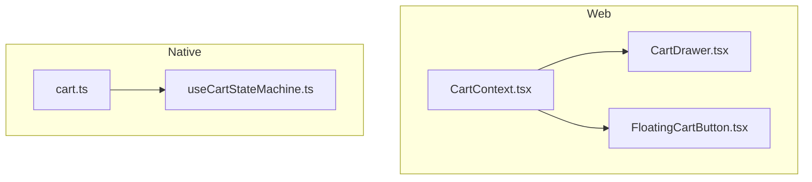
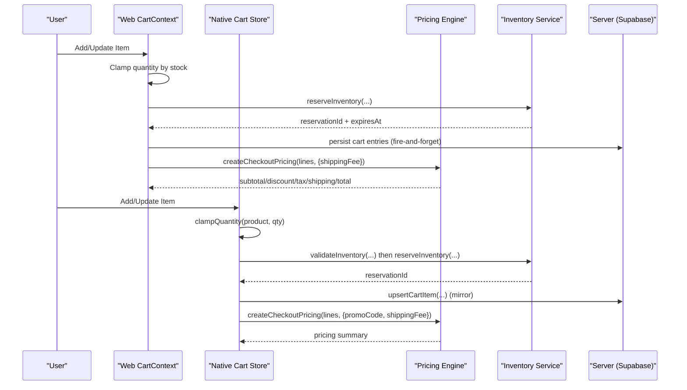
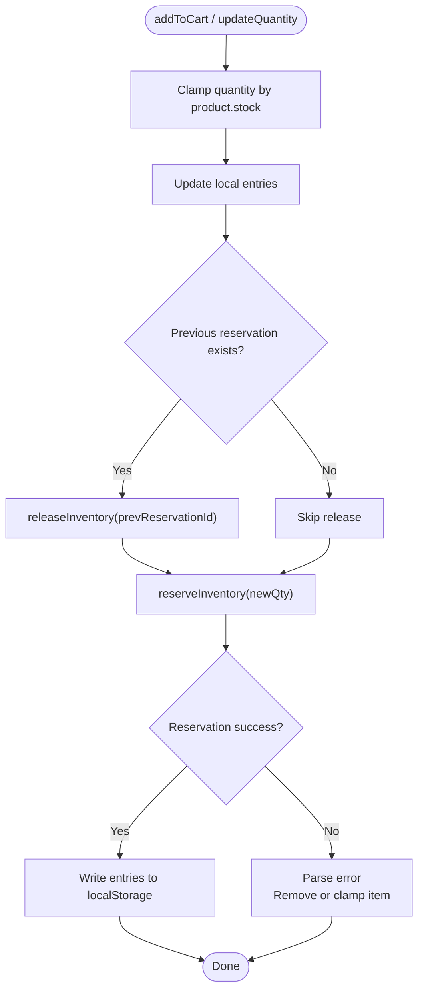
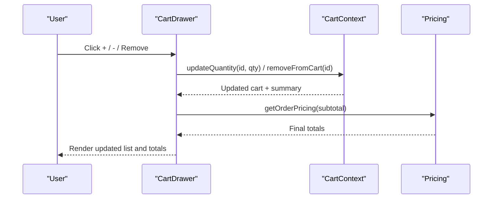
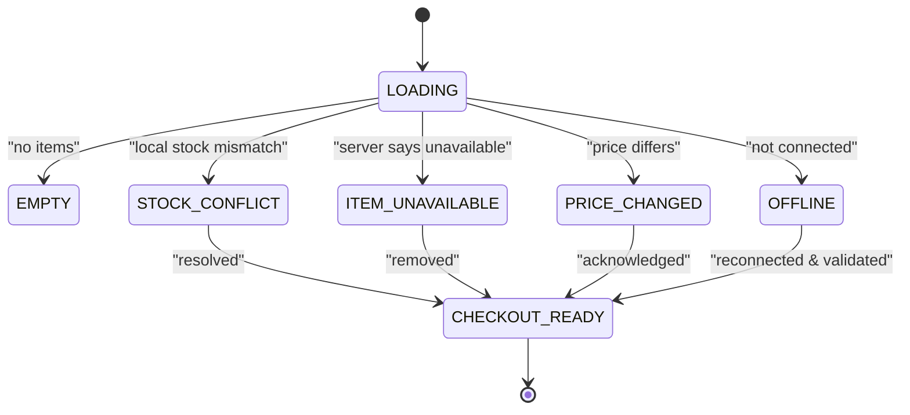
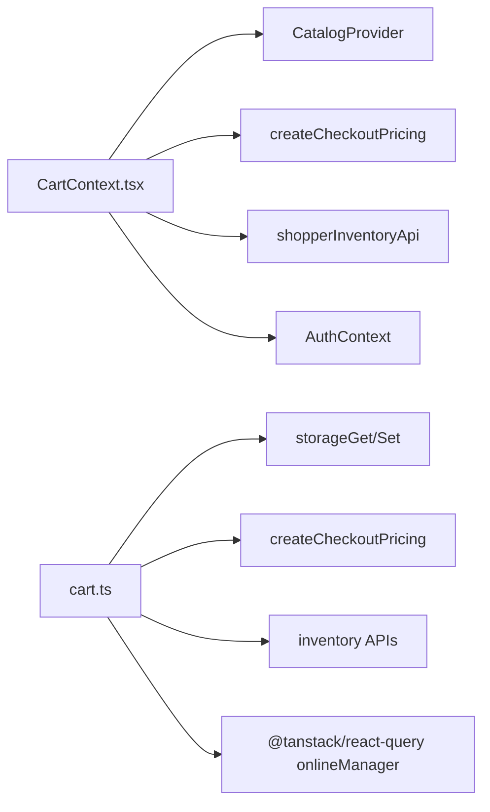

# Shopping Cart Management

<cite>
**Referenced Files in This Document**
- [cart.ts](file://apps/shopper-native/src/stores/cart.ts)
- [useCartStateMachine.ts](file://apps/shopper-native/src/features/cart/hooks/useCartStateMachine.ts)
- [CartContext.tsx](file://apps/shopper-web/src/contexts/CartContext.tsx)
- [CartDrawer.tsx](file://apps/shopper-web/src/app/components/CartDrawer.tsx)
- [FloatingCartButton.tsx](file://apps/shopper-web/src/app/components/FloatingCartButton.tsx)
- [index.ts](file://packages/domain-cart/src/index.ts)
</cite>

## Table of Contents
1. Introduction
2. Project Structure
3. Core Components
4. Architecture Overview
5. Detailed Component Analysis
6. Dependency Analysis
7. Performance Considerations
8. Troubleshooting Guide
9. Conclusion

## Introduction
This document explains the shopping cart management system across the shopper web and native applications. It covers state management via a cart context/store, adding/removing items, quantity updates with stock clamping, persistent storage, real-time UI updates, inventory reservations, pricing integration, coupon eligibility, shipping cost handling, server synchronization, and conflict resolution for concurrent modifications.

## Project Structure
The cart system is implemented on both platforms:
- Web (React): Context-based store with local persistence and server-side inventory reservations.
- Native (React Native): Zustand store with optimistic local mirror, server sync, and inventory reservation lifecycle.



**Diagram sources**
- [CartContext.tsx:197-559](file://apps/shopper-web/src/contexts/CartContext.tsx#L197-L559)
- [CartDrawer.tsx:11-223](file://apps/shopper-web/src/app/components/CartDrawer.tsx#L11-L223)
- [FloatingCartButton.tsx:1-200](file://apps/shopper-web/src/app/components/FloatingCartButton.tsx#L1-L200)
- [cart.ts:157-671](file://apps/shopper-native/src/stores/cart.ts#L157-L671)
- [useCartStateMachine.ts:27-138](file://apps/shopper-native/src/features/cart/hooks/useCartStateMachine.ts#L27-L138)

**Section sources**
- [CartContext.tsx:197-559](file://apps/shopper-web/src/contexts/CartContext.tsx#L197-L559)
- [cart.ts:157-671](file://apps/shopper-native/src/stores/cart.ts#L157-L671)

## Core Components
- Web Cart Context: Manages cart entries, product inflation from catalog, local persistence, inventory reservations, and summary computation.
- Native Cart Store: Zustand-based store with optimistic updates, server mirroring, inventory reservation lifecycle, and checkout readiness checks.
- Cart Drawer (Web): Real-time UI to review items, update quantities, remove items, and proceed to checkout.
- Floating Cart Button (Web): Quick access to the drawer and item count badge.
- Domain Types: Shared mutation types for cart operations.

Key responsibilities:
- Add/remove items with stock validation and clamping.
- Persist cart locally; hydrate from server when authenticated.
- Reserve inventory per line item; release on removal or quantity change.
- Compute pricing and totals using a centralized pricing function.
- Surface conflicts (stock, price, unavailable) and guide resolution.

**Section sources**
- [CartContext.tsx:131-195](file://apps/shopper-web/src/contexts/CartContext.tsx#L131-L195)
- [CartContext.tsx:273-340](file://apps/shopper-web/src/contexts/CartContext.tsx#L273-L340)
- [cart.ts:111-127](file://apps/shopper-native/src/stores/cart.ts#L111-L127)
- [cart.ts:198-367](file://apps/shopper-native/src/stores/cart.ts#L198-L367)
- [CartDrawer.tsx:101-175](file://apps/shopper-web/src/app/components/CartDrawer.tsx#L101-L175)
- [index.ts:1-2](file://packages/domain-cart/src/index.ts#L1-L2)

## Architecture Overview
The system combines client-side state with server-side inventory reservations and centralized pricing.



**Diagram sources**
- [CartContext.tsx:273-340](file://apps/shopper-web/src/contexts/CartContext.tsx#L273-L340)
- [CartContext.tsx:390-412](file://apps/shopper-web/src/contexts/CartContext.tsx#L390-L412)
- [cart.ts:198-367](file://apps/shopper-native/src/stores/cart.ts#L198-L367)
- [cart.ts:664-671](file://apps/shopper-native/src/stores/cart.ts#L664-L671)

## Detailed Component Analysis

### Web Cart Context (State, Persistence, Reservations, Pricing)
- Local persistence: Reads/writes a JSON array keyed by product id with quantity and optional reservation metadata. Normalizes and merges duplicate entries.
- Product inflation: Enriches stored entries with live product data from the catalog; filters out unavailable or zero-stock items; clamps quantities to available stock.
- Inventory reservations: On add/update, reserves inventory for each line; releases previous reservation on quantity changes or removal; handles expiration and errors gracefully.
- Pricing: Computes summary via a shared pricing function that aggregates lines into subtotal, discount, tax, shipping, and total.
- Sync: Emits workflow events for cart mutations; persists entries to localStorage; re-reserves on online/auth transitions.



**Diagram sources**
- [CartContext.tsx:131-195](file://apps/shopper-web/src/contexts/CartContext.tsx#L131-L195)
- [CartContext.tsx:273-340](file://apps/shopper-web/src/contexts/CartContext.tsx#L273-L340)
- [CartContext.tsx:414-510](file://apps/shopper-web/src/contexts/CartContext.tsx#L414-L510)

**Section sources**
- [CartContext.tsx:70-129](file://apps/shopper-web/src/contexts/CartContext.tsx#L70-L129)
- [CartContext.tsx:165-195](file://apps/shopper-web/src/contexts/CartContext.tsx#L165-L195)
- [CartContext.tsx:273-340](file://apps/shopper-web/src/contexts/CartContext.tsx#L273-L340)
- [CartContext.tsx:390-412](file://apps/shopper-web/src/contexts/CartContext.tsx#L390-L412)
- [CartContext.tsx:414-510](file://apps/shopper-web/src/contexts/CartContext.tsx#L414-L510)

### Native Cart Store (Zustand, Optimistic Updates, Server Mirror, Inventory Lifecycle)
- State shape: Items with productId, quantity, product snapshot, and optional reservationId; promo code and shipping fee fields; hydration flag and userId.
- Hydration: Loads anonymous cart from local storage; merges with server cart for authenticated users; falls back to local cache on failure.
- Mutations: addItem, removeItem, updateQty, clearCart; all mutate local state immediately and mirror to server asynchronously.
- Inventory: Pre-validates availability before reserving; releases old reservations on quantity changes; stores reservationId per line; exposes ensureReservations and commitReservations for checkout flow.
- Pricing: Converts items to checkout lines and delegates to a central pricing engine; provides selectors for itemCount, subtotal, and pricing.

```mermaid
classDiagram
class CartState {
+items : CartItem[]
+promoCode : string
+shippingFee : number
+isHydrated : boolean
+userId : string | null
+lastReservationError : ReservationError | null
+hydrate(userId) Promise<void>
+addItem(product, qty) void
+removeItem(productId) void
+updateQty(productId, qty) void
+clearCart() void
+ensureReservations() Promise<ReservationError[]>
+commitReservations(orderId) Promise<{committed, failed}>
+itemCount() number
+subtotal() number
+pricing() CheckoutPricing
+toCheckoutLines() CheckoutLineInput[]
}
class CartItem {
+productId : string
+quantity : number
+product : NativeProduct
+reservationId? : string
}
class ReservationError {
+productId : string
+message : string
+ts : number
}
CartState --> CartItem : "manages"
CartState --> ReservationError : "surfaces"
```

**Diagram sources**
- [cart.ts:51-105](file://apps/shopper-native/src/stores/cart.ts#L51-L105)
- [cart.ts:157-671](file://apps/shopper-native/src/stores/cart.ts#L157-L671)

**Section sources**
- [cart.ts:157-196](file://apps/shopper-native/src/stores/cart.ts#L157-L196)
- [cart.ts:198-367](file://apps/shopper-native/src/stores/cart.ts#L198-L367)
- [cart.ts:369-549](file://apps/shopper-native/src/stores/cart.ts#L369-L549)
- [cart.ts:563-656](file://apps/shopper-native/src/stores/cart.ts#L563-L656)
- [cart.ts:658-689](file://apps/shopper-native/src/stores/cart.ts#L658-L689)

### Cart Drawer (Real-time Updates, Validation, Stock Checks)
- Displays current cart items with images, names, prices, and per-item quantity controls.
- Removes items and updates quantities; these actions trigger context/store mutations which update the drawer reactively.
- Shows delivery guidance and computed totals; links to full cart and checkout pages.



**Diagram sources**
- [CartDrawer.tsx:101-175](file://apps/shopper-web/src/app/components/CartDrawer.tsx#L101-L175)
- [CartDrawer.tsx:178-218](file://apps/shopper-web/src/app/components/CartDrawer.tsx#L178-L218)

**Section sources**
- [CartDrawer.tsx:11-223](file://apps/shopper-web/src/app/components/CartDrawer.tsx#L11-L223)

### Floating Cart Button (Badge and Quick Access)
- Provides quick access to the cart drawer and shows an item count badge derived from the cart summary.
- Integrates with the cart context to reflect real-time counts without page reloads.

**Section sources**
- [FloatingCartButton.tsx:1-200](file://apps/shopper-web/src/app/components/FloatingCartButton.tsx#L1-L200)

### Conflict Resolution and Checkout Readiness (Native)
- Validates items against network data to detect stock, price, and availability conflicts.
- Guides user to resolve conflicts by removing unavailable items or adjusting quantities to server stock.
- Tracks status states such as STOCK_CONFLICT, PRICE_CHANGED, ITEM_UNAVAILABLE, CHECKOUT_READY, OFFLINE, ERROR.



**Diagram sources**
- [useCartStateMachine.ts:6-17](file://apps/shopper-native/src/features/cart/hooks/useCartStateMachine.ts#L6-L17)
- [useCartStateMachine.ts:40-117](file://apps/shopper-native/src/features/cart/hooks/useCartStateMachine.ts#L40-L117)
- [useCartStateMachine.ts:119-133](file://apps/shopper-native/src/features/cart/hooks/useCartStateMachine.ts#L119-L133)

**Section sources**
- [useCartStateMachine.ts:27-138](file://apps/shopper-native/src/features/cart/hooks/useCartStateMachine.ts#L27-L138)

## Dependency Analysis
- Web CartContext depends on:
  - Catalog provider for product data and images.
  - Pricing engine for summary calculations.
  - Inventory service for reservations and releases.
  - Auth context to gate server-side operations.
- Native Cart Store depends on:
  - Storage utilities for local persistence.
  - Analytics and crash reporting.
  - React Query online manager for offline-aware behavior.
  - Inventory services for validation, reservation, and commitment.
  - Pricing engine for checkout lines and totals.



**Diagram sources**
- [CartContext.tsx:1-13](file://apps/shopper-web/src/contexts/CartContext.tsx#L1-L13)
- [CartContext.tsx:197-265](file://apps/shopper-web/src/contexts/CartContext.tsx#L197-L265)
- [cart.ts:24-49](file://apps/shopper-native/src/stores/cart.ts#L24-L49)
- [cart.ts:664-671](file://apps/shopper-native/src/stores/cart.ts#L664-L671)

**Section sources**
- [CartContext.tsx:1-13](file://apps/shopper-web/src/contexts/CartContext.tsx#L1-L13)
- [cart.ts:24-49](file://apps/shopper-native/src/stores/cart.ts#L24-L49)

## Performance Considerations
- Optimistic updates: Both implementations update local state immediately and mirror to the server asynchronously to keep UI responsive.
- Stock clamping: Prevents invalid quantities and reduces unnecessary network calls by validating against local stock before reserving.
- Batched validations: Native hook defers deep network validation until necessary to avoid spamming on rapid quantity taps.
- Idempotency: Reservation and release calls use unique idempotency keys to safely handle retries and transient failures.
- Selectors and memoization: Web uses useMemo for summaries; Native exposes selectors to minimize recomputation.

[No sources needed since this section provides general guidance]

## Troubleshooting Guide
Common issues and resolutions:
- Out-of-stock during add/update:
  - System clamps quantity or removes the item; surfaces a reservation error for UI feedback.
  - Check last reservation error state and adjust quantity accordingly.
- Concurrent stock changes:
  - Ensure reservations are refreshed at checkout; ensureReservations will re-reserve missing lines.
  - If conflicts arise, reduce quantities to available stock or remove unavailable items.
- Offline mode:
  - Native: Defers reservations until online; ensures reservations at checkout time.
  - Web: Re-reserves entries when connectivity returns and user is authenticated.
- Pricing discrepancies:
  - Prices are fetched from the catalog; if changed, acknowledge or refresh product data to align with server prices.

**Section sources**
- [cart.ts:136-155](file://apps/shopper-native/src/stores/cart.ts#L136-L155)
- [cart.ts:258-367](file://apps/shopper-native/src/stores/cart.ts#L258-L367)
- [cart.ts:449-549](file://apps/shopper-native/src/stores/cart.ts#L449-L549)
- [cart.ts:563-619](file://apps/shopper-native/src/stores/cart.ts#L563-L619)
- [CartContext.tsx:304-340](file://apps/shopper-web/src/contexts/CartContext.tsx#L304-L340)

## Conclusion
The shopping cart system provides robust state management, persistent storage, and reliable inventory reservations across web and native platforms. It integrates tightly with the product catalog for dynamic pricing, supports coupons and shipping calculations through a centralized pricing engine, and offers clear conflict resolution strategies for concurrent modifications. The cart drawer and floating button deliver a smooth, real-time user experience with actionable insights and quick access to checkout.

[No sources needed since this section summarizes without analyzing specific files]