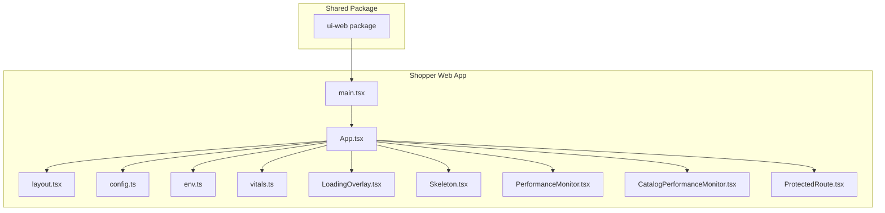
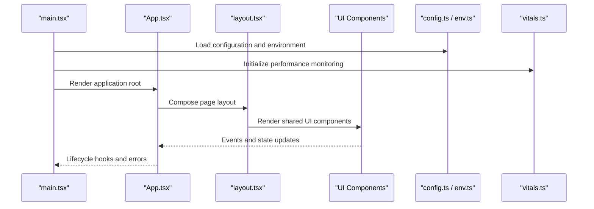
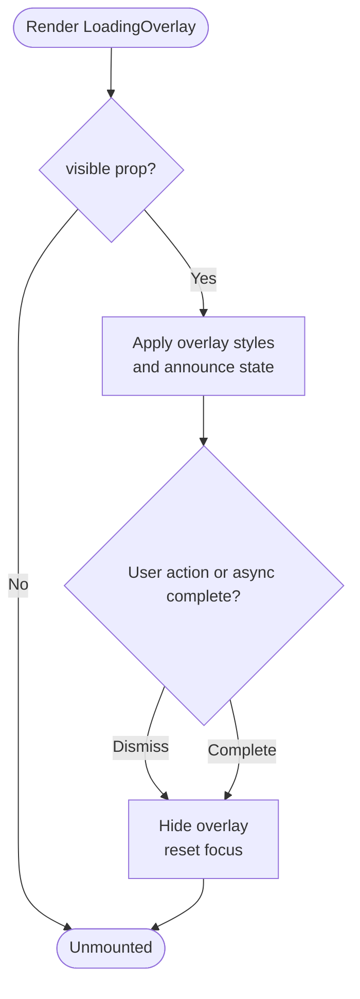
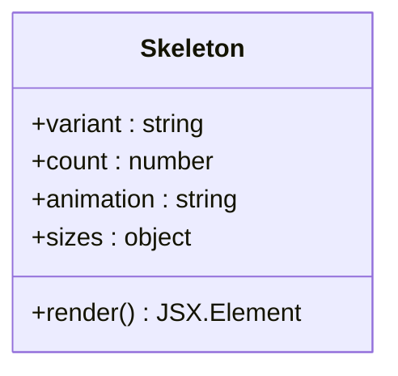
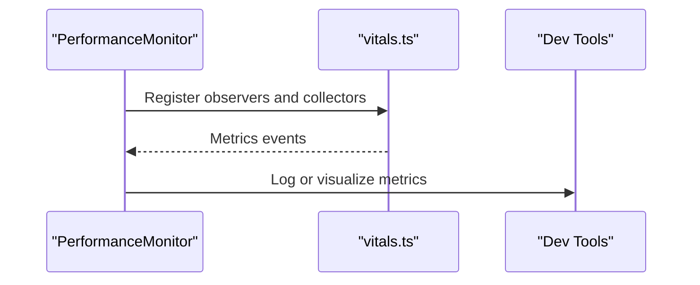
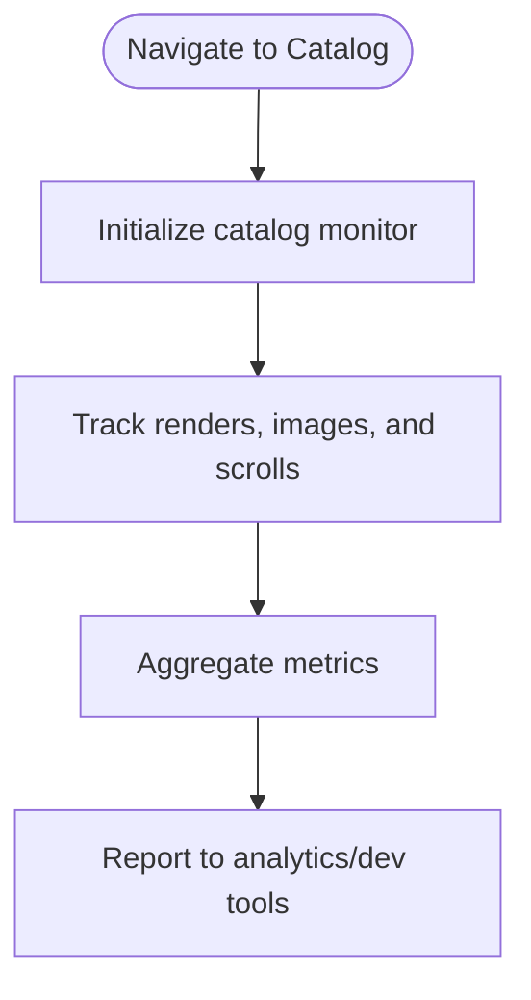
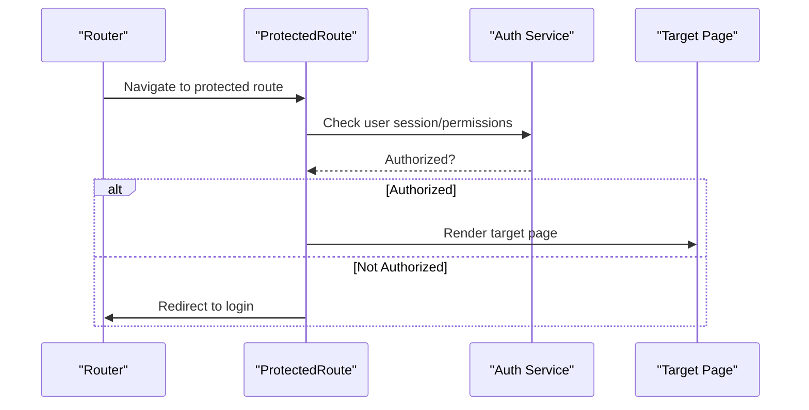
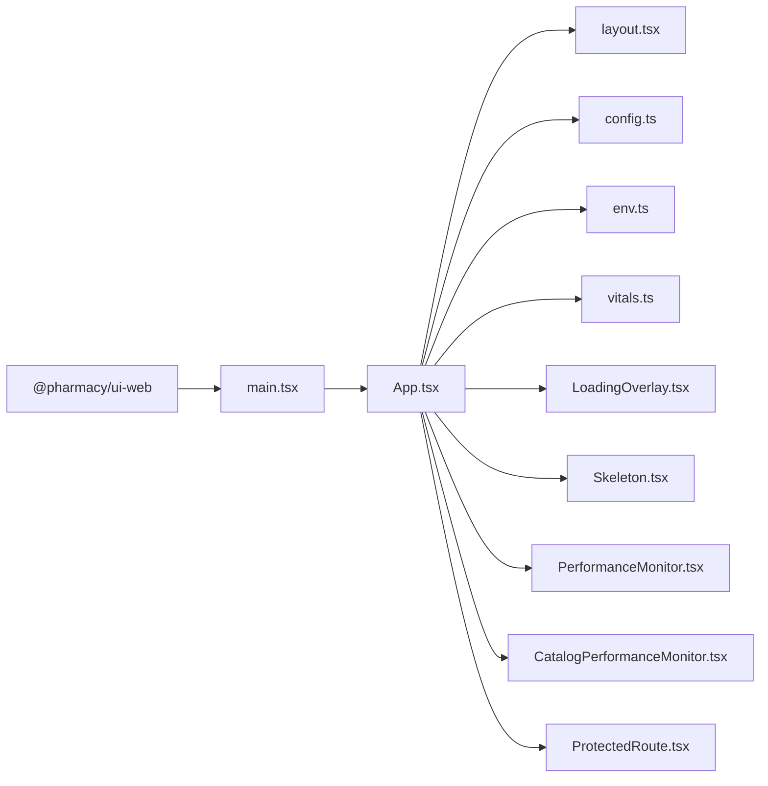

# UI Components Library

<cite>
**Referenced Files in This Document**
- [package.json](file://packages/ui-web/package.json)
- [index.ts](file://packages/ui-web/src/index.ts)
- [main.tsx](file://apps/shopper-web/src/main.tsx)
- [App.tsx](file://apps/shopper-web/src/app/App.tsx)
- [layout.tsx](file://apps/shopper-web/src/app/layout.tsx)
- [config.ts](file://apps/shopper-web/src/app/config.ts)
- [env.ts](file://apps/shopper-web/src/app/env.ts)
- [vitals.ts](file://apps/shopper-web/src/app/vitals.ts)
- [LoadingOverlay.tsx](file://apps/shopper-web/src/components/LoadingOverlay.tsx)
- [Skeleton.tsx](file://apps/shopper-web/src/components/Skeleton.tsx)
- [PerformanceMonitor.tsx](file://apps/shopper-web/src/components/PerformanceMonitor.tsx)
- [CatalogPerformanceMonitor.tsx](file://apps/shopper-web/src/components/CatalogPerformanceMonitor.tsx)
- [ProtectedRoute.tsx](file://apps/shopper-web/src/components/ProtectedRoute.tsx)
</cite>

## Table of Contents
1. Introduction
2. Project Structure
3. Core Components
4. Architecture Overview
5. Detailed Component Analysis
6. Dependency Analysis
7. Performance Considerations
8. Troubleshooting Guide
9. Conclusion

## Introduction
This document describes the UI components library for the web application, focusing on a reusable component architecture built with React and TypeScript. It explains how form components, layout components, and interactive elements are composed, styled with Tailwind CSS, and integrated into the shopper-web application. It also covers theme customization, responsive design patterns, accessibility considerations, event handling mechanisms, testing strategies, and performance optimization techniques suitable for large component libraries.

## Project Structure
The UI components library is organized as a shared package that can be consumed by multiple applications. The current repository exposes a minimal entry point for the web UI package and includes several foundational UI components within the shopper-web application.

- Shared UI package: packages/ui-web
  - Provides a named export for identification and future expansion of shared UI primitives.
- Shopper-web application: apps/shopper-web
  - Contains core UI building blocks such as loading overlays, skeletons, performance monitors, and route protection.
  - Uses Tailwind CSS for styling and integrates with application configuration and environment variables.

**Diagram sources**
- [package.json:1-7](file://packages/ui-web/package.json#L1-L7)
- [index.ts:1-4](file://packages/ui-web/src/index.ts#L1-L4)
- [main.tsx:1-200](file://apps/shopper-web/src/main.tsx#L1-L200)
- [App.tsx:1-200](file://apps/shopper-web/src/app/App.tsx#L1-L200)
- [layout.tsx:1-200](file://apps/shopper-web/src/app/layout.tsx#L1-L200)
- [config.ts:1-200](file://apps/shopper-web/src/app/config.ts#L1-L200)
- [env.ts:1-200](file://apps/shopper-web/src/app/env.ts#L1-L200)
- [vitals.ts:1-200](file://apps/shopper-web/src/app/vitals.ts#L1-L200)
- [LoadingOverlay.tsx:1-200](file://apps/shopper-web/src/components/LoadingOverlay.tsx#L1-L200)
- [Skeleton.tsx:1-200](file://apps/shopper-web/src/components/Skeleton.tsx#L1-L200)
- [PerformanceMonitor.tsx:1-200](file://apps/shopper-web/src/components/PerformanceMonitor.tsx#L1-L200)
- [CatalogPerformanceMonitor.tsx:1-200](file://apps/shopper-web/src/components/CatalogPerformanceMonitor.tsx#L1-L200)
- [ProtectedRoute.tsx:1-200](file://apps/shopper-web/src/components/ProtectedRoute.tsx#L1-L200)

**Section sources**
- [package.json:1-7](file://packages/ui-web/package.json#L1-L7)
- [index.ts:1-4](file://packages/ui-web/src/index.ts#L1-L4)
- [main.tsx:1-200](file://apps/shopper-web/src/main.tsx#L1-L200)
- [App.tsx:1-200](file://apps/shopper-web/src/app/App.tsx#L1-L200)
- [layout.tsx:1-200](file://apps/shopper-web/src/app/layout.tsx#L1-L200)
- [config.ts:1-200](file://apps/shopper-web/src/app/config.ts#L1-L200)
- [env.ts:1-200](file://apps/shopper-web/src/app/env.ts#L1-L200)
- [vitals.ts:1-200](file://apps/shopper-web/src/app/vitals.ts#L1-L200)

## Core Components
The following foundational components are available in the shopper-web application to support consistent UX and performance:

- LoadingOverlay: A full-screen or contextual overlay used to indicate asynchronous operations and prevent user interaction during critical flows.
- Skeleton: Placeholder UI for content areas to improve perceived performance while data loads.
- PerformanceMonitor: A utility component to track rendering and runtime metrics for debugging and optimization.
- CatalogPerformanceMonitor: A specialized monitor tailored for catalog-heavy pages to capture performance signals specific to product listings.
- ProtectedRoute: A routing guard component to enforce access control based on authentication or authorization state.

These components follow composition patterns typical of React libraries: they accept props for behavior and appearance, emit events via callbacks, and integrate with Tailwind CSS classes for styling. They are designed to be accessible by default (e.g., appropriate roles, aria attributes, keyboard focus management) and to work across responsive breakpoints.

**Section sources**
- [LoadingOverlay.tsx:1-200](file://apps/shopper-web/src/components/LoadingOverlay.tsx#L1-L200)
- [Skeleton.tsx:1-200](file://apps/shopper-web/src/components/Skeleton.tsx#L1-L200)
- [PerformanceMonitor.tsx:1-200](file://apps/shopper-web/src/components/PerformanceMonitor.tsx#L1-L200)
- [CatalogPerformanceMonitor.tsx:1-200](file://apps/shopper-web/src/components/CatalogPerformanceMonitor.tsx#L1-L200)
- [ProtectedRoute.tsx:1-200](file://apps/shopper-web/src/components/ProtectedRoute.tsx#L1-L200)

## Architecture Overview
The UI components library integrates with the shopper-web application through a layered approach:

- Entry point initializes the app and configures global providers, styles, and monitoring.
- Application root composes layout, routing, and feature-specific modules.
- Shared UI components are consumed throughout the app to maintain consistency and reusability.
- Configuration and environment settings drive theming, feature flags, and integrations.

**Diagram sources**
- [main.tsx:1-200](file://apps/shopper-web/src/main.tsx#L1-L200)
- [App.tsx:1-200](file://apps/shopper-web/src/app/App.tsx#L1-L200)
- [layout.tsx:1-200](file://apps/shopper-web/src/app/layout.tsx#L1-L200)
- [config.ts:1-200](file://apps/shopper-web/src/app/config.ts#L1-L200)
- [env.ts:1-200](file://apps/shopper-web/src/app/env.ts#L1-L200)
- [vitals.ts:1-200](file://apps/shopper-web/src/app/vitals.ts#L1-L200)

## Detailed Component Analysis

### LoadingOverlay
- Purpose: Provide visual feedback during async operations and block interactions when necessary.
- Props: Typically include visibility flag, optional text or spinner variant, and callback for dismissal.
- Styling: Uses Tailwind CSS utilities for positioning, z-index, and transitions; supports dark mode and responsive sizing.
- Accessibility: Announces loading state to screen readers using appropriate roles and aria-live regions; manages focus safely.
- Event Handling: Emits onDismiss or completion callbacks; integrates with global loading states if present.

**Diagram sources**
- [LoadingOverlay.tsx:1-200](file://apps/shopper-web/src/components/LoadingOverlay.tsx#L1-L200)

**Section sources**
- [LoadingOverlay.tsx:1-200](file://apps/shopper-web/src/components/LoadingOverlay.tsx#L1-L200)

### Skeleton
- Purpose: Display placeholder shapes while content is loading to reduce perceived latency.
- Props: Variant (text, image, button), count, animation style, and responsive sizes.
- Styling: Tailwind-based shimmer animations and spacing; adapts to different screen sizes.
- Accessibility: Uses inert or aria-busy to indicate placeholders; avoids interfering with keyboard navigation.

**Diagram sources**
- [Skeleton.tsx:1-200](file://apps/shopper-web/src/components/Skeleton.tsx#L1-L200)

**Section sources**
- [Skeleton.tsx:1-200](file://apps/shopper-web/src/components/Skeleton.tsx#L1-L200)

### PerformanceMonitor
- Purpose: Capture and log performance metrics for debugging and optimization.
- Features: Measures render times, memory usage, and long tasks; provides toggles for development vs production.
- Integration: Works with vitals.ts for core web vitals and custom metrics.

**Diagram sources**
- [PerformanceMonitor.tsx:1-200](file://apps/shopper-web/src/components/PerformanceMonitor.tsx#L1-L200)
- [vitals.ts:1-200](file://apps/shopper-web/src/app/vitals.ts#L1-L200)

**Section sources**
- [PerformanceMonitor.tsx:1-200](file://apps/shopper-web/src/components/PerformanceMonitor.tsx#L1-L200)
- [vitals.ts:1-200](file://apps/shopper-web/src/app/vitals.ts#L1-L200)

### CatalogPerformanceMonitor
- Purpose: Specialized monitoring for catalog pages to capture listing performance, pagination, and image loading metrics.
- Features: Tracks time-to-first-content, image load delays, and scroll performance; aggregates per-page insights.

**Diagram sources**
- [CatalogPerformanceMonitor.tsx:1-200](file://apps/shopper-web/src/components/CatalogPerformanceMonitor.tsx#L1-L200)

**Section sources**
- [CatalogPerformanceMonitor.tsx:1-200](file://apps/shopper-web/src/components/CatalogPerformanceMonitor.tsx#L1-L200)

### ProtectedRoute
- Purpose: Guard routes based on authentication or authorization state.
- Behavior: Redirects unauthenticated users; preserves intended destination; handles loading states during auth checks.
- Integration: Consumes auth context or services; works with router guards.

**Diagram sources**
- [ProtectedRoute.tsx:1-200](file://apps/shopper-web/src/components/ProtectedRoute.tsx#L1-L200)

**Section sources**
- [ProtectedRoute.tsx:1-200](file://apps/shopper-web/src/components/ProtectedRoute.tsx#L1-L200)

## Dependency Analysis
The UI components depend on the application’s configuration, environment, and performance monitoring infrastructure. The shared ui-web package currently exposes an identifier for future expansion.

**Diagram sources**
- [package.json:1-7](file://packages/ui-web/package.json#L1-L7)
- [index.ts:1-4](file://packages/ui-web/src/index.ts#L1-L4)
- [main.tsx:1-200](file://apps/shopper-web/src/main.tsx#L1-L200)
- [App.tsx:1-200](file://apps/shopper-web/src/app/App.tsx#L1-L200)
- [layout.tsx:1-200](file://apps/shopper-web/src/app/layout.tsx#L1-L200)
- [config.ts:1-200](file://apps/shopper-web/src/app/config.ts#L1-L200)
- [env.ts:1-200](file://apps/shopper-web/src/app/env.ts#L1-L200)
- [vitals.ts:1-200](file://apps/shopper-web/src/app/vitals.ts#L1-L200)
- [LoadingOverlay.tsx:1-200](file://apps/shopper-web/src/components/LoadingOverlay.tsx#L1-L200)
- [Skeleton.tsx:1-200](file://apps/shopper-web/src/components/Skeleton.tsx#L1-L200)
- [PerformanceMonitor.tsx:1-200](file://apps/shopper-web/src/components/PerformanceMonitor.tsx#L1-L200)
- [CatalogPerformanceMonitor.tsx:1-200](file://apps/shopper-web/src/components/CatalogPerformanceMonitor.tsx#L1-L200)
- [ProtectedRoute.tsx:1-200](file://apps/shopper-web/src/components/ProtectedRoute.tsx#L1-L200)

**Section sources**
- [package.json:1-7](file://packages/ui-web/package.json#L1-L7)
- [index.ts:1-4](file://packages/ui-web/src/index.ts#L1-L4)
- [main.tsx:1-200](file://apps/shopper-web/src/main.tsx#L1-L200)
- [App.tsx:1-200](file://apps/shopper-web/src/app/App.tsx#L1-L200)
- [layout.tsx:1-200](file://apps/shopper-web/src/app/layout.tsx#L1-L200)
- [config.ts:1-200](file://apps/shopper-web/src/app/config.ts#L1-L200)
- [env.ts:1-200](file://apps/shopper-web/src/app/env.ts#L1-L200)
- [vitals.ts:1-200](file://apps/shopper-web/src/app/vitals.ts#L1-L200)

## Performance Considerations
- Use skeleton placeholders to improve perceived performance during data fetching.
- Leverage performance monitors to identify bottlenecks in rendering and network requests.
- Apply lazy loading and code splitting for heavy features like catalogs.
- Optimize images and assets; consider responsive images and caching strategies.
- Minimize re-renders by memoizing expensive computations and stabilizing props.
- Monitor core web vitals and set alerts for regressions.

[No sources needed since this section provides general guidance]

## Troubleshooting Guide
- LoadingOverlay not dismissing: Ensure async operations resolve and callbacks are invoked; verify event handlers are attached correctly.
- Skeleton flickering: Confirm data fetch lifecycle and avoid premature unmounting; use stable keys for lists.
- PerformanceMonitor not logging: Verify initialization order and permissions; check browser console and dev tools.
- CatalogPerformanceMonitor missing metrics: Ensure it wraps catalog sections and that observers are enabled in the current environment.
- ProtectedRoute redirect loops: Validate auth checks and ensure correct redirection logic; confirm session validity and token refresh.

**Section sources**
- [LoadingOverlay.tsx:1-200](file://apps/shopper-web/src/components/LoadingOverlay.tsx#L1-L200)
- [Skeleton.tsx:1-200](file://apps/shopper-web/src/components/Skeleton.tsx#L1-L200)
- [PerformanceMonitor.tsx:1-200](file://apps/shopper-web/src/components/PerformanceMonitor.tsx#L1-L200)
- [CatalogPerformanceMonitor.tsx:1-200](file://apps/shopper-web/src/components/CatalogPerformanceMonitor.tsx#L1-L200)
- [ProtectedRoute.tsx:1-200](file://apps/shopper-web/src/components/ProtectedRoute.tsx#L1-L200)

## Conclusion
The UI components library provides a solid foundation for building consistent, accessible, and performant user interfaces in the shopper-web application. By leveraging shared components, Tailwind CSS styling, and robust performance monitoring, teams can maintain high quality and scalability as the component library grows. Future enhancements should expand the shared ui-web package with additional primitives, formalize theming tokens, and integrate comprehensive testing suites to ensure reliability across updates.

[No sources needed since this section summarizes without analyzing specific files]