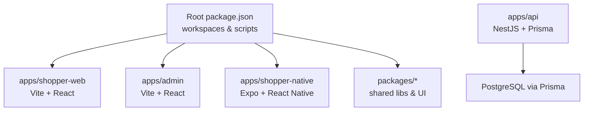
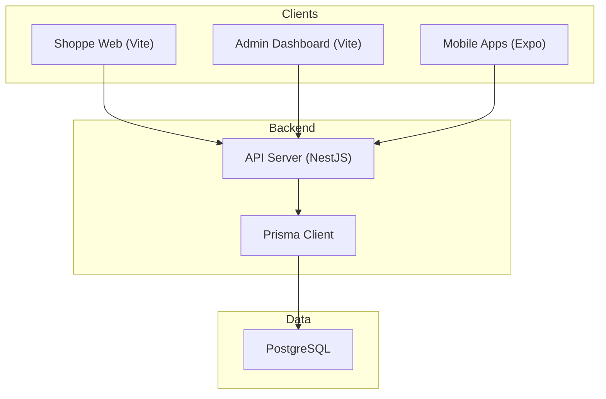
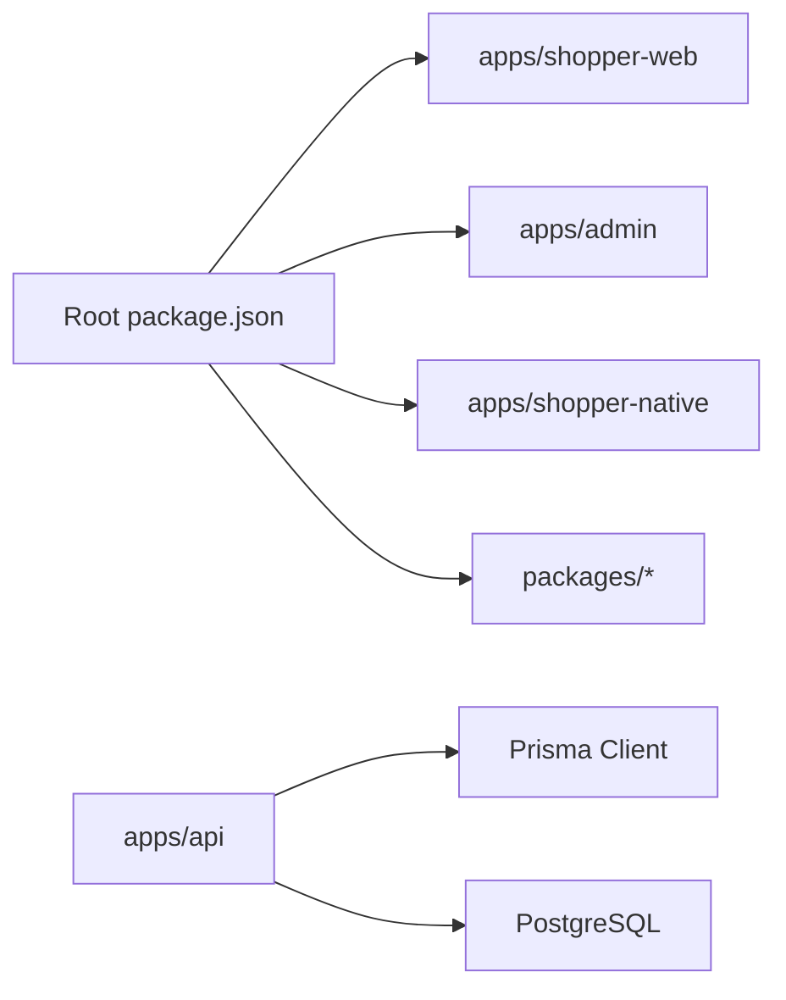

# Getting Started

<cite>
**Referenced Files in This Document**
- [package.json](file://package.json)
- [README.md](file://README.md)
- [apps/api/package.json](file://apps/api/package.json)
- [apps/api/prisma/schema.prisma](file://apps/api/prisma/schema.prisma)
- [apps/shopper-web/package.json](file://apps/shopper-web/package.json)
- [apps/admin/package.json](file://apps/admin/package.json)
- [apps/shopper-native/package.json](file://apps/shopper-native/package.json)
- [.env.local](file://.env.local)
- [GET_SUPABASE_KEY.md](file://GET_SUPABASE_KEY.md)
</cite>

## Table of Contents
1. [Introduction](#introduction)
2. [Project Structure](#project-structure)
3. [Core Components](#core-components)
4. [Architecture Overview](#architecture-overview)
5. [Detailed Component Analysis](#detailed-component-analysis)
6. [Dependency Analysis](#dependency-analysis)
7. [Performance Considerations](#performance-considerations)
8. [Troubleshooting Guide](#troubleshooting-guide)
9. [Conclusion](#conclusion)
10. [Appendices](#appendices)

## Introduction
This guide helps you set up and run the United Pharmacy Monorepo locally. It covers Node.js requirements, database setup, dependency installation with npm workspaces, environment configuration, migrations, and how to start each application: shopper web app, mobile apps (Expo-based), admin dashboard, and the API server. It also includes verification steps and a development workflow for code generation, type checking, and builds.

## Project Structure
The repository is an npm workspaces monorepo that groups multiple applications and shared packages under apps/ and packages/. The root package.json defines workspace members and top-level scripts that delegate to specific apps.

**Diagram sources**
- [package.json:9-13](file://package.json#L9-L13)
- [apps/api/package.json:14-35](file://apps/api/package.json#L14-L35)
- [apps/api/prisma/schema.prisma:6-11](file://apps/api/prisma/schema.prisma#L6-L11)

**Section sources**
- [package.json:1-27](file://package.json#L1-L27)
- [README.md:5-15](file://README.md#L5-L15)

## Core Components
- Root workspace and scripts:
  - Workspaces include apps/shopper-web, apps/shopper-native, and all packages/*.
  - Top-level scripts provide dev/build/typecheck for the active web app and Railway helpers.
- API server:
  - NestJS application using Prisma with PostgreSQL.
  - Database connection configured via environment variables in the schema.
- Frontend apps:
  - Shopper web app built with Vite and React.
  - Admin dashboard built with Vite and React.
  - Mobile apps built with Expo (React Native).

**Section sources**
- [package.json:9-27](file://package.json#L9-L27)
- [apps/api/package.json:1-13](file://apps/api/package.json#L1-L13)
- [apps/api/prisma/schema.prisma:6-11](file://apps/api/prisma/schema.prisma#L6-L11)
- [apps/shopper-web/package.json:6-12](file://apps/shopper-web/package.json#L6-L12)
- [apps/admin/package.json:6-11](file://apps/admin/package.json#L6-L11)
- [apps/shopper-native/package.json:5-16](file://apps/shopper-native/package.json#L5-L16)

## Architecture Overview
High-level runtime architecture:
- Clients: Shopper Web, Admin Dashboard, and Mobile Apps (Expo).
- Backend: API Server (NestJS) with Prisma ORM connecting to PostgreSQL.
- External services: Supabase client usage in frontends and API.

**Diagram sources**
- [apps/api/package.json:14-35](file://apps/api/package.json#L14-L35)
- [apps/api/prisma/schema.prisma:6-11](file://apps/api/prisma/schema.prisma#L6-L11)

## Detailed Component Analysis

### Environment Setup and Requirements
- Node.js version:
  - Root requires Node >= 22.22.2 and < 23.
  - API requires Node >= 22.0.0.
- npm workspaces:
  - Use the root package manager to install dependencies across apps and packages.
- Environment variables:
  - Frontend env file at .env.local contains VITE_* keys used by the web app.
  - API uses DATABASE_URL and DIRECT_URL from environment for Prisma.
  - Supabase credentials are referenced in documentation and frontend env.

Steps:
1. Install Node.js matching the required version range.
2. From the repository root, run npm install to bootstrap workspaces.
3. Create or update .env.local with required VITE_* variables for the web app.
4. For the API, ensure DATABASE_URL and DIRECT_URL are set in the API environment before starting.

Verification:
- Confirm Node version meets the engine constraints.
- Ensure npm install completes without errors.
- Check that .env.local exists and contains necessary keys for the web app.

**Section sources**
- [package.json:6-8](file://package.json#L6-L8)
- [apps/api/package.json:6-8](file://apps/api/package.json#L6-L8)
- [.env.local:1-5](file://.env.local#L1-L5)
- [apps/api/prisma/schema.prisma:6-11](file://apps/api/prisma/schema.prisma#L6-L11)
- [GET_SUPABASE_KEY.md:1-31](file://GET_SUPABASE_KEY.md#L1-L31)

### Database Setup and Migrations
- Database provider:
  - PostgreSQL is configured as the Prisma datasource.
- Schema and migrations:
  - Prisma schema defines models and schemas; migrations are managed via Prisma.
  - Additional SQL migration files exist under supabase/migrations for Supabase-managed changes.

Steps:
1. Provision a PostgreSQL instance accessible from your environment.
2. Set DATABASE_URL and DIRECT_URL environment variables for the API.
3. Generate Prisma client and apply migrations using the API workspace commands.
4. If using Supabase-managed migrations, apply them according to your Supabase CLI setup.

Verification:
- Start the API server and confirm it connects to the database without errors.
- Run a simple query through the API to validate connectivity.

**Section sources**
- [apps/api/prisma/schema.prisma:6-11](file://apps/api/prisma/schema.prisma#L6-L11)
- [apps/api/package.json:48-51](file://apps/api/package.json#L48-L51)

### Starting the API Server
- Scripts:
  - Development watch mode and production start are defined in the API package.
- Dependencies:
  - NestJS framework, Prisma client, Socket.IO, and other runtime libraries.

Steps:
1. Ensure DATABASE_URL and DIRECT_URL are set.
2. Navigate to apps/api and start the development server in watch mode.
3. Verify the server boots and listens on its configured port.

Verification:
- Health check endpoints (if available) should respond.
- Prisma client initialization should succeed without connection errors.

**Section sources**
- [apps/api/package.json:9-13](file://apps/api/package.json#L9-L13)
- [apps/api/package.json:14-35](file://apps/api/package.json#L14-L35)

### Running the Shopper Web App
- Scripts:
  - Dev, build, preview, and typecheck are provided in the web app package.
- Environment:
  - Uses VITE_* variables from .env.local.

Steps:
1. Ensure .env.local has required VITE_* keys.
2. From the repository root, run the dev script to start the shopper web app.
3. Open the local development URL shown by the dev server.

Verification:
- The web app should load without console errors related to missing environment variables.
- Typecheck should pass when running the typecheck command.

**Section sources**
- [apps/shopper-web/package.json:6-12](file://apps/shopper-web/package.json#L6-L12)
- [.env.local:1-5](file://.env.local#L1-L5)
- [package.json:14-19](file://package.json#L14-L19)

### Running the Admin Dashboard
- Scripts:
  - Dev, build, preview, and typecheck are provided in the admin package.

Steps:
1. Navigate to apps/admin and start the development server.
2. Open the local development URL shown by the dev server.

Verification:
- The dashboard should load and connect to backend services as configured.

**Section sources**
- [apps/admin/package.json:6-11](file://apps/admin/package.json#L6-L11)

### Running the Mobile Apps (Expo)
- Scripts:
  - Start, Android/iOS run, web preview, and typecheck are provided in the native app package.

Steps:
1. Ensure Expo tooling is installed and compatible with your environment.
2. From apps/shopper-native, start the Expo development server.
3. Use the provided scripts to run on Android, iOS, or web as needed.

Verification:
- The Expo dev server should launch successfully.
- The app should render on the emulator/device or web preview.

**Section sources**
- [apps/shopper-native/package.json:5-16](file://apps/shopper-native/package.json#L5-L16)

### Code Generation, Type Checking, and Builds
- Root scripts:
  - Provide typecheck and lint tasks targeting the active web app.
- Per-app scripts:
  - Each app defines its own build and typecheck commands.

Recommended workflow:
1. Run root typecheck to validate types across the active workspace.
2. Run per-app typecheck to catch issues within that app.
3. Build the desired app using its build script.
4. Lint to enforce rules and remove console statements where applicable.

**Section sources**
- [package.json:14-19](file://package.json#L14-L19)
- [apps/shopper-web/package.json:6-12](file://apps/shopper-web/package.json#L6-L12)
- [apps/admin/package.json:6-11](file://apps/admin/package.json#L6-L11)
- [apps/shopper-native/package.json:5-16](file://apps/shopper-native/package.json#L5-L16)

## Dependency Analysis
Workspace composition and key dependencies:
- Root manages workspaces and delegates scripts to apps.
- API depends on NestJS, Prisma, and Socket.IO.
- Frontend apps depend on React, Vite/Expo toolchains, and shared packages.

**Diagram sources**
- [package.json:9-13](file://package.json#L9-L13)
- [apps/api/package.json:14-35](file://apps/api/package.json#L14-L35)
- [apps/api/prisma/schema.prisma:6-11](file://apps/api/prisma/schema.prisma#L6-L11)

**Section sources**
- [package.json:9-27](file://package.json#L9-L27)
- [apps/api/package.json:14-35](file://apps/api/package.json#L14-L35)

## Performance Considerations
- Use watch mode for faster feedback during development (API and web apps).
- Keep environment variables minimal and scoped to avoid unnecessary reboots.
- Prefer incremental typechecking and targeted builds per app to reduce wait times.
- Ensure database indexes and queries are optimized in later stages of development.

[No sources needed since this section provides general guidance]

## Troubleshooting Guide
Common setup issues and resolutions:
- Node version mismatch:
  - Ensure Node matches the engine constraints in the root and API packages.
- Missing environment variables:
  - Verify .env.local contains required VITE_* keys for the web app.
  - Ensure DATABASE_URL and DIRECT_URL are set for the API.
- Database connection failures:
  - Confirm PostgreSQL is reachable and credentials are correct.
  - Re-run Prisma migrations if schema drift occurs.
- Supabase keys:
  - Follow the documented steps to obtain and configure the Supabase anon key.

Verification steps:
- Run typecheck for the active app to catch configuration-related type errors early.
- Start the API server and verify it initializes without database errors.
- Launch the web app and confirm no environment variable warnings appear.

**Section sources**
- [package.json:6-8](file://package.json#L6-L8)
- [apps/api/package.json:6-8](file://apps/api/package.json#L6-L8)
- [.env.local:1-5](file://.env.local#L1-L5)
- [apps/api/prisma/schema.prisma:6-11](file://apps/api/prisma/schema.prisma#L6-L11)
- [GET_SUPABASE_KEY.md:1-31](file://GET_SUPABASE_KEY.md#L1-L31)

## Conclusion
You now have the essential steps to set up the United Pharmacy Monorepo, configure environments, manage database migrations, and run each application. Follow the verification steps to ensure everything is working correctly, and use the development workflow to iterate efficiently across apps and shared packages.

[No sources needed since this section summarizes without analyzing specific files]

## Appendices

### Quick Start Checklist
- Install Node.js meeting the required version range.
- Run npm install at the repository root.
- Configure .env.local with required VITE_* keys.
- Set DATABASE_URL and DIRECT_URL for the API.
- Apply Prisma migrations and generate the client.
- Start the API server, then launch the desired app(s).

**Section sources**
- [package.json:6-27](file://package.json#L6-L27)
- [apps/api/package.json:9-13](file://apps/api/package.json#L9-L13)
- [apps/api/prisma/schema.prisma:6-11](file://apps/api/prisma/schema.prisma#L6-L11)
- [.env.local:1-5](file://.env.local#L1-L5)