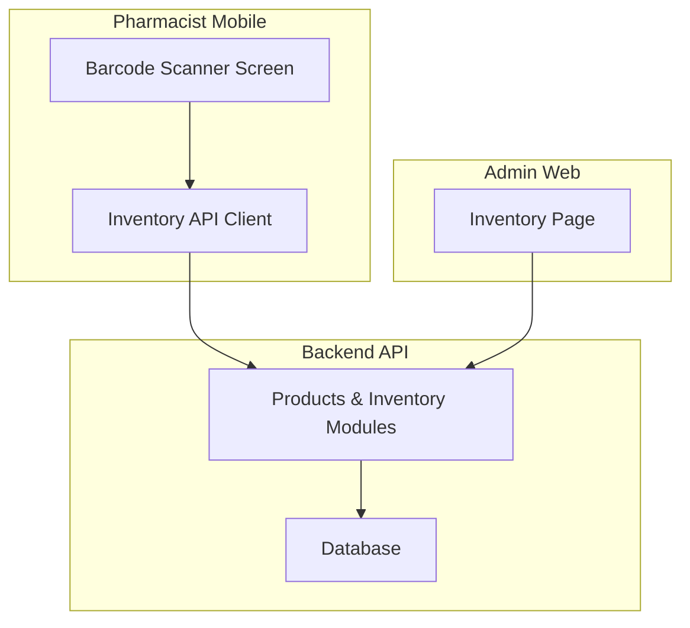
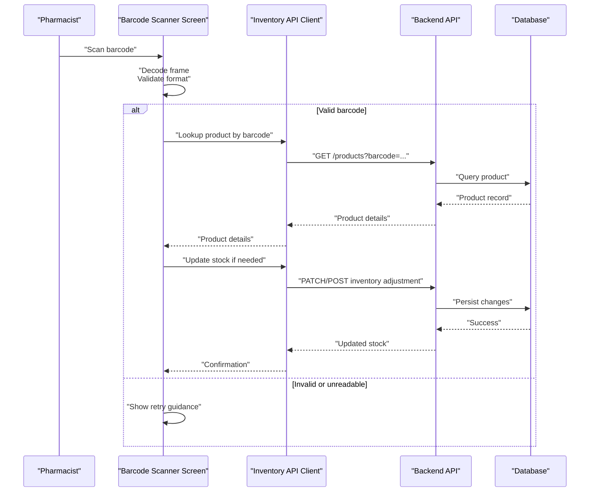
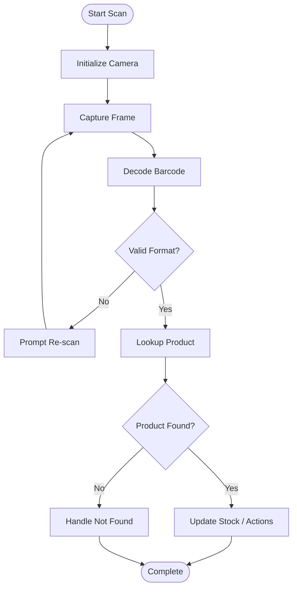
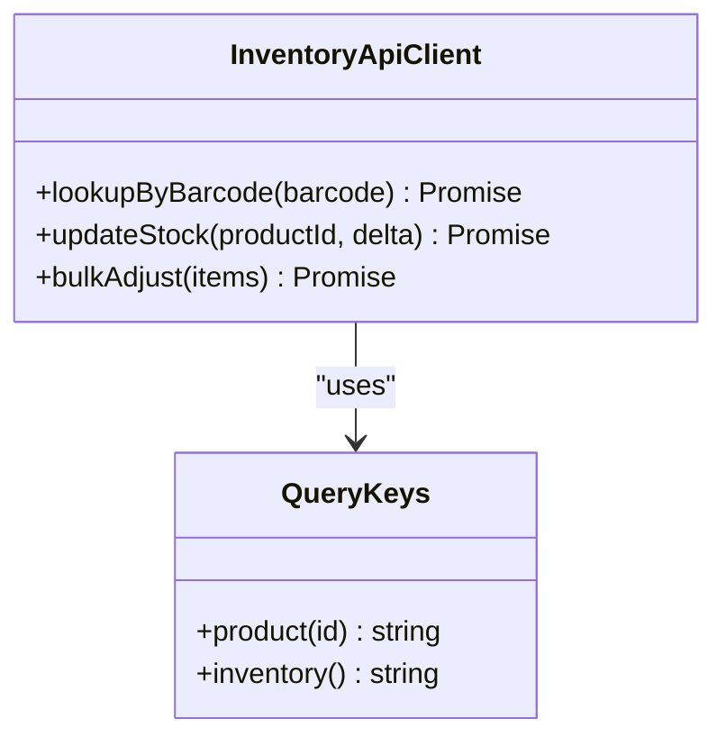
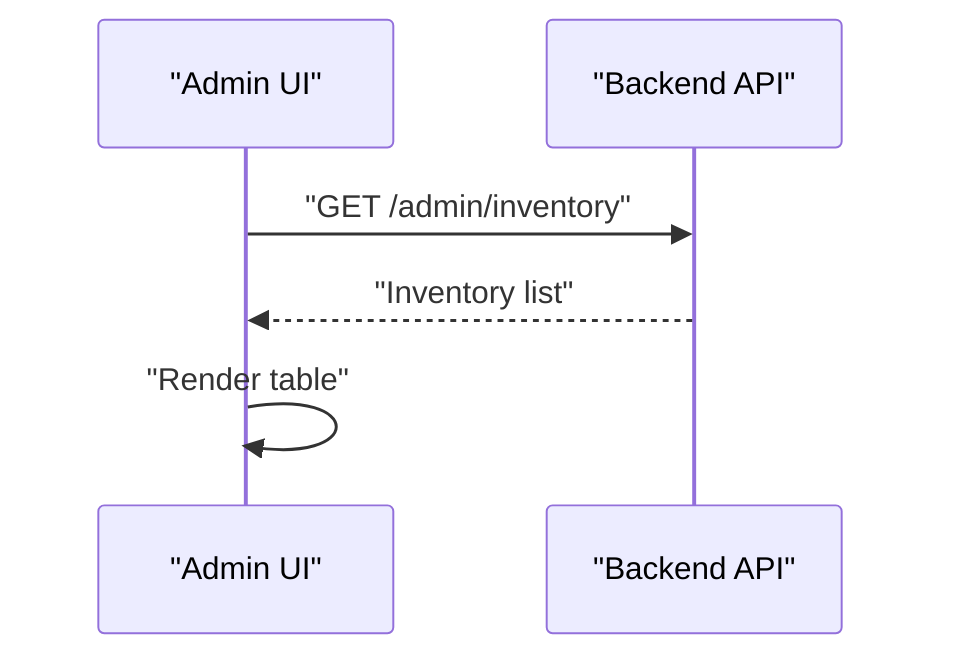
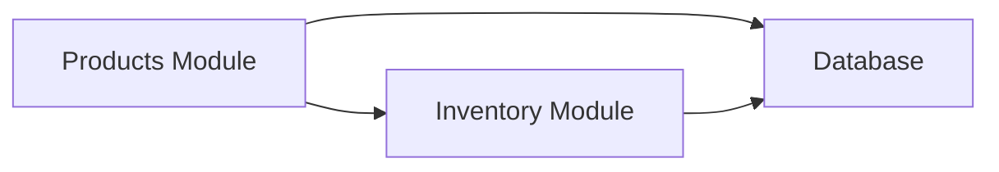
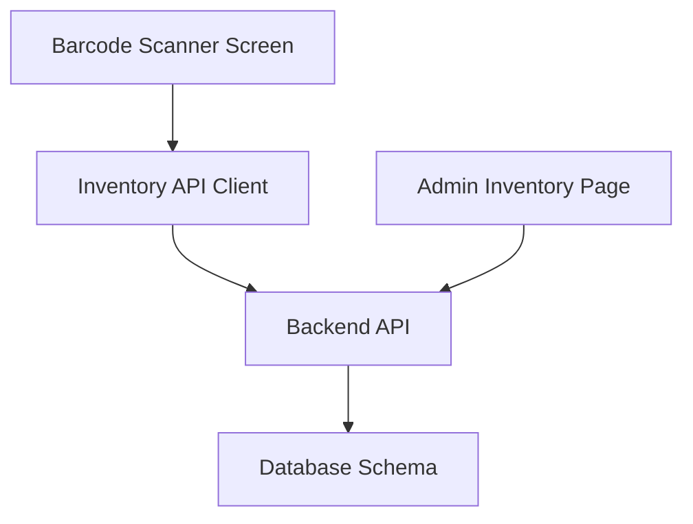

# Barcode & Product Scanning

<cite>
**Referenced Files in This Document**
- [scanner.tsx](file://apps/shopper-native/app/(pharmacist)/scanner.tsx)
- [BarcodeScannerScreen.tsx](file://apps/shopper-native/src/features/pharmacist/screens/BarcodeScannerScreen.tsx)
- [InventoryPage.tsx](file://apps/admin/src/pages/InventoryPage.tsx)
- [inventoryApi.ts](file://apps/shopper-native/src/features/inventory/api/inventoryApi.ts)
- [queryKeys.ts](file://apps/shopper-native/src/features/inventory/api/queryKeys.ts)
- [schema.prisma](file://apps/api/prisma/schema.prisma)
- [app.module.ts](file://apps/api/src/app.module.ts)
- [products module](file://apps/api/src/modules/products)
- [inventory module](file://apps/api/src/modules/inventory)
</cite>

## Table of Contents
1. Introduction
2. Project Structure
3. Core Components
4. Architecture Overview
5. Detailed Component Analysis
6. Dependency Analysis
7. Performance Considerations
8. Troubleshooting Guide
9. Conclusion

## Introduction
This document explains the barcode scanning capabilities across admin and pharmacist interfaces, focusing on how scanned barcodes are detected, validated, used to look up products, and integrated with inventory management. It covers supported formats (UPC, EAN, QR), product lookup workflows, stock updates, reordering alerts, scanner component architecture, performance optimizations for real-time scanning, error recovery for unreadable or damaged barcodes, validation and duplicate detection, and bulk scanning operations for inventory audits.

## Project Structure
The barcode scanning feature spans multiple layers:
- Pharmacist mobile app provides a dedicated scanner screen that captures and decodes barcodes from camera input.
- Inventory APIs expose endpoints to retrieve product details by barcode and update stock levels.
- Admin interface surfaces inventory data and can be extended to support barcode-driven inventory actions.

**Diagram sources**
- [scanner.tsx:1-2](file://apps/shopper-native/app/(pharmacist)/scanner.tsx#L1-L2)
- [BarcodeScannerScreen.tsx](file://apps/shopper-native/src/features/pharmacist/screens/BarcodeScannerScreen.tsx)
- [inventoryApi.ts](file://apps/shopper-native/src/features/inventory/api/inventoryApi.ts)
- [InventoryPage.tsx:1-31](file://apps/admin/src/pages/InventoryPage.tsx#L1-L31)
- [app.module.ts](file://apps/api/src/app.module.ts)
- [schema.prisma](file://apps/api/prisma/schema.prisma)

**Section sources**
- [scanner.tsx:1-2](file://apps/shopper-native/app/(pharmacist)/scanner.tsx#L1-L2)
- [InventoryPage.tsx:1-31](file://apps/admin/src/pages/InventoryPage.tsx#L1-L31)
- [app.module.ts](file://apps/api/src/app.module.ts)
- [schema.prisma](file://apps/api/prisma/schema.prisma)

## Core Components
- Barcode Scanner Screen (pharmacist): Captures camera frames, decodes barcodes, validates format, triggers product lookup, and updates inventory.
- Inventory API client: Encapsulates calls to backend services for product lookup and stock adjustments.
- Admin Inventory Page: Displays inventory data; can integrate barcode-driven actions via existing endpoints.

Key responsibilities:
- Detection: Real-time decoding of UPC, EAN, and QR codes from camera stream.
- Validation: Enforce format rules and checksums where applicable.
- Lookup: Resolve barcode to product record using backend services.
- Inventory integration: Update stock levels, trigger reorder alerts when thresholds are breached.
- Error handling: Graceful recovery for unreadable/damaged barcodes and network failures.

**Section sources**
- [BarcodeScannerScreen.tsx](file://apps/shopper-native/src/features/pharmacist/screens/BarcodeScannerScreen.tsx)
- [inventoryApi.ts](file://apps/shopper-native/src/features/inventory/api/inventoryApi.ts)
- [queryKeys.ts](file://apps/shopper-native/src/features/inventory/api/queryKeys.ts)
- [InventoryPage.tsx:1-31](file://apps/admin/src/pages/InventoryPage.tsx#L1-L31)

## Architecture Overview
The system follows a layered architecture:
- Presentation layer: Pharmacist scanner UI and Admin inventory page.
- Service layer: Backend modules for products and inventory.
- Data layer: Database schema defining products, stock, and related entities.

**Diagram sources**
- [BarcodeScannerScreen.tsx](file://apps/shopper-native/src/features/pharmacist/screens/BarcodeScannerScreen.tsx)
- [inventoryApi.ts](file://apps/shopper-native/src/features/inventory/api/inventoryApi.ts)
- [app.module.ts](file://apps/api/src/app.module.ts)
- [schema.prisma](file://apps/api/prisma/schema.prisma)

## Detailed Component Analysis

### Barcode Scanner Screen (Pharmacist)
Responsibilities:
- Initialize camera and capture frames at optimal resolution.
- Decode barcodes in real time using a decoder library.
- Validate decoded values against supported formats (UPC-A/E, EAN-13/8, QR).
- Trigger product lookup and handle success/failure states.
- Provide user feedback for retries, invalid codes, and errors.

Supported formats:
- UPC-A, UPC-E
- EAN-13, EAN-8
- QR Code

Validation rules:
- Length and prefix checks per format.
- Checksum verification where applicable (e.g., UPC/EAN).
- Reject malformed or ambiguous scans.

Performance considerations:
- Throttle decode attempts to avoid excessive CPU usage.
- Use hardware-accelerated decoding when available.
- Debounce rapid successive scans to prevent duplicate processing.

Error recovery:
- Prompt user to adjust lighting or angle for unreadable barcodes.
- Offer manual entry fallback for damaged barcodes.
- Retry with different decoding strategies if initial attempt fails.

**Diagram sources**
- [BarcodeScannerScreen.tsx](file://apps/shopper-native/src/features/pharmacist/screens/BarcodeScannerScreen.tsx)

**Section sources**
- [BarcodeScannerScreen.tsx](file://apps/shopper-native/src/features/pharmacist/screens/BarcodeScannerScreen.tsx)

### Inventory API Client
Responsibilities:
- Encapsulate HTTP calls to backend for product lookup and inventory updates.
- Manage caching keys and query invalidation for consistent UI state.
- Handle retries and error propagation to the UI.

Integration points:
- Product lookup by barcode.
- Stock level updates and reorder triggers.
- Bulk operations for audit scenarios.

**Diagram sources**
- [inventoryApi.ts](file://apps/shopper-native/src/features/inventory/api/inventoryApi.ts)
- [queryKeys.ts](file://apps/shopper-native/src/features/inventory/api/queryKeys.ts)

**Section sources**
- [inventoryApi.ts](file://apps/shopper-native/src/features/inventory/api/inventoryApi.ts)
- [queryKeys.ts](file://apps/shopper-native/src/features/inventory/api/queryKeys.ts)

### Admin Inventory Page
Responsibilities:
- Display current inventory data fetched from backend.
- Provide a foundation for integrating barcode-driven actions (e.g., quick stock adjustments).

Current behavior:
- Fetches inventory list and renders it with loading and error states.

Potential enhancements:
- Add a barcode input field to quickly locate and adjust stock.
- Integrate with scanner results to perform immediate updates.

**Diagram sources**
- [InventoryPage.tsx:1-31](file://apps/admin/src/pages/InventoryPage.tsx#L1-L31)

**Section sources**
- [InventoryPage.tsx:1-31](file://apps/admin/src/pages/InventoryPage.tsx#L1-L31)

### Backend Products & Inventory Modules
Responsibilities:
- Expose endpoints for product lookup by barcode and inventory adjustments.
- Enforce business rules for stock updates and reorder alerts.
- Persist changes to the database.

Integration points:
- Database schema defines products, stock levels, and thresholds.
- Module registration ensures routes and services are available.

**Diagram sources**
- [app.module.ts](file://apps/api/src/app.module.ts)
- [schema.prisma](file://apps/api/prisma/schema.prisma)

**Section sources**
- [app.module.ts](file://apps/api/src/app.module.ts)
- [schema.prisma](file://apps/api/prisma/schema.prisma)

## Dependency Analysis
- The pharmacist scanner depends on the inventory API client for product lookup and stock updates.
- The admin inventory page depends on backend endpoints to fetch inventory data.
- Backend modules depend on the database schema for product and inventory records.

**Diagram sources**
- [BarcodeScannerScreen.tsx](file://apps/shopper-native/src/features/pharmacist/screens/BarcodeScannerScreen.tsx)
- [inventoryApi.ts](file://apps/shopper-native/src/features/inventory/api/inventoryApi.ts)
- [InventoryPage.tsx:1-31](file://apps/admin/src/pages/InventoryPage.tsx#L1-L31)
- [app.module.ts](file://apps/api/src/app.module.ts)
- [schema.prisma](file://apps/api/prisma/schema.prisma)

**Section sources**
- [BarcodeScannerScreen.tsx](file://apps/shopper-native/src/features/pharmacist/screens/BarcodeScannerScreen.tsx)
- [inventoryApi.ts](file://apps/shopper-native/src/features/inventory/api/inventoryApi.ts)
- [InventoryPage.tsx:1-31](file://apps/admin/src/pages/InventoryPage.tsx#L1-L31)
- [app.module.ts](file://apps/api/src/app.module.ts)
- [schema.prisma](file://apps/api/prisma/schema.prisma)

## Performance Considerations
- Real-time decoding: Limit frame processing rate and use efficient decoding libraries to reduce CPU usage.
- Debouncing: Prevent duplicate scans by debouncing rapid successive reads.
- Caching: Cache product lookups locally to minimize network calls during repeated scans.
- Batch updates: For bulk audits, aggregate adjustments and send batch requests to reduce API overhead.
- Network resilience: Implement retries with exponential backoff for transient failures.

[No sources needed since this section provides general guidance]

## Troubleshooting Guide
Common issues and resolutions:
- Unreadable or damaged barcodes:
  - Improve lighting and focus; prompt user to reposition the item.
  - Offer manual entry fallback for damaged codes.
  - Retry with alternative decoding strategies.
- Invalid format:
  - Validate length and checksum; guide users to correct the code source.
- Product not found:
  - Verify barcode mapping in the database; ensure product exists and is active.
- Network errors:
  - Retry with backoff; show user-friendly error messages and allow retry.
- Duplicate scans:
  - Debounce and deduplicate recent scans to prevent accidental double updates.

**Section sources**
- [BarcodeScannerScreen.tsx](file://apps/shopper-native/src/features/pharmacist/screens/BarcodeScannerScreen.tsx)
- [inventoryApi.ts](file://apps/shopper-native/src/features/inventory/api/inventoryApi.ts)

## Conclusion
The barcode scanning workflow integrates a robust scanner component with product lookup and inventory management. Supported formats include UPC, EAN, and QR codes. The system validates barcodes, resolves products, updates stock levels, and can trigger reorder alerts. Performance optimizations ensure smooth real-time scanning, while error handling provides resilient recovery for challenging scan conditions. Admin and pharmacist interfaces collaborate to maintain accurate inventory and streamline operations.

[No sources needed since this section summarizes without analyzing specific files]