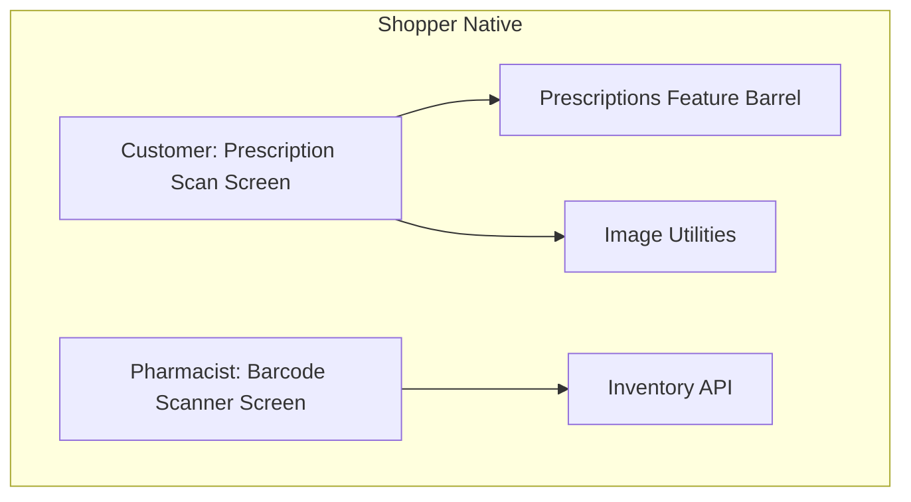
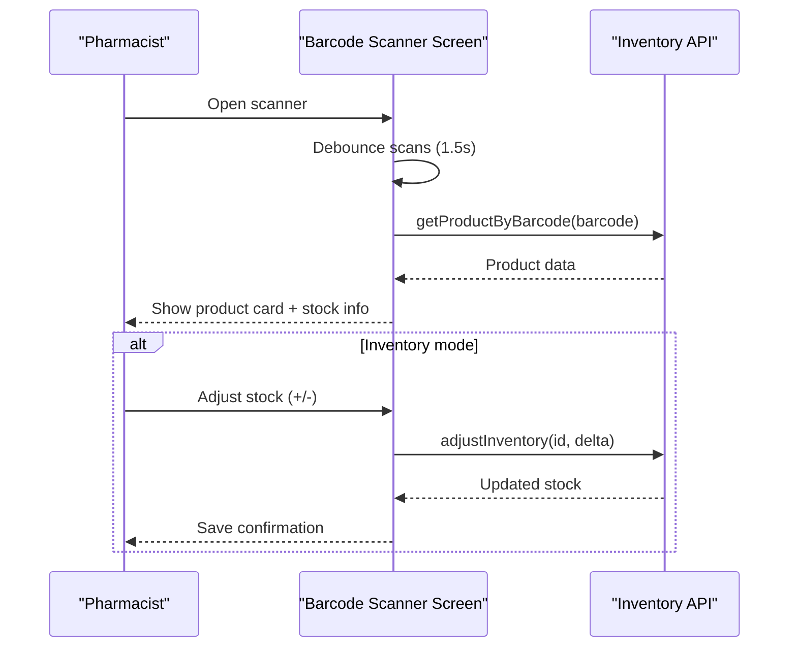
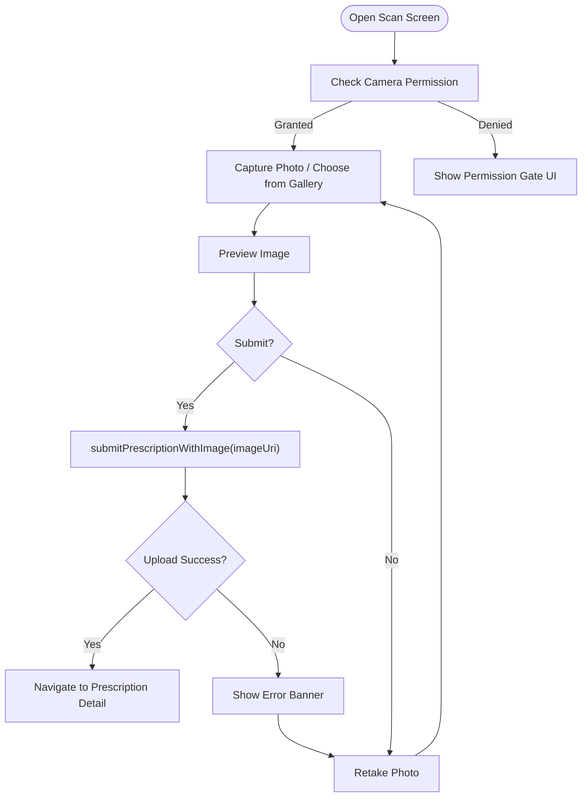
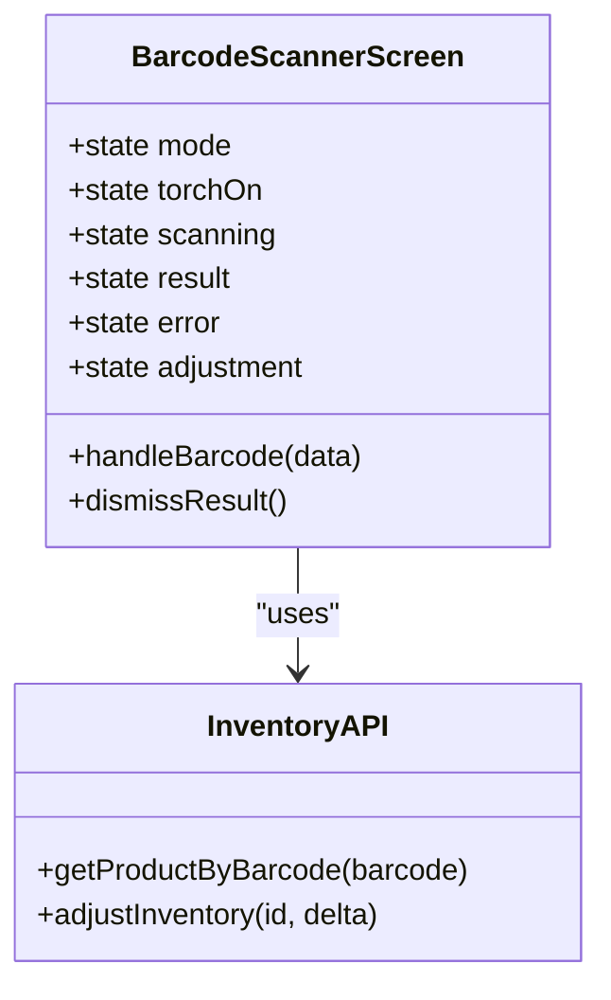
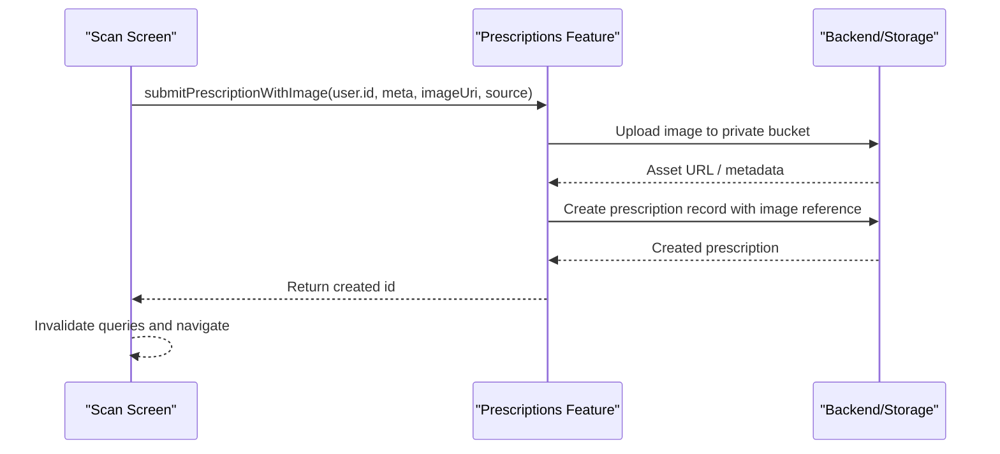
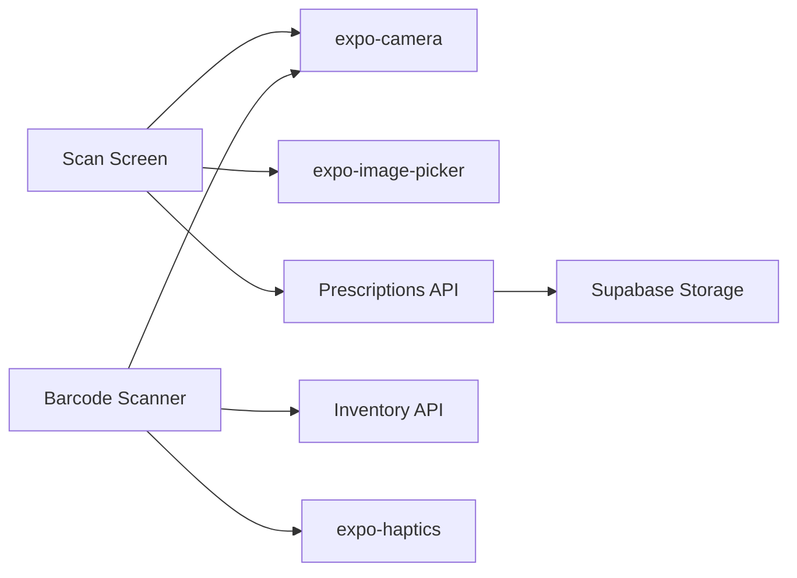

# Camera & Image Processing

<cite>
**Referenced Files in This Document**
- [scan.tsx](file://apps/shopper-native/app/(customer)/prescriptions/scan.tsx)
- [BarcodeScannerScreen.tsx](file://apps/shopper-native/src/features/pharmacist/screens/BarcodeScannerScreen.tsx)
- [index.ts](file://apps/shopper-native/src/features/prescriptions/index.ts)
- [api.ts](file://apps/shopper-native/src/features/prescriptions/api.ts)
- [inventory.ts](file://apps/shopper-native/src/features/pharmacist/api/inventory.ts)
- [imagePrefetch.ts](file://apps/shopper-native/src/lib/imagePrefetch.ts)
</cite>

## Table of Contents
1. [Introduction](#introduction)
2. [Project Structure](#project-structure)
3. [Core Components](#core-components)
4. [Architecture Overview](#architecture-overview)
5. [Detailed Component Analysis](#detailed-component-analysis)
6. [Dependency Analysis](#dependency-analysis)
7. [Performance Considerations](#performance-considerations)
8. [Troubleshooting Guide](#troubleshooting-guide)
9. [Conclusion](#conclusion)

## Introduction
This document explains the camera integration and image processing features implemented in the mobile application, focusing on:
- Prescription scanning workflow with secure image capture and upload (no on-device OCR).
- Barcode scanning for product identification, inventory management, and quick checkout flows.
- Receipt capture workflows for manual payment verification and expense tracking.
- Image optimization techniques, compression strategies, and cloud upload processes.
- Camera permissions handling, error recovery, and accessibility considerations.
- Scanner component architecture, performance optimizations, and cross-platform compatibility between iOS and Android.

## Project Structure
The relevant implementation is primarily within the shopper-native app:
- Prescription scanning screen under customer routes.
- Pharmacist barcode scanner screen under pharmacist features.
- Prescriptions feature barrel exposing hooks and APIs used by screens.
- Shared utilities for image prefetching and formatting.



**Diagram sources**
- [scan.tsx:1-536](file://apps/shopper-native/app/(customer)/prescriptions/scan.tsx#L1-L536)
- [BarcodeScannerScreen.tsx:1-800](file://apps/shopper-native/src/features/pharmacist/screens/BarcodeScannerScreen.tsx#L1-L800)
- [index.ts:1-53](file://apps/shopper-native/src/features/prescriptions/index.ts#L1-L53)
- [inventory.ts:1-200](file://apps/shopper-native/src/features/pharmacist/api/inventory.ts#L1-L200)
- [imagePrefetch.ts:1-200](file://apps/shopper-native/src/lib/imagePrefetch.ts#L1-L200)

**Section sources**
- [scan.tsx:1-536](file://apps/shopper-native/app/(customer)/prescriptions/scan.tsx#L1-L536)
- [BarcodeScannerScreen.tsx:1-800](file://apps/shopper-native/src/features/pharmacist/screens/BarcodeScannerScreen.tsx#L1-L800)
- [index.ts:1-53](file://apps/shopper-native/src/features/prescriptions/index.ts#L1-L53)

## Core Components
- Prescription scan screen: Captures or selects an image, previews it, and securely uploads it to a private storage bucket as part of prescription submission. It uses expo-camera for live capture and expo-image-picker for gallery selection.
- Pharmacist barcode scanner: Full-screen scanner with modes for medicine lookup, order QR navigation, and inventory adjustments. Includes debounced scanning, haptic feedback, and animated result cards.
- Prescriptions feature barrel: Exposes hooks and mutation functions including submitPrescriptionWithImage used by the scan screen.
- Inventory API: Provides product lookup by barcode and stock adjustment endpoints consumed by the scanner.
- Image utilities: Provide shared helpers for image handling and prefetching.

**Section sources**
- [scan.tsx:1-536](file://apps/shopper-native/app/(customer)/prescriptions/scan.tsx#L1-L536)
- [BarcodeScannerScreen.tsx:1-800](file://apps/shopper-native/src/features/pharmacist/screens/BarcodeScannerScreen.tsx#L1-L800)
- [index.ts:1-53](file://apps/shopper-native/src/features/prescriptions/index.ts#L1-L53)
- [inventory.ts:1-200](file://apps/shopper-native/src/features/pharmacist/api/inventory.ts#L1-L200)
- [imagePrefetch.ts:1-200](file://apps/shopper-native/src/lib/imagePrefetch.ts#L1-L200)

## Architecture Overview
High-level flow for prescription scanning and barcode scanning:

```mermaid
sequenceDiagram
participant U as "User"
participant S as "Scan Screen"
participant P as "Prescriptions API"
participant I as "Inventory API"
participant C as "Camera/Gallery"
U->>S : Open prescription scan
S->>C : Request camera/gallery permission
C-->>S : Permission granted/denied
alt Gallery selected
S->>C : Launch image picker
C-->>S : Image URI
else Camera capture
S->>C : takePictureAsync
C-->>S : Photo URI
end
S->>S : Preview image
S->>P : submitPrescriptionWithImage(imageUri)
P-->>S : Success -> navigate to detail
S-->>U : Show success sheet
Note over S,P : No on-device OCR; images uploaded securely
```



**Diagram sources**
- [scan.tsx:47-118](file://apps/shopper-native/app/(customer)/prescriptions/scan.tsx#L47-L118)
- [index.ts:28-37](file://apps/shopper-native/src/features/prescriptions/index.ts#L28-L37)
- [BarcodeScannerScreen.tsx:124-131](file://apps/shopper-native/src/features/pharmacist/screens/BarcodeScannerScreen.tsx#L124-L131)
- [BarcodeScannerScreen.tsx:762-800](file://apps/shopper-native/src/features/pharmacist/screens/BarcodeScannerScreen.tsx#L762-L800)
- [inventory.ts:1-200](file://apps/shopper-native/src/features/pharmacist/api/inventory.ts#L1-L200)

## Detailed Component Analysis

### Prescription Scanning Screen
- Capture and preview: Uses expo-camera to capture photos at quality 0.8 with skipProcessing enabled for performance. Gallery selection via expo-image-picker with mediaTypes images and quality 0.8.
- Secure upload: Submits the image using submitPrescriptionWithImage from the prescriptions feature, which handles uploading to a private Supabase Storage bucket and creating a prescription record.
- Permissions: Requests camera permissions and provides a dedicated permission gate UI with clear messaging and fallback to gallery if camera is denied.
- Accessibility: Buttons use accessibilityRole and labels; RTL layout support included.
- Error handling: Displays error banners on upload failure and allows retaking the photo.



**Diagram sources**
- [scan.tsx:47-118](file://apps/shopper-native/app/(customer)/prescriptions/scan.tsx#L47-L118)
- [scan.tsx:120-163](file://apps/shopper-native/app/(customer)/prescriptions/scan.tsx#L120-L163)
- [scan.tsx:165-217](file://apps/shopper-native/app/(customer)/prescriptions/scan.tsx#L165-L217)
- [index.ts:28-37](file://apps/shopper-native/src/features/prescriptions/index.ts#L28-L37)

**Section sources**
- [scan.tsx:1-536](file://apps/shopper-native/app/(customer)/prescriptions/scan.tsx#L1-L536)
- [index.ts:1-53](file://apps/shopper-native/src/features/prescriptions/index.ts#L1-L53)

### Pharmacist Barcode Scanner Screen
- Modes: Medicine (product lookup), Order (QR navigation), Inventory (stock adjustment).
- Debouncing: Prevents duplicate scans within a configurable interval (1.5 seconds).
- Haptics: Provides tactile feedback on successful scans and errors.
- Result card: Animated bottom sheet showing product details, stock levels, low-stock warnings, and category.
- Inventory adjustments: Inline +/- controls with save action calling adjustInventory.



**Diagram sources**
- [BarcodeScannerScreen.tsx:124-131](file://apps/shopper-native/src/features/pharmacist/screens/BarcodeScannerScreen.tsx#L124-L131)
- [BarcodeScannerScreen.tsx:762-800](file://apps/shopper-native/src/features/pharmacist/screens/BarcodeScannerScreen.tsx#L762-L800)
- [inventory.ts:1-200](file://apps/shopper-native/src/features/pharmacist/api/inventory.ts#L1-L200)

**Section sources**
- [BarcodeScannerScreen.tsx:1-800](file://apps/shopper-native/src/features/pharmacist/screens/BarcodeScannerScreen.tsx#L1-L800)
- [inventory.ts:1-200](file://apps/shopper-native/src/features/pharmacist/api/inventory.ts#L1-L200)

### Prescription Submission and Image Handling
- The scan screen delegates image submission to the prescriptions feature’s API surface, which includes submitPrescriptionWithImage. This function encapsulates the secure upload process to a private storage bucket and creates the associated prescription record.
- The feature barrel exposes this function alongside other hooks and mutations for prescriptions.



**Diagram sources**
- [index.ts:28-37](file://apps/shopper-native/src/features/prescriptions/index.ts#L28-L37)
- [scan.tsx:91-118](file://apps/shopper-native/app/(customer)/prescriptions/scan.tsx#L91-L118)

**Section sources**
- [index.ts:1-53](file://apps/shopper-native/src/features/prescriptions/index.ts#L1-L53)
- [scan.tsx:91-118](file://apps/shopper-native/app/(customer)/prescriptions/scan.tsx#L91-L118)

### Receipt Capture Workflows
- While no dedicated receipt capture screen was found in the analyzed files, the same camera and image pipeline can be reused for receipts:
  - Use expo-camera for capture and expo-image-picker for gallery selection.
  - Apply similar preview and upload steps as in prescription scanning.
  - For manual payment verification and expense tracking, integrate with backend endpoints that store receipt images and associate them with transactions.

[No sources needed since this section describes reusable patterns without analyzing specific files]

### Image Optimization Techniques and Compression Strategies
- Capture quality: Set quality to 0.8 when capturing or selecting images to balance clarity and file size.
- Skip processing: Use skipProcessing to avoid unnecessary on-device transformations during capture for better performance.
- Reusable utilities: Leverage shared image utilities for consistent handling across features.

**Section sources**
- [scan.tsx:54-83](file://apps/shopper-native/app/(customer)/prescriptions/scan.tsx#L54-L83)
- [imagePrefetch.ts:1-200](file://apps/shopper-native/src/lib/imagePrefetch.ts#L1-L200)

### Cloud Upload Processes
- Secure upload: Images are uploaded to a private Supabase Storage bucket as part of prescription submission.
- Submission flow: The scan screen calls submitPrescriptionWithImage, which handles both image upload and record creation.

**Section sources**
- [scan.tsx:91-118](file://apps/shopper-native/app/(customer)/prescriptions/scan.tsx#L91-L118)
- [index.ts:28-37](file://apps/shopper-native/src/features/prescriptions/index.ts#L28-L37)

### Camera Permissions Handling, Error Recovery, and Accessibility
- Permissions:
  - Camera: Requested via useCameraPermissions; shows a dedicated permission gate UI with clear instructions and options to request again or open settings.
  - Gallery: Requests media library permissions before launching the image picker.
- Error recovery:
  - Upload failures display an error banner and allow users to retake or retry.
  - Debounced scanning prevents repeated lookups on rapid scans.
- Accessibility:
  - Interactive elements include accessibilityRole and descriptive labels.
  - RTL layout support ensures correct text alignment and navigation direction.

**Section sources**
- [scan.tsx:47-163](file://apps/shopper-native/app/(customer)/prescriptions/scan.tsx#L47-L163)
- [BarcodeScannerScreen.tsx:138-192](file://apps/shopper-native/src/features/pharmacist/screens/BarcodeScannerScreen.tsx#L138-L192)
- [BarcodeScannerScreen.tsx:762-800](file://apps/shopper-native/src/features/pharmacist/screens/BarcodeScannerScreen.tsx#L762-L800)

### Scanner Component Architecture and Cross-Platform Compatibility
- Expo-based components:
  - CameraView and useCameraPermissions provide cross-platform camera access for iOS and Android.
  - expo-image-picker offers consistent gallery selection across platforms.
- Performance:
  - Debouncing reduces redundant network requests.
  - Quality settings and skipProcessing optimize capture performance.
- UX:
  - Animated result cards and haptic feedback improve user experience.
  - Clear permission flows and accessible UI elements enhance usability.

**Section sources**
- [BarcodeScannerScreen.tsx:1-800](file://apps/shopper-native/src/features/pharmacist/screens/BarcodeScannerScreen.tsx#L1-L800)
- [scan.tsx:1-536](file://apps/shopper-native/app/(customer)/prescriptions/scan.tsx#L1-L536)

## Dependency Analysis
Key dependencies and relationships:
- Scan screen depends on:
  - expo-camera for camera access.
  - expo-image-picker for gallery selection.
  - Prescriptions feature API for secure upload and record creation.
- Barcode scanner depends on:
  - expo-camera for scanning.
  - Inventory API for product lookup and stock adjustments.
  - Haptics and animations for UX enhancements.



**Diagram sources**
- [scan.tsx:13-26](file://apps/shopper-native/app/(customer)/prescriptions/scan.tsx#L13-L26)
- [BarcodeScannerScreen.tsx:69-112](file://apps/shopper-native/src/features/pharmacist/screens/BarcodeScannerScreen.tsx#L69-L112)
- [index.ts:28-37](file://apps/shopper-native/src/features/prescriptions/index.ts#L28-L37)
- [inventory.ts:1-200](file://apps/shopper-native/src/features/pharmacist/api/inventory.ts#L1-L200)

**Section sources**
- [scan.tsx:13-26](file://apps/shopper-native/app/(customer)/prescriptions/scan.tsx#L13-L26)
- [BarcodeScannerScreen.tsx:69-112](file://apps/shopper-native/src/features/pharmacist/screens/BarcodeScannerScreen.tsx#L69-L112)
- [index.ts:28-37](file://apps/shopper-native/src/features/prescriptions/index.ts#L28-L37)
- [inventory.ts:1-200](file://apps/shopper-native/src/features/pharmacist/api/inventory.ts#L1-L200)

## Performance Considerations
- Capture quality: Using 0.8 quality reduces file size while maintaining readability.
- Skip processing: Disabling on-device processing avoids extra CPU usage during capture.
- Debouncing: Prevents rapid successive scans from triggering multiple network calls.
- Animations: Lightweight animations improve perceived performance without heavy overhead.
- Network efficiency: Uploading images once per submission and reusing results minimizes redundant operations.

[No sources needed since this section provides general guidance]

## Troubleshooting Guide
Common issues and resolutions:
- Camera permission denied:
  - Display permission gate UI with clear instructions.
  - Allow users to request permission again or open system settings.
- Gallery permission denied:
  - Show error sheet explaining the need for gallery access.
- Upload failures:
  - Display error banner with actionable message.
  - Allow users to retake the photo or retry submission.
- Duplicate scans:
  - Ensure debouncing is active to prevent repeated lookups.
- Low stock warnings:
  - Highlight low availability in the result card and guide users to adjust inventory.

**Section sources**
- [scan.tsx:68-83](file://apps/shopper-native/app/(customer)/prescriptions/scan.tsx#L68-L83)
- [scan.tsx:113-118](file://apps/shopper-native/app/(customer)/prescriptions/scan.tsx#L113-L118)
- [BarcodeScannerScreen.tsx:762-800](file://apps/shopper-native/src/features/pharmacist/screens/BarcodeScannerScreen.tsx#L762-L800)

## Conclusion
The mobile application implements robust camera integration and image processing features:
- Prescription scanning focuses on secure image capture and upload without on-device OCR, ensuring privacy and reliability.
- Barcode scanning supports product identification, inventory management, and quick checkout with debounced scanning and haptic feedback.
- Image optimization leverages quality settings and skip processing to balance performance and quality.
- Permissions handling and error recovery provide clear user guidance and resilience.
- The architecture is built on Expo components for cross-platform compatibility between iOS and Android, with thoughtful UX and accessibility considerations.

[No sources needed since this section summarizes without analyzing specific files]