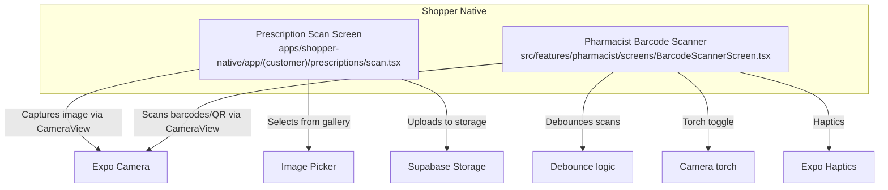
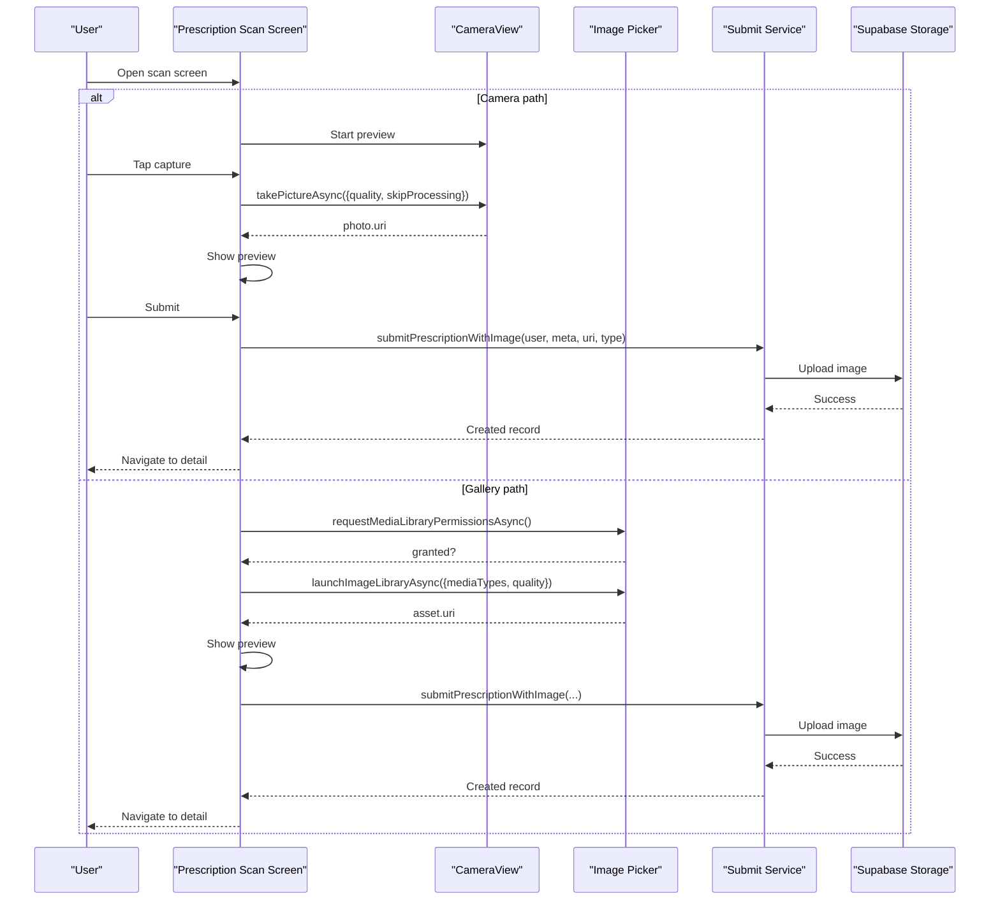
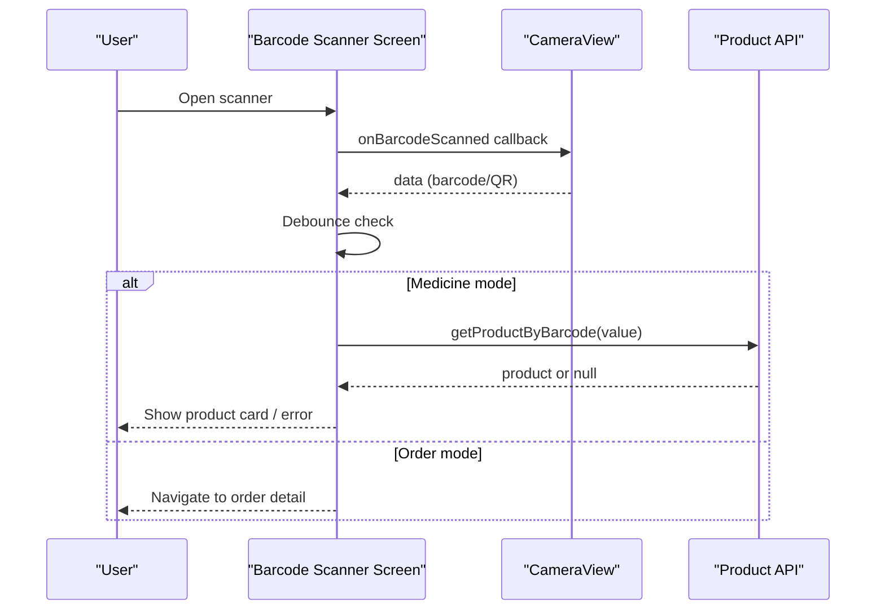
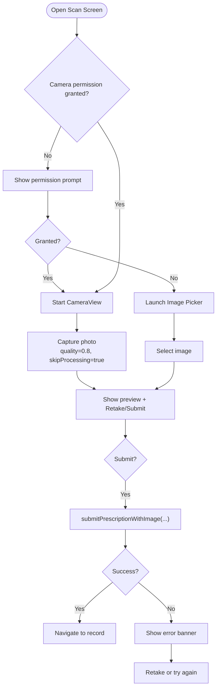
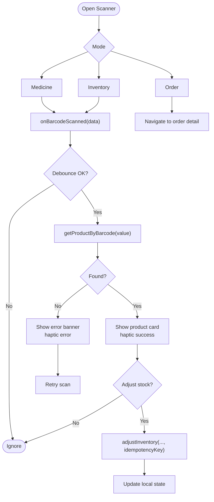
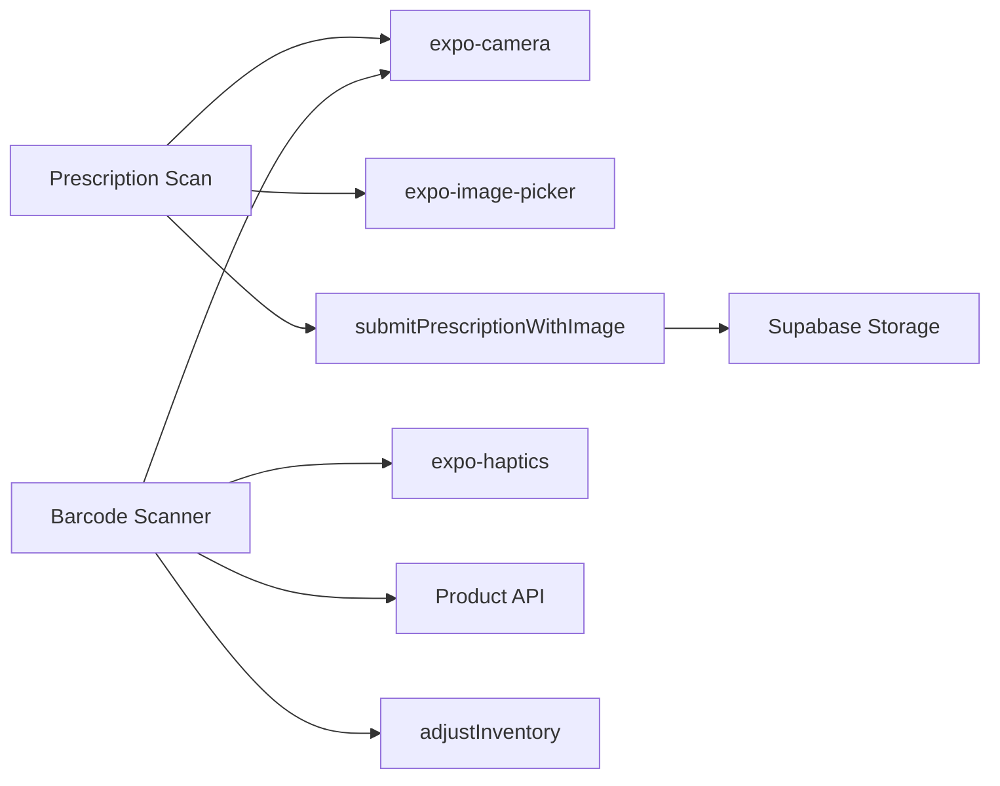

# Camera Performance & Optimization

<cite>
**Referenced Files in This Document**
- [scan.tsx](file://apps/shopper-native/app/(customer)/prescriptions/scan.tsx)
- [BarcodeScannerScreen.tsx](file://apps/shopper-native/src/features/pharmacist/screens/BarcodeScannerScreen.tsx)
</cite>

## Table of Contents
1. Introduction
2. Project Structure
3. Core Components
4. Architecture Overview
5. Detailed Component Analysis
6. Dependency Analysis
7. Performance Considerations
8. Troubleshooting Guide
9. Conclusion
10. Appendices

## Introduction
This document explains camera performance optimization strategies and technical implementation details for the mobile application’s scanning features. It focuses on memory management for large images, background processing considerations for OCR-like tasks, battery optimization during continuous scanning sessions, cross-platform camera API differences between iOS and Android, permission handling best practices, error recovery mechanisms, performance monitoring metrics, profiling tools usage, debugging techniques, and accessibility considerations including voice-over support and alternative input methods.

## Project Structure
The camera functionality is implemented in two primary screens:
- Prescription capture flow: a user-facing screen that captures or selects an image, previews it, and securely uploads it to storage.
- Pharmacist barcode/QR scanner: a full-screen scanner with debounced scanning, mode switching (medicine/inventory/order), torch control, haptic feedback, and result overlays.

**Diagram sources**
- [scan.tsx:13-14](file://apps/shopper-native/app/(customer)/prescriptions/scan.tsx#L13-L14)
- [scan.tsx:54-83](file://apps/shopper-native/app/(customer)/prescriptions/scan.tsx#L54-L83)
- [BarcodeScannerScreen.tsx:69-77](file://apps/shopper-native/src/features/pharmacist/screens/BarcodeScannerScreen.tsx#L69-L77)
- [BarcodeScannerScreen.tsx:128-131](file://apps/shopper-native/src/features/pharmacist/screens/BarcodeScannerScreen.tsx#L128-L131)
- [BarcodeScannerScreen.tsx:984-994](file://apps/shopper-native/src/features/pharmacist/screens/BarcodeScannerScreen.tsx#L984-L994)

**Section sources**
- [scan.tsx:1-536](file://apps/shopper-native/app/(customer)/prescriptions/scan.tsx#L1-L536)
- [BarcodeScannerScreen.tsx:1-1526](file://apps/shopper-native/src/features/pharmacist/screens/BarcodeScannerScreen.tsx#L1-L1526)

## Core Components
- Prescription capture screen:
  - Uses CameraView to capture photos with quality tuning and skipProcessing to reduce CPU overhead.
  - Supports gallery selection as an alternative input method.
  - Presents a preview phase with upload overlay and error banner.
  - Submits the captured image securely via a dedicated service function.
- Pharmacist barcode/QR scanner:
  - Full-screen CameraView with back-facing camera and optional torch.
  - Debounces repeated scans to avoid redundant network calls.
  - Provides modes for medicine lookup, inventory adjustment, and order navigation.
  - Displays animated result cards and error banners with retry actions.

Key behaviors observed in code:
- Capture uses takePictureAsync with quality and skipProcessing flags to balance image fidelity and performance.
- Gallery access requests media library permissions before launching the picker.
- Scanner debounces consecutive identical scans using a timestamped ref.
- Torch toggling is exposed via enableTorch prop on CameraView.
- Haptic feedback is used for scan success/error states.

**Section sources**
- [scan.tsx:54-83](file://apps/shopper-native/app/(customer)/prescriptions/scan.tsx#L54-L83)
- [scan.tsx:91-118](file://apps/shopper-native/app/(customer)/prescriptions/scan.tsx#L91-L118)
- [BarcodeScannerScreen.tsx:128-131](file://apps/shopper-native/src/features/pharmacist/screens/BarcodeScannerScreen.tsx#L128-L131)
- [BarcodeScannerScreen.tsx:762-868](file://apps/shopper-native/src/features/pharmacist/screens/BarcodeScannerScreen.tsx#L762-L868)
- [BarcodeScannerScreen.tsx:984-994](file://apps/shopper-native/src/features/pharmacist/screens/BarcodeScannerScreen.tsx#L984-L994)

## Architecture Overview
The camera flows are built around React components that manage state and side effects, integrating native camera APIs through Expo.

**Diagram sources**
- [scan.tsx:54-83](file://apps/shopper-native/app/(customer)/prescriptions/scan.tsx#L54-L83)
- [scan.tsx:91-118](file://apps/shopper-native/app/(customer)/prescriptions/scan.tsx#L91-L118)

**Diagram sources**
- [BarcodeScannerScreen.tsx:762-868](file://apps/shopper-native/src/features/pharmacist/screens/BarcodeScannerScreen.tsx#L762-L868)
- [BarcodeScannerScreen.tsx:984-994](file://apps/shopper-native/src/features/pharmacist/screens/BarcodeScannerScreen.tsx#L984-L994)

## Detailed Component Analysis

### Prescription Capture Flow
- Permission handling:
  - Requests camera permissions via useCameraPermissions and provides a clear UI when not granted.
  - Offers gallery fallback by requesting media library permissions and launching the picker.
- Capture and preview:
  - Captures with reduced quality and skipProcessing to minimize CPU usage during capture.
  - Shows a preview with an uploading overlay and error banner if submission fails.
- Submission:
  - Calls a service function to submit the prescription with the image URI and metadata.
  - On success, navigates to the created record; on failure, shows an error banner and allows retake.

**Diagram sources**
- [scan.tsx:47-83](file://apps/shopper-native/app/(customer)/prescriptions/scan.tsx#L47-L83)
- [scan.tsx:91-118](file://apps/shopper-native/app/(customer)/prescriptions/scan.tsx#L91-L118)

**Section sources**
- [scan.tsx:47-83](file://apps/shopper-native/app/(customer)/prescriptions/scan.tsx#L47-L83)
- [scan.tsx:91-118](file://apps/shopper-native/app/(customer)/prescriptions/scan.tsx#L91-L118)

### Pharmacist Barcode/QR Scanner
- Modes and UX:
  - Three modes: medicine (product lookup), inventory (quick stock adjustment), order (navigate to order).
  - Animated result card slides up; dismissable by tapping outside or pressing close.
  - Torch toggle available for low-light conditions.
- Scanning pipeline:
  - Debounces repeated scans to prevent duplicate lookups.
  - On successful scan, triggers haptic feedback; on error, shows error banner with retry option.
- Inventory adjustments:
  - Allows increment/decrement of available stock and persists changes with idempotency keys.

**Diagram sources**
- [BarcodeScannerScreen.tsx:128-131](file://apps/shopper-native/src/features/pharmacist/screens/BarcodeScannerScreen.tsx#L128-L131)
- [BarcodeScannerScreen.tsx:762-868](file://apps/shopper-native/src/features/pharmacist/screens/BarcodeScannerScreen.tsx#L762-L868)
- [BarcodeScannerScreen.tsx:874-922](file://apps/shopper-native/src/features/pharmacist/screens/BarcodeScannerScreen.tsx#L874-L922)

**Section sources**
- [BarcodeScannerScreen.tsx:762-868](file://apps/shopper-native/src/features/pharmacist/screens/BarcodeScannerScreen.tsx#L762-L868)
- [BarcodeScannerScreen.tsx:874-922](file://apps/shopper-native/src/features/pharmacist/screens/BarcodeScannerScreen.tsx#L874-L922)

## Dependency Analysis
- Camera integration:
  - Both screens depend on expo-camera’s CameraView and useCameraPermissions hook.
- Input alternatives:
  - Prescription flow supports gallery selection via expo-image-picker.
- Networking and storage:
  - Prescription submission delegates to a service function that uploads images to Supabase Storage.
  - Barcode scanner performs product lookups via a backend API and updates inventory with idempotent requests.
- UX enhancements:
  - Haptics provide tactile feedback for scan outcomes.
  - Reanimated animations improve result card transitions.

**Diagram sources**
- [scan.tsx:13-14](file://apps/shopper-native/app/(customer)/prescriptions/scan.tsx#L13-L14)
- [BarcodeScannerScreen.tsx:69-77](file://apps/shopper-native/src/features/pharmacist/screens/BarcodeScannerScreen.tsx#L69-L77)

**Section sources**
- [scan.tsx:13-14](file://apps/shopper-native/app/(customer)/prescriptions/scan.tsx#L13-L14)
- [BarcodeScannerScreen.tsx:69-77](file://apps/shopper-native/src/features/pharmacist/screens/BarcodeScannerScreen.tsx#L69-L77)

## Performance Considerations
- Memory management for large images:
  - Use lower quality settings during capture to reduce memory pressure and processing time.
  - Avoid unnecessary image processing by skipping post-capture transformations where possible.
  - Ensure images are released after upload to free memory promptly.
- Background processing for OCR-like tasks:
  - The current prescription flow uploads images directly rather than performing on-device OCR, reducing CPU load during capture.
  - If OCR is added later, offload heavy processing to background threads or workers to keep the UI responsive.
- Battery optimization for continuous scanning:
  - Debounce rapid scans to limit network calls and CPU usage.
  - Provide a torch toggle so users can enable illumination only when needed.
  - Pause or throttle scanning when the app is backgrounded or when the screen is not visible.
- Cross-platform camera API differences:
  - iOS and Android may differ in permission prompts, camera initialization, and behavior under low memory conditions.
  - Test torch availability and barcode recognition accuracy across devices and OS versions.
- Permission handling best practices:
  - Request permissions only when necessary and explain the purpose clearly.
  - Offer alternative inputs (e.g., gallery) when camera permission is denied.
- Error recovery mechanisms:
  - Display clear error banners with retry options.
  - Preserve user context (e.g., selected image) to allow quick retries without re-capture.
- Performance monitoring metrics:
  - Track capture-to-preview latency, upload duration, and network error rates.
  - Monitor memory usage spikes during capture and preview rendering.
- Profiling tools usage:
  - Use React Native Debugger or Flipper to inspect component renders and network calls.
  - Profile camera initialization and barcode detection throughput on device.
- Debugging techniques:
  - Log permission states and errors to identify permission-related failures.
  - Validate barcode values and debounce thresholds to ensure consistent behavior.
- Accessibility considerations:
  - Add accessible labels to camera controls and buttons.
  - Support VoiceOver announcements for status changes (e.g., “Uploading securely...”, “Error occurred”).
  - Provide alternative input methods (gallery) for users who cannot use the camera.

[No sources needed since this section provides general guidance]

## Troubleshooting Guide
Common issues and resolutions:
- Camera permission denied:
  - Show a friendly permission prompt explaining why camera access is required.
  - Provide a direct action to request permissions and a fallback to gallery selection.
- No barcode detected:
  - Ensure adequate lighting; offer torch toggle.
  - Check focus and distance; display guidance text for positioning.
  - Debounce threshold too high may miss valid scans; adjust timing based on device performance.
- Upload failures:
  - Show error banner with retry option.
  - Validate network connectivity and retry with exponential backoff if applicable.
- High memory usage:
  - Reduce image quality and avoid extra processing steps.
  - Release image references after upload to free memory.

**Section sources**
- [scan.tsx:120-163](file://apps/shopper-native/app/(customer)/prescriptions/scan.tsx#L120-L163)
- [BarcodeScannerScreen.tsx:1156-1192](file://apps/shopper-native/src/features/pharmacist/screens/BarcodeScannerScreen.tsx#L1156-L1192)

## Conclusion
The camera features implement practical optimizations such as quality-tuned capture, debounced scanning, torch control, and clear error recovery. By leveraging expo-camera and structured state management, the app balances performance and usability across platforms. Future enhancements should consider background processing for OCR, robust memory release strategies, and comprehensive accessibility support to ensure inclusive experiences for all users.

[No sources needed since this section summarizes without analyzing specific files]

## Appendices
- Recommended metrics to track:
  - Capture latency (time from tap to preview render).
  - Upload duration and success rate.
  - Barcode detection rate per minute and false positive rate.
  - Memory footprint during capture and preview phases.
- Suggested profiling workflow:
  - Measure frame times and GPU/CPU usage during camera preview.
  - Profile network payloads and response times for uploads and lookups.
  - Validate haptic feedback timing and animation smoothness.

[No sources needed since this section provides general guidance]