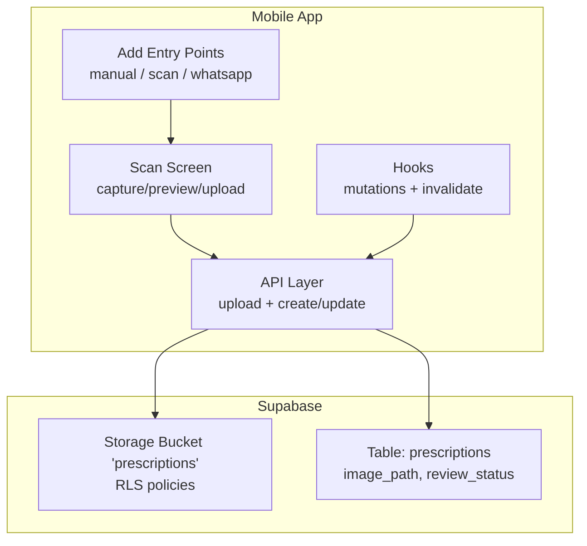
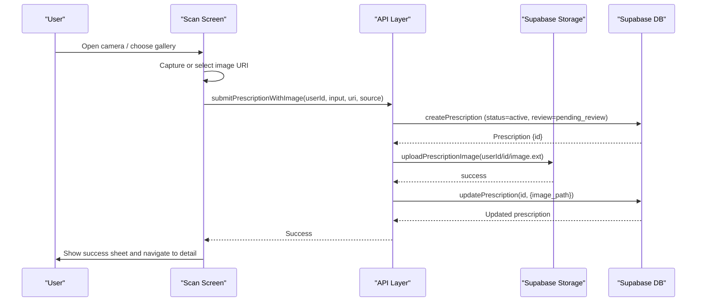
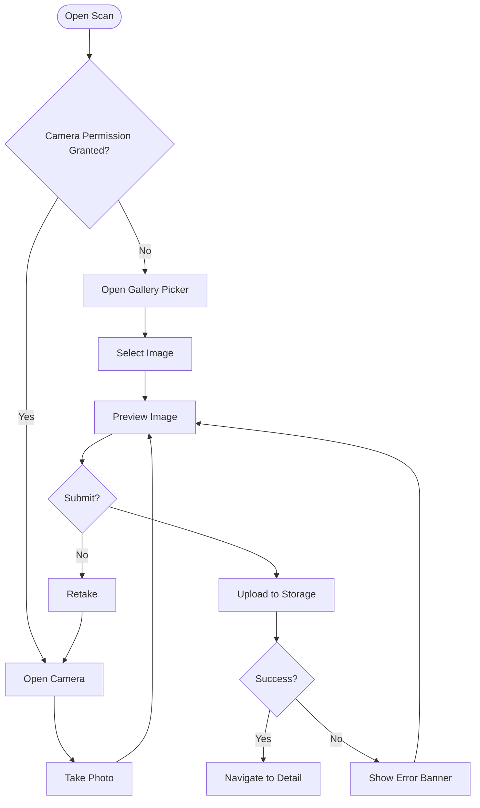
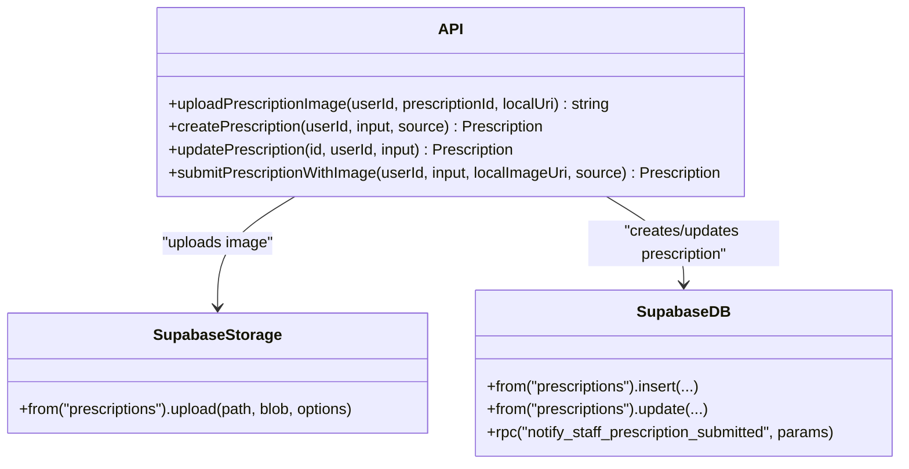
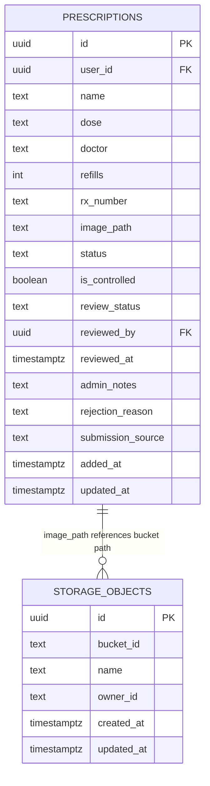
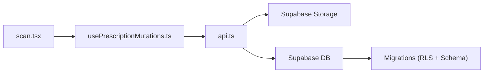

# Prescription Scanning & OCR

<cite>
**Referenced Files in This Document**
- [scan.tsx](file://apps/shopper-native/app/(customer)/prescriptions/scan.tsx)
- [api.ts](file://apps/shopper-native/src/features/prescriptions/api.ts)
- [usePrescriptionMutations.ts](file://apps/shopper-native/src/features/prescriptions/hooks/usePrescriptionMutations.ts)
- [add.tsx](file://apps/shopper-native/app/(customer)/prescriptions/add.tsx)
- [20260817100000_prescription_image_upload.sql](file://supabase/migrations/20260817100000_prescription_image_upload.sql)
- [20260705120000_prescriptions_admin_review.sql](file://supabase/migrations/20260705120000_prescriptions_admin_review.sql)
</cite>

## Table of Contents
1. Introduction
2. Project Structure
3. Core Components
4. Architecture Overview
5. Detailed Component Analysis
6. Dependency Analysis
7. Performance Considerations
8. Troubleshooting Guide
9. Conclusion

## Introduction
This document explains the prescription capture and submission workflow implemented in the mobile application. It covers how users capture or select a prescription image, preview it, securely upload it to Supabase Storage, create a prescription record, and route it into staff review. It also clarifies that on-device OCR is not used; instead, the app captures images and stores them for pharmacist review. The documentation includes data models, storage policies, error handling, retry strategies, accessibility considerations, and cross-platform compatibility notes for iOS and Android.

## Project Structure
The prescription scanning feature spans UI screens, API helpers, hooks, and database migrations:
- Customer-facing screens: Add entry points and the scan flow
- API layer: Secure image upload and prescription CRUD with Supabase
- Hooks: Mutation orchestration and cache invalidation
- Database: Storage bucket and RLS policies, plus staff review columns

**Diagram sources**
- [scan.tsx:34-118](file://apps/shopper-native/app/(customer)/prescriptions/scan.tsx#L34-L118)
- [api.ts:42-182](file://apps/shopper-native/src/features/prescriptions/api.ts#L42-L182)
- [usePrescriptionMutations.ts:21-55](file://apps/shopper-native/src/features/prescriptions/hooks/usePrescriptionMutations.ts#L21-L55)
- [20260817100000_prescription_image_upload.sql:17-75](file://supabase/migrations/20260817100000_prescription_image_upload.sql#L17-L75)
- [20260705120000_prescriptions_admin_review.sql:20-41](file://supabase/migrations/20260705120000_prescriptions_admin_review.sql#L20-L41)

**Section sources**
- [scan.tsx:34-118](file://apps/shopper-native/app/(customer)/prescriptions/scan.tsx#L34-L118)
- [api.ts:42-182](file://apps/shopper-native/src/features/prescriptions/api.ts#L42-L182)
- [usePrescriptionMutations.ts:21-55](file://apps/shopper-native/src/features/prescriptions/hooks/usePrescriptionMutations.ts#L21-L55)
- [add.tsx:143-181](file://apps/shopper-native/app/(customer)/prescriptions/add.tsx#L143-L181)
- [20260817100000_prescription_image_upload.sql:17-75](file://supabase/migrations/20260817100000_prescription_image_upload.sql#L17-L75)
- [20260705120000_prescriptions_admin_review.sql:20-41](file://supabase/migrations/20260705120000_prescriptions_admin_review.sql#L20-L41)

## Core Components
- Scan screen: Captures or selects an image, previews it, and submits securely to Supabase.
- API layer: Uploads images to a private bucket and creates/updates prescription records with secure scoping.
- Hooks: Wrap mutations and invalidate queries to keep UI in sync.
- Database: Adds image storage support and staff review workflow via RLS and columns.

Key responsibilities:
- Capture and preview: Camera/gallery selection, permission gating, and user feedback overlays.
- Secure upload: MIME detection, blob conversion, and path-based scoping by user ID.
- Data persistence: Create pending prescription, link image path, notify staff.
- Review pipeline: New submissions enter pending_review for pharmacist/admin review.

**Section sources**
- [scan.tsx:54-118](file://apps/shopper-native/app/(customer)/prescriptions/scan.tsx#L54-L118)
- [api.ts:23-66](file://apps/shopper-native/src/features/prescriptions/api.ts#L23-L66)
- [api.ts:75-109](file://apps/shopper-native/src/features/prescriptions/api.ts#L75-L109)
- [api.ts:158-182](file://apps/shopper-native/src/features/prescriptions/api.ts#L158-L182)
- [usePrescriptionMutations.ts:21-55](file://apps/shopper-native/src/features/prescriptions/hooks/usePrescriptionMutations.ts#L21-L55)
- [20260705120000_prescriptions_admin_review.sql:20-41](file://supabase/migrations/20260705120000_prescriptions_admin_review.sql#L20-L41)

## Architecture Overview
End-to-end flow from capture to staff review:

**Diagram sources**
- [scan.tsx:91-118](file://apps/shopper-native/app/(customer)/prescriptions/scan.tsx#L91-L118)
- [api.ts:158-182](file://apps/shopper-native/src/features/prescriptions/api.ts#L158-L182)
- [api.ts:75-109](file://apps/shopper-native/src/features/prescriptions/api.ts#L75-L109)
- [api.ts:42-66](file://apps/shopper-native/src/features/prescriptions/api.ts#L42-L66)

## Detailed Component Analysis

### Scan Screen (Capture, Preview, Submit)
- Permissions: Requests camera permissions; offers gallery fallback if denied.
- Capture: Uses device camera with quality settings; moves to preview on success.
- Preview: Displays captured image; shows uploading overlay during submission; supports retake.
- Submission: Calls the API to create a prescription and upload the image; displays success or error feedback.

**Diagram sources**
- [scan.tsx:47-118](file://apps/shopper-native/app/(customer)/prescriptions/scan.tsx#L47-L118)
- [scan.tsx:120-217](file://apps/shopper-native/app/(customer)/prescriptions/scan.tsx#L120-L217)

**Section sources**
- [scan.tsx:47-118](file://apps/shopper-native/app/(customer)/prescriptions/scan.tsx#L47-L118)
- [scan.tsx:120-217](file://apps/shopper-native/app/(customer)/prescriptions/scan.tsx#L120-L217)

### API Layer (Secure Upload and Prescription Management)
- Image upload: Detects MIME type from URI extension, converts local file to blob, uploads to a private bucket under userId/prescriptionId/image.ext.
- Prescription creation: Inserts a new row with status active and review_status pending_review; triggers staff notification RPC.
- Update: Links image_path back to the prescription after successful upload.
- Error handling: If upload fails, returns enriched error with prescriptionId for retry/cleanup.

**Diagram sources**
- [api.ts:23-66](file://apps/shopper-native/src/features/prescriptions/api.ts#L23-L66)
- [api.ts:75-109](file://apps/shopper-native/src/features/prescriptions/api.ts#L75-L109)
- [api.ts:125-147](file://apps/shopper-native/src/features/prescriptions/api.ts#L125-L147)
- [api.ts:158-182](file://apps/shopper-native/src/features/prescriptions/api.ts#L158-L182)

**Section sources**
- [api.ts:23-66](file://apps/shopper-native/src/features/prescriptions/api.ts#L23-L66)
- [api.ts:75-109](file://apps/shopper-native/src/features/prescriptions/api.ts#L75-L109)
- [api.ts:125-147](file://apps/shopper-native/src/features/prescriptions/api.ts#L125-L147)
- [api.ts:158-182](file://apps/shopper-native/src/features/prescriptions/api.ts#L158-L182)

### Hooks (Mutations and Cache Invalidation)
- Wraps create/update/delete operations using React Query.
- Invalidates the prescriptions query scoped by userId to refresh lists after mutations.
- Provides loading states and async mutation APIs to screens.

**Section sources**
- [usePrescriptionMutations.ts:21-55](file://apps/shopper-native/src/features/prescriptions/hooks/usePrescriptionMutations.ts#L21-L55)

### Database and Security (Storage and Review Workflow)
- Storage bucket: Private bucket named “prescriptions” with RLS ensuring users can only access their own files; staff roles can read all.
- Policies: Separate policies for customer upload, update, read, delete; staff read-all policy based on role lookup.
- Review workflow: Columns added to enable pending_review, approved, rejected statuses; staff-only updates; indexes for efficient queueing.

**Diagram sources**
- [20260817100000_prescription_image_upload.sql:10-75](file://supabase/migrations/20260817100000_prescription_image_upload.sql#L10-L75)
- [20260705120000_prescriptions_admin_review.sql:20-41](file://supabase/migrations/20260705120000_prescriptions_admin_review.sql#L20-L41)

**Section sources**
- [20260817100000_prescription_image_upload.sql:17-75](file://supabase/migrations/20260817100000_prescription_image_upload.sql#L17-L75)
- [20260705120000_prescriptions_admin_review.sql:20-41](file://supabase/migrations/20260705120000_prescriptions_admin_review.sql#L20-L41)

## Dependency Analysis
- UI depends on API for side effects and on hooks for state synchronization.
- API depends on Supabase client for storage and database operations.
- Migrations define schema and security boundaries that enforce isolation and staff access.

**Diagram sources**
- [scan.tsx:91-118](file://apps/shopper-native/app/(customer)/prescriptions/scan.tsx#L91-L118)
- [usePrescriptionMutations.ts:21-55](file://apps/shopper-native/src/features/prescriptions/hooks/usePrescriptionMutations.ts#L21-L55)
- [api.ts:42-182](file://apps/shopper-native/src/features/prescriptions/api.ts#L42-L182)
- [20260817100000_prescription_image_upload.sql:17-75](file://supabase/migrations/20260817100000_prescription_image_upload.sql#L17-L75)

**Section sources**
- [scan.tsx:91-118](file://apps/shopper-native/app/(customer)/prescriptions/scan.tsx#L91-L118)
- [usePrescriptionMutations.ts:21-55](file://apps/shopper-native/src/features/prescriptions/hooks/usePrescriptionMutations.ts#L21-L55)
- [api.ts:42-182](file://apps/shopper-native/src/features/prescriptions/api.ts#L42-L182)
- [20260817100000_prescription_image_upload.sql:17-75](file://supabase/migrations/20260817100000_prescription_image_upload.sql#L17-L75)

## Performance Considerations
- Image quality: The capture uses a moderate quality setting to balance clarity and upload size.
- Network resilience: The API throws descriptive errors on network failures; UI surfaces errors and allows retries.
- Storage efficiency: Images are stored per prescription under a user-scoped path to minimize contention and simplify cleanup.
- Query invalidation: After mutations, queries are invalidated to avoid stale lists and reduce redundant fetches.

[No sources needed since this section provides general guidance]

## Troubleshooting Guide
Common issues and resolutions:
- Camera permission denied: Prompt user to grant permission or use gallery picker.
- Gallery permission denied: Request media library permissions before launching picker.
- Upload failure: Display error banner; preserve prescription record for retry; include prescriptionId in error context.
- Poor-quality scans: Encourage retake with guide overlay; ensure adequate lighting and framing.
- Staff visibility: Ensure submission enters pending_review; verify RLS policies allow staff read access.

Error handling highlights:
- UI-level errors: Shown via banners and sheets; user can retake or retry.
- API-level errors: Enriched with prescriptionId and original error for diagnostics.
- Notification failures: Non-blocking warnings logged in development mode.

**Section sources**
- [scan.tsx:68-83](file://apps/shopper-native/app/(customer)/prescriptions/scan.tsx#L68-L83)
- [scan.tsx:113-118](file://apps/shopper-native/app/(customer)/prescriptions/scan.tsx#L113-L118)
- [api.ts:51-66](file://apps/shopper-native/src/features/prescriptions/api.ts#L51-L66)
- [api.ts:173-182](file://apps/shopper-native/src/features/prescriptions/api.ts#L173-L182)
- [20260705120000_prescriptions_admin_review.sql:63-75](file://supabase/migrations/20260705120000_prescriptions_admin_review.sql#L63-L75)

## Conclusion
The prescription scanning feature focuses on secure image capture and submission rather than on-device OCR. Users can capture or select images, preview them, and submit them to a private Supabase Storage bucket. Prescriptions are created with a pending_review status and linked to the uploaded image. Staff can review submissions through role-gated access. The implementation emphasizes security, clear user feedback, and robust error handling to support reliable cross-platform operation on iOS and Android.

[No sources needed since this section summarizes without analyzing specific files]