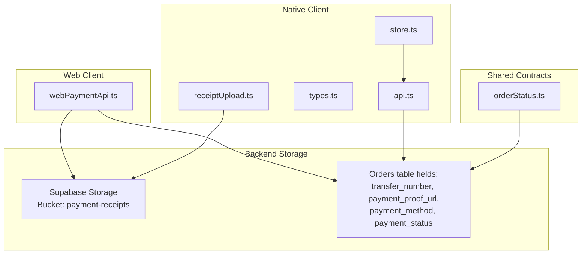
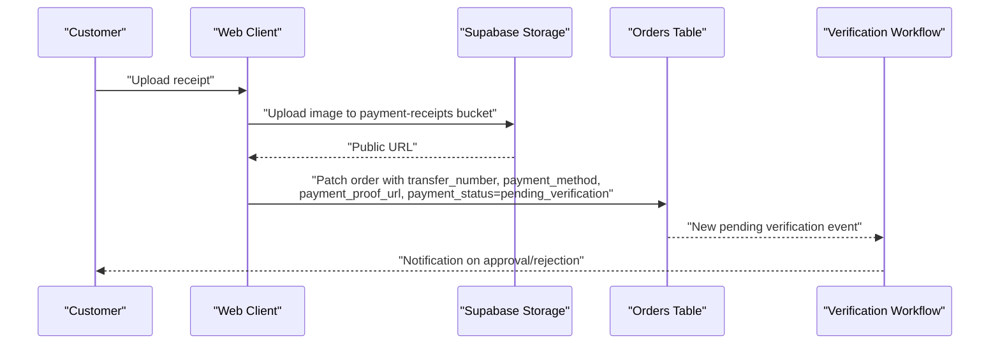
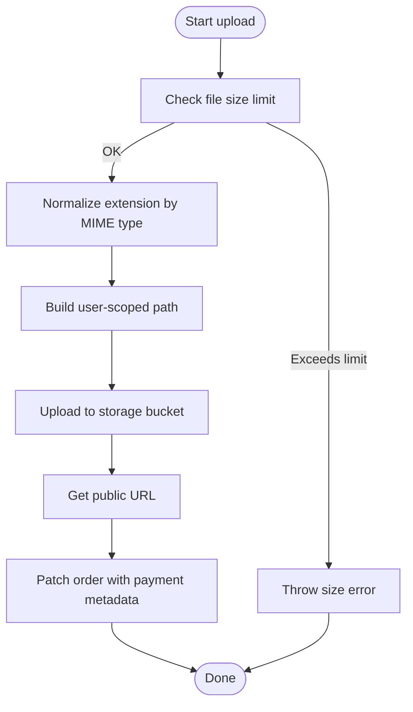
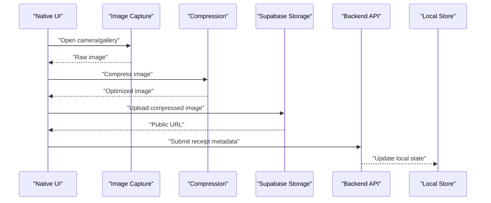
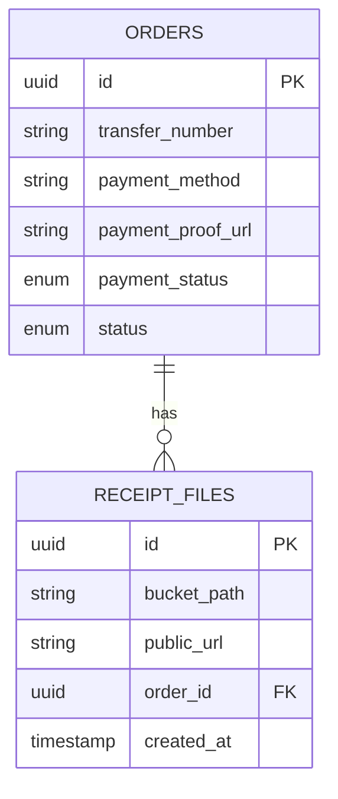
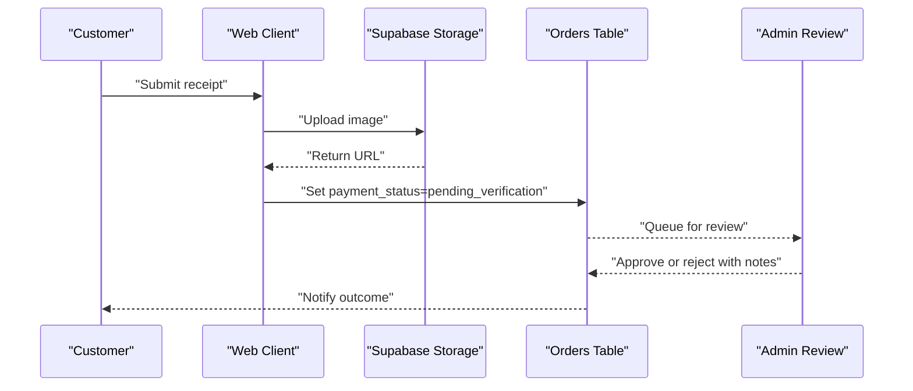
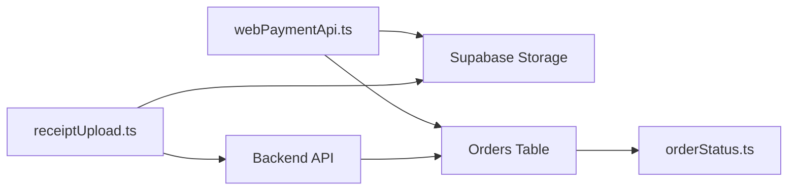

# Receipt Capture & Processing

<cite>
**Referenced Files in This Document**
- [webPaymentApi.ts](file://apps/shopper-web/src/services/webPaymentApi.ts)
- [receiptUpload.ts](file://apps/shopper-native/src/features/payment/receiptUpload.ts)
- [payment types.ts](file://apps/shopper-native/src/features/payment/types.ts)
- [payment store.ts](file://apps/shopper-native/src/features/payment/store.ts)
- [payment api.ts](file://apps/shopper-native/src/features/payment/api.ts)
- [order status contract](file://packages/contracts/src/orderStatus.ts)
- [supabase migrations (prescription image upload)](file://supabase/migrations/20260817100000_prescription_image_upload.sql)
</cite>

## Table of Contents
1. Introduction
2. Project Structure
3. Core Components
4. Architecture Overview
5. Detailed Component Analysis
6. Dependency Analysis
7. Performance Considerations
8. Troubleshooting Guide
9. Conclusion

## Introduction
This document explains the receipt capture and processing workflows for manual payment verification where customers upload receipts as proof of payment. It covers:
- How receipts are captured on web and native apps
- Image handling and compression strategies to optimize uploads while preserving readability
- Validation and extraction of key receipt data (amounts, dates, merchant details)
- Integration with backend services and payment verification systems
- Fraud detection mechanisms and audit trail generation
- Privacy considerations and compliance guidance for sensitive financial data

## Project Structure
Receipt-related functionality spans multiple layers:
- Web client service for uploading receipts and patching order payment metadata
- Native app features for capturing images, compressing them, and submitting proofs
- Shared contracts for order statuses used across flows
- Database migrations that enable image storage patterns

**Diagram sources**
- [webPaymentApi.ts:1-76](file://apps/shopper-web/src/services/webPaymentApi.ts#L1-L76)
- [receiptUpload.ts](file://apps/shopper-native/src/features/payment/receiptUpload.ts)
- [payment types.ts](file://apps/shopper-native/src/features/payment/types.ts)
- [payment store.ts](file://apps/shopper-native/src/features/payment/store.ts)
- [payment api.ts](file://apps/shopper-native/src/features/payment/api.ts)
- [order status contract](file://packages/contracts/src/orderStatus.ts)

**Section sources**
- [webPaymentApi.ts:1-76](file://apps/shopper-web/src/services/webPaymentApi.ts#L1-L76)
- [receiptUpload.ts](file://apps/shopper-native/src/features/payment/receiptUpload.ts)
- [payment types.ts](file://apps/shopper-native/src/features/payment/types.ts)
- [payment store.ts](file://apps/shopper-native/src/features/payment/store.ts)
- [payment api.ts](file://apps/shopper-native/src/features/payment/api.ts)
- [order status contract](file://packages/contracts/src/orderStatus.ts)

## Core Components
- Web payment API service
  - Uploads receipt images to a dedicated storage bucket
  - Patches order records with transfer number, payment method, and pending verification status
- Native receipt upload feature
  - Captures or selects images from device storage
  - Compresses images before upload to reduce bandwidth and improve performance
  - Persists receipt metadata via shared APIs and stores
- Shared order status contract
  - Defines canonical statuses such as pending verification for manual payments
- Database schema support
  - Migrations demonstrate image upload patterns and storage usage

Key responsibilities:
- Client-side validation and size limits
- Secure storage of receipts per user
- Reliable persistence of payment metadata
- Clear state transitions into verification queues

**Section sources**
- [webPaymentApi.ts:1-76](file://apps/shopper-web/src/services/webPaymentApi.ts#L1-L76)
- [receiptUpload.ts](file://apps/shopper-native/src/features/payment/receiptUpload.ts)
- [payment types.ts](file://apps/shopper-native/src/features/payment/types.ts)
- [payment store.ts](file://apps/shopper-native/src/features/payment/store.ts)
- [payment api.ts](file://apps/shopper-native/src/features/payment/api.ts)
- [order status contract](file://packages/contracts/src/orderStatus.ts)

## Architecture Overview
The end-to-end flow for manual payment verification involves:
- Customer captures or selects a receipt image
- App compresses and validates the image
- Image is uploaded to secure storage
- Order record is updated with payment metadata and set to pending verification
- Backend verification workflow reviews and approves or rejects

**Diagram sources**
- [webPaymentApi.ts:1-76](file://apps/shopper-web/src/services/webPaymentApi.ts#L1-L76)

## Detailed Component Analysis

### Web Payment Service
Responsibilities:
- Enforce file size limits before upload
- Normalize file extension based on MIME type
- Upload to a user-scoped path in storage
- Patch order fields to reflect manual payment and pending verification

**Diagram sources**
- [webPaymentApi.ts:1-76](file://apps/shopper-web/src/services/webPaymentApi.ts#L1-L76)

**Section sources**
- [webPaymentApi.ts:1-76](file://apps/shopper-web/src/services/webPaymentApi.ts#L1-L76)

### Native Receipt Upload Feature
Responsibilities:
- Capture or select an image from device storage
- Compress image to balance quality and upload speed
- Persist receipt metadata and update UI state
- Call backend APIs to finalize submission

**Diagram sources**
- [receiptUpload.ts](file://apps/shopper-native/src/features/payment/receiptUpload.ts)
- [payment store.ts](file://apps/shopper-native/src/features/payment/store.ts)
- [payment api.ts](file://apps/shopper-native/src/features/payment/api.ts)

**Section sources**
- [receiptUpload.ts](file://apps/shopper-native/src/features/payment/receiptUpload.ts)
- [payment store.ts](file://apps/shopper-native/src/features/payment/store.ts)
- [payment api.ts](file://apps/shopper-native/src/features/payment/api.ts)

### Data Models and Statuses
- Order statuses include states indicating manual payment awaiting review
- Receipts are stored with references back to orders
- Fields typically include transfer number, payment method, and proof URL

**Diagram sources**
- [webPaymentApi.ts:1-76](file://apps/shopper-web/src/services/webPaymentApi.ts#L1-L76)
- [supabase migrations (prescription image upload)](file://supabase/migrations/20260817100000_prescription_image_upload.sql)

**Section sources**
- [order status contract](file://packages/contracts/src/orderStatus.ts)
- [webPaymentApi.ts:1-76](file://apps/shopper-web/src/services/webPaymentApi.ts#L1-L76)
- [supabase migrations (prescription image upload)](file://supabase/migrations/20260817100000_prescription_image_upload.sql)

### Manual Payment Verification Process
End-to-end sequence from upload to verification decision:

**Diagram sources**
- [webPaymentApi.ts:1-76](file://apps/shopper-web/src/services/webPaymentApi.ts#L1-L76)

**Section sources**
- [webPaymentApi.ts:1-76](file://apps/shopper-web/src/services/webPaymentApi.ts#L1-L76)

## Dependency Analysis
- Web payment service depends on:
  - Supabase storage for receipt images
  - Orders table for payment metadata updates
- Native receipt upload depends on:
  - Compression utilities
  - Local state management
  - Backend APIs for finalizing submissions
- Shared order status contract ensures consistent lifecycle states across clients

**Diagram sources**
- [webPaymentApi.ts:1-76](file://apps/shopper-web/src/services/webPaymentApi.ts#L1-L76)
- [receiptUpload.ts](file://apps/shopper-native/src/features/payment/receiptUpload.ts)
- [payment api.ts](file://apps/shopper-native/src/features/payment/api.ts)
- [order status contract](file://packages/contracts/src/orderStatus.ts)

**Section sources**
- [webPaymentApi.ts:1-76](file://apps/shopper-web/src/services/webPaymentApi.ts#L1-L76)
- [receiptUpload.ts](file://apps/shopper-native/src/features/payment/receiptUpload.ts)
- [payment api.ts](file://apps/shopper-native/src/features/payment/api.ts)
- [order status contract](file://packages/contracts/src/orderStatus.ts)

## Performance Considerations
- Image compression
  - Reduce resolution and apply lossy compression to minimize payload size
  - Target a balance between readability and upload speed
- File size limits
  - Enforce maximum file size at the client to avoid unnecessary network overhead
- Bandwidth optimization
  - Use progressive loading previews and lazy uploads when possible
- Storage efficiency
  - Organize files by user and timestamp to simplify cleanup and access control
- Concurrency
  - Avoid duplicate uploads by using deterministic paths and upsert controls

[No sources needed since this section provides general guidance]

## Troubleshooting Guide
Common issues and resolutions:
- Upload fails due to large file size
  - Ensure client enforces size limits and compresses images before upload
- Storage permission errors
  - Verify storage bucket permissions and user-scoped paths
- Order patch fails
  - Confirm order exists and fields match expected schema
  - Validate user has permission to update order payment metadata
- Verification delays
  - Check queue for pending verification items and notify admins

Error handling patterns:
- Throw descriptive errors on size violations and storage failures
- Update order status consistently to reflect current state
- Log errors with context for debugging

**Section sources**
- [webPaymentApi.ts:1-76](file://apps/shopper-web/src/services/webPaymentApi.ts#L1-L76)

## Conclusion
The receipt capture and processing workflow integrates client-side image handling with secure storage and reliable order metadata updates. By enforcing size limits, compressing images, and standardizing statuses, the system supports efficient manual payment verification. Future enhancements can include automated receipt parsing, enhanced fraud detection signals, and comprehensive audit logging to strengthen compliance and operational visibility.

[No sources needed since this section summarizes without analyzing specific files]