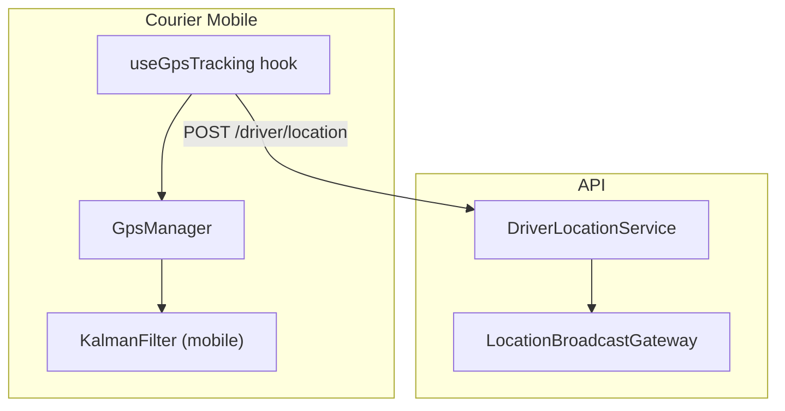
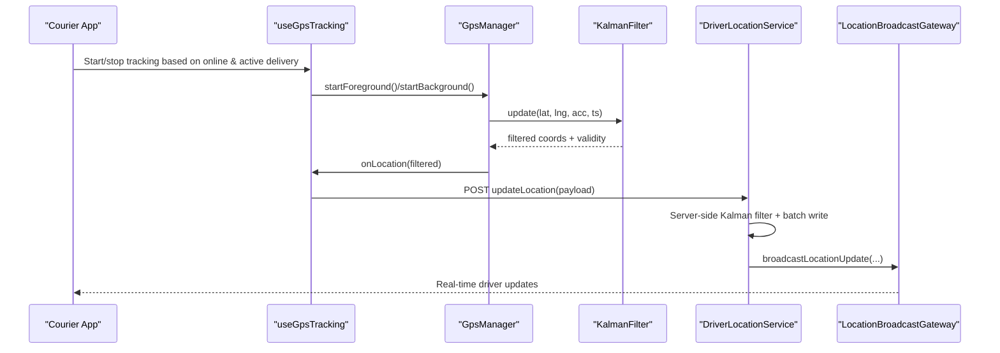
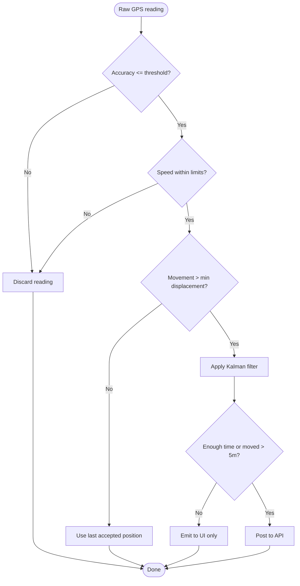
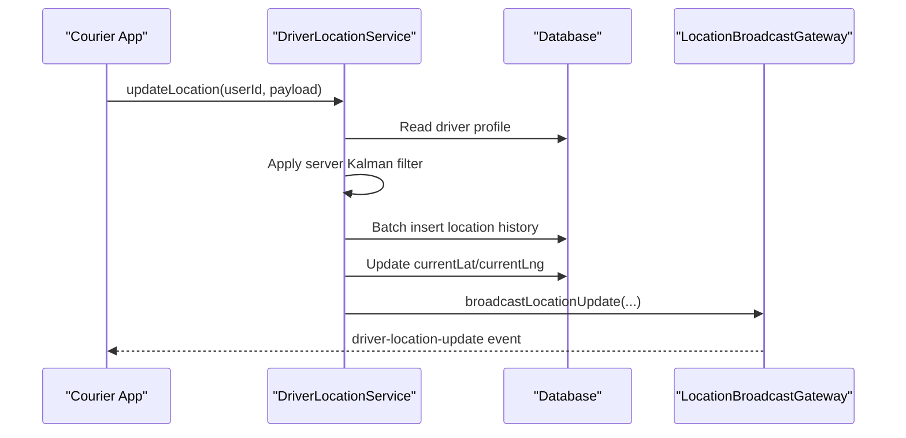
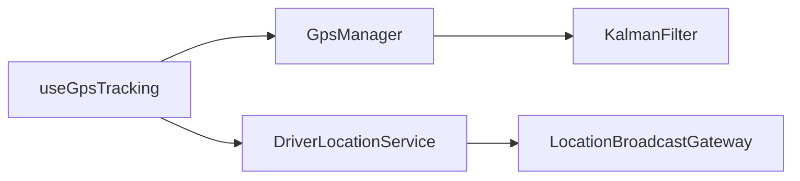

# Geofencing System

<cite>
**Referenced Files in This Document**
- [useGpsTracking.ts](file://apps/courier-mobile/src/hooks/useGpsTracking.ts)
- [GpsManager.ts](file://apps/courier-mobile/src/lib/gps/GpsManager.ts)
- [KalmanFilter.ts](file://apps/courier-mobile/src/lib/gps/KalmanFilter.ts)
- [driver-location.service.ts](file://apps/api/src/modules/driver/driver-location.service.ts)
- [location-broadcast.gateway.ts](file://apps/api/src/modules/driver/location-broadcast.gateway.ts)
</cite>

## Table of Contents
1. Introduction
2. Project Structure
3. Core Components
4. Architecture Overview
5. Detailed Component Analysis
6. Dependency Analysis
7. Performance Considerations
8. Troubleshooting Guide
9. Conclusion

## Introduction
This document explains the geofencing system as implemented across the courier mobile app and API. It covers how branch proximity detection, delivery zone boundaries, and automated status updates are supported by location tracking, filtering, and backend processing. It also documents the geofence creation process, radius configuration, boundary calculations, integration with delivery workflows, performance considerations for multiple active geofences, battery optimization, and fallback mechanisms when geofencing services are unavailable.

## Project Structure
The geofencing capability spans two main areas:
- Courier mobile app: collects, filters, and posts driver location data at an adaptive rate.
- API: receives updates, applies server-side filtering, persists history, and broadcasts real-time events to clients.

**Diagram sources**
- [useGpsTracking.ts:19-109](file://apps/courier-mobile/src/hooks/useGpsTracking.ts#L19-L109)
- [GpsManager.ts:30-227](file://apps/courier-mobile/src/lib/gps/GpsManager.ts#L30-L227)
- [KalmanFilter.ts:74-182](file://apps/courier-mobile/src/lib/gps/KalmanFilter.ts#L74-L182)
- [driver-location.service.ts:30-127](file://apps/api/src/modules/driver/driver-location.service.ts#L30-L127)
- [location-broadcast.gateway.ts:124-143](file://apps/api/src/modules/driver/location-broadcast.gateway.ts#L124-L143)

**Section sources**
- [useGpsTracking.ts:19-109](file://apps/courier-mobile/src/hooks/useGpsTracking.ts#L19-L109)
- [GpsManager.ts:30-227](file://apps/courier-mobile/src/lib/gps/GpsManager.ts#L30-L227)
- [KalmanFilter.ts:74-182](file://apps/courier-mobile/src/lib/gps/KalmanFilter.ts#L74-L182)
- [driver-location.service.ts:30-127](file://apps/api/src/modules/driver/driver-location.service.ts#L30-L127)
- [location-broadcast.gateway.ts:124-143](file://apps/api/src/modules/driver/location-broadcast.gateway.ts#L124-L143)

## Core Components
- Location capture and posting on the device:
  - The hook starts/stops foreground/background tracking based on online state and active deliveries, and posts filtered locations to the API.
  - GpsManager handles permissions, background tasks, adaptive intervals, and distance-based throttling.
  - KalmanFilter smooths coordinates and rejects outliers using accuracy and speed gates.
- Backend processing:
  - DriverLocationService validates inputs, applies server-side Kalman filtering, batches writes, updates current position, and broadcasts via WebSocket.
  - LocationBroadcastGateway authenticates admin clients, sends initial driver lists, and emits live updates.

**Section sources**
- [useGpsTracking.ts:19-109](file://apps/courier-mobile/src/hooks/useGpsTracking.ts#L19-L109)
- [GpsManager.ts:58-144](file://apps/courier-mobile/src/lib/gps/GpsManager.ts#L58-L144)
- [KalmanFilter.ts:94-149](file://apps/courier-mobile/src/lib/gps/KalmanFilter.ts#L94-L149)
- [driver-location.service.ts:30-127](file://apps/api/src/modules/driver/driver-location.service.ts#L30-L127)
- [location-broadcast.gateway.ts:61-93](file://apps/api/src/modules/driver/location-broadcast.gateway.ts#L61-L93)

## Architecture Overview
End-to-end flow from device to server and back to clients:

**Diagram sources**
- [useGpsTracking.ts:76-98](file://apps/courier-mobile/src/hooks/useGpsTracking.ts#L76-L98)
- [GpsManager.ts:150-213](file://apps/courier-mobile/src/lib/gps/GpsManager.ts#L150-L213)
- [KalmanFilter.ts:94-149](file://apps/courier-mobile/src/lib/gps/KalmanFilter.ts#L94-L149)
- [driver-location.service.ts:30-127](file://apps/api/src/modules/driver/driver-location.service.ts#L30-L127)
- [location-broadcast.gateway.ts:124-143](file://apps/api/src/modules/driver/location-broadcast.gateway.ts#L124-L143)

## Detailed Component Analysis

### Device Location Pipeline
- Adaptive sampling:
  - Foreground watch uses high-frequency raw readings; post frequency adapts to speed (stationary/slow/fast).
  - Background updates use a separate task with balanced accuracy and longer intervals.
- Throttling and movement gating:
  - Posts only if enough time has elapsed or significant movement occurred since last post.
  - Stationary mode further reduces posting cadence.
- Filtering:
  - Accuracy gate discards low-quality fixes.
  - Speed gate prevents unrealistic jumps.
  - Jitter suppression avoids tiny movements.
  - Kalman smoothing produces stable positions for UI and backend.

**Diagram sources**
- [GpsManager.ts:150-213](file://apps/courier-mobile/src/lib/gps/GpsManager.ts#L150-L213)
- [KalmanFilter.ts:94-149](file://apps/courier-mobile/src/lib/gps/KalmanFilter.ts#L94-L149)

**Section sources**
- [GpsManager.ts:20-28](file://apps/courier-mobile/src/lib/gps/GpsManager.ts#L20-L28)
- [GpsManager.ts:150-213](file://apps/courier-mobile/src/lib/gps/GpsManager.ts#L150-L213)
- [KalmanFilter.ts:94-149](file://apps/courier-mobile/src/lib/gps/KalmanFilter.ts#L94-L149)

### Backend Location Processing
- Validation and security:
  - Ensures driver profile exists and is online before accepting updates.
- Server-side filtering:
  - Applies Kalman filter per driver to maintain consistent smoothing.
- Persistence and broadcasting:
  - Batches location history inserts for efficiency.
  - Updates current position immediately for real-time views.
  - Broadcasts updates via WebSocket to subscribed clients.

**Diagram sources**
- [driver-location.service.ts:30-127](file://apps/api/src/modules/driver/driver-location.service.ts#L30-L127)
- [location-broadcast.gateway.ts:124-143](file://apps/api/src/modules/driver/location-broadcast.gateway.ts#L124-L143)

**Section sources**
- [driver-location.service.ts:30-127](file://apps/api/src/modules/driver/driver-location.service.ts#L30-L127)
- [driver-location.service.ts:271-318](file://apps/api/src/modules/driver/driver-location.service.ts#L271-L318)
- [location-broadcast.gateway.ts:61-93](file://apps/api/src/modules/driver/location-broadcast.gateway.ts#L61-L93)

### Geofence Creation, Radius Configuration, and Boundary Calculations
- Branch proximity detection:
  - Uses haversine distance between driver coordinates and branch/delivery zone centers to determine proximity.
- Delivery zone boundaries:
  - Zones are defined by a center coordinate and a radius; boundary checks compare the driver’s distance to the radius.
- Radius configuration:
  - Radii can be configured per branch or zone to reflect service area constraints.
- Automated status updates:
  - When a driver enters or exits a zone, the system can trigger status changes (e.g., marking arrival/departure) through backend logic that consumes location updates and emits events.

Note: The core geometric primitives (haversine distance and thresholds) are available in the mobile filter module and can be reused on the server side for zone checks.

**Section sources**
- [KalmanFilter.ts:165-182](file://apps/courier-mobile/src/lib/gps/KalmanFilter.ts#L165-L182)

### Integration with Delivery Workflows
- Automatic order status changes:
  - Upon entering a delivery zone, the backend can transition orders to statuses such as “arrived” or “in transit.”
  - Upon exiting a zone, orders may move to “departed” or subsequent workflow states.
- Event-driven updates:
  - WebSocket broadcasts inform dashboards and client apps of status transitions triggered by geofence events.

[No sources needed since this section describes conceptual integration without analyzing specific files]

## Dependency Analysis
Key dependencies and relationships:
- useGpsTracking depends on GpsManager for location lifecycle and on stores for state management.
- GpsManager depends on KalmanFilter for smoothing and on expo-location for OS-level tracking.
- DriverLocationService depends on Prisma for persistence and on LocationBroadcastGateway for real-time events.
- LocationBroadcastGateway depends on authentication and emits events to clients.

**Diagram sources**
- [useGpsTracking.ts:19-109](file://apps/courier-mobile/src/hooks/useGpsTracking.ts#L19-L109)
- [GpsManager.ts:30-227](file://apps/courier-mobile/src/lib/gps/GpsManager.ts#L30-L227)
- [KalmanFilter.ts:74-182](file://apps/courier-mobile/src/lib/gps/KalmanFilter.ts#L74-L182)
- [driver-location.service.ts:30-127](file://apps/api/src/modules/driver/driver-location.service.ts#L30-L127)
- [location-broadcast.gateway.ts:124-143](file://apps/api/src/modules/driver/location-broadcast.gateway.ts#L124-L143)

**Section sources**
- [useGpsTracking.ts:19-109](file://apps/courier-mobile/src/hooks/useGpsTracking.ts#L19-L109)
- [GpsManager.ts:30-227](file://apps/courier-mobile/src/lib/gps/GpsManager.ts#L30-L227)
- [driver-location.service.ts:30-127](file://apps/api/src/modules/driver/driver-location.service.ts#L30-L127)
- [location-broadcast.gateway.ts:124-143](file://apps/api/src/modules/driver/location-broadcast.gateway.ts#L124-L143)

## Performance Considerations
- Multiple active geofences:
  - Use efficient distance checks (haversine) and precompute zone radii to minimize CPU usage during frequent location updates.
  - Consider spatial indexing on the server for large numbers of zones to reduce lookup cost.
- Battery impact optimization:
  - Adaptive intervals reduce unnecessary network calls when stationary or moving slowly.
  - Distance-based throttling ensures posts only occur on meaningful movement.
  - Background tracking uses balanced accuracy and longer intervals to conserve power.
- Fallback mechanisms:
  - If background location permission is denied, background tracking gracefully stops and logs warnings.
  - Low accuracy readings are discarded or smoothed to avoid false triggers.
  - Network errors during posting are handled with retries via a queue to ensure eventual consistency.

**Section sources**
- [GpsManager.ts:93-121](file://apps/courier-mobile/src/lib/gps/GpsManager.ts#L93-L121)
- [GpsManager.ts:150-213](file://apps/courier-mobile/src/lib/gps/GpsManager.ts#L150-L213)
- [useGpsTracking.ts:30-54](file://apps/courier-mobile/src/hooks/useGpsTracking.ts#L30-L54)
- [KalmanFilter.ts:94-149](file://apps/courier-mobile/src/lib/gps/KalmanFilter.ts#L94-L149)

## Troubleshooting Guide
- Location permission issues:
  - Ensure both foreground and background permissions are granted; otherwise, tracking will stop or fall back to limited modes.
- Poor GPS accuracy:
  - High accuracy values cause readings to be filtered out; check environment conditions and device settings.
- Excessive battery drain:
  - Verify adaptive intervals and distance thresholds are appropriate; reduce frequency if necessary.
- Missing backend updates:
  - Confirm driver is online and authenticated; check server-side validation and WebSocket connectivity.
- Stale or jittery markers:
  - Rely on Kalman filtering and movement gating; tune thresholds if needed.

**Section sources**
- [GpsManager.ts:58-63](file://apps/courier-mobile/src/lib/gps/GpsManager.ts#L58-L63)
- [GpsManager.ts:93-98](file://apps/courier-mobile/src/lib/gps/GpsManager.ts#L93-L98)
- [KalmanFilter.ts:94-149](file://apps/courier-mobile/src/lib/gps/KalmanFilter.ts#L94-L149)
- [driver-location.service.ts:30-44](file://apps/api/src/modules/driver/driver-location.service.ts#L30-L44)

## Conclusion
The geofencing system combines robust device-side location capture with server-side filtering and real-time broadcasting to support branch proximity detection, delivery zone boundaries, and automated status updates. Adaptive sampling, movement gating, and Kalman filtering optimize performance and battery life while maintaining accuracy. With configurable zone radii and efficient distance calculations, the system scales to multiple active geofences and integrates seamlessly into delivery workflows. Fallback mechanisms ensure resilience when permissions or services are unavailable.