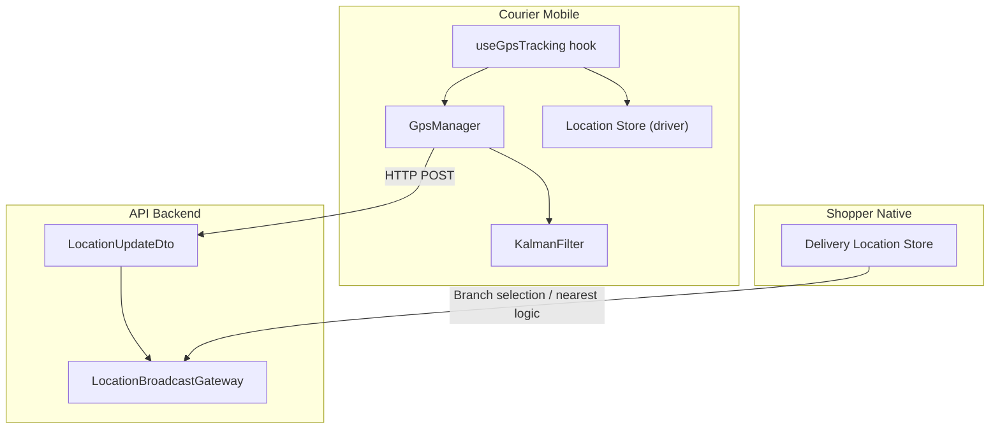
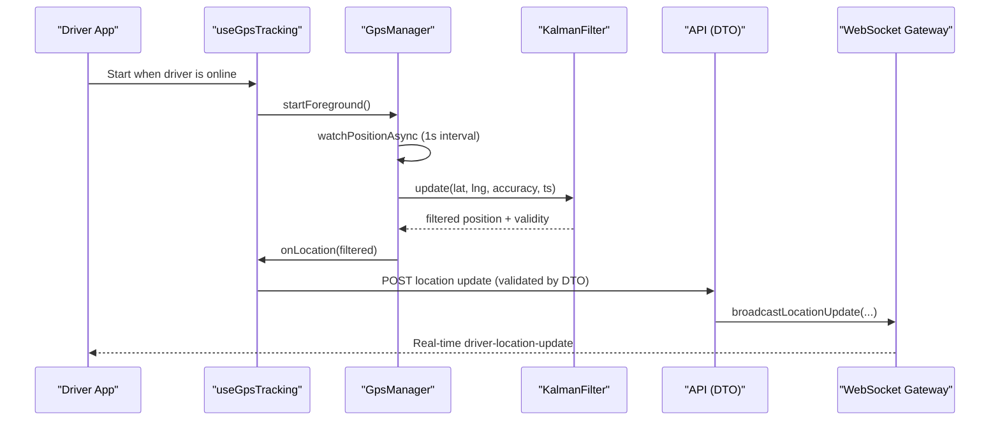
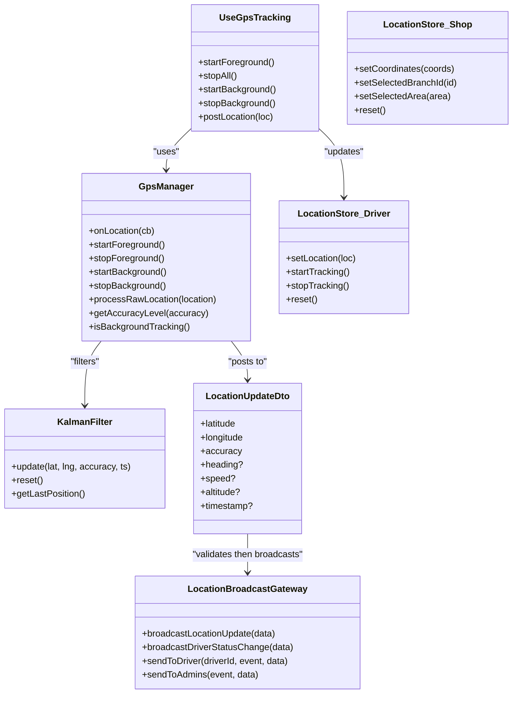

# Location Services & GPS Tracking

<cite>
**Referenced Files in This Document**
- [useGpsTracking.ts](file://apps/courier-mobile/src/hooks/useGpsTracking.ts)
- [location.store.ts](file://apps/courier-mobile/src/stores/location.store.ts)
- [GpsManager.ts](file://apps/courier-mobile/src/lib/gps/GpsManager.ts)
- [KalmanFilter.ts](file://apps/courier-mobile/src/lib/gps/KalmanFilter.ts)
- [location-broadcast.gateway.ts](file://apps/api/src/modules/driver/location-broadcast.gateway.ts)
- [location-update.dto.ts](file://apps/api/src/modules/driver/dto/location-update.dto.ts)
- [locationStore.ts](file://apps/shopper-native/src/features/delivery/locationStore.ts)
</cite>

## Table of Contents
1. Introduction
2. Project Structure
3. Core Components
4. Architecture Overview
5. Detailed Component Analysis
6. Dependency Analysis
7. Performance Considerations
8. Troubleshooting Guide
9. Conclusion

## Introduction
This document explains the location services and GPS tracking implementation across the mobile applications, focusing on real-time driver location updates, background tracking, foreground service management, battery optimization, geofencing-related proximity detection, and the location store architecture for user and driver locations. It also covers platform-specific considerations for iOS and Android, permission handling, accuracy optimization, privacy and data retention, and offline caching strategies.

## Project Structure
The location system spans three main areas:
- Courier mobile app (driver): collects, filters, and posts driver locations; manages foreground/background tracking; persists current state locally.
- Shopper native app (customer/branch context): stores last-known coordinates, selected branch, and area for delivery routing and pricing.
- API backend: validates incoming location updates and broadcasts them via WebSocket to clients such as admin dashboards or order tracking UIs.

**Diagram sources**
- [useGpsTracking.ts:1-110](file://apps/courier-mobile/src/hooks/useGpsTracking.ts#L1-L110)
- [GpsManager.ts:1-245](file://apps/courier-mobile/src/lib/gps/GpsManager.ts#L1-L245)
- [KalmanFilter.ts:1-182](file://apps/courier-mobile/src/lib/gps/KalmanFilter.ts#L1-L182)
- [location.store.ts:1-44](file://apps/courier-mobile/src/stores/location.store.ts#L1-L44)
- [locationStore.ts:1-101](file://apps/shopper-native/src/features/delivery/locationStore.ts#L1-L101)
- [location-update.dto.ts:1-36](file://apps/api/src/modules/driver/dto/location-update.dto.ts#L1-L36)
- [location-broadcast.gateway.ts:1-214](file://apps/api/src/modules/driver/location-broadcast.gateway.ts#L1-L214)

**Section sources**
- [useGpsTracking.ts:1-110](file://apps/courier-mobile/src/hooks/useGpsTracking.ts#L1-L110)
- [GpsManager.ts:1-245](file://apps/courier-mobile/src/lib/gps/GpsManager.ts#L1-L245)
- [KalmanFilter.ts:1-182](file://apps/courier-mobile/src/lib/gps/KalmanFilter.ts#L1-L182)
- [location.store.ts:1-44](file://apps/courier-mobile/src/stores/location.store.ts#L1-L44)
- [locationStore.ts:1-101](file://apps/shopper-native/src/features/delivery/locationStore.ts#L1-L101)
- [location-update.dto.ts:1-36](file://apps/api/src/modules/driver/dto/location-update.dto.ts#L1-L36)
- [location-broadcast.gateway.ts:1-214](file://apps/api/src/modules/driver/location-broadcast.gateway.ts#L1-L214)

## Core Components
- Driver location hook: orchestrates starting/stopping foreground and background tracking based on driver online status and active deliveries; queues and posts filtered locations; keeps UI state synchronized.
- GpsManager: centralizes location permissions, foreground/background watching, adaptive posting intervals, Kalman filtering, and background task registration.
- KalmanFilter: smooths lat/lng readings, applies accuracy and speed gates, suppresses jitter, and returns valid filtered positions.
- Driver location store: lightweight in-memory state for current driver position, tracking flags, and timestamps.
- Shopper delivery location store: persisted coordinates, selected branch, and area used for delivery routing and pricing.
- API validation and broadcasting: validates incoming location payloads and emits real-time updates to subscribers.

**Section sources**
- [useGpsTracking.ts:1-110](file://apps/courier-mobile/src/hooks/useGpsTracking.ts#L1-L110)
- [GpsManager.ts:1-245](file://apps/courier-mobile/src/lib/gps/GpsManager.ts#L1-L245)
- [KalmanFilter.ts:1-182](file://apps/courier-mobile/src/lib/gps/KalmanFilter.ts#L1-L182)
- [location.store.ts:1-44](file://apps/courier-mobile/src/stores/location.store.ts#L1-L44)
- [locationStore.ts:1-101](file://apps/shopper-native/src/features/delivery/locationStore.ts#L1-L101)
- [location-update.dto.ts:1-36](file://apps/api/src/modules/driver/dto/location-update.dto.ts#L1-L36)
- [location-broadcast.gateway.ts:1-214](file://apps/api/src/modules/driver/location-broadcast.gateway.ts#L1-L214)

## Architecture Overview
The system uses a layered approach:
- Sensor layer: Expo Location provides raw GPS updates with configurable accuracy and intervals.
- Processing layer: GpsManager applies Kalman smoothing, accuracy/speed gating, and adaptive posting intervals to reduce network calls and battery usage.
- State layer: In-app stores keep current driver and shopper location states reactive to UI changes.
- Network layer: HTTP requests send validated location updates to the API; WebSocket events broadcast live updates to clients.

**Diagram sources**
- [useGpsTracking.ts:1-110](file://apps/courier-mobile/src/hooks/useGpsTracking.ts#L1-L110)
- [GpsManager.ts:1-245](file://apps/courier-mobile/src/lib/gps/GpsManager.ts#L1-L245)
- [KalmanFilter.ts:1-182](file://apps/courier-mobile/src/lib/gps/KalmanFilter.ts#L1-L182)
- [location-update.dto.ts:1-36](file://apps/api/src/modules/driver/dto/location-update.dto.ts#L1-L36)
- [location-broadcast.gateway.ts:1-214](file://apps/api/src/modules/driver/location-broadcast.gateway.ts#L1-L214)

## Detailed Component Analysis

### Driver Location Hook (useGpsTracking)
Responsibilities:
- Starts foreground tracking when the driver is online; stops when offline.
- Starts background tracking during an active delivery; stops when not active.
- Subscribes to filtered location updates and posts them to the backend using a queue to avoid concurrent writes.
- Maintains stable callbacks to prevent stale closures.

Key behaviors:
- Foreground vs background transitions are driven by app state and delivery status.
- A post queue ensures only one request at a time; subsequent locations are queued and sent after completion.
- AppState listener resumes foreground tracking when the app becomes active again.

**Section sources**
- [useGpsTracking.ts:1-110](file://apps/courier-mobile/src/hooks/useGpsTracking.ts#L1-L110)

### GpsManager
Responsibilities:
- Requests and manages foreground and background location permissions.
- Configures watchPositionAsync and background location updates with appropriate accuracy and intervals.
- Applies Kalman filtering and adaptive posting intervals based on speed.
- Registers a background task to process locations when the app is in the background.

Adaptive posting:
- Uses speed to determine posting cadence: stationary (~15s), slow (<10 m/s ~5s), fast (>10 m/s ~3s).
- Skips posts if distance moved is small and driver is stationary to save bandwidth and battery.

Background task:
- Defines and runs a background task that forwards received locations into the same processing pipeline.

**Section sources**
- [GpsManager.ts:1-245](file://apps/courier-mobile/src/lib/gps/GpsManager.ts#L1-L245)

### KalmanFilter
Responsibilities:
- Smooths latitude and longitude independently using 1D Kalman filters.
- Validates incoming readings with accuracy and speed thresholds.
- Suppresses jitter for very small movements.
- Provides last accepted position for fallback scenarios.

Accuracy and speed gating:
- Discards low-accuracy readings beyond a threshold.
- Rejects implausible speeds derived from consecutive positions.

**Section sources**
- [KalmanFilter.ts:1-182](file://apps/courier-mobile/src/lib/gps/KalmanFilter.ts#L1-L182)

### Driver Location Store
Responsibilities:
- Holds current driver coordinates, heading, speed, accuracy, altitude, tracking flag, and last updated timestamp.
- Exposes setters to update state reactively.

Design notes:
- Lightweight, in-memory store suitable for frequent updates without persistence overhead.

**Section sources**
- [location.store.ts:1-44](file://apps/courier-mobile/src/stores/location.store.ts#L1-L44)

### Shopper Delivery Location Store
Responsibilities:
- Persists last known customer coordinates, selected branch ID, and free-text area label.
- Enables branch-aware pricing and nearest branch selection even when GPS is unavailable.

Persistence:
- Uses persistent storage to retain location context across app restarts.

**Section sources**
- [locationStore.ts:1-101](file://apps/shopper-native/src/features/delivery/locationStore.ts#L1-L101)

### API Validation and Broadcasting
Responsibilities:
- Validates incoming location updates with strict numeric ranges and optional fields.
- Broadcasts driver location updates and status changes to subscribed clients via WebSocket.

Real-time flow:
- After successful validation, the gateway emits events to all connected clients or specific rooms (e.g., admin dashboard or driver-specific channels).

**Section sources**
- [location-update.dto.ts:1-36](file://apps/api/src/modules/driver/dto/location-update.dto.ts#L1-L36)
- [location-broadcast.gateway.ts:1-214](file://apps/api/src/modules/driver/location-broadcast.gateway.ts#L1-L214)

## Dependency Analysis

**Diagram sources**
- [useGpsTracking.ts:1-110](file://apps/courier-mobile/src/hooks/useGpsTracking.ts#L1-L110)
- [GpsManager.ts:1-245](file://apps/courier-mobile/src/lib/gps/GpsManager.ts#L1-L245)
- [KalmanFilter.ts:1-182](file://apps/courier-mobile/src/lib/gps/KalmanFilter.ts#L1-L182)
- [location.store.ts:1-44](file://apps/courier-mobile/src/stores/location.store.ts#L1-L44)
- [locationStore.ts:1-101](file://apps/shopper-native/src/features/delivery/locationStore.ts#L1-L101)
- [location-update.dto.ts:1-36](file://apps/api/src/modules/driver/dto/location-update.dto.ts#L1-L36)
- [location-broadcast.gateway.ts:1-214](file://apps/api/src/modules/driver/location-broadcast.gateway.ts#L1-L214)

**Section sources**
- [useGpsTracking.ts:1-110](file://apps/courier-mobile/src/hooks/useGpsTracking.ts#L1-L110)
- [GpsManager.ts:1-245](file://apps/courier-mobile/src/lib/gps/GpsManager.ts#L1-L245)
- [KalmanFilter.ts:1-182](file://apps/courier-mobile/src/lib/gps/KalmanFilter.ts#L1-L182)
- [location.store.ts:1-44](file://apps/courier-mobile/src/stores/location.store.ts#L1-L44)
- [locationStore.ts:1-101](file://apps/shopper-native/src/features/delivery/locationStore.ts#L1-L101)
- [location-update.dto.ts:1-36](file://apps/api/src/modules/driver/dto/location-update.dto.ts#L1-L36)
- [location-broadcast.gateway.ts:1-214](file://apps/api/src/modules/driver/location-broadcast.gateway.ts#L1-L214)

## Performance Considerations
- Adaptive posting intervals reduce network load and battery drain by increasing frequency when moving fast and decreasing when stationary.
- Kalman filtering smooths noisy GPS signals, reducing unnecessary UI jumps and backend churn.
- Distance-based posting suppression avoids redundant updates when the driver is stationary.
- Background location uses balanced accuracy and longer intervals to conserve power while maintaining essential tracking.
- Queued posting prevents concurrent network requests and ensures reliable delivery.

[No sources needed since this section provides general guidance]

## Troubleshooting Guide
Common issues and mitigations:
- Permission denied: Ensure both foreground and background location permissions are granted; handle denial gracefully and prompt users to enable in settings.
- Low accuracy warnings: The system warns when accuracy exceeds thresholds; consider prompting users to move outdoors or disable battery optimizations for better GPS performance.
- Background task not defined: Verify that the background location task is registered before starting background updates.
- Stale callbacks: The hook uses a stable ref pattern to ensure the latest handlers are always invoked by the manager.
- Network errors: Failed posts are logged in development mode; queued items are retried sequentially.

**Section sources**
- [GpsManager.ts:58-121](file://apps/courier-mobile/src/lib/gps/GpsManager.ts#L58-L121)
- [useGpsTracking.ts:30-54](file://apps/courier-mobile/src/hooks/useGpsTracking.ts#L30-L54)
- [GpsManager.ts:229-244](file://apps/courier-mobile/src/lib/gps/GpsManager.ts#L229-L244)

## Conclusion
The location system combines robust sensor management, intelligent filtering, and efficient networking to deliver accurate, real-time driver tracking while conserving battery and bandwidth. Stores maintain reactive state for both drivers and shoppers, enabling features like nearest branch selection and live tracking. The API validates inputs and broadcasts updates for downstream consumers. With careful permission handling, adaptive intervals, and background task support, the solution balances accuracy, responsiveness, and efficiency across platforms.

[No sources needed since this section summarizes without analyzing specific files]