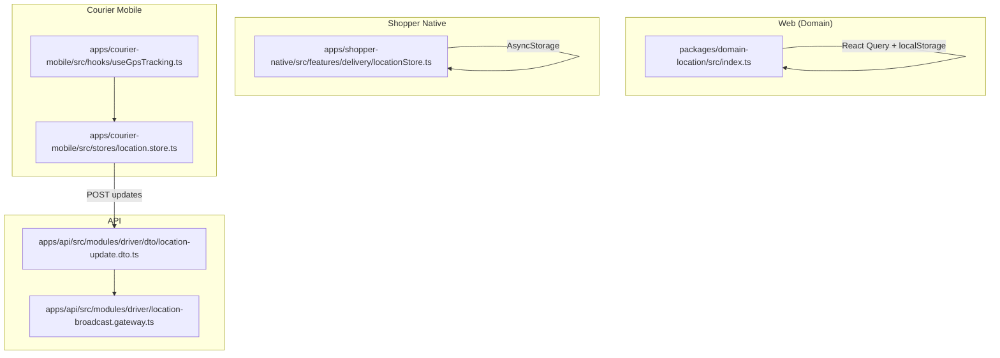
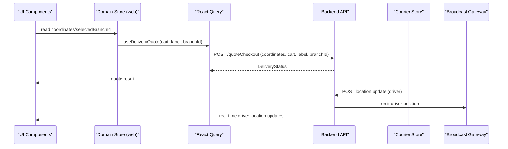
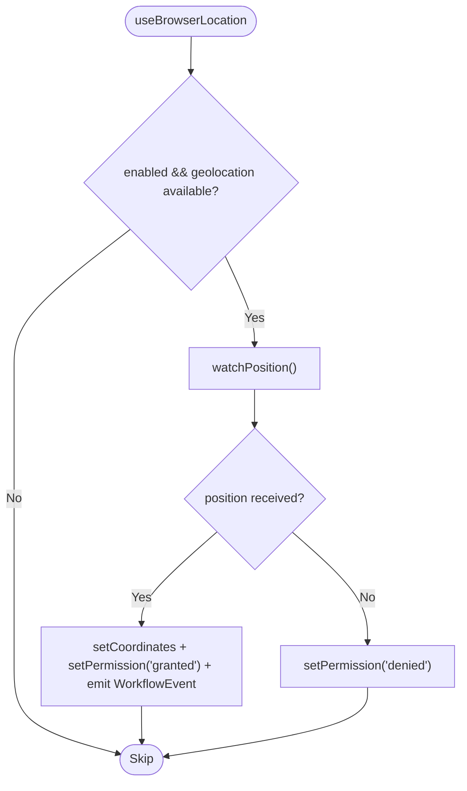
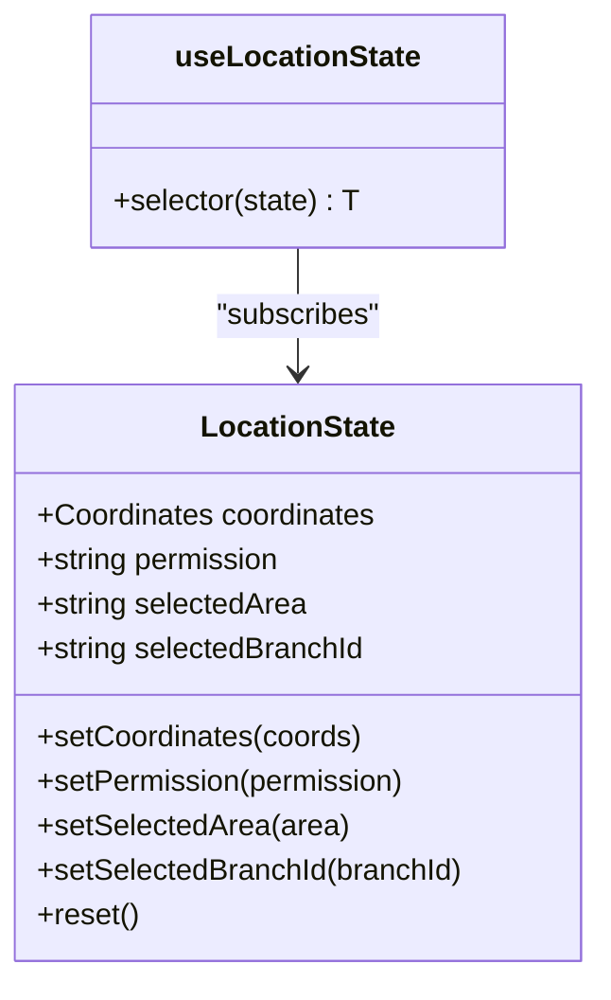
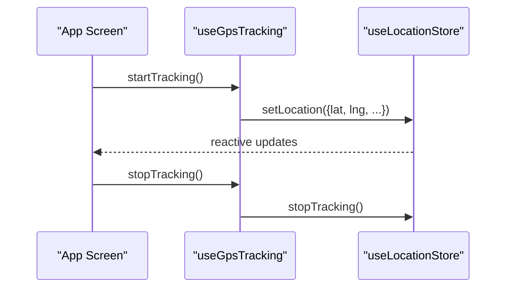
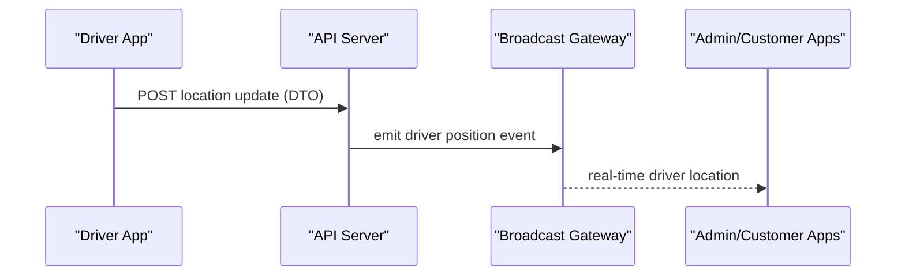
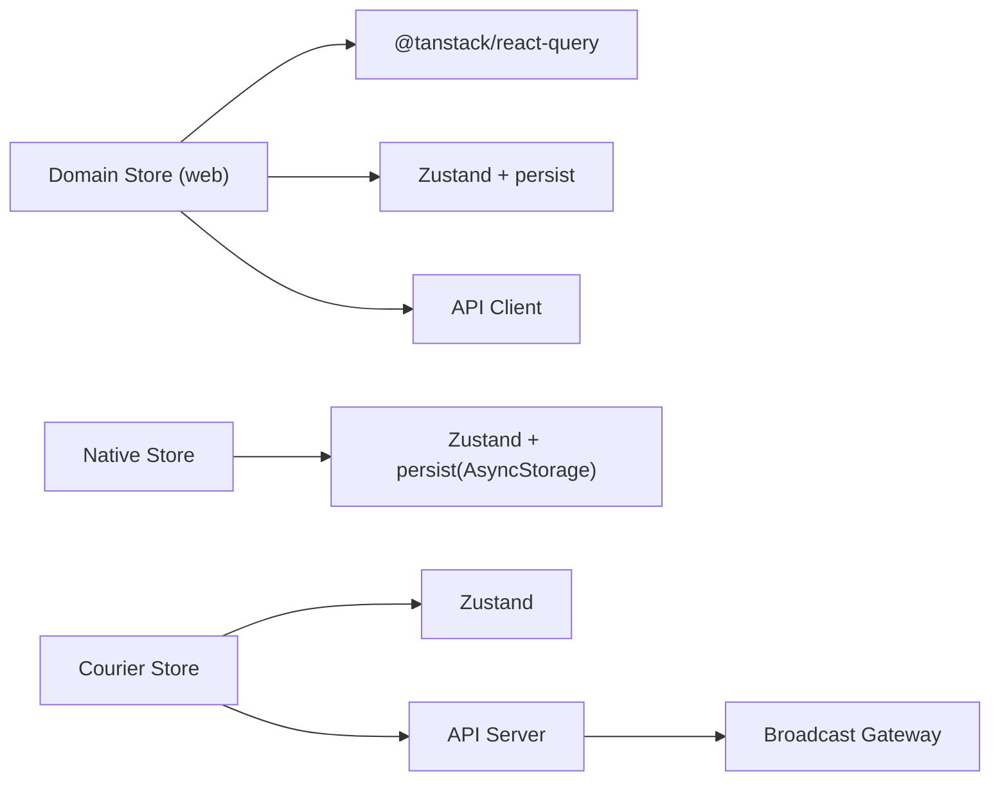

# Location State Management

<cite>
**Referenced Files in This Document**
- [location.store.ts](file://apps/courier-mobile/src/stores/location.store.ts)
- [locationStore.ts](file://apps/shopper-native/src/features/delivery/locationStore.ts)
- [index.ts](file://packages/domain-location/src/index.ts)
- [useGpsTracking.ts](file://apps/courier-mobile/src/hooks/useGpsTracking.ts)
- [location-update.dto.ts](file://apps/api/src/modules/driver/dto/location-update.dto.ts)
- [location-broadcast.gateway.ts](file://apps/api/src/modules/driver/location-broadcast.gateway.ts)
</cite>

## Table of Contents
1. Introduction
2. Project Structure
3. Core Components
4. Architecture Overview
5. Detailed Component Analysis
6. Dependency Analysis
7. Performance Considerations
8. Troubleshooting Guide
9. Conclusion

## Introduction
This document explains the location state management architecture across applications, focusing on:
- Store design patterns for location data
- User location caching and persistence
- Driver location synchronization with the backend
- Location history tracking and offline storage strategies
- Integration with React Query for data fetching and caching
- Use of Zustand for global state management
- Local storage/AsyncStorage for offline capabilities
- Location validation, coordinate transformation, and distance calculation utilities

The system is implemented in multiple apps (web, native mobile, courier mobile) and a shared domain package that centralizes reusable logic.

## Project Structure
Location state is managed differently per platform but follows consistent patterns:
- Web (domain package): Centralized store with localStorage persistence and React Query integration for delivery quotes
- Native mobile (shopper): Zustand store with AsyncStorage persistence for delivery context
- Courier mobile: Lightweight Zustand store for GPS tracking state and lifecycle control

**Diagram sources**
- [index.ts:21-47](file://packages/domain-location/src/index.ts#L21-L47)
- [locationStore.ts:56-86](file://apps/shopper-native/src/features/delivery/locationStore.ts#L56-L86)
- [location.store.ts:32-43](file://apps/courier-mobile/src/stores/location.store.ts#L32-L43)
- [useGpsTracking.ts](file://apps/courier-mobile/src/hooks/useGpsTracking.ts)
- [location-update.dto.ts](file://apps/api/src/modules/driver/dto/location-update.dto.ts)
- [location-broadcast.gateway.ts](file://apps/api/src/modules/driver/location-broadcast.gateway.ts)

**Section sources**
- [index.ts:21-47](file://packages/domain-location/src/index.ts#L21-L47)
- [locationStore.ts:56-86](file://apps/shopper-native/src/features/delivery/locationStore.ts#L56-L86)
- [location.store.ts:32-43](file://apps/courier-mobile/src/stores/location.store.ts#L32-L43)

## Core Components
- Domain location store (web): Provides coordinates, permission state, selected area/branch, and integrates with React Query to fetch delivery quotes based on cart and location. Persists state to localStorage.
- Shopper native location store: Holds coordinates, permission, selected area, and selected branch; persists via AsyncStorage; exposes selector-based subscriptions for efficient re-renders.
- Courier mobile location store: Tracks current GPS metrics (latitude, longitude, heading, speed, accuracy, altitude), tracking lifecycle flags, and last updated timestamp.
- API driver location endpoints: DTO defines incoming location update payloads; broadcast gateway emits real-time updates to clients.

Key responsibilities:
- Capture and persist user/driver location
- Derive delivery quotes using coordinates and cart
- Synchronize driver locations to backend and broadcast to subscribers
- Provide granular selectors to minimize re-renders

**Section sources**
- [index.ts:10-19](file://packages/domain-location/src/index.ts#L10-L19)
- [index.ts:78-112](file://packages/domain-location/src/index.ts#L78-L112)
- [index.ts:114-144](file://packages/domain-location/src/index.ts#L114-L144)
- [locationStore.ts:35-52](file://apps/shopper-native/src/features/delivery/locationStore.ts#L35-L52)
- [locationStore.ts:88-101](file://apps/shopper-native/src/features/delivery/locationStore.ts#L88-L101)
- [location.store.ts:3-19](file://apps/courier-mobile/src/stores/location.store.ts#L3-L19)
- [location.store.ts:32-43](file://apps/courier-mobile/src/stores/location.store.ts#L32-L43)
- [location-update.dto.ts](file://apps/api/src/modules/driver/dto/location-update.dto.ts)
- [location-broadcast.gateway.ts](file://apps/api/src/modules/driver/location-broadcast.gateway.ts)

## Architecture Overview
The architecture separates concerns by platform while sharing concepts:
- Web: A single domain package manages location state and integrates with React Query for quote retrieval. Coordinates are rounded to reduce cache churn.
- Native: A dedicated store persists delivery context locally and exposes fine-grained hooks for consumers.
- Courier: A lightweight store tracks live GPS telemetry and lifecycle, pushing updates to the API.

**Diagram sources**
- [index.ts:114-144](file://packages/domain-location/src/index.ts#L114-L144)
- [location.store.ts:32-43](file://apps/courier-mobile/src/stores/location.store.ts#L32-L43)
- [location-broadcast.gateway.ts](file://apps/api/src/modules/driver/location-broadcast.gateway.ts)

## Detailed Component Analysis

### Web Domain Location Store (packages/domain-location)
- State shape: coordinates, permission, selectedArea, selectedBranchId
- Persistence: persisted to localStorage via Zustand middleware
- Browser geolocation: watches navigator.geolocation and updates store; emits workflow events
- Delivery quote query: builds a stable signature from cart items and coordinates (rounded to ~11m) to optimize React Query cache; fetches quote and emits workflow events

**Diagram sources**
- [index.ts:78-112](file://packages/domain-location/src/index.ts#L78-L112)

**Section sources**
- [index.ts:21-47](file://packages/domain-location/src/index.ts#L21-L47)
- [index.ts:49-70](file://packages/domain-location/src/index.ts#L49-L70)
- [index.ts:78-112](file://packages/domain-location/src/index.ts#L78-L112)
- [index.ts:114-144](file://packages/domain-location/src/index.ts#L114-L144)

### Shopper Native Location Store (apps/shopper-native)
- State shape: coordinates, permission, selectedArea, selectedBranchId
- Persistence: persisted to AsyncStorage via Zustand middleware
- Selectors: provides a helper hook to subscribe to specific fields for performance
- Purpose: central source of truth for delivery context used by pricing and checkout flows

**Diagram sources**
- [locationStore.ts:35-52](file://apps/shopper-native/src/features/delivery/locationStore.ts#L35-L52)
- [locationStore.ts:88-101](file://apps/shopper-native/src/features/delivery/locationStore.ts#L88-L101)

**Section sources**
- [locationStore.ts:35-52](file://apps/shopper-native/src/features/delivery/locationStore.ts#L35-L52)
- [locationStore.ts:56-86](file://apps/shopper-native/src/features/delivery/locationStore.ts#L56-L86)
- [locationStore.ts:88-101](file://apps/shopper-native/src/features/delivery/locationStore.ts#L88-L101)

### Courier Mobile Location Store and GPS Hook
- Store: holds live GPS metrics and tracking lifecycle; updates lastUpdated timestamp on change
- Hook: orchestrates starting/stopping tracking and updating the store (implementation details in the hook file)

**Diagram sources**
- [location.store.ts:32-43](file://apps/courier-mobile/src/stores/location.store.ts#L32-L43)
- [useGpsTracking.ts](file://apps/courier-mobile/src/hooks/useGpsTracking.ts)

**Section sources**
- [location.store.ts:3-19](file://apps/courier-mobile/src/stores/location.store.ts#L3-L19)
- [location.store.ts:32-43](file://apps/courier-mobile/src/stores/location.store.ts#L32-L43)
- [useGpsTracking.ts](file://apps/courier-mobile/src/hooks/useGpsTracking.ts)

### Driver Location Synchronization (API)
- DTO: defines the structure of incoming driver location updates
- Broadcast gateway: emits driver positions to connected clients for real-time tracking

**Diagram sources**
- [location-update.dto.ts](file://apps/api/src/modules/driver/dto/location-update.dto.ts)
- [location-broadcast.gateway.ts](file://apps/api/src/modules/driver/location-broadcast.gateway.ts)

**Section sources**
- [location-update.dto.ts](file://apps/api/src/modules/driver/dto/location-update.dto.ts)
- [location-broadcast.gateway.ts](file://apps/api/src/modules/driver/location-broadcast.gateway.ts)

## Dependency Analysis
- Web domain store depends on:
  - React Query for declarative data fetching and caching
  - Zustand with persistence middleware for local storage
  - API client for quote requests
  - Workflow events for analytics/metrics
- Native store depends on:
  - Zustand with persistence middleware for AsyncStorage
  - Selector-based subscriptions to avoid unnecessary re-renders
- Courier store depends on:
  - Platform geolocation APIs (via hook)
  - Zustand store for state
- API layer depends on:
  - DTOs for request validation
  - WebSocket/broadcast gateway for real-time distribution

**Diagram sources**
- [index.ts:2-8](file://packages/domain-location/src/index.ts#L2-L8)
- [index.ts:21-47](file://packages/domain-location/src/index.ts#L21-L47)
- [locationStore.ts:31-33](file://apps/shopper-native/src/features/delivery/locationStore.ts#L31-L33)
- [location.store.ts:1-2](file://apps/courier-mobile/src/stores/location.store.ts#L1-L2)
- [location-broadcast.gateway.ts](file://apps/api/src/modules/driver/location-broadcast.gateway.ts)

**Section sources**
- [index.ts:2-8](file://packages/domain-location/src/index.ts#L2-L8)
- [index.ts:21-47](file://packages/domain-location/src/index.ts#L21-L47)
- [locationStore.ts:31-33](file://apps/shopper-native/src/features/delivery/locationStore.ts#L31-L33)
- [location.store.ts:1-2](file://apps/courier-mobile/src/stores/location.store.ts#L1-L2)

## Performance Considerations
- Coordinate rounding: The web domain store rounds coordinates to four decimal places (~11 meters) to stabilize React Query keys and reduce cache churn.
- Selectors: Native store encourages field-level selectors to limit re-renders to only what changed.
- Geolocation options: The browser watcher uses reasonable timeouts and maximumAge to balance accuracy and battery usage.
- Persistence scope: Only necessary fields are persisted to avoid bloating storage.
- Real-time updates: Driver location broadcasting should be rate-limited at the API level to prevent excessive network traffic.

[No sources needed since this section provides general guidance]

## Troubleshooting Guide
Common issues and resolutions:
- Permission denied: Ensure the app requests location permissions and handles the denied state gracefully. The web store sets permission to "denied" when geolocation fails.
- Stale quotes: Verify that coordinates are present and that the cart has items before triggering quote queries.
- Excessive re-renders: Confirm that components subscribe via selectors rather than the entire store.
- Offline behavior: Persisted stores recover state after restarts; ensure storage keys match expected versions.
- Driver not visible on map: Confirm that driver location updates are being sent and broadcast correctly; check network connectivity and gateway subscriptions.

**Section sources**
- [index.ts:78-112](file://packages/domain-location/src/index.ts#L78-L112)
- [locationStore.ts:56-86](file://apps/shopper-native/src/features/delivery/locationStore.ts#L56-L86)
- [location-store.ts:32-43](file://apps/courier-mobile/src/stores/location.store.ts#L32-L43)

## Conclusion
The location state management architecture leverages:
- Zustand stores for cross-platform global state with platform-appropriate persistence (localStorage vs AsyncStorage)
- React Query for robust data fetching and caching of delivery quotes
- Real-time driver location synchronization via API and broadcast gateway
- Careful attention to performance through coordinate rounding, selectors, and minimal persistence
This design ensures consistent behavior across web and native apps while supporting offline-first capabilities and scalable real-time features.

[No sources needed since this section summarizes without analyzing specific files]